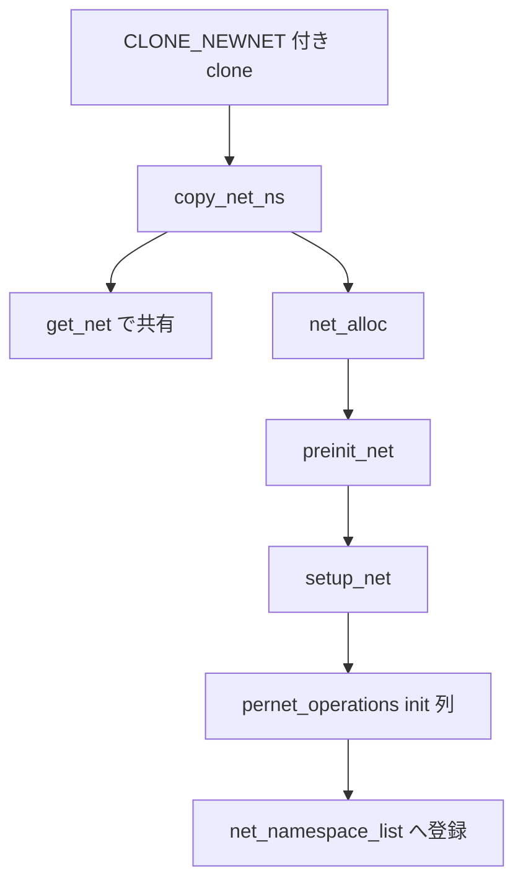

# 第10章 network namespace の概観

> **本章で読むソース**
>
> - [`include/net/net_namespace.h` L61-L107](https://github.com/gregkh/linux/blob/v6.18.38/include/net/net_namespace.h#L61-L107)
> - [`net/core/net_namespace.c` L401-L430](https://github.com/gregkh/linux/blob/v6.18.38/net/core/net_namespace.c#L401-L430)
> - [`net/core/net_namespace.c` L435-L464](https://github.com/gregkh/linux/blob/v6.18.38/net/core/net_namespace.c#L435-L464)
> - [`net/core/net_namespace.c` L480-L512](https://github.com/gregkh/linux/blob/v6.18.38/net/core/net_namespace.c#L480-L512)
> - [`net/core/net_namespace.c` L550-L597](https://github.com/gregkh/linux/blob/v6.18.38/net/core/net_namespace.c#L550-L597)
> - [`net/core/net_namespace.c` L738-L744](https://github.com/gregkh/linux/blob/v6.18.38/net/core/net_namespace.c#L738-L744)
> - [`net/core/net_namespace.c` L658-L717](https://github.com/gregkh/linux/blob/v6.18.38/net/core/net_namespace.c#L658-L717)

## この章の狙い

**network namespace** が `struct net` としてどう表現され、`copy_net_ns` と `setup_net` が新 namespace をどう構築するかの概観を押さえる。
ソケット、ルーティング、netfilter の個別経路は network 分冊へ委譲し、本分冊では `nsproxy` から見える入口だけを読む。

## 前提

- [第3章 clone、unshare、setns の入口](../part00-foundation/03-clone-unshare-setns.md)
- [第1章 隔離と資源制御の全体像](../part00-foundation/01-isolation-overview.md)

## 分冊間の境界

| トピック | 本分冊 | 委譲先 |
|---|---|---|
| `copy_net_ns` と `setup_net` の入口 | 本章 | |
| デバイス登録と `rtnl` | 参照のみ | network 分冊 |
| ソケット作成とプロトコルスタック | 参照のみ | network 分冊 |
| netfilter と conntrack | 参照のみ | network 分冊 |

## struct net の骨格

network namespace は `struct net` として表現され、`ns_common` を埋め込む。
先頭キャッシュラインは書き込み頻度の高いフィールドに割り当てられている。

[`include/net/net_namespace.h` L61-L107](https://github.com/gregkh/linux/blob/v6.18.38/include/net/net_namespace.h#L61-L107)

```c
struct net {
	/* First cache line can be often dirtied.
	 * Do not place here read-mostly fields.
	 */
	refcount_t		passive;	/* To decide when the network
						 * namespace should be freed.
						 */
	spinlock_t		rules_mod_lock;

	unsigned int		dev_base_seq;	/* protected by rtnl_mutex */
	u32			ifindex;

	spinlock_t		nsid_lock;
	atomic_t		fnhe_genid;

	struct list_head	list;		/* list of network namespaces */
	struct list_head	exit_list;	/* To linked to call pernet exit
						 * methods on dead net (
						 * pernet_ops_rwsem read locked),
						 * or to unregister pernet ops
						 * (pernet_ops_rwsem write locked).
						 */
	struct llist_node	defer_free_list;
	struct llist_node	cleanup_list;	/* namespaces on death row */

	struct list_head ptype_all;
	struct list_head ptype_specific;

#ifdef CONFIG_KEYS
	struct key_tag		*key_domain;	/* Key domain of operation tag */
#endif
	struct user_namespace   *user_ns;	/* Owning user namespace */
	struct ucounts		*ucounts;
	struct idr		netns_ids;

	struct ns_common	ns;
	struct ref_tracker_dir  refcnt_tracker;
	struct ref_tracker_dir  notrefcnt_tracker; /* tracker for objects not
						    * refcounted against netns
						    */
	struct list_head 	dev_base_head;
	struct proc_dir_entry 	*proc_net;
	struct proc_dir_entry 	*proc_net_stat;

#ifdef CONFIG_SYSCTL
	struct ctl_table_set	sysctls;
#endif
```

`passive` は mount namespace の同名フィールドと同型の考え方で、namespace を pin しない参照を数える。
`dev_base_head` 以下にネットワークデバイスがぶら下がるが、デバイス操作の詳細は本章の範囲外である。

## preinit_net と setup_net

`copy_net_ns` は `preinit_net` で `struct net` の基本フィールドを初期化し、続けて `setup_net` が `pernet_operations` 登録済みの初期化関数を順に呼ぶ。

[`net/core/net_namespace.c` L401-L430](https://github.com/gregkh/linux/blob/v6.18.38/net/core/net_namespace.c#L401-L430)

```c
static __net_init int preinit_net(struct net *net, struct user_namespace *user_ns)
{
	int ret;

	ret = ns_common_init(net);
	if (ret)
		return ret;

	refcount_set(&net->passive, 1);
	ref_tracker_dir_init(&net->refcnt_tracker, 128, "net_refcnt");
	ref_tracker_dir_init(&net->notrefcnt_tracker, 128, "net_notrefcnt");

	get_random_bytes(&net->hash_mix, sizeof(u32));
	net->dev_base_seq = 1;
	net->user_ns = user_ns;

	idr_init(&net->netns_ids);
	spin_lock_init(&net->nsid_lock);
	mutex_init(&net->ipv4.ra_mutex);

#ifdef CONFIG_DEBUG_NET_SMALL_RTNL
	mutex_init(&net->rtnl_mutex);
	lock_set_cmp_fn(&net->rtnl_mutex, rtnl_net_lock_cmp_fn, NULL);
#endif

	INIT_LIST_HEAD(&net->ptype_all);
	INIT_LIST_HEAD(&net->ptype_specific);
	preinit_net_sysctl(net);
	return 0;
}
```

[`net/core/net_namespace.c` L435-L464](https://github.com/gregkh/linux/blob/v6.18.38/net/core/net_namespace.c#L435-L464)

```c
static __net_init int setup_net(struct net *net)
{
	/* Must be called with pernet_ops_rwsem held */
	const struct pernet_operations *ops;
	LIST_HEAD(net_exit_list);
	int error = 0;

	net->net_cookie = ns_tree_gen_id(&net->ns);

	list_for_each_entry(ops, &pernet_list, list) {
		error = ops_init(ops, net);
		if (error < 0)
			goto out_undo;
	}
	down_write(&net_rwsem);
	list_add_tail_rcu(&net->list, &net_namespace_list);
	up_write(&net_rwsem);
	ns_tree_add_raw(net);
out:
	return error;

out_undo:
	/* Walk through the list backwards calling the exit functions
	 * for the pernet modules whose init functions did not fail.
	 */
	list_add(&net->exit_list, &net_exit_list);
	ops_undo_list(&pernet_list, ops, &net_exit_list, false);
	rcu_barrier();
	goto out;
}
```

`pernet_list` に登録された各サブシステムの `init` が走り、IPv4、IPv6、unix ソケットなどが namespace ごとの状態を割り当てる。
いずれかの `ops_init` が失敗すれば `out_undo` でそれまでに成功したモジュールを巻き戻す。

## copy_net_ns による作成

[`net/core/net_namespace.c` L550-L597](https://github.com/gregkh/linux/blob/v6.18.38/net/core/net_namespace.c#L550-L597)

```c
struct net *copy_net_ns(u64 flags,
			struct user_namespace *user_ns, struct net *old_net)
{
	struct ucounts *ucounts;
	struct net *net;
	int rv;

	if (!(flags & CLONE_NEWNET))
		return get_net(old_net);

	ucounts = inc_net_namespaces(user_ns);
	if (!ucounts)
		return ERR_PTR(-ENOSPC);

	net = net_alloc();
	if (!net) {
		rv = -ENOMEM;
		goto dec_ucounts;
	}

	rv = preinit_net(net, user_ns);
	if (rv < 0)
		goto dec_ucounts;
	net->ucounts = ucounts;
	get_user_ns(user_ns);

	rv = down_read_killable(&pernet_ops_rwsem);
	if (rv < 0)
		goto put_userns;

	rv = setup_net(net);

	up_read(&pernet_ops_rwsem);

	if (rv < 0) {
put_userns:
		ns_common_free(net);
#ifdef CONFIG_KEYS
		key_remove_domain(net->key_domain);
#endif
		put_user_ns(user_ns);
		net_passive_dec(net);
dec_ucounts:
		dec_net_namespaces(ucounts);
		return ERR_PTR(rv);
	}
	return net;
}
```

`CLONE_NEWNET` がなければ `get_net` で親 namespace を共有する。
新規作成時は `net_alloc` で骨格を確保し、`setup_net` 完了後にのみ namespace が有効になる。

## 処理フロー



## 高速化と最適化の工夫

`net_alloc` は `struct net` 本体と `net_generic` ポインタ配列を分離して確保する。
サブシステムごとに可変長の per-net データが `net_generic` に載るため、全 `struct net` のサイズを最大サブシステムに合わせて膨らませない。

[`net/core/net_namespace.c` L480-L512](https://github.com/gregkh/linux/blob/v6.18.38/net/core/net_namespace.c#L480-L512)

```c
static struct net *net_alloc(void)
{
	struct net *net = NULL;
	struct net_generic *ng;

	ng = net_alloc_generic();
	if (!ng)
		goto out;

	net = kmem_cache_zalloc(net_cachep, GFP_KERNEL);
	if (!net)
		goto out_free;

#ifdef CONFIG_KEYS
	net->key_domain = kzalloc(sizeof(struct key_tag), GFP_KERNEL);
	if (!net->key_domain)
		goto out_free_2;
	refcount_set(&net->key_domain->usage, 1);
#endif

	rcu_assign_pointer(net->gen, ng);
out:
	return net;

#ifdef CONFIG_KEYS
out_free_2:
	kmem_cache_free(net_cachep, net);
	net = NULL;
#endif
out_free:
	kfree(ng);
	goto out;
}
```

`copy_net_ns` の fast path はフラグなし fork が network namespace 作成と `setup_net` コストを回避する。

## put_net と cleanup_net による遅延破棄

最後の参照が `__put_net` で落ちると、namespace は即座に解放されず `cleanup_list` に載って workqueue へ送られる。
`cleanup_net` がグローバルリストから外し、`pernet_operations` の exit を走らせ、RCU 猶予のあと `net_passive_dec` で `struct net` を返す。

[`net/core/net_namespace.c` L738-L744](https://github.com/gregkh/linux/blob/v6.18.38/net/core/net_namespace.c#L738-L744)

```c
void __put_net(struct net *net)
{
	ref_tracker_dir_exit(&net->refcnt_tracker);
	/* Cleanup the network namespace in process context */
	if (llist_add(&net->cleanup_list, &cleanup_list))
		queue_work(netns_wq, &net_cleanup_work);
}
```

[`net/core/net_namespace.c` L658-L717](https://github.com/gregkh/linux/blob/v6.18.38/net/core/net_namespace.c#L658-L717)

```c
static void cleanup_net(struct work_struct *work)
{
	struct llist_node *net_kill_list;
	struct net *net, *tmp, *last;
	LIST_HEAD(net_exit_list);

	WRITE_ONCE(cleanup_net_task, current);

	/* Atomically snapshot the list of namespaces to cleanup */
	net_kill_list = llist_del_all(&cleanup_list);

	down_read(&pernet_ops_rwsem);

	/* Don't let anyone else find us. */
	down_write(&net_rwsem);
	llist_for_each_entry(net, net_kill_list, cleanup_list) {
		ns_tree_remove(net);
		list_del_rcu(&net->list);
	}
	/* Cache last net. After we unlock rtnl, no one new net
	 * added to net_namespace_list can assign nsid pointer
	 * to a net from net_kill_list (see peernet2id_alloc()).
	 * So, we skip them in unhash_nsid().
	 *
	 * Note, that unhash_nsid() does not delete nsid links
	 * between net_kill_list's nets, as they've already
	 * deleted from net_namespace_list. But, this would be
	 * useless anyway, as netns_ids are destroyed there.
	 */
	last = list_last_entry(&net_namespace_list, struct net, list);
	up_write(&net_rwsem);

	llist_for_each_entry(net, net_kill_list, cleanup_list) {
		unhash_nsid(net, last);
		list_add_tail(&net->exit_list, &net_exit_list);
	}

	ops_undo_list(&pernet_list, NULL, &net_exit_list, true);

	up_read(&pernet_ops_rwsem);

	/* Ensure there are no outstanding rcu callbacks using this
	 * network namespace.
	 */
	rcu_barrier();

	net_complete_free();

	/* Finally it is safe to free my network namespace structure */
	list_for_each_entry_safe(net, tmp, &net_exit_list, exit_list) {
		list_del_init(&net->exit_list);
		ns_common_free(net);
		dec_net_namespaces(net->ucounts);
#ifdef CONFIG_KEYS
		key_remove_domain(net->key_domain);
#endif
		put_user_ns(net->user_ns);
		net_passive_dec(net);
	}
	WRITE_ONCE(cleanup_net_task, NULL);
```

namespace 破棄は workqueue と `passive` 参照カウントで遅延させ、ソケットやデバイス参照が残る間は `struct net` を保持する。

## まとめ

network namespace は `struct net` と `pernet_operations` 初期化列で構築される。
`copy_net_ns` が clone 経路の入口であり、`setup_net` がサブシステム横断の namespace 状態を割り当てる。
ソケットやルーティングの個別経路は network 分冊で読む。
次章では time namespace がクロックオフセットと vDSO をどう切り替えるかを読む。

## 関連する章

- [第11章 time namespace](11-time-namespace.md)
- [network 分冊の README](../../net/README.md)
