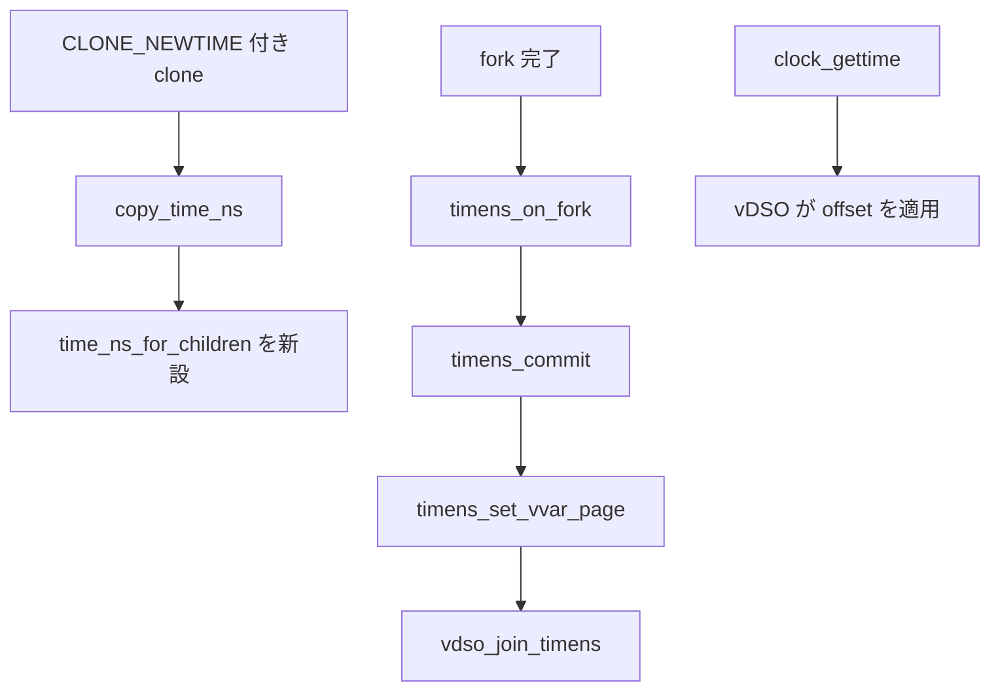

# 第10章 time namespace

> **本章で読むソース**
>
> - [`include/linux/time_namespace.h` L18-L31](https://github.com/gregkh/linux/blob/v6.18.38/include/linux/time_namespace.h#L18-L31)
> - [`kernel/time/namespace.c` L24-L58](https://github.com/gregkh/linux/blob/v6.18.38/kernel/time/namespace.c#L24-L58)
> - [`kernel/time/namespace.c` L132-L139](https://github.com/gregkh/linux/blob/v6.18.38/kernel/time/namespace.c#L132-L139)
> - [`kernel/time/namespace.c` L178-L192](https://github.com/gregkh/linux/blob/v6.18.38/kernel/time/namespace.c#L178-L192)
> - [`kernel/time/namespace.c` L218-L251](https://github.com/gregkh/linux/blob/v6.18.38/kernel/time/namespace.c#L218-L251)
> - [`kernel/time/namespace.c` L383-L461](https://github.com/gregkh/linux/blob/v6.18.38/kernel/time/namespace.c#L383-L461)
> - [`kernel/time/namespace.c` L329-L343](https://github.com/gregkh/linux/blob/v6.18.38/kernel/time/namespace.c#L329-L343)

## この章の狙い

**time namespace** がモノトニッククロックと boottime のオフセットをどう保持し、vDSO 経由の時刻取得にどう反映するかを読む。
`nsproxy` の `time_ns` と `time_ns_for_children` の二ポインタ構造と、fork 時の `timens_on_fork` を押さえる。

## 前提

- [第2章 nsproxy と namespace のライフサイクル](../part00-foundation/02-nsproxy-lifecycle.md)
- [第3章 clone、unshare、setns の入口](../part00-foundation/03-clone-unshare-setns.md)

## time_namespace と timens_offsets

time namespace はオフセット集合と vDSO 用の専用ページを持つ。

[`include/linux/time_namespace.h` L18-L31](https://github.com/gregkh/linux/blob/v6.18.38/include/linux/time_namespace.h#L18-L31)

```c
struct timens_offsets {
	struct timespec64 monotonic;
	struct timespec64 boottime;
};

struct time_namespace {
	struct user_namespace	*user_ns;
	struct ucounts		*ucounts;
	struct ns_common	ns;
	struct timens_offsets	offsets;
	struct page		*vvar_page;
	/* If set prevents changing offsets after any task joined namespace. */
	bool			frozen_offsets;
} __randomize_layout;
```

`offsets.monotonic` と `offsets.boottime` が namespace 内の時刻のずれを定義する。
`vvar_page` は time namespace 専用の VVAR ページであり、vDSO がオフセット付きクロックを読むために使う。

第1章で述べたとおり、`nsproxy` は `time_ns` と `time_ns_for_children` の二つを持つ。
子プロセスが入る time namespace は `time_ns_for_children` が指し、実行中タスクの実効オフセットは `time_ns` が指す。

## proc_timens_set_offset によるオフセット設定

`/proc/<pid>/timens_offsets` への書き込みは `proc_timens_set_offset` が処理する。
対象は `timens_for_children_get` で得た子向け time namespace であり、`CAP_SYS_TIME` と clock ID、値域、加算後の飽和を検査する。
`offset_lock` の下で `frozen_offsets` が立っていなければ `monotonic` と `boottime` のオフセットを更新できる。

[`kernel/time/namespace.c` L383-L461](https://github.com/gregkh/linux/blob/v6.18.38/kernel/time/namespace.c#L383-L461)

```c
int proc_timens_set_offset(struct file *file, struct task_struct *p,
			   struct proc_timens_offset *offsets, int noffsets)
{
	struct ns_common *ns;
	struct time_namespace *time_ns;
	struct timespec64 tp;
	int i, err;

	ns = timens_for_children_get(p);
	if (!ns)
		return -ESRCH;
	time_ns = to_time_ns(ns);

	if (!file_ns_capable(file, time_ns->user_ns, CAP_SYS_TIME)) {
		put_time_ns(time_ns);
		return -EPERM;
	}

	for (i = 0; i < noffsets; i++) {
		struct proc_timens_offset *off = &offsets[i];

		switch (off->clockid) {
		case CLOCK_MONOTONIC:
			ktime_get_ts64(&tp);
			break;
		case CLOCK_BOOTTIME:
			ktime_get_boottime_ts64(&tp);
			break;
		default:
			err = -EINVAL;
			goto out;
		}

		err = -ERANGE;

		if (off->val.tv_sec > KTIME_SEC_MAX ||
		    off->val.tv_sec < -KTIME_SEC_MAX)
			goto out;

		tp = timespec64_add(tp, off->val);
		/*
		 * KTIME_SEC_MAX is divided by 2 to be sure that KTIME_MAX is
		 * still unreachable.
		 */
		if (tp.tv_sec < 0 || tp.tv_sec > KTIME_SEC_MAX / 2)
			goto out;
	}

	mutex_lock(&offset_lock);
	if (time_ns->frozen_offsets) {
		err = -EACCES;
		goto out_unlock;
	}

	err = 0;
	/* Don't report errors after this line */
	for (i = 0; i < noffsets; i++) {
		struct proc_timens_offset *off = &offsets[i];
		struct timespec64 *offset = NULL;

		switch (off->clockid) {
		case CLOCK_MONOTONIC:
			offset = &time_ns->offsets.monotonic;
			break;
		case CLOCK_BOOTTIME:
			offset = &time_ns->offsets.boottime;
			break;
		}

		*offset = off->val;
	}

out_unlock:
	mutex_unlock(&offset_lock);
out:
	put_time_ns(time_ns);

	return err;
}
```

`frozen_offsets` が立つ前なら複数回の書き込みが可能である。
一度だけというのは各 map ファイルと同様の「ファイル全体の書き込み回数」ではなく、VVAR 初期化と freeze 遷移が一度きりである点を指す。

## do_timens_ktime_to_host による変換

`do_timens_ktime_to_host` は、namespace 内で指定された絶対タイマーの期限をホスト側 ktime へ変換する。
`timerfd`、POSIX timer、alarm timer、futex timeout の各経路で使われる。
namespace 内の絶対期限からオフセットを差し引き、ホスト時刻系の期限へ変換する。

[`kernel/time/namespace.c` L24-L58](https://github.com/gregkh/linux/blob/v6.18.38/kernel/time/namespace.c#L24-L58)

```c
ktime_t do_timens_ktime_to_host(clockid_t clockid, ktime_t tim,
				struct timens_offsets *ns_offsets)
{
	ktime_t offset;

	switch (clockid) {
	case CLOCK_MONOTONIC:
		offset = timespec64_to_ktime(ns_offsets->monotonic);
		break;
	case CLOCK_BOOTTIME:
	case CLOCK_BOOTTIME_ALARM:
		offset = timespec64_to_ktime(ns_offsets->boottime);
		break;
	default:
		return tim;
	}

	/*
	 * Check that @tim value is in [offset, KTIME_MAX + offset]
	 * and subtract offset.
	 */
	if (tim < offset) {
		/*
		 * User can specify @tim *absolute* value - if it's lesser than
		 * the time namespace's offset - it's already expired.
		 */
		tim = 0;
	} else {
		tim = ktime_sub(tim, offset);
		if (unlikely(tim > KTIME_MAX))
			tim = KTIME_MAX;
	}

	return tim;
}
```

`CLOCK_REALTIME` はオフセット対象外であり、namespace 内でもホストの壁時計を共有する。
`tim < offset` の分岐は、すでに期限切れの絶対時刻指定をゼロへ丸める正しさの処理である。

## copy_time_ns と子向け namespace

[`kernel/time/namespace.c` L132-L139](https://github.com/gregkh/linux/blob/v6.18.38/kernel/time/namespace.c#L132-L139)

```c
struct time_namespace *copy_time_ns(u64 flags,
	struct user_namespace *user_ns, struct time_namespace *old_ns)
{
	if (!(flags & CLONE_NEWTIME))
		return get_time_ns(old_ns);

	return clone_time_ns(user_ns, old_ns);
}
```

`CLONE_NEWTIME` は `time_ns_for_children` 向けの新 namespace を作る。
`create_new_namespaces` は `time_ns_for_children` に結果を入れ、fork 後の `timens_on_fork` が実行中タスクの `time_ns` を同期する。

## vDSO へのオフセット注入

time namespace タスクの vDSO は `VDSO_CLOCKMODE_TIMENS` を立て、オフセット配列を VVAR ページに書き込む。

[`kernel/time/namespace.c` L178-L192](https://github.com/gregkh/linux/blob/v6.18.38/kernel/time/namespace.c#L178-L192)

```c
static void timens_setup_vdso_clock_data(struct vdso_clock *vc,
					 struct time_namespace *ns)
{
	struct timens_offset *offset = vc->offset;
	struct timens_offset monotonic = offset_from_ts(ns->offsets.monotonic);
	struct timens_offset boottime = offset_from_ts(ns->offsets.boottime);

	vc->seq				= 1;
	vc->clock_mode			= VDSO_CLOCKMODE_TIMENS;
	offset[CLOCK_MONOTONIC]		= monotonic;
	offset[CLOCK_MONOTONIC_RAW]	= monotonic;
	offset[CLOCK_MONOTONIC_COARSE]	= monotonic;
	offset[CLOCK_BOOTTIME]		= boottime;
	offset[CLOCK_BOOTTIME_ALARM]	= boottime;
}
```

コメントが述べるとおり、通常タスクの vDSO は seqlock の fast path で `clock_mode` 検査を避け、time namespace タスクだけが `VDSO_CLOCKMODE_TIMENS` 経路に入る。

## timens_set_vvar_page と fork 時の同期

最初に namespace に入ったタスクだけが `vvar_page` を初期化し、以降は `frozen_offsets` でオフセット変更を禁止する。

[`kernel/time/namespace.c` L218-L251](https://github.com/gregkh/linux/blob/v6.18.38/kernel/time/namespace.c#L218-L251)

```c
static void timens_set_vvar_page(struct task_struct *task,
				struct time_namespace *ns)
{
	struct vdso_time_data *vdata;
	struct vdso_clock *vc;
	unsigned int i;

	if (ns == &init_time_ns)
		return;

	/* Fast-path, taken by every task in namespace except the first. */
	if (likely(ns->frozen_offsets))
		return;

	mutex_lock(&offset_lock);
	/* Nothing to-do: vvar_page has been already initialized. */
	if (ns->frozen_offsets)
		goto out;

	ns->frozen_offsets = true;
	vdata = page_address(ns->vvar_page);
	vc = vdata->clock_data;

	for (i = 0; i < CS_BASES; i++)
		timens_setup_vdso_clock_data(&vc[i], ns);

	if (IS_ENABLED(CONFIG_POSIX_AUX_CLOCKS)) {
		for (i = 0; i < ARRAY_SIZE(vdata->aux_clock_data); i++)
			timens_setup_vdso_clock_data(&vdata->aux_clock_data[i], ns);
	}

out:
	mutex_unlock(&offset_lock);
}
```

fork 時は `timens_on_fork` が親子の `time_ns` ポインタを揃え、`timens_commit` で vDSO ページを差し替える。

[`kernel/time/namespace.c` L329-L343](https://github.com/gregkh/linux/blob/v6.18.38/kernel/time/namespace.c#L329-L343)

```c
void timens_on_fork(struct nsproxy *nsproxy, struct task_struct *tsk)
{
	struct ns_common *nsc = &nsproxy->time_ns_for_children->ns;
	struct time_namespace *ns = to_time_ns(nsc);

	/* create_new_namespaces() already incremented the ref counter */
	if (nsproxy->time_ns == nsproxy->time_ns_for_children)
		return;

	get_time_ns(ns);
	put_time_ns(nsproxy->time_ns);
	nsproxy->time_ns = ns;

	timens_commit(tsk, ns);
}
```

第2章で述べた `exec_task_namespaces` は、親子ポインタ不一致が exec 後も残ったときに `time_ns` だけを再同期する特殊経路である。

## 処理フロー



## 高速化と最適化の工夫

`timens_set_vvar_page` の `likely(ns->frozen_offsets)` は、namespace 内の二番目以降のタスクが mutex と VVAR 初期化をスキップする fast path である。
`proc_timens_set_offset` は `frozen_offsets` 前なら何度でもオフセットを更新でき、最初のタスク参加時に VVAR が初期化されて以降は凍結済みページを共有する。

vDSO 側は `VDSO_CLOCKMODE_TIMENS` 検査を seqlock の unlikely path に閉じ込め、通常タスクの `clock_gettime` が time namespace コストを払わない。
`do_timens_ktime_to_host` の `unlikely(tim > KTIME_MAX)` はオフセット減算後の飽和を稀な境界として扱う。

> **7.x 系での変化**
> v7.1.3 では [`create_timens` L97 付近](https://github.com/gregkh/linux/blob/v7.1.3/kernel/time/namespace.c#L97) の VVAR ページ確保が `timens_vdso_alloc_vvar_page` に切り出される。
> `proc_timens_set_offset` と `frozen_offsets` による凍結の流れは v6.18.38 と同型である。

## まとめ

time namespace は `timens_offsets` と専用 VVAR ページでモノトニッククロックと boottime をずらす。
`copy_time_ns` が子向け namespace を作り、`timens_on_fork` と `timens_commit` が実行中タスクの vDSO を切り替える。
第1部の namespace 読解はここまでであり、次は cgroup v2 コアへ進む。

## 関連する章

- [第11章 cgroup v2 階層と kernfs](../part02-cgroup-core/11-cgroup-hierarchy-kernfs.md)
- [第2章 nsproxy と namespace のライフサイクル](../part00-foundation/02-nsproxy-lifecycle.md)
