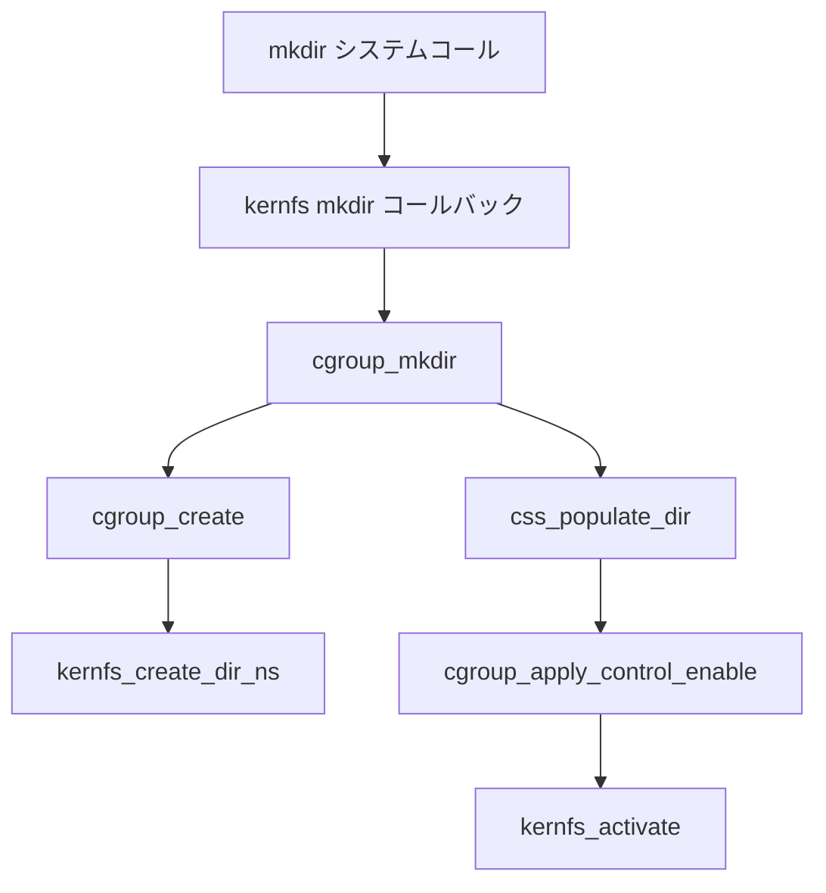

# 第11章 cgroup v2 階層と kernfs

> **本章で読むソース**
>
> - [`kernel/cgroup/cgroup.c` L194-L205](https://github.com/gregkh/linux/blob/v6.18.38/kernel/cgroup/cgroup.c#L194-L205)
> - [`kernel/cgroup/cgroup.c` L781-L801](https://github.com/gregkh/linux/blob/v6.18.38/kernel/cgroup/cgroup.c#L781-L801)
> - [`kernel/cgroup/cgroup.c` L2188-L2208](https://github.com/gregkh/linux/blob/v6.18.38/kernel/cgroup/cgroup.c#L2188-L2208)
> - [`kernel/cgroup/cgroup.c` L2228-L2238](https://github.com/gregkh/linux/blob/v6.18.38/kernel/cgroup/cgroup.c#L2228-L2238)
> - [`kernel/cgroup/cgroup.c` L5858-L5872](https://github.com/gregkh/linux/blob/v6.18.38/kernel/cgroup/cgroup.c#L5858-L5872)
> - [`kernel/cgroup/cgroup.c` L5989-L6040](https://github.com/gregkh/linux/blob/v6.18.38/kernel/cgroup/cgroup.c#L5989-L6040)
> - [`fs/kernfs/dir.c` L1074-L1099](https://github.com/gregkh/linux/blob/v6.18.38/fs/kernfs/dir.c#L1074-L1099)
> - [`fs/kernfs/dir.c` L1420-L1432](https://github.com/gregkh/linux/blob/v6.18.38/fs/kernfs/dir.c#L1420-L1432)

## この章の狙い

cgroup v2 の **default hierarchy** がカーネル内部でどう一本化されているかを読む。
`cgroup_root` と **kernfs** ノードの対応、`cgroup_mkdir` による子 cgroup 作成、そして全タスクが持つ **css_set** との接続を押さえる。

## 前提

- [第1章 隔離と資源制御の全体像](../part00-foundation/01-isolation-overview.md)
- [第3章 clone、unshare、setns の入口](../part00-foundation/03-clone-unshare-setns.md)

## cgroup v2 の単一階層

cgroup v2 ではユーザー空間がマウントする default hierarchy が常に一つである。
カーネルは起動時から `cgrp_dfl_root` を根として保持するが、初回マウントまでは見えない。

[`kernel/cgroup/cgroup.c` L194-L205](https://github.com/gregkh/linux/blob/v6.18.38/kernel/cgroup/cgroup.c#L194-L205)

```c
/* the default hierarchy */
struct cgroup_root cgrp_dfl_root = {
	.cgrp.self.rstat_cpu = &root_rstat_cpu,
	.cgrp.rstat_base_cpu = &root_rstat_base_cpu,
};
EXPORT_SYMBOL_GPL(cgrp_dfl_root);

/*
 * The default hierarchy always exists but is hidden until mounted for the
 * first time.  This is for backward compatibility.
 */
bool cgrp_dfl_visible;
```

v1 互換の個別 hierarchy は `cgroup_roots` リストに複数登録されうるが、v2 コアの主経路は `cgrp_dfl_root` 一本である。
`cgroup_root_count` はマウント済み hierarchy の総数を数え、新しい `css_set` 作成時のリンク数見積もりに使われる。

## cgroup_root と cgroup の対応

`cgroup_root` は hierarchy 全体のメタデータを持ち、その先頭 `cgrp` メンバがルート cgroup 本体である。
`cgroup_setup_root` は kernfs ルートを作成し、既存の全 `css_set` にこの hierarchy のルート cgroup へのリンクを追加する。

[`kernel/cgroup/cgroup.c` L2188-L2208](https://github.com/gregkh/linux/blob/v6.18.38/kernel/cgroup/cgroup.c#L2188-L2208)

```c
	root->kf_root = kernfs_create_root(kf_sops,
					   KERNFS_ROOT_CREATE_DEACTIVATED |
					   KERNFS_ROOT_SUPPORT_EXPORTOP |
					   KERNFS_ROOT_SUPPORT_USER_XATTR |
					   KERNFS_ROOT_INVARIANT_PARENT,
					   root_cgrp);
	if (IS_ERR(root->kf_root)) {
		ret = PTR_ERR(root->kf_root);
		goto exit_root_id;
	}
	root_cgrp->kn = kernfs_root_to_node(root->kf_root);
	WARN_ON_ONCE(cgroup_ino(root_cgrp) != 1);
	root_cgrp->ancestors[0] = root_cgrp;

	ret = css_populate_dir(&root_cgrp->self);
	if (ret)
		goto destroy_root;

	ret = css_rstat_init(&root_cgrp->self);
	if (ret)
		goto destroy_root;
```

`kernfs_create_root` の第2引数に `KERNFS_ROOT_CREATE_DEACTIVATED` を渡すのは、初期化完了までユーザー空間からノードを見えなくするためである。
ルート cgroup の inode 番号は常に 1 であり、`cgroup_ino` がこれを検証する。

## css_set と hierarchy の接続

タスクは `task_struct->cgroups` から `css_set` を辿り、各 hierarchy 上の cgroup 所属を一括参照する。
新しい hierarchy がマウントされると、既存の全 `css_set` にそのルート cgroup への `cgrp_cset_link` が追加される。

[`kernel/cgroup/cgroup.c` L2228-L2238](https://github.com/gregkh/linux/blob/v6.18.38/kernel/cgroup/cgroup.c#L2228-L2238)

```c
	/*
	 * Link the root cgroup in this hierarchy into all the css_set
	 * objects.
	 */
	spin_lock_irq(&css_set_lock);
	hash_for_each(css_set_table, i, cset, hlist) {
		link_css_set(&tmp_links, cset, root_cgrp);
		if (css_set_populated(cset))
			cgroup_update_populated(root_cgrp, true);
	}
	spin_unlock_irq(&css_set_lock);
```

ブート直後のタスクは `init_css_set` を参照する。
これは参照カウントを持たず、子 cgroup が増えるまでは fork 経路のコストを抑える。

[`kernel/cgroup/cgroup.c` L781-L801](https://github.com/gregkh/linux/blob/v6.18.38/kernel/cgroup/cgroup.c#L781-L801)

```c
struct css_set init_css_set = {
	.refcount		= REFCOUNT_INIT(1),
	.dom_cset		= &init_css_set,
	.tasks			= LIST_HEAD_INIT(init_css_set.tasks),
	.mg_tasks		= LIST_HEAD_INIT(init_css_set.mg_tasks),
	.dying_tasks		= LIST_HEAD_INIT(init_css_set.dying_tasks),
	.task_iters		= LIST_HEAD_INIT(init_css_set.task_iters),
	.threaded_csets		= LIST_HEAD_INIT(init_css_set.threaded_csets),
	.cgrp_links		= LIST_HEAD_INIT(init_css_set.cgrp_links),
	.mg_src_preload_node	= LIST_HEAD_INIT(init_css_set.mg_src_preload_node),
	.mg_dst_preload_node	= LIST_HEAD_INIT(init_css_set.mg_dst_preload_node),
	.mg_node		= LIST_HEAD_INIT(init_css_set.mg_node),

	/*
	 * The following field is re-initialized when this cset gets linked
	 * in cgroup_init().  However, let's initialize the field
	 * statically too so that the default cgroup can be accessed safely
	 * early during boot.
	 */
	.dfl_cgrp		= &cgrp_dfl_root.cgrp,
};
```

`dfl_cgrp` は default hierarchy 上の cgroup ポインタであり、v2 固有の threaded 判定や freezer 連携の起点になる。

## kernfs ノードと cgroup の双方向参照

cgroup ディレクトリは kernfs 上の `kernfs_node` として表現される。
`kernfs_create_dir_ns` は親ノードの下にディレクトリを割り当て、`kn->priv` に `struct cgroup` ポインタを格納する。

[`fs/kernfs/dir.c` L1074-L1099](https://github.com/gregkh/linux/blob/v6.18.38/fs/kernfs/dir.c#L1074-L1099)

```c
struct kernfs_node *kernfs_create_dir_ns(struct kernfs_node *parent,
					 const char *name, umode_t mode,
					 kuid_t uid, kgid_t gid,
					 void *priv, const void *ns)
{
	struct kernfs_node *kn;
	int rc;

	/* allocate */
	kn = kernfs_new_node(parent, name, mode | S_IFDIR,
			     uid, gid, KERNFS_DIR);
	if (!kn)
		return ERR_PTR(-ENOMEM);

	kn->dir.root = parent->dir.root;
	kn->ns = ns;
	kn->priv = priv;

	/* link in */
	rc = kernfs_add_one(kn);
	if (!rc)
		return kn;

	kernfs_put(kn);
	return ERR_PTR(rc);
}
```

逆方向には `cgrp->kn` が kernfs ノードを指す。
`cgroup_create` はこの対応を確立する最初のステップである。

[`kernel/cgroup/cgroup.c` L5858-L5872](https://github.com/gregkh/linux/blob/v6.18.38/kernel/cgroup/cgroup.c#L5858-L5872)

```c
	/* create the directory */
	kn = kernfs_create_dir_ns(parent->kn, name, mode,
				  current_fsuid(), current_fsgid(),
				  cgrp, NULL);
	if (IS_ERR(kn)) {
		ret = PTR_ERR(kn);
		goto out_cancel_ref;
	}
	cgrp->kn = kn;

	init_cgroup_housekeeping(cgrp);

	cgrp->self.parent = &parent->self;
	cgrp->root = root;
	cgrp->level = level;
```

`cgrp->self` は cgroup 自身を表す特殊な css である。
各コントローラ用 css は `cgrp->subsys[]` に別途ぶら下がる。

## cgroup_mkdir の処理フロー

ユーザー空間が `mkdir` で子 cgroup を作ると、kernfs の `.mkdir` コールバックとして `cgroup_mkdir` が呼ばれる。



[`kernel/cgroup/cgroup.c` L5989-L6040](https://github.com/gregkh/linux/blob/v6.18.38/kernel/cgroup/cgroup.c#L5989-L6040)

```c
int cgroup_mkdir(struct kernfs_node *parent_kn, const char *name, umode_t mode)
{
	struct cgroup *parent, *cgrp;
	int ret;

	/* do not accept '\n' to prevent making /proc/<pid>/cgroup unparsable */
	if (strchr(name, '\n'))
		return -EINVAL;

	parent = cgroup_kn_lock_live(parent_kn, false);
	if (!parent)
		return -ENODEV;

	if (!cgroup_check_hierarchy_limits(parent)) {
		ret = -EAGAIN;
		goto out_unlock;
	}

	cgrp = cgroup_create(parent, name, mode);
	if (IS_ERR(cgrp)) {
		ret = PTR_ERR(cgrp);
		goto out_unlock;
	}

	/*
	 * This extra ref will be put in css_free_rwork_fn() and guarantees
	 * that @cgrp->kn is always accessible.
	 */
	kernfs_get(cgrp->kn);

	ret = css_populate_dir(&cgrp->self);
	if (ret)
		goto out_destroy;

	ret = cgroup_apply_control_enable(cgrp);
	if (ret)
		goto out_destroy;

	TRACE_CGROUP_PATH(mkdir, cgrp);

	/* let's create and online css's */
	kernfs_activate(cgrp->kn);

	ret = 0;
	goto out_unlock;

out_destroy:
	cgroup_destroy_locked(cgrp);
out_unlock:
	cgroup_kn_unlock(parent_kn);
	return ret;
}
```

名前に改行を拒否するのは `/proc/<pid>/cgroup` の行指向フォーマットを壊さないためである。
`cgroup_apply_control_enable` でコントローラ css を作成したあと、`kernfs_activate` でユーザー空間から見えるようにする。

## kernfs_activate と遅延公開

`kernfs_activate` はサブツリー内の全ノードを走査し、各ノードの `KERNFS_ACTIVATED` フラグを立てる。

[`fs/kernfs/dir.c` L1420-L1432](https://github.com/gregkh/linux/blob/v6.18.38/fs/kernfs/dir.c#L1420-L1432)

```c
void kernfs_activate(struct kernfs_node *kn)
{
	struct kernfs_node *pos;
	struct kernfs_root *root = kernfs_root(kn);

	down_write(&root->kernfs_rwsem);

	pos = NULL;
	while ((pos = kernfs_next_descendant_post(pos, kn)))
		kernfs_activate_one(pos);

	up_write(&root->kernfs_rwsem);
}
```

`KERNFS_ROOT_CREATE_DEACTIVATED` で作成されたノードは、activate されるまで `readdir` や lookup の対象にならない。
cgroup では interface ファイルの追加と css の online を終えてから activate するため、中途半端なディレクトリが露出しない。

## 高速化と最適化の工夫

cgroup の mkdir は、kernfs ノード作成、interface ファイル追加、コントローラ css の online という複数段階からなる。
`KERNFS_ROOT_CREATE_DEACTIVATED` と `kernfs_activate` を組み合わせることで、全段階が成功したときだけユーザー空間に公開する。
失敗時は deactivate 状態のまま破棄でき、部分的に見える cgroup ツリーを作らない。

さらに `init_css_set` は参照カウントを持たない特別な `css_set` として設計されている。
ブート直後や hierarchy マウント前の fork では、新規 `css_set` 割り当てとハッシュテーブル登録を省略できる。

## まとめ

cgroup v2 の default hierarchy は `cgrp_dfl_root` に固定され、kernfs が cgroup ディレクトリの実体を担う。
`cgroup_mkdir` は kernfs ノード作成から css online までを一連のトランザクションとして扱い、最後に `kernfs_activate` で公開する。
新 hierarchy マウント時は既存の全 `css_set` にルート cgroup リンクが追加され、タスクの所属集合が拡張される。

## 関連する章

- [第12章 css と cgroup_subsys のライフサイクル](12-css-lifecycle.md)
- [第13章 タスクの cgroup 所属と migration](13-cgroup-attach-migration.md)
- [第16章 memory コントローラと memcg 境界](../part03-controllers/16-memory-controller.md)
