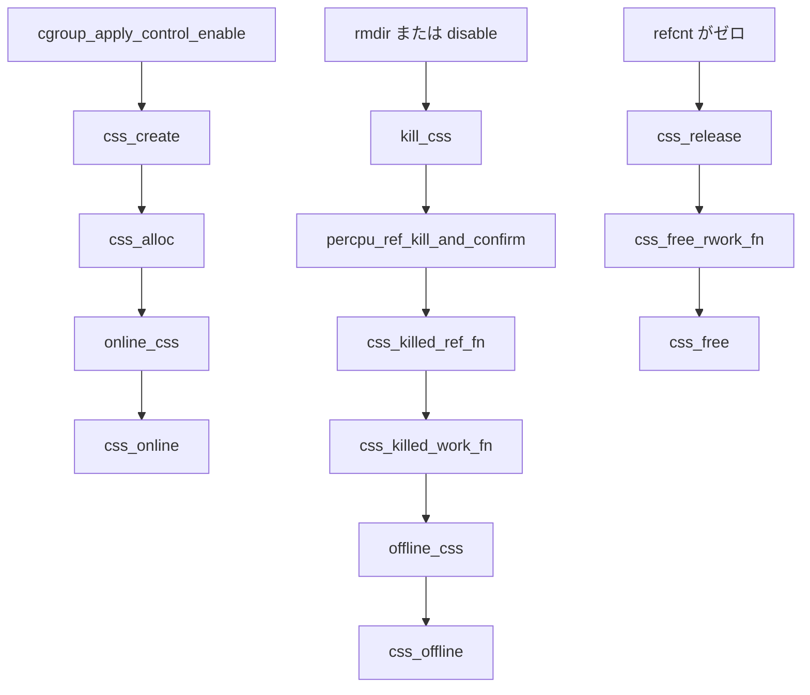

# 第13章 css と cgroup_subsys のライフサイクル

> **本章で読むソース**
>
> - [`include/linux/cgroup-defs.h` L179-L263](https://github.com/gregkh/linux/blob/v6.18.38/include/linux/cgroup-defs.h#L179-L263)
> - [`include/linux/cgroup-defs.h` L766-L789](https://github.com/gregkh/linux/blob/v6.18.38/include/linux/cgroup-defs.h#L766-L789)
> - [`kernel/cgroup/cgroup.c` L1801-L1844](https://github.com/gregkh/linux/blob/v6.18.38/kernel/cgroup/cgroup.c#L1801-L1844)
> - [`kernel/cgroup/cgroup.c` L5562-L5604](https://github.com/gregkh/linux/blob/v6.18.38/kernel/cgroup/cgroup.c#L5562-L5604)
> - [`kernel/cgroup/cgroup.c` L5736-L5776](https://github.com/gregkh/linux/blob/v6.18.38/kernel/cgroup/cgroup.c#L5736-L5776)
> - [`kernel/cgroup/cgroup.c` L5787-L5833](https://github.com/gregkh/linux/blob/v6.18.38/kernel/cgroup/cgroup.c#L5787-L5833)
> - [`kernel/cgroup/cgroup.c` L6085-L6124](https://github.com/gregkh/linux/blob/v6.18.38/kernel/cgroup/cgroup.c#L6085-L6124)

## この章の狙い

各コントローラが cgroup 階層にぶら下がる **css**（`cgroup_subsys_state`）の生成から破棄までを読む。
`cgroup_subsys` のコールバック、`css_populate_dir` による interface ファイル作成、**percpu_ref** による段階的破棄を押さえる。

## 前提

- [第12章 cgroup v2 階層と kernfs](12-cgroup-hierarchy-kernfs.md)
- [第1章 隔離と資源制御の全体像](../part00-foundation/01-isolation-overview.md)

## css と cgroup_subsys の役割分担

**css** は特定の cgroup と特定のコントローラの組み合わせに対応するカーネル内オブジェクトである。
`cgroup_subsys` はコントローラごとの vtable であり、css の alloc、online、offline、free を定義する。

[`include/linux/cgroup-defs.h` L179-L218](https://github.com/gregkh/linux/blob/v6.18.38/include/linux/cgroup-defs.h#L179-L218)

```c
struct cgroup_subsys_state {
	/* PI: the cgroup that this css is attached to */
	struct cgroup *cgroup;

	/* PI: the cgroup subsystem that this css is attached to */
	struct cgroup_subsys *ss;

	/* reference count - access via css_[try]get() and css_put() */
	struct percpu_ref refcnt;

	/*
	 * Depending on the context, this field is initialized
	 * via css_rstat_init() at different places:
	 *
	 * when css is associated with cgroup::self
	 *   when css->cgroup is the root cgroup
	 *     performed in cgroup_init()
	 *   when css->cgroup is not the root cgroup
	 *     performed in cgroup_create()
	 * when css is associated with a subsystem
	 *   when css->cgroup is the root cgroup
	 *     performed in cgroup_init_subsys() in the non-early path
	 *   when css->cgroup is not the root cgroup
	 *     performed in css_create()
	 */
	struct css_rstat_cpu __percpu *rstat_cpu;

	/*
	 * siblings list anchored at the parent's ->children
	 *
	 * linkage is protected by cgroup_mutex or RCU
	 */
	struct list_head sibling;
	struct list_head children;

	/*
	 * PI: Subsys-unique ID.  0 is unused and root is always 1.  The
	 * matching css can be looked up using css_from_id().
	 */
	int id;
```

`cgroup::self` はコントローラに属さない cgroup 自身の css である。
コントローラ用 css は `cgrp->subsys[ssid]` から RCU で参照される。

[`include/linux/cgroup-defs.h` L766-L789](https://github.com/gregkh/linux/blob/v6.18.38/include/linux/cgroup-defs.h#L766-L789)

```c
struct cgroup_subsys {
	struct cgroup_subsys_state *(*css_alloc)(struct cgroup_subsys_state *parent_css);
	int (*css_online)(struct cgroup_subsys_state *css);
	void (*css_offline)(struct cgroup_subsys_state *css);
	void (*css_released)(struct cgroup_subsys_state *css);
	void (*css_free)(struct cgroup_subsys_state *css);
	void (*css_reset)(struct cgroup_subsys_state *css);
	void (*css_killed)(struct cgroup_subsys_state *css);
	void (*css_rstat_flush)(struct cgroup_subsys_state *css, int cpu);
	int (*css_extra_stat_show)(struct seq_file *seq,
				   struct cgroup_subsys_state *css);
	int (*css_local_stat_show)(struct seq_file *seq,
				   struct cgroup_subsys_state *css);

	int (*can_attach)(struct cgroup_taskset *tset);
	void (*cancel_attach)(struct cgroup_taskset *tset);
	void (*attach)(struct cgroup_taskset *tset);
	int (*can_fork)(struct task_struct *task,
			struct css_set *cset);
	void (*cancel_fork)(struct task_struct *task, struct css_set *cset);
	void (*fork)(struct task_struct *task);
	void (*exit)(struct task_struct *task);
	void (*release)(struct task_struct *task);
	void (*bind)(struct cgroup_subsys_state *root_css);
```

第3部の各コントローラ章では、この vtable の個別実装を読む。
本章は共通の css ライフサイクルに留める。

## css_create と online_css

新しい cgroup にコントローラを有効化すると、`css_create` が親 css を引数に `css_alloc` を呼び出す。

[`kernel/cgroup/cgroup.c` L5787-L5826](https://github.com/gregkh/linux/blob/v6.18.38/kernel/cgroup/cgroup.c#L5787-L5826)

```c
static struct cgroup_subsys_state *css_create(struct cgroup *cgrp,
					      struct cgroup_subsys *ss)
{
	struct cgroup *parent = cgroup_parent(cgrp);
	struct cgroup_subsys_state *parent_css = cgroup_css(parent, ss);
	struct cgroup_subsys_state *css;
	int err;

	lockdep_assert_held(&cgroup_mutex);

	css = ss->css_alloc(parent_css);
	if (!css)
		css = ERR_PTR(-ENOMEM);
	if (IS_ERR(css))
		return css;

	init_and_link_css(css, ss, cgrp);

	err = percpu_ref_init(&css->refcnt, css_release, 0, GFP_KERNEL);
	if (err)
		goto err_free_css;

	err = cgroup_idr_alloc(&ss->css_idr, NULL, 2, 0, GFP_KERNEL);
	if (err < 0)
		goto err_free_css;
	css->id = err;

	err = css_rstat_init(css);
	if (err)
		goto err_free_css;

	/* @css is ready to be brought online now, make it visible */
	list_add_tail_rcu(&css->sibling, &parent_css->children);
	cgroup_idr_replace(&ss->css_idr, css, css->id);

	err = online_css(css);
	if (err)
		goto err_list_del;

	return css;
```

`online_css` は `css_online` コールバックを呼び、成功すれば `CSS_ONLINE` フラグを立てて `cgrp->subsys[ss->id]` に RCU 代入する。

[`kernel/cgroup/cgroup.c` L5736-L5756](https://github.com/gregkh/linux/blob/v6.18.38/kernel/cgroup/cgroup.c#L5736-L5756)

```c
static int online_css(struct cgroup_subsys_state *css)
{
	struct cgroup_subsys *ss = css->ss;
	int ret = 0;

	lockdep_assert_held(&cgroup_mutex);

	if (ss->css_online)
		ret = ss->css_online(css);
	if (!ret) {
		css->flags |= CSS_ONLINE;
		rcu_assign_pointer(css->cgroup->subsys[ss->id], css);

		atomic_inc(&css->online_cnt);
		if (css->parent) {
			atomic_inc(&css->parent->online_cnt);
			while ((css = css->parent))
				css->nr_descendants++;
		}
	}
	return ret;
```

`online_cnt` は親子 css の offline 順序を制御する。
子が online のあいだ親は offline できない。

## css_populate_dir と interface ファイル

css が online になっても、ユーザー空間からの読み書きには kernfs 上のファイルが必要である。
`css_populate_dir` は cgroup ディレクトリに `cftype` で定義されたファイルを追加する。

[`kernel/cgroup/cgroup.c` L1801-L1842](https://github.com/gregkh/linux/blob/v6.18.38/kernel/cgroup/cgroup.c#L1801-L1842)

```c
static int css_populate_dir(struct cgroup_subsys_state *css)
{
	struct cgroup *cgrp = css->cgroup;
	struct cftype *cfts, *failed_cfts;
	int ret;

	if (css->flags & CSS_VISIBLE)
		return 0;

	if (css_is_self(css)) {
		if (cgroup_on_dfl(cgrp)) {
			ret = cgroup_addrm_files(css, cgrp,
						 cgroup_base_files, true);
			if (ret < 0)
				return ret;

			if (cgroup_psi_enabled()) {
				ret = cgroup_addrm_files(css, cgrp,
							 cgroup_psi_files, true);
				if (ret < 0) {
					cgroup_addrm_files(css, cgrp,
							   cgroup_base_files, false);
					return ret;
				}
			}
		} else {
			ret = cgroup_addrm_files(css, cgrp,
						 cgroup1_base_files, true);
			if (ret < 0)
				return ret;
		}
	} else {
		list_for_each_entry(cfts, &css->ss->cfts, node) {
			ret = cgroup_addrm_files(css, cgrp, cfts, true);
			if (ret < 0) {
				failed_cfts = cfts;
				goto err;
			}
		}
	}

	css->flags |= CSS_VISIBLE;
```

`CSS_VISIBLE` が既に立っていれば何もしない。
v2 では `cgroup_base_files` に `cgroup.procs` や `cgroup.controllers` が含まれる。

## css 破棄の四段階

css の破棄はコメントが四段階と整理している。
実際には workqueue への委譲を含めてさらに細かいが、大枠は kill、offline、RCU 猶予、free である。

[`kernel/cgroup/cgroup.c` L5562-L5604](https://github.com/gregkh/linux/blob/v6.18.38/kernel/cgroup/cgroup.c#L5562-L5604)

```c
/*
 * css destruction is four-stage process.
 *
 * 1. Destruction starts.  Killing of the percpu_ref is initiated.
 *    Implemented in kill_css().
 *
 * 2. When the percpu_ref is confirmed to be visible as killed on all CPUs
 *    and thus css_tryget_online() is guaranteed to fail, the css can be
 *    offlined by invoking offline_css().  After offlining, the base ref is
 *    put.  Implemented in css_killed_work_fn().
 *
 * 3. When the percpu_ref reaches zero, the only possible remaining
 *    accessors are inside RCU read sections.  css_release() schedules the
 *    RCU callback.
 *
 * 4. After the grace period, the css can be freed.  Implemented in
 *    css_free_rwork_fn().
 *
 * It is actually hairier because both step 2 and 4 require process context
 * and thus involve punting to css->destroy_work adding two additional
 * steps to the already complex sequence.
 */
static void css_free_rwork_fn(struct work_struct *work)
{
	struct cgroup_subsys_state *css = container_of(to_rcu_work(work),
				struct cgroup_subsys_state, destroy_rwork);
	struct cgroup_subsys *ss = css->ss;
	struct cgroup *cgrp = css->cgroup;

	percpu_ref_exit(&css->refcnt);
	css_rstat_exit(css);

	if (!css_is_self(css)) {
		/* css free path */
		struct cgroup_subsys_state *parent = css->parent;
		int id = css->id;

		ss->css_free(css);
		cgroup_idr_remove(&ss->css_idr, id);
		cgroup_put(cgrp);

		if (parent)
			css_put(parent);
```

コントローラ css は `ss->css_free` でメモリを返し、cgroup 自身の css は `kfree(cgrp)` へ進む。

## kill_css と percpu_ref_kill_and_confirm

`kill_css` は破棄の起点である。
interface ファイルを消し、`percpu_ref_kill_and_confirm` で全 CPU で ref が killed と見えることを確認してから offline に進む。

[`kernel/cgroup/cgroup.c` L6085-L6124](https://github.com/gregkh/linux/blob/v6.18.38/kernel/cgroup/cgroup.c#L6085-L6124)

```c
static void kill_css(struct cgroup_subsys_state *css)
{
	struct cgroup_subsys *ss = css->ss;

	lockdep_assert_held(&cgroup_mutex);

	if (css->flags & CSS_DYING)
		return;

	/*
	 * Call css_killed(), if defined, before setting the CSS_DYING flag
	 */
	if (css->ss->css_killed)
		css->ss->css_killed(css);

	css->flags |= CSS_DYING;

	/*
	 * This must happen before css is disassociated with its cgroup.
	 * See seq_css() for details.
	 */
	css_clear_dir(css);

	/*
	 * Killing would put the base ref, but we need to keep it alive
	 * until after ->css_offline().
	 */
	css_get(css);

	/*
	 * cgroup core guarantees that, by the time ->css_offline() is
	 * invoked, no new css reference will be given out via
	 * css_tryget_online().  We can't simply call percpu_ref_kill() and
	 * proceed to offlining css's because percpu_ref_kill() doesn't
	 * guarantee that the ref is seen as killed on all CPUs on return.
	 *
	 * Use percpu_ref_kill_and_confirm() to get notifications as each
	 * css is confirmed to be seen as killed on all CPUs.
	 */
	percpu_ref_kill_and_confirm(&css->refcnt, css_killed_ref_fn);
```

`percpu_ref_kill` だけでは全 CPU での可視性が保証されないため、`percpu_ref_kill_and_confirm` が使われる。
確認コールバック `css_killed_ref_fn` は `online_cnt` を減算し、子 css がすべて offline 可能になったときだけ `css_killed_work_fn` を workqueue へ送る。
work 側で `offline_css` と `css_put` を繰り返し、親方向へ破棄を伝播する。

[`kernel/cgroup/cgroup.c` L6047-L6074](https://github.com/gregkh/linux/blob/v6.18.38/kernel/cgroup/cgroup.c#L6047-L6074)

```c
static void css_killed_work_fn(struct work_struct *work)
{
	struct cgroup_subsys_state *css =
		container_of(work, struct cgroup_subsys_state, destroy_work);

	cgroup_lock();

	do {
		offline_css(css);
		css_put(css);
		/* @css can't go away while we're holding cgroup_mutex */
		css = css->parent;
	} while (css && atomic_dec_and_test(&css->online_cnt));

	cgroup_unlock();
}

/* css kill confirmation processing requires process context, bounce */
static void css_killed_ref_fn(struct percpu_ref *ref)
{
	struct cgroup_subsys_state *css =
		container_of(ref, struct cgroup_subsys_state, refcnt);

	if (atomic_dec_and_test(&css->online_cnt)) {
		INIT_WORK(&css->destroy_work, css_killed_work_fn);
		queue_work(cgroup_offline_wq, &css->destroy_work);
	}
}
```

## offline_css

`offline_css` は `css_offline` コールバックを呼び、`cgrp->subsys[ss->id]` を RCU で NULL に戻す。

[`kernel/cgroup/cgroup.c` L5760-L5776](https://github.com/gregkh/linux/blob/v6.18.38/kernel/cgroup/cgroup.c#L5760-L5776)

```c
static void offline_css(struct cgroup_subsys_state *css)
{
	struct cgroup_subsys *ss = css->ss;

	lockdep_assert_held(&cgroup_mutex);

	if (!(css->flags & CSS_ONLINE))
		return;

	if (ss->css_offline)
		ss->css_offline(css);

	css->flags &= ~CSS_ONLINE;
	RCU_INIT_POINTER(css->cgroup->subsys[ss->id], NULL);

	wake_up_all(&css->cgroup->offline_waitq);
}
```

offline 後も RCU 読者は古い css ポインタを参照しうる。
完全な解放は `css_release` がスケジュールする RCU work で行われる。

## ライフサイクルの処理フロー



## 高速化と最適化の工夫

css の参照カウントは `percpu_ref` で実装されている。
ホットパスでの `css_get` と `css_put` は per CPU カウンタを更新し、グローバル原子操作の頻度を下げる。

破棄時だけ `percpu_ref_kill_and_confirm` で全 CPU の状態を揃える。
これにより online 参照の取得と破棄開始をレースなく切り替えられる。

`css_populate_dir` は `CSS_VISIBLE` フラグで二重実行を避ける。
同じ css に対して interface ファイルを重複登録しない。

## まとめ

css は `css_alloc` で生成され、`online_css` で cgroup に接続され、`css_populate_dir` でユーザー空間向けファイルが露出する。
破棄は `kill_css` から始まり、`percpu_ref_kill_and_confirm`、offline、RCU 猶予、`css_free` の順で進む。
コントローラ固有のリソース解放は `css_offline` と `css_free` に委譲され、memcg の charge 詳細は mm 分冊へ委譲する。

## 関連する章

- [第14章 タスクの cgroup 所属と migration](14-cgroup-attach-migration.md)
- [第17章 rstat と per-CPU 統計集約](17-rstat.md)
- [第19章 memory コントローラと memcg 境界](../part03-controllers/19-memory-controller.md)
