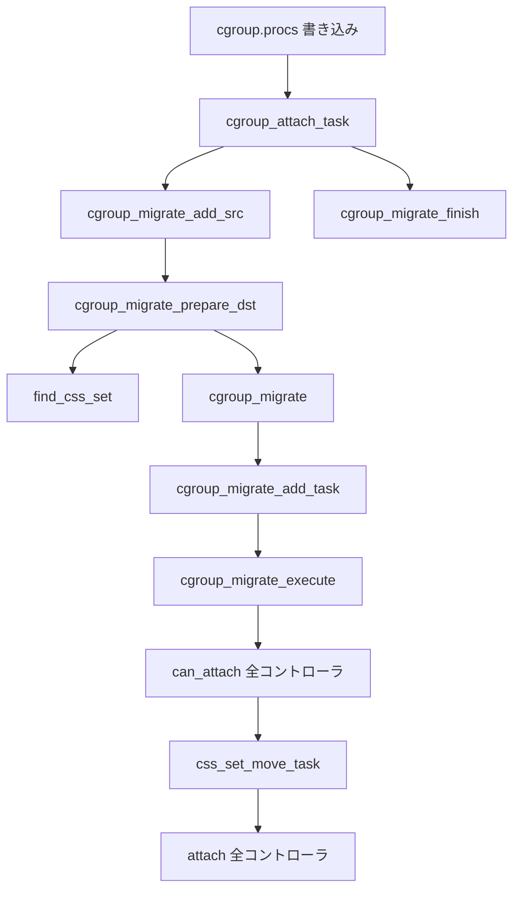

# 第14章 タスクの cgroup 所属と migration

> **本章で読むソース**
>
> - [`include/linux/cgroup-defs.h` L272-L360](https://github.com/gregkh/linux/blob/v6.18.38/include/linux/cgroup-defs.h#L272-L360)
> - [`kernel/cgroup/cgroup.c` L1215-L1245](https://github.com/gregkh/linux/blob/v6.18.38/kernel/cgroup/cgroup.c#L1215-L1245)
> - [`kernel/cgroup/cgroup.c` L2624-L2684](https://github.com/gregkh/linux/blob/v6.18.38/kernel/cgroup/cgroup.c#L2624-L2684)
> - [`kernel/cgroup/cgroup.c` L2695-L2758](https://github.com/gregkh/linux/blob/v6.18.38/kernel/cgroup/cgroup.c#L2695-L2758)
> - [`kernel/cgroup/cgroup.c` L2878-L2909](https://github.com/gregkh/linux/blob/v6.18.38/kernel/cgroup/cgroup.c#L2878-L2909)
> - [`kernel/cgroup/cgroup.c` L3014-L3050](https://github.com/gregkh/linux/blob/v6.18.38/kernel/cgroup/cgroup.c#L3014-L3050)

## この章の狙い

タスクが属する **css_set** の構造と、`cgroup.procs` 書き込みから `cgroup_attach_task` に至る **migration** 経路を読む。
`cgroup_migrate` が全タスクの移動をアトミックにコミットする仕組みと、コントローラへの `cgroup_taskset` 通知を押さえる。

## 前提

- [第12章 cgroup v2 階層と kernfs](12-cgroup-hierarchy-kernfs.md)
- [第13章 css と cgroup_subsys のライフサイクル](13-css-lifecycle.md)

## css_set の構造

**css_set** はタスクが同時に属する全コントローラの css ポインタを一括保持する。
`task_struct` は `cgroups` からこの構造体一つを辿るだけで済む。

[`include/linux/cgroup-defs.h` L272-L334](https://github.com/gregkh/linux/blob/v6.18.38/include/linux/cgroup-defs.h#L272-L334)

```c
struct css_set {
	/*
	 * Set of subsystem states, one for each subsystem. This array is
	 * immutable after creation apart from the init_css_set during
	 * subsystem registration (at boot time).
	 */
	struct cgroup_subsys_state *subsys[CGROUP_SUBSYS_COUNT];

	/* reference count */
	refcount_t refcount;

	/*
	 * For a domain cgroup, the following points to self.  If threaded,
	 * to the matching cset of the nearest domain ancestor.  The
	 * dom_cset provides access to the domain cgroup and its csses to
	 * which domain level resource consumptions should be charged.
	 */
	struct css_set *dom_cset;

	/* the default cgroup associated with this css_set */
	struct cgroup *dfl_cgrp;

	/* internal task count, protected by css_set_lock */
	int nr_tasks;

	/*
	 * Lists running through all tasks using this cgroup group.
	 * mg_tasks lists tasks which belong to this cset but are in the
	 * process of being migrated out or in.  Protected by
	 * css_set_lock, but, during migration, once tasks are moved to
	 * mg_tasks, it can be read safely while holding cgroup_mutex.
	 */
	struct list_head tasks;
	struct list_head mg_tasks;
	struct list_head dying_tasks;

	/* all css_task_iters currently walking this cset */
	struct list_head task_iters;

	/*
	 * On the default hierarchy, ->subsys[ssid] may point to a css
	 * attached to an ancestor instead of the cgroup this css_set is
	 * associated with.  The following node is anchored at
	 * ->subsys[ssid]->cgroup->e_csets[ssid] and provides a way to
	 * iterate through all css's attached to a given cgroup.
	 */
	struct list_head e_cset_node[CGROUP_SUBSYS_COUNT];

	/* all threaded csets whose ->dom_cset points to this cset */
	struct list_head threaded_csets;
	struct list_head threaded_csets_node;

	/*
	 * List running through all cgroup groups in the same hash
	 * slot. Protected by css_set_lock
	 */
	struct hlist_node hlist;

	/*
	 * List of cgrp_cset_links pointing at cgroups referenced from this
	 * css_set.  Protected by css_set_lock.
	 */
	struct list_head cgrp_links;
```

`subsys[]` は作成後ほぼ不変であり、所属変更は別の `css_set` への付け替えで表現する。
v2 では祖先 cgroup の css を指す場合があり、`e_cset_node` が逆引きに使われる。

## find_css_set と css_set の共有

migration の宛先 `css_set` は `find_css_set` が生成または既存インスタンスを返す。
まずハッシュテーブル `css_set_table` を検索し、同じ css 組み合わせがあれば再利用する。

[`kernel/cgroup/cgroup.c` L1215-L1245](https://github.com/gregkh/linux/blob/v6.18.38/kernel/cgroup/cgroup.c#L1215-L1245)

```c
/**
 * find_css_set - return a new css_set with one cgroup updated
 * @old_cset: the baseline css_set
 * @cgrp: the cgroup to be updated
 *
 * Return a new css_set that's equivalent to @old_cset, but with @cgrp
 * substituted into the appropriate hierarchy.
 */
static struct css_set *find_css_set(struct css_set *old_cset,
				    struct cgroup *cgrp)
{
	struct cgroup_subsys_state *template[CGROUP_SUBSYS_COUNT] = { };
	struct css_set *cset;
	struct list_head tmp_links;
	struct cgrp_cset_link *link;
	struct cgroup_subsys *ss;
	unsigned long key;
	int ssid;

	lockdep_assert_held(&cgroup_mutex);

	/* First see if we already have a cgroup group that matches
	 * the desired set */
	spin_lock_irq(&css_set_lock);
	cset = find_existing_css_set(old_cset, cgrp, template);
	if (cset)
		get_css_set(cset);
	spin_unlock_irq(&css_set_lock);

	if (cset)
		return cset;
```

同じ所属集合を持つタスクは同じ `css_set` を共有する。
これにより `task_struct` 側の更新はポインタ一つで済み、参照カウント操作もまとめられる。

## cgroup_attach_task の入口

`cgroup.procs` への PID 書き込みは、最終的に `cgroup_attach_task` を呼ぶ。
この関数は migration コンテキスト `cgroup_mgctx` をスタック上に確保し、三つの段階に分かれる。

[`kernel/cgroup/cgroup.c` L3014-L3050](https://github.com/gregkh/linux/blob/v6.18.38/kernel/cgroup/cgroup.c#L3014-L3050)

```c
/**
 * cgroup_attach_task - attach a task or a whole threadgroup to a cgroup
 * @dst_cgrp: the cgroup to attach to
 * @leader: the task or the leader of the threadgroup to be attached
 * @threadgroup: attach the whole threadgroup?
 *
 * Call holding cgroup_mutex and cgroup_threadgroup_rwsem.
 */
int cgroup_attach_task(struct cgroup *dst_cgrp, struct task_struct *leader,
		       bool threadgroup)
{
	DEFINE_CGROUP_MGCTX(mgctx);
	struct task_struct *task;
	int ret = 0;

	/* look up all src csets */
	spin_lock_irq(&css_set_lock);
	task = leader;
	do {
		cgroup_migrate_add_src(task_css_set(task), dst_cgrp, &mgctx);
		if (!threadgroup)
			break;
	} while_each_thread(leader, task);
	spin_unlock_irq(&css_set_lock);

	/* prepare dst csets and commit */
	ret = cgroup_migrate_prepare_dst(&mgctx);
	if (!ret)
		ret = cgroup_migrate(leader, threadgroup, &mgctx);

	cgroup_migrate_finish(&mgctx);

	if (!ret)
		TRACE_CGROUP_PATH(attach_task, dst_cgrp, leader, threadgroup);

	return ret;
}
```

`threadgroup` が真ならリーダーと全スレッドのソース `css_set` を登録する。
偽なら単一タスクのみが対象である。

## migration 準備とソース登録

`cgroup_migrate_add_src` はソース `css_set` を migration コンテキストに登録する。
`mg_src_cgrp` と `mg_dst_cgrp` を記録し、後段の `find_css_set` の入力にする。

[`kernel/cgroup/cgroup.c` L2878-L2909](https://github.com/gregkh/linux/blob/v6.18.38/kernel/cgroup/cgroup.c#L2878-L2909)

```c
void cgroup_migrate_add_src(struct css_set *src_cset,
			    struct cgroup *dst_cgrp,
			    struct cgroup_mgctx *mgctx)
{
	struct cgroup *src_cgrp;

	lockdep_assert_held(&cgroup_mutex);
	lockdep_assert_held(&css_set_lock);

	/*
	 * If ->dead, @src_set is associated with one or more dead cgroups
	 * and doesn't contain any migratable tasks.  Ignore it early so
	 * that the rest of migration path doesn't get confused by it.
	 */
	if (src_cset->dead)
		return;

	if (!list_empty(&src_cset->mg_src_preload_node))
		return;

	src_cgrp = cset_cgroup_from_root(src_cset, dst_cgrp->root);

	WARN_ON(src_cset->mg_src_cgrp);
	WARN_ON(src_cset->mg_dst_cgrp);
	WARN_ON(!list_empty(&src_cset->mg_tasks));
	WARN_ON(!list_empty(&src_cset->mg_node));

	src_cset->mg_src_cgrp = src_cgrp;
	src_cset->mg_dst_cgrp = dst_cgrp;
	get_css_set(src_cset);
	list_add_tail(&src_cset->mg_src_preload_node, &mgctx->preloaded_src_csets);
}
```

`cgroup_migrate_prepare_dst` は各ソースに対応する宛先 `css_set` を `find_css_set` で解決する。
ソースと宛先が同一なら no-op として両方を解放する。

## cgroup_migrate_execute とアトミックコミット

`cgroup_migrate` は対象タスクを `mg_tasks` リストへ移し、`cgroup_migrate_execute` を呼ぶ。
execute 内ではまず全コントローラの `can_attach` を試し、一つでも失敗すれば全体をロールバックする。

[`kernel/cgroup/cgroup.c` L2695-L2758](https://github.com/gregkh/linux/blob/v6.18.38/kernel/cgroup/cgroup.c#L2695-L2758)

```c
static int cgroup_migrate_execute(struct cgroup_mgctx *mgctx)
{
	struct cgroup_taskset *tset = &mgctx->tset;
	struct cgroup_subsys *ss;
	struct task_struct *task, *tmp_task;
	struct css_set *cset, *tmp_cset;
	int ssid, failed_ssid, ret;

	/* check that we can legitimately attach to the cgroup */
	if (tset->nr_tasks) {
		do_each_subsys_mask(ss, ssid, mgctx->ss_mask) {
			if (ss->can_attach) {
				tset->ssid = ssid;
				ret = ss->can_attach(tset);
				if (ret) {
					failed_ssid = ssid;
					goto out_cancel_attach;
				}
			}
		} while_each_subsys_mask();
	}

	/*
	 * Now that we're guaranteed success, proceed to move all tasks to
	 * the new cgroup.  There are no failure cases after here, so this
	 * is the commit point.
	 */
	spin_lock_irq(&css_set_lock);
	list_for_each_entry(cset, &tset->src_csets, mg_node) {
		list_for_each_entry_safe(task, tmp_task, &cset->mg_tasks, cg_list) {
			struct css_set *from_cset = task_css_set(task);
			struct css_set *to_cset = cset->mg_dst_cset;

			get_css_set(to_cset);
			to_cset->nr_tasks++;
			css_set_move_task(task, from_cset, to_cset, true);
			from_cset->nr_tasks--;
			/*
			 * If the source or destination cgroup is frozen,
			 * the task might require to change its state.
			 */
			cgroup_freezer_migrate_task(task, from_cset->dfl_cgrp,
						    to_cset->dfl_cgrp);
			put_css_set_locked(from_cset);

		}
	}
	spin_unlock_irq(&css_set_lock);

	/*
	 * Migration is committed, all target tasks are now on dst_csets.
	 * Nothing is sensitive to fork() after this point.  Notify
	 * controllers that migration is complete.
	 */
	tset->csets = &tset->dst_csets;

	if (tset->nr_tasks) {
		do_each_subsys_mask(ss, ssid, mgctx->ss_mask) {
			if (ss->attach) {
				tset->ssid = ssid;
				ss->attach(tset);
			}
		} while_each_subsys_mask();
	}
```

コミット後に `attach` コールバックが呼ばれる。
コントローラは `cgroup_taskset` イテレータで影響を受けたタスクを走査する。

## cgroup_taskset イテレータ

`cgroup_taskset` は migration 中のタスク集合をコントローラへ渡すビューである。
`cgroup_taskset_first` と `cgroup_taskset_next` が走査 API を提供する。

[`kernel/cgroup/cgroup.c` L2624-L2684](https://github.com/gregkh/linux/blob/v6.18.38/kernel/cgroup/cgroup.c#L2624-L2684)

```c
/**
 * cgroup_taskset_first - reset taskset and return the first task
 * @tset: taskset of interest
 * @dst_cssp: output variable for the destination css
 *
 * @tset iteration is initialized and the first task is returned.
 */
struct task_struct *cgroup_taskset_first(struct cgroup_taskset *tset,
					 struct cgroup_subsys_state **dst_cssp)
{
	tset->cur_cset = list_first_entry(tset->csets, struct css_set, mg_node);
	tset->cur_task = NULL;

	return cgroup_taskset_next(tset, dst_cssp);
}

/**
 * cgroup_taskset_next - iterate to the next task in taskset
 * @tset: taskset of interest
 * @dst_cssp: output variable for the destination css
 *
 * Return the next task in @tset.  Iteration must have been initialized
 * with cgroup_taskset_first().
 */
struct task_struct *cgroup_taskset_next(struct cgroup_taskset *tset,
					struct cgroup_subsys_state **dst_cssp)
{
	struct css_set *cset = tset->cur_cset;
	struct task_struct *task = tset->cur_task;

	while (CGROUP_HAS_SUBSYS_CONFIG && &cset->mg_node != tset->csets) {
		if (!task)
			task = list_first_entry(&cset->mg_tasks,
						struct task_struct, cg_list);
		else
			task = list_next_entry(task, cg_list);

		if (&task->cg_list != &cset->mg_tasks) {
			tset->cur_cset = cset;
			tset->cur_task = task;

			/*
			 * This function may be called both before and
			 * after cgroup_migrate_execute().  The two cases
			 * can be distinguished by looking at whether @cset
			 * has its ->mg_dst_cset set.
			 */
			if (cset->mg_dst_cset)
				*dst_cssp = cset->mg_dst_cset->subsys[tset->ssid];
			else
				*dst_cssp = cset->subsys[tset->ssid];

			return task;
		}

		cset = list_next_entry(cset, mg_node);
		task = NULL;
	}

	return NULL;
}
```

`can_attach` 呼び出し時点では `cgroup_migrate_prepare_dst` が済んでおり、ソース `css_set` の `mg_dst_cset` が宛先 `css_set` を指している。
`cgroup_taskset_first` は `mg_dst_cset->subsys[]` から宛先 css を返す。
`attach` 呼び出し時点でも同じ宛先 css を返す。

## migration の処理フロー



## 高速化と最適化の工夫

`css_set` は `subsys[]` 配列のハッシュで索引される。
`find_existing_css_set` が一致を見つければ新規割り当てを省略し、同一所属のタスク群で `css_set` を共有する。

migration 準備では `preloaded_src_csets` と `preloaded_dst_csets` に先に css_set を集める。
`cgroup_mutex` を保持したまま複数タスクを一括処理でき、タスクごとの `find_css_set` 呼び出しを抑える。

`mg_tasks` リストは migration 中のタスクを通常の `tasks` リストから分離する。
`cgroup_mutex` 保持中は `mg_tasks` を安全に走査でき、コントローラの `can_attach` が一貫したスナップショットを読める。

## まとめ

タスクの cgroup 所属は `css_set` 一つで表現され、変更は別 `css_set` への付け替えとして実装される。
`cgroup_attach_task` はソース登録、宛先解決、実行、後片付けの四段階で migration を行い、全タスクの移動はアトミックにコミットされる。
コントローラは `cgroup_taskset` 経由で `can_attach` と `attach` の両方に関与する。

## 関連する章

- [第16章 cgroup namespace とパス表示](16-cgroup-namespace.md)
- [第17章 rstat と per-CPU 統計集約](17-rstat.md)
- [第18章 cpu コントローラと sched 連携](../part03-controllers/18-cpu-controller.md)
- [第22章 cpuset コントローラ](../part03-controllers/22-cpuset-controller.md)
