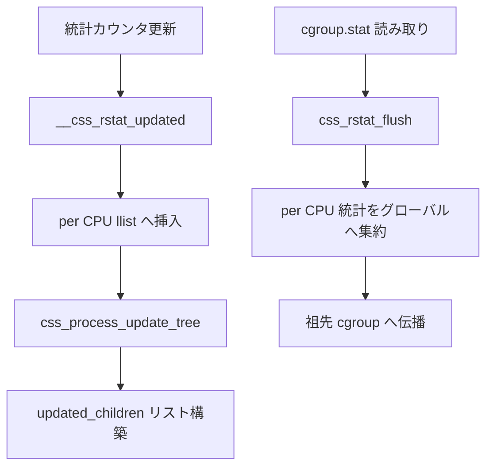

# 第14章 cgroup namespace と rstat

> **本章で読むソース**
>
> - [`include/linux/cgroup_namespace.h` L7-L12](https://github.com/gregkh/linux/blob/v6.18.38/include/linux/cgroup_namespace.h#L7-L12)
> - [`kernel/cgroup/cgroup.c` L251-L259](https://github.com/gregkh/linux/blob/v6.18.38/kernel/cgroup/cgroup.c#L251-L259)
> - [`kernel/cgroup/namespace.c` L48-L90](https://github.com/gregkh/linux/blob/v6.18.38/kernel/cgroup/namespace.c#L48-L90)
> - [`kernel/cgroup/namespace.c` L92-L110](https://github.com/gregkh/linux/blob/v6.18.38/kernel/cgroup/namespace.c#L92-L110)
> - [`kernel/cgroup/cgroup.c` L2484-L2489](https://github.com/gregkh/linux/blob/v6.18.38/kernel/cgroup/cgroup.c#L2484-L2489)
> - [`kernel/cgroup/rstat.c` L71-L119](https://github.com/gregkh/linux/blob/v6.18.38/kernel/cgroup/rstat.c#L71-L119)
> - [`kernel/cgroup/rstat.c` L137-L164](https://github.com/gregkh/linux/blob/v6.18.38/kernel/cgroup/rstat.c#L137-L164)
> - [`kernel/cgroup/rstat.c` L409-L440](https://github.com/gregkh/linux/blob/v6.18.38/kernel/cgroup/rstat.c#L409-L440)
> - [`kernel/cgroup/rstat.c` L442-L485](https://github.com/gregkh/linux/blob/v6.18.38/kernel/cgroup/rstat.c#L442-L485)

## この章の狙い

**cgroup namespace** が cgroup パス表示の根をどう切り替えるかを読む。
併せて **rstat** の per CPU 統計更新と `css_rstat_flush` による集約経路を押さえる。

## 前提

- [第2章 nsproxy と namespace のライフサイクル](../part00-foundation/02-nsproxy-lifecycle.md)
- [第13章 タスクの cgroup 所属と migration](13-cgroup-attach-migration.md)

## cgroup_namespace の構造

cgroup namespace は `nsproxy` の `cgroup_ns` メンバとしてタスクに結び付く。
本体は `root_cset` ポインタを持ち、namespace 内で見える cgroup ツリーの根を定義する。

[`include/linux/cgroup_namespace.h` L7-L12](https://github.com/gregkh/linux/blob/v6.18.38/include/linux/cgroup_namespace.h#L7-L12)

```c
struct cgroup_namespace {
	struct ns_common	ns;
	struct user_namespace	*user_ns;
	struct ucounts		*ucounts;
	struct css_set          *root_cset;
};
```

`root_cset` は作成時点の呼び出し元タスクの `css_set` を指す。
namespace 内のパス解決は、この `css_set` が属する default hierarchy 上の cgroup を根とする。

初期タスクの cgroup namespace は `init_cgroup_ns` で、`root_cset` は `init_css_set` を指す。

[`kernel/cgroup/cgroup.c` L251-L259](https://github.com/gregkh/linux/blob/v6.18.38/kernel/cgroup/cgroup.c#L251-L259)

```c
/* cgroup namespace for init task */
struct cgroup_namespace init_cgroup_ns = {
	.ns.__ns_ref	= REFCOUNT_INIT(2),
	.user_ns	= &init_user_ns,
	.ns.ops		= &cgroupns_operations,
	.ns.inum	= ns_init_inum(&init_cgroup_ns),
	.root_cset	= &init_css_set,
	.ns.ns_type	= ns_common_type(&init_cgroup_ns),
};
```

## copy_cgroup_ns

`CLONE_NEWCGROUP` 付き `clone` または `unshare` で新しい cgroup namespace が作られる。
`copy_cgroup_ns` は他 namespace と同様、フラグが立っていなければ既存を参照カウントするだけで返す。

[`kernel/cgroup/namespace.c` L48-L90](https://github.com/gregkh/linux/blob/v6.18.38/kernel/cgroup/namespace.c#L48-L90)

```c
struct cgroup_namespace *copy_cgroup_ns(u64 flags,
					struct user_namespace *user_ns,
					struct cgroup_namespace *old_ns)
{
	struct cgroup_namespace *new_ns;
	struct ucounts *ucounts;
	struct css_set *cset;

	BUG_ON(!old_ns);

	if (!(flags & CLONE_NEWCGROUP)) {
		get_cgroup_ns(old_ns);
		return old_ns;
	}

	/* Allow only sysadmin to create cgroup namespace. */
	if (!ns_capable(user_ns, CAP_SYS_ADMIN))
		return ERR_PTR(-EPERM);

	ucounts = inc_cgroup_namespaces(user_ns);
	if (!ucounts)
		return ERR_PTR(-ENOSPC);

	/* It is not safe to take cgroup_mutex here */
	spin_lock_irq(&css_set_lock);
	cset = task_css_set(current);
	get_css_set(cset);
	spin_unlock_irq(&css_set_lock);

	new_ns = alloc_cgroup_ns();
	if (IS_ERR(new_ns)) {
		put_css_set(cset);
		dec_cgroup_namespaces(ucounts);
		return new_ns;
	}

	new_ns->user_ns = get_user_ns(user_ns);
	new_ns->ucounts = ucounts;
	new_ns->root_cset = cset;

	ns_tree_add(new_ns);
	return new_ns;
}
```

`cgroup_mutex` を取れないため、`css_set_lock` の下で `current` の `css_set` を取得する。
namespace 作成はタスクの cgroup 所属そのものを変えず、パス表示の根だけを切り替える。

`setns` による切り替えは `cgroupns_install` が `nsproxy->cgroup_ns` を差し替える。
第3章で読んだ `setns` 経路から呼ばれる。

[`kernel/cgroup/namespace.c` L92-L110](https://github.com/gregkh/linux/blob/v6.18.38/kernel/cgroup/namespace.c#L92-L110)

```c
static int cgroupns_install(struct nsset *nsset, struct ns_common *ns)
{
	struct nsproxy *nsproxy = nsset->nsproxy;
	struct cgroup_namespace *cgroup_ns = to_cg_ns(ns);

	if (!ns_capable(nsset->cred->user_ns, CAP_SYS_ADMIN) ||
	    !ns_capable(cgroup_ns->user_ns, CAP_SYS_ADMIN))
		return -EPERM;

	/* Don't need to do anything if we are attaching to our own cgroupns. */
	if (cgroup_ns == nsproxy->cgroup_ns)
		return 0;

	get_cgroup_ns(cgroup_ns);
	put_cgroup_ns(nsproxy->cgroup_ns);
	nsproxy->cgroup_ns = cgroup_ns;

	return 0;
}
```

パス表示は `cgroup_path_ns_locked` が `root_cset` から見た表示上の root を求め、`kernfs_path_from_node` に渡す。

[`kernel/cgroup/cgroup.c` L2484-L2489](https://github.com/gregkh/linux/blob/v6.18.38/kernel/cgroup/cgroup.c#L2484-L2489)

```c
int cgroup_path_ns_locked(struct cgroup *cgrp, char *buf, size_t buflen,
			  struct cgroup_namespace *ns)
{
	struct cgroup *root = cset_cgroup_from_root(ns->root_cset, cgrp->root);

	return kernfs_path_from_node(cgrp->kn, root->kn, buf, buflen);
```

## rstat の目的

cgroup の CPU 時間などの統計はホットパスで更新される。
毎回グローバルカウンタへ原子加算するとキャッシュラインの競合が起きるため、per CPU に蓄積してから集約する。

`css_rstat_cpu` は CPU ごとの更新ノードを持ち、変更があった css をツリー上へ伝播する。
読み取り側は `css_rstat_flush` で subtree の統計を集約してから値を返す。

## __css_rstat_updated とロックレス登録

統計更新のたびに `__css_rstat_updated` が呼ばれる。
この関数は per CPU の `llist_node` をロックレスリストへ挿入し、後の flush で処理する。

[`kernel/cgroup/rstat.c` L71-L119](https://github.com/gregkh/linux/blob/v6.18.38/kernel/cgroup/rstat.c#L71-L119)

```c
void __css_rstat_updated(struct cgroup_subsys_state *css, int cpu)
{
	struct llist_head *lhead;
	struct css_rstat_cpu *rstatc;
	struct llist_node *self;

	/* Prevent access to uninitialized rstat pointers. */
	if (!css_uses_rstat(css))
		return;

	lockdep_assert_preemption_disabled();

	/*
	 * The lockless insertion below relies on NMI-safe cmpxchg;
	 * bail out in NMI on archs that don't provide it.
	 */
	if (!IS_ENABLED(CONFIG_ARCH_HAVE_NMI_SAFE_CMPXCHG) && in_nmi())
		return;

	rstatc = css_rstat_cpu(css, cpu);
	/*
	 * If already on list return. This check is racy and smp_mb() is needed
	 * to pair it with the smp_mb() in css_process_update_tree() if the
	 * guarantee that the updated stats are visible to concurrent flusher is
	 * needed.
	 */
	if (llist_on_list(&rstatc->lnode))
		return;

	/*
	 * This function can be renentered by irqs and nmis for the same cgroup
	 * and may try to insert the same per-cpu lnode into the llist. Note
	 * that llist_add() does not protect against such scenarios. In addition
	 * this same per-cpu lnode can be modified through init_llist_node()
	 * from css_rstat_flush() running on a different CPU.
	 *
	 * To protect against such stacked contexts of irqs/nmis, we use the
	 * fact that lnode points to itself when not on a list and then use
	 * try_cmpxchg() to atomically set to NULL to select the winner
	 * which will call llist_add(). The losers can assume the insertion is
	 * successful and the winner will eventually add the per-cpu lnode to
	 * the llist.
	 *
	 * Please note that we can not use this_cpu_cmpxchg() here as on some
	 * archs it is not safe against modifications from multiple CPUs.
	 */
	self = &rstatc->lnode;
	if (!try_cmpxchg(&rstatc->lnode.next, &self, NULL))
		return;
```

IRQ や NMI からの再入を `try_cmpxchg` で調停する。
勝者だけが `llist_add` を実行し、敗者は挿入済みとみなして戻る。

## 更新ツリーへの伝播

`css_process_update_tree` は llist から取り出した css を祖先方向へ連結する。
各 CPU ごとに `updated_children` リストが構築され、flush 時に subtree 全体を走査できる。

[`kernel/cgroup/rstat.c` L137-L164](https://github.com/gregkh/linux/blob/v6.18.38/kernel/cgroup/rstat.c#L137-L164)

```c
static void __css_process_update_tree(struct cgroup_subsys_state *css, int cpu)
{
	/* put @css and all ancestors on the corresponding updated lists */
	while (true) {
		struct css_rstat_cpu *rstatc = css_rstat_cpu(css, cpu);
		struct cgroup_subsys_state *parent = css->parent;
		struct css_rstat_cpu *prstatc;

		/*
		 * Both additions and removals are bottom-up.  If a cgroup
		 * is already in the tree, all ancestors are.
		 */
		if (rstatc->updated_next)
			break;

		/* Root has no parent to link it to, but mark it busy */
		if (!parent) {
			rstatc->updated_next = css;
			break;
		}

		prstatc = css_rstat_cpu(parent, cpu);
		rstatc->updated_next = prstatc->updated_children;
		prstatc->updated_children = css;

		css = parent;
	}
}
```

子が既にツリーに入っていれば祖先も入っているため、途中で打ち切れる。
これにより同一 CPU での重複伝播を避ける。

## css_rstat_flush による集約

`css_rstat_flush` は指定 css の subtree について、全 CPU の per CPU 統計をグローバルへ集約する。
ユーザー空間が `cgroup.stat` 等を読む直前や、css 破棄前にも呼ばれる。

[`kernel/cgroup/rstat.c` L409-L440](https://github.com/gregkh/linux/blob/v6.18.38/kernel/cgroup/rstat.c#L409-L440)

```c
__bpf_kfunc void css_rstat_flush(struct cgroup_subsys_state *css)
{
	int cpu;
	bool is_self = css_is_self(css);

	/*
	 * Since bpf programs can call this function, prevent access to
	 * uninitialized rstat pointers.
	 */
	if (!css_uses_rstat(css))
		return;

	might_sleep();
	for_each_possible_cpu(cpu) {
		struct cgroup_subsys_state *pos;

		/* Reacquire for each CPU to avoid disabling IRQs too long */
		__css_rstat_lock(css, cpu);
		pos = css_rstat_updated_list(css, cpu);
		for (; pos; pos = pos->rstat_flush_next) {
			if (is_self) {
				cgroup_base_stat_flush(pos->cgroup, cpu);
				bpf_rstat_flush(pos->cgroup,
						cgroup_parent(pos->cgroup), cpu);
			} else
				pos->ss->css_rstat_flush(pos, cpu);
		}
		__css_rstat_unlock(css, cpu);
		if (!cond_resched())
			cpu_relax();
	}
}
```

`cgroup::self` の flush では `cgroup_base_stat_flush` が CPU 時間を集約する。
コントローラ css は各 `cgroup_subsys` の `css_rstat_flush` コールバックに委譲する。

## css_rstat_init

rstat を使う css は `css_rstat_init` で per CPU 領域を割り当てる。
コントローラが `css_rstat_flush` を定義していなければ、subsystem css は rstat を使わない。

[`kernel/cgroup/rstat.c` L442-L485](https://github.com/gregkh/linux/blob/v6.18.38/kernel/cgroup/rstat.c#L442-L485)

```c
int css_rstat_init(struct cgroup_subsys_state *css)
{
	struct cgroup *cgrp = css->cgroup;
	int cpu;
	bool is_self = css_is_self(css);

	if (is_self) {
		/* the root cgrp has rstat_base_cpu preallocated */
		if (!cgrp->rstat_base_cpu) {
			cgrp->rstat_base_cpu = alloc_percpu(struct cgroup_rstat_base_cpu);
			if (!cgrp->rstat_base_cpu)
				return -ENOMEM;
		}
	} else if (css->ss->css_rstat_flush == NULL)
		return 0;

	/* the root cgrp's self css has rstat_cpu preallocated */
	if (!css->rstat_cpu) {
		css->rstat_cpu = alloc_percpu(struct css_rstat_cpu);
		if (!css->rstat_cpu) {
			if (is_self)
				free_percpu(cgrp->rstat_base_cpu);

			return -ENOMEM;
		}
	}

	/* ->updated_children list is self terminated */
	for_each_possible_cpu(cpu) {
		struct css_rstat_cpu *rstatc = css_rstat_cpu(css, cpu);

		rstatc->owner = rstatc->updated_children = css;
		init_llist_node(&rstatc->lnode);

		if (is_self) {
			struct cgroup_rstat_base_cpu *rstatbc;

			rstatbc = cgroup_rstat_base_cpu(cgrp, cpu);
			u64_stats_init(&rstatbc->bsync);
		}
	}

	return 0;
}
```

各 cgroup の `self` css が `rstat_base_cpu` を持ち、基本統計とコントローラ統計を分離する。
boot 時のルート cgroup だけ `rstat_base_cpu` が静的に確保され、子 cgroup は `css_rstat_init` の `is_self` 分岐で未割当時に `alloc_percpu` する。

## rstat の処理フロー



## 高速化と最適化の工夫

rstat は更新側をロックレスに近づけ、集約側だけロックを取る設計である。
`__css_rstat_updated` はプリエンプション無効下で動き、per CPU llist への挿入だけを行う。

IRQ と NMI の再入は `try_cmpxchg` で調停する。
`llist_add` 自体は重複挿入を防げないため、挿入権の選出を先に行う。

`css_rstat_flush` は CPU ごとにロックを取り直す。
一つのロック保持で全 CPU を処理すると IRQ 無効時間が長くなるため、CPU 単位で区切る。

## cgroup namespace と delegation

`CGRP_ROOT_NS_DELEGATE` が有効なとき、migration の権限検査は cgroup namespace の境界を考慮する。
`cgroup_procs_write_permission` はソースと宛先の両方が namespace の `root_cset` から見えることを要求する。
詳細は第13章の `cgroup_attach_permissions` を参照する。

## まとめ

cgroup namespace は `root_cset` でパス表示の根を切り替え、cgroup 所属そのものは変えない。
rstat は per CPU で統計を蓄積し、`css_rstat_flush` で読み取り時または破棄時に集約する。
memcg の charge カウンタは mm 分冊が扱い、本章の rstat は CPU 時間など cgroup コア統計が中心である。

## 関連する章

- [第15章 cpu コントローラと sched 連携](../part03-controllers/15-cpu-controller.md)
- [第16章 memory コントローラと memcg 境界](../part03-controllers/16-memory-controller.md)
- [第3章 clone、unshare、setns の入口](../part00-foundation/03-clone-unshare-setns.md)
