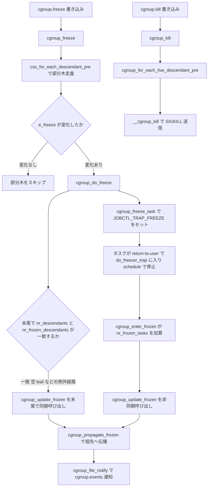

# 第15章 cgroup v2 の freezer と events と kill

> **本章で読むソース**
>
> - [`include/linux/cgroup-defs.h` L58-L73](https://github.com/gregkh/linux/blob/v6.18.38/include/linux/cgroup-defs.h#L58-L73)
> - [`include/linux/cgroup-defs.h` L436-L455](https://github.com/gregkh/linux/blob/v6.18.38/include/linux/cgroup-defs.h#L436-L455)
> - [`kernel/cgroup/cgroup.c` L4165-L4188](https://github.com/gregkh/linux/blob/v6.18.38/kernel/cgroup/cgroup.c#L4165-L4188)
> - [`kernel/cgroup/freezer.c` L152-L169](https://github.com/gregkh/linux/blob/v6.18.38/kernel/cgroup/freezer.c#L152-L169)
> - [`kernel/cgroup/freezer.c` L174-L219](https://github.com/gregkh/linux/blob/v6.18.38/kernel/cgroup/freezer.c#L174-L219)
> - [`kernel/cgroup/freezer.c` L263-L326](https://github.com/gregkh/linux/blob/v6.18.38/kernel/cgroup/freezer.c#L263-L326)
> - [`kernel/cgroup/freezer.c` L36-L60](https://github.com/gregkh/linux/blob/v6.18.38/kernel/cgroup/freezer.c#L36-L60)
> - [`kernel/cgroup/freezer.c` L66-L81](https://github.com/gregkh/linux/blob/v6.18.38/kernel/cgroup/freezer.c#L66-L81)
> - [`kernel/cgroup/cgroup.c` L3819-L3827](https://github.com/gregkh/linux/blob/v6.18.38/kernel/cgroup/cgroup.c#L3819-L3827)
> - [`include/linux/cgroup.h` L580-L585](https://github.com/gregkh/linux/blob/v6.18.38/include/linux/cgroup.h#L580-L585)
> - [`kernel/cgroup/cgroup.c` L4190-L4214](https://github.com/gregkh/linux/blob/v6.18.38/kernel/cgroup/cgroup.c#L4190-L4214)
> - [`kernel/cgroup/cgroup.c` L4227-L4258](https://github.com/gregkh/linux/blob/v6.18.38/kernel/cgroup/cgroup.c#L4227-L4258)
> - [`kernel/cgroup/cgroup.c` L4698-L4715](https://github.com/gregkh/linux/blob/v6.18.38/kernel/cgroup/cgroup.c#L4698-L4715)
> - [`kernel/cgroup/cgroup.c` L6716-L6719](https://github.com/gregkh/linux/blob/v6.18.38/kernel/cgroup/cgroup.c#L6716-L6719)
> - [`kernel/cgroup/cgroup.c` L6950-L6956](https://github.com/gregkh/linux/blob/v6.18.38/kernel/cgroup/cgroup.c#L6950-L6956)
> - [`kernel/cgroup/cgroup.c` L6978-L6980](https://github.com/gregkh/linux/blob/v6.18.38/kernel/cgroup/cgroup.c#L6978-L6980)

## 共通規約

コード引用は [`gregkh/linux` の `v6.18.38`](https://github.com/gregkh/linux/tree/v6.18.38) に固定する。
行番号はローカル展開ソースと照合して確認し、成果物にはローカル絶対パスを書かない。

## この章の狙い

cgroup v2 の組み込み **freezer** が階層全体でタスクの一括停止と再開をどう実現するかを読む。
`cgroup.freeze` から `cgroup_do_freeze` に至る経路と、祖先方向への状態伝播を追う。
あわせて `cgroup.events` の通知と `cgroup.kill` による一括 SIGKILL を扱う。

## 前提

- [第12章 cgroup v2 階層と kernfs](12-cgroup-hierarchy-kernfs.md)
- [第13章 タスクの cgroup 所属と migration](14-cgroup-attach-migration.md)

## freezer の状態モデル

cgroup v2 の freezer 状態は `struct cgroup_freezer_state` に集約される。
`freeze` はユーザーが `cgroup.freeze` に書いたこの cgroup 自身の要求である。
`e_freeze` は祖先の `e_freeze` と自身の `freeze` の OR で決まる実効的な凍結要求である。

[`include/linux/cgroup-defs.h` L436-L455](https://github.com/gregkh/linux/blob/v6.18.38/include/linux/cgroup-defs.h#L436-L455)

```c
struct cgroup_freezer_state {
	/* Should the cgroup and its descendants be frozen. */
	bool freeze;

	/* Should the cgroup actually be frozen? */
	bool e_freeze;

	/* Fields below are protected by css_set_lock */

	/* Number of frozen descendant cgroups */
	int nr_frozen_descendants;

	/*
	 * Number of tasks, which are counted as frozen:
	 * frozen, SIGSTOPped, and PTRACEd.
	 */
	int nr_frozen_tasks;

	/* Freeze time data consistency protection */
	seqcount_spinlock_t freeze_seq;
```

`cgrp->flags` には要求ビット `CGRP_FREEZE` と実際に凍結済みの `CGRP_FROZEN` がある。
前者は `cgroup_do_freeze` が立て、後者は全タスクが凍結として数えられたとき `cgroup_update_frozen` が立てる。

[`include/linux/cgroup-defs.h` L58-L73](https://github.com/gregkh/linux/blob/v6.18.38/include/linux/cgroup-defs.h#L58-L73)

```c
enum {
	/* Control Group requires release notifications to userspace */
	CGRP_NOTIFY_ON_RELEASE,
	/*
	 * Clone the parent's configuration when creating a new child
	 * cpuset cgroup.  For historical reasons, this option can be
	 * specified at mount time and thus is implemented here.
	 */
	CGRP_CPUSET_CLONE_CHILDREN,

	/* Control group has to be frozen. */
	CGRP_FREEZE,

	/* Cgroup is frozen. */
	CGRP_FROZEN,
};
```

凍結カウンタは二層に分かれる。
`nr_frozen_tasks` はこの cgroup 直下のタスクのうち凍結として数えるタスク数である。
freezer trap で sleep した task だけでなく、SIGSTOP による group stop 中と ptrace 停止中の task も `cgroup_enter_frozen` を通じて算入される。
`nr_frozen_descendants` は子孫 cgroup のうち `CGRP_FROZEN` が立っているものの数で、祖先伝播に使う cgroup 単位の別カウンタである。

`CGRP_FROZEN` の直接判定は `cgroup_update_frozen` が行う。
`CGRP_FREEZE` が立ち、かつ `nr_frozen_tasks == __cgroup_task_count(cgrp)` のときだけ `CGRP_FROZEN` になる。
`task_struct` 側の `frozen` ビットもタスク単位の凍結状態を示す。

## cgroup.freeze 書き込みから cgroup_freeze まで

`cgroup.freeze` への書き込みは `cgroup_freeze_write` が受ける。
0 または 1 のみ許可し、`cgroup_kn_lock_live` で cgroup を固定してから `cgroup_freeze` を呼ぶ。
第12章で読んだ kernfs 経由の書き込みパターンと同型である。

[`kernel/cgroup/cgroup.c` L4165-L4188](https://github.com/gregkh/linux/blob/v6.18.38/kernel/cgroup/cgroup.c#L4165-L4188)

```c
static ssize_t cgroup_freeze_write(struct kernfs_open_file *of,
				   char *buf, size_t nbytes, loff_t off)
{
	struct cgroup *cgrp;
	ssize_t ret;
	int freeze;

	ret = kstrtoint(strstrip(buf), 0, &freeze);
	if (ret)
		return ret;

	if (freeze < 0 || freeze > 1)
		return -ERANGE;

	cgrp = cgroup_kn_lock_live(of->kn, false);
	if (!cgrp)
		return -ENOENT;

	cgroup_freeze(cgrp, freeze);

	cgroup_kn_unlock(of->kn);

	return nbytes;
}
```

`cgroup_freeze` は部分木を pre-order で走査する。
各子孫の `e_freeze` を親の `e_freeze` と自身の `freeze` の OR で再計算し、変化がなければ `css_rightmost_descendant` でその部分木ごとスキップする。
変化があれば `cgroup_do_freeze` で実際の凍結または解凍を適用する。

[`kernel/cgroup/freezer.c` L263-L326](https://github.com/gregkh/linux/blob/v6.18.38/kernel/cgroup/freezer.c#L263-L326)

```c
void cgroup_freeze(struct cgroup *cgrp, bool freeze)
{
	struct cgroup_subsys_state *css;
	struct cgroup *parent;
	struct cgroup *dsct;
	bool applied = false;
	u64 ts_nsec;
	bool old_e;

	lockdep_assert_held(&cgroup_mutex);

	/*
	 * Nothing changed? Just exit.
	 */
	if (cgrp->freezer.freeze == freeze)
		return;

	cgrp->freezer.freeze = freeze;
	ts_nsec = ktime_get_ns();

	/*
	 * Propagate changes downwards the cgroup tree.
	 */
	css_for_each_descendant_pre(css, &cgrp->self) {
		dsct = css->cgroup;

		if (cgroup_is_dead(dsct))
			continue;

		/*
		 * e_freeze is affected by parent's e_freeze and dst's freeze.
		 * If old e_freeze eq new e_freeze, no change, its children
		 * will not be affected. So do nothing and skip the subtree
		 */
		old_e = dsct->freezer.e_freeze;
		parent = cgroup_parent(dsct);
		dsct->freezer.e_freeze = (dsct->freezer.freeze ||
					  parent->freezer.e_freeze);
		if (dsct->freezer.e_freeze == old_e) {
			css = css_rightmost_descendant(css);
			continue;
		}

		/*
		 * Do change actual state: freeze or unfreeze.
		 */
		cgroup_do_freeze(dsct, freeze, ts_nsec);
		applied = true;
	}

	/*
	 * Even if the actual state hasn't changed, let's notify a user.
	 * The state can be enforced by an ancestor cgroup: the cgroup
	 * can already be in the desired state or it can be locked in the
	 * opposite state, so that the transition will never happen.
	 * In both cases it's better to notify a user, that there is
	 * nothing to wait for.
	 */
	if (!applied) {
		TRACE_CGROUP_PATH(notify_frozen, cgrp,
				  test_bit(CGRP_FROZEN, &cgrp->flags));
		cgroup_file_notify(&cgrp->events_file);
	}
}
```

## cgroup_do_freeze とタスク単位の凍結

`cgroup_do_freeze` は `freeze_seq` で `CGRP_FREEZE` ビットと凍結時間の一貫性を守る。
直下タスクを `css_task_iter` で走査し、`PF_KTHREAD` はスキップする。
`cgroup_freeze_task` が `JOBCTL_TRAP_FREEZE` をセットまたはクリアし、タスクを起こす。

[`kernel/cgroup/freezer.c` L174-L219](https://github.com/gregkh/linux/blob/v6.18.38/kernel/cgroup/freezer.c#L174-L219)

```c
static void cgroup_do_freeze(struct cgroup *cgrp, bool freeze, u64 ts_nsec)
{
	struct css_task_iter it;
	struct task_struct *task;

	lockdep_assert_held(&cgroup_mutex);

	spin_lock_irq(&css_set_lock);
	write_seqcount_begin(&cgrp->freezer.freeze_seq);
	if (freeze) {
		set_bit(CGRP_FREEZE, &cgrp->flags);
		cgrp->freezer.freeze_start_nsec = ts_nsec;
	} else {
		clear_bit(CGRP_FREEZE, &cgrp->flags);
		cgrp->freezer.frozen_nsec += (ts_nsec -
			cgrp->freezer.freeze_start_nsec);
	}
	write_seqcount_end(&cgrp->freezer.freeze_seq);
	spin_unlock_irq(&css_set_lock);

	if (freeze)
		TRACE_CGROUP_PATH(freeze, cgrp);
	else
		TRACE_CGROUP_PATH(unfreeze, cgrp);

	css_task_iter_start(&cgrp->self, 0, &it);
	while ((task = css_task_iter_next(&it))) {
		/*
		 * Ignore kernel threads here. Freezing cgroups containing
		 * kthreads isn't supported.
		 */
		if (task->flags & PF_KTHREAD)
			continue;
		cgroup_freeze_task(task, freeze);
	}
	css_task_iter_end(&it);

	/*
	 * Cgroup state should be revisited here to cover empty leaf cgroups
	 * and cgroups which descendants are already in the desired state.
	 */
	spin_lock_irq(&css_set_lock);
	if (cgrp->nr_descendants == cgrp->freezer.nr_frozen_descendants)
		cgroup_update_frozen(cgrp);
	spin_unlock_irq(&css_set_lock);
}
```

[`kernel/cgroup/freezer.c` L152-L169](https://github.com/gregkh/linux/blob/v6.18.38/kernel/cgroup/freezer.c#L152-L169)

```c
static void cgroup_freeze_task(struct task_struct *task, bool freeze)
{
	unsigned long flags;

	/* If the task is about to die, don't bother with freezing it. */
	if (!lock_task_sighand(task, &flags))
		return;

	if (freeze) {
		task->jobctl |= JOBCTL_TRAP_FREEZE;
		signal_wake_up(task, false);
	} else {
		task->jobctl &= ~JOBCTL_TRAP_FREEZE;
		wake_up_process(task);
	}

	unlock_task_sighand(task, &flags);
}
```

タスクが実際に止まる契機は return-to-user の signal/jobctl 処理である。
通常の freezer trap は `get_signal` 内の `do_freezer_trap` が `JOBCTL_TRAP_FREEZE` を処理し、`TASK_INTERRUPTIBLE|TASK_FREEZABLE` にしてから `cgroup_enter_frozen` を呼び `schedule` で停止する。
group stop と ptrace stop も `cgroup_enter_frozen` を通り、`nr_frozen_tasks` に算入される。
第13章の `cgroup_freezer_migrate_task` は migration 時にカウンタと `JOBCTL_TRAP_FREEZE` を引き継ぐ。

## cgroup_update_frozen と cgroup_propagate_frozen

`cgroup_update_frozen` は freeze 要求中かつ全タスクが凍結として数えられているかを再判定し `CGRP_FROZEN` を更新する。
変化があれば `cgroup_propagate_frozen` で祖先へ伝播する。

[`kernel/cgroup/freezer.c` L66-L81](https://github.com/gregkh/linux/blob/v6.18.38/kernel/cgroup/freezer.c#L66-L81)

```c
void cgroup_update_frozen(struct cgroup *cgrp)
{
	bool frozen;

	/*
	 * If the cgroup has to be frozen (CGRP_FREEZE bit set),
	 * and all tasks are frozen and/or stopped, let's consider
	 * the cgroup frozen. Otherwise it's not frozen.
	 */
	frozen = test_bit(CGRP_FREEZE, &cgrp->flags) &&
		cgrp->freezer.nr_frozen_tasks == __cgroup_task_count(cgrp);

	/* If flags is updated, update the state of ancestor cgroups. */
	if (cgroup_update_frozen_flag(cgrp, frozen))
		cgroup_propagate_frozen(cgrp, frozen);
}
```

[`kernel/cgroup/freezer.c` L36-L60](https://github.com/gregkh/linux/blob/v6.18.38/kernel/cgroup/freezer.c#L36-L60)

```c
static void cgroup_propagate_frozen(struct cgroup *cgrp, bool frozen)
{
	int desc = 1;

	/*
	 * If the new state is frozen, some freezing ancestor cgroups may change
	 * their state too, depending on if all their descendants are frozen.
	 *
	 * Otherwise, all ancestor cgroups are forced into the non-frozen state.
	 */
	while ((cgrp = cgroup_parent(cgrp))) {
		if (frozen) {
			cgrp->freezer.nr_frozen_descendants += desc;
			if (!test_bit(CGRP_FREEZE, &cgrp->flags) ||
			    (cgrp->freezer.nr_frozen_descendants !=
			    cgrp->nr_descendants))
				continue;
		} else {
			cgrp->freezer.nr_frozen_descendants -= desc;
		}

		if (cgroup_update_frozen_flag(cgrp, frozen))
			desc++;
	}
}
```

凍結時は祖先が freeze 要求中かつ全子孫が凍結済みのときだけ祖先も `CGRP_FROZEN` になる。
解凍時は祖先を強制的に非 frozen に戻す非対称なロジックである。
`cgroup_update_frozen_flag` はビット更新のあと `cgroup_file_notify` を呼ぶ。

## cgroup.events と cgroup_file_notify

`cgroup.events` は `cgroup_events_show` が `populated` と `frozen` を出力する。
`frozen` は `CGRP_FROZEN` ビットを反映する。

[`kernel/cgroup/cgroup.c` L3819-L3827](https://github.com/gregkh/linux/blob/v6.18.38/kernel/cgroup/cgroup.c#L3819-L3827)

```c
static int cgroup_events_show(struct seq_file *seq, void *v)
{
	struct cgroup *cgrp = seq_css(seq)->cgroup;

	seq_printf(seq, "populated %d\n", cgroup_is_populated(cgrp));
	seq_printf(seq, "frozen %d\n", test_bit(CGRP_FROZEN, &cgrp->flags));

	return 0;
}
```

`populated` は単純な「直下タスクの有無」ではなく `cgroup_is_populated` の判定である。
自身に紐づく css_set のうちタスクを持つものの数 `nr_populated_csets` に加え、populated な domain 子と threaded 子のカウンタ `nr_populated_domain_children`／`nr_populated_threaded_children` も加算するため、当該 cgroup 自身にタスクがいなくても子孫のいずれかにいれば真になる。

[`include/linux/cgroup.h` L580-L585](https://github.com/gregkh/linux/blob/v6.18.38/include/linux/cgroup.h#L580-L585)

```c
/* no synchronization, the result can only be used as a hint */
static inline bool cgroup_is_populated(struct cgroup *cgrp)
{
	return cgrp->nr_populated_csets + cgrp->nr_populated_domain_children +
		cgrp->nr_populated_threaded_children;
}
```

通知は `cgroup_file_notify` が `kernfs_notify` で poll 待機者を起こす。
直近の通知から `CGROUP_FILE_NOTIFY_MIN_INTV` 以内なら `kernfs_notify` を遅延し、タイマーでまとめて送る。

[`kernel/cgroup/cgroup.c` L4698-L4715](https://github.com/gregkh/linux/blob/v6.18.38/kernel/cgroup/cgroup.c#L4698-L4715)

```c
void cgroup_file_notify(struct cgroup_file *cfile)
{
	unsigned long flags;

	spin_lock_irqsave(&cgroup_file_kn_lock, flags);
	if (cfile->kn) {
		unsigned long last = cfile->notified_at;
		unsigned long next = last + CGROUP_FILE_NOTIFY_MIN_INTV;

		if (time_in_range(jiffies, last, next)) {
			timer_reduce(&cfile->notify_timer, next);
		} else {
			kernfs_notify(cfile->kn);
			cfile->notified_at = jiffies;
		}
	}
	spin_unlock_irqrestore(&cgroup_file_kn_lock, flags);
}
```

`CGROUP_FILE_NOTIFY_MIN_INTV` は `DIV_ROUND_UP(HZ, 100)` で、秒間100回を上限とするレート制限である。

## cgroup.kill による一括 SIGKILL

`cgroup.kill` への書き込みは値 `1` のみ許可する。
threaded cgroup では `-EOPNOTSUPP` を返し、`cgroup.procs` と同様にプロセス単位操作として非 threaded のみ受け付ける。
書き込みは `cgroup_kn_lock_live` 経由で `cgroup_mutex` を握るため、migration など他の cgroup 操作と直列化される。

[`kernel/cgroup/cgroup.c` L4227-L4258](https://github.com/gregkh/linux/blob/v6.18.38/kernel/cgroup/cgroup.c#L4227-L4258)

```c
static ssize_t cgroup_kill_write(struct kernfs_open_file *of, char *buf,
				 size_t nbytes, loff_t off)
{
	ssize_t ret = 0;
	int kill;
	struct cgroup *cgrp;

	ret = kstrtoint(strstrip(buf), 0, &kill);
	if (ret)
		return ret;

	if (kill != 1)
		return -ERANGE;

	cgrp = cgroup_kn_lock_live(of->kn, false);
	if (!cgrp)
		return -ENOENT;

	/*
	 * Killing is a process directed operation, i.e. the whole thread-group
	 * is taken down so act like we do for cgroup.procs and only make this
	 * writable in non-threaded cgroups.
	 */
	if (cgroup_is_threaded(cgrp))
		ret = -EOPNOTSUPP;
	else
		cgroup_kill(cgrp);

	cgroup_kn_unlock(of->kn);

	return ret ?: nbytes;
}
```

`cgroup_kill` は live な子孫を pre-order で辿り、各 cgroup に `__cgroup_kill` を適用する。
`__cgroup_kill` は `CSS_TASK_ITER_PROCS | CSS_TASK_ITER_THREADED` 付きイテレータで、通常 cset と threaded cset の各スレッドグループ leader を走査する。
`CSS_TASK_ITER_PROCS` は非 leader を除外し、leader への SIGKILL でプロセス全体を終了させる。
`CSS_TASK_ITER_THREADED` は domain cset に紐づく threaded cset も走査対象に加える指定である。

[`kernel/cgroup/cgroup.c` L4190-L4214](https://github.com/gregkh/linux/blob/v6.18.38/kernel/cgroup/cgroup.c#L4190-L4214)

```c
static void __cgroup_kill(struct cgroup *cgrp)
{
	struct css_task_iter it;
	struct task_struct *task;

	lockdep_assert_held(&cgroup_mutex);

	spin_lock_irq(&css_set_lock);
	cgrp->kill_seq++;
	spin_unlock_irq(&css_set_lock);

	css_task_iter_start(&cgrp->self, CSS_TASK_ITER_PROCS | CSS_TASK_ITER_THREADED, &it);
	while ((task = css_task_iter_next(&it))) {
		/* Ignore kernel threads here. */
		if (task->flags & PF_KTHREAD)
			continue;

		/* Skip tasks that are already dying. */
		if (__fatal_signal_pending(task))
			continue;

		send_sig(SIGKILL, task, 0);
	}
	css_task_iter_end(&it);
}
```

`kill_seq` は走査と並行する fork の取りこぼしを防ぐ。
`__cgroup_kill` は SIGKILL 送信前に `kill_seq` を増分する。
fork 時 `cgroup_css_set_fork` が宛先 cgroup の `kill_seq` を `kargs->kill_seq` に保存する。

[`kernel/cgroup/cgroup.c` L6716-L6719](https://github.com/gregkh/linux/blob/v6.18.38/kernel/cgroup/cgroup.c#L6716-L6719)

```c
	if (kargs->cgrp)
		kargs->kill_seq = kargs->cgrp->kill_seq;
	else
		kargs->kill_seq = cset->dfl_cgrp->kill_seq;
```

`cgroup_post_fork` が保存値と現在の `kill_seq` を比較し、差があれば `kill` フラグを立てる。

[`kernel/cgroup/cgroup.c` L6950-L6956](https://github.com/gregkh/linux/blob/v6.18.38/kernel/cgroup/cgroup.c#L6950-L6956)

```c
		/*
		 * If the cgroup is to be killed notice it now and take the
		 * child down right after we finished preparing it for
		 * userspace.
		 */
		kill = kargs->kill_seq != cgrp_kill_seq;
	}
```

`kill` フラグが立った場合、`cgroup_post_fork` は各 `ss->fork()` 呼び出しのあとで `do_send_sig_info` により実際に SIGKILL を child へ送る。
kill 実行中に fork したプロセスも確実に終了し、一括性が保たれる。

[`kernel/cgroup/cgroup.c` L6978-L6980](https://github.com/gregkh/linux/blob/v6.18.38/kernel/cgroup/cgroup.c#L6978-L6980)

```c
	/* Cgroup has to be killed so take down child immediately. */
	if (unlikely(kill))
		do_send_sig_info(SIGKILL, SEND_SIG_NOINFO, child, PIDTYPE_TGID);
```

## 処理フロー



freezer 側は `cgroup_do_freeze` の末尾で完結する同期経路と、タスクが freezer trap に入って `cgroup_enter_frozen` に届く非同期経路の2通りで `cgroup_update_frozen` に合流する。
kill 側は部分木走査と leader への SIGKILL、fork 時の `kill_seq` 救済が組み合わさる。

## 高速化と最適化の工夫

**`css_rightmost_descendant` による部分木スキップ**が freezer 走査の主な工夫である。

`cgroup_freeze` の pre-order 走査中、ある cgroup の `e_freeze` が変化しなければ、その子孫の `e_freeze` も変化しない。
親の `e_freeze` が変わらない限り子の実効値は不変だからである。
このとき `css = css_rightmost_descendant(css)` でカーソルをその部分木の右端葉まで進め、`cgroup_do_freeze` の本体処理を省略する。

`css_rightmost_descendant` は各段で末尾 child を辿りながら右端葉まで降りる関数である。
部分木の全ノードを O(1) で飛ばすわけではなく、状態が変わらない部分木の本体処理を省く効果がある。

あわせて `cgroup_file_notify` は `CGROUP_FILE_NOTIFY_MIN_INTV` で `kernfs_notify` の頻度を抑える。
freeze と unfreeze、タスクの出入りが連続すると `cgroup.events` の更新が増えるが、通知ストームを避ける。

> **7.x 系での変化**
> [`kernel/cgroup/freezer.c`](https://github.com/gregkh/linux/blob/v7.1.3/kernel/cgroup/freezer.c) は v6.18.38 と diff がゼロで、freezer 本体ロジックは無変更である。
> [`cgroup_file_notify` L4656-L4685](https://github.com/gregkh/linux/blob/v7.1.3/kernel/cgroup/cgroup.c#L4656-L4685) ではロック機構が変わる。
> v6.18.38 は全 `cgroup_file` 共有のグローバル `cgroup_file_kn_lock` で保護する。
> v7.1.3 は `struct cgroup_file` に per-file の `spinlock_t lock` を追加し、レート制限ウィンドウ内でタイマーが pending ならロックを取らずに return する fast path を持つ。
> `cgroup_freeze_write` や `__cgroup_kill` の本体は同一で、行番号のみずれる。

## まとめ

cgroup v2 freezer は `freeze` と `e_freeze`、二層の凍結カウンタ、`CGRP_FROZEN` で階層的な一括停止を表現する。
タスク停止は return-to-user の freezer trap と `cgroup_enter_frozen` で `nr_frozen_tasks` に反映される。
`cgroup.kill` は leader 走査と `kill_seq` で一括 SIGKILL と fork 取りこぼし防止を両立する。
本章は v1 の `legacy_freezer.c` ではなく cgroup v2 組み込み freezer のみを扱う。

## 関連する章

- [第12章 cgroup v2 階層と kernfs](12-cgroup-hierarchy-kernfs.md)
- [第13章 タスクの cgroup 所属と migration](14-cgroup-attach-migration.md)
- [第16章 cgroup namespace とパス表示](16-cgroup-namespace.md)
- [第18章 cpu コントローラと sched 連携](../part03-controllers/18-cpu-controller.md)
