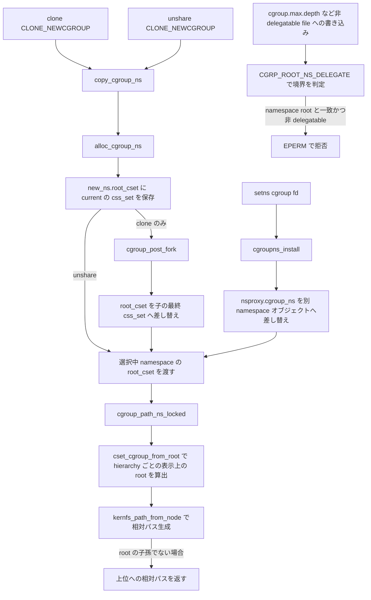

# 第16章 cgroup namespace とパス表示

> **本章で読むソース**
>
> - [`include/linux/cgroup_namespace.h` L7-L12](https://github.com/gregkh/linux/blob/v6.18.38/include/linux/cgroup_namespace.h#L7-L12)
> - [`kernel/cgroup/cgroup.c` L251-L259](https://github.com/gregkh/linux/blob/v6.18.38/kernel/cgroup/cgroup.c#L251-L259)
> - [`kernel/cgroup/namespace.c` L22-L46](https://github.com/gregkh/linux/blob/v6.18.38/kernel/cgroup/namespace.c#L22-L46)
> - [`kernel/cgroup/namespace.c` L48-L90](https://github.com/gregkh/linux/blob/v6.18.38/kernel/cgroup/namespace.c#L48-L90)
> - [`kernel/cgroup/cgroup.c` L6969-L6976](https://github.com/gregkh/linux/blob/v6.18.38/kernel/cgroup/cgroup.c#L6969-L6976)
> - [`kernel/cgroup/namespace.c` L92-L110](https://github.com/gregkh/linux/blob/v6.18.38/kernel/cgroup/namespace.c#L92-L110)
> - [`kernel/cgroup/namespace.c` L112-L144](https://github.com/gregkh/linux/blob/v6.18.38/kernel/cgroup/namespace.c#L112-L144)
> - [`kernel/cgroup/cgroup.c` L2484-L2490](https://github.com/gregkh/linux/blob/v6.18.38/kernel/cgroup/cgroup.c#L2484-L2490)
> - [`kernel/cgroup/cgroup.c` L1442-L1475](https://github.com/gregkh/linux/blob/v6.18.38/kernel/cgroup/cgroup.c#L1442-L1475)
> - [`fs/kernfs/dir.c` L94-L126](https://github.com/gregkh/linux/blob/v6.18.38/fs/kernfs/dir.c#L94-L126)
> - [`kernel/cgroup/cgroup.c` L4297-L4319](https://github.com/gregkh/linux/blob/v6.18.38/kernel/cgroup/cgroup.c#L4297-L4319)

## 共通規約

コード引用は [`gregkh/linux` の `v6.18.38`](https://github.com/gregkh/linux/tree/v6.18.38) に固定する。
行番号はローカル展開ソースと照合して確認し、成果物にはローカル絶対パスを書かない。

## この章の狙い

**cgroup namespace** が cgroup パス表示の根をどう切り替えるかを読む。
`root_cset` による表示上の root 決定、`setns` 操作テーブル、および `CGRP_ROOT_NS_DELEGATE` による書き込み境界を押さえる。

## 前提

- [第2章 nsproxy と namespace のライフサイクル](../part00-foundation/02-nsproxy-lifecycle.md)
- [第14章 タスクの cgroup 所属と migration](14-cgroup-attach-migration.md)

## cgroup_namespace の構造

cgroup namespace は `nsproxy` の `cgroup_ns` メンバとしてタスクに結び付く。
4 メンバは役割が異なり、見える cgroup root を決める固有状態が `root_cset` である。
`user_ns` は setns 時の capability 判定に、`ucounts` は namespace 数の上限管理に使われる。

[`include/linux/cgroup_namespace.h` L7-L12](https://github.com/gregkh/linux/blob/v6.18.38/include/linux/cgroup_namespace.h#L7-L12)

```c
struct cgroup_namespace {
	struct ns_common	ns;
	struct user_namespace	*user_ns;
	struct ucounts		*ucounts;
	struct css_set          *root_cset;
};
```

`root_cset` は namespace 作成時点の `css_set` のスナップショットとして始まる。
`CLONE_NEWCGROUP` 付き `clone` では、後述の `cgroup_post_fork` が子タスクの最終的な `css_set` へこれを差し替えるため、確定するのは fork 完了後である。
`unshare` 経路ではこの差し替えは起きず、`current` の所属がそのまま最終的な root になる。
namespace 内のパス解決は、この `css_set` から hierarchy ごとに対応する cgroup を選んで根とする（詳細は後述）。

初期タスクの cgroup namespace は `init_cgroup_ns` で、`root_cset` は `init_css_set` を指す。

[`kernel/cgroup/cgroup.c` L251-L259](https://github.com/gregkh/linux/blob/v6.18.38/kernel/cgroup/cgroup.c#L251-L259)

```c
/* cgroup namespace for init task */
struct cgroup_namespace init_cgroup_ns = {
	.ns.__ns_ref	= REFCOUNT_INIT(2),
	.user_ns	= &init_user_ns,
	.ns.ops		= &cgroupns_operations,
	.ns.inum	= ns_init_inum(&init_cgroup_ns),
	.root_cset	= &init_css_set,
	.ns.ns_type	= ns_common_type(&init_cgroup_ns),
};
```

コンテナ内から `/proc/self/cgroup` を読むと、ホスト全体のパスではなく namespace 内の相対パスが返る。
これは cgroup 所属そのものを変えず、表示だけを切り替える設計である。

## alloc_cgroup_ns と free_cgroup_ns

新しい cgroup namespace オブジェクトは `alloc_cgroup_ns` で確保する。
`kzalloc` のあと `ns_common_init` で inum、ops、参照カウントを初期化する。
`__free(kfree)` cleanup 属性により、エラーパスでの解放が自動化されている。

破棄は `free_cgroup_ns` が担う。
`ns_tree_remove` のあと `put_css_set(ns->root_cset)` で `copy_cgroup_ns` 時に `get_css_set` した参照を手放す。
`kfree_rcu` はコメントのとおり、並行する ns tree 走査が grace period に依存するため使われる。

[`kernel/cgroup/namespace.c` L22-L46](https://github.com/gregkh/linux/blob/v6.18.38/kernel/cgroup/namespace.c#L22-L46)

```c
static struct cgroup_namespace *alloc_cgroup_ns(void)
{
	struct cgroup_namespace *new_ns __free(kfree) = NULL;
	int ret;

	new_ns = kzalloc(sizeof(struct cgroup_namespace), GFP_KERNEL_ACCOUNT);
	if (!new_ns)
		return ERR_PTR(-ENOMEM);
	ret = ns_common_init(new_ns);
	if (ret)
		return ERR_PTR(ret);
	return no_free_ptr(new_ns);
}

void free_cgroup_ns(struct cgroup_namespace *ns)
{
	ns_tree_remove(ns);
	put_css_set(ns->root_cset);
	dec_cgroup_namespaces(ns->ucounts);
	put_user_ns(ns->user_ns);
	ns_common_free(ns);
	/* Concurrent nstree traversal depends on a grace period. */
	kfree_rcu(ns, ns.ns_rcu);
}
EXPORT_SYMBOL(free_cgroup_ns);
```

## copy_cgroup_ns

`CLONE_NEWCGROUP` 付き `clone` または `unshare` で新しい cgroup namespace が作られる。
`copy_cgroup_ns` は他 namespace と同様、フラグが立っていなければ既存を参照カウントするだけで返す。

[`kernel/cgroup/namespace.c` L48-L90](https://github.com/gregkh/linux/blob/v6.18.38/kernel/cgroup/namespace.c#L48-L90)

```c
struct cgroup_namespace *copy_cgroup_ns(u64 flags,
					struct user_namespace *user_ns,
					struct cgroup_namespace *old_ns)
{
	struct cgroup_namespace *new_ns;
	struct ucounts *ucounts;
	struct css_set *cset;

	BUG_ON(!old_ns);

	if (!(flags & CLONE_NEWCGROUP)) {
		get_cgroup_ns(old_ns);
		return old_ns;
	}

	/* Allow only sysadmin to create cgroup namespace. */
	if (!ns_capable(user_ns, CAP_SYS_ADMIN))
		return ERR_PTR(-EPERM);

	ucounts = inc_cgroup_namespaces(user_ns);
	if (!ucounts)
		return ERR_PTR(-ENOSPC);

	/* It is not safe to take cgroup_mutex here */
	spin_lock_irq(&css_set_lock);
	cset = task_css_set(current);
	get_css_set(cset);
	spin_unlock_irq(&css_set_lock);

	new_ns = alloc_cgroup_ns();
	if (IS_ERR(new_ns)) {
		put_css_set(cset);
		dec_cgroup_namespaces(ucounts);
		return new_ns;
	}

	new_ns->user_ns = get_user_ns(user_ns);
	new_ns->ucounts = ucounts;
	new_ns->root_cset = cset;

	ns_tree_add(new_ns);
	return new_ns;
}
```

コメント "It is not safe to take cgroup_mutex here" が示すのは、この文脈で `cgroup_mutex` を取るのが unsafe だということである。
その代わり `current` の所属 snapshot の取得と refcount は、`task->cgroups` と `css_set` を保護する `css_set_lock` の下だけで完結する。
namespace 作成はタスクの cgroup 所属そのものは変えず、新 namespace の `root_cset` に現在の `css_set` を格納するだけである。

## cgroup_post_fork による root_cset の確定

`copy_cgroup_ns` が保存するのは、あくまで呼び出し時点の `current` の `css_set` である。
`clone` 経路では、子タスクを実際の `css_set` に link し終えたあとに `cgroup_post_fork` が呼ばれ、`CLONE_NEWCGROUP` が立っていれば新 namespace の `root_cset` を子タスクの最終的な `css_set` へ差し替える。

[`kernel/cgroup/cgroup.c` L6969-L6976](https://github.com/gregkh/linux/blob/v6.18.38/kernel/cgroup/cgroup.c#L6969-L6976)

```c
	/* Make the new cset the root_cset of the new cgroup namespace. */
	if (kargs->flags & CLONE_NEWCGROUP) {
		struct css_set *rcset = child->nsproxy->cgroup_ns->root_cset;

		get_css_set(cset);
		child->nsproxy->cgroup_ns->root_cset = cset;
		put_css_set(rcset);
	}
```

`cset` は子タスクが実際に所属することになった `css_set` である。
`CLONE_INTO_CGROUP` を伴わない通常の `clone` では、子はデフォルトで親と同じ cgroup に置かれるため、この `cset` は `copy_cgroup_ns` が snapshot した `css_set` と一致することが多い。
`CLONE_NEWCGROUP` と `CLONE_INTO_CGROUP` を組み合わせた場合は、子の最終的な所属先が親と異なる cgroup になり得るため、確定する cgroupns root は `clone` 呼び出し元の cgroup ではなく子の target cgroup になる。
`unshare(CLONE_NEWCGROUP)` はこの `cgroup_post_fork` 経路を通らない。
そのため `unshare` では `copy_cgroup_ns` 時点の `current` の所属が、差し替えを受けずにそのまま最終的な root になる。

## cgroupns_install と setns 操作テーブル

`setns` による切り替えは `cgroupns_install` が `nsproxy->cgroup_ns` を差し替える。
呼び出し元と対象 namespace の両方の `user_ns` に対して `CAP_SYS_ADMIN` を要求する二重チェックがある。
自分自身の cgroup namespace への setns は早期 return 0 で no-op である。

[`kernel/cgroup/namespace.c` L92-L110](https://github.com/gregkh/linux/blob/v6.18.38/kernel/cgroup/namespace.c#L92-L110)

```c
static int cgroupns_install(struct nsset *nsset, struct ns_common *ns)
{
	struct nsproxy *nsproxy = nsset->nsproxy;
	struct cgroup_namespace *cgroup_ns = to_cg_ns(ns);

	if (!ns_capable(nsset->cred->user_ns, CAP_SYS_ADMIN) ||
	    !ns_capable(cgroup_ns->user_ns, CAP_SYS_ADMIN))
		return -EPERM;

	/* Don't need to do anything if we are attaching to our own cgroupns. */
	if (cgroup_ns == nsproxy->cgroup_ns)
		return 0;

	get_cgroup_ns(cgroup_ns);
	put_cgroup_ns(nsproxy->cgroup_ns);
	nsproxy->cgroup_ns = cgroup_ns;

	return 0;
}
```

`/proc/[pid]/ns/cgroup` 経由の参照と setns は、`proc_ns_operations` テーブル `cgroupns_operations` に配線される。
第3章で読んだ `ns_common` ops 経由の setns 汎用経路が、ここで cgroup namespace 固有の `install` に接続する。

[`kernel/cgroup/namespace.c` L112-L144](https://github.com/gregkh/linux/blob/v6.18.38/kernel/cgroup/namespace.c#L112-L144)

```c
static struct ns_common *cgroupns_get(struct task_struct *task)
{
	struct cgroup_namespace *ns = NULL;
	struct nsproxy *nsproxy;

	task_lock(task);
	nsproxy = task->nsproxy;
	if (nsproxy) {
		ns = nsproxy->cgroup_ns;
		get_cgroup_ns(ns);
	}
	task_unlock(task);

	return ns ? &ns->ns : NULL;
}

static void cgroupns_put(struct ns_common *ns)
{
	put_cgroup_ns(to_cg_ns(ns));
}

static struct user_namespace *cgroupns_owner(struct ns_common *ns)
{
	return to_cg_ns(ns)->user_ns;
}

const struct proc_ns_operations cgroupns_operations = {
	.name		= "cgroup",
	.get		= cgroupns_get,
	.put		= cgroupns_put,
	.install	= cgroupns_install,
	.owner		= cgroupns_owner,
};
```

## パス表示: cgroup_path_ns_locked

パス表示は `cgroup_path_ns_locked` が `root_cset` から見た表示上の root を求め、`kernfs_path_from_node` に渡す。
`cset_cgroup_from_root` は対象 cgroup が属する hierarchy (`cgrp->root`) を受け取り、その hierarchy 上で `root_cset` に対応する cgroup を返す。

[`kernel/cgroup/cgroup.c` L2484-L2490](https://github.com/gregkh/linux/blob/v6.18.38/kernel/cgroup/cgroup.c#L2484-L2490)

```c
int cgroup_path_ns_locked(struct cgroup *cgrp, char *buf, size_t buflen,
			  struct cgroup_namespace *ns)
{
	struct cgroup *root = cset_cgroup_from_root(ns->root_cset, cgrp->root);

	return kernfs_path_from_node(cgrp->kn, root->kn, buf, buflen);
}
```

内部で呼ばれる `__cset_cgroup_from_root` は hierarchy の種類で分岐する。
`root_cset` が `init_css_set` なら hierarchy の root cgroup そのもの、対象が default hierarchy（cgroup v2）なら `cset->dfl_cgrp`、それ以外の legacy hierarchy（cgroup v1）なら `cset->cgrp_links` を辿ってその hierarchy に対応する cgroup を選ぶ。

[`kernel/cgroup/cgroup.c` L1442-L1475](https://github.com/gregkh/linux/blob/v6.18.38/kernel/cgroup/cgroup.c#L1442-L1475)

```c
static inline struct cgroup *__cset_cgroup_from_root(struct css_set *cset,
					    struct cgroup_root *root)
{
	struct cgroup *res_cgroup = NULL;

	if (cset == &init_css_set) {
		res_cgroup = &root->cgrp;
	} else if (root == &cgrp_dfl_root) {
		res_cgroup = cset->dfl_cgrp;
	} else {
		struct cgrp_cset_link *link;
		lockdep_assert_held(&css_set_lock);

		list_for_each_entry(link, &cset->cgrp_links, cgrp_link) {
			struct cgroup *c = link->cgrp;

			if (c->root == root) {
				res_cgroup = c;
				break;
			}
		}
	}

	/*
	 * If cgroup_mutex is not held, the cgrp_cset_link will be freed
	 * before we remove the cgroup root from the root_list. Consequently,
	 * when accessing a cgroup root, the cset_link may have already been
	 * freed, resulting in a NULL res_cgroup. However, by holding the
	 * cgroup_mutex, we ensure that res_cgroup can't be NULL.
	 * If we don't hold cgroup_mutex in the caller, we must do the NULL
	 * check.
	 */
	return res_cgroup;
}
```

`/proc/[pid]/cgroup` は `for_each_root` でマウント済みの各 hierarchy を順に走査するため、cgroup v2 の default hierarchy だけでなく cgroup v1 の legacy hierarchy それぞれについても、この namespace 内相対パスが計算される。
procfs 向けの別経路 `cgroup_show_path` も `current_cgns_cgroup_from_root` を通じて同じ `__cset_cgroup_from_root` に委譲する。

`cgroup_path_ns_locked` が `kernfs_path_from_node` に渡す root は、つねに表示対象の祖先であるとは限らない。
`kernfs_path_from_node` は `from` が `to` の祖先でない場合、共通の祖先まで遡ったうえで `/..` を含む相対パスを構築する。

[`fs/kernfs/dir.c` L94-L126](https://github.com/gregkh/linux/blob/v6.18.38/fs/kernfs/dir.c#L94-L126)

```c
/**
 * kernfs_path_from_node_locked - find a pseudo-absolute path to @kn_to,
 * where kn_from is treated as root of the path.
 * @kn_from: kernfs node which should be treated as root for the path
 * @kn_to: kernfs node to which path is needed
 * @buf: buffer to copy the path into
 * @buflen: size of @buf
 *
 * We need to handle couple of scenarios here:
 * [1] when @kn_from is an ancestor of @kn_to at some level
 * kn_from: /n1/n2/n3
 * kn_to:   /n1/n2/n3/n4/n5
 * result:  /n4/n5
 *
 * [2] when @kn_from is on a different hierarchy and we need to find common
 * ancestor between @kn_from and @kn_to.
 * kn_from: /n1/n2/n3/n4
 * kn_to:   /n1/n2/n5
 * result:  /../../n5
 * OR
 * kn_from: /n1/n2/n3/n4/n5   [depth=5]
 * kn_to:   /n1/n2/n3         [depth=3]
 * result:  /../..
 *
 * [3] when @kn_to is %NULL result will be "(null)"
 *
 * Return: the length of the constructed path.  If the path would have been
 * greater than @buflen, @buf contains the truncated path with the trailing
 * '\0'.  On error, -errno is returned.
 */
static int kernfs_path_from_node_locked(struct kernfs_node *kn_to,
					struct kernfs_node *kn_from,
					char *buf, size_t buflen)
```

タスクが sibling cgroup namespace の cgroup を覗く場合や、`cgroup.procs` への書き込みで自分の namespace root の外側へ移動した場合、`/proc/[pid]/cgroup` にはこの `/..` を含む相対パスがそのまま表示される。
cgroup namespace は見える root を切り替えるだけの表示機構であり、root の外側そのものへのアクセスを構造的に禁止するアクセス制御境界ではない。
実際の隔離は、マウント時点で namespace 内相対パスに固定される namespace-private mount や、次節の `nsdelegate` による書き込み境界と組み合わせて初めて成立する。

## CGRP_ROOT_NS_DELEGATE と cgroup_file_write

`CGRP_ROOT_NS_DELEGATE` は `nsdelegate` マウントオプションで有効化される cgroup v2 の root フラグである。
定義は `include/linux/cgroup-defs.h` L86 にある。
第14章は migration 権限の `cgroup_attach_permissions` を扱うが、このフラグそのものは本章が初めて掘り下げる。

`cgroup_file_write` が書き込み時の境界チェックの実体である。
条件 `ctx->ns != &init_cgroup_ns && ctx->ns->root_cset->dfl_cgrp == cgrp` は、非 init namespace の root cgroup 自身への、delegatable でないファイルの書き込みを拒否する。
`cgroup.procs`、`cgroup.threads`、`cgroup.subtree_control` は `CFTYPE_NS_DELEGATABLE` が付くため、この拒否条件には入らない。
拒否例としては `cgroup.max.depth` のような非 delegatable な書き込み可能ファイルが該当する。

この書き込み境界チェックは `ctx->ns->root_cset->dfl_cgrp` を直接参照するため、default hierarchy（cgroup v2）の root cgroup に限定される。
前節で見たパス表示側の `cset_cgroup_from_root`／`__cset_cgroup_from_root` は、legacy hierarchy（cgroup v1）でも `cgrp_links` を辿って同様の相対パス化を行う。
nsdelegate による書き込み境界は v2 固有だが、namespace によるパス仮想化そのものは v1/v2 を問わず働く、別の仕組みである。

[`kernel/cgroup/cgroup.c` L4297-L4319](https://github.com/gregkh/linux/blob/v6.18.38/kernel/cgroup/cgroup.c#L4297-L4319)

```c
static ssize_t cgroup_file_write(struct kernfs_open_file *of, char *buf,
				 size_t nbytes, loff_t off)
{
	struct cgroup_file_ctx *ctx = of->priv;
	struct cgroup *cgrp = kn_priv(of->kn);
	struct cftype *cft = of_cft(of);
	struct cgroup_subsys_state *css;
	int ret;

	if (!nbytes)
		return 0;

	/*
	 * If namespaces are delegation boundaries, disallow writes to
	 * files in an non-init namespace root from inside the namespace
	 * except for the files explicitly marked delegatable -
	 * eg. cgroup.procs, cgroup.threads and cgroup.subtree_control.
	 */
	if ((cgrp->root->flags & CGRP_ROOT_NS_DELEGATE) &&
	    !(cft->flags & CFTYPE_NS_DELEGATABLE) &&
	    ctx->ns != &init_cgroup_ns && ctx->ns->root_cset->dfl_cgrp == cgrp)
		return -EPERM;

	if (cft->write)
```

migration 側の対になる検査は第14章 `cgroup_attach_permissions` を参照する。
そちらは `ns->root_cset->dfl_cgrp` を使った `cgroup_is_descendant` チェックで、所属変更の権限を namespace 境界で絞る。

## cgroup namespace の作成から setns までの処理フロー



namespace 作成と setns は経路が異なる。
作成 `copy_cgroup_ns` は新しい namespace オブジェクトの `root_cset` に `current` の `css_set` を格納するが、これは snapshot にすぎない。
`clone` 経路ではその後 `cgroup_post_fork` が子タスクの最終的な `css_set` へ `root_cset` を差し替えて確定させる。
`unshare` 経路ではこの差し替えは起きず、`copy_cgroup_ns` 時点の所属がそのまま最終的な root になる。
setns `cgroupns_install` は `root_cset` を変更せず、`nsproxy->cgroup_ns` を別の既存 namespace オブジェクトへ差し替える。
いずれの経路でも最終的には選択された namespace の `root_cset` を `cgroup_path_ns_locked` に渡し、`cset_cgroup_from_root` から `kernfs_path_from_node` までのパス計算は共通経路を通る。
表示対象の cgroup が namespace root の子孫でない場合、`kernfs_path_from_node` は `/..` を含む相対パスを返す。
sibling namespace の cgroup を見る場合や、`cgroup.procs` への書き込みで自分の namespace root の外側へ移動したタスクの cgroup を見る場合に、この相対パスが観測できる。

## 高速化と最適化の工夫

namespace 作成は所属 snapshot に必要な lock domain だけで済ませる。
`copy_cgroup_ns` が行うのは作成時点の `current` の `css_set` を snapshot して refcount を取り、新 namespace の `root_cset` に格納することだけである。
必要なロックは `css_set_lock` に限られ、cgroup 階層全体を保護する `cgroup_mutex` は取らない。
namespace 作成は階層ツリーやタスクの実際の所属を書き換えず、見える root を決める `root_cset` を新規に持つだけなので、この限定で安全性が成り立つ。
表示の切り替えと所属の変更を意図的に分離した設計が、ロックドメインの限定という実利につながっている。

> **7.x 系での変化**
> [`kernel/cgroup/namespace.c` の `alloc_cgroup_ns`](https://github.com/gregkh/linux/blob/v7.1.3/kernel/cgroup/namespace.c#L27) では、`kzalloc(sizeof(struct cgroup_namespace), ...)` が `kzalloc_obj(struct cgroup_namespace, ...)` に置き換わっている。
> `kzalloc_obj` は `sizeof(*ptr)` の書き間違いを構造的に防ぐ型安全なアロケーションマクロである。
> `cgroup_namespace.h` と `cgroup_path_ns_locked`、`cgroupns_install` の本体ロジックは v6.18.38 と v7.1.3 で差分がない。

## まとめ

cgroup namespace は `root_cset` でパス表示の根を切り替え、cgroup 所属そのものは変えない。
`copy_cgroup_ns` は新オブジェクトに `current` の `css_set` を snapshot し、`clone` 経路では `cgroup_post_fork` が子タスクの最終的な `css_set` へ差し替えて確定する。
`unshare` 経路ではこの差し替えは起きない。
`cgroupns_install` は `root_cset` を変えず `nsproxy` のポインタ差し替えだけを行う。
パス表示の根は `cset_cgroup_from_root`（内部の `__cset_cgroup_from_root`）が hierarchy の種類ごとに `root_cset` から選び、対象が根の子孫でなければ `kernfs_path_from_node` が `/..` を含む相対パスを返す。
`CGRP_ROOT_NS_DELEGATE` が有効なとき、非 delegatable ファイルへの namespace root からの書き込みは `cgroup_file_write` で拒否されるが、これは default hierarchy（cgroup v2）に限った書き込み境界であり、cgroup namespace 自体は namespace-private mount 等と組み合わせて初めて隔離境界として機能する。

## 関連する章

- [第3章 clone、unshare、setns の入口](../part00-foundation/03-clone-unshare-setns.md)
- [第17章 rstat と per-CPU 統計集約](17-rstat.md)
- [第18章 cpu コントローラと sched 連携](../part03-controllers/18-cpu-controller.md)
