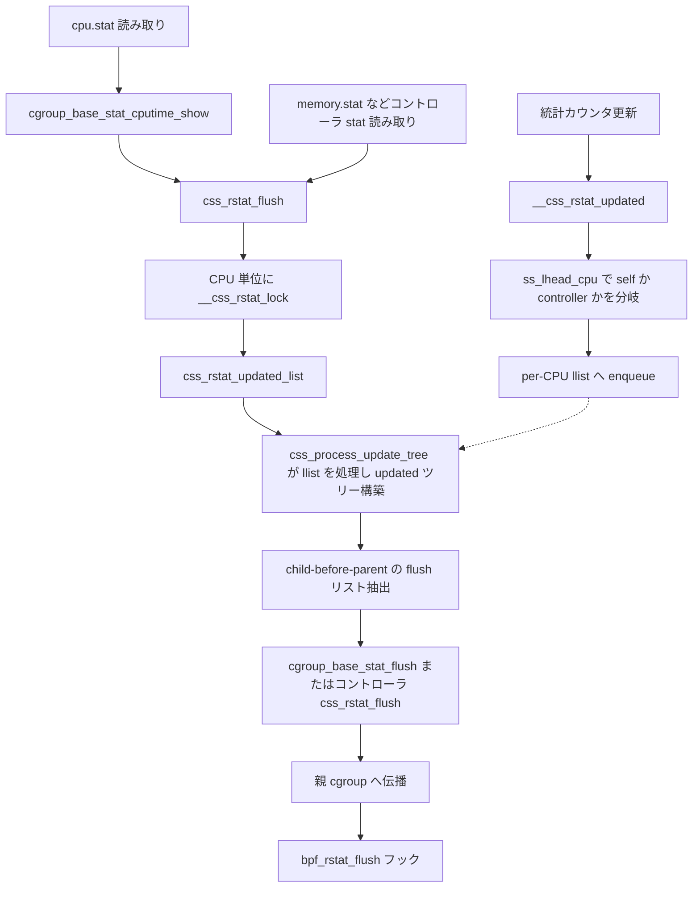

# 第17章 rstat と per-CPU 統計集約

> **本章で読むソース**
>
> - [`kernel/cgroup/rstat.c` L41-L54](https://github.com/gregkh/linux/blob/v6.18.38/kernel/cgroup/rstat.c#L41-L54)
> - [`kernel/cgroup/rstat.c` L71-L123](https://github.com/gregkh/linux/blob/v6.18.38/kernel/cgroup/rstat.c#L71-L123)
> - [`kernel/cgroup/rstat.c` L137-L164](https://github.com/gregkh/linux/blob/v6.18.38/kernel/cgroup/rstat.c#L137-L164)
> - [`kernel/cgroup/rstat.c` L290-L334](https://github.com/gregkh/linux/blob/v6.18.38/kernel/cgroup/rstat.c#L290-L334)
> - [`kernel/cgroup/rstat.c` L349-L356](https://github.com/gregkh/linux/blob/v6.18.38/kernel/cgroup/rstat.c#L349-L356)
> - [`kernel/cgroup/rstat.c` L367-L394](https://github.com/gregkh/linux/blob/v6.18.38/kernel/cgroup/rstat.c#L367-L394)
> - [`kernel/cgroup/rstat.c` L409-L440](https://github.com/gregkh/linux/blob/v6.18.38/kernel/cgroup/rstat.c#L409-L440)
> - [`kernel/cgroup/rstat.c` L442-L485](https://github.com/gregkh/linux/blob/v6.18.38/kernel/cgroup/rstat.c#L442-L485)
> - [`kernel/cgroup/rstat.c` L487-L517](https://github.com/gregkh/linux/blob/v6.18.38/kernel/cgroup/rstat.c#L487-L517)
> - [`kernel/cgroup/rstat.c` L572-L609](https://github.com/gregkh/linux/blob/v6.18.38/kernel/cgroup/rstat.c#L572-L609)
> - [`kernel/cgroup/rstat.c` L722-L736](https://github.com/gregkh/linux/blob/v6.18.38/kernel/cgroup/rstat.c#L722-L736)
> - [`kernel/cgroup/cgroup.c` L3829-L3867](https://github.com/gregkh/linux/blob/v6.18.38/kernel/cgroup/cgroup.c#L3829-L3867)
> - [`kernel/cgroup/cgroup.c` L3952-L3961](https://github.com/gregkh/linux/blob/v6.18.38/kernel/cgroup/cgroup.c#L3952-L3961)

## 共通規約

コード引用は [`gregkh/linux` の `v6.18.38`](https://github.com/gregkh/linux/tree/v6.18.38) に固定する。
行番号はローカル展開ソースと照合して確認し、成果物にはローカル絶対パスを書かない。

## この章の狙い

**rstat** が cgroup 統計を per-CPU に蓄積し、`css_rstat_flush` で集約する仕組みを読む。
更新側のロックレス enqueue と、読み取り側の updated ツリー構築、基本統計の親伝播までを追う。

## 前提

- [第12章 cgroup v2 階層と kernfs](12-cgroup-hierarchy-kernfs.md)
- [第13章 css と cgroup_subsys のライフサイクル](13-css-lifecycle.md)

## rstat の目的

cgroup の CPU 時間などの統計はホットパスで更新される。
毎回グローバルカウンタへ原子加算するとキャッシュラインの競合が起きるため、per-CPU に蓄積してから集約する。

`css_rstat_cpu` は CPU ごとの更新ノードを持つ。
変更があった css は flush 時に祖先方向へ伝播し、読み取り側は `css_rstat_flush` で subtree の統計を集約してから値を返す。
更新側は per-CPU の `llist` へ enqueue するだけで、この時点では `updated_children` ツリーは構築しない。

## __css_rstat_updated とロックレス登録

統計更新のたびに `__css_rstat_updated` が呼ばれる。
この関数は per-CPU の `llist_node` を `ss_lhead_cpu` が返す llist へロックレス挿入し、後の flush で処理する。

[`kernel/cgroup/rstat.c` L71-L123](https://github.com/gregkh/linux/blob/v6.18.38/kernel/cgroup/rstat.c#L71-L123)

```c
void __css_rstat_updated(struct cgroup_subsys_state *css, int cpu)
{
	struct llist_head *lhead;
	struct css_rstat_cpu *rstatc;
	struct llist_node *self;

	/* Prevent access to uninitialized rstat pointers. */
	if (!css_uses_rstat(css))
		return;

	lockdep_assert_preemption_disabled();

	/*
	 * The lockless insertion below relies on NMI-safe cmpxchg;
	 * bail out in NMI on archs that don't provide it.
	 */
	if (!IS_ENABLED(CONFIG_ARCH_HAVE_NMI_SAFE_CMPXCHG) && in_nmi())
		return;

	rstatc = css_rstat_cpu(css, cpu);
	/*
	 * If already on list return. This check is racy and smp_mb() is needed
	 * to pair it with the smp_mb() in css_process_update_tree() if the
	 * guarantee that the updated stats are visible to concurrent flusher is
	 * needed.
	 */
	if (llist_on_list(&rstatc->lnode))
		return;

	/*
	 * This function can be renentered by irqs and nmis for the same cgroup
	 * and may try to insert the same per-cpu lnode into the llist. Note
	 * that llist_add() does not protect against such scenarios. In addition
	 * this same per-cpu lnode can be modified through init_llist_node()
	 * from css_rstat_flush() running on a different CPU.
	 *
	 * To protect against such stacked contexts of irqs/nmis, we use the
	 * fact that lnode points to itself when not on a list and then use
	 * try_cmpxchg() to atomically set to NULL to select the winner
	 * which will call llist_add(). The losers can assume the insertion is
	 * successful and the winner will eventually add the per-cpu lnode to
	 * the llist.
	 *
	 * Please note that we can not use this_cpu_cmpxchg() here as on some
	 * archs it is not safe against modifications from multiple CPUs.
	 */
	self = &rstatc->lnode;
	if (!try_cmpxchg(&rstatc->lnode.next, &self, NULL))
		return;

	lhead = ss_lhead_cpu(css->ss, cpu);
	llist_add(&rstatc->lnode, lhead);
}
```

IRQ や NMI からの再入は `try_cmpxchg` で調停する。
勝者だけが `llist_add` を実行し、敗者は挿入済みとみなして戻る。

挿入先の llist は `ss_lhead_cpu(css->ss, cpu)` が css の種類で選ぶ。
コントローラの css（`ss` が非 NULL）ではサブシステムごとの `ss->lhead` に挿入するが、`cgroup::self` の css（`ss == NULL`、CPU 時間などの base stats）ではグローバルな per-CPU `rstat_backlog_list` に挿入する。
対になるロックも `ss_rstat_lock` が同じ条件で分岐し、コントローラは `ss->rstat_ss_lock`、self は静的な `rstat_base_lock` を返す。

[`kernel/cgroup/rstat.c` L41-L54](https://github.com/gregkh/linux/blob/v6.18.38/kernel/cgroup/rstat.c#L41-L54)

```c
static spinlock_t *ss_rstat_lock(struct cgroup_subsys *ss)
{
	if (ss)
		return &ss->rstat_ss_lock;

	return &rstat_base_lock;
}

static inline struct llist_head *ss_lhead_cpu(struct cgroup_subsys *ss, int cpu)
{
	if (ss)
		return per_cpu_ptr(ss->lhead, cpu);
	return per_cpu_ptr(&rstat_backlog_list, cpu);
}
```

「更新はつねに subsystem ごとの `ss->lhead` へ入る」わけではない点に注意する。
CPU 時間などの base stats を持つ `cgroup::self` は、この分岐によりコントローラとは別のロック・別の enqueue 先を使う。

## css_rstat_flush と CPU 単位ロック

`css_rstat_flush` は指定 css の subtree について、全 CPU の per-CPU 統計をグローバルへ集約する。
呼び出し元は主に3種類ある。
CPU 時間などの base stats は `cpu.stat` の読み取り（`cpu_stat_show` → `cgroup_base_stat_cputime_show`）、コントローラ統計は `memory.stat` など各コントローラの stat 表示、そして css 破棄前の `css_rstat_exit` である。
`cgroup.stat` は descendant 数などの直接カウンタを表示するだけで `css_rstat_flush` は呼ばない（後述）。

[`kernel/cgroup/rstat.c` L409-L440](https://github.com/gregkh/linux/blob/v6.18.38/kernel/cgroup/rstat.c#L409-L440)

```c
__bpf_kfunc void css_rstat_flush(struct cgroup_subsys_state *css)
{
	int cpu;
	bool is_self = css_is_self(css);

	/*
	 * Since bpf programs can call this function, prevent access to
	 * uninitialized rstat pointers.
	 */
	if (!css_uses_rstat(css))
		return;

	might_sleep();
	for_each_possible_cpu(cpu) {
		struct cgroup_subsys_state *pos;

		/* Reacquire for each CPU to avoid disabling IRQs too long */
		__css_rstat_lock(css, cpu);
		pos = css_rstat_updated_list(css, cpu);
		for (; pos; pos = pos->rstat_flush_next) {
			if (is_self) {
				cgroup_base_stat_flush(pos->cgroup, cpu);
				bpf_rstat_flush(pos->cgroup,
						cgroup_parent(pos->cgroup), cpu);
			} else
				pos->ss->css_rstat_flush(pos, cpu);
		}
		__css_rstat_unlock(css, cpu);
		if (!cond_resched())
			cpu_relax();
	}
}
```

`__css_rstat_lock` はサブシステムごとの `rstat_ss_lock` を取る薄いラッパーである。
`spin_trylock_irq` が失敗したときだけ trace で contention を記録し、そのあと `spin_lock_irq` で待つ。

[`kernel/cgroup/rstat.c` L367-L394](https://github.com/gregkh/linux/blob/v6.18.38/kernel/cgroup/rstat.c#L367-L394)

```c
static inline void __css_rstat_lock(struct cgroup_subsys_state *css,
		int cpu_in_loop)
	__acquires(ss_rstat_lock(css->ss))
{
	struct cgroup *cgrp = css->cgroup;
	spinlock_t *lock;
	bool contended;

	lock = ss_rstat_lock(css->ss);
	contended = !spin_trylock_irq(lock);
	if (contended) {
		trace_cgroup_rstat_lock_contended(cgrp, cpu_in_loop, contended);
		spin_lock_irq(lock);
	}
	trace_cgroup_rstat_locked(cgrp, cpu_in_loop, contended);
}

static inline void __css_rstat_unlock(struct cgroup_subsys_state *css,
				      int cpu_in_loop)
	__releases(ss_rstat_lock(css->ss))
{
	struct cgroup *cgrp = css->cgroup;
	spinlock_t *lock;

	lock = ss_rstat_lock(css->ss);
	trace_cgroup_rstat_unlock(cgrp, cpu_in_loop, false);
	spin_unlock_irq(lock);
}
```

コメント "Reacquire for each CPU" のとおり、CPU ごとにロックを取り直す。
一つのロック保持で全 CPU を処理すると IRQ 無効時間が長くなるため、CPU 単位で区切る。

## flush の入口: cpu.stat と cgroup.stat

base stats（CPU 時間）の実際の flush 入口は `cpu.stat` の読み取りである。
`cpu_stat_show` が `cgroup_base_stat_cputime_show` を呼び、そこで `cgroup_parent(cgrp)` が非 NULL のとき（root 以外）だけ `css_rstat_flush(&cgrp->self)` を呼ぶ。

[`kernel/cgroup/cgroup.c` L3952-L3961](https://github.com/gregkh/linux/blob/v6.18.38/kernel/cgroup/cgroup.c#L3952-L3961)

```c
static int cpu_stat_show(struct seq_file *seq, void *v)
{
	int ret = 0;

	cgroup_base_stat_cputime_show(seq);
#ifdef CONFIG_CGROUP_SCHED
	ret = cgroup_extra_stat_show(seq, cpu_cgrp_id);
#endif
	return ret;
}
```

[`kernel/cgroup/rstat.c` L722-L736](https://github.com/gregkh/linux/blob/v6.18.38/kernel/cgroup/rstat.c#L722-L736)

```c
void cgroup_base_stat_cputime_show(struct seq_file *seq)
{
	struct cgroup *cgrp = seq_css(seq)->cgroup;
	struct cgroup_base_stat bstat;

	if (cgroup_parent(cgrp)) {
		css_rstat_flush(&cgrp->self);
		__css_rstat_lock(&cgrp->self, -1);
		bstat = cgrp->bstat;
		cputime_adjust(&cgrp->bstat.cputime, &cgrp->prev_cputime,
			       &bstat.cputime.utime, &bstat.cputime.stime);
		__css_rstat_unlock(&cgrp->self, -1);
	} else {
		root_cgroup_cputime(&bstat);
	}
```

コントローラの統計も同じ形で、`memory.stat` など各コントローラの stat 表示関数が自分の css を `css_rstat_flush` に渡す。

一方、`cgroup.stat` は名前が紛らわしいが `css_rstat_flush` を呼ばない。
`cgroup_stat_show` は `nr_descendants` や `nr_dying_subsys_*` のような、rstat とは別に維持されているカウンタを `rcu_read_lock` の下でそのまま表示するだけである。

[`kernel/cgroup/cgroup.c` L3829-L3867](https://github.com/gregkh/linux/blob/v6.18.38/kernel/cgroup/cgroup.c#L3829-L3867)

```c
static int cgroup_stat_show(struct seq_file *seq, void *v)
{
	struct cgroup *cgroup = seq_css(seq)->cgroup;
	struct cgroup_subsys_state *css;
	int dying_cnt[CGROUP_SUBSYS_COUNT];
	int ssid;

	seq_printf(seq, "nr_descendants %d\n",
		   cgroup->nr_descendants);

	/*
	 * Show the number of live and dying csses associated with each of
	 * non-inhibited cgroup subsystems that is bound to cgroup v2.
	 *
	 * Without proper lock protection, racing is possible. So the
	 * numbers may not be consistent when that happens.
	 */
	rcu_read_lock();
	for (ssid = 0; ssid < CGROUP_SUBSYS_COUNT; ssid++) {
		dying_cnt[ssid] = -1;
		if ((BIT(ssid) & cgrp_dfl_inhibit_ss_mask) ||
		    (cgroup_subsys[ssid]->root !=  &cgrp_dfl_root))
			continue;
		css = rcu_dereference_raw(cgroup->subsys[ssid]);
		dying_cnt[ssid] = cgroup->nr_dying_subsys[ssid];
		seq_printf(seq, "nr_subsys_%s %d\n", cgroup_subsys[ssid]->name,
			   css ? (css->nr_descendants + 1) : 0);
	}

	seq_printf(seq, "nr_dying_descendants %d\n",
		   cgroup->nr_dying_descendants);
	for (ssid = 0; ssid < CGROUP_SUBSYS_COUNT; ssid++) {
		if (dying_cnt[ssid] >= 0)
			seq_printf(seq, "nr_dying_subsys_%s %d\n",
				   cgroup_subsys[ssid]->name, dying_cnt[ssid]);
	}
	rcu_read_unlock();
	return 0;
}
```

`cgroup.stat` と `cpu.stat` は名前は似ているが、前者は rstat を経由しない直接カウンタ、後者が rstat の flush を経由する base stats という別物である。

## css_rstat_updated_list と updated ツリー構築

`css_rstat_updated_list` は flush 時に呼ばれ、enqueue 済みの llist を処理して updated ツリーを構築する。
内部で `css_process_update_tree` が llist から css を取り出し、`__css_process_update_tree` で祖先方向に連結する。

[`kernel/cgroup/rstat.c` L137-L164](https://github.com/gregkh/linux/blob/v6.18.38/kernel/cgroup/rstat.c#L137-L164)

```c
static void __css_process_update_tree(struct cgroup_subsys_state *css, int cpu)
{
	/* put @css and all ancestors on the corresponding updated lists */
	while (true) {
		struct css_rstat_cpu *rstatc = css_rstat_cpu(css, cpu);
		struct cgroup_subsys_state *parent = css->parent;
		struct css_rstat_cpu *prstatc;

		/*
		 * Both additions and removals are bottom-up.  If a cgroup
		 * is already in the tree, all ancestors are.
		 */
		if (rstatc->updated_next)
			break;

		/* Root has no parent to link it to, but mark it busy */
		if (!parent) {
			rstatc->updated_next = css;
			break;
		}

		prstatc = css_rstat_cpu(parent, cpu);
		rstatc->updated_next = prstatc->updated_children;
		prstatc->updated_children = css;

		css = parent;
	}
}
```

子が既にツリーに入っていれば祖先も入っているため、途中で打ち切れる。
これにより同一 CPU での重複伝播を避ける。

[`kernel/cgroup/rstat.c` L290-L334](https://github.com/gregkh/linux/blob/v6.18.38/kernel/cgroup/rstat.c#L290-L334)

```c
static struct cgroup_subsys_state *css_rstat_updated_list(
		struct cgroup_subsys_state *root, int cpu)
{
	struct css_rstat_cpu *rstatc = css_rstat_cpu(root, cpu);
	struct cgroup_subsys_state *head = NULL, *parent, *child;

	css_process_update_tree(root->ss, cpu);

	/* Return NULL if this subtree is not on-list */
	if (!rstatc->updated_next)
		return NULL;

	/*
	 * Unlink @root from its parent. As the updated_children list is
	 * singly linked, we have to walk it to find the removal point.
	 */
	parent = root->parent;
	if (parent) {
		struct css_rstat_cpu *prstatc;
		struct cgroup_subsys_state **nextp;

		prstatc = css_rstat_cpu(parent, cpu);
		nextp = &prstatc->updated_children;
		while (*nextp != root) {
			struct css_rstat_cpu *nrstatc;

			nrstatc = css_rstat_cpu(*nextp, cpu);
			WARN_ON_ONCE(*nextp == parent);
			nextp = &nrstatc->updated_next;
		}
		*nextp = rstatc->updated_next;
	}

	rstatc->updated_next = NULL;

	/* Push @root to the list first before pushing the children */
	head = root;
	root->rstat_flush_next = NULL;
	child = rstatc->updated_children;
	rstatc->updated_children = root;
	if (child != root)
		head = css_rstat_push_children(head, child, cpu);

	return head;
}
```

`css_rstat_push_children` により child-before-parent 順の単方向 flush リストが抽出され、ツリーから unlink される。
`cgroup::self` の flush では `cgroup_base_stat_flush` が CPU 時間を集約し、コントローラ css は各 `cgroup_subsys` の `css_rstat_flush` コールバックに委譲する。

## cgroup_base_stat_flush と基本統計

`cgroup_base_stat_flush` は `cgroup::self` の flush で呼ばれ、CPU 時間の基本統計を集約する。
`u64_stats` の seqcount で当該 CPU の `rstatbc->bstat` を読み、前回値 `last_bstat` を引いて delta を得る。
その delta を自 cgroup の `cgrp->bstat` と当該 CPU の `rstatbc->subtree_bstat` の両方に加算する。

親が root でない場合のみ、`cgrp->bstat` と `cgrp->last_bstat` の差分を `parent->bstat` へ伝播する。
同時に `rstatbc->subtree_bstat` と `last_subtree_bstat` の差分を、親側 per-CPU の `prstatbc->subtree_bstat` へ伝播する。

[`kernel/cgroup/rstat.c` L572-L609](https://github.com/gregkh/linux/blob/v6.18.38/kernel/cgroup/rstat.c#L572-L609)

```c
static void cgroup_base_stat_flush(struct cgroup *cgrp, int cpu)
{
	struct cgroup_rstat_base_cpu *rstatbc = cgroup_rstat_base_cpu(cgrp, cpu);
	struct cgroup *parent = cgroup_parent(cgrp);
	struct cgroup_rstat_base_cpu *prstatbc;
	struct cgroup_base_stat delta;
	unsigned seq;

	/* Root-level stats are sourced from system-wide CPU stats */
	if (!parent)
		return;

	/* fetch the current per-cpu values */
	do {
		seq = __u64_stats_fetch_begin(&rstatbc->bsync);
		delta = rstatbc->bstat;
	} while (__u64_stats_fetch_retry(&rstatbc->bsync, seq));

	/* propagate per-cpu delta to cgroup and per-cpu global statistics */
	cgroup_base_stat_sub(&delta, &rstatbc->last_bstat);
	cgroup_base_stat_add(&cgrp->bstat, &delta);
	cgroup_base_stat_add(&rstatbc->last_bstat, &delta);
	cgroup_base_stat_add(&rstatbc->subtree_bstat, &delta);

	/* propagate cgroup and per-cpu global delta to parent (unless that's root) */
	if (cgroup_parent(parent)) {
		delta = cgrp->bstat;
		cgroup_base_stat_sub(&delta, &cgrp->last_bstat);
		cgroup_base_stat_add(&parent->bstat, &delta);
		cgroup_base_stat_add(&cgrp->last_bstat, &delta);

		delta = rstatbc->subtree_bstat;
		prstatbc = cgroup_rstat_base_cpu(parent, cpu);
		cgroup_base_stat_sub(&delta, &rstatbc->last_subtree_bstat);
		cgroup_base_stat_add(&prstatbc->subtree_bstat, &delta);
		cgroup_base_stat_add(&rstatbc->last_subtree_bstat, &delta);
	}
}
```

## bpf_rstat_flush フック

`bpf_rstat_flush` は BPF 統計コレクタが cgroup 統計 flush に相乗りするためのフック点である。
`css_rstat_flush` 内で `cgroup_base_stat_flush` の直後に呼ばれる。

[`kernel/cgroup/rstat.c` L349-L356](https://github.com/gregkh/linux/blob/v6.18.38/kernel/cgroup/rstat.c#L349-L356)

```c
__weak noinline void bpf_rstat_flush(struct cgroup *cgrp,
				     struct cgroup *parent, int cpu)
{
}
```

`__weak` はコンパイラが呼び出し自体を最適化で消すのを防ぐためである。
BPF プログラムが `css_rstat_updated` と `css_rstat_flush` と組み合わせて、効率的な統計 flush ワークフローを構成できる。

## css_rstat_init と css_rstat_exit

rstat を使う css は `css_rstat_init` で per-CPU 領域を割り当てる。
`css_rstat_init` は `kernel/cgroup/cgroup.c` の `css_create` から呼ばれる。
コントローラが `css_rstat_flush` を定義していなければ、subsystem css は rstat を使わない。

[`kernel/cgroup/rstat.c` L442-L485](https://github.com/gregkh/linux/blob/v6.18.38/kernel/cgroup/rstat.c#L442-L485)

```c
int css_rstat_init(struct cgroup_subsys_state *css)
{
	struct cgroup *cgrp = css->cgroup;
	int cpu;
	bool is_self = css_is_self(css);

	if (is_self) {
		/* the root cgrp has rstat_base_cpu preallocated */
		if (!cgrp->rstat_base_cpu) {
			cgrp->rstat_base_cpu = alloc_percpu(struct cgroup_rstat_base_cpu);
			if (!cgrp->rstat_base_cpu)
				return -ENOMEM;
		}
	} else if (css->ss->css_rstat_flush == NULL)
		return 0;

	/* the root cgrp's self css has rstat_cpu preallocated */
	if (!css->rstat_cpu) {
		css->rstat_cpu = alloc_percpu(struct css_rstat_cpu);
		if (!css->rstat_cpu) {
			if (is_self)
				free_percpu(cgrp->rstat_base_cpu);

			return -ENOMEM;
		}
	}

	/* ->updated_children list is self terminated */
	for_each_possible_cpu(cpu) {
		struct css_rstat_cpu *rstatc = css_rstat_cpu(css, cpu);

		rstatc->owner = rstatc->updated_children = css;
		init_llist_node(&rstatc->lnode);

		if (is_self) {
			struct cgroup_rstat_base_cpu *rstatbc;

			rstatbc = cgroup_rstat_base_cpu(cgrp, cpu);
			u64_stats_init(&rstatbc->bsync);
		}
	}

	return 0;
}
```

各 cgroup の `self` css が `rstat_base_cpu` を持ち、基本統計とコントローラ統計を分離する。
boot 時のルート cgroup だけ `rstat_base_cpu` が静的に確保され、子 cgroup は `is_self` 分岐で未割当時に `alloc_percpu` する。

`css_rstat_exit` は破棄前に `css_rstat_flush` を呼び、統計を確定させてから per-CPU 領域を解放する。
`WARN_ON_ONCE` は flush 後に各 CPU の `updated_children` が初期状態 `== css` に戻り、`updated_next` が NULL であることの sanity check だが、単なる確認では終わらない。
`updated_children` か `updated_next` のどちらかが残っていれば、`WARN_ON_ONCE` は真を返してその場で `return` し、`rstat_base_cpu`／`rstat_cpu` の解放には進まない。
updated ツリーに載ったままの状態で per-CPU 領域を解放すると、他 CPU からその領域を指す update tree ポインタが残り use-after-free になり得るため、不整合を検知したら解放せず抜ける安全側の挙動である。

[`kernel/cgroup/rstat.c` L487-L517](https://github.com/gregkh/linux/blob/v6.18.38/kernel/cgroup/rstat.c#L487-L517)

```c
void css_rstat_exit(struct cgroup_subsys_state *css)
{
	int cpu;

	if (!css_uses_rstat(css))
		return;

	if (!css->rstat_cpu)
		return;

	css_rstat_flush(css);

	/* sanity check */
	for_each_possible_cpu(cpu) {
		struct css_rstat_cpu *rstatc = css_rstat_cpu(css, cpu);

		if (WARN_ON_ONCE(rstatc->updated_children != css) ||
		    WARN_ON_ONCE(rstatc->updated_next))
			return;
	}

	if (css_is_self(css)) {
		struct cgroup *cgrp = css->cgroup;

		free_percpu(cgrp->rstat_base_cpu);
		cgrp->rstat_base_cpu = NULL;
	}

	free_percpu(css->rstat_cpu);
	css->rstat_cpu = NULL;
}
```

## rstat の処理フロー



破線は更新と集約が非同期で結びつくことを示す。
enqueue 時点では updated ツリーは存在せず、flush が lock を取ったあと初めて llist が消費される。
`cgroup.stat` はこのフローに乗らず、rstat とは別に維持されたカウンタを直接表示する点に注意する。

## 高速化と最適化の工夫

rstat はロックレス更新と CPU 単位ロック集約の二段構えである。
更新側 `__css_rstat_updated` はプリエンプション無効下で動き、`try_cmpxchg` によるロックレス挿入だけを行う。
IRQ と NMI の再入は `llist_add` の前に挿入権を選出することで調停する。

集約側 `css_rstat_flush` は CPU ごとに `spin_lock_irq` を取り直す。
`__css_rstat_lock` は trylock 失敗時だけ trace を残し、本番環境での contention 診断に使える。
ホットパスの更新はグローバルロックを避け、読み取り時だけサブシステムロックで updated ツリーを安全に走査する。

> **7.x 系での変化**
> [`kernel/cgroup/rstat.c`](https://github.com/gregkh/linux/blob/v7.1.3/kernel/cgroup/rstat.c) は v6.18.38 と md5 が一致し、rstat 機構本体に差分はない。
> 周辺では `include/linux/cgroup-defs.h` の `cgroup::ancestors` flex array 配置や `subtree_control` の `u16` から `u32` への拡張があり、`cgroup.c` の行番号がずれるが、rstat の呼び出し関係は不変である。

## まとめ

rstat は per-CPU に統計を蓄積し、`css_rstat_flush` で読み取り時または破棄時に集約する。
更新側は `ss_lhead_cpu` でコントローラの `ss->lhead` か self の `rstat_backlog_list` かを選んで enqueue するところまでで、updated ツリー構築と親伝播は flush 側が担う。
flush の実際の入口は `cpu.stat` や `memory.stat` などの統計ファイル読み取りと css 破棄であり、`cgroup.stat` は rstat を経由しない別のカウンタを表示する。
`css_rstat_exit` の sanity check は不整合を検知したら per-CPU 領域を解放せず抜ける安全側の設計である。
memcg の charge カウンタは mm 分冊が扱い、本章は cgroup コアの rstat 機構と CPU 時間などの基本統計が中心である。

## 関連する章

- [第13章 css と cgroup_subsys のライフサイクル](13-css-lifecycle.md)
- [第16章 cgroup namespace とパス表示](16-cgroup-namespace.md)
- [第18章 cpu コントローラと sched 連携](../part03-controllers/18-cpu-controller.md)
- [第19章 memory コントローラと memcg 境界](../part03-controllers/19-memory-controller.md)
