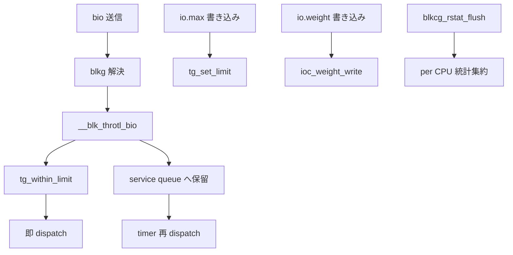

# 第17章 io コントローラ

> **本章で読むソース**
>
> - [`block/blk-cgroup.c` L66-L95](https://github.com/gregkh/linux/blob/v6.18.38/block/blk-cgroup.c#L66-L95)
> - [`block/blk-cgroup.c` L265-L278](https://github.com/gregkh/linux/blob/v6.18.38/block/blk-cgroup.c#L265-L278)
> - [`block/blk-cgroup.c` L1413-L1477](https://github.com/gregkh/linux/blob/v6.18.38/block/blk-cgroup.c#L1413-L1477)
> - [`block/blk-cgroup.c` L1557-L1575](https://github.com/gregkh/linux/blob/v6.18.38/block/blk-cgroup.c#L1557-L1575)
> - [`block/blk-throttle.c` L1539-L1617](https://github.com/gregkh/linux/blob/v6.18.38/block/blk-throttle.c#L1539-L1617)
> - [`block/blk-throttle.c` L1742-L1834](https://github.com/gregkh/linux/blob/v6.18.38/block/blk-throttle.c#L1742-L1834)
> - [`block/blk-throttle.c` L1672-L1681](https://github.com/gregkh/linux/blob/v6.18.38/block/blk-throttle.c#L1672-L1681)
> - [`block/blk-iocost.c` L3510-L3540](https://github.com/gregkh/linux/blob/v6.18.38/block/blk-iocost.c#L3510-L3540)

## この章の狙い

**io コントローラ** がブロック I/O を cgroup 単位で制御する仕組みを読む。
`blkcg` とディスクごとの `blkcg_gq`、ポリシー経由の `io.max` と `io.weight`、bio からの css 解決を押さえる。

## 前提

- [第12章 css と cgroup_subsys のライフサイクル](../part02-cgroup-core/12-css-lifecycle.md)
- [第16章 memory コントローラと memcg 境界](16-memory-controller.md)

## blkcg と io_cgrp_subsys

io コントローラの cgroup サブシステム名は `io` であり、実装の中心は `blk-cgroup.c` の **blkcg** である。
v1 互換名は `blkio` として `legacy_name` に残る。

[`block/blk-cgroup.c` L1557-L1575](https://github.com/gregkh/linux/blob/v6.18.38/block/blk-cgroup.c#L1557-L1575)

```c
struct cgroup_subsys io_cgrp_subsys = {
	.css_alloc = blkcg_css_alloc,
	.css_online = blkcg_css_online,
	.css_offline = blkcg_css_offline,
	.css_free = blkcg_css_free,
	.css_rstat_flush = blkcg_rstat_flush,
	.dfl_cftypes = blkcg_files,
	.legacy_cftypes = blkcg_legacy_files,
	.legacy_name = "blkio",
	.exit = blkcg_exit,
#ifdef CONFIG_MEMCG
	/*
	 * This ensures that, if available, memcg is automatically enabled
	 * together on the default hierarchy so that the owner cgroup can
	 * be retrieved from writeback pages.
	 */
	.depends_on = 1 << memory_cgrp_id,
#endif
};
```

memory コントローラへの依存は、writeback ページから cgroup を辿るために必要である。
io と memory は default hierarchy で一緒に有効化される。

## blkcg_css_alloc とポリシー

`blkcg_css_alloc` は blkcg 本体と per CPU の統計リストを割り当て、登録済みポリシーの per cgroup データを初期化する。

[`block/blk-cgroup.c` L1413-L1477](https://github.com/gregkh/linux/blob/v6.18.38/block/blk-cgroup.c#L1413-L1477)

```c
static struct cgroup_subsys_state *
blkcg_css_alloc(struct cgroup_subsys_state *parent_css)
{
	struct blkcg *blkcg;
	int i;

	mutex_lock(&blkcg_pol_mutex);

	if (!parent_css) {
		blkcg = &blkcg_root;
	} else {
		blkcg = kzalloc(sizeof(*blkcg), GFP_KERNEL);
		if (!blkcg)
			goto unlock;
	}

	if (init_blkcg_llists(blkcg))
		goto free_blkcg;

	for (i = 0; i < BLKCG_MAX_POLS ; i++) {
		struct blkcg_policy *pol = blkcg_policy[i];
		struct blkcg_policy_data *cpd;

		/*
		 * If the policy hasn't been attached yet, wait for it
		 * to be attached before doing anything else. Otherwise,
		 * check if the policy requires any specific per-cgroup
		 * data: if it does, allocate and initialize it.
		 */
		if (!pol || !pol->cpd_alloc_fn)
			continue;

		cpd = pol->cpd_alloc_fn(GFP_KERNEL);
		if (!cpd)
			goto free_pd_blkcg;

		blkcg->cpd[i] = cpd;
		cpd->blkcg = blkcg;
		cpd->plid = i;
	}

	spin_lock_init(&blkcg->lock);
	refcount_set(&blkcg->online_pin, 1);
	INIT_RADIX_TREE(&blkcg->blkg_tree, GFP_NOWAIT);
	INIT_HLIST_HEAD(&blkcg->blkg_list);
#ifdef CONFIG_CGROUP_WRITEBACK
	INIT_LIST_HEAD(&blkcg->cgwb_list);
#endif
	list_add_tail(&blkcg->all_blkcgs_node, &all_blkcgs);

	mutex_unlock(&blkcg_pol_mutex);
	return &blkcg->css;

free_pd_blkcg:
	for (i--; i >= 0; i--)
		if (blkcg->cpd[i])
			blkcg_policy[i]->cpd_free_fn(blkcg->cpd[i]);
	free_percpu(blkcg->lhead);
free_blkcg:
	if (blkcg != &blkcg_root)
		kfree(blkcg);
unlock:
	mutex_unlock(&blkcg_pol_mutex);
	return ERR_PTR(-ENOMEM);
}
```

各ブロックデバイスには blkcg ごとに **blkg**（blkcg_gq）が存在する。
ポリシーは blkg 単位の `pd`（policy data）を持ち、スループット制限や重み付けを実装する。

## io.max と io.weight

cgroup v2 ではポリシーが登録する `cftype` が `io.<name>` として露出する。
帯域幅上限は **blk-throttle** ポリシーの `max` ファイルが `io.max` になる。

[`block/blk-throttle.c` L1619-L1627](https://github.com/gregkh/linux/blob/v6.18.38/block/blk-throttle.c#L1619-L1627)

```c
static struct cftype throtl_files[] = {
	{
		.name = "max",
		.flags = CFTYPE_NOT_ON_ROOT,
		.seq_show = tg_print_limit,
		.write = tg_set_limit,
	},
	{ }	/* terminate */
};
```

書き込み形式は `MAJ:MIN rbps=... wbps=... riops=... wiops=...` で、デバイスごとに読み書きの bps と iops を指定する。
無制限は各キーに `max` と書く。
数値のゼロは `-ERANGE` で拒否される。

## tg_set_limit による bps と iops 更新

`io.max` への書き込みは `tg_set_limit` がデバイスごとの `throtl_grp` を開き、トークンをパースして `tg->bps[]` と `tg->iops[]` を更新する。

[`block/blk-throttle.c` L1539-L1617](https://github.com/gregkh/linux/blob/v6.18.38/block/blk-throttle.c#L1539-L1617)

```c
static ssize_t tg_set_limit(struct kernfs_open_file *of,
			  char *buf, size_t nbytes, loff_t off)
{
	struct blkcg *blkcg = css_to_blkcg(of_css(of));
	struct blkg_conf_ctx ctx;
	struct throtl_grp *tg;
	u64 v[4];
	int ret;

	blkg_conf_init(&ctx, buf);

	ret = blkg_conf_open_bdev(&ctx);
	if (ret)
		goto out_finish;

	if (!blk_throtl_activated(ctx.bdev->bd_queue)) {
		ret = blk_throtl_init(ctx.bdev->bd_disk);
		if (ret)
			goto out_finish;
	}

	ret = blkg_conf_prep(blkcg, &blkcg_policy_throtl, &ctx);
	if (ret)
		goto out_finish;

	tg = blkg_to_tg(ctx.blkg);
	tg_update_carryover(tg);

	v[0] = tg->bps[READ];
	v[1] = tg->bps[WRITE];
	v[2] = tg->iops[READ];
	v[3] = tg->iops[WRITE];

	while (true) {
		char tok[27];	/* wiops=18446744073709551616 */
		char *p;
		u64 val = U64_MAX;
		int len;

		if (sscanf(ctx.body, "%26s%n", tok, &len) != 1)
			break;
		if (tok[0] == '\0')
			break;
		ctx.body += len;

		ret = -EINVAL;
		p = tok;
		strsep(&p, "=");
		if (!p || (sscanf(p, "%llu", &val) != 1 && strcmp(p, "max")))
			goto out_finish;

		ret = -ERANGE;
		if (!val)
			goto out_finish;

		ret = -EINVAL;
		if (!strcmp(tok, "rbps"))
			v[0] = val;
		else if (!strcmp(tok, "wbps"))
			v[1] = val;
		else if (!strcmp(tok, "riops"))
			v[2] = min_t(u64, val, UINT_MAX);
		else if (!strcmp(tok, "wiops"))
			v[3] = min_t(u64, val, UINT_MAX);
		else
			goto out_finish;
	}

	tg->bps[READ] = v[0];
	tg->bps[WRITE] = v[1];
	tg->iops[READ] = v[2];
	tg->iops[WRITE] = v[3];

	tg_conf_updated(tg, false);
	ret = 0;
out_finish:
	blkg_conf_exit(&ctx);
	return ret ?: nbytes;
}
```

既存の制限を外すときは、該当キーに `max` を指定して `U64_MAX` に戻す。

I/O 重みは **iocost** ポリシーが `weight` ファイルで提供する。

[`block/blk-iocost.c` L3510-L3540](https://github.com/gregkh/linux/blob/v6.18.38/block/blk-iocost.c#L3510-L3540)

```c
static struct cftype ioc_files[] = {
	{
		.name = "weight",
		.flags = CFTYPE_NOT_ON_ROOT,
		.seq_show = ioc_weight_show,
		.write = ioc_weight_write,
	},
	{
		.name = "cost.qos",
		.flags = CFTYPE_ONLY_ON_ROOT,
		.seq_show = ioc_qos_show,
		.write = ioc_qos_write,
	},
	{
		.name = "cost.model",
		.flags = CFTYPE_ONLY_ON_ROOT,
		.seq_show = ioc_cost_model_show,
		.write = ioc_cost_model_write,
	},
	{}
};

static struct blkcg_policy blkcg_policy_iocost = {
	.dfl_cftypes	= ioc_files,
	.cpd_alloc_fn	= ioc_cpd_alloc,
	.cpd_free_fn	= ioc_cpd_free,
	.pd_alloc_fn	= ioc_pd_alloc,
	.pd_init_fn	= ioc_pd_init,
	.pd_free_fn	= ioc_pd_free,
	.pd_stat_fn	= ioc_pd_stat,
};
```

throttle ポリシーの登録構造は次のとおりである。

[`block/blk-throttle.c` L1672-L1681](https://github.com/gregkh/linux/blob/v6.18.38/block/blk-throttle.c#L1672-L1681)

```c
struct blkcg_policy blkcg_policy_throtl = {
	.dfl_cftypes		= throtl_files,
	.legacy_cftypes		= throtl_legacy_files,

	.pd_alloc_fn		= throtl_pd_alloc,
	.pd_init_fn		= throtl_pd_init,
	.pd_online_fn		= throtl_pd_online,
	.pd_offline_fn		= throtl_pd_offline,
	.pd_free_fn		= throtl_pd_free,
};
```

ディスクにポリシーを有効化するのは `blkcg_activate_policy` である。
キューごとに blkg ツリーへ policy data が割り当てられる。

## bio から blkcg への解決

I/O 発行時、bio は `bi_blkg` 経由で所属 blkcg を辿る。

[`block/blk-cgroup.c` L265-L278](https://github.com/gregkh/linux/blob/v6.18.38/block/blk-cgroup.c#L265-L278)

```c
/**
 * bio_blkcg_css - return the blkcg CSS associated with a bio
 * @bio: target bio
 *
 * This returns the CSS for the blkcg associated with a bio, or %NULL if not
 * associated. Callers are expected to either handle %NULL or know association
 * has been done prior to calling this.
 */
struct cgroup_subsys_state *bio_blkcg_css(struct bio *bio)
{
	if (!bio || !bio->bi_blkg)
		return NULL;
	return &bio->bi_blkg->blkcg->css;
}
```

タスクの cgroup 所属が変わっても進行中の bio は作成時点の blkg を保持する。
migration 後の新規 I/O だけが新しい blkcg に課金される。

## __blk_throtl_bio による実行時制限

bio 送信時、`__blk_throtl_bio` が階層上の `throtl_grp` を辿り、上限内なら即 dispatch、超過なら service queue に保留する。
timer と workqueue が `throtl_schedule_next_dispatch` 経由で再 dispatch する。

[`block/blk-throttle.c` L1742-L1834](https://github.com/gregkh/linux/blob/v6.18.38/block/blk-throttle.c#L1742-L1834)

```c
bool __blk_throtl_bio(struct bio *bio)
{
	struct request_queue *q = bdev_get_queue(bio->bi_bdev);
	struct blkcg_gq *blkg = bio->bi_blkg;
	struct throtl_qnode *qn = NULL;
	struct throtl_grp *tg = blkg_to_tg(blkg);
	struct throtl_service_queue *sq;
	bool rw = bio_data_dir(bio);
	bool throttled = false;
	struct throtl_data *td = tg->td;

	rcu_read_lock();
	spin_lock_irq(&q->queue_lock);
	sq = &tg->service_queue;

	while (true) {
		if (tg_within_limit(tg, bio, rw)) {
			/* within limits, let's charge and dispatch directly */
			throtl_charge_iops_bio(tg, bio);

			/*
			 * We need to trim slice even when bios are not being
			 * queued otherwise it might happen that a bio is not
			 * queued for a long time and slice keeps on extending
			 * and trim is not called for a long time. Now if limits
			 * are reduced suddenly we take into account all the IO
			 * dispatched so far at new low rate and * newly queued
			 * IO gets a really long dispatch time.
			 *
			 * So keep on trimming slice even if bio is not queued.
			 */
			throtl_trim_slice(tg, rw);
		} else if (bio_issue_as_root_blkg(bio)) {
			/*
			 * IOs which may cause priority inversions are
			 * dispatched directly, even if they're over limit.
			 *
			 * Charge and dispatch directly, and our throttle
			 * control algorithm is adaptive, and extra IO bytes
			 * will be throttled for paying the debt
			 */
			throtl_charge_bps_bio(tg, bio);
			throtl_charge_iops_bio(tg, bio);
		} else {
			/* if above limits, break to queue */
			break;
		}

		/*
		 * @bio passed through this layer without being throttled.
		 * Climb up the ladder.  If we're already at the top, it
		 * can be executed directly.
		 */
		qn = &tg->qnode_on_parent[rw];
		sq = sq->parent_sq;
		tg = sq_to_tg(sq);
		if (!tg) {
			bio_set_flag(bio, BIO_BPS_THROTTLED);
			goto out_unlock;
		}
	}

	/* out-of-limit, queue to @tg */
	throtl_log(sq, "[%c] bio. bdisp=%llu sz=%u bps=%llu iodisp=%u iops=%u queued=%d/%d",
		   rw == READ ? 'R' : 'W',
		   tg->bytes_disp[rw], bio->bi_iter.bi_size,
		   tg_bps_limit(tg, rw),
		   tg->io_disp[rw], tg_iops_limit(tg, rw),
		   sq_queued(sq, READ), sq_queued(sq, WRITE));

	td->nr_queued[rw]++;
	throtl_add_bio_tg(bio, qn, tg);
	throttled = true;

	/*
	 * Update @tg's dispatch time and force schedule dispatch if @tg
	 * was empty before @bio, or the iops queue is empty and @bio will
	 * add to.  The forced scheduling isn't likely to cause undue
	 * delay as @bio is likely to be dispatched directly if its @tg's
	 * disptime is not in the future.
	 */
	if (tg->flags & THROTL_TG_WAS_EMPTY ||
	    tg->flags & THROTL_TG_IOPS_WAS_EMPTY) {
		tg_update_disptime(tg);
		throtl_schedule_next_dispatch(tg->service_queue.parent_sq, true);
	}

out_unlock:
	spin_unlock_irq(&q->queue_lock);

	rcu_read_unlock();
	return throttled;
}
```

## 処理フロー



## 高速化と最適化の工夫

blkcg は複数ディスクの blkg を持ち、統計 flush 時に全 blkg を走査するとコストが高い。
per CPU の lockless リスト `lhead` で最近更新された iostat だけを追跡する。

[`block/blk-cgroup.c` L66-L95](https://github.com/gregkh/linux/blob/v6.18.38/block/blk-cgroup.c#L66-L95)

```c
/*
 * Lockless lists for tracking IO stats update
 *
 * New IO stats are stored in the percpu iostat_cpu within blkcg_gq (blkg).
 * There are multiple blkg's (one for each block device) attached to each
 * blkcg. The rstat code keeps track of which cpu has IO stats updated,
 * but it doesn't know which blkg has the updated stats. If there are many
 * block devices in a system, the cost of iterating all the blkg's to flush
 * out the IO stats can be high. To reduce such overhead, a set of percpu
 * lockless lists (lhead) per blkcg are used to track the set of recently
 * updated iostat_cpu's since the last flush. An iostat_cpu will be put
 * onto the lockless list on the update side [blk_cgroup_bio_start()] if
 * not there yet and then removed when being flushed [blkcg_rstat_flush()].
 * References to blkg are gotten and then put back in the process to
 * protect against blkg removal.
 *
 * Return: 0 if successful or -ENOMEM if allocation fails.
 */
static int init_blkcg_llists(struct blkcg *blkcg)
{
	int cpu;

	blkcg->lhead = alloc_percpu_gfp(struct llist_head, GFP_KERNEL);
	if (!blkcg->lhead)
		return -ENOMEM;

	for_each_possible_cpu(cpu)
		init_llist_head(per_cpu_ptr(blkcg->lhead, cpu));
	return 0;
}
```

更新側は `blk_cgroup_bio_start` で llist に挿入し、flush 側はリスト上の blkg だけを処理する。
デバイス数が多い環境でも統計集約の走査範囲を絞れる。

## まとめ

io コントローラは blkcg を中心に、ディスクごとの blkg とポリシーで I/O を制御する。
`io.max` は `tg_set_limit` でデバイス別 bps と iops を設定し、`__blk_throtl_bio` が実行時に階層判定と queue 保留を行う。
bio は `bi_blkg` から blkcg を解決し、memory コントローラと連携して writeback の帰属を保つ。

## 関連する章

- [第18章 pids コントローラ](18-pids-controller.md)
- [第16章 memory コントローラと memcg 境界](16-memory-controller.md)
