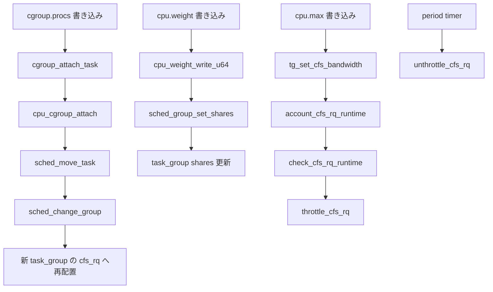

# 第18章 cpu コントローラと sched 連携

> **本章で読むソース**
>
> - [`kernel/sched/sched.h` L445-L514](https://github.com/gregkh/linux/blob/v6.18.38/kernel/sched/sched.h#L445-L514)
> - [`kernel/sched/core.c` L9217-L9257](https://github.com/gregkh/linux/blob/v6.18.38/kernel/sched/core.c#L9217-L9257)
> - [`kernel/sched/core.c` L9283-L9308](https://github.com/gregkh/linux/blob/v6.18.38/kernel/sched/core.c#L9283-L9308)
> - [`kernel/sched/core.c` L9525-L9591](https://github.com/gregkh/linux/blob/v6.18.38/kernel/sched/core.c#L9525-L9591)
> - [`kernel/sched/core.c` L10213-L10280](https://github.com/gregkh/linux/blob/v6.18.38/kernel/sched/core.c#L10213-L10280)
> - [`kernel/sched/core.c` L10101-L10116](https://github.com/gregkh/linux/blob/v6.18.38/kernel/sched/core.c#L10101-L10116)
> - [`kernel/sched/sched.h` L259-L262](https://github.com/gregkh/linux/blob/v6.18.38/kernel/sched/sched.h#L259-L262)
> - [`kernel/sched/fair.c` L13847-L13881](https://github.com/gregkh/linux/blob/v6.18.38/kernel/sched/fair.c#L13847-L13881)
> - [`kernel/sched/fair.c` L5758-L5783](https://github.com/gregkh/linux/blob/v6.18.38/kernel/sched/fair.c#L5758-L5783)
> - [`kernel/sched/fair.c` L6511-L6527](https://github.com/gregkh/linux/blob/v6.18.38/kernel/sched/fair.c#L6511-L6527)
> - [`kernel/sched/fair.c` L6040-L6078](https://github.com/gregkh/linux/blob/v6.18.38/kernel/sched/fair.c#L6040-L6078)
> - [`kernel/sched/fair.c` L6081-L6112](https://github.com/gregkh/linux/blob/v6.18.38/kernel/sched/fair.c#L6081-L6112)
> - [`kernel/sched/fair.c` L6539-L6554](https://github.com/gregkh/linux/blob/v6.18.38/kernel/sched/fair.c#L6539-L6554)
> - [`kernel/sched/fair.c` L5655-L5671](https://github.com/gregkh/linux/blob/v6.18.38/kernel/sched/fair.c#L5655-L5671)

## この章の狙い

**cpu コントローラ** が cgroup とスケジューラの **task_group** をどう結び付けるかを読む。
`cpu.weight` と `cpu.max` の設定経路、migration 時の `sched_move_task`、CFS 帯域幅制御の入口を押さえる。

## 前提

- [第13章 css と cgroup_subsys のライフサイクル](../part02-cgroup-core/13-css-lifecycle.md)
- [第14章 タスクの cgroup 所属と migration](../part02-cgroup-core/14-cgroup-attach-migration.md)
- [sched 分冊 14 章 group scheduling と cgroup 階層](../../sched/part02-eevdf/14-group-scheduling-cgroup.md)

## task_group と css の対応

cpu コントローラの css は `struct task_group` の先頭メンバ `css` として埋め込まれる。
各 cgroup に対応する task_group は CPU ごとの `cfs_rq` と `sched_entity` を持つ。

[`kernel/sched/sched.h` L445-L514](https://github.com/gregkh/linux/blob/v6.18.38/kernel/sched/sched.h#L445-L514)

```c
struct cfs_bandwidth {
#ifdef CONFIG_CFS_BANDWIDTH
	raw_spinlock_t		lock;
	ktime_t			period;
	u64			quota;
	u64			runtime;
	u64			burst;
	u64			runtime_snap;
	s64			hierarchical_quota;

	u8			idle;
	u8			period_active;
	u8			slack_started;
	struct hrtimer		period_timer;
	struct hrtimer		slack_timer;
	struct list_head	throttled_cfs_rq;

	/* Statistics: */
	int			nr_periods;
	int			nr_throttled;
	int			nr_burst;
	u64			throttled_time;
	u64			burst_time;
#endif /* CONFIG_CFS_BANDWIDTH */
};

/* Task group related information */
struct task_group {
	struct cgroup_subsys_state css;

#ifdef CONFIG_GROUP_SCHED_WEIGHT
	/* A positive value indicates that this is a SCHED_IDLE group. */
	int			idle;
#endif

#ifdef CONFIG_FAIR_GROUP_SCHED
	/* schedulable entities of this group on each CPU */
	struct sched_entity	**se;
	/* runqueue "owned" by this group on each CPU */
	struct cfs_rq		**cfs_rq;
	unsigned long		shares;
	/*
	 * load_avg can be heavily contended at clock tick time, so put
	 * it in its own cache-line separated from the fields above which
	 * will also be accessed at each tick.
	 */
	atomic_long_t		load_avg ____cacheline_aligned;
#endif /* CONFIG_FAIR_GROUP_SCHED */

#ifdef CONFIG_RT_GROUP_SCHED
	struct sched_rt_entity	**rt_se;
	struct rt_rq		**rt_rq;

	struct rt_bandwidth	rt_bandwidth;
#endif

	struct scx_task_group	scx;

	struct rcu_head		rcu;
	struct list_head	list;

	struct task_group	*parent;
	struct list_head	siblings;
	struct list_head	children;

#ifdef CONFIG_SCHED_AUTOGROUP
	struct autogroup	*autogroup;
#endif

	struct cfs_bandwidth	cfs_bandwidth;
```

`shares` が `cpu.weight` の実体であり、`cfs_bandwidth` が `cpu.max` の帯域幅制御に使われる。

## cpu_cgroup_css_alloc と online

子 cgroup に cpu コントローラが有効化されると、`cpu_cgroup_css_alloc` が親 task_group から新しい task_group を作成する。

[`kernel/sched/core.c` L9217-L9257](https://github.com/gregkh/linux/blob/v6.18.38/kernel/sched/core.c#L9217-L9257)

```c
static struct cgroup_subsys_state *
cpu_cgroup_css_alloc(struct cgroup_subsys_state *parent_css)
{
	struct task_group *parent = css_tg(parent_css);
	struct task_group *tg;

	if (!parent) {
		/* This is early initialization for the top cgroup */
		return &root_task_group.css;
	}

	tg = sched_create_group(parent);
	if (IS_ERR(tg))
		return ERR_PTR(-ENOMEM);

	return &tg->css;
}

/* Expose task group only after completing cgroup initialization */
static int cpu_cgroup_css_online(struct cgroup_subsys_state *css)
{
	struct task_group *tg = css_tg(css);
	struct task_group *parent = css_tg(css->parent);
	int ret;

	ret = scx_tg_online(tg);
	if (ret)
		return ret;

	if (parent)
		sched_online_group(tg, parent);

#ifdef CONFIG_UCLAMP_TASK_GROUP
	/* Propagate the effective uclamp value for the new group */
	guard(mutex)(&uclamp_mutex);
	guard(rcu)();
	cpu_util_update_eff(css);
#endif

	return 0;
}
```

ルート cgroup だけは `root_task_group` をそのまま返す。
子は `sched_create_group` で親の階層にぶら下がる。

## migration と sched_move_task

`cgroup_attach_task` のコミット後、cpu コントローラの `attach` コールバックが各タスクに対して `sched_move_task` を呼ぶ。

[`kernel/sched/core.c` L9283-L9308](https://github.com/gregkh/linux/blob/v6.18.38/kernel/sched/core.c#L9283-L9308)

```c
static int cpu_cgroup_can_attach(struct cgroup_taskset *tset)
{
#ifdef CONFIG_RT_GROUP_SCHED
	struct task_struct *task;
	struct cgroup_subsys_state *css;

	if (!rt_group_sched_enabled())
		goto scx_check;

	cgroup_taskset_for_each(task, css, tset) {
		if (!sched_rt_can_attach(css_tg(css), task))
			return -EINVAL;
	}
scx_check:
#endif /* CONFIG_RT_GROUP_SCHED */
	return scx_cgroup_can_attach(tset);
}

static void cpu_cgroup_attach(struct cgroup_taskset *tset)
{
	struct task_struct *task;
	struct cgroup_subsys_state *css;

	cgroup_taskset_for_each(task, css, tset)
		sched_move_task(task, false);
}
```

`sched_move_task` はタスクの runqueue を dequeue し、`sched_change_group` で `sched_task_group` を更新してから再 enqueue する。
EEVDF の仮想時間計算やグループ階層の重み付けの詳細は sched 分冊 14 章を参照する。

## cpu.weight と cpu.max の interface

v2 の cpu コントローラファイルは `cpu_files` に定義される。
`weight` は相対的な CPU シェア、`max` は周期あたりの quota 上限である。

[`kernel/sched/core.c` L10213-L10280](https://github.com/gregkh/linux/blob/v6.18.38/kernel/sched/core.c#L10213-L10280)

```c
static struct cftype cpu_files[] = {
#ifdef CONFIG_GROUP_SCHED_WEIGHT
	{
		.name = "weight",
		.flags = CFTYPE_NOT_ON_ROOT,
		.read_u64 = cpu_weight_read_u64,
		.write_u64 = cpu_weight_write_u64,
	},
	{
		.name = "weight.nice",
		.flags = CFTYPE_NOT_ON_ROOT,
		.read_s64 = cpu_weight_nice_read_s64,
		.write_s64 = cpu_weight_nice_write_s64,
	},
	{
		.name = "idle",
		.flags = CFTYPE_NOT_ON_ROOT,
		.read_s64 = cpu_idle_read_s64,
		.write_s64 = cpu_idle_write_s64,
	},
#endif
#ifdef CONFIG_GROUP_SCHED_BANDWIDTH
	{
		.name = "max",
		.flags = CFTYPE_NOT_ON_ROOT,
		.seq_show = cpu_max_show,
		.write = cpu_max_write,
	},
	{
		.name = "max.burst",
		.flags = CFTYPE_NOT_ON_ROOT,
		.read_u64 = cpu_burst_read_u64,
		.write_u64 = cpu_burst_write_u64,
	},
#endif /* CONFIG_CFS_BANDWIDTH */
#ifdef CONFIG_UCLAMP_TASK_GROUP
	{
		.name = "uclamp.min",
		.flags = CFTYPE_NOT_ON_ROOT,
		.seq_show = cpu_uclamp_min_show,
		.write = cpu_uclamp_min_write,
	},
	{
		.name = "uclamp.max",
		.flags = CFTYPE_NOT_ON_ROOT,
		.seq_show = cpu_uclamp_max_show,
		.write = cpu_uclamp_max_write,
	},
#endif /* CONFIG_UCLAMP_TASK_GROUP */
	{ }	/* terminate */
};

struct cgroup_subsys cpu_cgrp_subsys = {
	.css_alloc	= cpu_cgroup_css_alloc,
	.css_online	= cpu_cgroup_css_online,
	.css_offline	= cpu_cgroup_css_offline,
	.css_released	= cpu_cgroup_css_released,
	.css_free	= cpu_cgroup_css_free,
	.css_extra_stat_show = cpu_extra_stat_show,
	.css_local_stat_show = cpu_local_stat_show,
	.can_attach	= cpu_cgroup_can_attach,
	.attach		= cpu_cgroup_attach,
	.cancel_attach	= cpu_cgroup_cancel_attach,
	.legacy_cftypes	= cpu_legacy_files,
	.dfl_cftypes	= cpu_files,
	.early_init	= true,
	.threaded	= true,
};
```

`threaded` フラグは v2 の threaded cgroup で cpu コントローラが thread 粒度で有効になることを示す。

## cpu.weight の設定経路

`cpu.weight` への書き込みは `cpu_weight_write_u64` が受け取り、cgroup 上の 1〜10000 の値をスケジューラの `shares` に変換する。
`sched_weight_from_cgroup` が線形スケールし、`sched_group_set_shares` が各 CPU の `cfs_rq` へ伝播する。

[`kernel/sched/core.c` L10101-L10116](https://github.com/gregkh/linux/blob/v6.18.38/kernel/sched/core.c#L10101-L10116)

```c
static int cpu_weight_write_u64(struct cgroup_subsys_state *css,
				struct cftype *cft, u64 cgrp_weight)
{
	unsigned long weight;
	int ret;

	if (cgrp_weight < CGROUP_WEIGHT_MIN || cgrp_weight > CGROUP_WEIGHT_MAX)
		return -ERANGE;

	weight = sched_weight_from_cgroup(cgrp_weight);

	ret = sched_group_set_shares(css_tg(css), scale_load(weight));
	if (!ret)
		scx_group_set_weight(css_tg(css), cgrp_weight);
	return ret;
}
```

[`kernel/sched/sched.h` L259-L262](https://github.com/gregkh/linux/blob/v6.18.38/kernel/sched/sched.h#L259-L262)

```c
static inline unsigned long sched_weight_from_cgroup(unsigned long cgrp_weight)
{
	return DIV_ROUND_CLOSEST_ULL(cgrp_weight * 1024, CGROUP_WEIGHT_DFL);
}
```

[`kernel/sched/fair.c` L13847-L13881](https://github.com/gregkh/linux/blob/v6.18.38/kernel/sched/fair.c#L13847-L13881)

```c
static int __sched_group_set_shares(struct task_group *tg, unsigned long shares)
{
	int i;

	lockdep_assert_held(&shares_mutex);

	/*
	 * We can't change the weight of the root cgroup.
	 */
	if (!tg->se[0])
		return -EINVAL;

	shares = clamp(shares, scale_load(MIN_SHARES), scale_load(MAX_SHARES));

	if (tg->shares == shares)
		return 0;

	tg->shares = shares;
	for_each_possible_cpu(i) {
		struct rq *rq = cpu_rq(i);
		struct sched_entity *se = tg->se[i];
		struct rq_flags rf;

		/* Propagate contribution to hierarchy */
		rq_lock_irqsave(rq, &rf);
		update_rq_clock(rq);
		for_each_sched_entity(se) {
			update_load_avg(cfs_rq_of(se), se, UPDATE_TG);
			update_cfs_group(se);
		}
		rq_unlock_irqrestore(rq, &rf);
	}

	return 0;
}
```

`scx_group_set_weight` は extensible scheduler class 向けの鏡像更新である。
CFS グループ階層の重みは `task_group::shares` と各 `sched_entity` の `load.weight` に反映される。

## tg_set_cfs_bandwidth とスロットリング

`cpu.max` への書き込みは `tg_set_cfs_bandwidth` を経由して `cfs_bandwidth` を更新する。
quota が有限になると各 CPU の `cfs_rq` で `runtime_enabled` が立ち、枯渇時にスロットリングが始まる。

[`kernel/sched/core.c` L9525-L9591](https://github.com/gregkh/linux/blob/v6.18.38/kernel/sched/core.c#L9525-L9591)

```c
static int tg_set_cfs_bandwidth(struct task_group *tg,
				u64 period_us, u64 quota_us, u64 burst_us)
{
	int i, ret = 0, runtime_enabled, runtime_was_enabled;
	struct cfs_bandwidth *cfs_b = &tg->cfs_bandwidth;
	u64 period, quota, burst;

	period = (u64)period_us * NSEC_PER_USEC;

	if (quota_us == RUNTIME_INF)
		quota = RUNTIME_INF;
	else
		quota = (u64)quota_us * NSEC_PER_USEC;

	burst = (u64)burst_us * NSEC_PER_USEC;

	/*
	 * Prevent race between setting of cfs_rq->runtime_enabled and
	 * unthrottle_offline_cfs_rqs().
	 */
	guard(cpus_read_lock)();
	guard(mutex)(&cfs_constraints_mutex);

	ret = __cfs_schedulable(tg, period, quota);
	if (ret)
		return ret;

	runtime_enabled = quota != RUNTIME_INF;
	runtime_was_enabled = cfs_b->quota != RUNTIME_INF;
	/*
	 * If we need to toggle cfs_bandwidth_used, off->on must occur
	 * before making related changes, and on->off must occur afterwards
	 */
	if (runtime_enabled && !runtime_was_enabled)
		cfs_bandwidth_usage_inc();

	scoped_guard (raw_spinlock_irq, &cfs_b->lock) {
		cfs_b->period = ns_to_ktime(period);
		cfs_b->quota = quota;
		cfs_b->burst = burst;

		__refill_cfs_bandwidth_runtime(cfs_b);

		/*
		 * Restart the period timer (if active) to handle new
		 * period expiry:
		 */
		if (runtime_enabled)
			start_cfs_bandwidth(cfs_b);
	}

	for_each_online_cpu(i) {
		struct cfs_rq *cfs_rq = tg->cfs_rq[i];
		struct rq *rq = cfs_rq->rq;

		guard(rq_lock_irq)(rq);
		cfs_rq->runtime_enabled = runtime_enabled;
		cfs_rq->runtime_remaining = 1;

		if (cfs_rq->throttled)
			unthrottle_cfs_rq(cfs_rq);
	}

	if (runtime_was_enabled && !runtime_enabled)
		cfs_bandwidth_usage_dec();

	return 0;
```

## 実行時の CFS 帯域幅制御

設定だけでなく、実行時は `update_curr` が経過時間 `delta_exec` を計上し、`account_cfs_rq_runtime(cfs_rq, delta_exec)` で `cfs_rq` の残り runtime を減算する。
enqueue 経路など `account_cfs_rq_runtime(cfs_rq, 0)` を呼ぶ場合は減算せず、残量確認と runtime 割当のみ行う。
枯渇すると `assign_cfs_rq_runtime` が親 `cfs_bandwidth` から slice を借り、それでも足りなければ `throttle_cfs_rq` がキューから外す。
period timer が `cfs_b->runtime` を補充し、`unthrottle_cfs_rq` が throttled な `cfs_rq` を戻す。

[`kernel/sched/fair.c` L5758-L5783](https://github.com/gregkh/linux/blob/v6.18.38/kernel/sched/fair.c#L5758-L5783)

```c
static void __account_cfs_rq_runtime(struct cfs_rq *cfs_rq, u64 delta_exec)
{
	/* dock delta_exec before expiring quota (as it could span periods) */
	cfs_rq->runtime_remaining -= delta_exec;

	if (likely(cfs_rq->runtime_remaining > 0))
		return;

	if (cfs_rq->throttled)
		return;
	/*
	 * if we're unable to extend our runtime we resched so that the active
	 * hierarchy can be throttled
	 */
	if (!assign_cfs_rq_runtime(cfs_rq) && likely(cfs_rq->curr))
		resched_curr(rq_of(cfs_rq));
}

static __always_inline
void account_cfs_rq_runtime(struct cfs_rq *cfs_rq, u64 delta_exec)
{
	if (!cfs_bandwidth_used() || !cfs_rq->runtime_enabled)
		return;

	__account_cfs_rq_runtime(cfs_rq, delta_exec);
}
```

[`kernel/sched/fair.c` L6511-L6527](https://github.com/gregkh/linux/blob/v6.18.38/kernel/sched/fair.c#L6511-L6527)

```c
static bool check_cfs_rq_runtime(struct cfs_rq *cfs_rq)
{
	if (!cfs_bandwidth_used())
		return false;

	if (likely(!cfs_rq->runtime_enabled || cfs_rq->runtime_remaining > 0))
		return false;

	/*
	 * it's possible for a throttled entity to be forced into a running
	 * state (e.g. set_curr_task), in this case we're finished.
	 */
	if (cfs_rq_throttled(cfs_rq))
		return true;

	return throttle_cfs_rq(cfs_rq);
}
```

[`kernel/sched/fair.c` L6040-L6078](https://github.com/gregkh/linux/blob/v6.18.38/kernel/sched/fair.c#L6040-L6078)

```c
static bool throttle_cfs_rq(struct cfs_rq *cfs_rq)
{
	struct rq *rq = rq_of(cfs_rq);
	struct cfs_bandwidth *cfs_b = tg_cfs_bandwidth(cfs_rq->tg);
	int dequeue = 1;

	raw_spin_lock(&cfs_b->lock);
	/* This will start the period timer if necessary */
	if (__assign_cfs_rq_runtime(cfs_b, cfs_rq, 1)) {
		/*
		 * We have raced with bandwidth becoming available, and if we
		 * actually throttled the timer might not unthrottle us for an
		 * entire period. We additionally needed to make sure that any
		 * subsequent check_cfs_rq_runtime calls agree not to throttle
		 * us, as we may commit to do cfs put_prev+pick_next, so we ask
		 * for 1ns of runtime rather than just check cfs_b.
		 */
		dequeue = 0;
	} else {
		list_add_tail_rcu(&cfs_rq->throttled_list,
				  &cfs_b->throttled_cfs_rq);
	}
	raw_spin_unlock(&cfs_b->lock);

	if (!dequeue)
		return false;  /* Throttle no longer required. */

	/* freeze hierarchy runnable averages while throttled */
	rcu_read_lock();
	walk_tg_tree_from(cfs_rq->tg, tg_throttle_down, tg_nop, (void *)rq);
	rcu_read_unlock();

	/*
	 * Note: distribution will already see us throttled via the
	 * throttled-list.  rq->lock protects completion.
	 */
	cfs_rq->throttled = 1;
	WARN_ON_ONCE(cfs_rq->throttled_clock);
	return true;
```

[`kernel/sched/fair.c` L6081-L6112](https://github.com/gregkh/linux/blob/v6.18.38/kernel/sched/fair.c#L6081-L6112)

```c
void unthrottle_cfs_rq(struct cfs_rq *cfs_rq)
{
	struct rq *rq = rq_of(cfs_rq);
	struct cfs_bandwidth *cfs_b = tg_cfs_bandwidth(cfs_rq->tg);
	struct sched_entity *se = cfs_rq->tg->se[cpu_of(rq)];

	/*
	 * It's possible we are called with runtime_remaining < 0 due to things
	 * like async unthrottled us with a positive runtime_remaining but other
	 * still running entities consumed those runtime before we reached here.
	 *
	 * We can't unthrottle this cfs_rq without any runtime remaining because
	 * any enqueue in tg_unthrottle_up() will immediately trigger a throttle,
	 * which is not supposed to happen on unthrottle path.
	 */
	if (cfs_rq->runtime_enabled && cfs_rq->runtime_remaining <= 0)
		return;

	cfs_rq->throttled = 0;

	update_rq_clock(rq);

	raw_spin_lock(&cfs_b->lock);
	if (cfs_rq->throttled_clock) {
		cfs_b->throttled_time += rq_clock(rq) - cfs_rq->throttled_clock;
		cfs_rq->throttled_clock = 0;
	}
	list_del_rcu(&cfs_rq->throttled_list);
	raw_spin_unlock(&cfs_b->lock);

	/* update hierarchical throttle state */
	walk_tg_tree_from(cfs_rq->tg, tg_nop, tg_unthrottle_up, (void *)rq);
```

[`kernel/sched/fair.c` L6539-L6554](https://github.com/gregkh/linux/blob/v6.18.38/kernel/sched/fair.c#L6539-L6554)

```c
static enum hrtimer_restart sched_cfs_period_timer(struct hrtimer *timer)
{
	struct cfs_bandwidth *cfs_b =
		container_of(timer, struct cfs_bandwidth, period_timer);
	unsigned long flags;
	int overrun;
	int idle = 0;
	int count = 0;

	raw_spin_lock_irqsave(&cfs_b->lock, flags);
	for (;;) {
		overrun = hrtimer_forward_now(timer, cfs_b->period);
		if (!overrun)
			break;

		idle = do_sched_cfs_period_timer(cfs_b, overrun, flags);
```

## 処理フロー



## 高速化と最適化の工夫

帯域幅制御が無効なシステムでは、enqueue 経路で `cfs_bandwidth_used()` の分岐コストを避けたい。
カーネルは `static_key` で帯域幅制御の有無を記録し、無効時はチェック自体を省略する。

[`kernel/sched/fair.c` L5655-L5671](https://github.com/gregkh/linux/blob/v6.18.38/kernel/sched/fair.c#L5655-L5671)

```c
#ifdef CONFIG_JUMP_LABEL
static struct static_key __cfs_bandwidth_used;

static inline bool cfs_bandwidth_used(void)
{
	return static_key_false(&__cfs_bandwidth_used);
}

void cfs_bandwidth_usage_inc(void)
{
	static_key_slow_inc_cpuslocked(&__cfs_bandwidth_used);
}

void cfs_bandwidth_usage_dec(void)
{
	static_key_slow_dec_cpuslocked(&__cfs_bandwidth_used);
}
```

`tg_set_cfs_bandwidth` で quota が有限になったときだけ `cfs_bandwidth_usage_inc` が呼ばれる。
全 cgroup が無制限ならホットパスは帯域幅チェックをスキップする。

さらに `task_group::load_avg` は別キャッシュラインに配置されている。
クロックティックごとに更新される負荷平均と、それ以外のフィールドへの false sharing を避ける。

## まとめ

cpu コントローラは cgroup css と `task_group` を一対一で対応させ、スケジューラのグループ階層を cgroup 階層に重ねる。
`cpu.weight` は `cpu_weight_write_u64` から `sched_group_set_shares` で `shares` を更新する。
`cpu.max` は `cfs_bandwidth` を設定し、実行時は `account_cfs_rq_runtime` と `throttle_cfs_rq` で quota を強制する。
タスクの cgroup 移動は `sched_move_task` で runqueue 付け替えとして実装される。

## 関連する章

- [第19章 memory コントローラと memcg 境界](19-memory-controller.md)
- [sched 分冊 14 章 group scheduling と cgroup 階層](../../sched/part02-eevdf/14-group-scheduling-cgroup.md)
