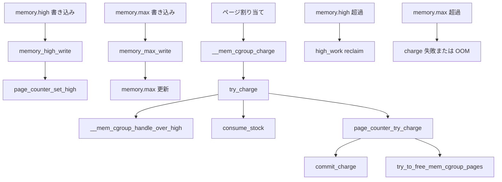

# 第19章 memory コントローラと memcg 境界

> **本章で読むソース**
>
> - [`include/linux/memcontrol.h` L189-L243](https://github.com/gregkh/linux/blob/v6.18.38/include/linux/memcontrol.h#L189-L243)
> - [`mm/memcontrol.c` L3785-L3836](https://github.com/gregkh/linux/blob/v6.18.38/mm/memcontrol.c#L3785-L3836)
> - [`mm/memcontrol.c` L4590-L4627](https://github.com/gregkh/linux/blob/v6.18.38/mm/memcontrol.c#L4590-L4627)
> - [`mm/memcontrol.c` L4664-L4680](https://github.com/gregkh/linux/blob/v6.18.38/mm/memcontrol.c#L4664-L4680)
> - [`mm/memcontrol.c` L4705-L4731](https://github.com/gregkh/linux/blob/v6.18.38/mm/memcontrol.c#L4705-L4731)
> - [`mm/memcontrol.c` L4358-L4402](https://github.com/gregkh/linux/blob/v6.18.38/mm/memcontrol.c#L4358-L4402)
> - [`mm/memcontrol.c` L4410-L4433](https://github.com/gregkh/linux/blob/v6.18.38/mm/memcontrol.c#L4410-L4433)
> - [`mm/memcontrol.c` L2210-L2253](https://github.com/gregkh/linux/blob/v6.18.38/mm/memcontrol.c#L2210-L2253)
> - [`mm/memcontrol.c` L1786-L1825](https://github.com/gregkh/linux/blob/v6.18.38/mm/memcontrol.c#L1786-L1825)
> - [`mm/memcontrol.c` L2300-L2338](https://github.com/gregkh/linux/blob/v6.18.38/mm/memcontrol.c#L2300-L2338)

## この章の狙い

**memory コントローラ** の css 生成と `memory.high` / `memory.max` の設定経路を読む。
folio への charge がどこから始まるかを押さえ、charge と reclaim の詳細は mm 分冊へ委譲する。

## 前提

- [第13章 css と cgroup_subsys のライフサイクル](../part02-cgroup-core/13-css-lifecycle.md)
- [第17章 rstat と per-CPU 統計集約](../part02-cgroup-core/17-rstat.md)
- [mm 分冊 31 章 memcg](../../mm/part05-advanced/31-memcg.md)

## mem_cgroup と page_counter

memory コントローラの css は `struct mem_cgroup` に埋め込まれる。
使用量は `page_counter` で階層的に集計される。

[`include/linux/memcontrol.h` L189-L243](https://github.com/gregkh/linux/blob/v6.18.38/include/linux/memcontrol.h#L189-L243)

```c
struct mem_cgroup {
	struct cgroup_subsys_state css;

	/* Private memcg ID. Used to ID objects that outlive the cgroup */
	struct mem_cgroup_id id;

	/* Accounted resources */
	struct page_counter memory;		/* Both v1 & v2 */

	union {
		struct page_counter swap;	/* v2 only */
		struct page_counter memsw;	/* v1 only */
	};

	/* registered local peak watchers */
	struct list_head memory_peaks;
	struct list_head swap_peaks;
	spinlock_t	 peaks_lock;

	/* Range enforcement for interrupt charges */
	struct work_struct high_work;

#ifdef CONFIG_ZSWAP
	unsigned long zswap_max;

	/*
	 * Prevent pages from this memcg from being written back from zswap to
	 * swap, and from being swapped out on zswap store failures.
	 */
	bool zswap_writeback;
#endif

	/* vmpressure notifications */
	struct vmpressure vmpressure;

	/*
	 * Should the OOM killer kill all belonging tasks, had it kill one?
	 */
	bool oom_group;

	int swappiness;

	/* memory.events and memory.events.local */
	struct cgroup_file events_file;
	struct cgroup_file events_local_file;

	/* handle for "memory.swap.events" */
	struct cgroup_file swap_events_file;

	/* memory.stat */
	struct memcg_vmstats	*vmstats;

	/* memory.events */
	atomic_long_t		memory_events[MEMCG_NR_MEMORY_EVENTS];
	atomic_long_t		memory_events_local[MEMCG_NR_MEMORY_EVENTS];
```

`memory` カウンタが anon と file cache を含む cgroup 全体の使用量を表す。
v2 では `swap` カウンタが別途存在する。

## mem_cgroup_css_alloc

新しい memory css は親の `page_counter` を親ポインタにして子カウンタを初期化する。

[`mm/memcontrol.c` L3785-L3836](https://github.com/gregkh/linux/blob/v6.18.38/mm/memcontrol.c#L3785-L3836)

```c
static struct cgroup_subsys_state * __ref
mem_cgroup_css_alloc(struct cgroup_subsys_state *parent_css)
{
	struct mem_cgroup *parent = mem_cgroup_from_css(parent_css);
	struct mem_cgroup *memcg, *old_memcg;
	bool memcg_on_dfl = cgroup_subsys_on_dfl(memory_cgrp_subsys);

	old_memcg = set_active_memcg(parent);
	memcg = mem_cgroup_alloc(parent);
	set_active_memcg(old_memcg);
	if (IS_ERR(memcg))
		return ERR_CAST(memcg);

	page_counter_set_high(&memcg->memory, PAGE_COUNTER_MAX);
	memcg1_soft_limit_reset(memcg);
#ifdef CONFIG_ZSWAP
	memcg->zswap_max = PAGE_COUNTER_MAX;
	WRITE_ONCE(memcg->zswap_writeback, true);
#endif
	page_counter_set_high(&memcg->swap, PAGE_COUNTER_MAX);
	if (parent) {
		WRITE_ONCE(memcg->swappiness, mem_cgroup_swappiness(parent));

		page_counter_init(&memcg->memory, &parent->memory, memcg_on_dfl);
		page_counter_init(&memcg->swap, &parent->swap, false);
#ifdef CONFIG_MEMCG_V1
		memcg->memory.track_failcnt = !memcg_on_dfl;
		WRITE_ONCE(memcg->oom_kill_disable, READ_ONCE(parent->oom_kill_disable));
		page_counter_init(&memcg->kmem, &parent->kmem, false);
		page_counter_init(&memcg->tcpmem, &parent->tcpmem, false);
#endif
	} else {
		init_memcg_stats();
		init_memcg_events();
		page_counter_init(&memcg->memory, NULL, true);
		page_counter_init(&memcg->swap, NULL, false);
#ifdef CONFIG_MEMCG_V1
		page_counter_init(&memcg->kmem, NULL, false);
		page_counter_init(&memcg->tcpmem, NULL, false);
#endif
		root_mem_cgroup = memcg;
		return &memcg->css;
	}

	if (memcg_on_dfl && !cgroup_memory_nosocket)
		static_branch_inc(&memcg_sockets_enabled_key);

	if (!cgroup_memory_nobpf)
		static_branch_inc(&memcg_bpf_enabled_key);

	return &memcg->css;
}
```

初期状態では `memory.high` は `PAGE_COUNTER_MAX` で実質無制限である。
ユーザーが `memory.high` や `memory.max` を書き込むと `page_counter` の閾値が更新される。

## memory.high と memory.max の interface

v2 の memory コントローラファイルは `memory_files` に定義される。

[`mm/memcontrol.c` L4590-L4627](https://github.com/gregkh/linux/blob/v6.18.38/mm/memcontrol.c#L4590-L4627)

```c
static struct cftype memory_files[] = {
	{
		.name = "current",
		.flags = CFTYPE_NOT_ON_ROOT,
		.read_u64 = memory_current_read,
	},
	{
		.name = "peak",
		.flags = CFTYPE_NOT_ON_ROOT,
		.open = peak_open,
		.release = peak_release,
		.seq_show = memory_peak_show,
		.write = memory_peak_write,
	},
	{
		.name = "min",
		.flags = CFTYPE_NOT_ON_ROOT,
		.seq_show = memory_min_show,
		.write = memory_min_write,
	},
	{
		.name = "low",
		.flags = CFTYPE_NOT_ON_ROOT,
		.seq_show = memory_low_show,
		.write = memory_low_write,
	},
	{
		.name = "high",
		.flags = CFTYPE_NOT_ON_ROOT,
		.seq_show = memory_high_show,
		.write = memory_high_write,
	},
	{
		.name = "max",
		.flags = CFTYPE_NOT_ON_ROOT,
		.seq_show = memory_max_show,
		.write = memory_max_write,
	},
```

`memory.high` はソフト上限であり、超過時は reclaim とスロットリングで圧力をかける。
`memory.max` はハード上限であり、超過時は charge が失敗するか OOM の対象になる。

## memory.high と memory.max の書き込み

`memory.high` と `memory.max` への書き込みは、それぞれ `page_counter_set_high` と `memory.max` の直接更新で `page_counter` 閾値を変える。
通常の blocking 書き込みでは、閾値更新後に現在量が閾値を超えていれば同期的な reclaim loop を回す。
`O_NONBLOCK` で開かれたファイルには閾値更新後に reclaim loop を通らず `out` へ進む。

[`mm/memcontrol.c` L4358-L4402](https://github.com/gregkh/linux/blob/v6.18.38/mm/memcontrol.c#L4358-L4402)

```c
static ssize_t memory_high_write(struct kernfs_open_file *of,
				 char *buf, size_t nbytes, loff_t off)
{
	struct mem_cgroup *memcg = mem_cgroup_from_css(of_css(of));
	unsigned int nr_retries = MAX_RECLAIM_RETRIES;
	bool drained = false;
	unsigned long high;
	int err;

	buf = strstrip(buf);
	err = page_counter_memparse(buf, "max", &high);
	if (err)
		return err;

	page_counter_set_high(&memcg->memory, high);

	if (of->file->f_flags & O_NONBLOCK)
		goto out;

	for (;;) {
		unsigned long nr_pages = page_counter_read(&memcg->memory);
		unsigned long reclaimed;

		if (nr_pages <= high)
			break;

		if (signal_pending(current))
			break;

		if (!drained) {
			drain_all_stock(memcg);
			drained = true;
			continue;
		}

		reclaimed = try_to_free_mem_cgroup_pages(memcg, nr_pages - high,
					GFP_KERNEL, MEMCG_RECLAIM_MAY_SWAP, NULL);

		if (!reclaimed && !nr_retries--)
			break;
	}
out:
	memcg_wb_domain_size_changed(memcg);
	return nbytes;
}
```

[`mm/memcontrol.c` L4410-L4433](https://github.com/gregkh/linux/blob/v6.18.38/mm/memcontrol.c#L4410-L4433)

```c
static ssize_t memory_max_write(struct kernfs_open_file *of,
				char *buf, size_t nbytes, loff_t off)
{
	struct mem_cgroup *memcg = mem_cgroup_from_css(of_css(of));
	unsigned int nr_reclaims = MAX_RECLAIM_RETRIES;
	bool drained = false;
	unsigned long max;
	int err;

	buf = strstrip(buf);
	err = page_counter_memparse(buf, "max", &max);
	if (err)
		return err;

	xchg(&memcg->memory.max, max);

	if (of->file->f_flags & O_NONBLOCK)
		goto out;

	for (;;) {
		unsigned long nr_pages = page_counter_read(&memcg->memory);

		if (nr_pages <= max)
			break;
```

cgroup interface から `page_counter` への接続はここで完結する。
実行時の charge 経路では `try_charge_memcg` が high 超過を検知し、`__mem_cgroup_handle_over_high` で reclaim と遅延を掛ける。

[`mm/memcontrol.c` L2210-L2253](https://github.com/gregkh/linux/blob/v6.18.38/mm/memcontrol.c#L2210-L2253)

```c
void __mem_cgroup_handle_over_high(gfp_t gfp_mask)
{
	unsigned long penalty_jiffies;
	unsigned long pflags;
	unsigned long nr_reclaimed;
	unsigned int nr_pages = current->memcg_nr_pages_over_high;
	int nr_retries = MAX_RECLAIM_RETRIES;
	struct mem_cgroup *memcg;
	bool in_retry = false;

	memcg = get_mem_cgroup_from_mm(current->mm);
	current->memcg_nr_pages_over_high = 0;

retry_reclaim:
	/*
	 * Bail if the task is already exiting. Unlike memory.max,
	 * memory.high enforcement isn't as strict, and there is no
	 * OOM killer involved, which means the excess could already
	 * be much bigger (and still growing) than it could for
	 * memory.max; the dying task could get stuck in fruitless
	 * reclaim for a long time, which isn't desirable.
	 */
	if (task_is_dying())
		goto out;

	/*
	 * The allocating task should reclaim at least the batch size, but for
	 * subsequent retries we only want to do what's necessary to prevent oom
	 * or breaching resource isolation.
	 *
	 * This is distinct from memory.max or page allocator behaviour because
	 * memory.high is currently batched, whereas memory.max and the page
	 * allocator run every time an allocation is made.
	 */
	nr_reclaimed = reclaim_high(memcg,
				    in_retry ? SWAP_CLUSTER_MAX : nr_pages,
				    gfp_mask);

	/*
	 * memory.high is breached and reclaim is unable to keep up. Throttle
	 * allocators proactively to slow down excessive growth.
	 */
	penalty_jiffies = calculate_high_delay(memcg, nr_pages,
					       mem_find_max_overage(memcg));
```

`memory_cgrp_subsys` の vtable は fork と exit フックを持ち、プロセス寿命と連動する。

[`mm/memcontrol.c` L4664-L4680](https://github.com/gregkh/linux/blob/v6.18.38/mm/memcontrol.c#L4664-L4680)

```c
struct cgroup_subsys memory_cgrp_subsys = {
	.css_alloc = mem_cgroup_css_alloc,
	.css_online = mem_cgroup_css_online,
	.css_offline = mem_cgroup_css_offline,
	.css_released = mem_cgroup_css_released,
	.css_free = mem_cgroup_css_free,
	.css_reset = mem_cgroup_css_reset,
	.css_rstat_flush = mem_cgroup_css_rstat_flush,
	.attach = mem_cgroup_attach,
	.fork = mem_cgroup_fork,
	.exit = mem_cgroup_exit,
	.dfl_cftypes = memory_files,
#ifdef CONFIG_MEMCG_V1
	.legacy_cftypes = mem_cgroup_legacy_files,
#endif
	.early_init = 0,
};
```

## charge の入口

folio への charge は `__mem_cgroup_charge` が入口である。
`mm` から memcg を取得し、`charge_memcg` が `try_charge` を呼ぶ。

[`mm/memcontrol.c` L4705-L4731](https://github.com/gregkh/linux/blob/v6.18.38/mm/memcontrol.c#L4705-L4731)

```c
static int charge_memcg(struct folio *folio, struct mem_cgroup *memcg,
			gfp_t gfp)
{
	int ret;

	ret = try_charge(memcg, gfp, folio_nr_pages(folio));
	if (ret)
		goto out;

	css_get(&memcg->css);
	commit_charge(folio, memcg);
	memcg1_commit_charge(folio, memcg);
out:
	return ret;
}

int __mem_cgroup_charge(struct folio *folio, struct mm_struct *mm, gfp_t gfp)
{
	struct mem_cgroup *memcg;
	int ret;

	memcg = get_mem_cgroup_from_mm(mm);
	ret = charge_memcg(folio, memcg, gfp);
	css_put(&memcg->css);

	return ret;
}
```

`try_charge` の内部は `try_charge_memcg` で `page_counter_try_charge` を試み、失敗時は reclaim や OOM へ進む。

[`mm/memcontrol.c` L2300-L2338](https://github.com/gregkh/linux/blob/v6.18.38/mm/memcontrol.c#L2300-L2338)

```c
static int try_charge_memcg(struct mem_cgroup *memcg, gfp_t gfp_mask,
			    unsigned int nr_pages)
{
	unsigned int batch = max(MEMCG_CHARGE_BATCH, nr_pages);
	int nr_retries = MAX_RECLAIM_RETRIES;
	struct mem_cgroup *mem_over_limit;
	struct page_counter *counter;
	unsigned long nr_reclaimed;
	bool passed_oom = false;
	unsigned int reclaim_options = MEMCG_RECLAIM_MAY_SWAP;
	bool drained = false;
	bool raised_max_event = false;
	unsigned long pflags;
	bool allow_spinning = gfpflags_allow_spinning(gfp_mask);

retry:
	if (consume_stock(memcg, nr_pages))
		return 0;

	if (!allow_spinning)
		/* Avoid the refill and flush of the older stock */
		batch = nr_pages;

	if (!do_memsw_account() ||
	    page_counter_try_charge(&memcg->memsw, batch, &counter)) {
		if (page_counter_try_charge(&memcg->memory, batch, &counter))
			goto done_restock;
		if (do_memsw_account())
			page_counter_uncharge(&memcg->memsw, batch);
		mem_over_limit = mem_cgroup_from_counter(counter, memory);
	} else {
		mem_over_limit = mem_cgroup_from_counter(counter, memsw);
		reclaim_options &= ~MEMCG_RECLAIM_MAY_SWAP;
	}

	if (batch > nr_pages) {
		batch = nr_pages;
		goto retry;
	}
```

folio の charge 経路、LRU 走査、swap と reclaim の相互作用は [mm 分冊 31 章](../../mm/part05-advanced/31-memcg.md) で扱う。
本章は cgroup 側の css と `page_counter` 境界に留める。

## 処理フロー



## 高速化と最適化の工夫

毎ページの charge で `page_counter` を更新するとコストが高い。
`consume_stock` は per CPU の在庫から先に消費し、バッチ単位のカウンタ更新回数を減らす。

[`mm/memcontrol.c` L1786-L1825](https://github.com/gregkh/linux/blob/v6.18.38/mm/memcontrol.c#L1786-L1825)

```c
/**
 * consume_stock: Try to consume stocked charge on this cpu.
 * @memcg: memcg to consume from.
 * @nr_pages: how many pages to charge.
 *
 * Consume the cached charge if enough nr_pages are present otherwise return
 * failure. Also return failure for charge request larger than
 * MEMCG_CHARGE_BATCH or if the local lock is already taken.
 *
 * returns true if successful, false otherwise.
 */
static bool consume_stock(struct mem_cgroup *memcg, unsigned int nr_pages)
{
	struct memcg_stock_pcp *stock;
	uint8_t stock_pages;
	bool ret = false;
	int i;

	if (nr_pages > MEMCG_CHARGE_BATCH ||
	    !local_trylock(&memcg_stock.lock))
		return ret;

	stock = this_cpu_ptr(&memcg_stock);

	for (i = 0; i < NR_MEMCG_STOCK; ++i) {
		if (memcg != READ_ONCE(stock->cached[i]))
			continue;

		stock_pages = READ_ONCE(stock->nr_pages[i]);
		if (stock_pages >= nr_pages) {
			WRITE_ONCE(stock->nr_pages[i], stock_pages - nr_pages);
			ret = true;
		}
		break;
	}

	local_unlock(&memcg_stock.lock);

	return ret;
}
```

`try_charge_memcg` は最初に `consume_stock` を試し、成功すればグローバルカウンタ更新を省略する。
在庫が尽きたときだけ `page_counter_try_charge` でバッチ charge する。

## まとめ

memory コントローラは `mem_cgroup` と `page_counter` で階層的な使用量を管理する。
`memory.high` と `memory.max` の書き込みは `page_counter` 閾値を更新し、charge 経路では high 超過時に `__mem_cgroup_handle_over_high` が圧力を掛ける。
folio charge の入口は `__mem_cgroup_charge` であり、内部の reclaim と LRU 操作は mm 分冊へ委譲する。

## 関連する章

- [第20章 io コントローラ](20-io-controller.md)
- [mm 分冊 31 章 memcg](../../mm/part05-advanced/31-memcg.md)
