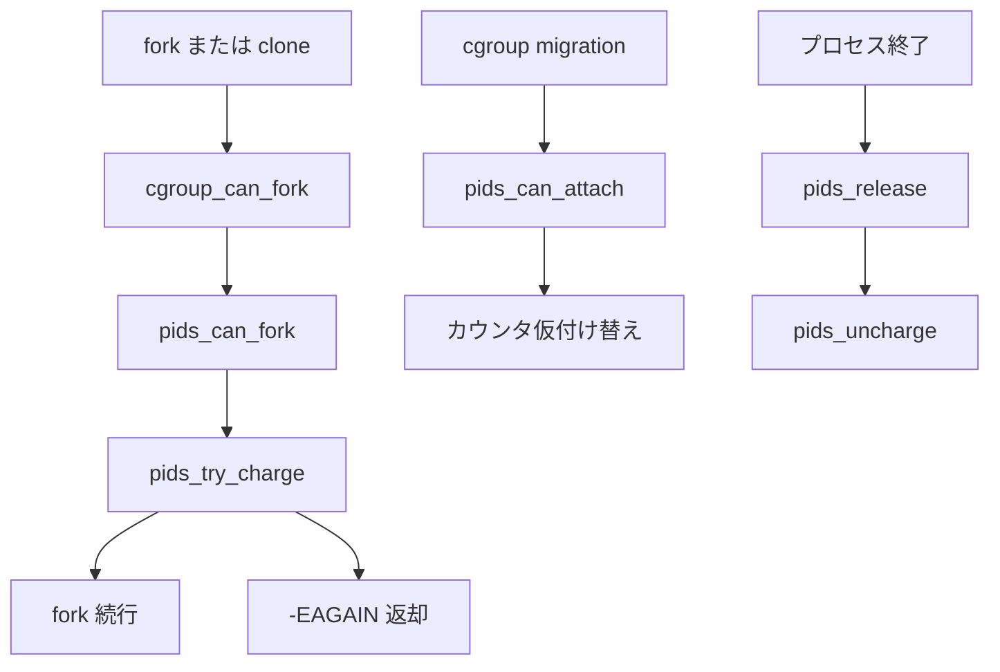

# 第21章 pids コントローラ

> **本章で読むソース**
>
> - [`kernel/cgroup/pids.c` L1-L29](https://github.com/gregkh/linux/blob/v6.18.38/kernel/cgroup/pids.c#L1-L29)
> - [`kernel/cgroup/pids.c` L49-L89](https://github.com/gregkh/linux/blob/v6.18.38/kernel/cgroup/pids.c#L49-L89)
> - [`kernel/cgroup/pids.c` L166-L198](https://github.com/gregkh/linux/blob/v6.18.38/kernel/cgroup/pids.c#L166-L198)
> - [`kernel/cgroup/pids.c` L200-L241](https://github.com/gregkh/linux/blob/v6.18.38/kernel/cgroup/pids.c#L200-L241)
> - [`kernel/cgroup/pids.c` L273-L292](https://github.com/gregkh/linux/blob/v6.18.38/kernel/cgroup/pids.c#L273-L292)
> - [`kernel/cgroup/pids.c` L390-L460](https://github.com/gregkh/linux/blob/v6.18.38/kernel/cgroup/pids.c#L390-L460)

## この章の狙い

**pids コントローラ** がタスク数上限を階層的に課す仕組みを読む。
`pids.max` の設定、`can_fork` と `can_attach` による制限、カウンタの階層 charge を押さえる。

## 前提

- [第14章 タスクの cgroup 所属と migration](../part02-cgroup-core/14-cgroup-attach-migration.md)
- [第3章 clone、unshare、setns の入口](../part00-foundation/03-clone-unshare-setns.md)

## pids コントローラの目的

ファイル先頭のコメントが、pids コントローラの設計意図を述べる。
PID は kmemcg 制限だけでは枯渇を防げないため、cgroup 階層でタスク数を制限する。
カウンタの単位は `task_struct` であり、スレッド生成も charge 対象である。

[`kernel/cgroup/pids.c` L1-L29](https://github.com/gregkh/linux/blob/v6.18.38/kernel/cgroup/pids.c#L1-L29)

```c
// SPDX-License-Identifier: GPL-2.0-only
/*
 * Process number limiting controller for cgroups.
 *
 * Used to allow a cgroup hierarchy to stop any new processes from fork()ing
 * after a certain limit is reached.
 *
 * Since it is trivial to hit the task limit without hitting any kmemcg limits
 * in place, PIDs are a fundamental resource. As such, PID exhaustion must be
 * preventable in the scope of a cgroup hierarchy by allowing resource limiting
 * of the number of tasks in a cgroup.
 *
 * In order to use the `pids` controller, set the maximum number of tasks in
 * pids.max (this is not available in the root cgroup for obvious reasons). The
 * number of processes currently in the cgroup is given by pids.current.
 * Organisational operations are not blocked by cgroup policies, so it is
 * possible to have pids.current > pids.max. However, it is not possible to
 * violate a cgroup policy through fork(). fork() will return -EAGAIN if forking
 * would cause a cgroup policy to be violated.
 *
 * To set a cgroup to have no limit, set pids.max to "max". This is the default
 * for all new cgroups (N.B. that PID limits are hierarchical, so the most
 * stringent limit in the hierarchy is followed).
 *
 * pids.current tracks all child cgroup hierarchies, so parent/pids.current is
 * a superset of parent/child/pids.current.
 *
 * Copyright (C) 2015 Aleksa Sarai <cyphar@cyphar.com>
 */
```

organizational な操作では `pids.current` が `pids.max` を超えうるが、新規 `fork` は拒否される。
階層全体で最も厳しい上限が効く。

## pids_cgroup の構造

pids コントローラの css は `pids_cgroup` に埋め込まれる。
カウンタと上限は 64 ビット原子変数で保持する。

[`kernel/cgroup/pids.c` L49-L89](https://github.com/gregkh/linux/blob/v6.18.38/kernel/cgroup/pids.c#L49-L89)

```c
struct pids_cgroup {
	struct cgroup_subsys_state	css;

	/*
	 * Use 64-bit types so that we can safely represent "max" as
	 * %PIDS_MAX = (%PID_MAX_LIMIT + 1).
	 */
	atomic64_t			counter;
	atomic64_t			limit;
	int64_t				watermark;

	/* Handles for pids.events[.local] */
	struct cgroup_file		events_file;
	struct cgroup_file		events_local_file;

	atomic64_t			events[NR_PIDCG_EVENTS];
	atomic64_t			events_local[NR_PIDCG_EVENTS];
};

static struct pids_cgroup *css_pids(struct cgroup_subsys_state *css)
{
	return container_of(css, struct pids_cgroup, css);
}

static struct pids_cgroup *parent_pids(struct pids_cgroup *pids)
{
	return css_pids(pids->css.parent);
}

static struct cgroup_subsys_state *
pids_css_alloc(struct cgroup_subsys_state *parent)
{
	struct pids_cgroup *pids;

	pids = kzalloc(sizeof(struct pids_cgroup), GFP_KERNEL);
	if (!pids)
		return ERR_PTR(-ENOMEM);

	atomic64_set(&pids->limit, PIDS_MAX);
	return &pids->css;
}
```

新規 cgroup の `pids.max` 既定値は `PIDS_MAX` で実質無制限である。

## 階層的 charge と pids_try_charge

タスク数の増減は祖先方向へ伝播する。
`pids_try_charge` は各階層で `counter` と `limit` を比較し、超過ならロールバックする。

[`kernel/cgroup/pids.c` L166-L198](https://github.com/gregkh/linux/blob/v6.18.38/kernel/cgroup/pids.c#L166-L198)

```c
static int pids_try_charge(struct pids_cgroup *pids, int num, struct pids_cgroup **fail)
{
	struct pids_cgroup *p, *q;

	for (p = pids; parent_pids(p); p = parent_pids(p)) {
		int64_t new = atomic64_add_return(num, &p->counter);
		int64_t limit = atomic64_read(&p->limit);

		/*
		 * Since new is capped to the maximum number of pid_t, if
		 * p->limit is %PIDS_MAX then we know that this test will never
		 * fail.
		 */
		if (new > limit) {
			*fail = p;
			goto revert;
		}
		/*
		 * Not technically accurate if we go over limit somewhere up
		 * the hierarchy, but that's tolerable for the watermark.
		 */
		pids_update_watermark(p, new);
	}

	return 0;

revert:
	for (q = pids; q != p; q = parent_pids(q))
		pids_cancel(q, num);
	pids_cancel(p, num);

	return -EAGAIN;
}
```

`fork` 失敗時は `-EAGAIN` が返り、`pids_event` がイベントファイルを通知する。

## can_fork と can_attach

`fork` 経路では `pids_can_fork` が `cgroup_can_fork` から呼ばれる。
migration 経路では `pids_can_attach` が先にカウンタを仮調整する。

[`kernel/cgroup/pids.c` L200-L241](https://github.com/gregkh/linux/blob/v6.18.38/kernel/cgroup/pids.c#L200-L241)

```c
static int pids_can_attach(struct cgroup_taskset *tset)
{
	struct task_struct *task;
	struct cgroup_subsys_state *dst_css;

	cgroup_taskset_for_each(task, dst_css, tset) {
		struct pids_cgroup *pids = css_pids(dst_css);
		struct cgroup_subsys_state *old_css;
		struct pids_cgroup *old_pids;

		/*
		 * No need to pin @old_css between here and cancel_attach()
		 * because cgroup core protects it from being freed before
		 * the migration completes or fails.
		 */
		old_css = task_css(task, pids_cgrp_id);
		old_pids = css_pids(old_css);

		pids_charge(pids, 1);
		pids_uncharge(old_pids, 1);
	}

	return 0;
}

static void pids_cancel_attach(struct cgroup_taskset *tset)
{
	struct task_struct *task;
	struct cgroup_subsys_state *dst_css;

	cgroup_taskset_for_each(task, dst_css, tset) {
		struct pids_cgroup *pids = css_pids(dst_css);
		struct cgroup_subsys_state *old_css;
		struct pids_cgroup *old_pids;

		old_css = task_css(task, pids_cgrp_id);
		old_pids = css_pids(old_css);

		pids_charge(old_pids, 1);
		pids_uncharge(pids, 1);
	}
}
```

`can_attach` では上限チェックを行わず、カウンタの仮付け替えだけを行う。
実際の上限検証は `can_fork` 側で行われる設計である。

[`kernel/cgroup/pids.c` L273-L292](https://github.com/gregkh/linux/blob/v6.18.38/kernel/cgroup/pids.c#L273-L292)

```c
static int pids_can_fork(struct task_struct *task, struct css_set *cset)
{
	struct pids_cgroup *pids, *pids_over_limit;
	int err;

	pids = css_pids(cset->subsys[pids_cgrp_id]);
	err = pids_try_charge(pids, 1, &pids_over_limit);
	if (err)
		pids_event(pids, pids_over_limit);

	return err;
}

static void pids_cancel_fork(struct task_struct *task, struct css_set *cset)
{
	struct pids_cgroup *pids;

	pids = css_pids(cset->subsys[pids_cgrp_id]);
	pids_uncharge(pids, 1);
}
```

プロセス終了時は `pids_release` が `pids_uncharge` を呼び、階層カウンタを減らす。

## interface ファイルと pids_cgrp_subsys

[`kernel/cgroup/pids.c` L390-L460](https://github.com/gregkh/linux/blob/v6.18.38/kernel/cgroup/pids.c#L390-L460)

```c
static struct cftype pids_files[] = {
	{
		.name = "max",
		.write = pids_max_write,
		.seq_show = pids_max_show,
		.flags = CFTYPE_NOT_ON_ROOT,
	},
	{
		.name = "current",
		.read_s64 = pids_current_read,
		.flags = CFTYPE_NOT_ON_ROOT,
	},
	{
		.name = "peak",
		.flags = CFTYPE_NOT_ON_ROOT,
		.read_s64 = pids_peak_read,
	},
	{
		.name = "events",
		.seq_show = pids_events_show,
		.file_offset = offsetof(struct pids_cgroup, events_file),
		.flags = CFTYPE_NOT_ON_ROOT,
	},
	{
		.name = "events.local",
		.seq_show = pids_events_local_show,
		.file_offset = offsetof(struct pids_cgroup, events_local_file),
		.flags = CFTYPE_NOT_ON_ROOT,
	},
	{ }	/* terminate */
};

static struct cftype pids_files_legacy[] = {
	{
		.name = "max",
		.write = pids_max_write,
		.seq_show = pids_max_show,
		.flags = CFTYPE_NOT_ON_ROOT,
	},
	{
		.name = "current",
		.read_s64 = pids_current_read,
		.flags = CFTYPE_NOT_ON_ROOT,
	},
	{
		.name = "peak",
		.flags = CFTYPE_NOT_ON_ROOT,
		.read_s64 = pids_peak_read,
	},
	{
		.name = "events",
		.seq_show = pids_events_show,
		.file_offset = offsetof(struct pids_cgroup, events_file),
		.flags = CFTYPE_NOT_ON_ROOT,
	},
	{ }	/* terminate */
};


struct cgroup_subsys pids_cgrp_subsys = {
	.css_alloc	= pids_css_alloc,
	.css_free	= pids_css_free,
	.can_attach 	= pids_can_attach,
	.cancel_attach 	= pids_cancel_attach,
	.can_fork	= pids_can_fork,
	.cancel_fork	= pids_cancel_fork,
	.release	= pids_release,
	.legacy_cftypes = pids_files_legacy,
	.dfl_cftypes	= pids_files,
	.threaded	= true,
};
```

`threaded` フラグにより threaded cgroup でも pids 制限が thread 粒度で適用される。

## 処理フロー



## 高速化と最適化の工夫

`pids.max` の更新は mutex で保護しない。
コメントが述べるとおり、競合する `fork` が一時的に古い上限を見ても許容する設計である。

[`kernel/cgroup/pids.c` L322-L329](https://github.com/gregkh/linux/blob/v6.18.38/kernel/cgroup/pids.c#L322-L329)

```c
set_limit:
	/*
	 * Limit updates don't need to be mutex'd, since it isn't
	 * critical that any racing fork()s follow the new limit.
	 */
	atomic64_set(&pids->limit, limit);
	return nbytes;
}
```

watermark 更新も厳密な同期を避ける。
`pids_update_watermark` はレースを許容し、ピーク値の近似で十分とする。

階層 charge は祖先チェーンを上るが、各段は原子加算一回である。
`PIDS_MAX` の cgroup は比較が常に成功するため、無制限ノードのコストは最小になる。

## まとめ

pids コントローラは階層的なタスク数カウンタで `fork` を制限する。
`pids_try_charge` が上限判定の中心であり、`can_fork` で新規タスク、`release` で終了を処理する。
migration 時のカウンタ調整は `can_attach` と `cancel_attach` が担う。

## 関連する章

- [第22章 cpuset コントローラ](22-cpuset-controller.md)
- [第14章 タスクの cgroup 所属と migration](../part02-cgroup-core/14-cgroup-attach-migration.md)
