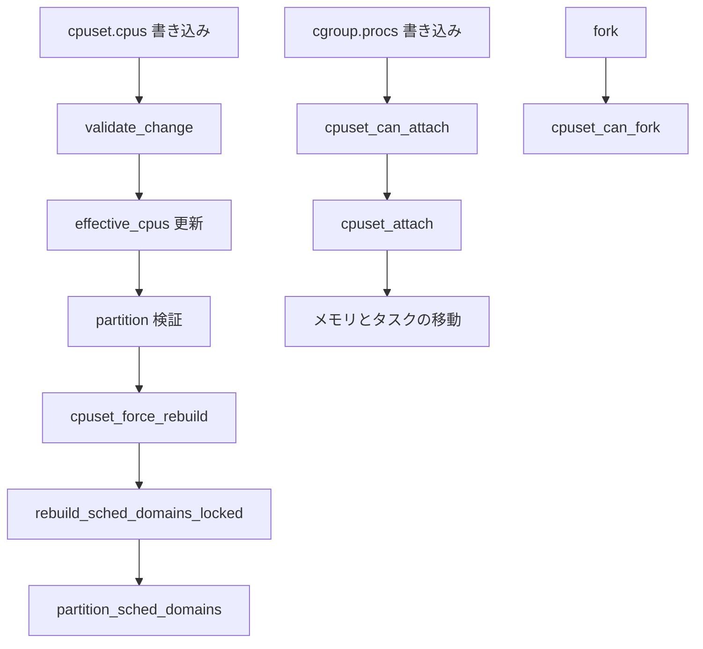

# 第22章 cpuset コントローラ

> **本章で読むソース**
>
> - [`kernel/cgroup/cpuset.c` L3476-L3551](https://github.com/gregkh/linux/blob/v6.18.38/kernel/cgroup/cpuset.c#L3476-L3551)
> - [`kernel/cgroup/cpuset.c` L3885-L3888](https://github.com/gregkh/linux/blob/v6.18.38/kernel/cgroup/cpuset.c#L3885-L3888)
> - [`kernel/cgroup/cpuset.c` L1097-L1147](https://github.com/gregkh/linux/blob/v6.18.38/kernel/cgroup/cpuset.c#L1097-L1147)
> - [`kernel/cgroup/cpuset.c` L3563-L3651](https://github.com/gregkh/linux/blob/v6.18.38/kernel/cgroup/cpuset.c#L3563-L3651)
> - [`kernel/cgroup/cpuset.c` L1273-L1298](https://github.com/gregkh/linux/blob/v6.18.38/kernel/cgroup/cpuset.c#L1273-L1298)
> - [`kernel/cgroup/cpuset.c` L3084-L3087](https://github.com/gregkh/linux/blob/v6.18.38/kernel/cgroup/cpuset.c#L3084-L3087)
> - [`kernel/cgroup/cpuset.c` L3114-L3157](https://github.com/gregkh/linux/blob/v6.18.38/kernel/cgroup/cpuset.c#L3114-L3157)
> - [`kernel/cgroup/cpuset.c` L3718-L3755](https://github.com/gregkh/linux/blob/v6.18.38/kernel/cgroup/cpuset.c#L3718-L3755)
> - [`kernel/cgroup/cpuset.c` L3805-L3824](https://github.com/gregkh/linux/blob/v6.18.38/kernel/cgroup/cpuset.c#L3805-L3824)

## この章の狙い

**cpuset コントローラ** が CPU とメモリノードの許容集合を cgroup に束ねる仕組みを読む。
`cpuset.cpus` と `cpuset.mems`、effective マスク、partition と負荷分散ドメイン再構築の入口を押さえる。

## 前提

- [第18章 cpu コントローラと sched 連携](18-cpu-controller.md)
- [第14章 タスクの cgroup 所属と migration](../part02-cgroup-core/14-cgroup-attach-migration.md)

## v2 の interface ファイル

cgroup v2 の cpuset ファイルは `dfl_files` に定義される。
`cpus` と `mems` が許容集合の設定、`cpus.effective` と `mems.effective` が実効マスクである。

[`kernel/cgroup/cpuset.c` L3476-L3551](https://github.com/gregkh/linux/blob/v6.18.38/kernel/cgroup/cpuset.c#L3476-L3551)

```c
/*
 * This is currently a minimal set for the default hierarchy. It can be
 * expanded later on by migrating more features and control files from v1.
 */
static struct cftype dfl_files[] = {
	{
		.name = "cpus",
		.seq_show = cpuset_common_seq_show,
		.write = cpuset_write_resmask,
		.max_write_len = (100U + 6 * NR_CPUS),
		.private = FILE_CPULIST,
		.flags = CFTYPE_NOT_ON_ROOT,
	},

	{
		.name = "mems",
		.seq_show = cpuset_common_seq_show,
		.write = cpuset_write_resmask,
		.max_write_len = (100U + 6 * MAX_NUMNODES),
		.private = FILE_MEMLIST,
		.flags = CFTYPE_NOT_ON_ROOT,
	},

	{
		.name = "cpus.effective",
		.seq_show = cpuset_common_seq_show,
		.private = FILE_EFFECTIVE_CPULIST,
	},

	{
		.name = "mems.effective",
		.seq_show = cpuset_common_seq_show,
		.private = FILE_EFFECTIVE_MEMLIST,
	},

	{
		.name = "cpus.partition",
		.seq_show = cpuset_partition_show,
		.write = cpuset_partition_write,
		.private = FILE_PARTITION_ROOT,
		.flags = CFTYPE_NOT_ON_ROOT,
		.file_offset = offsetof(struct cpuset, partition_file),
	},

	{
		.name = "cpus.exclusive",
		.seq_show = cpuset_common_seq_show,
		.write = cpuset_write_resmask,
		.max_write_len = (100U + 6 * NR_CPUS),
		.private = FILE_EXCLUSIVE_CPULIST,
		.flags = CFTYPE_NOT_ON_ROOT,
	},

	{
		.name = "cpus.exclusive.effective",
		.seq_show = cpuset_common_seq_show,
		.private = FILE_EFFECTIVE_XCPULIST,
		.flags = CFTYPE_NOT_ON_ROOT,
	},

	{
		.name = "cpus.subpartitions",
		.seq_show = cpuset_common_seq_show,
		.private = FILE_SUBPARTS_CPULIST,
		.flags = CFTYPE_ONLY_ON_ROOT | CFTYPE_DEBUG,
	},

	{
		.name = "cpus.isolated",
		.seq_show = cpuset_common_seq_show,
		.private = FILE_ISOLATED_CPULIST,
		.flags = CFTYPE_ONLY_ON_ROOT,
	},

	{ }	/* terminate */
};
```

ユーザーが書くのは `cpus` と `mems` であり、effective マスクは親からの継承と partition 設定で決まる。

## cpuset_css_alloc と online

新しい cpuset css は親の effective マスクを継承して online される。

[`kernel/cgroup/cpuset.c` L3563-L3651](https://github.com/gregkh/linux/blob/v6.18.38/kernel/cgroup/cpuset.c#L3563-L3651)

```c
static struct cgroup_subsys_state *
cpuset_css_alloc(struct cgroup_subsys_state *parent_css)
{
	struct cpuset *cs;

	if (!parent_css)
		return &top_cpuset.css;

	cs = dup_or_alloc_cpuset(NULL);
	if (!cs)
		return ERR_PTR(-ENOMEM);

	__set_bit(CS_SCHED_LOAD_BALANCE, &cs->flags);
	fmeter_init(&cs->fmeter);
	cs->relax_domain_level = -1;
	INIT_LIST_HEAD(&cs->remote_sibling);

	/* Set CS_MEMORY_MIGRATE for default hierarchy */
	if (cpuset_v2())
		__set_bit(CS_MEMORY_MIGRATE, &cs->flags);

	return &cs->css;
}

static int cpuset_css_online(struct cgroup_subsys_state *css)
{
	struct cpuset *cs = css_cs(css);
	struct cpuset *parent = parent_cs(cs);
	struct cpuset *tmp_cs;
	struct cgroup_subsys_state *pos_css;

	if (!parent)
		return 0;

	cpuset_full_lock();
	if (is_spread_page(parent))
		set_bit(CS_SPREAD_PAGE, &cs->flags);
	if (is_spread_slab(parent))
		set_bit(CS_SPREAD_SLAB, &cs->flags);
	/*
	 * For v2, clear CS_SCHED_LOAD_BALANCE if parent is isolated
	 */
	if (cpuset_v2() && !is_sched_load_balance(parent))
		clear_bit(CS_SCHED_LOAD_BALANCE, &cs->flags);

	cpuset_inc();

	spin_lock_irq(&callback_lock);
	if (is_in_v2_mode()) {
		cpumask_copy(cs->effective_cpus, parent->effective_cpus);
		cs->effective_mems = parent->effective_mems;
	}
	spin_unlock_irq(&callback_lock);

	if (!test_bit(CGRP_CPUSET_CLONE_CHILDREN, &css->cgroup->flags))
		goto out_unlock;

	/*
	 * Clone @parent's configuration if CGRP_CPUSET_CLONE_CHILDREN is
	 * set.  This flag handling is implemented in cgroup core for
	 * historical reasons - the flag may be specified during mount.
	 *
	 * Currently, if any sibling cpusets have exclusive cpus or mem, we
	 * refuse to clone the configuration - thereby refusing the task to
	 * be entered, and as a result refusing the sys_unshare() or
	 * clone() which initiated it.  If this becomes a problem for some
	 * users who wish to allow that scenario, then this could be
	 * changed to grant parent->cpus_allowed-sibling_cpus_exclusive
	 * (and likewise for mems) to the new cgroup.
	 */
	rcu_read_lock();
	cpuset_for_each_child(tmp_cs, pos_css, parent) {
		if (is_mem_exclusive(tmp_cs) || is_cpu_exclusive(tmp_cs)) {
			rcu_read_unlock();
			goto out_unlock;
		}
	}
	rcu_read_unlock();

	spin_lock_irq(&callback_lock);
	cs->mems_allowed = parent->mems_allowed;
	cs->effective_mems = parent->mems_allowed;
	cpumask_copy(cs->cpus_allowed, parent->cpus_allowed);
	cpumask_copy(cs->effective_cpus, parent->cpus_allowed);
	spin_unlock_irq(&callback_lock);
out_unlock:
	cpuset_full_unlock();
	return 0;
}
```

v2 では `CS_MEMORY_MIGRATE` が既定で有効になり、メモリ移動の追従が期待される。

## partition と負荷分散ドメイン

`cpus.partition` の変更は `update_partition_sd_lb` を通じてスケジューラの load balance フラグを更新する。
partition root または isolated partition では負荷分散ドメインの再構築が起きうる。

[`kernel/cgroup/cpuset.c` L1273-L1298](https://github.com/gregkh/linux/blob/v6.18.38/kernel/cgroup/cpuset.c#L1273-L1298)

```c
static void update_partition_sd_lb(struct cpuset *cs, int old_prs)
{
	int new_prs = cs->partition_root_state;
	bool rebuild_domains = (new_prs > 0) || (old_prs > 0);
	bool new_lb;

	/*
	 * If cs is not a valid partition root, the load balance state
	 * will follow its parent.
	 */
	if (new_prs > 0) {
		new_lb = (new_prs != PRS_ISOLATED);
	} else {
		new_lb = is_sched_load_balance(parent_cs(cs));
	}
	if (new_lb != !!is_sched_load_balance(cs)) {
		rebuild_domains = true;
		if (new_lb)
			set_bit(CS_SCHED_LOAD_BALANCE, &cs->flags);
		else
			clear_bit(CS_SCHED_LOAD_BALANCE, &cs->flags);
	}

	if (rebuild_domains)
		cpuset_force_rebuild();
}
```

`cpuset_force_rebuild` は `force_sd_rebuild` フラグを立てるだけである。
実際の再構築は cpuset 更新処理の末尾でフラグを検査し、`rebuild_sched_domains_locked` が `generate_sched_domains` と `partition_sched_domains` を呼ぶ。

[`kernel/cgroup/cpuset.c` L3885-L3888](https://github.com/gregkh/linux/blob/v6.18.38/kernel/cgroup/cpuset.c#L3885-L3888)

```c
void cpuset_force_rebuild(void)
{
	force_sd_rebuild = true;
}
```

[`kernel/cgroup/cpuset.c` L3084-L3087](https://github.com/gregkh/linux/blob/v6.18.38/kernel/cgroup/cpuset.c#L3084-L3087)

```c
	notify_partition_change(cs, old_prs);
	if (force_sd_rebuild)
		rebuild_sched_domains_locked();
	free_tmpmasks(&tmpmask);
```

[`kernel/cgroup/cpuset.c` L1097-L1147](https://github.com/gregkh/linux/blob/v6.18.38/kernel/cgroup/cpuset.c#L1097-L1147)

```c
void rebuild_sched_domains_locked(void)
{
	struct cgroup_subsys_state *pos_css;
	struct sched_domain_attr *attr;
	cpumask_var_t *doms;
	struct cpuset *cs;
	int ndoms;

	lockdep_assert_cpus_held();
	lockdep_assert_held(&cpuset_mutex);
	force_sd_rebuild = false;

	/*
	 * If we have raced with CPU hotplug, return early to avoid
	 * passing doms with offlined cpu to partition_sched_domains().
	 * Anyways, cpuset_handle_hotplug() will rebuild sched domains.
	 *
	 * With no CPUs in any subpartitions, top_cpuset's effective CPUs
	 * should be the same as the active CPUs, so checking only top_cpuset
	 * is enough to detect racing CPU offlines.
	 */
	if (cpumask_empty(subpartitions_cpus) &&
	    !cpumask_equal(top_cpuset.effective_cpus, cpu_active_mask))
		return;

	/*
	 * With subpartition CPUs, however, the effective CPUs of a partition
	 * root should be only a subset of the active CPUs.  Since a CPU in any
	 * partition root could be offlined, all must be checked.
	 */
	if (!cpumask_empty(subpartitions_cpus)) {
		rcu_read_lock();
		cpuset_for_each_descendant_pre(cs, pos_css, &top_cpuset) {
			if (!is_partition_valid(cs)) {
				pos_css = css_rightmost_descendant(pos_css);
				continue;
			}
			if (!cpumask_subset(cs->effective_cpus,
					    cpu_active_mask)) {
				rcu_read_unlock();
				return;
			}
		}
		rcu_read_unlock();
	}

	/* Generate domain masks and attrs */
	ndoms = generate_sched_domains(&doms, &attr);

	/* Have scheduler rebuild the domains */
	partition_sched_domains(ndoms, doms, attr);
```

partition 境界で CPU が分断され、負荷分散の対象が変わる。

## can_attach と can_fork

タスクを cpuset に移す前に、許容 CPU とメモリノードへの適合を検証する。

[`kernel/cgroup/cpuset.c` L3114-L3157](https://github.com/gregkh/linux/blob/v6.18.38/kernel/cgroup/cpuset.c#L3114-L3157)

```c
static int cpuset_can_attach(struct cgroup_taskset *tset)
{
	struct cgroup_subsys_state *css;
	struct cpuset *cs, *oldcs;
	struct task_struct *task;
	bool cpus_updated, mems_updated;
	int ret;

	/* used later by cpuset_attach() */
	cpuset_attach_old_cs = task_cs(cgroup_taskset_first(tset, &css));
	oldcs = cpuset_attach_old_cs;
	cs = css_cs(css);

	mutex_lock(&cpuset_mutex);

	/* Check to see if task is allowed in the cpuset */
	ret = cpuset_can_attach_check(cs);
	if (ret)
		goto out_unlock;

	cpus_updated = !cpumask_equal(cs->effective_cpus, oldcs->effective_cpus);
	mems_updated = !nodes_equal(cs->effective_mems, oldcs->effective_mems);

	cgroup_taskset_for_each(task, css, tset) {
		ret = task_can_attach(task);
		if (ret)
			goto out_unlock;

		/*
		 * Skip rights over task check in v2 when nothing changes,
		 * migration permission derives from hierarchy ownership in
		 * cgroup_procs_write_permission()).
		 */
		if (!cpuset_v2() || (cpus_updated || mems_updated)) {
			ret = security_task_setscheduler(task);
			if (ret)
				goto out_unlock;
		}

		if (dl_task(task)) {
			cs->nr_migrate_dl_tasks++;
			cs->sum_migrate_dl_bw += task->dl.dl_bw;
		}
	}
```

`clone` で別 cpuset に生まれる子の検証は `cpuset_can_fork` が担う。

[`kernel/cgroup/cpuset.c` L3718-L3755](https://github.com/gregkh/linux/blob/v6.18.38/kernel/cgroup/cpuset.c#L3718-L3755)

```c
static int cpuset_can_fork(struct task_struct *task, struct css_set *cset)
{
	struct cpuset *cs = css_cs(cset->subsys[cpuset_cgrp_id]);
	bool same_cs;
	int ret;

	rcu_read_lock();
	same_cs = (cs == task_cs(current));
	rcu_read_unlock();

	if (same_cs)
		return 0;

	lockdep_assert_held(&cgroup_mutex);
	mutex_lock(&cpuset_mutex);

	/* Check to see if task is allowed in the cpuset */
	ret = cpuset_can_attach_check(cs);
	if (ret)
		goto out_unlock;

	ret = task_can_attach(task);
	if (ret)
		goto out_unlock;

	ret = security_task_setscheduler(task);
	if (ret)
		goto out_unlock;

	/*
	 * Mark attach is in progress.  This makes validate_change() fail
	 * changes which zero cpus/mems_allowed.
	 */
	cs->attach_in_progress++;
out_unlock:
	mutex_unlock(&cpuset_mutex);
	return ret;
}
```

親と同じ cpuset への fork は fast path で即座に成功する。

## cpuset_cgrp_subsys

[`kernel/cgroup/cpuset.c` L3805-L3824](https://github.com/gregkh/linux/blob/v6.18.38/kernel/cgroup/cpuset.c#L3805-L3824)

```c
struct cgroup_subsys cpuset_cgrp_subsys = {
	.css_alloc	= cpuset_css_alloc,
	.css_online	= cpuset_css_online,
	.css_offline	= cpuset_css_offline,
	.css_killed	= cpuset_css_killed,
	.css_free	= cpuset_css_free,
	.can_attach	= cpuset_can_attach,
	.cancel_attach	= cpuset_cancel_attach,
	.attach		= cpuset_attach,
	.bind		= cpuset_bind,
	.can_fork	= cpuset_can_fork,
	.cancel_fork	= cpuset_cancel_fork,
	.fork		= cpuset_fork,
#ifdef CONFIG_CPUSETS_V1
	.legacy_cftypes	= cpuset1_files,
#endif
	.dfl_cftypes	= dfl_files,
	.early_init	= true,
	.threaded	= true,
};
```

cpuset は `early_init` でブート初期から有効であり、トップ cpuset が全 CPU と全 NUMA ノードを覆う。

## 処理フロー



## 高速化と最適化の工夫

cpuset の hot path は同一 cpuset への fork である。
`cpuset_can_fork` は RCU で親子の cpuset ポインタを比較し、一致すれば `cpuset_mutex` を取らずに返る。

migration でも effective マスクが変わらない v2 経路では `security_task_setscheduler` を省略する。
cgroup 階層の委譲規則で権限が既に検証されているためである。

scheduling domain の再構築は `cpuset_force_rebuild` が `force_sd_rebuild` を立て、cpuset 更新の末尾で `rebuild_sched_domains_locked` が遅延実行する。
`update_partition_sd_lb` は `new_prs > 0 || old_prs > 0` なら partition state が同一でも `rebuild_domains` を真にする。
有効な partition root の CPU マスク変更など、domain 再構築が必要な更新を拾うためである。
再構築フラグを立てずに済むのは、partition root に無関係かつ load balance フラグも不変の更新のみである。

## まとめ

cpuset コントローラは cgroup ごとに CPU とメモリノードの許容集合を定義する。
effective マスクは親継承と partition 設定で決まり、変更はスケジューラの負荷分散ドメインに波及する。
タスクの attach と fork は `can_attach` と `can_fork` で許容集合への適合を検証する。

## 関連する章

- [第18章 cpu コントローラと sched 連携](18-cpu-controller.md)
- [第1章 隔離と資源制御の全体像](../part00-foundation/01-isolation-overview.md)
