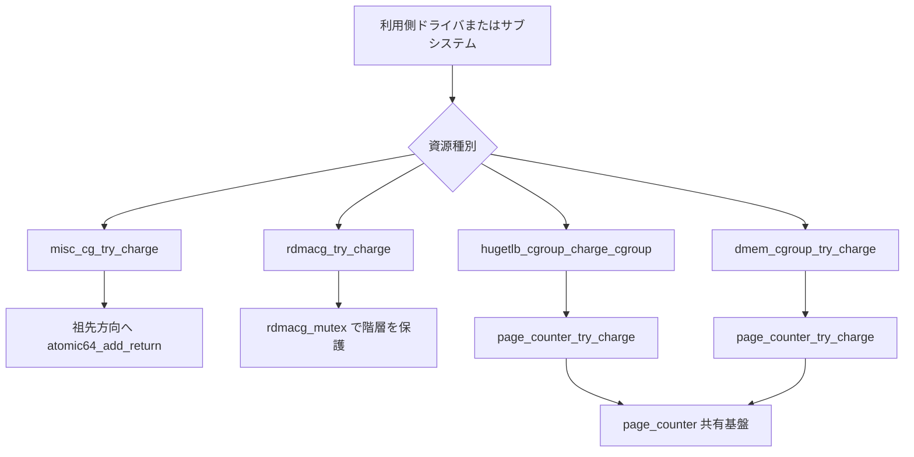

# 第23章 secondary controllers 概観

> **本章で読むソース**
>
> - [`include/linux/misc_cgroup.h` L42-L65](https://github.com/gregkh/linux/blob/v6.18.38/include/linux/misc_cgroup.h#L42-L65)
> - [`kernel/cgroup/misc.c` L152-L186](https://github.com/gregkh/linux/blob/v6.18.38/kernel/cgroup/misc.c#L152-L186)
> - [`kernel/cgroup/misc.c` L473-L478](https://github.com/gregkh/linux/blob/v6.18.38/kernel/cgroup/misc.c#L473-L478)
> - [`kernel/cgroup/rdma.c` L54-L65](https://github.com/gregkh/linux/blob/v6.18.38/kernel/cgroup/rdma.c#L54-L65)
> - [`kernel/cgroup/rdma.c` L261-L306](https://github.com/gregkh/linux/blob/v6.18.38/kernel/cgroup/rdma.c#L261-L306)
> - [`kernel/cgroup/rdma.c` L606-L612](https://github.com/gregkh/linux/blob/v6.18.38/kernel/cgroup/rdma.c#L606-L612)
> - [`include/linux/hugetlb_cgroup.h` L35-L58](https://github.com/gregkh/linux/blob/v6.18.38/include/linux/hugetlb_cgroup.h#L35-L58)
> - [`mm/hugetlb_cgroup.c` L261-L302](https://github.com/gregkh/linux/blob/v6.18.38/mm/hugetlb_cgroup.c#L261-L302)
> - [`mm/hugetlb_cgroup.c` L922-L928](https://github.com/gregkh/linux/blob/v6.18.38/mm/hugetlb_cgroup.c#L922-L928)
> - [`kernel/cgroup/dmem.c` L21-L79](https://github.com/gregkh/linux/blob/v6.18.38/kernel/cgroup/dmem.c#L21-L79)
> - [`kernel/cgroup/dmem.c` L302-L352](https://github.com/gregkh/linux/blob/v6.18.38/kernel/cgroup/dmem.c#L302-L352)
> - [`kernel/cgroup/dmem.c` L652-L696](https://github.com/gregkh/linux/blob/v6.18.38/kernel/cgroup/dmem.c#L652-L696)
> - [`kernel/cgroup/dmem.c` L850-L887](https://github.com/gregkh/linux/blob/v6.18.38/kernel/cgroup/dmem.c#L850-L887)

## 共通規約

コード引用は [`gregkh/linux` の `v6.18.38`](https://github.com/gregkh/linux/tree/v6.18.38) に固定する。
行番号はローカル展開ソースと照合して確認し、成果物にはローカル絶対パスを書かない。

## この章の狙い

第18〜22章で読んだ cpu、memory、io、pids、cpuset に続き、**misc**、**rdma**、**hugetlb**、**dmem** の4コントローラを1章で俯瞰する。
charge 経路の同期方式と資源カウンタの差分を押さえ、分冊のスコープを閉じる。

## 前提

- [第12章 cgroup v2 階層と kernfs](../part02-cgroup-core/12-cgroup-hierarchy-kernfs.md)
- [第13章 css と cgroup_subsys のライフサイクル](../part02-cgroup-core/13-css-lifecycle.md)

## secondary controllers の共通形

4コントローラはいずれも `cgroup_subsys_state` を埋め込んだ独自構造体を持つ。
`css_alloc` と `css_free` を実装し、祖先方向へ辿る charge と uncharge 経路を持つ。
`struct cgroup_subsys` を静的に定義し、`include/linux/cgroup_subsys.h` の `SUBSYS()` マクロ経由で `cgroup_subsys[]` に登録される。

`DEFINE_CGROUP_SUBSYS` という名前のマクロは存在しない。
`SUBSYS(name)` を `cgroup_subsys.h` に並べ、`kernel/cgroup/cgroup.c` 側で定義を差し替えながら複数回インクルードするトリックで配列を生成する。

いずれも `can_fork` や `can_attach` を持たない。
fork や migration をブロックせず、利用側ドライバやサブシステムが明示的に charge API を呼ぶ。

`css_offline` を持つのは hugetlb、rdma、dmem の3つだけである。
misc は `css_alloc` と `css_free` のみで offline コールバックを持たない。

## misc コントローラ

misc は SEV、SEV-ES、TDX など静的に列挙された資源種別を `atomic64_t` で会計する。
`misc_res` は `max`、`watermark`、`usage`、`events`、`events_local` を1本ずつ持つ単純な形である。
`events` は祖先へ伝播する `misc.events`、`events_local` は当該 cgroup 限定の `misc.events.local` に対応する。

[`include/linux/misc_cgroup.h` L42-L65](https://github.com/gregkh/linux/blob/v6.18.38/include/linux/misc_cgroup.h#L42-L65)

```c
struct misc_res {
	u64 max;
	atomic64_t watermark;
	atomic64_t usage;
	atomic64_t events;
	atomic64_t events_local;
};

/**
 * struct misc_cg - Miscellaneous controller's cgroup structure.
 * @css: cgroup subsys state object.
 * @events_file: Handle for the misc resources events file.
 * @res: Array of misc resources usage in the cgroup.
 */
struct misc_cg {
	struct cgroup_subsys_state css;

	/* misc.events */
	struct cgroup_file events_file;
	/* misc.events.local */
	struct cgroup_file events_local_file;

	struct misc_res res[MISC_CG_RES_TYPES];
};
```

`misc_cg_try_charge` は祖先を `parent_misc` で辿り、各段で `atomic64_add_return` する。
`max` またはホスト全体の `misc_res_capacity` を超えたら `err_charge` へ飛び、途中まで加算した分を手書きでロールバックする。
第21章 pids コントローラの `pids_try_charge` と同型の構造である。

[`kernel/cgroup/misc.c` L152-L186](https://github.com/gregkh/linux/blob/v6.18.38/kernel/cgroup/misc.c#L152-L186)

```c
int misc_cg_try_charge(enum misc_res_type type, struct misc_cg *cg, u64 amount)
{
	struct misc_cg *i, *j;
	int ret;
	struct misc_res *res;
	u64 new_usage;

	if (!(valid_type(type) && cg && READ_ONCE(misc_res_capacity[type])))
		return -EINVAL;

	if (!amount)
		return 0;

	for (i = cg; i; i = parent_misc(i)) {
		res = &i->res[type];

		new_usage = atomic64_add_return(amount, &res->usage);
		if (new_usage > READ_ONCE(res->max) ||
		    new_usage > READ_ONCE(misc_res_capacity[type])) {
			ret = -EBUSY;
			goto err_charge;
		}
		misc_cg_update_watermark(res, new_usage);
	}
	return 0;

err_charge:
	misc_cg_event(type, i);

	for (j = cg; j != i; j = parent_misc(j))
		misc_cg_cancel_charge(type, j, amount);
	misc_cg_cancel_charge(type, i, amount);
	return ret;
}
```

interface は `misc.max`、`misc.current`、`misc.peak`、`misc.capacity`、`misc.events` などである。
資源種別ごとに1行ずつ出力する単純な形式である。

[`kernel/cgroup/misc.c` L473-L478](https://github.com/gregkh/linux/blob/v6.18.38/kernel/cgroup/misc.c#L473-L478)

```c
struct cgroup_subsys misc_cgrp_subsys = {
	.css_alloc = misc_cg_alloc,
	.css_free = misc_cg_free,
	.legacy_cftypes = misc_cg_files,
	.dfl_cftypes = misc_cg_files,
};
```

## rdma コントローラ

rdma は cgroup と RDMA デバイスの組ごとに `rdmacg_resource_pool` を持つ。
misc の単一カウンタ配列とは異なり、デバイス単位の動的プールが特徴である。

[`kernel/cgroup/rdma.c` L54-L65](https://github.com/gregkh/linux/blob/v6.18.38/kernel/cgroup/rdma.c#L54-L65)

```c
struct rdmacg_resource_pool {
	struct rdmacg_device	*device;
	struct rdmacg_resource	resources[RDMACG_RESOURCE_MAX];

	struct list_head	cg_node;
	struct list_head	dev_node;

	/* count active user tasks of this pool */
	u64			usage_sum;
	/* total number counts which are set to max */
	int			num_max_cnt;
};
```

`rdmacg_try_charge` は `rdmacg_mutex` で階層全体をロックしてから線形に charge する。
プールが無ければ `get_cg_rpool_locked` で動的に確保する。
失敗時は mutex を解放したうえで `rdmacg_uncharge_hierarchy` が再度取得して uncharge する。
misc の atomic 加算型とは別の、独立 mutex と動的 rpool 型である。

[`kernel/cgroup/rdma.c` L261-L306](https://github.com/gregkh/linux/blob/v6.18.38/kernel/cgroup/rdma.c#L261-L306)

```c
int rdmacg_try_charge(struct rdma_cgroup **rdmacg,
		      struct rdmacg_device *device,
		      enum rdmacg_resource_type index)
{
	struct rdma_cgroup *cg, *p;
	struct rdmacg_resource_pool *rpool;
	s64 new;
	int ret = 0;

	if (index >= RDMACG_RESOURCE_MAX)
		return -EINVAL;

	/*
	 * hold on to css, as cgroup can be removed but resource
	 * accounting happens on css.
	 */
	cg = get_current_rdmacg();

	mutex_lock(&rdmacg_mutex);
	for (p = cg; p; p = parent_rdmacg(p)) {
		rpool = get_cg_rpool_locked(p, device);
		if (IS_ERR(rpool)) {
			ret = PTR_ERR(rpool);
			goto err;
		} else {
			new = (s64)rpool->resources[index].usage + 1;
			if (new > rpool->resources[index].max) {
				ret = -EAGAIN;
				goto err;
			} else {
				rpool->resources[index].usage = new;
				rpool->usage_sum++;
			}
		}
	}
	mutex_unlock(&rdmacg_mutex);

	*rdmacg = cg;
	return 0;

err:
	mutex_unlock(&rdmacg_mutex);
	rdmacg_uncharge_hierarchy(cg, device, p, index);
	return ret;
}
```

`rdma.max` と `rdma.current` は nested-keyed 形式である。
各行は登録済みデバイス名で始まり、`hca_handle` と `hca_object` の値が並ぶ。
上限が無い資源は値の代わりに `max` と表示する。

[`kernel/cgroup/rdma.c` L606-L612](https://github.com/gregkh/linux/blob/v6.18.38/kernel/cgroup/rdma.c#L606-L612)

```c
struct cgroup_subsys rdma_cgrp_subsys = {
	.css_alloc	= rdmacg_css_alloc,
	.css_free	= rdmacg_css_free,
	.css_offline	= rdmacg_css_offline,
	.legacy_cftypes	= rdmacg_files,
	.dfl_cftypes	= rdmacg_files,
};
```

## hugetlb コントローラ

hugetlb は memory コントローラと同じ `struct page_counter` を使う。
`hugepage[]` と `rsvd_hugepage[]` の2本立てで、実利用と予約を別会計する。
制限単位は hstate ごとである。
`nodeinfo[]` は hstate 別 usage を NUMA node ごとに表示する統計であり、node 別 max を制御する単位ではない。

[`include/linux/hugetlb_cgroup.h` L35-L58](https://github.com/gregkh/linux/blob/v6.18.38/include/linux/hugetlb_cgroup.h#L35-L58)

```c
struct hugetlb_cgroup {
	struct cgroup_subsys_state css;

	/*
	 * the counter to account for hugepages from hugetlb.
	 */
	struct page_counter hugepage[HUGE_MAX_HSTATE];

	/*
	 * the counter to account for hugepage reservations from hugetlb.
	 */
	struct page_counter rsvd_hugepage[HUGE_MAX_HSTATE];

	atomic_long_t events[HUGE_MAX_HSTATE][HUGETLB_NR_MEMORY_EVENTS];
	atomic_long_t events_local[HUGE_MAX_HSTATE][HUGETLB_NR_MEMORY_EVENTS];

	/* Handle for "hugetlb.events" */
	struct cgroup_file events_file[HUGE_MAX_HSTATE];

	/* Handle for "hugetlb.events.local" */
	struct cgroup_file events_local_file[HUGE_MAX_HSTATE];

	struct hugetlb_cgroup_per_node *nodeinfo[];
};
```

内部 `__hugetlb_cgroup_charge_cgroup` は `page_counter_try_charge` を呼ぶだけである。
手書きロールバックループは不要で、page_counter 側が階層チェックとロールバックを内包する。
public wrapper `hugetlb_cgroup_charge_cgroup` は内部関数へ委譲する。

[`mm/hugetlb_cgroup.c` L261-L302](https://github.com/gregkh/linux/blob/v6.18.38/mm/hugetlb_cgroup.c#L261-L302)

```c
static int __hugetlb_cgroup_charge_cgroup(int idx, unsigned long nr_pages,
					  struct hugetlb_cgroup **ptr,
					  bool rsvd)
{
	int ret = 0;
	struct page_counter *counter;
	struct hugetlb_cgroup *h_cg = NULL;

	if (hugetlb_cgroup_disabled())
		goto done;
again:
	rcu_read_lock();
	h_cg = hugetlb_cgroup_from_task(current);
	if (!css_tryget(&h_cg->css)) {
		rcu_read_unlock();
		goto again;
	}
	rcu_read_unlock();

	if (!page_counter_try_charge(
		    __hugetlb_cgroup_counter_from_cgroup(h_cg, idx, rsvd),
		    nr_pages, &counter)) {
		ret = -ENOMEM;
		hugetlb_event(h_cg, idx, HUGETLB_MAX);
		css_put(&h_cg->css);
		goto done;
	}
	/* Reservations take a reference to the css because they do not get
	 * reparented.
	 */
	if (!rsvd)
		css_put(&h_cg->css);
done:
	*ptr = h_cg;
	return ret;
}

int hugetlb_cgroup_charge_cgroup(int idx, unsigned long nr_pages,
				 struct hugetlb_cgroup **ptr)
{
	return __hugetlb_cgroup_charge_cgroup(idx, nr_pages, ptr, false);
}
```

interface は `hugetlb.<size>.max`、`rsvd.max`、`current`、`numa_stat` などを hstate ごとに動的生成する。

[`mm/hugetlb_cgroup.c` L922-L928](https://github.com/gregkh/linux/blob/v6.18.38/mm/hugetlb_cgroup.c#L922-L928)

```c
struct cgroup_subsys hugetlb_cgrp_subsys = {
	.css_alloc	= hugetlb_cgroup_css_alloc,
	.css_offline	= hugetlb_cgroup_css_offline,
	.css_free	= hugetlb_cgroup_css_free,
	.dfl_cftypes	= hugetlb_files,
	.legacy_cftypes	= hugetlb_files,
};
```

## dmem コントローラ

dmem は GPU ドライバ等が `dmem_cgroup_register_region` で動的登録するデバイスメモリ領域を会計する。
v6.18.38 の時点で既に存在し、7.1.3 での新設ではない。

[`kernel/cgroup/dmem.c` L21-L79](https://github.com/gregkh/linux/blob/v6.18.38/kernel/cgroup/dmem.c#L21-L79)

```c
struct dmem_cgroup_region {
	/**
	 * @ref: References keeping the region alive.
	 * Keeps the region reference alive after a succesful RCU lookup.
	 */
	struct kref ref;

	/** @rcu: RCU head for freeing */
	struct rcu_head rcu;

	/**
	 * @region_node: Linked into &dmem_cgroup_regions list.
	 * Protected by RCU and global spinlock.
	 */
	struct list_head region_node;

	/**
	 * @pools: List of pools linked to this region.
	 * Protected by global spinlock only
	 */
	struct list_head pools;

	/** @size: Size of region, in bytes */
	u64 size;

	/** @name: Name describing the node, set by dmem_cgroup_register_region */
	char *name;

	/**
	 * @unregistered: Whether the region is unregistered by its caller.
	 * No new pools should be added to the region afterwards.
	 */
	bool unregistered;
};

struct dmemcg_state {
	struct cgroup_subsys_state css;

	struct list_head pools;
};

struct dmem_cgroup_pool_state {
	struct dmem_cgroup_region *region;
	struct dmemcg_state *cs;

	/* css node, RCU protected against region teardown */
	struct list_head	css_node;

	/* dev node, no RCU protection required */
	struct list_head	region_node;

	struct rcu_head rcu;

	struct page_counter cnt;
	struct dmem_cgroup_pool_state *parent;

	refcount_t ref;
	bool inited;
};
```

`dmem_cgroup_try_charge` は `page_counter_try_charge` で階層的な max のみを直接判定する。
失敗時に `ret_limit_pool` へ上限に達したプールを返し、利用側が eviction の起点に使える。

`min` と `low` は `dmem_cgroup_calculate_protection` が `page_counter_calculate_protection` で `emin` と `elow` を計算する。
eviction 候補判定 API `dmem_cgroup_state_evict_valuable` がこれを読む。
dmem core 自身が reclaim するのではなく、GPU の TTM 等の利用側ドライバが追い出し可否を判断する。
第19章 memory コントローラの `memory.min` と `memory.low` と同じ保護意味論である。

[`kernel/cgroup/dmem.c` L302-L352](https://github.com/gregkh/linux/blob/v6.18.38/kernel/cgroup/dmem.c#L302-L352)

```c
bool dmem_cgroup_state_evict_valuable(struct dmem_cgroup_pool_state *limit_pool,
				      struct dmem_cgroup_pool_state *test_pool,
				      bool ignore_low, bool *ret_hit_low)
{
	struct dmem_cgroup_pool_state *pool = test_pool;
	struct page_counter *ctest;
	u64 used, min, low;

	/* Can always evict from current pool, despite limits */
	if (limit_pool == test_pool)
		return true;

	if (limit_pool) {
		if (!parent_dmemcs(limit_pool->cs))
			return true;

		for (pool = test_pool; pool && limit_pool != pool; pool = pool_parent(pool))
			{}

		if (!pool)
			return false;
	} else {
		/*
		 * If there is no cgroup limiting memory usage, use the root
		 * cgroup instead for limit calculations.
		 */
		for (limit_pool = test_pool; pool_parent(limit_pool); limit_pool = pool_parent(limit_pool))
			{}
	}

	ctest = &test_pool->cnt;

	dmem_cgroup_calculate_protection(limit_pool, test_pool);

	used = page_counter_read(ctest);
	min = READ_ONCE(ctest->emin);

	if (used <= min)
		return false;

	if (!ignore_low) {
		low = READ_ONCE(ctest->elow);
		if (used > low)
			return true;

		*ret_hit_low = true;
		return false;
	}
	return true;
}
```

[`kernel/cgroup/dmem.c` L652-L696](https://github.com/gregkh/linux/blob/v6.18.38/kernel/cgroup/dmem.c#L652-L696)

```c
int dmem_cgroup_try_charge(struct dmem_cgroup_region *region, u64 size,
			  struct dmem_cgroup_pool_state **ret_pool,
			  struct dmem_cgroup_pool_state **ret_limit_pool)
{
	struct dmemcg_state *cg;
	struct dmem_cgroup_pool_state *pool;
	struct page_counter *fail;
	int ret;

	*ret_pool = NULL;
	if (ret_limit_pool)
		*ret_limit_pool = NULL;

	/*
	 * hold on to css, as cgroup can be removed but resource
	 * accounting happens on css.
	 */
	cg = get_current_dmemcs();

	pool = get_cg_pool_unlocked(cg, region);
	if (IS_ERR(pool)) {
		ret = PTR_ERR(pool);
		goto err;
	}

	if (!page_counter_try_charge(&pool->cnt, size, &fail)) {
		if (ret_limit_pool) {
			*ret_limit_pool = container_of(fail, struct dmem_cgroup_pool_state, cnt);
			css_get(&(*ret_limit_pool)->cs->css);
			dmemcg_pool_get(*ret_limit_pool);
		}
		dmemcg_pool_put(pool);
		ret = -EAGAIN;
		goto err;
	}

	/* On success, reference from get_current_dmemcs is transferred to *ret_pool */
	*ret_pool = pool;
	return 0;

err:
	css_put(&cg->css);
	return ret;
}
```

`dmem.capacity`、`dmem.current`、`dmem.min`、`dmem.low`、`dmem.max` は region 名でキー付けした複数行形式である。
rdma と同様に動的登録された region 名が行頭に出力される。

[`kernel/cgroup/dmem.c` L850-L887](https://github.com/gregkh/linux/blob/v6.18.38/kernel/cgroup/dmem.c#L850-L887)

```c
static struct cftype files[] = {
	{
		.name = "capacity",
		.seq_show = dmem_cgroup_region_capacity_show,
		.flags = CFTYPE_ONLY_ON_ROOT,
	},
	{
		.name = "current",
		.seq_show = dmem_cgroup_region_current_show,
	},
	{
		.name = "min",
		.write = dmem_cgroup_region_min_write,
		.seq_show = dmem_cgroup_region_min_show,
		.flags = CFTYPE_NOT_ON_ROOT,
	},
	{
		.name = "low",
		.write = dmem_cgroup_region_low_write,
		.seq_show = dmem_cgroup_region_low_show,
		.flags = CFTYPE_NOT_ON_ROOT,
	},
	{
		.name = "max",
		.write = dmem_cgroup_region_max_write,
		.seq_show = dmem_cgroup_region_max_show,
		.flags = CFTYPE_NOT_ON_ROOT,
	},
	{ } /* Zero entry terminates. */
};

struct cgroup_subsys dmem_cgrp_subsys = {
	.css_alloc	= dmemcs_alloc,
	.css_free	= dmemcs_free,
	.css_offline	= dmemcs_offline,
	.legacy_cftypes	= files,
	.dfl_cftypes	= files,
};
```

## 4コントローラの比較

| 軸 | misc | rdma | hugetlb | dmem |
|---|---|---|---|---|
| 資源カウンタ | 独自 `atomic64_t` | 独自 `int`、mutex 保護 | `page_counter` | `page_counter` |
| 同期方式 | atomic 加算と手書き rollback | グローバル mutex と動的 rpool | page_counter 内部 | page_counter と登録用 spinlock |
| 資源の単位 | 静的列挙 | デバイスと資源種別 | hstate ごと | ドライバ動的登録 region |
| 保護意味論 | max のみ | max のみ | max と rsvd 別会計 | max は charge 時、min/low は eviction 判定時 |
| css_offline | なし | あり | あり | あり |

会計方式は3系統に分類できる。
misc は第21章 pids に近い atomic 加算と手書き rollback 型である。
rdma は独立 mutex と動的プール型である。
hugetlb と dmem は第19章 memory と同じ page_counter 型の派生である。

## 処理フロー



dmem は charge 失敗時に `dmem_cgroup_state_evict_valuable` へ進む eviction 経路が別に存在する。
memory コントローラの reclaim とは担当が異なる。

## 高速化と最適化の工夫

**page_counter 共有基盤の再利用**が hugetlb と dmem の設計上の工夫である。

memory コントローラが確立した `page_counter_try_charge` は階層的 max チェックと失敗時ロールバックを内包する。
hugetlb と dmem はこれをそのまま使い、コントローラ固有の手書き rollback ループを省略できる。

misc は資源種別が少なく atomic で十分なため page_counter を使わない。
rdma はデバイスごとの動的プール管理が必要で、グローバル mutex 下の `int` 更新を選んでいる。
トレードオフは「汎用 page_counter の階層会計」と「デバイス単位プールの柔軟性」にある。

> **7.x 系での変化**
> misc、rdma、hugetlb、dmem の4ファイルは v6.18.38 から v7.1.3 へ charge、limit、protection の会計ロジックに機能差はない。
> 主差分は `kzalloc(sizeof(*x), ...)` から `kzalloc_obj(*x)` への型安全アロケーション API 移行である。
> 例として [`kernel/cgroup/misc.c` L448 付近](https://github.com/gregkh/linux/blob/v7.1.3/kernel/cgroup/misc.c#L448)、[`kernel/cgroup/rdma.c` L137 付近](https://github.com/gregkh/linux/blob/v7.1.3/kernel/cgroup/rdma.c#L137)、[`mm/hugetlb_cgroup.c` L149 付近](https://github.com/gregkh/linux/blob/v7.1.3/mm/hugetlb_cgroup.c#L149) で `kzalloc_flex` 等に置き換わる。
> dmem は 6.18.38 で既に存在し、7.x で新設されたわけではない。
> 加えて rdma の `pr_warn` 引数順修正や hugetlb の `snprintf` から `scnprintf` への変更など、非会計ロジックの整理が含まれる。

## まとめ

secondary controllers は css 埋め込みと `SUBSYS()` 登録という共通形を持ち、charge 実装は3系統に分かれる。
misc は atomic と手書き rollback、rdma は mutex と動的 rpool、hugetlb と dmem は page_counter である。
rdma と dmem の interface は nested-keyed 形式で動的登録名をキーにする。
dmem の min/low 保護と `dmem_cgroup_state_evict_valuable` は利用側ドライバ主導の eviction 判定である。

## 関連する章

- [第17章 rstat と per-CPU 統計集約](../part02-cgroup-core/17-rstat.md)
- [第19章 memory コントローラと memcg 境界](19-memory-controller.md)
- [第21章 pids コントローラ](21-pids-controller.md)
- [第22章 cpuset コントローラ](22-cpuset-controller.md)
