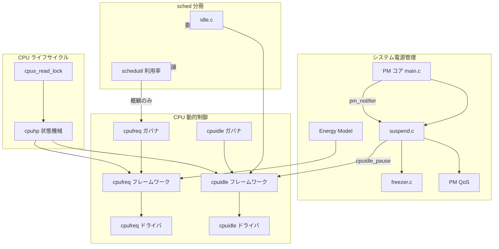

# 第1章 電源管理と CPU ライフサイクルの全体像

> **本章で読むソース**
>
> - [`include/linux/suspend.h` L34-L41](https://github.com/gregkh/linux/blob/v6.18.38/include/linux/suspend.h#L34-L41)
> - [`kernel/power/suspend.c` L37-L48](https://github.com/gregkh/linux/blob/v6.18.38/kernel/power/suspend.c#L37-L48)
> - [`include/linux/cpufreq.h` L343-L361](https://github.com/gregkh/linux/blob/v6.18.38/include/linux/cpufreq.h#L343-L361)
> - [`include/linux/cpuidle.h` L152-L168](https://github.com/gregkh/linux/blob/v6.18.38/include/linux/cpuidle.h#L152-L168)
> - [`include/linux/cpuhotplug.h` L57-L77](https://github.com/gregkh/linux/blob/v6.18.38/include/linux/cpuhotplug.h#L57-L77)
> - [`include/linux/pm_qos.h` L41-L44](https://github.com/gregkh/linux/blob/v6.18.38/include/linux/pm_qos.h#L41-L44)
> - [`kernel/power/power.h` L341-L351](https://github.com/gregkh/linux/blob/v6.18.38/kernel/power/power.h#L341-L351)
> - [`kernel/power/suspend.c` L50](https://github.com/gregkh/linux/blob/v6.18.38/kernel/power/suspend.c#L50)
> - [`kernel/power/main.c` L757-L762](https://github.com/gregkh/linux/blob/v6.18.38/kernel/power/main.c#L757-L762)
> - [`include/linux/suspend.h` L435-L441](https://github.com/gregkh/linux/blob/v6.18.38/include/linux/suspend.h#L435-L441)

## この章の狙い

本分冊が扱う**システム電源管理**、**cpufreq**、**cpuidle**、**CPU hotplug** の四領域が、カーネル内部でどう接続されているかを地図として押さえる。
以降の章で個別機構を読む前提として、状態の粒度と責務の境界を示す。

## 前提

- [全体像と横断基盤](../../foundation/README.md) のソースツリー地図とシステムコール入口
- [プロセスとスケジューラ](../../sched/README.md) の `task_struct` と idle スレッドの概観

## 二つの時間スケール

電源管理と CPU ライフサイクルは、時間スケールの異なる二層に分かれる。

**システム全体のサスペンド**は、RAM 上の状態を保ったまま CPU と周辺デバイスを止める。
**CPU 単位の動的制御**は、稼働中に周波数と idle 状態を切り替え、消費電力を抑える。

前者は `kernel/power/` が主導し、後者は `drivers/cpufreq/` と `drivers/cpuidle/` が担う。
CPU のオンラインとオフラインは `kernel/cpu.c` の hotplug 状態機械が、上記サブシステムの登録解除と再登録を順序付ける。

## システムサスペンド状態

`suspend_state_t` は `__bitwise` 注釈付きの状態型として定義される。
`__bitwise` は sparse が通常の整数演算と混同しないよう付ける型検査用の注釈であり、ビットフラグの結合型ではない。
`PM_SUSPEND_*` は 0 から 3 までの離散した状態値である。

[`include/linux/suspend.h` L34-L41](https://github.com/gregkh/linux/blob/v6.18.38/include/linux/suspend.h#L34-L41)

```c
typedef int __bitwise suspend_state_t;

#define PM_SUSPEND_ON		((__force suspend_state_t) 0)
#define PM_SUSPEND_TO_IDLE	((__force suspend_state_t) 1)
#define PM_SUSPEND_STANDBY	((__force suspend_state_t) 2)
#define PM_SUSPEND_MEM		((__force suspend_state_t) 3)
#define PM_SUSPEND_MIN		PM_SUSPEND_TO_IDLE
#define PM_SUSPEND_MAX		((__force suspend_state_t) 4)
```

`PM_SUSPEND_ON` は通常稼働を表す。
`PM_SUSPEND_TO_IDLE` は s2idle と呼ばれ、凍結済みプロセスとサスペンド済みデバイスのまま CPU を idle に入る。
このとき CPU は cpuidle が提供する対応範囲の idle state に入り、特定の浅い状態に限定されない。
`PM_SUSPEND_STANDBY` と `PM_SUSPEND_MEM` は深いサスペンド経路に入りうる内部状態である。
とくに `PM_SUSPEND_MEM` は二次 CPU offline と `suspend_ops->enter` を伴う Suspend to RAM に相当する。

sysfs の表示名は `pm_labels` と `mem_sleep_labels` の二系統で管理される。

[`kernel/power/suspend.c` L37-L48](https://github.com/gregkh/linux/blob/v6.18.38/kernel/power/suspend.c#L37-L48)

```c
const char * const pm_labels[] = {
	[PM_SUSPEND_TO_IDLE] = "freeze",
	[PM_SUSPEND_STANDBY] = "standby",
	[PM_SUSPEND_MEM] = "mem",
};
const char *pm_states[PM_SUSPEND_MAX];
static const char * const mem_sleep_labels[] = {
	[PM_SUSPEND_TO_IDLE] = "s2idle",
	[PM_SUSPEND_STANDBY] = "shallow",
	[PM_SUSPEND_MEM] = "deep",
};
const char *mem_sleep_states[PM_SUSPEND_MAX];
```

`/sys/power/state` に書く文字列（`freeze` 等）と、カーネルログに出るラベル（`s2idle` 等）は別配列を参照する点に注意する。
`/sys/power/state` への `mem` は入力ラベルであり、内部状態 `PM_SUSPEND_MEM` と同一視してはならない。
`state_store` は `mem` を `mem_sleep_current` で実際の `suspend_state_t` に置き換えてから `pm_suspend` を呼ぶ。

[`kernel/power/main.c` L757-L762](https://github.com/gregkh/linux/blob/v6.18.38/kernel/power/main.c#L757-L762)

```c
	state = decode_state(buf, n);
	if (state < PM_SUSPEND_MAX) {
		if (state == PM_SUSPEND_MEM)
			state = mem_sleep_current;

		error = pm_suspend(state);
```

`mem_sleep_current` は `/sys/power/mem_sleep` で `s2idle`、`shallow`、`deep` のいずれかに設定される。
既定値は `PM_SUSPEND_TO_IDLE`（s2idle）である。

[`kernel/power/suspend.c` L50](https://github.com/gregkh/linux/blob/v6.18.38/kernel/power/suspend.c#L50)

```c
suspend_state_t mem_sleep_current = PM_SUSPEND_TO_IDLE;
```

## cpufreq の三層構造

cpufreq は**ドライバ**、**フレームワーク**、**ガバナ**の三層で構成される。

ドライバはハードウェアに周波数を設定する `cpufreq_driver` を登録する。
フレームワークは policy ごとに CPU 集合を束ね、遷移の直列化と通知を担う。
ガバナは負荷に応じて目標周波数を決め、フレームワーク経由でドライバを呼ぶ。

ドライバが実装する主要コールバックは次のとおりである。

[`include/linux/cpufreq.h` L343-L361](https://github.com/gregkh/linux/blob/v6.18.38/include/linux/cpufreq.h#L343-L361)

```c
struct cpufreq_driver {
	char		name[CPUFREQ_NAME_LEN];
	u16		flags;
	void		*driver_data;

	/* needed by all drivers */
	int		(*init)(struct cpufreq_policy *policy);
	int		(*verify)(struct cpufreq_policy_data *policy);

	/* define one out of two */
	int		(*setpolicy)(struct cpufreq_policy *policy);

	int		(*target)(struct cpufreq_policy *policy,
				  unsigned int target_freq,
				  unsigned int relation);	/* Deprecated */
	int		(*target_index)(struct cpufreq_policy *policy,
					unsigned int index);
	unsigned int	(*fast_switch)(struct cpufreq_policy *policy,
				       unsigned int target_freq);
```

`fast_switch` はスケジューラコンテキストから IRQ を塞がずに周波数だけを変える経路である。
`schedutil` ガバナの実装は `kernel/sched/cpufreq_schedutil.c` にあり、スケジューラ側の利用率計算は [プロセスとスケジューラ](../../sched/README.md) に委譲する。

## cpuidle のドライバとガバナ

cpuidle は CPU が実行可能タスクを持たないとき、ハードウェアの低消費電力状態へ入る経路を提供する。

[`include/linux/cpuidle.h` L152-L168](https://github.com/gregkh/linux/blob/v6.18.38/include/linux/cpuidle.h#L152-L168)

```c
struct cpuidle_driver {
	const char		*name;
	struct module 		*owner;

        /* used by the cpuidle framework to setup the broadcast timer */
	unsigned int            bctimer:1;
	/* states array must be ordered in decreasing power consumption */
	struct cpuidle_state	states[CPUIDLE_STATE_MAX];
	int			state_count;
	int			safe_state_index;

	/* the driver handles the cpus in cpumask */
	struct cpumask		*cpumask;

	/* preferred governor to switch at register time */
	const char		*governor;
};
```

`states` 配列は消費電力の大きい順に並べることがコメントで要求される。
ガバナ（`menu`、`teo` 等）は次に入る状態の index を選び、`cpuidle_enter` がドライバの `enter` を呼ぶ。

idle スレッドから cpuidle フレームワークへの入口は `kernel/sched/idle.c` の `cpuidle_idle_call` である。
tick 停止と NO_HZ の詳細は [割り込みと時間](../../irq-time/README.md) に委譲する。

## CPU hotplug 状態機械

CPU hotplug は `enum cpuhp_state` で定義された段階的コールバック列を、bringup 時は昇順、takedown 時は降順に実行する。

[`include/linux/cpuhotplug.h` L57-L77](https://github.com/gregkh/linux/blob/v6.18.38/include/linux/cpuhotplug.h#L57-L77)

```c
enum cpuhp_state {
	CPUHP_INVALID = -1,

	/* PREPARE section invoked on a control CPU */
	CPUHP_OFFLINE = 0,
	CPUHP_CREATE_THREADS,
	CPUHP_PERF_X86_PREPARE,
	CPUHP_PERF_X86_AMD_UNCORE_PREP,
	CPUHP_PERF_POWER,
	CPUHP_PERF_SUPERH,
	CPUHP_X86_HPET_DEAD,
	CPUHP_X86_MCE_DEAD,
	CPUHP_VIRT_NET_DEAD,
	CPUHP_IBMVNIC_DEAD,
	CPUHP_SLUB_DEAD,
	CPUHP_DEBUG_OBJ_DEAD,
	CPUHP_MM_WRITEBACK_DEAD,
	CPUHP_MM_VMSTAT_DEAD,
	CPUHP_SOFTIRQ_DEAD,
	CPUHP_NET_MVNETA_DEAD,
	CPUHP_CPUIDLE_DEAD,
```

`CPUHP_CPUIDLE_DEAD` のように cpuidle や cpufreq ドライバ向けの DEAD 状態が列挙に挿入される。
hotplug 中のタスク migration と load balance は sched 分冊の領域であり、本分冊では `cpuhp` の状態遷移と `cpus_read_lock` に焦点を当てる。

## PM QoS と Energy Model

**PM QoS** は複数の要求者が出す制約を集約し、有効な目標値を返す仕組みである。

[`include/linux/pm_qos.h` L41-L44](https://github.com/gregkh/linux/blob/v6.18.38/include/linux/pm_qos.h#L41-L44)

```c
enum pm_qos_type {
	PM_QOS_UNITIALIZED,
	PM_QOS_MAX,		/* return the largest value */
	PM_QOS_MIN,		/* return the smallest value */
```

`PM_QOS_MAX` は要求の最大値を、`PM_QOS_MIN` は最小値を採用する。
CPU レイテンシ制約は cpuidle の状態選択に、周波数制約は cpufreq の上限と下限に効く。

**Energy Model** は CPU 性能状態ごとの消費電力テーブルを登録し、スケジューラの容量計算と連携する。
実装は `kernel/power/energy_model.c` にあり、cpufreq の効率テーブル更新と接続される。

## サスペンドと cpuidle の接続

システムサスペンドの深い段階では、二次 CPU を止める前に cpuidle を一時停止する。

[`kernel/power/power.h` L341-L351](https://github.com/gregkh/linux/blob/v6.18.38/kernel/power/power.h#L341-L351)

```c
static inline int pm_sleep_disable_secondary_cpus(void)
{
	cpuidle_pause();
	return suspend_disable_secondary_cpus();
}

static inline void pm_sleep_enable_secondary_cpus(void)
{
	suspend_enable_secondary_cpus();
	cpuidle_resume();
}
```

`cpuidle_pause` により idle 入口での状態遷移を止めてから CPU offline を進める。
復帰時は `cpuidle_resume` で idle 経路を再開する。

## PM 通知チェーン

システムサスペンドとハイバネートの前後では、`pm_notifier` 経由でサブシステムへイベントが配信される。

[`include/linux/suspend.h` L435-L441](https://github.com/gregkh/linux/blob/v6.18.38/include/linux/suspend.h#L435-L441)

```c
/* Hibernation and suspend events */
#define PM_HIBERNATION_PREPARE	0x0001 /* Going to hibernate */
#define PM_POST_HIBERNATION	0x0002 /* Hibernation finished */
#define PM_SUSPEND_PREPARE	0x0003 /* Going to suspend the system */
#define PM_POST_SUSPEND		0x0004 /* Suspend finished */
#define PM_RESTORE_PREPARE	0x0005 /* Going to restore a saved image */
#define PM_POST_RESTORE		0x0006 /* Restore failed */
```

ドライバやファイルシステムは `PM_SUSPEND_PREPARE` で事前処理を行い、失敗時は `PM_POST_SUSPEND` で巻き戻す。
第2章で `pm_notifier_call_chain_robust` の呼び出し順序を追う。

## 本分冊の地図

次の図は、本章で述べた機構の依存関係を示す。
矢印は「呼び出す」「登録する」「遷移の前提となる」のいずれかを表す。



**最適化の工夫**：cpufreq の `fast_switch` と cpuidle の浅い状態選択は、いずれもスケジューラの wake-up レイテンシを守るための経路である。
システムサスペンドは逆にタスクとデバイスを止めてから CPU を offline にするため、時間スケールと直列化の単位が異なる。

## 部構成との対応

| 部 | 章 | 主なソース |
|---|---|---|
| 第0部 | 1〜2 | 本章、`kernel/power/main.c` |
| 第1部 | 3〜8 | `kernel/power/`、`kernel/freezer.c` |
| 第2部 | 9〜12 | `drivers/cpufreq/` コアとガバナ |
| 第3部 | 13〜15 | `drivers/cpuidle/`、`kernel/sched/idle.c` |
| 第4部 | 16〜17 | `kernel/cpu.c` |

## まとめ

本分冊は、システム全体の睡眠遷移、CPU 周波数と idle の動的制御、CPU hotplug の三軸をソースから追う。
`PM_SUSPEND_TO_IDLE` は二次 CPU を offline にせず cpuidle 経由で idle に入る。
sysfs の入力ラベル `mem` は `mem_sleep_current` に従い s2idle・shallow・deep のいずれにも対応し、内部状態 `PM_SUSPEND_MEM` だけが二次 CPU offline と `suspend_ops->enter` を伴う深い経路である。
cpufreq と cpuidle はそれぞれドライバとガバナの二層で拡張され、hotplug 状態機械がライフサイクルを順序付ける。

## 関連する章

- 次章：[PM サブシステムコアと遷移ロック](02-pm-core-transition.md)
- [プロセスとスケジューラ](../../sched/part01-core/09-schedule-context-switch.md) の `__schedule` と idle 経路
- [割り込みと時間](../../irq-time/part03-tick/18-no-hz.md) の NO_HZ
