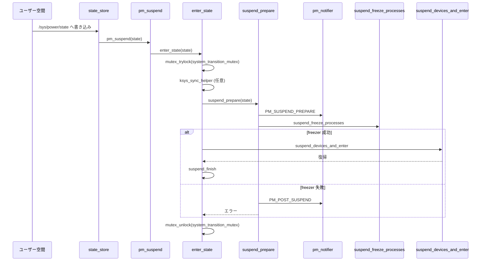

# 第2章 PM サブシステムコアと遷移ロック

> **本章で読むソース**
>
> - [`kernel/reboot.c` L718](https://github.com/gregkh/linux/blob/v6.18.38/kernel/reboot.c#L718)
> - [`kernel/power/main.c` L65-L80](https://github.com/gregkh/linux/blob/v6.18.38/kernel/power/main.c#L65-L80)
> - [`kernel/power/main.c` L97-L123](https://github.com/gregkh/linux/blob/v6.18.38/kernel/power/main.c#L97-L123)
> - [`include/linux/suspend.h` L435-L441](https://github.com/gregkh/linux/blob/v6.18.38/include/linux/suspend.h#L435-L441)
> - [`kernel/power/main.c` L742-L772](https://github.com/gregkh/linux/blob/v6.18.38/kernel/power/main.c#L742-L772)
> - [`kernel/power/suspend.c` L569-L616](https://github.com/gregkh/linux/blob/v6.18.38/kernel/power/suspend.c#L569-L616)
> - [`kernel/power/suspend.c` L365-L391](https://github.com/gregkh/linux/blob/v6.18.38/kernel/power/suspend.c#L365-L391)
> - [`kernel/power/suspend.c` L625-L637](https://github.com/gregkh/linux/blob/v6.18.38/kernel/power/suspend.c#L625-L637)

## この章の狙い

システム睡眠遷移を直列化する **`system_transition_mutex`** と、ユーザー空間からサスペンドを起動する **`pm_suspend`** 入口を追う。
`pm_notifier` チェーンがいつ呼ばれ、失敗時にどう巻き戻されるかを押さえる。

## 前提

- [第1章 電源管理と CPU ライフサイクルの全体像](01-power-cpu-overview.md) のサスペンド状態一覧
- [全体像と横断基盤](../../foundation/README.md) の sysfs と kobject 基盤

## system_transition_mutex の位置づけ

`system_transition_mutex` は再起動、電源オフ、サスペンド、ハイバネートなど、システム全体の状態遷移を相互に排他するミューテックスである。
定義は `kernel/reboot.c` に置かれ、`include/linux/suspend.h` から extern 宣言される。

[`kernel/reboot.c` L718](https://github.com/gregkh/linux/blob/v6.18.38/kernel/reboot.c#L718)

```c
DEFINE_MUTEX(system_transition_mutex);
```

`kernel/power/main.c` の `pm_restrict_gfp_mask` や `pm_restore_gfp_mask` は、この mutex を保持している間だけ `gfp_allowed_mask` を変更する。
コメントが述べるとおり、サスペンド中のメモリ割り当てから `__GFP_IO` と `__GFP_FS` を外し、デバイスサスペンドとレースしないようにする。

## lock_system_sleep と PF_NOFREEZE

ドライバや sysfs ハンドラが遷移中であることを示すため、`lock_system_sleep` が提供される。

[`kernel/power/main.c` L65-L80](https://github.com/gregkh/linux/blob/v6.18.38/kernel/power/main.c#L65-L80)

```c
unsigned int lock_system_sleep(void)
{
	unsigned int flags = current->flags;
	current->flags |= PF_NOFREEZE;
	mutex_lock(&system_transition_mutex);
	return flags;
}
EXPORT_SYMBOL_GPL(lock_system_sleep);

void unlock_system_sleep(unsigned int flags)
{
	if (!(flags & PF_NOFREEZE))
		current->flags &= ~PF_NOFREEZE;
	mutex_unlock(&system_transition_mutex);
}
EXPORT_SYMBOL_GPL(unlock_system_sleep);
```

`PF_NOFREEZE` を立てるのは、サスペンド処理自体を実行するスレッドが freezer に巻き込まれないようにするためである。
第3章で述べる `pm_freezing` とは独立した、呼び出し元スレッド向けの保護である。

**最適化の工夫**：遷移 mutex を一箇所に集約することで、並行する `/sys/power/state` 書き込みと再起動シーケンスの競合を排除する。
`mutex_trylock` による非ブロッキング失敗（`enter_state` 内）と、ブロッキング取得（`lock_system_sleep`）を用途で使い分ける。

## pm_notifier チェーン

PM サブシステムは `blocking_notifier_head` で登録されたコールバック列を持つ。

[`kernel/power/main.c` L97-L123](https://github.com/gregkh/linux/blob/v6.18.38/kernel/power/main.c#L97-L123)

```c
static BLOCKING_NOTIFIER_HEAD(pm_chain_head);

int register_pm_notifier(struct notifier_block *nb)
{
	return blocking_notifier_chain_register(&pm_chain_head, nb);
}
EXPORT_SYMBOL_GPL(register_pm_notifier);

int unregister_pm_notifier(struct notifier_block *nb)
{
	return blocking_notifier_chain_unregister(&pm_chain_head, nb);
}
EXPORT_SYMBOL_GPL(unregister_pm_notifier);

int pm_notifier_call_chain_robust(unsigned long val_up, unsigned long val_down)
{
	int ret;

	ret = blocking_notifier_call_chain_robust(&pm_chain_head, val_up, val_down, NULL);

	return notifier_to_errno(ret);
}

int pm_notifier_call_chain(unsigned long val)
{
	return blocking_notifier_call_chain(&pm_chain_head, val, NULL);
}
```

`pm_notifier_call_chain_robust` は、準備イベント（`val_up`）の失敗時に自動で巻き戻しイベント（`val_down`）を配信する。
サスペンド準備で `PM_SUSPEND_PREPARE` が失敗した場合に `PM_POST_SUSPEND` を送る経路で使われる。

イベント定数は次のとおりである。

[`include/linux/suspend.h` L435-L441](https://github.com/gregkh/linux/blob/v6.18.38/include/linux/suspend.h#L435-L441)

```c
/* Hibernation and suspend events */
#define PM_HIBERNATION_PREPARE	0x0001 /* Going to hibernate */
#define PM_POST_HIBERNATION	0x0002 /* Hibernation finished */
#define PM_SUSPEND_PREPARE	0x0003 /* Going to suspend the system */
#define PM_POST_SUSPEND		0x0004 /* Suspend finished */
#define PM_RESTORE_PREPARE	0x0005 /* Going to restore a saved image */
#define PM_POST_RESTORE		0x0006 /* Restore failed */
```

## sysfs から pm_suspend への入口

ユーザー空間は `/sys/power/state` に状態名を書き込むことでサスペンドを要求する。
`state_store` は autosleep ロックを取ったうえで文字列を解釈し、`pm_suspend` または `hibernate` を呼ぶ。

[`kernel/power/main.c` L742-L772](https://github.com/gregkh/linux/blob/v6.18.38/kernel/power/main.c#L742-L772)

```c
static ssize_t state_store(struct kobject *kobj, struct kobj_attribute *attr,
			   const char *buf, size_t n)
{
	suspend_state_t state;
	int error;

	error = pm_autosleep_lock();
	if (error)
		return error;

	if (pm_autosleep_state() > PM_SUSPEND_ON) {
		error = -EBUSY;
		goto out;
	}

	state = decode_state(buf, n);
	if (state < PM_SUSPEND_MAX) {
		if (state == PM_SUSPEND_MEM)
			state = mem_sleep_current;

		error = pm_suspend(state);
	} else if (state == PM_SUSPEND_MAX) {
		error = hibernate();
	} else {
		error = -EINVAL;
	}

 out:
	pm_autosleep_unlock();
	return error ? error : n;
}
```

`PM_SUSPEND_MEM` が指定されたときは `mem_sleep_current` に置き換える。
`/sys/power/mem_sleep` で選んだ deep か shallow かが、実際に入る睡眠の深さを決める。

## pm_suspend と enter_state

`pm_suspend` は引数検証と統計更新を行い、本体処理を `enter_state` に委譲する。

[`kernel/power/suspend.c` L625-L637](https://github.com/gregkh/linux/blob/v6.18.38/kernel/power/suspend.c#L625-L637)

```c
int pm_suspend(suspend_state_t state)
{
	int error;

	if (state <= PM_SUSPEND_ON || state >= PM_SUSPEND_MAX)
		return -EINVAL;

	pr_info("suspend entry (%s)\n", mem_sleep_labels[state]);
	error = enter_state(state);
	dpm_save_errno(error);
	pr_info("suspend exit\n");
	return error;
}
```

`enter_state` が遷移 mutex の取得、ファイルシステム同期、準備、デバイスサスペンドを順に実行する。

[`kernel/power/suspend.c` L569-L616](https://github.com/gregkh/linux/blob/v6.18.38/kernel/power/suspend.c#L569-L616)

```c
static int enter_state(suspend_state_t state)
{
	int error;

	trace_suspend_resume(TPS("suspend_enter"), state, true);
	if (state == PM_SUSPEND_TO_IDLE) {
#ifdef CONFIG_PM_DEBUG
		if (pm_test_level != TEST_NONE && pm_test_level <= TEST_CPUS) {
			pr_warn("Unsupported test mode for suspend to idle, please choose none/freezer/devices/platform.\n");
			return -EAGAIN;
		}
#endif
	} else if (!valid_state(state)) {
		return -EINVAL;
	}
	if (!mutex_trylock(&system_transition_mutex))
		return -EBUSY;

	if (state == PM_SUSPEND_TO_IDLE)
		s2idle_begin();

	if (sync_on_suspend_enabled) {
		trace_suspend_resume(TPS("sync_filesystems"), 0, true);
		ksys_sync_helper();
		trace_suspend_resume(TPS("sync_filesystems"), 0, false);
	}

	pm_pr_dbg("Preparing system for sleep (%s)\n", mem_sleep_labels[state]);
	pm_suspend_clear_flags();
	error = suspend_prepare(state);
	if (error)
		goto Unlock;

	if (suspend_test(TEST_FREEZER))
		goto Finish;

	trace_suspend_resume(TPS("suspend_enter"), state, false);
	pm_pr_dbg("Suspending system (%s)\n", mem_sleep_labels[state]);
	error = suspend_devices_and_enter(state);

 Finish:
	events_check_enabled = false;
	pm_pr_dbg("Finishing wakeup.\n");
	suspend_finish();
 Unlock:
	mutex_unlock(&system_transition_mutex);
	return error;
}
```

`mutex_trylock` が失敗すると `-EBUSY` を返し、二重サスペンドを防ぐ。
`s2idle_begin` は `PM_SUSPEND_TO_IDLE` 専用の待ち合わせキューを初期化する。

## suspend_prepare での notifier と freezer

`suspend_prepare` は全サスペンド状態で共通の準備処理である。
notifier、ファイルシステムフリーズ、プロセス freezer をこの順で呼ぶ。

[`kernel/power/suspend.c` L365-L391](https://github.com/gregkh/linux/blob/v6.18.38/kernel/power/suspend.c#L365-L391)

```c
static int suspend_prepare(suspend_state_t state)
{
	int error;

	if (!sleep_state_supported(state))
		return -EPERM;

	pm_prepare_console();

	error = pm_notifier_call_chain_robust(PM_SUSPEND_PREPARE, PM_POST_SUSPEND);
	if (error)
		goto Restore;

	filesystems_freeze(filesystem_freeze_enabled);
	trace_suspend_resume(TPS("freeze_processes"), 0, true);
	error = suspend_freeze_processes();
	trace_suspend_resume(TPS("freeze_processes"), 0, false);
	if (!error)
		return 0;

	dpm_save_failed_step(SUSPEND_FREEZE);
	filesystems_thaw();
	pm_notifier_call_chain(PM_POST_SUSPEND);
 Restore:
	pm_restore_console();
	return error;
}
```

freezer が失敗すると `SUSPEND_FREEZE` ステップとして統計に記録され、ファイルシステムを thaw してから `PM_POST_SUSPEND` で notifier を巻き戻す。
第3章で `suspend_freeze_processes` の中身を読む。

## サスペンド遷移の流れ



## 7.x 系での変化

v7.1.3 では `enter_state` 内のファイルシステム同期が `ksys_sync_helper` から `pm_sleep_fs_sync` に置き換わり、エラー時に `Unlock` へ分岐する。

[`kernel/power/suspend.c` L597-L604](https://github.com/gregkh/linux/blob/v7.1.3/kernel/power/suspend.c#L597-L604)

```c
	if (sync_on_suspend_enabled) {
		trace_suspend_resume(TPS("sync_filesystems"), 0, true);

		error = pm_sleep_fs_sync();
		if (error)
			goto Unlock;

		trace_suspend_resume(TPS("sync_filesystems"), 0, false);
	}
```

`pm_suspend` 本体の引数検証と `enter_state` 委譲の形は v6.18.38 と同様である。

## まとめ

`system_transition_mutex` は再起動とサスペンドを含むシステム遷移全体を直列化する。
`pm_suspend` は `enter_state` 経由で mutex を取得し、`suspend_prepare` で notifier と freezer を実行してからデバイスサスペンドへ進む。
`pm_notifier_call_chain_robust` は準備失敗時の巻き戻し通知を保証する。

## 関連する章

- 前章：[電源管理と CPU ライフサイクルの全体像](01-power-cpu-overview.md)
- 次章：[Freezer とタスク停止](../part01-system-pm/03-freezer-task-freeze.md)
- [第4章 Suspend to RAM と s2idle](../part01-system-pm/04-suspend-s2idle.md) の `suspend_devices_and_enter`
