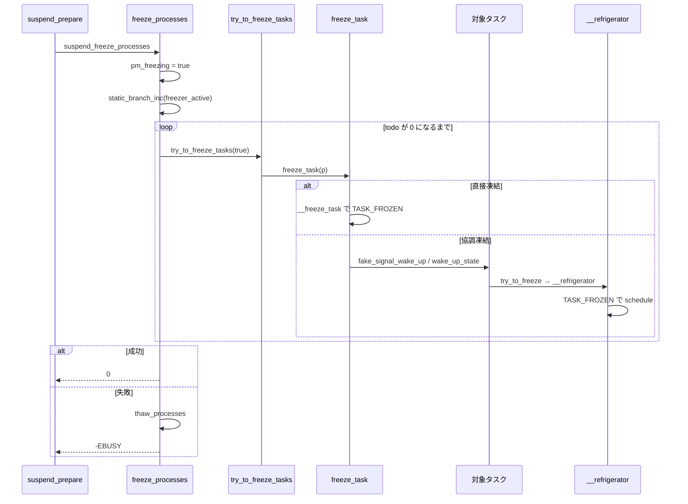

# 第3章 Freezer とタスク停止

> **本章で読むソース**
>
> - [`kernel/power/process.c` L28-L82](https://github.com/gregkh/linux/blob/v6.18.38/kernel/power/process.c#L28-L82)
> - [`kernel/power/process.c` L121-L155](https://github.com/gregkh/linux/blob/v6.18.38/kernel/power/process.c#L121-L155)
> - [`kernel/freezer.c` L16-L28](https://github.com/gregkh/linux/blob/v6.18.38/kernel/freezer.c#L16-L28)
> - [`kernel/freezer.c` L39-L55](https://github.com/gregkh/linux/blob/v6.18.38/kernel/freezer.c#L39-L55)
> - [`include/linux/freezer.h` L34-L40](https://github.com/gregkh/linux/blob/v6.18.38/include/linux/freezer.h#L34-L40)
> - [`include/linux/freezer.h` L52-L60](https://github.com/gregkh/linux/blob/v6.18.38/include/linux/freezer.h#L52-L60)
> - [`kernel/freezer.c` L147-L181](https://github.com/gregkh/linux/blob/v6.18.38/kernel/freezer.c#L147-L181)
> - [`kernel/freezer.c` L63-L96](https://github.com/gregkh/linux/blob/v6.18.38/kernel/freezer.c#L63-L96)
> - [`include/linux/sched.h` L122-L124](https://github.com/gregkh/linux/blob/v6.18.38/include/linux/sched.h#L122-L124)

## この章の狙い

システムサスペンド前にユーザー空間タスクを止める **`freeze_processes`** と、個々のタスクが待機に入る **`__refrigerator`** の連携を追う。
`pm_freezing` フラグと `freezer_active` 静的キーが、ホットパスでの判定コストをどう抑えるかを押さえる。

## 前提

- [第2章 PM サブシステムコアと遷移ロック](../part00-foundation/02-pm-core-transition.md) の `suspend_prepare` と `system_transition_mutex`
- [プロセスとスケジューラ](../../sched/part00-process/01-task-struct.md) のタスク状態ビット

## freeze_processes の全体像

`suspend_prepare` は `suspend_freeze_processes` マクロ経由で `freeze_processes` を呼ぶ。
`freeze_processes` は usermode helper を止め、`pm_freezing` を立て、全プロセスに凍結要求を送る。

[`kernel/power/process.c` L121-L155](https://github.com/gregkh/linux/blob/v6.18.38/kernel/power/process.c#L121-L155)

```c
int freeze_processes(void)
{
	int error;

	error = __usermodehelper_disable(UMH_FREEZING);
	if (error)
		return error;

	/* Make sure this task doesn't get frozen */
	current->flags |= PF_SUSPEND_TASK;

	if (!pm_freezing)
		static_branch_inc(&freezer_active);

	pm_wakeup_clear(0);
	pm_freezing = true;
	error = try_to_freeze_tasks(true);
	if (!error)
		__usermodehelper_set_disable_depth(UMH_DISABLED);

	BUG_ON(in_atomic());

	/*
	 * Now that the whole userspace is frozen we need to disable
	 * the OOM killer to disallow any further interference with
	 * killable tasks. There is no guarantee oom victims will
	 * ever reach a point they go away we have to wait with a timeout.
	 */
	if (!error && !oom_killer_disable(msecs_to_jiffies(freeze_timeout_msecs)))
		error = -EBUSY;

	if (error)
		thaw_processes();
	return error;
}
```

呼び出し元スレッドには `PF_SUSPEND_TASK` を立て、自身が refrigerator に入らないようにする。
`freeze_processes` がエラーを返すときは、関数内部の `thaw_processes` 呼び出しでユーザー空間タスクはすでに解凍済みである。
呼び出し元が後続で `thaw_processes` 相当の解凍を担うのは、凍結が成功したあとの復帰経路（`suspend_finish` の `suspend_thaw_processes` 等）だけである。

cgroup freezer は [namespace と cgroup](../../ns-cgroup/README.md) の領域であり、本章では `pm_freezing` によるシステム全体の凍結に限定する。

## try_to_freeze_tasks のポーリングループ

`try_to_freeze_tasks` はタスクリストを走査し、まだ凍結していないタスクに `freeze_task` を送る。
完了するまで指数バックオフ付きでスリープし、タイムアウトまたは wake-up イベントで打ち切る。

[`kernel/power/process.c` L28-L82](https://github.com/gregkh/linux/blob/v6.18.38/kernel/power/process.c#L28-L82)

```c
static int try_to_freeze_tasks(bool user_only)
{
	const char *what = user_only ? "user space processes" :
					"remaining freezable tasks";
	struct task_struct *g, *p;
	unsigned long end_time;
	unsigned int todo;
	bool wq_busy = false;
	ktime_t start, end, elapsed;
	unsigned int elapsed_msecs;
	bool wakeup = false;
	int sleep_usecs = USEC_PER_MSEC;

	pr_info("Freezing %s\n", what);

	start = ktime_get_boottime();

	end_time = jiffies + msecs_to_jiffies(freeze_timeout_msecs);

	if (!user_only)
		freeze_workqueues_begin();

	while (true) {
		todo = 0;
		read_lock(&tasklist_lock);
		for_each_process_thread(g, p) {
			if (p == current || !freeze_task(p))
				continue;

			todo++;
		}
		read_unlock(&tasklist_lock);

		if (!user_only) {
			wq_busy = freeze_workqueues_busy();
			todo += wq_busy;
		}

		if (!todo || time_after(jiffies, end_time))
			break;

		if (pm_wakeup_pending()) {
			wakeup = true;
			break;
		}

		/*
		 * We need to retry, but first give the freezing tasks some
		 * time to enter the refrigerator.  Start with an initial
		 * 1 ms sleep followed by exponential backoff until 8 ms.
		 */
		usleep_range(sleep_usecs / 2, sleep_usecs);
		if (sleep_usecs < 8 * USEC_PER_MSEC)
			sleep_usecs *= 2;
	}
```

`freeze_task` が `true` を返すのは、凍結対象だがまだ `TASK_FROZEN` に入っておらず、協調的な凍結待ちが残っている場合である。
`false` を返すのは、凍結対象外、すでに凍結済み、または `__freeze_task` が `saved_state` を保存して直接 `TASK_FROZEN` にした場合である。
`todo` が 0 になるまでループするが、デフォルト 20 秒でタイムアウトする。

**最適化の工夫**：`freezer_active` 静的キーにより、通常時の `freezing()` 判定は fast path で即 `false` を返す。
サスペンド時だけ `static_branch_inc` し、slow path の `freezing_slow_path` を有効化する。

## pm_freezing と freezer_lock

凍結要求のグローバル状態は `kernel/freezer.c` で管理される。

[`kernel/freezer.c` L16-L28](https://github.com/gregkh/linux/blob/v6.18.38/kernel/freezer.c#L16-L28)

```c
/* total number of freezing conditions in effect */
DEFINE_STATIC_KEY_FALSE(freezer_active);
EXPORT_SYMBOL(freezer_active);

/*
 * indicate whether PM freezing is in effect, protected by
 * system_transition_mutex
 */
bool pm_freezing;
bool pm_nosig_freezing;

/* protects freezing and frozen transitions */
static DEFINE_SPINLOCK(freezer_lock);
```

`pm_freezing` はユーザー空間プロセス向け、`pm_nosig_freezing` はカーネルスレッド向けの凍結フェーズで使われる。
`freezer_lock` は `__state` への `TASK_FROZEN` 書き込みと `freezing()` 判定の整合を守る。

## freezing の fast path と slow path

[`include/linux/freezer.h` L34-L40](https://github.com/gregkh/linux/blob/v6.18.38/include/linux/freezer.h#L34-L40)

```c
static inline bool freezing(struct task_struct *p)
{
	if (static_branch_unlikely(&freezer_active))
		return freezing_slow_path(p);

	return false;
}
```

slow path では、除外フラグと cgroup 凍結を確認したうえで `pm_freezing` を評価する。

[`kernel/freezer.c` L39-L55](https://github.com/gregkh/linux/blob/v6.18.38/kernel/freezer.c#L39-L55)

```c
bool freezing_slow_path(struct task_struct *p)
{
	if (p->flags & (PF_NOFREEZE | PF_SUSPEND_TASK))
		return false;

	if (tsk_is_oom_victim(p))
		return false;

	if (pm_nosig_freezing || cgroup_freezing(p))
		return true;

	if (pm_freezing && !(p->flags & PF_KTHREAD))
		return true;

	return false;
}
```

`PF_KTHREAD` を持つタスクは `pm_freezing` だけでは凍結されない。
カーネルスレッドの凍結は `freeze_kernel_threads` が `pm_nosig_freezing` を立ててから `try_to_freeze_tasks(false)` を呼ぶ段階で行われる。

## freeze_task の二経路

凍結要求は、タスクの状態によって直接 `TASK_FROZEN` に書き換えるか、wake-up を送って協調的に `__refrigerator` へ入れさせるかの二経路に分かれる。

[`include/linux/sched.h` L122-L124](https://github.com/gregkh/linux/blob/v6.18.38/include/linux/sched.h#L122-L124)

```c
#define TASK_FREEZABLE			0x00002000
#define __TASK_FREEZABLE_UNSAFE	       (0x00004000 * IS_ENABLED(CONFIG_LOCKDEP))
#define TASK_FROZEN			0x00008000
```

`freeze_task` はまず `__freeze_task` を試みる。
`TASK_FREEZABLE`、`__TASK_STOPPED`、`__TASK_TRACED` のいずれかでスリープ中のタスクは、`saved_state` を保存したうえで直接 `TASK_FROZEN` にできる。
この場合は `false` を返し、wake-up も `__refrigerator` への誘導も不要である。

[`kernel/freezer.c` L147-L181](https://github.com/gregkh/linux/blob/v6.18.38/kernel/freezer.c#L147-L181)

```c
static bool __freeze_task(struct task_struct *p)
{
	/* TASK_FREEZABLE|TASK_STOPPED|TASK_TRACED -> TASK_FROZEN */
	return task_call_func(p, __set_task_frozen, NULL);
}

/**
 * freeze_task - send a freeze request to given task
 * @p: task to send the request to
 *
 * If @p is freezing, the freeze request is sent either by sending a fake
 * signal (if it's not a kernel thread) or waking it up (if it's a kernel
 * thread).
 *
 * RETURNS:
 * %false, if @p is not freezing or already frozen; %true, otherwise
 */
bool freeze_task(struct task_struct *p)
{
	unsigned long flags;

	spin_lock_irqsave(&freezer_lock, flags);
	if (!freezing(p) || frozen(p) || __freeze_task(p)) {
		spin_unlock_irqrestore(&freezer_lock, flags);
		return false;
	}

	if (!(p->flags & PF_KTHREAD))
		fake_signal_wake_up(p);
	else
		wake_up_state(p, TASK_NORMAL);

	spin_unlock_irqrestore(&freezer_lock, flags);
	return true;
}
```

直接凍結できないタスクには、ユーザー空間タスクへ偽シグナル、カーネルスレッドへ `wake_up_state` を送る。
タスクは実行を再開して `try_to_freeze` から `__refrigerator` に入り、そこで `TASK_FROZEN` になる。
この協調経路では `freeze_task` は `true` を返し、`try_to_freeze_tasks` の `todo` に残る。

## __refrigerator と try_to_freeze

タスク側はスリープ可能な地点で `try_to_freeze` を呼ぶ。

[`include/linux/freezer.h` L52-L60](https://github.com/gregkh/linux/blob/v6.18.38/include/linux/freezer.h#L52-L60)

```c
static inline bool try_to_freeze(void)
{
	might_sleep();
	if (likely(!freezing(current)))
		return false;
	if (!(current->flags & PF_NOFREEZE))
		debug_check_no_locks_held();
	return __refrigerator(false);
}
```

`__refrigerator` は `TASK_FROZEN` を設定したうえで、凍結条件が解けるまで `schedule` を繰り返す。

[`kernel/freezer.c` L63-L96](https://github.com/gregkh/linux/blob/v6.18.38/kernel/freezer.c#L63-L96)

```c
bool __refrigerator(bool check_kthr_stop)
{
	unsigned int state = get_current_state();
	bool was_frozen = false;

	pr_debug("%s entered refrigerator\n", current->comm);

	WARN_ON_ONCE(state && !(state & TASK_NORMAL));

	for (;;) {
		bool freeze;

		raw_spin_lock_irq(&current->pi_lock);
		WRITE_ONCE(current->__state, TASK_FROZEN);
		/* unstale saved_state so that __thaw_task() will wake us up */
		current->saved_state = TASK_RUNNING;
		raw_spin_unlock_irq(&current->pi_lock);

		spin_lock_irq(&freezer_lock);
		freeze = freezing(current) && !(check_kthr_stop && kthread_should_stop());
		spin_unlock_irq(&freezer_lock);

		if (!freeze)
			break;

		was_frozen = true;
		schedule();
	}
	__set_current_state(TASK_RUNNING);

	pr_debug("%s left refrigerator\n", current->comm);

	return was_frozen;
}
```

ループを抜ける条件は `freezing(current)` が偽になることである。
`thaw_processes` が `pm_freezing` を下ろし `__thaw_task` で wake-up すると、タスクは `TASK_RUNNING` に戻る。

## 凍結から解凍までの流れ



## thaw_processes による巻き戻し

`freeze_processes` 失敗時の解凍は関数内部で完了する。
サスペンド復帰時には `suspend_finish` 経由で `suspend_thaw_processes` が `thaw_processes` を呼び、`pm_freezing` を下ろして全スレッドに `__thaw_task` を送る。
`static_branch_dec` で `freezer_active` を無効化し、通常の `freezing()` fast path に戻す。
本章では入口の `freeze_processes` までを扱い、復帰側のデバイス再開は第4章以降で追う。

## まとめ

`freeze_processes` は `pm_freezing` と `freezer_active` を有効化し、全ユーザー空間タスクが `TASK_FROZEN` に入るまでポーリングする。
`freeze_task` は直接 `TASK_FROZEN` 化と、wake-up による協調的 `__refrigerator` 誘導の二経路を持つ。
`freezer_active` 静的キーにより、サスペンド以外の経路では凍結判定のコストをほぼゼロに保つ。

## 関連する章

- 前章：[PM サブシステムコアと遷移ロック](../part00-foundation/02-pm-core-transition.md)
- 次章：[Suspend to RAM と s2idle](04-suspend-s2idle.md)
- [プロセスとスケジューラ](../../sched/part01-core/10-try-to-wake-up.md) の wake-up 経路
