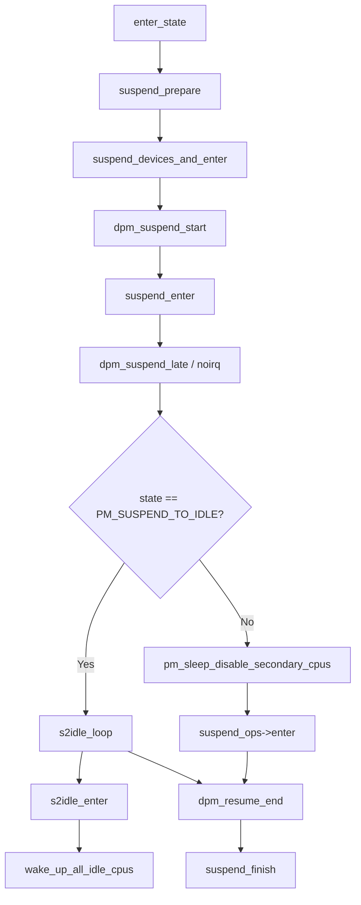

# 第4章 Suspend to RAM と s2idle

> **本章で読むソース**
>
> - [`kernel/power/suspend.c` L133-L161](https://github.com/gregkh/linux/blob/v6.18.38/kernel/power/suspend.c#L133-L161)
> - [`kernel/power/suspend.c` L91-L131](https://github.com/gregkh/linux/blob/v6.18.38/kernel/power/suspend.c#L91-L131)
> - [`kernel/power/suspend.c` L497-L531](https://github.com/gregkh/linux/blob/v6.18.38/kernel/power/suspend.c#L497-L531)
> - [`kernel/power/suspend.c` L412-L444](https://github.com/gregkh/linux/blob/v6.18.38/kernel/power/suspend.c#L412-L444)
> - [`kernel/power/suspend.c` L446-L468](https://github.com/gregkh/linux/blob/v6.18.38/kernel/power/suspend.c#L446-L468)
> - [`kernel/power/suspend.c` L569-L616](https://github.com/gregkh/linux/blob/v6.18.38/kernel/power/suspend.c#L569-L616)
> - [`kernel/power/suspend.c` L553-L559](https://github.com/gregkh/linux/blob/v6.18.38/kernel/power/suspend.c#L553-L559)

## この章の狙い

`enter_state` から `suspend_devices_and_enter` を経て、**Suspend to RAM**（`PM_SUSPEND_MEM`）と **s2idle**（`PM_SUSPEND_TO_IDLE`）が分岐する地点を追う。
s2idle が二次 CPU を止めずに idle ループへ入る仕組みと、深いサスペンドが `suspend_ops->enter` を呼ぶ経路の違いを押さえる。

## 前提

- [第2章 PM サブシステムコアと遷移ロック](../part00-foundation/02-pm-core-transition.md) の `enter_state` と `suspend_prepare`
- [第3章 Freezer とタスク停止](03-freezer-task-freeze.md) の `freeze_processes`

## enter_state からデバイスサスペンドへ

`enter_state` は mutex 取得と `suspend_prepare`（notifier と freezer）の後、`suspend_devices_and_enter` を呼ぶ。

[`kernel/power/suspend.c` L569-L616](https://github.com/gregkh/linux/blob/v6.18.38/kernel/power/suspend.c#L569-L616)

```c
static int enter_state(suspend_state_t state)
{
	int error;

	trace_suspend_resume(TPS("suspend_enter"), state, true);
	if (state == PM_SUSPEND_TO_IDLE) {
#ifdef CONFIG_PM_DEBUG
		if (pm_test_level != TEST_NONE && pm_test_level <= TEST_CPUS) {
			pr_warn("Unsupported test mode for suspend to idle, please choose none/freezer/devices/platform.\n");
			return -EAGAIN;
		}
#endif
	} else if (!valid_state(state)) {
		return -EINVAL;
	}
	if (!mutex_trylock(&system_transition_mutex))
		return -EBUSY;

	if (state == PM_SUSPEND_TO_IDLE)
		s2idle_begin();

	if (sync_on_suspend_enabled) {
		trace_suspend_resume(TPS("sync_filesystems"), 0, true);
		ksys_sync_helper();
		trace_suspend_resume(TPS("sync_filesystems"), 0, false);
	}

	pm_pr_dbg("Preparing system for sleep (%s)\n", mem_sleep_labels[state]);
	pm_suspend_clear_flags();
	error = suspend_prepare(state);
	if (error)
		goto Unlock;

	if (suspend_test(TEST_FREEZER))
		goto Finish;

	trace_suspend_resume(TPS("suspend_enter"), state, false);
	pm_pr_dbg("Suspending system (%s)\n", mem_sleep_labels[state]);
	error = suspend_devices_and_enter(state);

 Finish:
	events_check_enabled = false;
	pm_pr_dbg("Finishing wakeup.\n");
	suspend_finish();
 Unlock:
	mutex_unlock(&system_transition_mutex);
	return error;
}
```

`s2idle_begin` は s2idle 状態変数を初期化するだけである。
深いサスペンドと s2idle の本質的な分岐は、その後の `suspend_enter` 内で起きる。

## suspend_devices_and_enter の骨格

デバイスドライバのサスペンドは `dpm_suspend_start` で始まり、`suspend_enter` でプラットフォーム睡眠に入る。
復帰時は `dpm_resume_end` と `console_resume_all` で巻き戻す。

[`kernel/power/suspend.c` L497-L531](https://github.com/gregkh/linux/blob/v6.18.38/kernel/power/suspend.c#L497-L531)

```c
int suspend_devices_and_enter(suspend_state_t state)
{
	int error;
	bool wakeup = false;

	if (!sleep_state_supported(state))
		return -ENOSYS;

	pm_suspend_target_state = state;

	if (state == PM_SUSPEND_TO_IDLE)
		pm_set_suspend_no_platform();

	error = platform_suspend_begin(state);
	if (error)
		goto Close;

	console_suspend_all();
	suspend_test_start();
	error = dpm_suspend_start(PMSG_SUSPEND);
	if (error) {
		pr_err("Some devices failed to suspend, or early wake event detected\n");
		goto Recover_platform;
	}
	suspend_test_finish("suspend devices");
	if (suspend_test(TEST_DEVICES))
		goto Recover_platform;

	do {
		error = suspend_enter(state, &wakeup);
	} while (!error && !wakeup && platform_suspend_again(state));

 Resume_devices:
	suspend_test_start();
	dpm_resume_end(PMSG_RESUME);
```

`PM_SUSPEND_TO_IDLE` のとき `pm_set_suspend_no_platform` が呼ばれ、ファームウェアの深い睡眠経路を使わないことを示す。
`platform_suspend_again` ループは、プラットフォームが「もう一度睡眠せよ」と指示した場合に `suspend_enter` を繰り返す。

## suspend_enter における s2idle 分岐

デバイスサスペンドの後段（late と noirq）を通過したあと、状態によって睡眠の入り方が変わる。

[`kernel/power/suspend.c` L412-L444](https://github.com/gregkh/linux/blob/v6.18.38/kernel/power/suspend.c#L412-L444)

```c
static int suspend_enter(suspend_state_t state, bool *wakeup)
{
	int error;

	error = platform_suspend_prepare(state);
	if (error)
		goto Platform_finish;

	error = dpm_suspend_late(PMSG_SUSPEND);
	if (error) {
		pr_err("late suspend of devices failed\n");
		goto Platform_finish;
	}
	error = platform_suspend_prepare_late(state);
	if (error)
		goto Devices_early_resume;

	error = dpm_suspend_noirq(PMSG_SUSPEND);
	if (error) {
		pr_err("noirq suspend of devices failed\n");
		goto Platform_early_resume;
	}
	error = platform_suspend_prepare_noirq(state);
	if (error)
		goto Platform_wake;

	if (suspend_test(TEST_PLATFORM))
		goto Platform_wake;

	if (state == PM_SUSPEND_TO_IDLE) {
		s2idle_loop();
		goto Platform_wake;
	}
```

s2idle は二次 CPU offline も `suspend_ops->enter` も行わない。
コメントが述べる三要素（凍結プロセス、サスペンド済みデバイス、idle プロセッサ）のうち、最後を `s2idle_loop` が担う。

## Suspend to RAM の深い経路

`PM_SUSPEND_MEM` 等では `s2idle_loop` を飛ばし、二次 CPU 停止と IRQ 無効化のあと `suspend_ops->enter` を呼ぶ。

[`kernel/power/suspend.c` L446-L468](https://github.com/gregkh/linux/blob/v6.18.38/kernel/power/suspend.c#L446-L468)

```c
	error = pm_sleep_disable_secondary_cpus();
	if (error || suspend_test(TEST_CPUS))
		goto Enable_cpus;

	arch_suspend_disable_irqs();
	BUG_ON(!irqs_disabled());

	system_state = SYSTEM_SUSPEND;

	error = syscore_suspend();
	if (!error) {
		*wakeup = pm_wakeup_pending();
		if (!(suspend_test(TEST_CORE) || *wakeup)) {
			trace_suspend_resume(TPS("machine_suspend"),
				state, true);
			error = suspend_ops->enter(state);
			trace_suspend_resume(TPS("machine_suspend"),
				state, false);
		} else if (*wakeup) {
			error = -EBUSY;
		}
		syscore_resume();
	}
```

`pm_sleep_disable_secondary_cpus` は第1章で触れたとおり `cpuidle_pause` を含む。
wake-up イベントが pending なら `suspend_ops->enter` を呼ばず `-EBUSY` で戻る。

## s2idle_loop と s2idle_enter

`s2idle_loop` は wake-up が来るまで `s2idle_enter` を繰り返す。

[`kernel/power/suspend.c` L133-L161](https://github.com/gregkh/linux/blob/v6.18.38/kernel/power/suspend.c#L133-L161)

```c
static void s2idle_loop(void)
{
	pm_pr_dbg("suspend-to-idle\n");

	/*
	 * Suspend-to-idle equals:
	 * frozen processes + suspended devices + idle processors.
	 * Thus s2idle_enter() should be called right after all devices have
	 * been suspended.
	 *
	 * Wakeups during the noirq suspend of devices may be spurious, so try
	 * to avoid them upfront.
	 */
	for (;;) {
		if (s2idle_ops && s2idle_ops->wake) {
			if (s2idle_ops->wake())
				break;
		} else if (pm_wakeup_pending()) {
			break;
		}

		if (s2idle_ops && s2idle_ops->check)
			s2idle_ops->check();

		s2idle_enter();
	}

	pm_pr_dbg("resume from suspend-to-idle\n");
}
```

`s2idle_enter` は全 CPU を idle ループへ押し込み、制御 CPU 自身も `swait_event` で待つ。

[`kernel/power/suspend.c` L91-L131](https://github.com/gregkh/linux/blob/v6.18.38/kernel/power/suspend.c#L91-L131)

```c
static void s2idle_enter(void)
{
	trace_suspend_resume(TPS("machine_suspend"), PM_SUSPEND_TO_IDLE, true);

	/*
	 * The correctness of the code below depends on the number of online
	 * CPUs being stable, but CPUs cannot be taken offline or put online
	 * while it is running.
	 *
	 * The s2idle_lock must be acquired before the pending wakeup check to
	 * prevent pm_system_wakeup() from running as a whole between that check
	 * and the subsequent s2idle_state update in which case a wakeup event
	 * would get lost.
	 */
	raw_spin_lock_irq(&s2idle_lock);
	if (pm_wakeup_pending())
		goto out;

	s2idle_state = S2IDLE_STATE_ENTER;
	raw_spin_unlock_irq(&s2idle_lock);

	/* Push all the CPUs into the idle loop. */
	wake_up_all_idle_cpus();
	/* Make the current CPU wait so it can enter the idle loop too. */
	swait_event_exclusive(s2idle_wait_head,
		    s2idle_state == S2IDLE_STATE_WAKE);

	/*
	 * Kick all CPUs to ensure that they resume their timers and restore
	 * consistent system state.
	 */
	wake_up_all_idle_cpus();

	raw_spin_lock_irq(&s2idle_lock);

 out:
	s2idle_state = S2IDLE_STATE_NONE;
	raw_spin_unlock_irq(&s2idle_lock);

	trace_suspend_resume(TPS("machine_suspend"), PM_SUSPEND_TO_IDLE, false);
}
```

**最適化の工夫**：s2idle は `suspend_ops->enter` による platform suspend、二次 CPU offline、`syscore_suspend` を省略し、既存の CPU idle 経路で待つ。
cpuidle が選ぶ idle state の深さはガバナとプラットフォーム設定に依存し、s2idle 専用に浅い状態へ限定されない。
復帰レイテンシは Suspend to RAM より短い一方、消費電力は深いサスペンドより大きい場合がある。

## 復帰後の suspend_finish

`enter_state` の `Finish` ラベルから `suspend_finish` が呼ばれ、プロセス解凍と notifier 巻き戻しが行われる。

[`kernel/power/suspend.c` L553-L559](https://github.com/gregkh/linux/blob/v6.18.38/kernel/power/suspend.c#L553-L559)

```c
static void suspend_finish(void)
{
	suspend_thaw_processes();
	filesystems_thaw();
	pm_notifier_call_chain(PM_POST_SUSPEND);
	pm_restore_console();
}
```

ハイバネート経路ではこの関数は呼ばれない（コメント参照）。

## サスペンド遷移の流れ



## 7.x 系での変化

v7.1.3 では `enter_state` 内のファイルシステム同期が `ksys_sync_helper` から `pm_sleep_fs_sync` に変わり、失敗時に `Unlock` へ分岐する（第2章参照）。
`suspend_test` は `mdelay` 一括待ちから 1 秒刻みのループに変わり、待機中の wake-up を検出できる。

## まとめ

`suspend_devices_and_enter` がデバイスサスペンドの枠組みを提供し、`suspend_enter` が s2idle と深いサスペンドに分岐する。
s2idle は `s2idle_loop` と `s2idle_enter` で全 CPU を idle 経路へ進め、platform suspend と二次 CPU offline を省略する。
深い Suspend to RAM は二次 CPU 停止のあと `suspend_ops->enter` でプラットフォーム睡眠に入る。

## 関連する章

- 前章：[Freezer とタスク停止](03-freezer-task-freeze.md)
- 次章：[Hibernate の遷移とユーザー空間 IF](05-hibernate-transition.md)
- [第4部 cpuidle](../part04-cpuidle/19-sched-idle-cpuidle.md) の idle 入口
