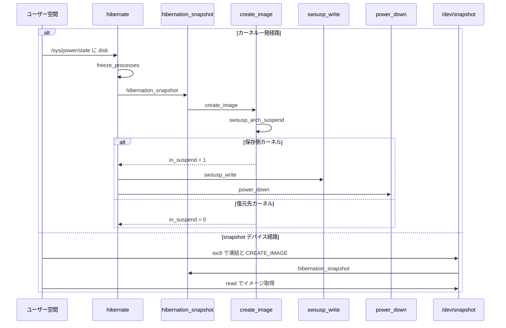

# 第5章 Hibernate の遷移とユーザー空間 IF

> **本章で読むソース**
>
> - [`kernel/power/hibernate.c` L788-L834](https://github.com/gregkh/linux/blob/v6.18.38/kernel/power/hibernate.c#L788-L834)
> - [`kernel/power/hibernate.c` L836-L876](https://github.com/gregkh/linux/blob/v6.18.38/kernel/power/hibernate.c#L836-L876)
> - [`kernel/power/hibernate.c` L418-L471](https://github.com/gregkh/linux/blob/v6.18.38/kernel/power/hibernate.c#L418-L471)
> - [`kernel/power/hibernate.c` L593-L613](https://github.com/gregkh/linux/blob/v6.18.38/kernel/power/hibernate.c#L593-L613)
> - [`kernel/power/hibernate.c` L1186-L1216](https://github.com/gregkh/linux/blob/v6.18.38/kernel/power/hibernate.c#L1186-L1216)
> - [`kernel/power/hibernate.c` L1225-L1264](https://github.com/gregkh/linux/blob/v6.18.38/kernel/power/hibernate.c#L1225-L1264)
> - [`kernel/power/user.c` L47-L92](https://github.com/gregkh/linux/blob/v6.18.38/kernel/power/user.c#L47-L92)
> - [`kernel/power/user.c` L305-L329](https://github.com/gregkh/linux/blob/v6.18.38/kernel/power/user.c#L305-L329)
> - [`kernel/power/user.c` L456-L460](https://github.com/gregkh/linux/blob/v6.18.38/kernel/power/user.c#L456-L460)

## この章の狙い

`/sys/power/state` に `disk` を書き込んだときに呼ばれる **`hibernate()`** の遷移と、**`hibernation_snapshot`** / **`hibernation_restore`** の役割分担を追う。
`/sys/power/disk` と **`/dev/snapshot`** がユーザー空間に提供する制御面も押さえる。

## 前提

- [第4章 Suspend to RAM と s2idle](04-suspend-s2idle.md) のデバイスサスペンド段階
- [第3章 Freezer とタスク停止](03-freezer-task-freeze.md) の `freeze_processes`

## hibernate() の入口

`hibernate()` は `lock_system_sleep` で遷移 mutex を取得し、スナップショットデバイスの排他、`pm_notifier`、ファイルシステム同期、freezer を順に実行する。

[`kernel/power/hibernate.c` L788-L834](https://github.com/gregkh/linux/blob/v6.18.38/kernel/power/hibernate.c#L788-L834)

```c
int hibernate(void)
{
	bool snapshot_test = false;
	unsigned int sleep_flags;
	int error;

	if (!hibernation_available()) {
		pm_pr_dbg("Hibernation not available.\n");
		return -EPERM;
	}

	/*
	 * Query for the compression algorithm support if compression is enabled.
	 */
	if (!nocompress) {
		strscpy(hib_comp_algo, hibernate_compressor);
		if (!crypto_has_acomp(hib_comp_algo, 0, CRYPTO_ALG_ASYNC)) {
			pr_err("%s compression is not available\n", hib_comp_algo);
			return -EOPNOTSUPP;
		}
	}

	sleep_flags = lock_system_sleep();
	/* The snapshot device should not be opened while we're running */
	if (!hibernate_acquire()) {
		error = -EBUSY;
		goto Unlock;
	}

	pr_info("hibernation entry\n");
	pm_prepare_console();
	error = pm_notifier_call_chain_robust(PM_HIBERNATION_PREPARE, PM_POST_HIBERNATION);
	if (error)
		goto Restore;

	ksys_sync_helper();
	filesystems_freeze(filesystem_freeze_enabled);

	error = freeze_processes();
	if (error)
		goto Exit;

	lock_device_hotplug();
	/* Allocate memory management structures */
	error = create_basic_memory_bitmaps();
	if (error)
		goto Thaw;
```

`hibernate_acquire` は `/dev/snapshot` が開かれている間の並行ハイバネートを防ぐ。
ビットマップ確保の詳細は第6章で扱う。

## イメージ作成とスワップ書き込み

`hibernation_snapshot` が成功すると `in_suspend` が立ち、カーネルはスワップ領域へイメージを書き出す。

[`kernel/power/hibernate.c` L836-L876](https://github.com/gregkh/linux/blob/v6.18.38/kernel/power/hibernate.c#L836-L876)

```c
	error = hibernation_snapshot(hibernation_mode == HIBERNATION_PLATFORM);
	if (error || freezer_test_done)
		goto Free_bitmaps;

	if (in_suspend) {
		unsigned int flags = 0;

		if (hibernation_mode == HIBERNATION_PLATFORM)
			flags |= SF_PLATFORM_MODE;
		if (nocompress) {
			flags |= SF_NOCOMPRESS_MODE;
		} else {
		        flags |= SF_CRC32_MODE;

			/*
			 * By default, LZO compression is enabled. Use SF_COMPRESSION_ALG_LZ4
			 * to override this behaviour and use LZ4.
			 *
			 * Refer kernel/power/power.h for more details
			 */

			if (!strcmp(hib_comp_algo, COMPRESSION_ALGO_LZ4))
				flags |= SF_COMPRESSION_ALG_LZ4;
			else
				flags |= SF_COMPRESSION_ALG_LZO;
		}

		pm_pr_dbg("Writing hibernation image.\n");
		error = swsusp_write(flags);
		swsusp_free();
		if (!error) {
			if (hibernation_mode == HIBERNATION_TEST_RESUME)
				snapshot_test = true;
			else
				power_down();
		}
		in_suspend = 0;
		pm_restore_gfp_mask();
	} else {
		pm_pr_dbg("Hibernation image restored successfully.\n");
	}
```

`in_suspend` が 0 のまま戻った場合は、同一カーネル内で復元が完了したことを意味する（`swsusp_arch_suspend` からの復帰経路）。
`power_down` はシャットダウンまたはプラットフォームハイバネートへ進む。

## hibernation_snapshot の段階

`hibernation_snapshot` はデバイスを `PMSG_FREEZE` で止め、`create_image` でメモリイメージを作る。

[`kernel/power/hibernate.c` L418-L471](https://github.com/gregkh/linux/blob/v6.18.38/kernel/power/hibernate.c#L418-L471)

```c
int hibernation_snapshot(int platform_mode)
{
	pm_message_t msg;
	int error;

	pm_suspend_clear_flags();
	error = platform_begin(platform_mode);
	if (error)
		goto Close;

	/* Preallocate image memory before shutting down devices. */
	error = hibernate_preallocate_memory();
	if (error)
		goto Close;

	error = freeze_kernel_threads();
	if (error)
		goto Cleanup;

	if (hibernation_test(TEST_FREEZER)) {

		/*
		 * Indicate to the caller that we are returning due to a
		 * successful freezer test.
		 */
		freezer_test_done = true;
		goto Thaw;
	}

	error = dpm_prepare(PMSG_FREEZE);
	if (error) {
		dpm_complete(PMSG_RECOVER);
		goto Thaw;
	}

	/*
	 * Device drivers may move lots of data to shmem in dpm_prepare(). The shmem
	 * pages will use lots of system memory, causing hibernation image creation
	 * fail due to insufficient free memory.
	 * This call is to force flush the shmem pages to swap disk and reclaim
	 * the system memory so that image creation can succeed.
	 */
	shrink_shmem_memory();

	console_suspend_all();
	pm_restrict_gfp_mask();

	error = dpm_suspend(PMSG_FREEZE);

	if (error || hibernation_test(TEST_DEVICES))
		platform_recover(platform_mode);
	else
		error = create_image(platform_mode);
```

`shrink_shmem_memory` は `dpm_prepare` で増えた shmem をスワップへ追い出し、イメージ用の空きメモリを確保する。
**最適化の工夫**：デバイス準備とメモリ回収の順序を固定することで、イメージ作成時の OOM を事前に避ける。

## hibernation_restore

復元は起動後のカーネル（または `SNAPSHOT_ATOMIC_RESTORE`）から呼ばれ、デバイスを quiesce したあと `resume_target_kernel` で制御を復元先カーネルへ戻す。

[`kernel/power/hibernate.c` L593-L613](https://github.com/gregkh/linux/blob/v6.18.38/kernel/power/hibernate.c#L593-L613)

```c
int hibernation_restore(int platform_mode)
{
	int error;

	pm_prepare_console();
	console_suspend_all();
	error = dpm_suspend_start(PMSG_QUIESCE);
	if (!error) {
		error = resume_target_kernel(platform_mode);
		/*
		 * The above should either succeed and jump to the new kernel,
		 * or return with an error. Otherwise things are just
		 * undefined, so let's be paranoid.
		 */
		BUG_ON(!error);
	}
	dpm_resume_end(PMSG_RECOVER);
	console_resume_all();
	pm_restore_console();
	return error;
}
```

成功時は復元先カーネルの `hibernation_snapshot` 内に制御が戻るため、この関数から正常 return しない。

## /sys/power/disk

ハイバネート後の電源断の仕方は `hibernation_mode` で選ぶ。
`/sys/power/disk` の読み書きがその設定インタフェースである。

[`kernel/power/hibernate.c` L1186-L1216](https://github.com/gregkh/linux/blob/v6.18.38/kernel/power/hibernate.c#L1186-L1216)

```c
static ssize_t disk_show(struct kobject *kobj, struct kobj_attribute *attr,
			 char *buf)
{
	ssize_t count = 0;
	int i;

	if (!hibernation_available())
		return sysfs_emit(buf, "[disabled]\n");

	for (i = HIBERNATION_FIRST; i <= HIBERNATION_MAX; i++) {
		if (!hibernation_modes[i])
			continue;
		switch (i) {
		case HIBERNATION_SHUTDOWN:
		case HIBERNATION_REBOOT:
#ifdef CONFIG_SUSPEND
		case HIBERNATION_SUSPEND:
#endif
		case HIBERNATION_TEST_RESUME:
			break;
		case HIBERNATION_PLATFORM:
			if (hibernation_ops)
				break;
			/* not a valid mode, continue with loop */
			continue;
		}
		if (i == hibernation_mode)
			count += sysfs_emit_at(buf, count, "[%s] ", hibernation_modes[i]);
		else
			count += sysfs_emit_at(buf, count, "%s ", hibernation_modes[i]);
	}
```

[`kernel/power/hibernate.c` L1225-L1264](https://github.com/gregkh/linux/blob/v6.18.38/kernel/power/hibernate.c#L1225-L1264)

```c
static ssize_t disk_store(struct kobject *kobj, struct kobj_attribute *attr,
			  const char *buf, size_t n)
{
	int mode = HIBERNATION_INVALID;
	unsigned int sleep_flags;
	int error = 0;
	int len;
	char *p;
	int i;

	if (!hibernation_available())
		return -EPERM;

	p = memchr(buf, '\n', n);
	len = p ? p - buf : n;

	sleep_flags = lock_system_sleep();
	for (i = HIBERNATION_FIRST; i <= HIBERNATION_MAX; i++) {
		if (len == strlen(hibernation_modes[i])
		    && !strncmp(buf, hibernation_modes[i], len)) {
			mode = i;
			break;
		}
	}
	if (mode != HIBERNATION_INVALID) {
		switch (mode) {
		case HIBERNATION_SHUTDOWN:
		case HIBERNATION_REBOOT:
#ifdef CONFIG_SUSPEND
		case HIBERNATION_SUSPEND:
#endif
		case HIBERNATION_TEST_RESUME:
			hibernation_mode = mode;
			break;
		case HIBERNATION_PLATFORM:
			if (hibernation_ops)
				hibernation_mode = mode;
			else
				error = -EINVAL;
		}
```

`platform` モードは `hibernation_ops` が登録されている場合のみ選択可能である。

## /dev/snapshot

ユーザー空間ツール（`s2disk` 等）は misc デバイス **`snapshot`** を開き、ioctl で段階的にハイバネートを進める。

[`kernel/power/user.c` L456-L460](https://github.com/gregkh/linux/blob/v6.18.38/kernel/power/user.c#L456-L460)

```c
static struct miscdevice snapshot_device = {
	.minor = SNAPSHOT_MINOR,
	.name = "snapshot",
	.fops = &snapshot_fops,
};
```

`snapshot_open` は読み取り専用ならハイバネート用、書き込み専用なら復元用として `pm_notifier` を呼び分ける。

[`kernel/power/user.c` L47-L92](https://github.com/gregkh/linux/blob/v6.18.38/kernel/power/user.c#L47-L92)

```c
static int snapshot_open(struct inode *inode, struct file *filp)
{
	struct snapshot_data *data;
	unsigned int sleep_flags;
	int error;

	if (!hibernation_available())
		return -EPERM;

	sleep_flags = lock_system_sleep();

	if (!hibernate_acquire()) {
		error = -EBUSY;
		goto Unlock;
	}

	if ((filp->f_flags & O_ACCMODE) == O_RDWR) {
		hibernate_release();
		error = -ENOSYS;
		goto Unlock;
	}
	nonseekable_open(inode, filp);
	data = &snapshot_state;
	filp->private_data = data;
	memset(&data->handle, 0, sizeof(struct snapshot_handle));
	if ((filp->f_flags & O_ACCMODE) == O_RDONLY) {
		/* Hibernating.  The image device should be accessible. */
		data->swap = swap_type_of(swsusp_resume_device, 0);
		data->mode = O_RDONLY;
		data->free_bitmaps = false;
		error = pm_notifier_call_chain_robust(PM_HIBERNATION_PREPARE, PM_POST_HIBERNATION);
	} else {
		/*
		 * Resuming.  We may need to wait for the image device to
		 * appear.
		 */
		need_wait = true;

		data->swap = -1;
		data->mode = O_WRONLY;
		error = pm_notifier_call_chain_robust(PM_RESTORE_PREPARE, PM_POST_RESTORE);
		if (!error) {
			error = create_basic_memory_bitmaps();
			data->free_bitmaps = !error;
		}
	}
```

ioctl では `SNAPSHOT_FREEZE` でプロセス凍結とビットマップ確保、`SNAPSHOT_CREATE_IMAGE` で `hibernation_snapshot` を呼ぶ。

[`kernel/power/user.c` L305-L329](https://github.com/gregkh/linux/blob/v6.18.38/kernel/power/user.c#L305-L329)

```c
	case SNAPSHOT_CREATE_IMAGE:
		if (data->mode != O_RDONLY || !data->frozen  || data->ready) {
			error = -EPERM;
			break;
		}
		pm_restore_gfp_mask();
		error = hibernation_snapshot(data->platform_support);
		if (!error) {
			error = put_user(in_suspend, (int __user *)arg);
			data->ready = !freezer_test_done && !error;
			freezer_test_done = false;
		}
		break;

	case SNAPSHOT_ATOMIC_RESTORE:
		error = snapshot_write_finalize(&data->handle);
		if (error)
			break;
		if (data->mode != O_WRONLY || !data->frozen ||
		    !snapshot_image_loaded(&data->handle)) {
			error = -EPERM;
			break;
		}
		error = hibernation_restore(data->platform_support);
		break;
```

`hibernate()` 一発経路と `/dev/snapshot` 経路は、`hibernation_snapshot` と snapshot stream API（`snapshot_read_next` / `snapshot_write_next`）を共有する。
カーネル内の `hibernate()` はイメージ作成後に `swsusp_write` でスワップへ書き込む。
`/dev/snapshot` の保存経路は、ユーザー空間ツールが `read()` 経由でイメージを受け取り、書き込み先はツール側が決める。

## ハイバネート遷移の流れ



## 7.x 系での変化

v7.1.3 では `hibernate()` 内の `ksys_sync_helper` が `pm_sleep_fs_sync` に置き換わり、失敗時は `Notify` ラベル経由で `PM_POST_HIBERNATION` へ進む。

[`kernel/power/hibernate.c` L823-L826](https://github.com/gregkh/linux/blob/v7.1.3/kernel/power/hibernate.c#L823-L826)

```c
	error = pm_sleep_fs_sync();
	if (error)
		goto Notify;
```

## まとめ

`hibernate()` はサスペンドと同様に freezer と notifier を通したうえで `hibernation_snapshot` を呼び、カーネル一発経路では `swsusp_write` でスワップへ書く。
`/sys/power/disk` は電源断方式を、`/dev/snapshot` は段階的 ioctl と `read()` でイメージをユーザー空間へ渡す。
`hibernation_restore` は成功すると復元先カーネルへジャンプし、呼び出し元には戻らない。

## 関連する章

- 前章：[Suspend to RAM と s2idle](04-suspend-s2idle.md)
- 次章：[Snapshot とスワップイメージ](06-snapshot-swap-image.md)
- [第2章 PM サブシステムコアと遷移ロック](../part00-foundation/02-pm-core-transition.md)
