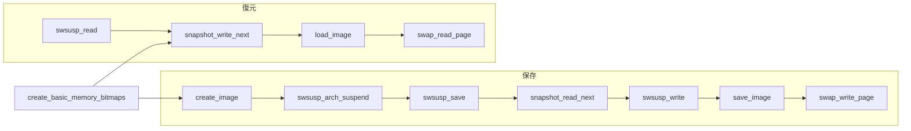

# 第6章 Snapshot とスワップイメージ

> **本章で読むソース**
>
> - [`kernel/power/snapshot.c` L1117-L1149](https://github.com/gregkh/linux/blob/v6.18.38/kernel/power/snapshot.c#L1117-L1149)
> - [`kernel/power/hibernate.c` L355-L359](https://github.com/gregkh/linux/blob/v6.18.38/kernel/power/hibernate.c#L355-L359)
> - [`kernel/power/snapshot.c` L2109-L2150](https://github.com/gregkh/linux/blob/v6.18.38/kernel/power/snapshot.c#L2109-L2150)
> - [`kernel/power/snapshot.c` L2236-L2281](https://github.com/gregkh/linux/blob/v6.18.38/kernel/power/snapshot.c#L2236-L2281)
> - [`kernel/power/snapshot.c` L2770-L2844](https://github.com/gregkh/linux/blob/v6.18.38/kernel/power/snapshot.c#L2770-L2844)
> - [`kernel/power/swap.c` L942-L981](https://github.com/gregkh/linux/blob/v6.18.38/kernel/power/swap.c#L942-L981)
> - [`kernel/power/swap.c` L533-L575](https://github.com/gregkh/linux/blob/v6.18.38/kernel/power/swap.c#L533-L575)
> - [`kernel/power/swap.c` L1544-L1573](https://github.com/gregkh/linux/blob/v6.18.38/kernel/power/swap.c#L1544-L1573)
> - [`kernel/power/swap.c` L1093-L1143](https://github.com/gregkh/linux/blob/v6.18.38/kernel/power/swap.c#L1093-L1143)
> - [`kernel/power/power.h` L141-L158](https://github.com/gregkh/linux/blob/v6.18.38/kernel/power/power.h#L141-L158)

## この章の狙い

メモリイメージのページ選別に使う **ビットマップ確保**、イメージ本体の生成 **`swsusp_save`**、スワップへの入出力をつなぐ **`snapshot_read_next`** / **`snapshot_write_next`** と **`swsusp_write`** / **`swsusp_read`** のデータパスを追う。

## 前提

- [第5章 Hibernate の遷移とユーザー空間 IF](05-hibernate-transition.md) の `hibernation_snapshot` と `swsusp_write` 呼び出し
- [メモリ管理](../../mm/part00-foundation/02-folio-page-unit.md) のページフレーム概念

## snapshot_handle によるストリーム抽象

イメージは連続バイト列として `snapshot_read_next` と `snapshot_write_next` でページ単位に送受信される。
`data_of` マクロが、呼び出し元が読み書きすべきバッファアドレスを返す。

[`kernel/power/power.h` L141-L158](https://github.com/gregkh/linux/blob/v6.18.38/kernel/power/power.h#L141-L158)

```c
struct snapshot_handle {
	unsigned int	cur;	/* number of the block of PAGE_SIZE bytes the
				 * next operation will refer to (ie. current)
				 */
	void		*buffer;	/* address of the block to read from
					 * or write to
					 */
	int		sync_read;	/* Set to one to notify the caller of
					 * snapshot_write_next() that it may
					 * need to call wait_on_bio_chain()
					 */
};

/* This macro returns the address from/to which the caller of
 * snapshot_read_next()/snapshot_write_next() is allowed to
 * read/write data after the function returns
 */
#define data_of(handle)	((handle).buffer)
```

内部表現を変えてもスワップ層とユーザー空間が同じ API を使えるよう、ストリーム境界が意図的に固定されている。

## create_basic_memory_bitmaps

保存対象外ページと空きページをマークする二つのビットマップを確保する。

[`kernel/power/snapshot.c` L1117-L1149](https://github.com/gregkh/linux/blob/v6.18.38/kernel/power/snapshot.c#L1117-L1149)

```c
int create_basic_memory_bitmaps(void)
{
	struct memory_bitmap *bm1, *bm2;
	int error;

	if (forbidden_pages_map && free_pages_map)
		return 0;
	else
		BUG_ON(forbidden_pages_map || free_pages_map);

	bm1 = kzalloc(sizeof(struct memory_bitmap), GFP_KERNEL);
	if (!bm1)
		return -ENOMEM;

	error = memory_bm_create(bm1, GFP_KERNEL, PG_ANY);
	if (error)
		goto Free_first_object;

	bm2 = kzalloc(sizeof(struct memory_bitmap), GFP_KERNEL);
	if (!bm2)
		goto Free_first_bitmap;

	error = memory_bm_create(bm2, GFP_KERNEL, PG_ANY);
	if (error)
		goto Free_second_object;

	forbidden_pages_map = bm1;
	free_pages_map = bm2;
	mark_nosave_pages(forbidden_pages_map);

	pr_debug("Basic memory bitmaps created\n");

	return 0;
```

両方の bitmap が揃うまでグローバルポインタを公開しない。
これにより途中失敗時に半端な bitmap を参照する経路を防ぐ。

## swsusp_save によるイメージ生成

`create_image` は `swsusp_arch_suspend` を呼び、そのアーキテクチャ依存トランポリンの中から `swsusp_save` が実行される。
x86 では `arch/x86/power/hibernate_asm_64.S` が `swsusp_save` を呼び、保存対象ページのコピーとメタデータ組み立てを行う。

[`kernel/power/hibernate.c` L355-L359](https://github.com/gregkh/linux/blob/v6.18.38/kernel/power/hibernate.c#L355-L359)

```c
	in_suspend = 1;
	save_processor_state();
	trace_suspend_resume(TPS("machine_suspend"), PM_EVENT_HIBERNATE, true);
	error = swsusp_arch_suspend();
	/* Restore control flow magically appears here */
```

[`kernel/power/snapshot.c` L2109-L2150](https://github.com/gregkh/linux/blob/v6.18.38/kernel/power/snapshot.c#L2109-L2150)

```c
asmlinkage __visible int swsusp_save(void)
{
	unsigned int nr_pages, nr_highmem;

	pr_info("Creating image:\n");

	drain_local_pages(NULL);
	nr_pages = count_data_pages();
	nr_highmem = count_highmem_pages();
	pr_info("Need to copy %u pages\n", nr_pages + nr_highmem);

	if (!enough_free_mem(nr_pages, nr_highmem)) {
		pr_err("Not enough free memory\n");
		return -ENOMEM;
	}

	if (swsusp_alloc(&copy_bm, nr_pages, nr_highmem)) {
		pr_err("Memory allocation failed\n");
		return -ENOMEM;
	}

	/*
	 * During allocating of suspend pagedir, new cold pages may appear.
	 * Kill them.
	 */
	drain_local_pages(NULL);
	nr_copy_pages = copy_data_pages(&copy_bm, &orig_bm, &zero_bm);

	/*
	 * End of critical section. From now on, we can write to memory,
	 * but we should not touch disk. This specially means we must _not_
	 * touch swap space! Except we must write out our image of course.
	 */
	nr_pages += nr_highmem;
	/* We don't actually copy the zero pages */
	nr_zero_pages = nr_pages - nr_copy_pages;
	nr_meta_pages = DIV_ROUND_UP(nr_pages * sizeof(long), PAGE_SIZE);

	pr_info("Image created (%d pages copied, %d zero pages)\n", nr_copy_pages, nr_zero_pages);

	return 0;
}
```

ゼロページは実体コピーを省略し、メタデータ側のフラグだけで復元時に再現する。
**最適化の工夫**：ゼロページ省略と `nr_meta_pages` による PFN パックで、スワップ I/O 量とメモリ使用量の両方を抑える。

## snapshot_read_next（保存方向）

イメージをページストリームとして読み出す。
先頭ページは `swsusp_info` ヘッダ、続く `nr_meta_pages` は PFN メタデータ、以降がデータページである。

[`kernel/power/snapshot.c` L2236-L2281](https://github.com/gregkh/linux/blob/v6.18.38/kernel/power/snapshot.c#L2236-L2281)

```c
int snapshot_read_next(struct snapshot_handle *handle)
{
	if (handle->cur > nr_meta_pages + nr_copy_pages)
		return 0;

	if (!buffer) {
		/* This makes the buffer be freed by swsusp_free() */
		buffer = get_image_page(GFP_ATOMIC, PG_ANY);
		if (!buffer)
			return -ENOMEM;
	}
	if (!handle->cur) {
		int error;

		error = init_header((struct swsusp_info *)buffer);
		if (error)
			return error;
		handle->buffer = buffer;
		memory_bm_position_reset(&orig_bm);
		memory_bm_position_reset(&copy_bm);
	} else if (handle->cur <= nr_meta_pages) {
		clear_page(buffer);
		pack_pfns(buffer, &orig_bm, &zero_bm);
	} else {
		struct page *page;

		page = pfn_to_page(memory_bm_next_pfn(&copy_bm));
		if (PageHighMem(page)) {
			/*
			 * Highmem pages are copied to the buffer,
			 * because we can't return with a kmapped
			 * highmem page (we may not be called again).
			 */
			void *kaddr;

			kaddr = kmap_local_page(page);
			copy_page(buffer, kaddr);
			kunmap_local(kaddr);
			handle->buffer = buffer;
		} else {
			handle->buffer = page_address(page);
		}
	}
	handle->cur++;
	return PAGE_SIZE;
}
```

ハイメムページだけバッファへコピーし、通常メモリは `page_address` を直接返す。
呼び出し側が再入しない前提でマッピング寿命を管理する。

## snapshot_write_next（復元方向）

復元時はヘッダ読み込み、PFN アンパック、`prepare_image` のあとデータページを順に受け取る。

[`kernel/power/snapshot.c` L2770-L2844](https://github.com/gregkh/linux/blob/v6.18.38/kernel/power/snapshot.c#L2770-L2844)

```c
int snapshot_write_next(struct snapshot_handle *handle)
{
	static struct chain_allocator ca;
	int error;

next:
	/* Check if we have already loaded the entire image */
	if (handle->cur > 1 && handle->cur > nr_meta_pages + nr_copy_pages + nr_zero_pages)
		return 0;

	if (!handle->cur) {
		if (!buffer)
			/* This makes the buffer be freed by swsusp_free() */
			buffer = get_image_page(GFP_ATOMIC, PG_ANY);

		if (!buffer)
			return -ENOMEM;

		handle->buffer = buffer;
	} else if (handle->cur == 1) {
		error = load_header(buffer);
		if (error)
			return error;

		safe_pages_list = NULL;

		error = memory_bm_create(&copy_bm, GFP_ATOMIC, PG_ANY);
		if (error)
			return error;

		error = memory_bm_create(&zero_bm, GFP_ATOMIC, PG_ANY);
		if (error)
			return error;

		nr_zero_pages = 0;

		hibernate_restore_protection_begin();
	} else if (handle->cur <= nr_meta_pages + 1) {
		error = unpack_orig_pfns(buffer, &copy_bm, &zero_bm);
		if (error)
			return error;

		if (handle->cur == nr_meta_pages + 1) {
			error = prepare_image(&orig_bm, &copy_bm, &zero_bm);
			if (error)
				return error;

			chain_init(&ca, GFP_ATOMIC, PG_SAFE);
			memory_bm_position_reset(&orig_bm);
			memory_bm_position_reset(&zero_bm);
			restore_pblist = NULL;
			handle->buffer = get_buffer(&orig_bm, &ca);
			if (IS_ERR(handle->buffer))
				return PTR_ERR(handle->buffer);
		}
	} else {
		copy_last_highmem_page();
		error = hibernate_restore_protect_page(handle->buffer);
		if (error)
			return error;
		handle->buffer = get_buffer(&orig_bm, &ca);
		if (IS_ERR(handle->buffer))
			return PTR_ERR(handle->buffer);
	}
	handle->sync_read = (handle->buffer == buffer);
	handle->cur++;

	/* Zero pages were not included in the image, memset it and move on. */
	if (handle->cur > nr_meta_pages + 1 &&
	    memory_bm_test_bit(&zero_bm, memory_bm_get_current(&orig_bm))) {
		memset(handle->buffer, 0, PAGE_SIZE);
		goto next;
	}

	return PAGE_SIZE;
```

ゼロページはイメージに含めず、ビットマップに従い `memset` で埋める。

## swsusp_write と save_image

`swsusp_write` はスワップライタを初期化し、`snapshot_read_next` でページを取り出して `save_image` または圧縮経路へ渡す。

[`kernel/power/swap.c` L942-L981](https://github.com/gregkh/linux/blob/v6.18.38/kernel/power/swap.c#L942-L981)

```c
int swsusp_write(unsigned int flags)
{
	struct swap_map_handle handle;
	struct snapshot_handle snapshot;
	struct swsusp_info *header;
	unsigned long pages;
	int error;

	pages = snapshot_get_image_size();
	error = get_swap_writer(&handle);
	if (error) {
		pr_err("Cannot get swap writer\n");
		return error;
	}
	if (flags & SF_NOCOMPRESS_MODE) {
		if (!enough_swap(pages)) {
			pr_err("Not enough free swap\n");
			error = -ENOSPC;
			goto out_finish;
		}
	}
	memset(&snapshot, 0, sizeof(struct snapshot_handle));
	error = snapshot_read_next(&snapshot);
	if (error < (int)PAGE_SIZE) {
		if (error >= 0)
			error = -EFAULT;

		goto out_finish;
	}
	header = (struct swsusp_info *)data_of(snapshot);
	error = swap_write_page(&handle, header, NULL);
	if (!error) {
		error = (flags & SF_NOCOMPRESS_MODE) ?
			save_image(&handle, &snapshot, pages - 1) :
			save_compressed_image(&handle, &snapshot, pages - 1);
	}
out_finish:
	error = swap_writer_finish(&handle, flags, error);
	return error;
}
```

`save_image` は `snapshot_read_next` と `swap_write_page` をループし、バッチ I/O でスループットを上げる。

[`kernel/power/swap.c` L533-L575](https://github.com/gregkh/linux/blob/v6.18.38/kernel/power/swap.c#L533-L575)

```c
static int save_image(struct swap_map_handle *handle,
                      struct snapshot_handle *snapshot,
                      unsigned int nr_to_write)
{
	unsigned int m;
	int ret;
	int nr_pages;
	int err2;
	struct hib_bio_batch hb;
	ktime_t start;
	ktime_t stop;

	hib_init_batch(&hb);

	pr_info("Saving image data pages (%u pages)...\n",
		nr_to_write);
	m = nr_to_write / 10;
	if (!m)
		m = 1;
	nr_pages = 0;
	start = ktime_get();
	while (1) {
		ret = snapshot_read_next(snapshot);
		if (ret <= 0)
			break;
		ret = swap_write_page(handle, data_of(*snapshot), &hb);
		if (ret)
			break;
		if (!(nr_pages % m))
			pr_info("Image saving progress: %3d%%\n",
				nr_pages / m * 10);
		nr_pages++;
	}
	err2 = hib_wait_io(&hb);
	hib_finish_batch(&hb);
	stop = ktime_get();
	if (!ret)
		ret = err2;
	if (!ret)
		pr_info("Image saving done\n");
	swsusp_show_speed(start, stop, nr_to_write, "Wrote");
	return ret;
}
```

## swsusp_read と load_image

復元時は `snapshot_write_next` が書き込み先バッファを返し、`swap_read_page` がスワップからデータを読み込む。

[`kernel/power/swap.c` L1544-L1573](https://github.com/gregkh/linux/blob/v6.18.38/kernel/power/swap.c#L1544-L1573)

```c
int swsusp_read(unsigned int *flags_p)
{
	int error;
	struct swap_map_handle handle;
	struct snapshot_handle snapshot;
	struct swsusp_info *header;

	memset(&snapshot, 0, sizeof(struct snapshot_handle));
	error = snapshot_write_next(&snapshot);
	if (error < (int)PAGE_SIZE)
		return error < 0 ? error : -EFAULT;
	header = (struct swsusp_info *)data_of(snapshot);
	error = get_swap_reader(&handle, flags_p);
	if (error)
		goto end;
	if (!error)
		error = swap_read_page(&handle, header, NULL);
	if (!error) {
		error = (*flags_p & SF_NOCOMPRESS_MODE) ?
			load_image(&handle, &snapshot, header->pages - 1) :
			load_compressed_image(&handle, &snapshot, header->pages - 1);
	}
	swap_reader_finish(&handle);
end:
	if (!error)
		pr_debug("Image successfully loaded\n");
	else
		pr_debug("Error %d resuming\n", error);
	return error;
}
```

[`kernel/power/swap.c` L1093-L1143](https://github.com/gregkh/linux/blob/v6.18.38/kernel/power/swap.c#L1093-L1143)

```c
static int load_image(struct swap_map_handle *handle,
                      struct snapshot_handle *snapshot,
                      unsigned int nr_to_read)
{
	unsigned int m;
	int ret = 0;
	ktime_t start;
	ktime_t stop;
	struct hib_bio_batch hb;
	int err2;
	unsigned nr_pages;

	hib_init_batch(&hb);

	clean_pages_on_read = true;
	pr_info("Loading image data pages (%u pages)...\n", nr_to_read);
	m = nr_to_read / 10;
	if (!m)
		m = 1;
	nr_pages = 0;
	start = ktime_get();
	for ( ; ; ) {
		ret = snapshot_write_next(snapshot);
		if (ret <= 0)
			break;
		ret = swap_read_page(handle, data_of(*snapshot), &hb);
		if (ret)
			break;
		if (snapshot->sync_read)
			ret = hib_wait_io(&hb);
		if (ret)
			break;
		if (!(nr_pages % m))
			pr_info("Image loading progress: %3d%%\n",
				nr_pages / m * 10);
		nr_pages++;
	}
	err2 = hib_wait_io(&hb);
	hib_finish_batch(&hb);
	stop = ktime_get();
	if (!ret)
		ret = err2;
	if (!ret) {
		pr_info("Image loading done\n");
		ret = snapshot_write_finalize(snapshot);
		if (!ret && !snapshot_image_loaded(snapshot))
			ret = -ENODATA;
	}
	swsusp_show_speed(start, stop, nr_to_read, "Read");
	return ret;
}
```

`sync_read` が立ったときだけ `hib_wait_io` でバッチを同期する。
書き込み先が共有バッファのときはディスク読み込みとメモリ復元の順序を守るためである。

## データパスの流れ



[`kernel/power/user.c` L149-L158](https://github.com/gregkh/linux/blob/v6.18.38/kernel/power/user.c#L149-L158)

```c
	if (!pg_offp) { /* on page boundary? */
		res = snapshot_read_next(&data->handle);
		if (res <= 0)
			goto Unlock;
	} else {
		res = PAGE_SIZE - pg_offp;
	}

	res = simple_read_from_buffer(buf, count, &pg_offp,
			data_of(data->handle), res);
```

`/dev/snapshot` 経路は `swsusp_write` を使わず、`snapshot_read_next` を `read()` が呼び出す。

## 7.x 系での変化

v7.1.3 では `swsusp_save` のログが `pr_info` から `pm_deferred_pr_dbg` に変わり、イメージ作成中のコンソール出力を遅延できる。
`create_basic_memory_bitmaps` の `kzalloc` は `kzalloc_obj` マクロに置き換わっているが、ビットマップ二段確保の構造は同じである。

## まとめ

`create_basic_memory_bitmaps` が保存対象ページの選別基盤を用意する。
`swsusp_arch_suspend` 内の `swsusp_save` がコピーとゼロページ集計を行い、`snapshot_read_next` と `snapshot_write_next` がページストリームの境界を固定する。
カーネル一発経路は `swsusp_write`、snapshot デバイス経路は `read()` がスワップ I/O の代わりにイメージを受け渡す。
ゼロページ省略とバッチ bio が、イメージサイズとディスク転送の両面で効く。

## 関連する章

- 前章：[Hibernate の遷移とユーザー空間 IF](05-hibernate-transition.md)
- 次章：[PM QoS と制約の集約](07-pm-qos.md)
- [メモリ管理](../../mm/part05-advanced/32-swap-data-path.md) のスワップ一般論
