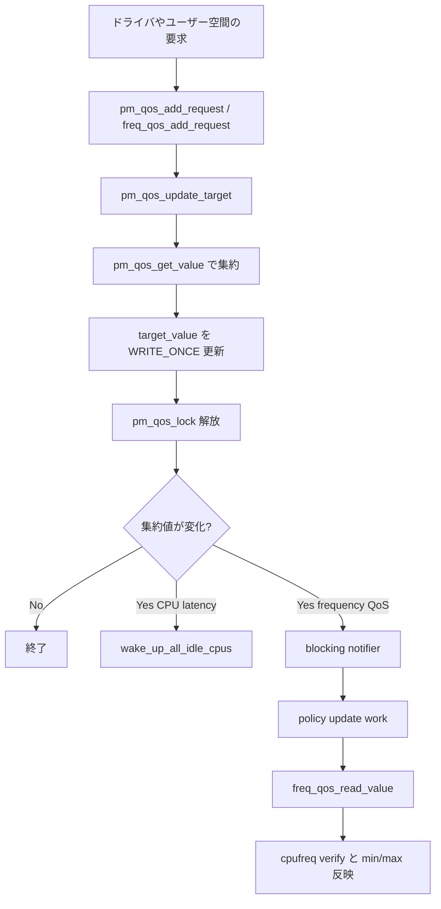

# 第7章 PM QoS と制約の集約

> **本章で読むソース**
>
> - [`include/linux/pm_qos.h` L41-L44](https://github.com/gregkh/linux/blob/v6.18.38/include/linux/pm_qos.h#L41-L44)
> - [`include/linux/pm_qos.h` L52-L59](https://github.com/gregkh/linux/blob/v6.18.38/include/linux/pm_qos.h#L52-L59)
> - [`kernel/power/qos.c` L58-L74](https://github.com/gregkh/linux/blob/v6.18.38/kernel/power/qos.c#L58-L74)
> - [`kernel/power/qos.c` L98-L146](https://github.com/gregkh/linux/blob/v6.18.38/kernel/power/qos.c#L98-L146)
> - [`kernel/power/qos.c` L215-L255](https://github.com/gregkh/linux/blob/v6.18.38/kernel/power/qos.c#L215-L255)
> - [`include/linux/pm_qos.h` L85-L96](https://github.com/gregkh/linux/blob/v6.18.38/include/linux/pm_qos.h#L85-L96)
> - [`kernel/power/qos.c` L443-L464](https://github.com/gregkh/linux/blob/v6.18.38/kernel/power/qos.c#L443-L464)
> - [`drivers/cpufreq/cpufreq.c` L1289-L1303](https://github.com/gregkh/linux/blob/v6.18.38/drivers/cpufreq/cpufreq.c#L1289-L1303)
> - [`drivers/cpufreq/cpufreq.c` L1211-L1218](https://github.com/gregkh/linux/blob/v6.18.38/drivers/cpufreq/cpufreq.c#L1211-L1218)
> - [`drivers/cpufreq/cpufreq.c` L2629-L2634](https://github.com/gregkh/linux/blob/v6.18.38/drivers/cpufreq/cpufreq.c#L2629-L2634)
> - [`kernel/power/qos.c` L503-L522](https://github.com/gregkh/linux/blob/v6.18.38/kernel/power/qos.c#L503-L522)

## この章の狙い

複数の要求者が出す電源制約を priority list で集約する **PM QoS** のコアを追う。
**CPU latency QoS** と **frequency QoS** が cpuidle と cpufreq にどう届くかを押さえる。

## 前提

- [第1章 電源管理と CPU ライフサイクルの全体像](../part00-foundation/01-power-cpu-overview.md) の PM QoS 概観
- [第3部 cpufreq](../part02-cpufreq/09-cpufreq-framework-policy.md) の `cpufreq_policy`（未執筆章は README 参照）

## 集約の型

`pm_qos_type` は、複数要求をどう畳み込むかを決める。

[`include/linux/pm_qos.h` L41-L44](https://github.com/gregkh/linux/blob/v6.18.38/include/linux/pm_qos.h#L41-L44)

```c
enum pm_qos_type {
	PM_QOS_UNITIALIZED,
	PM_QOS_MAX,		/* return the largest value */
	PM_QOS_MIN,		/* return the smallest value */
```

`PM_QOS_MIN` はリスト中の最小値を採用する。
CPU latency 制約は「許容できる最大レイテンシの上限」を複数要求者が出し、最も厳しい（小さい）値が効く。

各制約リストは `pm_qos_constraints` で表現される。

[`include/linux/pm_qos.h` L52-L59](https://github.com/gregkh/linux/blob/v6.18.38/include/linux/pm_qos.h#L52-L59)

```c
struct pm_qos_constraints {
	struct plist_head list;
	s32 target_value;	/* Do not change to 64 bit */
	s32 default_value;
	s32 no_constraint_value;
	enum pm_qos_type type;
	struct blocking_notifier_head *notifiers;
};
```

`target_value` は lockless read path 用に `READ_ONCE` で読まれる。
`plist` は priority 順に要求を並べ、集約計算の入力になる。

## pm_qos_update_target

要求の追加、更新、削除はすべて `pm_qos_update_target` に集約される。

[`kernel/power/qos.c` L98-L146](https://github.com/gregkh/linux/blob/v6.18.38/kernel/power/qos.c#L98-L146)

```c
int pm_qos_update_target(struct pm_qos_constraints *c, struct plist_node *node,
			 enum pm_qos_req_action action, int value)
{
	int prev_value, curr_value, new_value;
	unsigned long flags;

	spin_lock_irqsave(&pm_qos_lock, flags);

	prev_value = pm_qos_get_value(c);
	if (value == PM_QOS_DEFAULT_VALUE)
		new_value = c->default_value;
	else
		new_value = value;

	switch (action) {
	case PM_QOS_REMOVE_REQ:
		plist_del(node, &c->list);
		break;
	case PM_QOS_UPDATE_REQ:
		/*
		 * To change the list, atomically remove, reinit with new value
		 * and add, then see if the aggregate has changed.
		 */
		plist_del(node, &c->list);
		fallthrough;
	case PM_QOS_ADD_REQ:
		plist_node_init(node, new_value);
		plist_add(node, &c->list);
		break;
	default:
		/* no action */
		;
	}

	curr_value = pm_qos_get_value(c);
	pm_qos_set_value(c, curr_value);

	spin_unlock_irqrestore(&pm_qos_lock, flags);

	trace_pm_qos_update_target(action, prev_value, curr_value);

	if (prev_value == curr_value)
		return 0;

	if (c->notifiers)
		blocking_notifier_call_chain(c->notifiers, curr_value, NULL);

	return 1;
}
```

集約値が変わったときだけ notifier を呼ぶ。
返り値 1 は集約値が変化したことを表す。

集約値の計算自体は `pm_qos_get_value` が担う。

[`kernel/power/qos.c` L58-L74](https://github.com/gregkh/linux/blob/v6.18.38/kernel/power/qos.c#L58-L74)

```c
static int pm_qos_get_value(struct pm_qos_constraints *c)
{
	if (plist_head_empty(&c->list))
		return c->no_constraint_value;

	switch (c->type) {
	case PM_QOS_MIN:
		return plist_first(&c->list)->prio;

	case PM_QOS_MAX:
		return plist_last(&c->list)->prio;

	default:
		WARN(1, "Unknown PM QoS type in %s\n", __func__);
		return PM_QOS_DEFAULT_VALUE;
	}
}
```

**最適化の工夫**：`target_value` を `WRITE_ONCE` で公開し、ホットパスはロックなしで現在の制約を読める。
`pm_qos_lock` は plist 操作と `target_value` 更新までを保護し、ロック解放後に `blocking_notifier_call_chain` を呼ぶ（コールバックはスリープ可能で spinlock 範囲外である）。

## CPU latency QoS

システム全体の CPU レイテンシ制約は `cpu_latency_constraints` に保持される。

[`kernel/power/qos.c` L215-L255](https://github.com/gregkh/linux/blob/v6.18.38/kernel/power/qos.c#L215-L255)

```c
static struct pm_qos_constraints cpu_latency_constraints = {
	.list = PLIST_HEAD_INIT(cpu_latency_constraints.list),
	.target_value = PM_QOS_CPU_LATENCY_DEFAULT_VALUE,
	.default_value = PM_QOS_CPU_LATENCY_DEFAULT_VALUE,
	.no_constraint_value = PM_QOS_CPU_LATENCY_DEFAULT_VALUE,
	.type = PM_QOS_MIN,
};

static inline bool cpu_latency_qos_value_invalid(s32 value)
{
	return value < 0 && value != PM_QOS_DEFAULT_VALUE;
}

/**
 * cpu_latency_qos_limit - Return current system-wide CPU latency QoS limit.
 */
s32 cpu_latency_qos_limit(void)
{
	return pm_qos_read_value(&cpu_latency_constraints);
}

/**
 * cpu_latency_qos_request_active - Check the given PM QoS request.
 * @req: PM QoS request to check.
 *
 * Return: 'true' if @req has been added to the CPU latency QoS list, 'false'
 * otherwise.
 */
bool cpu_latency_qos_request_active(struct pm_qos_request *req)
{
	return req->qos == &cpu_latency_constraints;
}
EXPORT_SYMBOL_GPL(cpu_latency_qos_request_active);

static void cpu_latency_qos_apply(struct pm_qos_request *req,
				  enum pm_qos_req_action action, s32 value)
{
	int ret = pm_qos_update_target(req->qos, &req->node, action, value);
	if (ret > 0)
		wake_up_all_idle_cpus();
}
```

`cpu_latency_qos_apply` は集約値が変わったとき `wake_up_all_idle_cpus` を呼ぶ。
cpuidle ガバナが idle 状態を選び直し、深すぎる状態を避けるためである。
詳細は [第3部 cpuidle](../part03-cpuidle/14-cpuidle-governors.md) で扱う。

## frequency QoS

cpufreq policy ごとの周波数上下限は `freq_constraints` で管理される。

[`include/linux/pm_qos.h` L85-L96](https://github.com/gregkh/linux/blob/v6.18.38/include/linux/pm_qos.h#L85-L96)

```c
struct freq_constraints {
	struct pm_qos_constraints min_freq;
	struct blocking_notifier_head min_freq_notifiers;
	struct pm_qos_constraints max_freq;
	struct blocking_notifier_head max_freq_notifiers;
};

struct freq_qos_request {
	enum freq_qos_req_type type;
	struct plist_node pnode;
	struct freq_constraints *qos;
};
```

`FREQ_QOS_MIN` は `PM_QOS_MAX` 型の `min_freq` リストへ、`FREQ_QOS_MAX` は `PM_QOS_MIN` 型の `max_freq` リストへ入る。
「最低周波数要求」は複数要求の最大値、「最高周波数上限」は複数要求の最小値が効く。

cpufreq フレームワークは `freq_qos_*` notifier 経由で policy の `min` と `max` を更新する。

### freq_constraints の初期化

policy 生成時に `freq_constraints_init` で min/max リストと notifier ヘッドを初期化する。

[`kernel/power/qos.c` L443-L464](https://github.com/gregkh/linux/blob/v6.18.38/kernel/power/qos.c#L443-L464)

```c
void freq_constraints_init(struct freq_constraints *qos)
{
	struct pm_qos_constraints *c;

	c = &qos->min_freq;
	plist_head_init(&c->list);
	c->target_value = FREQ_QOS_MIN_DEFAULT_VALUE;
	c->default_value = FREQ_QOS_MIN_DEFAULT_VALUE;
	c->no_constraint_value = FREQ_QOS_MIN_DEFAULT_VALUE;
	c->type = PM_QOS_MAX;
	c->notifiers = &qos->min_freq_notifiers;
	BLOCKING_INIT_NOTIFIER_HEAD(c->notifiers);

	c = &qos->max_freq;
	plist_head_init(&c->list);
	c->target_value = FREQ_QOS_MAX_DEFAULT_VALUE;
	c->default_value = FREQ_QOS_MAX_DEFAULT_VALUE;
	c->no_constraint_value = FREQ_QOS_MAX_DEFAULT_VALUE;
	c->type = PM_QOS_MIN;
	c->notifiers = &qos->max_freq_notifiers;
	BLOCKING_INIT_NOTIFIER_HEAD(c->notifiers);
}
```

### notifier 登録と policy 更新

`cpufreq_policy_alloc` は MIN/MAX それぞれに notifier を登録する。

[`drivers/cpufreq/cpufreq.c` L1289-L1303](https://github.com/gregkh/linux/blob/v6.18.38/drivers/cpufreq/cpufreq.c#L1289-L1303)

```c
	freq_constraints_init(&policy->constraints);

	policy->nb_min.notifier_call = cpufreq_notifier_min;
	policy->nb_max.notifier_call = cpufreq_notifier_max;

	ret = freq_qos_add_notifier(&policy->constraints, FREQ_QOS_MIN,
				    &policy->nb_min);
	if (ret) {
		dev_err(dev, "Failed to register MIN QoS notifier: %d (CPU%u)\n",
			ret, cpu);
		goto err_kobj_remove;
	}

	ret = freq_qos_add_notifier(&policy->constraints, FREQ_QOS_MAX,
				    &policy->nb_max);
```

`freq_qos_apply` が `pm_qos_update_target` で集約値を変えると、blocking notifier が起動する。
notifier は `policy->update` work を予約し、`refresh_frequency_limits` 経由で policy を再計算する。

[`drivers/cpufreq/cpufreq.c` L1211-L1218](https://github.com/gregkh/linux/blob/v6.18.38/drivers/cpufreq/cpufreq.c#L1211-L1218)

```c
static int cpufreq_notifier_min(struct notifier_block *nb, unsigned long freq,
				void *data)
{
	struct cpufreq_policy *policy = container_of(nb, struct cpufreq_policy, nb_min);

	schedule_work(&policy->update);
	return 0;
}
```

`cpufreq_set_policy` は `freq_qos_read_value` で集約済み min/max を読み、`verify` 後に policy へ反映する。

[`drivers/cpufreq/cpufreq.c` L2629-L2634](https://github.com/gregkh/linux/blob/v6.18.38/drivers/cpufreq/cpufreq.c#L2629-L2634)

```c
	/*
	 * PM QoS framework collects all the requests from users and provide us
	 * the final aggregated value here.
	 */
	new_data.min = freq_qos_read_value(&policy->constraints, FREQ_QOS_MIN);
	new_data.max = freq_qos_read_value(&policy->constraints, FREQ_QOS_MAX);
```

要求の追加、更新、削除は `freq_qos_apply` が担う。

[`kernel/power/qos.c` L503-L522](https://github.com/gregkh/linux/blob/v6.18.38/kernel/power/qos.c#L503-L522)

```c
int freq_qos_apply(struct freq_qos_request *req,
			  enum pm_qos_req_action action, s32 value)
{
	int ret;

	switch(req->type) {
	case FREQ_QOS_MIN:
		ret = pm_qos_update_target(&req->qos->min_freq, &req->pnode,
					   action, value);
		break;
	case FREQ_QOS_MAX:
		ret = pm_qos_update_target(&req->qos->max_freq, &req->pnode,
					   action, value);
		break;
	default:
		ret = -EINVAL;
	}

	return ret;
}
```

## 制約更新の流れ



## 7.x 系での変化

v7.1.3 では `CONFIG_PM_QOS_CPU_SYSTEM_WAKEUP` 有効時に CPU system wakeup latency 用の制約リストが追加される。
v6.18.38 本分冊の対象コードには `cpu_latency_qos` と `freq_qos` の二系統が中心である。

## まとめ

PM QoS は plist による要求集約と `pm_qos_update_target` による一括更新がコアである。
CPU latency QoS は `PM_QOS_MIN` で最も厳しいレイテンシ上限を選び、変化時に idle CPU を起こす。
frequency QoS は `freq_qos_apply` で plist を更新し、notifier 経由で `freq_qos_read_value` を読んだ `cpufreq_set_policy` が動作範囲を狭める。

## 関連する章

- 前章：[Snapshot とスワップイメージ](06-snapshot-swap-image.md)
- 次章：[Energy Model と性能ドメイン](08-energy-model.md)
- [第3部 cpuidle](../part03-cpuidle/14-cpuidle-governors.md) の状態選択
