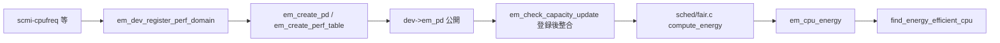

# 第8章 Energy Model と性能ドメイン

> **本章で読むソース**
>
> - [`include/linux/energy_model.h` L24-L30](https://github.com/gregkh/linux/blob/v6.18.38/include/linux/energy_model.h#L24-L30)
> - [`include/linux/energy_model.h` L72-L79](https://github.com/gregkh/linux/blob/v6.18.38/include/linux/energy_model.h#L72-L79)
> - [`kernel/power/energy_model.c` L552-L563](https://github.com/gregkh/linux/blob/v6.18.38/kernel/power/energy_model.c#L552-L563)
> - [`kernel/power/energy_model.c` L335-L389](https://github.com/gregkh/linux/blob/v6.18.38/kernel/power/energy_model.c#L335-L389)
> - [`kernel/power/energy_model.c` L421-L441](https://github.com/gregkh/linux/blob/v6.18.38/kernel/power/energy_model.c#L421-L441)
> - [`drivers/cpufreq/scmi-cpufreq.c` L378-L380](https://github.com/gregkh/linux/blob/v6.18.38/drivers/cpufreq/scmi-cpufreq.c#L378-L380)
> - [`kernel/power/energy_model.c` L799-L840](https://github.com/gregkh/linux/blob/v6.18.38/kernel/power/energy_model.c#L799-L840)
> - [`include/linux/energy_model.h` L239-L268](https://github.com/gregkh/linux/blob/v6.18.38/include/linux/energy_model.h#L239-L268)
> - [`kernel/sched/fair.c` L8370-L8386](https://github.com/gregkh/linux/blob/v6.18.38/kernel/sched/fair.c#L8370-L8386)

## この章の狙い

CPU 性能状態ごとの消費電力テーブルを登録する **Energy Model** と、スケジューラの EAS（Energy Aware Scheduling）が参照する **`em_perf_state`** の関係を追う。
`em_dev_register_perf_domain` から `em_cpu_energy` までのデータパスを押さえる。

## 前提

- [第7章 PM QoS と制約の集約](07-pm-qos.md) の frequency 制約概観
- [プロセスとスケジューラ](../../sched/part05-smp-obs/22-load-balance-numa.md) の load balance 概観

## em_perf_state と性能ドメイン

各性能状態は周波数、容量、消費電力、コスト係数を持つ。

[`include/linux/energy_model.h` L24-L30](https://github.com/gregkh/linux/blob/v6.18.38/include/linux/energy_model.h#L24-L30)

```c
struct em_perf_state {
	unsigned long performance;
	unsigned long frequency;
	unsigned long power;
	unsigned long cost;
	unsigned long flags;
};
```

`performance` は capacity スケール、`frequency` は kHz 単位である。
`cost` はエネルギー見積もり用の係数で、登録時に `10 * power * max_frequency / frequency` として計算される。

複数 CPU を束ねる単位が `em_perf_domain` である。

[`include/linux/energy_model.h` L72-L79](https://github.com/gregkh/linux/blob/v6.18.38/include/linux/energy_model.h#L72-L79)

```c
struct em_perf_domain {
	struct em_perf_table __rcu *em_table;
	int nr_perf_states;
	int min_perf_state;
	int max_perf_state;
	unsigned long flags;
	unsigned long cpus[];
};
```

コメントが述べるとおり、CPU 性能ドメインは CPUFreq policy と 1 対 1 に対応することが多い。
`cpus[]` はスケジューラがエネルギー計算時にキャッシュミスを減らすためドメインに埋め込まれる。

## em_dev_register_perf_domain

ドライバはコールバック `em_data_callback` で各性能状態のデータを提供し、登録 API を呼ぶ。

[`kernel/power/energy_model.c` L552-L563](https://github.com/gregkh/linux/blob/v6.18.38/kernel/power/energy_model.c#L552-L563)

```c
int em_dev_register_perf_domain(struct device *dev, unsigned int nr_states,
				const struct em_data_callback *cb,
				const cpumask_t *cpus, bool microwatts)
{
	int ret = em_dev_register_pd_no_update(dev, nr_states, cb, cpus, microwatts);

	if (_is_cpu_device(dev))
		em_check_capacity_update();

	return ret;
}
EXPORT_SYMBOL_GPL(em_dev_register_perf_domain);
```

CPU デバイス登録直後は `em_check_capacity_update` が一度呼ばれ、EM の `performance` を `arch_scale_cpu_capacity` と整合させる。

登録本体は `em_dev_register_pd_no_update` が担う。

[`kernel/power/energy_model.c` L576-L627](https://github.com/gregkh/linux/blob/v6.18.38/kernel/power/energy_model.c#L576-L627)

```c
int em_dev_register_pd_no_update(struct device *dev, unsigned int nr_states,
				 const struct em_data_callback *cb,
				 const cpumask_t *cpus, bool microwatts)
{
	struct em_perf_table *em_table;
	unsigned long cap, prev_cap = 0;
	unsigned long flags = 0;
	int cpu, ret;

	if (!dev || !nr_states || !cb)
		return -EINVAL;

	/*
	 * Use a mutex to serialize the registration of performance domains and
	 * let the driver-defined callback functions sleep.
	 */
	mutex_lock(&em_pd_mutex);

	if (dev->em_pd) {
		ret = -EEXIST;
		goto unlock;
	}

	if (_is_cpu_device(dev)) {
		if (!cpus) {
			dev_err(dev, "EM: invalid CPU mask\n");
			ret = -EINVAL;
			goto unlock;
		}

		for_each_cpu(cpu, cpus) {
			if (em_cpu_get(cpu)) {
				dev_err(dev, "EM: exists for CPU%d\n", cpu);
				ret = -EEXIST;
				goto unlock;
			}
			/*
			 * All CPUs of a domain must have the same
			 * micro-architecture since they all share the same
			 * table.
			 */
			cap = arch_scale_cpu_capacity(cpu);
			if (prev_cap && prev_cap != cap) {
				dev_err(dev, "EM: CPUs of %*pbl must have the same capacity\n",
					cpumask_pr_args(cpus));

				ret = -EINVAL;
				goto unlock;
			}
			prev_cap = cap;
		}
	}
```

同一ドメイン内 CPU は同一マイクロアーキテクチャである必要がある。
v6.18.38 では `scmi-cpufreq`、`mediatek-cpufreq-hw`、`cppc_cpufreq` などが `em_dev_register_perf_domain` を呼ぶ。
`schedutil` はガバナであり EM 登録主体ではない。
`intel_pstate` もこの API の呼び出し例ではない。

[`drivers/cpufreq/scmi-cpufreq.c` L378-L380](https://github.com/gregkh/linux/blob/v6.18.38/drivers/cpufreq/scmi-cpufreq.c#L378-L380)

```c
	em_dev_register_perf_domain(get_cpu_device(policy->cpu), priv->nr_opp,
				    &em_cb, priv->opp_shared_cpus,
				    em_power_scale);
```

## em_create_pd と性能状態テーブル

入力検証を通過したあと `em_dev_register_pd_no_update` は `em_create_pd` を呼ぶ。
`em_create_perf_table` がドライバ callback から各状態の周波数と消費電力を取得し、昇順と範囲を検証する。

[`kernel/power/energy_model.c` L335-L389](https://github.com/gregkh/linux/blob/v6.18.38/kernel/power/energy_model.c#L335-L389)

```c
static int em_create_perf_table(struct device *dev, struct em_perf_domain *pd,
				struct em_perf_state *table,
				const struct em_data_callback *cb,
				unsigned long flags)
{
	unsigned long power, freq, prev_freq = 0;
	int nr_states = pd->nr_perf_states;
	int i, ret;

	/* Build the list of performance states for this performance domain */
	for (i = 0, freq = 0; i < nr_states; i++, freq++) {
		/*
		 * active_power() is a driver callback which ceils 'freq' to
		 * lowest performance state of 'dev' above 'freq' and updates
		 * 'power' and 'freq' accordingly.
		 */
		ret = cb->active_power(dev, &power, &freq);
		if (ret) {
			dev_err(dev, "EM: invalid perf. state: %d\n",
				ret);
			return -EINVAL;
		}

		/*
		 * We expect the driver callback to increase the frequency for
		 * higher performance states.
		 */
		if (freq <= prev_freq) {
			dev_err(dev, "EM: non-increasing freq: %lu\n",
				freq);
			return -EINVAL;
		}

		/*
		 * The power returned by active_state() is expected to be
		 * positive and be in range.
		 */
		if (!power || power > EM_MAX_POWER) {
			dev_err(dev, "EM: invalid power: %lu\n",
				power);
			return -EINVAL;
		}

		table[i].power = power;
		table[i].frequency = prev_freq = freq;
	}

	em_init_performance(dev, pd, table, nr_states);

	ret = em_compute_costs(dev, table, cb, nr_states, flags);
	if (ret)
		return -EINVAL;

	return 0;
}
```

`em_create_pd` はテーブルを RCU で公開し、`dev->em_pd` を設定する。

[`kernel/power/energy_model.c` L421-L441](https://github.com/gregkh/linux/blob/v6.18.38/kernel/power/energy_model.c#L421-L441)

```c
	pd->nr_perf_states = nr_states;

	em_table = em_table_alloc(pd);
	if (!em_table)
		goto free_pd;

	ret = em_create_perf_table(dev, pd, em_table->state, cb, flags);
	if (ret)
		goto free_pd_table;

	rcu_assign_pointer(pd->em_table, em_table);

	if (_is_cpu_device(dev))
		for_each_cpu(cpu, cpus) {
			cpu_dev = get_cpu_device(cpu);
			cpu_dev->em_pd = pd;
		}

	dev->em_pd = pd;

	return 0;
```

## em_check_capacity_update

CPU 用 EM を登録した直後に呼ばれ、EM の `performance` 値を arch CPU capacity と揃える。
周波数遷移のたびに EM テーブルを更新する関数ではない。

[`kernel/power/energy_model.c` L799-L840](https://github.com/gregkh/linux/blob/v6.18.38/kernel/power/energy_model.c#L799-L840)

```c
static void em_check_capacity_update(void)
{
	cpumask_var_t cpu_done_mask;
	int cpu, failed_cpus = 0;

	if (!zalloc_cpumask_var(&cpu_done_mask, GFP_KERNEL)) {
		pr_warn("no free memory\n");
		return;
	}

	/* Check if CPUs capacity has changed than update EM */
	for_each_possible_cpu(cpu) {
		struct cpufreq_policy *policy;
		struct em_perf_domain *pd;
		struct device *dev;

		if (cpumask_test_cpu(cpu, cpu_done_mask))
			continue;

		policy = cpufreq_cpu_get(cpu);
		if (!policy) {
			failed_cpus++;
			continue;
		}
		cpufreq_cpu_put(policy);

		dev = get_cpu_device(cpu);
		pd = em_pd_get(dev);
		if (!pd || em_is_artificial(pd))
			continue;

		cpumask_or(cpu_done_mask, cpu_done_mask,
			   em_span_cpus(pd));

		em_adjust_new_capacity(cpu, dev, pd);
	}

	if (failed_cpus)
		schedule_delayed_work(&em_update_work, msecs_to_jiffies(1000));

	free_cpumask_var(cpu_done_mask);
}
```

policy 取得に失敗した CPU があると遅延ワークで再試行する。
**最適化の工夫**：ドメイン単位で `cpu_done_mask` を使い、同一 PD の CPU を二重更新しない。

## EAS 連携と em_cpu_energy

スケジューラの EAS は wake-up 時に候補 CPU のエネルギー消費を比較する。
`compute_energy` が `em_cpu_energy` を呼ぶ。

[`kernel/sched/fair.c` L8370-L8386](https://github.com/gregkh/linux/blob/v6.18.38/kernel/sched/fair.c#L8370-L8386)

```c
static inline unsigned long
compute_energy(struct energy_env *eenv, struct perf_domain *pd,
	       struct cpumask *pd_cpus, struct task_struct *p, int dst_cpu)
{
	unsigned long max_util = eenv_pd_max_util(eenv, pd_cpus, p, dst_cpu);
	unsigned long busy_time = eenv->pd_busy_time;
	unsigned long energy;

	if (dst_cpu >= 0)
		busy_time = min(eenv->pd_cap, busy_time + eenv->task_busy_time);

	energy = em_cpu_energy(pd->em_pd, max_util, busy_time, eenv->cpu_cap);

	trace_sched_compute_energy_tp(p, dst_cpu, energy, max_util, busy_time);

	return energy;
}
```

`em_cpu_energy` はドメイン内の最大利用率から性能状態を選び、エネルギーを見積もる。

[`include/linux/energy_model.h` L239-L268](https://github.com/gregkh/linux/blob/v6.18.38/include/linux/energy_model.h#L239-L268)

```c
static inline unsigned long em_cpu_energy(struct em_perf_domain *pd,
				unsigned long max_util, unsigned long sum_util,
				unsigned long allowed_cpu_cap)
{
	struct em_perf_table *em_table;
	struct em_perf_state *ps;
	int i;

	WARN_ONCE(!rcu_read_lock_held(), "EM: rcu read lock needed\n");

	if (!sum_util)
		return 0;

	/*
	 * In order to predict the performance state, map the utilization of
	 * the most utilized CPU of the performance domain to a requested
	 * performance, like schedutil. Take also into account that the real
	 * performance might be set lower (due to thermal capping). Thus, clamp
	 * max utilization to the allowed CPU capacity before calculating
	 * effective performance.
	 */
	max_util = min(max_util, allowed_cpu_cap);

	/*
	 * Find the lowest performance state of the Energy Model above the
	 * requested performance.
	 */
	em_table = rcu_dereference(pd->em_table);
	i = em_pd_get_efficient_state(em_table->state, pd, max_util);
	ps = &em_table->state[i];
```

利用率の算出はスケジューラが担い、`compute_energy` の `eenv_pd_max_util` などが `max_util` を渡す。
`em_cpu_energy` はその利用率を性能状態へ写像する（コメントが schedutil と同様の写像と述べるが、利用率自体は schedutil 由来ではない）。
利用率計算の詳細は [プロセスとスケジューラ](../../sched/README.md) に委譲する。
本分冊では EM テーブル参照とエネルギー見積もりの境界に焦点を当てる。

## 登録からスケジューラ参照まで



## 7.x 系での変化

v7.1.3 では性能ドメインに ID を付与する `em_pd_list` と netlink 連携（`em_netlink.h`）が追加される。
v6.18.38 でも `em_dev_register_perf_domain` と `em_cpu_energy` のコア構造は同じである。

## まとめ

Energy Model は性能ドメインごとに `em_perf_state` テーブルを登録し、消費電力とコストを保持する。
`em_dev_register_perf_domain` は CPU マスクと capacity 均一性を検証し、`em_create_pd` で性能状態テーブルを構築する。
EAS はスケジューラが計算した利用率を `em_cpu_energy` に渡し、候補配置のエネルギーを比較する。

## 関連する章

- 前章：[PM QoS と制約の集約](07-pm-qos.md)
- [第3部 cpufreq](../part03-cpufreq/14-cpufreq-drivers-x86.md) のドライバ登録経路
- [プロセスとスケジューラ](../../sched/part05-smp-obs/22-load-balance-numa.md) の load balance
