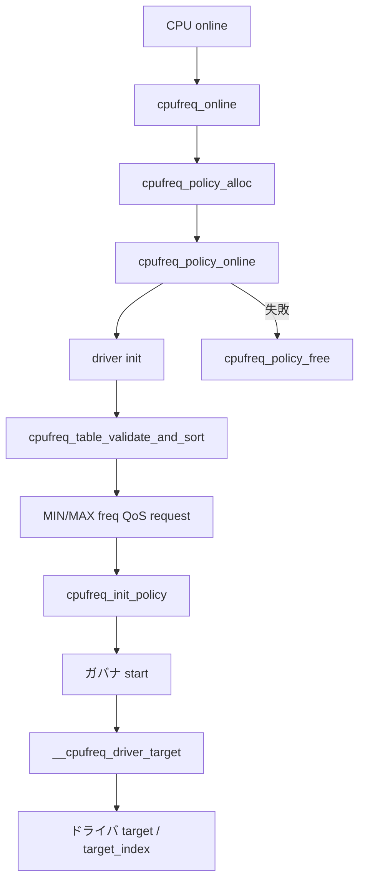

# 第9章 cpufreq コアと policy

> **本章で読むソース**
>
> - [`include/linux/cpufreq.h` L53-L86](https://github.com/gregkh/linux/blob/v6.18.38/include/linux/cpufreq.h#L53-L86)
> - [`include/linux/cpufreq.h` L709-L714](https://github.com/gregkh/linux/blob/v6.18.38/include/linux/cpufreq.h#L709-L714)
> - [`drivers/cpufreq/cpufreq.c` L1251-L1315](https://github.com/gregkh/linux/blob/v6.18.38/drivers/cpufreq/cpufreq.c#L1251-L1315)
> - [`drivers/cpufreq/cpufreq.c` L1406-L1480](https://github.com/gregkh/linux/blob/v6.18.38/drivers/cpufreq/cpufreq.c#L1406-L1480)
> - [`drivers/cpufreq/cpufreq.c` L1116-L1162](https://github.com/gregkh/linux/blob/v6.18.38/drivers/cpufreq/cpufreq.c#L1116-L1162)
> - [`drivers/cpufreq/cpufreq.c` L1587-L1614](https://github.com/gregkh/linux/blob/v6.18.38/drivers/cpufreq/cpufreq.c#L1587-L1614)
> - [`drivers/cpufreq/cpufreq.c` L2349-L2389](https://github.com/gregkh/linux/blob/v6.18.38/drivers/cpufreq/cpufreq.c#L2349-L2389)

## この章の狙い

`drivers/cpufreq/cpufreq.c` が束ねる **policy** と **周波数テーブル**、CPU online 時の初期化経路を追う。
ガバナやドライバが参照する `min` / `max` / `cur` と `freq_table` の関係を押さえる。

## 前提

- [第1章 電源管理と CPU ライフサイクルの全体像](../part00-foundation/01-power-cpu-overview.md) の cpufreq 三層構造
- [第7章 PM QoS と制約の集約](../part01-system-pm/07-pm-qos.md) の `freq_constraints`

## struct cpufreq_policy

同一クロックを共有する CPU 群を policy 一つで管理する。

[`include/linux/cpufreq.h` L53-L86](https://github.com/gregkh/linux/blob/v6.18.38/include/linux/cpufreq.h#L53-L86)

```c
struct cpufreq_policy {
	/* CPUs sharing clock, require sw coordination */
	cpumask_var_t		cpus;	/* Online CPUs only */
	cpumask_var_t		related_cpus; /* Online + Offline CPUs */
	cpumask_var_t		real_cpus; /* Related and present */

	unsigned int		shared_type; /* ACPI: ANY or ALL affected CPUs
						should set cpufreq */
	unsigned int		cpu;    /* cpu managing this policy, must be online */

	struct clk		*clk;
	struct cpufreq_cpuinfo	cpuinfo;/* see above */

	unsigned int		min;    /* in kHz */
	unsigned int		max;    /* in kHz */
	unsigned int		cur;    /* in kHz, only needed if cpufreq
					 * governors are used */
	unsigned int		suspend_freq; /* freq to set during suspend */

	unsigned int		policy; /* see above */
	unsigned int		last_policy; /* policy before unplug */
	struct cpufreq_governor	*governor; /* see below */
	void			*governor_data;
	char			last_governor[CPUFREQ_NAME_LEN]; /* last governor used */

	struct work_struct	update; /* if update_policy() needs to be
					 * called, but you're in IRQ context */

	struct freq_constraints	constraints;
	struct freq_qos_request	*min_freq_req;
	struct freq_qos_request	*max_freq_req;

	struct cpufreq_frequency_table	*freq_table;
	enum cpufreq_table_sorting freq_table_sorted;
```

`cpus` はオンライン CPU のみ、`related_cpus` はオフライン CPU も含む。
`constraints` は第7章の frequency QoS と接続され、`min` と `max` の有効範囲を狭める。

## cpufreq_frequency_table

ドライバが提供する離散周波数一覧は `cpufreq_frequency_table` の配列で表す。

[`include/linux/cpufreq.h` L709-L714](https://github.com/gregkh/linux/blob/v6.18.38/include/linux/cpufreq.h#L709-L714)

```c
struct cpufreq_frequency_table {
	unsigned int	flags;
	unsigned int	driver_data; /* driver specific data, not used by core */
	unsigned int	frequency; /* kHz - doesn't need to be in ascending
				    * order */
};
```

末尾は `CPUFREQ_TABLE_END` で終端する。
`cpufreq_table_validate_and_sort` が登録時に並べ替えと検証を行い、`freq_table_sorted` に結果を記録する。

末尾は `CPUFREQ_TABLE_END` で終端する。
`cpufreq_table_validate_and_sort` が登録時に並べ替えと検証を行い、`freq_table_sorted` に結果を記録する。

## cpufreq_policy_alloc

新規 CPU に policy が無いとき、`cpufreq_online` は `cpufreq_policy_alloc` で policy オブジェクトを確保する。

[`drivers/cpufreq/cpufreq.c` L1251-L1290](https://github.com/gregkh/linux/blob/v6.18.38/drivers/cpufreq/cpufreq.c#L1251-L1290)

```c
static struct cpufreq_policy *cpufreq_policy_alloc(unsigned int cpu)
{
	struct cpufreq_policy *policy;
	struct device *dev = get_cpu_device(cpu);
	int ret;

	if (!dev)
		return NULL;

	policy = kzalloc(sizeof(*policy), GFP_KERNEL);
	if (!policy)
		return NULL;

	if (!alloc_cpumask_var(&policy->cpus, GFP_KERNEL))
		goto err_free_policy;

	if (!zalloc_cpumask_var(&policy->related_cpus, GFP_KERNEL))
		goto err_free_cpumask;

	if (!zalloc_cpumask_var(&policy->real_cpus, GFP_KERNEL))
		goto err_free_rcpumask;

	init_completion(&policy->kobj_unregister);
	ret = kobject_init_and_add(&policy->kobj, &ktype_cpufreq,
				   cpufreq_global_kobject, "policy%u", cpu);
```

続けて `freq_constraints_init` と MIN/MAX QoS notifier の登録、`policy->update` work の初期化まで行う。
**最適化の工夫**：policy 確保時に kobject と freq QoS をまとめて初期化し、online 経路の失敗時は `cpufreq_policy_free` で対称に片付ける。

## cpufreq_policy_online とドライバ init

`cpufreq_policy_online` はドライバ `init`、周波数テーブル検証、`related_cpus` への per-CPU policy ポインタ設置までを担う。

[`drivers/cpufreq/cpufreq.c` L1406-L1441](https://github.com/gregkh/linux/blob/v6.18.38/drivers/cpufreq/cpufreq.c#L1406-L1441)

```c
		cpumask_copy(policy->cpus, cpumask_of(cpu));

		/*
		 * Call driver. From then on the cpufreq must be able
		 * to accept all calls to ->verify and ->setpolicy for this CPU.
		 */
		ret = cpufreq_driver->init(policy);
		if (ret) {
			pr_debug("%s: %d: initialization failed\n", __func__,
				 __LINE__);
			goto out_clear_policy;
		}

		/*
		 * The initialization has succeeded and the policy is online.
		 * If there is a problem with its frequency table, take it
		 * offline and drop it.
		 */
		ret = cpufreq_table_validate_and_sort(policy);
		if (ret)
			goto out_offline_policy;

		/* related_cpus should at least include policy->cpus. */
		cpumask_copy(policy->related_cpus, policy->cpus);
	}

	/*
	 * affected cpus must always be the one, which are online. We aren't
	 * managing offline cpus here.
	 */
	cpumask_and(policy->cpus, policy->cpus, cpu_online_mask);

	if (new_policy) {
		for_each_cpu(j, policy->related_cpus) {
			per_cpu(cpufreq_cpu_data, j) = policy;
			add_cpu_dev_symlink(policy, j, get_cpu_device(j));
		}
```

新規 policy では続けて MIN/MAX の freq QoS request を `constraints` に追加する。

[`drivers/cpufreq/cpufreq.c` L1451-L1480](https://github.com/gregkh/linux/blob/v6.18.38/drivers/cpufreq/cpufreq.c#L1451-L1480)

```c
		ret = freq_qos_add_request(&policy->constraints,
					   policy->min_freq_req, FREQ_QOS_MIN,
					   FREQ_QOS_MIN_DEFAULT_VALUE);
		if (ret < 0) {
			/*
			 * So we don't call freq_qos_remove_request() for an
			 * uninitialized request.
			 */
			kfree(policy->min_freq_req);
			policy->min_freq_req = NULL;
			goto out_destroy_policy;
		}

		/*
		 * This must be initialized right here to avoid calling
		 * freq_qos_remove_request() on uninitialized request in case
		 * of errors.
		 */
		policy->max_freq_req = policy->min_freq_req + 1;

		ret = freq_qos_add_request(&policy->constraints,
					   policy->max_freq_req, FREQ_QOS_MAX,
					   FREQ_QOS_MAX_DEFAULT_VALUE);
		if (ret < 0) {
			policy->max_freq_req = NULL;
			goto out_destroy_policy;
		}

		blocking_notifier_call_chain(&cpufreq_policy_notifier_list,
				CPUFREQ_CREATE_POLICY, policy);
```

テーブル検証に失敗した policy は `out_offline_policy` でドライバ `offline` / `exit` を呼び、半端な状態を公開しない。

## cpufreq_init_policy

sysfs や stats の準備が終わると `cpufreq_init_policy` がガバナを選び `cpufreq_set_policy` で開始する。

[`drivers/cpufreq/cpufreq.c` L1116-L1158](https://github.com/gregkh/linux/blob/v6.18.38/drivers/cpufreq/cpufreq.c#L1116-L1158)

```c
static int cpufreq_init_policy(struct cpufreq_policy *policy)
{
	struct cpufreq_governor *gov = NULL;
	unsigned int pol = CPUFREQ_POLICY_UNKNOWN;
	int ret;

	if (has_target()) {
		/* Update policy governor to the one used before hotplug. */
		if (policy->last_governor[0] != '\0')
			gov = get_governor(policy->last_governor);
		if (gov) {
			pr_debug("Restoring governor %s for cpu %d\n",
				 gov->name, policy->cpu);
		} else {
			gov = get_governor(default_governor);
		}

		if (!gov) {
			gov = cpufreq_default_governor();
			__module_get(gov->owner);
		}

	} else {

		/* Use the default policy if there is no last_policy. */
		if (policy->last_policy) {
			pol = policy->last_policy;
		} else {
			pol = cpufreq_parse_policy(default_governor);
```

`cpufreq_init_policy` に失敗すると `out_destroy_policy` へ落ち、ドライバ offline と policy 解放が行われる。

## cpufreq_online

CPU hotplug の online 経路から `cpufreq_online` が呼ばれる。

[`drivers/cpufreq/cpufreq.c` L1587-L1614](https://github.com/gregkh/linux/blob/v6.18.38/drivers/cpufreq/cpufreq.c#L1587-L1614)

```c
static int cpufreq_online(unsigned int cpu)
{
	struct cpufreq_policy *policy;
	bool new_policy;
	int ret;

	pr_debug("%s: bringing CPU%u online\n", __func__, cpu);

	/* Check if this CPU already has a policy to manage it */
	policy = per_cpu(cpufreq_cpu_data, cpu);
	if (policy) {
		WARN_ON(!cpumask_test_cpu(cpu, policy->related_cpus));
		if (!policy_is_inactive(policy))
			return cpufreq_add_policy_cpu(policy, cpu);

		/* This is the only online CPU for the policy.  Start over. */
		new_policy = false;
	} else {
		new_policy = true;
		policy = cpufreq_policy_alloc(cpu);
		if (!policy)
			return -ENOMEM;
	}

	ret = cpufreq_policy_online(policy, cpu, new_policy);
	if (ret) {
		cpufreq_policy_free(policy);
		return ret;
	}
```

`cpufreq_policy_online` が失敗した新規 policy は `cpufreq_policy_free` で即解放される。

既存 policy に CPU を追加する場合と、新規 policy を作る場合で分岐する。
**最適化の工夫**：`per_cpu(cpufreq_cpu_data)` で CPU から policy を O(1) 参照し、共有 policy への追加を `cpufreq_add_policy_cpu` に委譲する。

## __cpufreq_driver_target

ガバナが目標周波数を決めたあと、フレームワークは `__cpufreq_driver_target` でドライバへ届ける。

[`drivers/cpufreq/cpufreq.c` L2349-L2389](https://github.com/gregkh/linux/blob/v6.18.38/drivers/cpufreq/cpufreq.c#L2349-L2389)

```c
int __cpufreq_driver_target(struct cpufreq_policy *policy,
			    unsigned int target_freq,
			    unsigned int relation)
{
	unsigned int old_target_freq = target_freq;

	if (cpufreq_disabled())
		return -ENODEV;

	target_freq = __resolve_freq(policy, target_freq, policy->min,
				     policy->max, relation);

	pr_debug("target for CPU %u: %u kHz, relation %u, requested %u kHz\n",
		 policy->cpu, target_freq, relation, old_target_freq);

	/*
	 * This might look like a redundant call as we are checking it again
	 * after finding index. But it is left intentionally for cases where
	 * exactly same freq is called again and so we can save on few function
	 * calls.
	 */
	if (target_freq == policy->cur &&
	    !(cpufreq_driver->flags & CPUFREQ_NEED_UPDATE_LIMITS))
		return 0;

	if (cpufreq_driver->target) {
		/*
		 * If the driver hasn't setup a single inefficient frequency,
		 * it's unlikely it knows how to decode CPUFREQ_RELATION_E.
		 */
		if (!policy->efficiencies_available)
			relation &= ~CPUFREQ_RELATION_E;

		return cpufreq_driver->target(policy, target_freq, relation);
	}

	if (!cpufreq_driver->target_index)
		return -EINVAL;

	return __target_index(policy, policy->cached_resolved_idx);
}
```

`target` と `target_index` は排他的で、登録時にどちらか一方だけが許可される。
同一周波数への再設定は早期 return し、不要なハードウェアアクセスを避ける。

## policy ライフサイクル



## まとめ

cpufreq フレームワークは policy 単位で CPU 集合と周波数制約を束ねる。
CPU online では alloc、driver init、freq QoS、ガバナ開始までが一続きの経路である。
`freq_table` はドライバ固有データと kHz 値を持ち、登録時に検証される。
`__cpufreq_driver_target` が `min` / `max` 内へ周波数を解決し、ドライバコールバックへ渡す。

## 関連する章

- 前章：[Energy Model と性能ドメイン](../part01-system-pm/08-energy-model.md)
- 次章：[x86 代表ドライバと core 接続](10-cpufreq-drivers-x86.md)
- [第7章 PM QoS](../part01-system-pm/07-pm-qos.md) の frequency QoS
