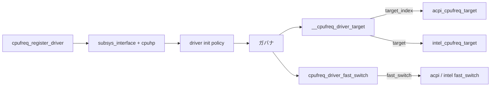

# 第10章 x86 代表ドライバと core 接続

> **本章で読むソース**
>
> - [`drivers/cpufreq/cpufreq.c` L2898-L2919](https://github.com/gregkh/linux/blob/v6.18.38/drivers/cpufreq/cpufreq.c#L2898-L2919)
> - [`drivers/cpufreq/cpufreq.c` L2197-L2212](https://github.com/gregkh/linux/blob/v6.18.38/drivers/cpufreq/cpufreq.c#L2197-L2212)
> - [`drivers/cpufreq/acpi-cpufreq.c` L966-L976](https://github.com/gregkh/linux/blob/v6.18.38/drivers/cpufreq/acpi-cpufreq.c#L966-L976)
> - [`drivers/cpufreq/acpi-cpufreq.c` L453-L472](https://github.com/gregkh/linux/blob/v6.18.38/drivers/cpufreq/acpi-cpufreq.c#L453-L472)
> - [`drivers/cpufreq/intel_pstate.c` L3116-L3128](https://github.com/gregkh/linux/blob/v6.18.38/drivers/cpufreq/intel_pstate.c#L3116-L3128)
> - [`drivers/cpufreq/intel_pstate.c` L3427-L3440](https://github.com/gregkh/linux/blob/v6.18.38/drivers/cpufreq/intel_pstate.c#L3427-L3440)
> - [`drivers/cpufreq/intel_pstate.c` L3261-L3272](https://github.com/gregkh/linux/blob/v6.18.38/drivers/cpufreq/intel_pstate.c#L3261-L3272)

## この章の狙い

`cpufreq_register_driver` がドライバを core に差し込む契約を押さえ、x86 代表の **acpi-cpufreq** と **intel_pstate** が `verify` / `target` / `target_index` / `fast_switch` をどう実装するかを追う。
ドライバのカタログ列挙ではなく、interface と登録経路に焦点を当てる。

## 前提

- [第9章 cpufreq コアと policy](09-cpufreq-framework-policy.md) の `cpufreq_policy` と `__cpufreq_driver_target`
- [第1章](../part00-foundation/01-power-cpu-overview.md) の `cpufreq_driver` 構造体

## cpufreq_register_driver の契約

登録時にコールバックの組み合わせが検査される。

[`drivers/cpufreq/cpufreq.c` L2898-L2919](https://github.com/gregkh/linux/blob/v6.18.38/drivers/cpufreq/cpufreq.c#L2898-L2919)

```c
int cpufreq_register_driver(struct cpufreq_driver *driver_data)
{
	unsigned long flags;
	int ret;

	if (cpufreq_disabled())
		return -ENODEV;

	/*
	 * The cpufreq core depends heavily on the availability of device
	 * structure, make sure they are available before proceeding further.
	 */
	if (!get_cpu_device(0))
		return -EPROBE_DEFER;

	if (!driver_data || !driver_data->verify || !driver_data->init ||
	     (driver_data->target_index && driver_data->target) ||
	     (!!driver_data->setpolicy == (driver_data->target_index || driver_data->target)) ||
	     (!driver_data->get_intermediate != !driver_data->target_intermediate) ||
	     (!driver_data->online != !driver_data->offline) ||
		 (driver_data->adjust_perf && !driver_data->fast_switch))
		return -EINVAL;
```

`target` と `target_index` は同時登録不可である。
`setpolicy` 方式と `target` 方式は排他的である。
**最適化の工夫**：登録時に契約を固定し、実行時の分岐を `__cpufreq_driver_target` 側に集約する。

## fast_switch 経路

`fast_switch` はスリープ可能な workqueue へ退避せず、その場で周波数を変えられるドライバコールバックである。
`cpufreq_add_update_util_hook` 経由のコールバックは RCU-sched read-side から呼ばれ、スリープしてはならない。
schedutil の single-policy 経路は rq ロック下（IRQ 無効を含む）から `cpufreq_driver_fast_switch` を呼ぶ。

[`drivers/cpufreq/cpufreq.c` L2197-L2212](https://github.com/gregkh/linux/blob/v6.18.38/drivers/cpufreq/cpufreq.c#L2197-L2212)

```c
unsigned int cpufreq_driver_fast_switch(struct cpufreq_policy *policy,
					unsigned int target_freq)
{
	unsigned int freq;
	int cpu;

	target_freq = clamp_val(target_freq, policy->min, policy->max);
	freq = cpufreq_driver->fast_switch(policy, target_freq);

	if (!freq)
		return 0;

	policy->cur = freq;
	arch_set_freq_scale(policy->related_cpus, freq,
			    arch_scale_freq_ref(policy->cpu));
	cpufreq_stats_record_transition(policy, freq);
```

`policy->fast_switch_enabled` が真のときだけドライバの `fast_switch` が使われる。

## acpi-cpufreq

ACPI _PSS ベースの従来ドライバは `target_index` と `fast_switch` を提供する。

[`drivers/cpufreq/acpi-cpufreq.c` L966-L976](https://github.com/gregkh/linux/blob/v6.18.38/drivers/cpufreq/acpi-cpufreq.c#L966-L976)

```c
static struct cpufreq_driver acpi_cpufreq_driver = {
	.verify		= cpufreq_generic_frequency_table_verify,
	.target_index	= acpi_cpufreq_target,
	.fast_switch	= acpi_cpufreq_fast_switch,
	.bios_limit	= acpi_processor_get_bios_limit,
	.init		= acpi_cpufreq_cpu_init,
	.exit		= acpi_cpufreq_cpu_exit,
	.resume		= acpi_cpufreq_resume,
	.name		= "acpi-cpufreq",
	.attr		= acpi_cpufreq_attr,
};
```

`verify` は汎用のテーブル検証を使い、`target_index` が P 状態 index をハードウェアへ書き込む。

[`drivers/cpufreq/acpi-cpufreq.c` L453-L472](https://github.com/gregkh/linux/blob/v6.18.38/drivers/cpufreq/acpi-cpufreq.c#L453-L472)

```c
static unsigned int acpi_cpufreq_fast_switch(struct cpufreq_policy *policy,
					     unsigned int target_freq)
{
	struct acpi_cpufreq_data *data = policy->driver_data;
	struct acpi_processor_performance *perf;
	struct cpufreq_frequency_table *entry;
	unsigned int next_perf_state, next_freq, index;

	/*
	 * Find the closest frequency above target_freq.
	 */
	if (policy->cached_target_freq == target_freq)
		index = policy->cached_resolved_idx;
	else
		index = cpufreq_table_find_index_dl(policy, target_freq,
						    false);

	entry = &policy->freq_table[index];
	next_freq = entry->frequency;
	next_perf_state = entry->driver_data;
```

`cached_target_freq` と `cached_resolved_idx` で直前の解決結果を再利用し、テーブル走査を減らす。

## intel_pstate の二モード

Intel 向けは **active**（`intel_pstate`）と **passive**（`intel_cpufreq`）の二つの `cpufreq_driver` を切り替える。
sysfs の `status` は登録中のドライバを `active` / `passive` と表示する。

[`drivers/cpufreq/intel_pstate.c` L3494-L3501](https://github.com/gregkh/linux/blob/v6.18.38/drivers/cpufreq/intel_pstate.c#L3494-L3501)

```c
static ssize_t intel_pstate_show_status(char *buf)
{
	if (!intel_pstate_driver)
		return sprintf(buf, "off\n");

	return sprintf(buf, "%s\n", intel_pstate_driver == &intel_pstate ?
					"active" : "passive");
}
```

active モードは `intel_pstate` ドライバが内蔵ガバナで P-state を直接制御し、cpufreq コアのガバナを使わない。
`setpolicy` で性能方針を渡す。

[`drivers/cpufreq/intel_pstate.c` L3116-L3128](https://github.com/gregkh/linux/blob/v6.18.38/drivers/cpufreq/intel_pstate.c#L3116-L3128)

```c
static struct cpufreq_driver intel_pstate = {
	.flags		= CPUFREQ_CONST_LOOPS,
	.verify		= intel_pstate_verify_policy,
	.setpolicy	= intel_pstate_set_policy,
	.suspend	= intel_pstate_suspend,
	.resume		= intel_pstate_resume,
	.init		= intel_pstate_cpu_init,
	.exit		= intel_pstate_cpu_exit,
	.offline	= intel_pstate_cpu_offline,
	.online		= intel_pstate_cpu_online,
	.update_limits	= intel_pstate_update_limits,
	.name		= "intel_pstate",
};
```

passive モードは `intel_cpufreq` ドライバが cpufreq ガバナ配下で `target` と `fast_switch` を提供する。
schedutil など外部ガバナが `__cpufreq_driver_target` / `cpufreq_driver_fast_switch` 経由で P-state を変える。

[`drivers/cpufreq/intel_pstate.c` L3427-L3440](https://github.com/gregkh/linux/blob/v6.18.38/drivers/cpufreq/intel_pstate.c#L3427-L3440)

```c
static struct cpufreq_driver intel_cpufreq = {
	.flags		= CPUFREQ_CONST_LOOPS,
	.verify		= intel_cpufreq_verify_policy,
	.target		= intel_cpufreq_target,
	.fast_switch	= intel_cpufreq_fast_switch,
	.init		= intel_cpufreq_cpu_init,
	.exit		= intel_cpufreq_cpu_exit,
	.offline	= intel_cpufreq_cpu_offline,
	.online		= intel_pstate_cpu_online,
	.suspend	= intel_cpufreq_suspend,
	.resume		= intel_pstate_resume,
	.update_limits	= intel_pstate_update_limits,
	.name		= "intel_cpufreq",
};
```

[`drivers/cpufreq/intel_pstate.c` L3261-L3272](https://github.com/gregkh/linux/blob/v6.18.38/drivers/cpufreq/intel_pstate.c#L3261-L3272)

```c
static unsigned int intel_cpufreq_fast_switch(struct cpufreq_policy *policy,
					      unsigned int target_freq)
{
	struct cpudata *cpu = all_cpu_data[policy->cpu];
	int target_pstate;

	target_pstate = intel_pstate_freq_to_hwp(cpu, target_freq);

	target_pstate = intel_cpufreq_update_pstate(policy, target_pstate, true);

	return target_pstate * cpu->pstate.scaling;
}
```

`fast_switch` 引数 `true` がトレース上の高速経路を示す（コメント参照）。

## ドライバ登録から周波数変更まで



## まとめ

ドライバは `cpufreq_register_driver` で単一登録され、コールバックの組み合わせが静的に検証される。
acpi-cpufreq は `target_index` + `fast_switch`、intel_pstate は active（`setpolicy`）と passive（`target`+`fast_switch`）の二形態を持つ。
ガバナはフレームワーク API 経由でのみドライバを触り、直接ハードウェアを操作しない。

## 関連する章

- 前章：[cpufreq コアと policy](09-cpufreq-framework-policy.md)
- 次章：[schedutil ガバナ連携](11-cpufreq-governor-schedutil.md)
- [第8章 Energy Model](../part01-system-pm/08-energy-model.md) の `em_dev_register_perf_domain`
