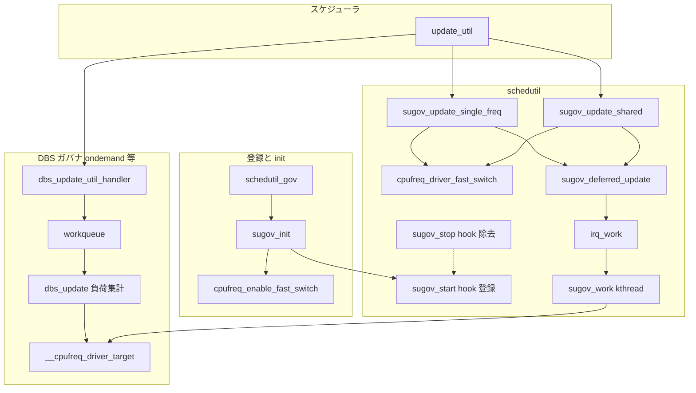

# 第11章 schedutil ガバナ連携

> **本章で読むソース**
>
> - [`include/linux/cpufreq.h` L587-L601](https://github.com/gregkh/linux/blob/v6.18.38/include/linux/cpufreq.h#L587-L601)
> - [`drivers/cpufreq/cpufreq_governor.c` L114-L134](https://github.com/gregkh/linux/blob/v6.18.38/drivers/cpufreq/cpufreq_governor.c#L114-L134)
> - [`drivers/cpufreq/cpufreq_governor.c` L270-L297](https://github.com/gregkh/linux/blob/v6.18.38/drivers/cpufreq/cpufreq_governor.c#L270-L297)
> - [`kernel/sched/cpufreq.c` L30-L42](https://github.com/gregkh/linux/blob/v6.18.38/kernel/sched/cpufreq.c#L30-L42)
> - [`kernel/sched/cpufreq_schedutil.c` L741-L801](https://github.com/gregkh/linux/blob/v6.18.38/kernel/sched/cpufreq_schedutil.c#L741-L801)
> - [`kernel/sched/cpufreq_schedutil.c` L844-L890](https://github.com/gregkh/linux/blob/v6.18.38/kernel/sched/cpufreq_schedutil.c#L844-L890)
> - [`kernel/sched/cpufreq_schedutil.c` L515-L576](https://github.com/gregkh/linux/blob/v6.18.38/kernel/sched/cpufreq_schedutil.c#L515-L576)
> - [`kernel/sched/cpufreq_schedutil.c` L419-L458](https://github.com/gregkh/linux/blob/v6.18.38/kernel/sched/cpufreq_schedutil.c#L419-L458)
> - [`kernel/sched/cpufreq_schedutil.c` L915-L938](https://github.com/gregkh/linux/blob/v6.18.38/kernel/sched/cpufreq_schedutil.c#L915-L938)

## この章の狙い

ガバナ共通基盤（DBS 系）と **schedutil** の連携を追う。
`kernel/sched/cpufreq_schedutil.c` がスケジューラの利用率更新から `cpufreq_driver_fast_switch` または遅延更新へどう届くかを押さえる。
利用率の算出そのものは [プロセスとスケジューラ](../../sched/README.md) に委譲する。

## 前提

- [第9章 cpufreq コアと policy](09-cpufreq-framework-policy.md) の `__cpufreq_driver_target`
- [第10章 x86 代表ドライバ](10-cpufreq-drivers-x86.md) の `fast_switch`

## struct cpufreq_governor

ガバナは policy に attach され、start/stop でサンプリングを制御する。

[`include/linux/cpufreq.h` L587-L601](https://github.com/gregkh/linux/blob/v6.18.38/include/linux/cpufreq.h#L587-L601)

```c
struct cpufreq_governor {
	char	name[CPUFREQ_NAME_LEN];
	int	(*init)(struct cpufreq_policy *policy);
	void	(*exit)(struct cpufreq_policy *policy);
	int	(*start)(struct cpufreq_policy *policy);
	void	(*stop)(struct cpufreq_policy *policy);
	void	(*limits)(struct cpufreq_policy *policy);
	ssize_t	(*show_setspeed)	(struct cpufreq_policy *policy,
					 char *buf);
	int	(*store_setspeed)	(struct cpufreq_policy *policy,
					 unsigned int freq);
	struct list_head	governor_list;
	struct module		*owner;
	u8			flags;
};
```

`CPUFREQ_GOV_DYNAMIC_SWITCHING` が付いたガバナは自前で周波数を変える（ondemand 系と schedutil）。

## DBS 基盤の dbs_update

ondemand / conservative は `cpufreq_governor.c` の **DBS**（Demand Based Switching）基盤を共有する。
`dbs_update` が policy 内 CPU の負荷率を集計する。

[`drivers/cpufreq/cpufreq_governor.c` L114-L134](https://github.com/gregkh/linux/blob/v6.18.38/drivers/cpufreq/cpufreq_governor.c#L114-L134)

```c
unsigned int dbs_update(struct cpufreq_policy *policy)
{
	struct policy_dbs_info *policy_dbs = policy->governor_data;
	struct dbs_data *dbs_data = policy_dbs->dbs_data;
	unsigned int ignore_nice = dbs_data->ignore_nice_load;
	unsigned int max_load = 0, idle_periods = UINT_MAX;
	unsigned int sampling_rate, io_busy, j;

	/*
	 * Sometimes governors may use an additional multiplier to increase
	 * sample delays temporarily.  Apply that multiplier to sampling_rate
	 * so as to keep the wake-up-from-idle detection logic a bit
	 * conservative.
	 */
	sampling_rate = dbs_data->sampling_rate * policy_dbs->rate_mult;
	/*
	 * For the purpose of ondemand, waiting for disk IO is an indication
	 * that you're performance critical, and not that the system is actually
	 * idle, so do not add the iowait time to the CPU idle time then.
	 */
	io_busy = dbs_data->io_is_busy;
```

各 CPU の idle 時間差分から load% を求め、policy 内の最大値を返す。

## dbs_update_util_handler

DBS ガバナは `update_util` フックからサンプル間隔を守りつつ work を起こす。

[`drivers/cpufreq/cpufreq_governor.c` L270-L297](https://github.com/gregkh/linux/blob/v6.18.38/drivers/cpufreq/cpufreq_governor.c#L270-L297)

```c
static void dbs_update_util_handler(struct update_util_data *data, u64 time,
				    unsigned int flags)
{
	struct cpu_dbs_info *cdbs = container_of(data, struct cpu_dbs_info, update_util);
	struct policy_dbs_info *policy_dbs = cdbs->policy_dbs;
	u64 delta_ns, lst;

	if (!cpufreq_this_cpu_can_update(policy_dbs->policy))
		return;

	/*
	 * The work may not be allowed to be queued up right now.
	 * Possible reasons:
	 * - Work has already been queued up or is in progress.
	 * - It is too early (too little time from the previous sample).
	 */
	if (policy_dbs->work_in_progress)
		return;

	/*
	 * If the reads below are reordered before the check above, the value
	 * of sample_delay_ns used in the computation may be stale.
	 */
	smp_rmb();
	lst = READ_ONCE(policy_dbs->last_sample_time);
	delta_ns = time - lst;
	if ((s64)delta_ns < policy_dbs->sample_delay_ns)
		return;
```

**最適化の工夫**：`sample_delay_ns` と `work_in_progress` の読み取り順を `smp_rmb` で固定し、レースで古い間隔を使わない。

## schedutil の登録と init

schedutil は `struct cpufreq_governor` を定義し、`cpufreq_governor_init` で core に登録される。

[`kernel/sched/cpufreq_schedutil.c` L915-L938](https://github.com/gregkh/linux/blob/v6.18.38/kernel/sched/cpufreq_schedutil.c#L915-L938)

```c
static struct cpufreq_governor schedutil_gov = {
	.name			= "schedutil",
	.owner			= THIS_MODULE,
	.flags			= CPUFREQ_GOV_DYNAMIC_SWITCHING,
	.init			= sugov_init,
	.exit			= sugov_exit,
	.start			= sugov_start,
	.stop			= sugov_stop,
	.limits			= sugov_limits,
};

#ifdef CONFIG_CPU_FREQ_DEFAULT_GOV_SCHEDUTIL
struct cpufreq_governor *cpufreq_default_governor(void)
{
	return &schedutil_gov;
}
#endif

cpufreq_governor_init(schedutil_gov);
```

policy へ attach されると `sugov_init` が `cpufreq_enable_fast_switch`、kthread 作成、tunables 登録を行う。

[`kernel/sched/cpufreq_schedutil.c` L741-L759](https://github.com/gregkh/linux/blob/v6.18.38/kernel/sched/cpufreq_schedutil.c#L741-L759)

```c
static int sugov_init(struct cpufreq_policy *policy)
{
	struct sugov_policy *sg_policy;
	struct sugov_tunables *tunables;
	int ret = 0;

	/* State should be equivalent to EXIT */
	if (policy->governor_data)
		return -EBUSY;

	cpufreq_enable_fast_switch(policy);

	sg_policy = sugov_policy_alloc(policy);
	if (!sg_policy) {
		ret = -ENOMEM;
		goto disable_fast_switch;
	}

	ret = sugov_kthread_create(sg_policy);
```

init 失敗時は kthread 停止、`sugov_policy_free`、`cpufreq_disable_fast_switch` へ巻き戻す。

## sugov_start と update_util フック

`start` で policy 内各 CPU に `cpufreq_add_update_util_hook` を設置する。
shared policy では `sugov_update_shared`、single policy では `fast_switch` 可否で handler を選ぶ。

[`kernel/sched/cpufreq_schedutil.c` L844-L875](https://github.com/gregkh/linux/blob/v6.18.38/kernel/sched/cpufreq_schedutil.c#L844-L875)

```c
static int sugov_start(struct cpufreq_policy *policy)
{
	struct sugov_policy *sg_policy = policy->governor_data;
	void (*uu)(struct update_util_data *data, u64 time, unsigned int flags);
	unsigned int cpu;

	sg_policy->freq_update_delay_ns	= sg_policy->tunables->rate_limit_us * NSEC_PER_USEC;
	sg_policy->last_freq_update_time	= 0;
	sg_policy->next_freq			= 0;
	sg_policy->work_in_progress		= false;
	sg_policy->limits_changed		= false;
	sg_policy->cached_raw_freq		= 0;

	sg_policy->need_freq_update = cpufreq_driver_test_flags(CPUFREQ_NEED_UPDATE_LIMITS);

	if (policy_is_shared(policy))
		uu = sugov_update_shared;
	else if (policy->fast_switch_enabled && cpufreq_driver_has_adjust_perf())
		uu = sugov_update_single_perf;
	else
		uu = sugov_update_single_freq;

	for_each_cpu(cpu, policy->cpus) {
		struct sugov_cpu *sg_cpu = &per_cpu(sugov_cpu, cpu);

		memset(sg_cpu, 0, sizeof(*sg_cpu));
		sg_cpu->cpu = cpu;
		sg_cpu->sg_policy = sg_policy;
		cpufreq_add_update_util_hook(cpu, &sg_cpu->update_util, uu);
	}
	return 0;
}
```

フック登録は RCU-sched read-side から呼ばれるコールバックを `per_cpu(cpufreq_update_util_data)` に公開する。

[`kernel/sched/cpufreq.c` L30-L42](https://github.com/gregkh/linux/blob/v6.18.38/kernel/sched/cpufreq.c#L30-L42)

```c
void cpufreq_add_update_util_hook(int cpu, struct update_util_data *data,
			void (*func)(struct update_util_data *data, u64 time,
				     unsigned int flags))
{
	if (WARN_ON(!data || !func))
		return;

	if (WARN_ON(per_cpu(cpufreq_update_util_data, cpu)))
		return;

	data->func = func;
	rcu_assign_pointer(per_cpu(cpufreq_update_util_data, cpu), data);
}
```

## sugov_update_shared と遅延更新

shared policy では `update_lock` 下で `sugov_next_freq_shared` が集約し、`fast_switch_enabled` で分岐する。

[`kernel/sched/cpufreq_schedutil.c` L514-L541](https://github.com/gregkh/linux/blob/v6.18.38/kernel/sched/cpufreq_schedutil.c#L514-L541)

```c
static void
sugov_update_shared(struct update_util_data *hook, u64 time, unsigned int flags)
{
	struct sugov_cpu *sg_cpu = container_of(hook, struct sugov_cpu, update_util);
	struct sugov_policy *sg_policy = sg_cpu->sg_policy;
	unsigned int next_f;

	raw_spin_lock(&sg_policy->update_lock);

	sugov_iowait_boost(sg_cpu, time, flags);
	sg_cpu->last_update = time;

	ignore_dl_rate_limit(sg_cpu);

	if (sugov_should_update_freq(sg_policy, time)) {
		next_f = sugov_next_freq_shared(sg_cpu, time);

		if (!sugov_update_next_freq(sg_policy, time, next_f))
			goto unlock;

		if (sg_policy->policy->fast_switch_enabled)
			cpufreq_driver_fast_switch(sg_policy->policy, next_f);
		else
			sugov_deferred_update(sg_policy);
	}
unlock:
	raw_spin_unlock(&sg_policy->update_lock);
}
```

`fast_switch` 不可時は `sugov_deferred_update` が `irq_work` を積み、kthread work から `__cpufreq_driver_target` する。

[`kernel/sched/cpufreq_schedutil.c` L137-L142](https://github.com/gregkh/linux/blob/v6.18.38/kernel/sched/cpufreq_schedutil.c#L137-L142)

```c
static void sugov_deferred_update(struct sugov_policy *sg_policy)
{
	if (!sg_policy->work_in_progress) {
		sg_policy->work_in_progress = true;
		irq_work_queue(&sg_policy->irq_work);
	}
}
```

[`kernel/sched/cpufreq_schedutil.c` L543-L576](https://github.com/gregkh/linux/blob/v6.18.38/kernel/sched/cpufreq_schedutil.c#L543-L576)

```c
static void sugov_work(struct kthread_work *work)
{
	struct sugov_policy *sg_policy = container_of(work, struct sugov_policy, work);
	unsigned int freq;
	unsigned long flags;

	raw_spin_lock_irqsave(&sg_policy->update_lock, flags);
	freq = sg_policy->next_freq;
	sg_policy->work_in_progress = false;
	raw_spin_unlock_irqrestore(&sg_policy->update_lock, flags);

	mutex_lock(&sg_policy->work_lock);
	__cpufreq_driver_target(sg_policy->policy, freq, CPUFREQ_RELATION_L);
	mutex_unlock(&sg_policy->work_lock);
}

static void sugov_irq_work(struct irq_work *irq_work)
{
	struct sugov_policy *sg_policy;

	sg_policy = container_of(irq_work, struct sugov_policy, irq_work);

	kthread_queue_work(&sg_policy->worker, &sg_policy->work);
}
```

## sugov_stop と exit

`stop` は各 CPU の `cpufreq_remove_update_util_hook` と `synchronize_rcu` のあと、遅延経路の work を同期停止する。

[`kernel/sched/cpufreq_schedutil.c` L877-L890](https://github.com/gregkh/linux/blob/v6.18.38/kernel/sched/cpufreq_schedutil.c#L877-L890)

```c
static void sugov_stop(struct cpufreq_policy *policy)
{
	struct sugov_policy *sg_policy = policy->governor_data;
	unsigned int cpu;

	for_each_cpu(cpu, policy->cpus)
		cpufreq_remove_update_util_hook(cpu);

	synchronize_rcu();

	if (!policy->fast_switch_enabled) {
		irq_work_sync(&sg_policy->irq_work);
		kthread_cancel_work_sync(&sg_policy->work);
	}
}
```

`exit` は kthread 停止、policy 解放、`cpufreq_disable_fast_switch`、sched domain 再構築まで行う。

## sugov_update_single_freq

schedutil は `kernel/sched/cpufreq_schedutil.c` にあり、スケジューラの `update_util` から直接呼ばれる。

[`kernel/sched/cpufreq_schedutil.c` L419-L458](https://github.com/gregkh/linux/blob/v6.18.38/kernel/sched/cpufreq_schedutil.c#L419-L458)

```c
static void sugov_update_single_freq(struct update_util_data *hook, u64 time,
				     unsigned int flags)
{
	struct sugov_cpu *sg_cpu = container_of(hook, struct sugov_cpu, update_util);
	struct sugov_policy *sg_policy = sg_cpu->sg_policy;
	unsigned int cached_freq = sg_policy->cached_raw_freq;
	unsigned long max_cap;
	unsigned int next_f;

	max_cap = arch_scale_cpu_capacity(sg_cpu->cpu);

	if (!sugov_update_single_common(sg_cpu, time, max_cap, flags))
		return;

	next_f = get_next_freq(sg_policy, sg_cpu->util, max_cap);

	if (sugov_hold_freq(sg_cpu) && next_f < sg_policy->next_freq &&
	    !sg_policy->need_freq_update) {
		next_f = sg_policy->next_freq;

		/* Restore cached freq as next_freq has changed */
		sg_policy->cached_raw_freq = cached_freq;
	}

	if (!sugov_update_next_freq(sg_policy, time, next_f))
		return;

	/*
	 * This code runs under rq->lock for the target CPU, so it won't run
	 * concurrently on two different CPUs for the same target and it is not
	 * necessary to acquire the lock in the fast switch case.
	 */
	if (sg_policy->policy->fast_switch_enabled) {
		cpufreq_driver_fast_switch(sg_policy->policy, next_f);
	} else {
		raw_spin_lock(&sg_policy->update_lock);
		sugov_deferred_update(sg_policy);
		raw_spin_unlock(&sg_policy->update_lock);
	}
}
```

`get_next_freq` は `sg_cpu->util`（スケジューラ由来）から目標周波数を決める。
`fast_switch_enabled` ならその場で `cpufreq_driver_fast_switch` を呼び、そうでなければ `sugov_deferred_update` で kthread へ委譲する。

## schedutil と DBS の違い



## まとめ

ガバナは `cpufreq_governor` の init/start/stop/exit で policy に紐づき、周波数決定のポリシーを提供する。
DBS 系は周期サンプリングで idle 時間から負荷を推定し、schedutil はスケジューラ利用率を直接使う。
schedutil は `fast_switch` 対応時にその場で変更し、非対応時は irq work と kthread work 経由で `__cpufreq_driver_target` する。

## 関連する章

- 前章：[x86 代表ドライバ](10-cpufreq-drivers-x86.md)
- 次章：[ondemand と conservative](12-ondemand-conservative.md)
- [プロセスとスケジューラ](../../sched/README.md) の利用率計算
