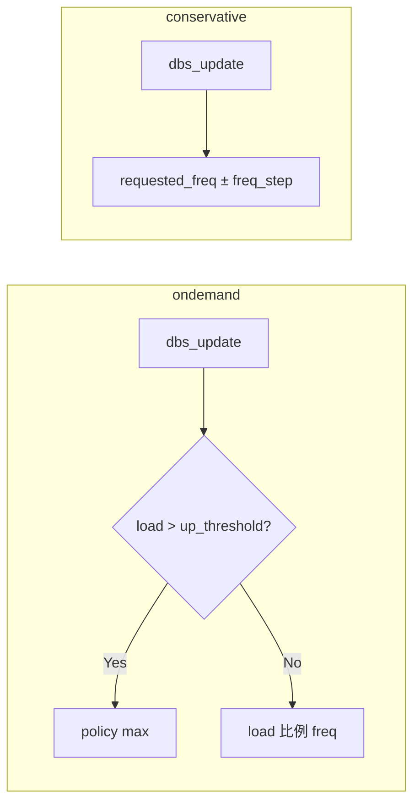

# 第12章 ondemand と conservative ガバナ

> **本章で読むソース**
>
> - [`drivers/cpufreq/cpufreq_ondemand.c` L113-L147](https://github.com/gregkh/linux/blob/v6.18.38/drivers/cpufreq/cpufreq_ondemand.c#L113-L147)
> - [`drivers/cpufreq/cpufreq_ondemand.c` L149-L177](https://github.com/gregkh/linux/blob/v6.18.38/drivers/cpufreq/cpufreq_ondemand.c#L149-L177)
> - [`drivers/cpufreq/cpufreq_ondemand.c` L380-L389](https://github.com/gregkh/linux/blob/v6.18.38/drivers/cpufreq/cpufreq_ondemand.c#L380-L389)
> - [`drivers/cpufreq/cpufreq_conservative.c` L58-L73](https://github.com/gregkh/linux/blob/v6.18.38/drivers/cpufreq/cpufreq_conservative.c#L58-L73)
> - [`drivers/cpufreq/cpufreq_conservative.c` L102-L118](https://github.com/gregkh/linux/blob/v6.18.38/drivers/cpufreq/cpufreq_conservative.c#L102-L118)
> - [`drivers/cpufreq/cpufreq_conservative.c` L327-L337](https://github.com/gregkh/linux/blob/v6.18.38/drivers/cpufreq/cpufreq_conservative.c#L327-L337)

## この章の狙い

第11章の DBS 基盤の上に載る **ondemand** と **conservative** の周波数決定ロジックを追う。
`dbs_update` による負荷サンプリングと、上昇・下降ポリシーの違いを押さえる。

## 前提

- [第11章 schedutil ガバナ連携](11-cpufreq-governor-schedutil.md) の `dbs_update` と `dbs_update_util_handler`
- [第9章 cpufreq コアと policy](09-cpufreq-framework-policy.md) の `__cpufreq_driver_target`

## ondemand の od_update

ondemand は `up_threshold` を超えると最大周波数へ跳び、それ以外は負荷に比例した周波数を選ぶ。

[`drivers/cpufreq/cpufreq_ondemand.c` L113-L147](https://github.com/gregkh/linux/blob/v6.18.38/drivers/cpufreq/cpufreq_ondemand.c#L113-L147)

```c
static void od_update(struct cpufreq_policy *policy)
{
	struct policy_dbs_info *policy_dbs = policy->governor_data;
	struct od_policy_dbs_info *dbs_info = to_dbs_info(policy_dbs);
	struct dbs_data *dbs_data = policy_dbs->dbs_data;
	struct od_dbs_tuners *od_tuners = dbs_data->tuners;
	unsigned int load = dbs_update(policy);

	dbs_info->freq_lo = 0;

	/* Check for frequency increase */
	if (load > dbs_data->up_threshold) {
		/* If switching to max speed, apply sampling_down_factor */
		if (policy->cur < policy->max)
			policy_dbs->rate_mult = dbs_data->sampling_down_factor;
		dbs_freq_increase(policy, policy->max);
	} else {
		/* Calculate the next frequency proportional to load */
		unsigned int freq_next, min_f, max_f;

		min_f = policy->cpuinfo.min_freq;
		max_f = policy->cpuinfo.max_freq;
		freq_next = min_f + load * (max_f - min_f) / 100;

		/* No longer fully busy, reset rate_mult */
		policy_dbs->rate_mult = 1;

		if (od_tuners->powersave_bias)
			freq_next = od_ops.powersave_bias_target(policy,
								 freq_next,
								 CPUFREQ_RELATION_LE);

		__cpufreq_driver_target(policy, freq_next, CPUFREQ_RELATION_CE);
	}
}
```

負荷が閾値を超えた瞬間は `policy->max` へ、`sampling_down_factor` で降下サンプルを遅らせる。

## od_dbs_update とサブサンプル

DBS フレームワークは `gov_dbs_update` から次のサンプル遅延を受け取る。

[`drivers/cpufreq/cpufreq_ondemand.c` L149-L177](https://github.com/gregkh/linux/blob/v6.18.38/drivers/cpufreq/cpufreq_ondemand.c#L149-L177)

```c
static unsigned int od_dbs_update(struct cpufreq_policy *policy)
{
	struct policy_dbs_info *policy_dbs = policy->governor_data;
	struct dbs_data *dbs_data = policy_dbs->dbs_data;
	struct od_policy_dbs_info *dbs_info = to_dbs_info(policy_dbs);
	int sample_type = dbs_info->sample_type;

	/* Common NORMAL_SAMPLE setup */
	dbs_info->sample_type = OD_NORMAL_SAMPLE;
	/*
	 * OD_SUB_SAMPLE doesn't make sense if sample_delay_ns is 0, so ignore
	 * it then.
	 */
	if (sample_type == OD_SUB_SAMPLE && policy_dbs->sample_delay_ns > 0) {
		__cpufreq_driver_target(policy, dbs_info->freq_lo,
					CPUFREQ_RELATION_HE);
		return dbs_info->freq_lo_delay_us;
	}

	od_update(policy);

	if (dbs_info->freq_lo) {
		/* Setup SUB_SAMPLE */
		dbs_info->sample_type = OD_SUB_SAMPLE;
		return dbs_info->freq_hi_delay_us;
	}

	return dbs_data->sampling_rate * policy_dbs->rate_mult;
}
```

`OD_SUB_SAMPLE` は中間周波数への二段階更新を行うオプション経路である。

ガバナ登録は `dbs_governor` ラッパ経由である。

[`drivers/cpufreq/cpufreq_ondemand.c` L380-L389](https://github.com/gregkh/linux/blob/v6.18.38/drivers/cpufreq/cpufreq_ondemand.c#L380-L389)

```c
static struct dbs_governor od_dbs_gov = {
	.gov = CPUFREQ_DBS_GOVERNOR_INITIALIZER("ondemand"),
	.kobj_type = { .default_groups = od_groups },
	.gov_dbs_update = od_dbs_update,
	.alloc = od_alloc,
	.free = od_free,
	.init = od_init,
	.exit = od_exit,
	.start = od_start,
};
```

## conservative の段階的変更

conservative は `freq_step` 刻みで周波数を上下させ、急激な跳躍を避ける。

[`drivers/cpufreq/cpufreq_conservative.c` L58-L73](https://github.com/gregkh/linux/blob/v6.18.38/drivers/cpufreq/cpufreq_conservative.c#L58-L73)

```c
static unsigned int cs_dbs_update(struct cpufreq_policy *policy)
{
	struct policy_dbs_info *policy_dbs = policy->governor_data;
	struct cs_policy_dbs_info *dbs_info = to_dbs_info(policy_dbs);
	unsigned int requested_freq = dbs_info->requested_freq;
	struct dbs_data *dbs_data = policy_dbs->dbs_data;
	struct cs_dbs_tuners *cs_tuners = dbs_data->tuners;
	unsigned int load = dbs_update(policy);
	unsigned int freq_step;

	/*
	 * break out if we 'cannot' reduce the speed as the user might
	 * want freq_step to be zero
	 */
	if (cs_tuners->freq_step == 0)
		goto out;
```

`requested_freq` をガバナ状態として保持し、サンプルごとに一歩ずつ寄せる。

上昇時は `freq_step` を加算してから `__cpufreq_driver_target` を呼ぶ。

[`drivers/cpufreq/cpufreq_conservative.c` L102-L118](https://github.com/gregkh/linux/blob/v6.18.38/drivers/cpufreq/cpufreq_conservative.c#L102-L118)

```c
	/* Check for frequency increase */
	if (load > dbs_data->up_threshold) {
		dbs_info->down_skip = 0;

		/* if we are already at full speed then break out early */
		if (requested_freq == policy->max)
			goto out;

		requested_freq += freq_step;
		if (requested_freq > policy->max)
			requested_freq = policy->max;

		__cpufreq_driver_target(policy, requested_freq,
					CPUFREQ_RELATION_HE);
		dbs_info->requested_freq = requested_freq;
		goto out;
	}
```

**最適化の工夫**：`idle_periods` が溜まった分だけ降下をまとめ、`freq_step` 倍で一度に下げる（`cs_dbs_update` 前半参照）。

[`drivers/cpufreq/cpufreq_conservative.c` L327-L337](https://github.com/gregkh/linux/blob/v6.18.38/drivers/cpufreq/cpufreq_conservative.c#L327-L337)

```c
static struct dbs_governor cs_governor = {
	.gov = CPUFREQ_DBS_GOVERNOR_INITIALIZER("conservative"),
	.kobj_type = { .default_groups = cs_groups },
	.gov_dbs_update = cs_dbs_update,
	.alloc = cs_alloc,
	.free = cs_free,
	.init = cs_init,
	.exit = cs_exit,
	.start = cs_start,
	.limits = cs_limits,
};
```

## 二ガバナの比較



| 項目 | ondemand | conservative |
|---|---|---|
| 上昇 | 閾値超で即 max | `freq_step` 刻み |
| 下降 | 負荷比例 | `down_threshold` と `freq_step` |
| 状態 | `rate_mult` | `requested_freq` |

## まとめ

ondemand と conservative は `dbs_update` で共通の負荷サンプリングを使い、上昇・下降ポリシーだけが異なる。
ondemand は突発負荷に最大周波数で応答し、conservative は段階的変更で振動を抑える。
いずれも最終的には `__cpufreq_driver_target` 経由でドライバへ届く。

## 関連する章

- 前章：[schedutil ガバナ連携](11-cpufreq-governor-schedutil.md)
- [第3部 cpuidle](../part03-cpuidle/13-cpuidle-framework-driver.md) の idle 状態選択
- [第8章 Energy Model](../part01-system-pm/08-energy-model.md) の EAS 連携
