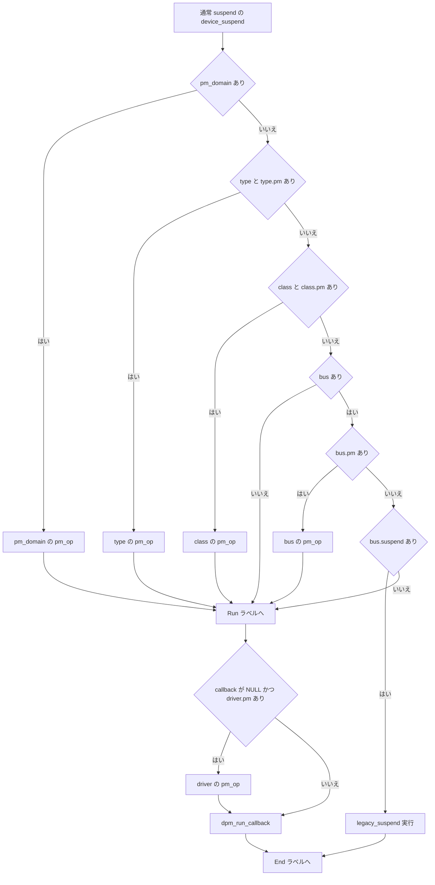

# 第9章 device PM callback と DPM 順序

> **本章で読むソース**
>
> - [`drivers/base/power/main.c` L43-L57](https://github.com/gregkh/linux/blob/v6.18.38/drivers/base/power/main.c#L43-L57)
> - [`drivers/base/power/main.c` L139-L155](https://github.com/gregkh/linux/blob/v6.18.38/drivers/base/power/main.c#L139-L155)
> - [`drivers/base/power/main.c` L357-L449](https://github.com/gregkh/linux/blob/v6.18.38/drivers/base/power/main.c#L357-L449)
> - [`drivers/base/power/main.c` L485-L505](https://github.com/gregkh/linux/blob/v6.18.38/drivers/base/power/main.c#L485-L505)
> - [`drivers/base/power/main.c` L607-L638](https://github.com/gregkh/linux/blob/v6.18.38/drivers/base/power/main.c#L607-L638)
> - [`drivers/base/power/main.c` L1139-L1142](https://github.com/gregkh/linux/blob/v6.18.38/drivers/base/power/main.c#L1139-L1142)
> - [`drivers/base/power/main.c` L1161-L1176](https://github.com/gregkh/linux/blob/v6.18.38/drivers/base/power/main.c#L1161-L1176)
> - [`drivers/base/power/main.c` L1434-L1459](https://github.com/gregkh/linux/blob/v6.18.38/drivers/base/power/main.c#L1434-L1459)
> - [`drivers/base/power/main.c` L1573-L1584](https://github.com/gregkh/linux/blob/v6.18.38/drivers/base/power/main.c#L1573-L1584)
> - [`drivers/base/power/main.c` L1634-L1668](https://github.com/gregkh/linux/blob/v6.18.38/drivers/base/power/main.c#L1634-L1668)
> - [`drivers/base/power/main.c` L1820-L1840](https://github.com/gregkh/linux/blob/v6.18.38/drivers/base/power/main.c#L1820-L1840)
> - [`drivers/base/power/main.c` L1889-L1905](https://github.com/gregkh/linux/blob/v6.18.38/drivers/base/power/main.c#L1889-L1905)
> - [`drivers/base/power/main.c` L1913-L1969](https://github.com/gregkh/linux/blob/v6.18.38/drivers/base/power/main.c#L1913-L1969)
> - [`drivers/base/power/main.c` L1992-L2054](https://github.com/gregkh/linux/blob/v6.18.38/drivers/base/power/main.c#L1992-L2054)
> - [`drivers/base/power/main.c` L2109-L2183](https://github.com/gregkh/linux/blob/v6.18.38/drivers/base/power/main.c#L2109-L2183)
> - [`drivers/base/power/main.c` L2192-L2245](https://github.com/gregkh/linux/blob/v6.18.38/drivers/base/power/main.c#L2192-L2245)
> - [`drivers/base/power/main.c` L2255-L2271](https://github.com/gregkh/linux/blob/v6.18.38/drivers/base/power/main.c#L2255-L2271)
> - [`drivers/base/power/main.c` L1282-L1288](https://github.com/gregkh/linux/blob/v6.18.38/drivers/base/power/main.c#L1282-L1288)
> - [`drivers/base/core.c` L378-L400](https://github.com/gregkh/linux/blob/v6.18.38/drivers/base/core.c#L378-L400)
> - [`include/linux/list.h` L304-L320](https://github.com/gregkh/linux/blob/v6.18.38/include/linux/list.h#L304-L320)

## 共通規約

コード引用は [`v6.18.38`](https://github.com/gregkh/linux/tree/v6.18.38) タグの GitHub リンクとコードブロックの2点セットで示す。
7.x 系の注釈のみ [`v7.1.3`](https://github.com/gregkh/linux/tree/v7.1.3) を使う。

## この章の狙い

`drivers/base/power/main.c` が管理する **DPM**（Device Power Management）リストと callback 選択を追う。
システムサスペンド時に全デバイスをどの順で、どの `dev_pm_ops` フィールド経由で止め、どう巻き戻すかを、[第4章 Suspend to RAM と s2idle](../part01-system-pm/04-suspend-s2idle.md) が呼ぶ `dpm_suspend_start` 等の内部として読む。

## 前提

- [第2章 PM サブシステムコアと遷移ロック](../part00-foundation/02-pm-core-transition.md) の `system_transition_mutex` と `pm_notifier` チェーン。
- [第4章 Suspend to RAM と s2idle](../part01-system-pm/04-suspend-s2idle.md) の `suspend_devices_and_enter` が `dpm_suspend_start` と `dpm_resume_end` を呼ぶ入口。
- runtime PM の状態機械は [第10章 runtime PM 状態機械](10-runtime-pm-state-machine.md) で扱う。

## 5つのリストと4段階 callback

デバイスは5つのリスト間を `list_move` と `list_move_tail` で移動する。
callback の段階は4つであり、リストの数と混同しない。

[`drivers/base/power/main.c` L43-L57](https://github.com/gregkh/linux/blob/v6.18.38/drivers/base/power/main.c#L43-L57)

```c
/*
 * The entries in the dpm_list list are in a depth first order, simply
 * because children are guaranteed to be discovered after parents, and
 * are inserted at the back of the list on discovery.
 */
LIST_HEAD(dpm_list);
static LIST_HEAD(dpm_prepared_list);
static LIST_HEAD(dpm_suspended_list);
static LIST_HEAD(dpm_late_early_list);
static LIST_HEAD(dpm_noirq_list);
```

| リスト | suspend 進行で入る段階 | resume 進行で戻る段階 |
|---|---|---|
| `dpm_list` | 登録直後 | `dpm_complete` 終了後 |
| `dpm_prepared_list` | `dpm_prepare` 後 | `dpm_resume` が `.next` から取り出し |
| `dpm_suspended_list` | `dpm_suspend` 後 | `dpm_resume` の入力 |
| `dpm_late_early_list` | `dpm_suspend_late` 後 | `dpm_resume_early` の入力 |
| `dpm_noirq_list` | `dpm_noirq_suspend_devices` 後 | `dpm_noirq_resume_devices` の入力 |

4段階の callback は prepare、`suspend`/`resume`、late/early、noirq に対応する。
`pm_op`、`pm_late_early_op`、`pm_noirq_op` がイベント種別から引くフィールドが異なる。

[`drivers/base/power/main.c` L357-L449](https://github.com/gregkh/linux/blob/v6.18.38/drivers/base/power/main.c#L357-L449)

```c
static pm_callback_t pm_op(const struct dev_pm_ops *ops, pm_message_t state)
{
	switch (state.event) {
#ifdef CONFIG_SUSPEND
	case PM_EVENT_SUSPEND:
		return ops->suspend;
	case PM_EVENT_RESUME:
		return ops->resume;
#endif
	// ... (中略) ...
	}
	return NULL;
}

static pm_callback_t pm_late_early_op(const struct dev_pm_ops *ops,
				      pm_message_t state)
{
	switch (state.event) {
#ifdef CONFIG_SUSPEND
	case PM_EVENT_SUSPEND:
		return ops->suspend_late;
	case PM_EVENT_RESUME:
		return ops->resume_early;
#endif
	// ... (中略) ...
	}
	return NULL;
}

static pm_callback_t pm_noirq_op(const struct dev_pm_ops *ops, pm_message_t state)
{
	switch (state.event) {
#ifdef CONFIG_SUSPEND
	case PM_EVENT_SUSPEND:
		return ops->suspend_noirq;
	case PM_EVENT_RESUME:
		return ops->resume_noirq;
#endif
	// ... (中略) ...
	}
	return NULL;
}
```

## dpm_list への登録と順序不変条件

`device_pm_add` は discover 時に `list_add_tail` で末尾へ追加する。
根拠は親の probe 完了ではなく、子が親より後に discover されるという登録順の契約である。

[`drivers/base/power/main.c` L139-L155](https://github.com/gregkh/linux/blob/v6.18.38/drivers/base/power/main.c#L139-L155)

```c
void device_pm_add(struct device *dev)
{
	if (device_pm_not_required(dev))
		return;
	// ... (中略) ...
	mutex_lock(&dpm_list_mtx);
	if (dev->parent && dev->parent->power.is_prepared)
		dev_warn(dev, "parent %s should not be sleeping\n",
			dev_name(dev->parent));
	list_add_tail(&dev->power.entry, &dpm_list);
	dev->power.in_dpm_list = true;
	mutex_unlock(&dpm_list_mtx);
}
```

device link を張ったときは `device_reorder_to_tail` が consumer とその子孫を `device_pm_move_last` で末尾へ移す。
dpm_list の不変条件は「親と supplier が前、子と consumer が後」になる。

[`drivers/base/core.c` L378-L400](https://github.com/gregkh/linux/blob/v6.18.38/drivers/base/core.c#L378-L400)

```c
static int device_reorder_to_tail(struct device *dev, void *not_used)
{
	// ... (中略) ...
	if (device_pm_initialized(dev))
		device_pm_move_last(dev);

	device_for_each_child(dev, NULL, device_reorder_to_tail);
	list_for_each_entry(link, &dev->links.consumers, s_node) {
		if (device_link_flag_is_sync_state_only(link->flags))
			continue;
		device_reorder_to_tail(link->consumer, NULL);
	}

	return 0;
}
```

## callback 選択：中間層1層と driver fallback

「domain から bus まで非 NULL を順に探す」のではない。
`pm_domain`、`type`、`class`、`bus` のうち最初に存在するオブジェクト1つだけを選び、その層の当該フェーズ callback を引く。
引いた callback が NULL でも残りの中間層へは進まない。
`Run:` で `callback` が NULL のときだけ driver へ fallback する。

通常フェーズの `device_suspend` が代表例である。

[`drivers/base/power/main.c` L1913-L1949](https://github.com/gregkh/linux/blob/v6.18.38/drivers/base/power/main.c#L1913-L1949)

```c
	if (dev->pm_domain) {
		info = "power domain ";
		callback = pm_op(&dev->pm_domain->ops, state);
		goto Run;
	}

	if (dev->type && dev->type->pm) {
		info = "type ";
		callback = pm_op(dev->type->pm, state);
		goto Run;
	}

	if (dev->class && dev->class->pm) {
		info = "class ";
		callback = pm_op(dev->class->pm, state);
		goto Run;
	}

	if (dev->bus) {
		if (dev->bus->pm) {
			info = "bus ";
			callback = pm_op(dev->bus->pm, state);
		} else if (dev->bus->suspend) {
			pm_dev_dbg(dev, state, "legacy bus ");
			error = legacy_suspend(dev, state, dev->bus->suspend,
						"legacy bus ");
			goto End;
		}
	}

 Run:
	if (!callback && dev->driver && dev->driver->pm) {
		info = "driver ";
		callback = pm_op(dev->driver->pm, state);
	}

	error = dpm_run_callback(callback, dev, state, info);
```

legacy bus 分岐は通常フェーズだけである。
`bus->pm` が無く `bus->suspend` があるときは `legacy_suspend` を実行し driver は呼ばない。
noirq と late/early は同型の else-if 連鎖だが legacy 分岐は無い。

[`drivers/base/power/main.c` L1434-L1459](https://github.com/gregkh/linux/blob/v6.18.38/drivers/base/power/main.c#L1434-L1459)

```c
	if (dev->pm_domain) {
		info = "noirq power domain ";
		callback = pm_noirq_op(&dev->pm_domain->ops, state);
	} else if (dev->type && dev->type->pm) {
		info = "noirq type ";
		callback = pm_noirq_op(dev->type->pm, state);
	} else if (dev->class && dev->class->pm) {
		info = "noirq class ";
		callback = pm_noirq_op(dev->class->pm, state);
	} else if (dev->bus && dev->bus->pm) {
		info = "noirq bus ";
		callback = pm_noirq_op(dev->bus->pm, state);
	}
	if (callback)
		goto Run;

	if (dev_pm_skip_suspend(dev))
		goto Skip;

	if (dev->driver && dev->driver->pm) {
		info = "noirq driver ";
		callback = pm_noirq_op(dev->driver->pm, state);
	}

Run:
	error = dpm_run_callback(callback, dev, state, info);
```

`device_prepare` も同じ1層選択と driver fallback の骨格を持つ。

[`drivers/base/power/main.c` L2109-L2153](https://github.com/gregkh/linux/blob/v6.18.38/drivers/base/power/main.c#L2109-L2153)

```c
	if (dev->pm_domain)
		callback = dev->pm_domain->ops.prepare;
	else if (dev->type && dev->type->pm)
		callback = dev->type->pm->prepare;
	else if (dev->class && dev->class->pm)
		callback = dev->class->pm->prepare;
	else if (dev->bus && dev->bus->pm)
		callback = dev->bus->pm->prepare;

	if (!callback && dev->driver && dev->driver->pm)
		callback = dev->driver->pm->prepare;

	if (callback)
		ret = callback(dev);
```

実際の呼び出しは `dpm_run_callback` が担う。
callback が NULL なら `0` を返して何もしない。

[`drivers/base/power/main.c` L485-L505](https://github.com/gregkh/linux/blob/v6.18.38/drivers/base/power/main.c#L485-L505)

```c
static int dpm_run_callback(pm_callback_t cb, struct device *dev,
			    pm_message_t state, const char *info)
{
	// ... (中略) ...
	if (!cb)
		return 0;
	// ... (中略) ...
	error = cb(dev);
	// ... (中略) ...
	return error;
}
```

### callback 選択の決定木



noirq、late、early も骨格は同型で、legacy bus 分岐だけ無い。

## システムサスペンドのフェーズ順

`main.c` がサスペンドとレジュームの**フェーズ入口**として export する関数は4つである。
`dpm_suspend_start`、`dpm_suspend_end`、`dpm_resume_start`、`dpm_resume_end`。
`main.c` には他にも `dpm_for_each_dev`、`device_pm_wait_for_dev`、`__suspend_report_result`、`pm_hibernate_is_recovering` の `EXPORT_SYMBOL_GPL` があるが、フェーズ順序の入口はこの4つに限られる。
`dpm_suspend` や `dpm_resume` 本体は `static` を持たないグローバルシンボルだが、`EXPORT_SYMBOL_GPL` されていないため loadable module からは呼べない。

[`drivers/base/power/main.c` L1139-L1142](https://github.com/gregkh/linux/blob/v6.18.38/drivers/base/power/main.c#L1139-L1142)

```c
void dpm_resume(pm_message_t state)
{
	struct device *dev;
	ktime_t starttime = ktime_get();
```

[`drivers/base/power/main.c` L1992-L1996](https://github.com/gregkh/linux/blob/v6.18.38/drivers/base/power/main.c#L1992-L1996)

```c
int dpm_suspend(pm_message_t state)
{
	ktime_t starttime = ktime_get();
	struct device *dev;
	int error;
```

どちらも `static` 修飾が無く、直後にも `EXPORT_SYMBOL_GPL` は無い（`dpm_suspend_start` や `dpm_resume_end` の直後にはある、下記引用参照）。


入口は次のとおりである。

[`drivers/base/power/main.c` L2255-L2271](https://github.com/gregkh/linux/blob/v6.18.38/drivers/base/power/main.c#L2255-L2271)

```c
int dpm_suspend_start(pm_message_t state)
{
	ktime_t starttime = ktime_get();
	int error;

	error = dpm_prepare(state);
	if (error)
		dpm_save_failed_step(SUSPEND_PREPARE);
	else {
		pm_restrict_gfp_mask();
		error = dpm_suspend(state);
	}

	dpm_show_time(starttime, state, error, "start");
	return error;
}
EXPORT_SYMBOL_GPL(dpm_suspend_start);
```

[`drivers/base/power/main.c` L1282-L1288](https://github.com/gregkh/linux/blob/v6.18.38/drivers/base/power/main.c#L1282-L1288)

```c
void dpm_resume_end(pm_message_t state)
{
	dpm_resume(state);
	pm_restore_gfp_mask();
	dpm_complete(state);
}
EXPORT_SYMBOL_GPL(dpm_resume_end);
```

`dpm_suspend_noirq` は `suspend_device_irqs` のあと noirq callback を走らせ、失敗時は `dpm_resume_noirq` で巻き戻す。

[`drivers/base/power/main.c` L1573-L1584](https://github.com/gregkh/linux/blob/v6.18.38/drivers/base/power/main.c#L1573-L1584)

```c
int dpm_suspend_noirq(pm_message_t state)
{
	int ret;

	device_wakeup_arm_wake_irqs();
	suspend_device_irqs();

	ret = dpm_noirq_suspend_devices(state);
	if (ret)
		dpm_resume_noirq(resume_event(state));

	return ret;
}
```

## 1台のデバイスが通過するリストと処理フロー

仮想デバイス `devX` を主語に、suspend から resume までのリスト所属を追う。

| 段階 | 呼び出し | devX のリスト | 主な callback |
|---|---|---|---|
| 登録 | `device_pm_add` | `dpm_list` 末尾 | なし |
| prepare | `dpm_prepare` → `device_prepare` | `dpm_prepared_list` 末尾 | `prepare` |
| suspend | `dpm_suspend` → `device_suspend` | `dpm_suspended_list` 先頭側 | `suspend` または省略 |
| late | `dpm_suspend_late` | `dpm_late_early_list` 先頭側 | `suspend_late` |
| noirq | `dpm_noirq_suspend_devices` | `dpm_noirq_list` 先頭側 | `suspend_noirq` |
| 睡眠後 noirq resume | `dpm_noirq_resume_devices` | `dpm_noirq_list` から `.next` 取り出し | `resume_noirq` |
| early resume | `dpm_resume_early` | `dpm_late_early_list` 末尾側 | `resume_early` |
| resume | `dpm_resume` → `device_resume` | `dpm_prepared_list` 末尾側 | `resume` |
| complete | `dpm_complete` → `device_complete` | 一時 list 経由で `dpm_list` へ | `complete` |

`dpm_prepare` は `device_block_probing` で新規 probe を止め、`dpm_list.next` から順に `device_prepare` を呼ぶ。
`-EAGAIN` は失敗ではなく、同じ device の prepare を再試行する扱いである。

[`drivers/base/power/main.c` L2192-L2245](https://github.com/gregkh/linux/blob/v6.18.38/drivers/base/power/main.c#L2192-L2245)

```c
int dpm_prepare(pm_message_t state)
{
	// ... (中略) ...
	device_block_probing();

	mutex_lock(&dpm_list_mtx);
	while (!list_empty(&dpm_list) && !error) {
		struct device *dev = to_device(dpm_list.next);
		// ... (中略) ...
		error = device_prepare(dev, state);
		// ... (中略) ...
		if (!error) {
			dev->power.is_prepared = true;
			if (!list_empty(&dev->power.entry))
				list_move_tail(&dev->power.entry, &dpm_prepared_list);
		} else if (error == -EAGAIN) {
			error = 0;
		} else {
			dev_info(dev, "not prepared for power transition: code %d\n",
				 error);
		}
		// ... (中略) ...
	}
	mutex_unlock(&dpm_list_mtx);
	return error;
}
```

## direct-complete による callback 省略

全デバイスが必ず suspend callback を通るわけではないが、runtime-suspended であることは十分条件ではない。
`device_prepare` が正の戻り値を返すか `no_pm_callbacks` が真であれば、`DPM_FLAG_NO_DIRECT_COMPLETE` が立っていない限り `direct_complete` の**候補**になる。

[`drivers/base/power/main.c` L2177-L2179](https://github.com/gregkh/linux/blob/v6.18.38/drivers/base/power/main.c#L2177-L2179)

```c
	dev->power.direct_complete = state.event == PM_EVENT_SUSPEND &&
		(ret > 0 || dev->power.no_pm_callbacks) &&
		!dev_pm_test_driver_flags(dev, DPM_FLAG_NO_DIRECT_COMPLETE);
```

候補化はここで終わらない。
`device_suspend` は2箇所で候補を取り消しうる。

1. `device_may_wakeup(dev)` または `device_wakeup_path(dev)` が真なら、wakeup path を上流へ伝播させるため候補を解除する。
2. 候補が生き残っていても `pm_runtime_status_suspended` で runtime-suspended でなければ通常経路に落ちる。

[`drivers/base/power/main.c` L1889-L1905](https://github.com/gregkh/linux/blob/v6.18.38/drivers/base/power/main.c#L1889-L1905)

```c
	/* Avoid direct_complete to let wakeup_path propagate. */
	if (device_may_wakeup(dev) || device_wakeup_path(dev))
		dev->power.direct_complete = false;

	if (dev->power.direct_complete) {
		if (pm_runtime_status_suspended(dev)) {
			pm_runtime_disable(dev);
			if (pm_runtime_status_suspended(dev)) {
				pm_dev_dbg(dev, state, "direct-complete ");
				dev->power.is_suspended = true;
				goto Complete;
			}

			pm_runtime_enable(dev);
		}
		dev->power.direct_complete = false;
	}
```

`pm_runtime_barrier` のあと `pm_runtime_status_suspended` を再確認し、まだ suspended なら `is_suspended = true` のまま `Complete` へ飛ぶ（上記引用参照）。

候補が取り消されて通常経路（`Run` → `dpm_run_callback` → `End`）を辿り、callback が成功すると、`dpm_clear_superiors_direct_complete` が親デバイスと supplier の `direct_complete` 候補を解除する。

[`drivers/base/power/main.c` L1951-L1959](https://github.com/gregkh/linux/blob/v6.18.38/drivers/base/power/main.c#L1951-L1959)

```c
 End:
	if (!error) {
		dev->power.is_suspended = true;
		if (device_may_wakeup(dev))
			dev->power.wakeup_path = true;

		dpm_propagate_wakeup_to_parent(dev);
		dpm_clear_superiors_direct_complete(dev);
	}
```

[`drivers/base/power/main.c` L1820-L1840](https://github.com/gregkh/linux/blob/v6.18.38/drivers/base/power/main.c#L1820-L1840)

```c
static void dpm_clear_superiors_direct_complete(struct device *dev)
{
	struct device_link *link;
	int idx;

	if (dev->parent) {
		spin_lock_irq(&dev->parent->power.lock);
		dev->parent->power.direct_complete = false;
		spin_unlock_irq(&dev->parent->power.lock);
	}

	idx = device_links_read_lock();

	dev_for_each_link_to_supplier(link, dev) {
		spin_lock_irq(&link->supplier->power.lock);
		link->supplier->power.direct_complete = false;
		spin_unlock_irq(&link->supplier->power.lock);
	}

	device_links_read_unlock(idx);
}
```

`dpm_suspend` は末尾（子孫）から処理するため、この解除は親の `device_suspend` が呼ばれるより前に効く。
したがって「runtime-suspended なデバイスは単独で必ず suspend callback を省略する」わけではない。
direct-complete が成立するのは、その子・consumer 側も含めて候補が最後まで維持された場合だけである。
resume 側 `device_resume` も `direct_complete` なら callback を省略し `pm_runtime_enable` するだけである。

## リスト操作による順序保証

別途ソートや深さ優先探索をせず、1本の双方向リスト操作だけで「子孫優先 suspend、祖先優先 resume」を実現している。

[`include/linux/list.h` L304-L320](https://github.com/gregkh/linux/blob/v6.18.38/include/linux/list.h#L304-L320)

```c
static inline void list_move(struct list_head *list, struct list_head *head)
{
	__list_del_entry(list);
	list_add(list, head);
}

static inline void list_move_tail(struct list_head *list,
				  struct list_head *head)
{
	__list_del_entry(list);
	list_add_tail(list, head);
}
```

suspend 系は `.prev`（末尾＝子孫）を取り出し、**callback より先に** `list_move` で移動先リストの先頭へ挿入する。

[`drivers/base/power/main.c` L2019-L2043](https://github.com/gregkh/linux/blob/v6.18.38/drivers/base/power/main.c#L2019-L2043)

```c
	while (!list_empty(&dpm_prepared_list)) {
		dev = to_device(dpm_prepared_list.prev);

		list_move(&dev->power.entry, &dpm_suspended_list);

		if (dpm_async_fn(dev, async_suspend))
			continue;
		// ... (中略) ...
		device_suspend(dev, state, false);
		// ... (中略) ...
		if (READ_ONCE(async_error)) {
			dpm_async_suspend_complete_all(&dpm_prepared_list);
			list_splice_init(&dpm_prepared_list, &dpm_suspended_list);
			break;
		}
	}
```

resume 系は `.next`（先頭＝祖先）を取り出し、先に `list_move_tail` で末尾へ追加してから `device_resume` を呼ぶ。

[`drivers/base/power/main.c` L1161-L1170](https://github.com/gregkh/linux/blob/v6.18.38/drivers/base/power/main.c#L1161-L1170)

```c
	while (!list_empty(&dpm_suspended_list)) {
		dev = to_device(dpm_suspended_list.next);
		list_move_tail(&dev->power.entry, &dpm_prepared_list);

		if (!dpm_async_fn(dev, async_resume)) {
			// ... (中略) ...
			device_resume(dev, state, false);
		}
	}
```

| 操作 | 取り出し | 挿入 | 実行順 | 移動先リストの並び |
|---|---|---|---|---|
| suspend | `.prev` 末尾 | `list_move` 先頭 | 子孫が先 | 元の親が前を保つ |
| resume | `.next` 先頭 | `list_move_tail` 末尾 | 祖先が先 | 元の順序を復元 |

callback より先に `list_move` する、という事実がある。
そして失敗時の rollback（`list_splice_init` で未処理分を一括して target list へ流す処理、上記 `dpm_suspend` 引用参照）は、この配置によって「残りは既に target list にいる」前提で動く。
ただし、この配置が rollback のために選ばれたと明記したコメントはソースになく、「rollback を見越した設計」という意図の部分は推測である。

### 高速化と最適化の工夫

深さ計算や毎回の全リストソートを避け、`device_pm_add` の登録順が保証する「親が子より前」という順序と、device link 作成時の `device_reorder_to_tail` が補う「supplier が consumer より前」という順序を、そのまま利用する。
末尾取り出しと先頭挿入の対称操作だけで子孫優先と祖先優先を両立するため、DPM コアのホットパスはリストポインタ操作と callback 呼び出しに集中できる。
`direct-complete` は、runtime PM で既に suspended かつ wakeup path に絡まず子孫側も候補を維持したデバイスに限り、通常・late・noirq の suspend callback を省略し、システムサスペンドの所要時間を短縮する。

## async suspend と resume

`is_async` は `power.async_suspend` と `pm_async_enabled` とトレース無効の3条件を満たすとき真になる。

[`drivers/base/power/main.c` L607-L638](https://github.com/gregkh/linux/blob/v6.18.38/drivers/base/power/main.c#L607-L638)

```c
static bool is_async(struct device *dev)
{
	return dev->power.async_suspend && pm_async_enabled
		&& !pm_trace_is_enabled();
}

static bool dpm_async_fn(struct device *dev, async_func_t func)
{
	guard(mutex)(&async_wip_mtx);

	return __dpm_async(dev, func);
}
```

suspend 側は `dpm_leaf_device` で子も consumer も持たないデバイスを先に async 起動し、完了時に `dpm_async_suspend_superior` が親と supplier を連鎖起動する。
resume 側は `dpm_root_device` で親も supplier も持たないデバイスを先に起動し、`dpm_async_resume_subordinate` が子と consumer を連鎖起動する。
各フェーズ末尾の `async_synchronize_full` で全 async タスクの完了を待つ。

## エラー時のロールバック担当

`async_error` はグローバル変数で、フェーズ内の共有中断フラグ兼エラー値である。
「最初の失敗を保持する」変数ではない。
`device_suspend`／`device_suspend_late`／`device_suspend_noirq`／`device_resume`／`device_resume_early`／`device_resume_noirq` はいずれも、失敗時に自分の `error` を `WRITE_ONCE(async_error, error)` で無条件に代入する（代表として `device_suspend` の該当箇所を下に引用する）。
このため async suspend/resume で並行実行中の別デバイスの callback が後から失敗すれば、先に書かれた値は後勝ちで上書きされうる。

[`drivers/base/power/main.c` L1964-L1969](https://github.com/gregkh/linux/blob/v6.18.38/drivers/base/power/main.c#L1964-L1969)

```c
 Complete:
	if (error) {
		WRITE_ONCE(async_error, error);
		dpm_save_failed_dev(dev_name(dev));
		pm_dev_err(dev, state, async ? " async" : "", error);
	}
```

担当は段階ごとに異なる。

- `dpm_suspend_late` は失敗時に関数内で `dpm_resume_early` を呼ぶ。
- `dpm_suspend_noirq` は失敗時に `dpm_resume_noirq` を呼ぶ。
- **`dpm_suspend` は失敗しても自身では `dpm_resume` を呼ばない**。
  `dpm_save_failed_step(SUSPEND_SUSPEND)` で記録して error を返すだけであり、実際の resume は上位の `suspend_devices_and_enter` が呼ぶ `dpm_resume_end` が担う。

フェーズ内の一括 rollback は `list_splice_init` と `dpm_async_suspend_complete_all` が担う（`dpm_suspend` 引用の `L2037-L2043` 参照）。

late フェーズでは `device_suspend_late` が `__pm_runtime_disable(dev, false)` で runtime PM を無効化する。
direct_complete デバイスは late callback 自体をスキップする。

[`drivers/base/power/main.c` L1634-L1668](https://github.com/gregkh/linux/blob/v6.18.38/drivers/base/power/main.c#L1634-L1668)

```c
	if (dev->power.direct_complete)
		goto Complete;

	__pm_runtime_disable(dev, false);
	// ... (中略) ...
	if (dev->pm_domain) {
		info = "late power domain ";
		callback = pm_late_early_op(&dev->pm_domain->ops, state);
	} else if (dev->type && dev->type->pm) {
		// ... (中略) ...
	}
	if (callback)
		goto Run;
	// ... (中略) ...
Run:
	error = dpm_run_callback(callback, dev, state, info);
```

## 7.x 系での変化

> **7.x 系での変化**
> op 選択関数は [`pm_op`](https://github.com/gregkh/linux/blob/v7.1.3/drivers/base/power/main.c#L361-L386)・[`pm_late_early_op`](https://github.com/gregkh/linux/blob/v7.1.3/drivers/base/power/main.c#L395-L421)・[`pm_noirq_op`](https://github.com/gregkh/linux/blob/v7.1.3/drivers/base/power/main.c#L431-L456) の3関数であり、いずれにも `case PM_EVENT_POWEROFF:` が `PM_EVENT_HIBERNATE` とフォールスルーで追加され、`ops->poweroff` 系 callback が選ばれるようになった。
> [`device_suspend_late`](https://github.com/gregkh/linux/blob/v7.1.3/drivers/base/power/main.c#L1630-L1657) では v6.18.38 の `__pm_runtime_disable(dev, false)` が `pm_runtime_disable(dev)` に置き換わった。
> 保留中の runtime resume 要求の扱いが変わりうるため、late suspend 前後の runtime PM 状態に注意が必要である。

## まとめ

DPM は5つのリスト状態と4段階 callback を分けて管理する。
callback 選択は中間層を構造的優先度で1層だけ選び、NULL なら driver へ直接 fallback する。
suspend は末尾から先に list 移動してから callback、resume は先頭から同様に逆操作する。
`dpm_suspend` の失敗巻き戻しは上位の `dpm_resume_end` に委ね、late と noirq は自フェーズで resume を呼ぶ。
`direct-complete` と async は、それぞれ callback 省略と並列化でシステムサスペンドのコストを下げる。

## 関連する章

- 前提: [第2章 PM サブシステムコアと遷移ロック](../part00-foundation/02-pm-core-transition.md)
- 前提: [第4章 Suspend to RAM と s2idle](../part01-system-pm/04-suspend-s2idle.md)
- 次章: [第10章 runtime PM 状態機械](10-runtime-pm-state-machine.md)
- 関連: 第11章 wakeup、第12章 genpd
