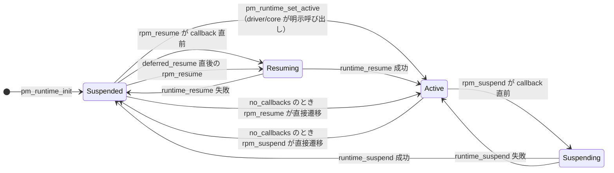
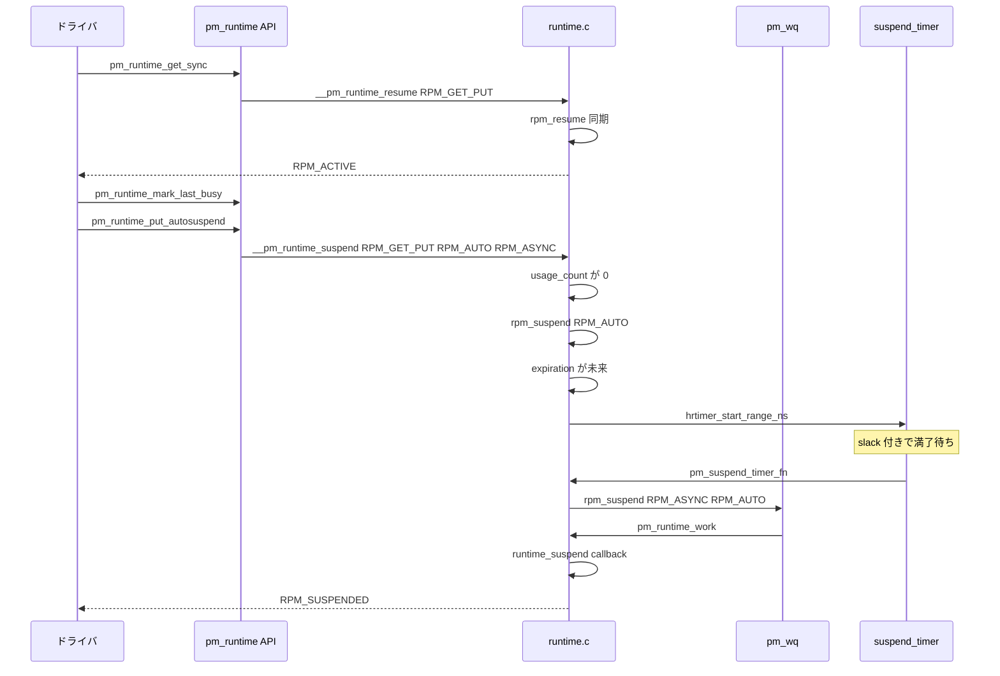

# 第10章 runtime PM 状態機械

> **本章で読むソース**
>
> - [`include/linux/pm.h` L595-L625](https://github.com/gregkh/linux/blob/v6.18.38/include/linux/pm.h#L595-L625)
> - [`include/linux/pm.h` L692-L720](https://github.com/gregkh/linux/blob/v6.18.38/include/linux/pm.h#L692-L720)
> - [`include/linux/pm_runtime.h` L18-L24](https://github.com/gregkh/linux/blob/v6.18.38/include/linux/pm_runtime.h#L18-L24)
> - [`include/linux/pm_runtime.h` L233-L236](https://github.com/gregkh/linux/blob/v6.18.38/include/linux/pm_runtime.h#L233-L236)
> - [`include/linux/pm_runtime.h` L492-L564](https://github.com/gregkh/linux/blob/v6.18.38/include/linux/pm_runtime.h#L492-L564)
> - [`drivers/base/power/runtime.c` L177-L196](https://github.com/gregkh/linux/blob/v6.18.38/drivers/base/power/runtime.c#L177-L196)
> - [`drivers/base/power/runtime.c` L271-L295](https://github.com/gregkh/linux/blob/v6.18.38/drivers/base/power/runtime.c#L271-L295)
> - [`drivers/base/power/runtime.c` L374-L433](https://github.com/gregkh/linux/blob/v6.18.38/drivers/base/power/runtime.c#L374-L433)
> - [`drivers/base/power/runtime.c` L491-L563](https://github.com/gregkh/linux/blob/v6.18.38/drivers/base/power/runtime.c#L491-L563)
> - [`drivers/base/power/runtime.c` L607-L705](https://github.com/gregkh/linux/blob/v6.18.38/drivers/base/power/runtime.c#L607-L705)
> - [`drivers/base/power/runtime.c` L786-L954](https://github.com/gregkh/linux/blob/v6.18.38/drivers/base/power/runtime.c#L786-L954)
> - [`drivers/base/power/runtime.c` L977-L1039](https://github.com/gregkh/linux/blob/v6.18.38/drivers/base/power/runtime.c#L977-L1039)
> - [`drivers/base/power/runtime.c` L1111-L1201](https://github.com/gregkh/linux/blob/v6.18.38/drivers/base/power/runtime.c#L1111-L1201)
> - [`drivers/base/power/runtime.c` L1475-L1494](https://github.com/gregkh/linux/blob/v6.18.38/drivers/base/power/runtime.c#L1475-L1494)
> - [`drivers/base/power/runtime.c` L1566-L1595](https://github.com/gregkh/linux/blob/v6.18.38/drivers/base/power/runtime.c#L1566-L1595)
> - [`drivers/base/power/runtime.c` L1838-L1864](https://github.com/gregkh/linux/blob/v6.18.38/drivers/base/power/runtime.c#L1838-L1864)

## 共通規約

コード引用は [`v6.18.38`](https://github.com/gregkh/linux/tree/v6.18.38) タグの GitHub リンクとコードブロックの2点セットで示す。
7.x 系の注釈のみ [`v7.1.3`](https://github.com/gregkh/linux/tree/v7.1.3) を使う。

## この章の狙い

`drivers/base/power/runtime.c` が実装する **runtime PM** の状態機械を、状態、カウンタ、非同期キューの3本柱で読む。
デバイスが「使われていない」ことをどう検出し、いつサスペンドとレジュームするかを、`usage_count`、`child_count`、`disable_depth` と4状態の組み合わせで追う。

## 前提

- [第2章 PM サブシステムコアと遷移ロック](../part00-foundation/02-pm-core-transition.md) の `system_transition_mutex` と `pm_notifier` チェーン。
  runtime PM はシステム全体のサスペンドとは独立し、デバイス単位の `dev->power.lock` で直列化される。
- 第9章 DPM 順序（`dpm_list` を辿るシステムサスペンド、`DPM_FLAG_SMART_SUSPEND` との関係）。
  system sleep 中に runtime-suspended だったデバイスをどう扱うかは第9章側の話題であり、本章では深追いしない。

## 状態と要求の型

`enum rpm_status` は `dev_pm_info.runtime_status` が通常取る4値と、管理用の2値に分かれる。

[`include/linux/pm.h` L595-L625](https://github.com/gregkh/linux/blob/v6.18.38/include/linux/pm.h#L595-L625)

```c
enum rpm_status {
	RPM_INVALID = -1,
	RPM_ACTIVE = 0,
	RPM_RESUMING,
	RPM_SUSPENDED,
	RPM_SUSPENDING,
	RPM_BLOCKED,
};

enum rpm_request {
	RPM_REQ_NONE = 0,
	RPM_REQ_IDLE,
	RPM_REQ_SUSPEND,
	RPM_REQ_AUTOSUSPEND,
	RPM_REQ_RESUME,
};
```

`RPM_ACTIVE`、`RPM_SUSPENDED`、`RPM_SUSPENDING`、`RPM_RESUMING` が実行経路で遷移する4状態である。
`RPM_SUSPENDING` と `RPM_RESUMING` は callback 実行中の遷移中状態であり、`__update_runtime_status` が `runtime_status` を書き換えてから `rpm_callback` を呼ぶ。
`RPM_INVALID` と `RPM_BLOCKED` は `last_status` の管理に使われ、通常の遷移図には含めない。
`RPM_BLOCKED` を `last_status` にセットするのは `pm_runtime_block_if_disabled` だけであり、`__pm_runtime_disable` は初回 disable 時に `runtime_status` を `last_status` へ退避する。
担当が別である点を混同しない。

`dev_pm_info` の runtime PM 関連フィールドは次のとおりである。

[`include/linux/pm.h` L692-L720](https://github.com/gregkh/linux/blob/v6.18.38/include/linux/pm.h#L692-L720)

```c
	struct hrtimer		suspend_timer;
	u64			timer_expires;
	struct work_struct	work;
	wait_queue_head_t	wait_queue;
	atomic_t		usage_count;
	atomic_t		child_count;
	unsigned int		disable_depth:3;
	bool			idle_notification:1;
	bool			request_pending:1;
	bool			deferred_resume:1;
	// ... (中略) ...
	bool			irq_safe:1;
	bool			use_autosuspend:1;
	bool			timer_autosuspends:1;
	unsigned int		links_count;
	enum rpm_request	request;
	enum rpm_status		runtime_status;
	enum rpm_status		last_status;
	int			autosuspend_delay;
	u64			last_busy;
```

`usage_count` はドライバが「今使用中」を宣言するカウンタである。
`child_count` は子デバイスがアクティブな間、親をサスペンドさせないためのカウンタである。
`disable_depth` はネスト可能な runtime PM 無効化カウンタであり、`0` より大きい間はサスペンド経路が `-EACCES` を返す。

## rpm_check_suspend_allowed：共通の初期ゲート

`rpm_idle`、`rpm_suspend`、`pm_schedule_suspend` はいずれも、まず `rpm_check_suspend_allowed` を通す。
ただし阻害要因のすべてがここに集まっているわけではない。
各関数は通過後に固有の条件を追加で見る。

[`drivers/base/power/runtime.c` L271-L295](https://github.com/gregkh/linux/blob/v6.18.38/drivers/base/power/runtime.c#L271-L295)

```c
static int rpm_check_suspend_allowed(struct device *dev)
{
	int retval = 0;

	if (dev->power.runtime_error)
		retval = -EINVAL;
	else if (dev->power.disable_depth > 0)
		retval = -EACCES;
	else if (atomic_read(&dev->power.usage_count))
		retval = -EAGAIN;
	else if (!dev->power.ignore_children && atomic_read(&dev->power.child_count))
		retval = -EBUSY;

	/* Pending resume requests take precedence over suspends. */
	else if ((dev->power.deferred_resume &&
	    dev->power.runtime_status == RPM_SUSPENDING) ||
	    (dev->power.request_pending && dev->power.request == RPM_REQ_RESUME))
		retval = -EAGAIN;
	else if (__dev_pm_qos_resume_latency(dev) == 0)
		retval = -EPERM;
	else if (dev->power.runtime_status == RPM_SUSPENDED)
		retval = 1;

	return retval;
}
```

`retval == 1` は「すでに suspended であり、追加の suspend は不要」という成功相当の返り値である。
`rpm_idle` はこのあと「`RPM_ACTIVE` か」「保留要求の優先度」「`idle_notification` 実行中か」を追加判定する。
`rpm_suspend` は「`RPM_RESUMING` 中でないか」「autosuspend 期限が未来でないか」「`RPM_SUSPENDING` 中の並行待ち合わせ」を追加判定する。

## rpm_idle と rpm_suspend

`rpm_idle` は `RPM_ACTIVE` でのみ `runtime_idle` callback を呼び、成功すれば `rpm_suspend` へ `RPM_AUTO` 付きで連鎖する。

[`drivers/base/power/runtime.c` L491-L563](https://github.com/gregkh/linux/blob/v6.18.38/drivers/base/power/runtime.c#L491-L563)

```c
static int rpm_idle(struct device *dev, int rpmflags)
{
	// ... (中略) ...
	retval = rpm_check_suspend_allowed(dev);
	// ... (中略) ...
	else if (dev->power.runtime_status != RPM_ACTIVE)
		retval = -EAGAIN;
	// ... (中略) ...
	if (rpmflags & RPM_ASYNC) {
		dev->power.request = RPM_REQ_IDLE;
		if (!dev->power.request_pending) {
			dev->power.request_pending = true;
			queue_work(pm_wq, &dev->power.work);
		}
		return 0;
	}
	// ... (中略) ...
	return retval ? retval : rpm_suspend(dev, rpmflags | RPM_AUTO);
}
```

`rpm_suspend` の同期経路では、callback 直前に `RPM_SUSPENDING` へ遷移し、成功で `RPM_SUSPENDED`、失敗で `RPM_ACTIVE` へ戻す。
対称ではないのは `rpm_resume` 側でも同様で、resume callback 失敗は `RPM_SUSPENDED` に倒す。
ただし `power.no_callbacks` が真のデバイスでは、`RPM_SUSPENDING` へ遷移する前に `no_callback` ラベルへ飛ぶため、`RPM_ACTIVE` から `RPM_SUSPENDED` へ遷移中状態なしに直接遷移する。

[`drivers/base/power/runtime.c` L607-L705](https://github.com/gregkh/linux/blob/v6.18.38/drivers/base/power/runtime.c#L607-L705)

```c
	if ((rpmflags & RPM_AUTO) && dev->power.runtime_status != RPM_SUSPENDING) {
		u64 expires = pm_runtime_autosuspend_expiration(dev);

		if (expires != 0) {
			// ... (中略) ...
			if (!(dev->power.timer_expires &&
			    dev->power.timer_expires <= expires)) {
				u64 slack = (u64)READ_ONCE(dev->power.autosuspend_delay) *
						    (NSEC_PER_MSEC >> 2);

				dev->power.timer_expires = expires;
				hrtimer_start_range_ns(&dev->power.suspend_timer,
						       ns_to_ktime(expires),
						       slack,
						       HRTIMER_MODE_ABS);
			}
			dev->power.timer_autosuspends = 1;
			goto out;
		}
	}
	// ... (中略) ...
	if (dev->power.no_callbacks)
		goto no_callback;	/* Assume success. */

	// ... (中略) ...
	__update_runtime_status(dev, RPM_SUSPENDING);
	// ... (中略) ...
	retval = rpm_callback(callback, dev);
	if (retval)
		goto fail;

 no_callback:
	__update_runtime_status(dev, RPM_SUSPENDED);
	pm_runtime_deactivate_timer(dev);

	if (dev->parent) {
		parent = dev->parent;
		atomic_add_unless(&parent->power.child_count, -1, 0);
	}
	wake_up_all(&dev->power.wait_queue);

	if (dev->power.deferred_resume) {
		dev->power.deferred_resume = false;
		rpm_resume(dev, 0);
		retval = -EAGAIN;
		goto out;
	}
```

suspend 成功直後に `deferred_resume` が立っていれば、同一ロック保持下で即 `rpm_resume` が続く。
並行 suspend 中に resume 要求が来た場合、`rpm_resume` は `deferred_resume` をセットして suspend 完了を待つ。

## rpm_resume

`rpm_resume` は `disable_depth > 0` を特別扱いし、`RPM_SUSPENDING` との並行時は `deferred_resume` または `wait_queue` 待ちで調停する。

[`drivers/base/power/runtime.c` L786-L954](https://github.com/gregkh/linux/blob/v6.18.38/drivers/base/power/runtime.c#L786-L954)

```c
 repeat:
	if (dev->power.runtime_error) {
		retval = -EINVAL;
	} else if (dev->power.disable_depth > 0) {
		if (dev->power.runtime_status == RPM_ACTIVE &&
		    dev->power.last_status == RPM_ACTIVE)
			retval = 1;
		else if (rpmflags & RPM_TRANSPARENT)
			goto out;
		else
			retval = -EACCES;
	}
	// ... (中略) ...
	if (dev->power.runtime_status == RPM_RESUMING ||
	    dev->power.runtime_status == RPM_SUSPENDING) {
		// ... (中略) ...
			if (dev->power.runtime_status == RPM_SUSPENDING) {
				dev->power.deferred_resume = true;
		// ... (中略) ...
	if (dev->power.no_callbacks)
		goto no_callback;	/* Assume success. */

	__update_runtime_status(dev, RPM_RESUMING);
	// ... (中略) ...
	retval = rpm_callback(callback, dev);
	if (retval) {
		__update_runtime_status(dev, RPM_SUSPENDED);
		pm_runtime_cancel_pending(dev);
	} else {
 no_callback:
		__update_runtime_status(dev, RPM_ACTIVE);
		pm_runtime_mark_last_busy(dev);
		if (parent)
			atomic_inc(&parent->power.child_count);
	}
	wake_up_all(&dev->power.wait_queue);

	if (retval >= 0)
		rpm_idle(dev, RPM_ASYNC);
```

`power.no_callbacks` が真のデバイスは、`RPM_RESUMING` へ遷移する前に `no_callback` ラベルへ飛び、`RPM_SUSPENDED` から `RPM_ACTIVE` へ遷移中状態なしに直接遷移する（`rpm_suspend` 側の `no_callback` 分岐と対をなす）。
resume 成功後は親の `child_count` を増やし、続けて `rpm_idle` を `RPM_ASYNC` で呼ぶ。
失敗時にコアが保証するのは論理状態 `runtime_status` を `RPM_SUSPENDED` へ戻し、`pm_runtime_cancel_pending` で保留要求を破棄することまでである。
callback 実行中にどこまでハードウェアや power domain の電源を落としたかは `runtime_resume` の実装依存であり、コアは物理的な電力状態までは保証しない。

## 初期状態：pm_runtime_init と pm_runtime_enable

`dev_pm_info.runtime_status` の初期値は `RPM_ACTIVE` ではない。
`pm_runtime_init` は `runtime_status` を `RPM_SUSPENDED` に、`disable_depth` を `1` にセットする。

[`drivers/base/power/runtime.c` L1838-L1864](https://github.com/gregkh/linux/blob/v6.18.38/drivers/base/power/runtime.c#L1838-L1864)

```c
void pm_runtime_init(struct device *dev)
{
	dev->power.runtime_status = RPM_SUSPENDED;
	dev->power.last_status = RPM_INVALID;
	dev->power.idle_notification = false;

	dev->power.disable_depth = 1;
	atomic_set(&dev->power.usage_count, 0);
	// ... (中略) ...
}
```

`pm_runtime_enable` は対応する `pm_runtime_disable` とバランスさせるためのネストカウンタ操作であり、`disable_depth` を1つ減らすだけで `runtime_status` には触れない。

[`drivers/base/power/runtime.c` L1566-L1595](https://github.com/gregkh/linux/blob/v6.18.38/drivers/base/power/runtime.c#L1566-L1595)

```c
void pm_runtime_enable(struct device *dev)
{
	// ... (中略) ...
	if (--dev->power.disable_depth > 0)
		goto out;

	if (dev->power.last_status == RPM_BLOCKED) {
		// ... (中略) ...
	}
	dev->power.last_status = RPM_INVALID;
	dev->power.accounting_timestamp = ktime_get_mono_fast_ns();
	// ... (中略) ...
}
```

`disable_depth` が `0` になり `rpm_check_suspend_allowed` の `-EACCES` ゲートが外れても、`runtime_status` は `RPM_SUSPENDED` のままである。
`RPM_ACTIVE` にするには、driver か core がプローブ時などに別途 `pm_runtime_set_active` を呼ぶ必要がある。

## 状態遷移図



`RPM_SUSPENDING` と `RPM_RESUMING` 中に別スレッドが同じデバイスへ触れると、`wait_queue` でブロックされる。
`irq_safe` デバイスは spin で待ち、`cpu_relax` ループに入る。
`power.no_callbacks` が真のデバイスは `runtime_suspend`/`runtime_resume` callback を持たないため、`rpm_suspend` と `rpm_resume` は遷移中状態を経由せず `Active` と `Suspended` を直接往復する。
次節でこの分岐をコードで確認する。

## 非同期ディスパッチと入口 API

`RPM_ASYNC` が立つと、`rpm_idle`、`rpm_suspend`、`rpm_resume` は `request` をセットして `pm_wq` へ `queue_work` するだけで戻る。
実処理は `pm_runtime_work` が担う。

[`drivers/base/power/runtime.c` L977-L1005](https://github.com/gregkh/linux/blob/v6.18.38/drivers/base/power/runtime.c#L977-L1005)

```c
static void pm_runtime_work(struct work_struct *work)
{
	struct device *dev = container_of(work, struct device, power.work);
	enum rpm_request req;

	spin_lock_irq(&dev->power.lock);

	if (!dev->power.request_pending)
		goto out;

	req = dev->power.request;
	dev->power.request = RPM_REQ_NONE;
	dev->power.request_pending = false;

	switch (req) {
	case RPM_REQ_IDLE:
		rpm_idle(dev, RPM_NOWAIT);
		break;
	case RPM_REQ_SUSPEND:
		rpm_suspend(dev, RPM_NOWAIT);
		break;
	case RPM_REQ_AUTOSUSPEND:
		rpm_suspend(dev, RPM_NOWAIT | RPM_AUTO);
		break;
	case RPM_REQ_RESUME:
		rpm_resume(dev, RPM_NOWAIT);
		break;
	}
```

`pm_runtime_get` と `pm_runtime_put` は `RPM_GET_PUT` と `RPM_ASYNC` の組み合わせで、4つの代表的入口を作っている。

[`include/linux/pm_runtime.h` L492-L564](https://github.com/gregkh/linux/blob/v6.18.38/include/linux/pm_runtime.h#L492-L564)

```c
static inline int pm_runtime_get(struct device *dev)
{
	return __pm_runtime_resume(dev, RPM_GET_PUT | RPM_ASYNC);
}

static inline int pm_runtime_get_sync(struct device *dev)
{
	return __pm_runtime_resume(dev, RPM_GET_PUT);
}

static inline int pm_runtime_put(struct device *dev)
{
	return __pm_runtime_idle(dev, RPM_GET_PUT | RPM_ASYNC);
}
```

`__pm_runtime_idle` などは `might_sleep_if(!(rpmflags & RPM_ASYNC) && !dev->power.irq_safe)` を持つ。
`RPM_ASYNC` は callback をワーカースレッドへ送るため atomic context から要求できる。

[`drivers/base/power/runtime.c` L1111-L1201](https://github.com/gregkh/linux/blob/v6.18.38/drivers/base/power/runtime.c#L1111-L1201)

```c
int __pm_runtime_idle(struct device *dev, int rpmflags)
{
	// ... (中略) ...
	might_sleep_if(!(rpmflags & RPM_ASYNC) && !dev->power.irq_safe);

	spin_lock_irqsave(&dev->power.lock, flags);
	retval = rpm_idle(dev, rpmflags);
	spin_unlock_irqrestore(&dev->power.lock, flags);

	return retval;
}
```

## irq_safe と RPM_ASYNC の区別

`RPM_ASYNC` は「callback を別スレッドに回すから atomic でも要求できる」という非同期化である。
`irq_safe` は `pm_runtime_irq_safe` でセットする別条件である。
`pm_runtime_irq_safe` のコメントは callback が「spinlock を保持したまま」呼ばれると書くが、`__rpm_callback` の実装はそうなっていない。
`irq_safe` でも callback 呼び出し前に `spin_unlock` で `dev->power.lock` を解放し、callback 終了後に `spin_lock` で再取得する。
`spin_unlock`/`spin_lock`（`_irq` 接尾辞なし）は IRQ の有効・無効状態を変えないため、callback 実行中は spinlock を持たずに IRQ だけが disabled のまま保たれる。
非 `irq_safe` では `spin_unlock_irq`/`spin_lock_irq` により、callback 実行中は spinlock も IRQ も解放される点が異なる。

[`drivers/base/power/runtime.c` L374-L433](https://github.com/gregkh/linux/blob/v6.18.38/drivers/base/power/runtime.c#L374-L433)

```c
static int __rpm_callback(int (*cb)(struct device *), struct device *dev)
{
	int retval = 0, idx;
	bool use_links = dev->power.links_count > 0;

	if (dev->power.irq_safe) {
		spin_unlock(&dev->power.lock);
	} else {
		spin_unlock_irq(&dev->power.lock);

		if (use_links && dev->power.runtime_status == RPM_RESUMING) {
			idx = device_links_read_lock();

			retval = rpm_get_suppliers(dev);
			// ... (中略) ...
		}
	}

	if (cb)
		retval = cb(dev);

	if (dev->power.irq_safe) {
		spin_lock(&dev->power.lock);
	} else {
		// ... (中略) ...
		spin_lock_irq(&dev->power.lock);
	}

	return retval;
}
```

「`RPM_ASYNC` があるから `irq_safe` も可能になる」という因果ではない。
両者は独立した atomic 対応手段である。

## autosuspend と expiration 計算

`pm_runtime_mark_last_busy` は `last_busy` を現在時刻で更新する。

[`include/linux/pm_runtime.h` L233-L236](https://github.com/gregkh/linux/blob/v6.18.38/include/linux/pm_runtime.h#L233-L236)

```c
static inline void pm_runtime_mark_last_busy(struct device *dev)
{
	WRITE_ONCE(dev->power.last_busy, ktime_get_mono_fast_ns());
}
```

`pm_runtime_autosuspend_expiration` は `last_busy + autosuspend_delay` が未来ならその時刻を返し、期限切れなら `0` を返す。

[`drivers/base/power/runtime.c` L177-L196](https://github.com/gregkh/linux/blob/v6.18.38/drivers/base/power/runtime.c#L177-L196)

```c
u64 pm_runtime_autosuspend_expiration(struct device *dev)
{
	// ... (中略) ...
	expires  = READ_ONCE(dev->power.last_busy);
	expires += (u64)autosuspend_delay * NSEC_PER_MSEC;
	if (expires > ktime_get_mono_fast_ns())
		return expires;

	return 0;
}
```

タイマー満了時は `pm_suspend_timer_fn` が `rpm_suspend` を `RPM_ASYNC` で再呼び出す。

[`drivers/base/power/runtime.c` L1018-L1035](https://github.com/gregkh/linux/blob/v6.18.38/drivers/base/power/runtime.c#L1018-L1035)

```c
static enum hrtimer_restart  pm_suspend_timer_fn(struct hrtimer *timer)
{
	// ... (中略) ...
	if (expires > 0 && expires <= ktime_get_mono_fast_ns()) {
		dev->power.timer_expires = 0;
		rpm_suspend(dev, dev->power.timer_autosuspends ?
		    (RPM_ASYNC | RPM_AUTO) : RPM_ASYNC);
	}
	// ... (中略) ...
}
```

`pm_suspend_timer_fn` は `dev->power.timer_expires` を `0` にクリアしてから `rpm_suspend` を呼ぶ。
再入した `rpm_suspend` の `RPM_AUTO` 分岐は `pm_runtime_autosuspend_expiration` でそのときの `last_busy` から期限を再計算する。
古い（早い）期限のタイマーがそのまま自然満了しても、その時点で `last_busy` が更新済みなら新しい期限は未来になり、`timer_expires` が `0` のため「既存タイマーの再利用」条件は成立せず、`hrtimer_start_range_ns` で新しい期限に向けてタイマーが張り直される。
つまり古い期限での発火は即 suspend にはつながらず、最新の期限まで suspend が延びる。

### 高速化と最適化の工夫

autosuspend 要求のたびに `hrtimer` を再セットすると、頻繁な `get`/`put` を繰り返す入力デバイスなどでタイマー操作のオーバーヘッドが無視できなくなる。
`rpm_suspend` の `RPM_AUTO` 分岐は二段の最適化を持つ。

第一に、既存タイマーの満了時刻 `timer_expires` が新しい `expires` 以前なら、タイマーに触らず自然満了を待つ。
上で見たとおり、この自然満了時に `rpm_suspend` が期限を再計算し直すため、早期の誤 suspend にはならない。
第二に、`hrtimer_start_range_ns` の第3引数 slack に `autosuspend_delay` の25%を渡す。
slack はソフト満了時刻 `expires` から最大で slack 分だけ発火を後ろへ遅らせてよい許容幅であり、期限より早く発火させるものではない。
タイマーサブシステムはこの余裕で近接する複数タイマーの満了を同一割り込みへ集約でき、タイマー割り込み回数を減らせる。
autosuspend は「あとどれだけアイドルなら切ってよいか」の遅延であるため、多少遅れて切れても実害が小さい。

## device link による supplier 連動

`rpm_get_suppliers` は `DL_FLAG_PM_RUNTIME` 付き link だけを選び、`pm_runtime_get_sync` する。
一方 `rpm_suspend_suppliers` は flag チェックなしで全 supplier link へ `pm_request_idle` を送る。
`links_count` は `DL_FLAG_PM_RUNTIME` 付き link が1本以上あることを示すカウンタであり、個々の処理がすべてその flag で絞られるわけではない。

supplier の get/put は非 `irq_safe` 経路の `__rpm_callback` だけで走る。
`irq_safe` のときは supplier 処理をスキップする。

## 典型シナリオの処理フロー

`pm_runtime_get_sync` から `pm_runtime_put_autosuspend` までの流れを示す。



## 7.x 系での変化

> **7.x 系での変化**
> v6.18.38 では [`pm_runtime_barrier`](https://github.com/gregkh/linux/blob/v6.18.38/drivers/base/power/runtime.c#L1475-L1494) は `int` を返し、保留中の resume を起こしたとき `retval = 1` を返していた。
> v7.1.3 では [`void pm_runtime_barrier`](https://github.com/gregkh/linux/blob/v7.1.3/drivers/base/power/runtime.c#L1471-L1484) に変わり、`retval` と `return retval` が削除された。
> 宣言も [`include/linux/pm_runtime.h` L79](https://github.com/gregkh/linux/blob/v7.1.3/include/linux/pm_runtime.h#L79) で `void` になっている。
> `request_pending && request == RPM_REQ_RESUME` での `rpm_resume` 呼び出し自体は同一である。
> 呼び出し元が戻り値を使わなくなったことが理由と推測されるが、ソースだけからは断定できない。

v6.18.38 の実装は次のとおりである。

[`drivers/base/power/runtime.c` L1475-L1494](https://github.com/gregkh/linux/blob/v6.18.38/drivers/base/power/runtime.c#L1475-L1494)

```c
int pm_runtime_barrier(struct device *dev)
{
	int retval = 0;

	pm_runtime_get_noresume(dev);
	spin_lock_irq(&dev->power.lock);

	if (dev->power.request_pending
	    && dev->power.request == RPM_REQ_RESUME) {
		rpm_resume(dev, 0);
		retval = 1;
	}

	__pm_runtime_barrier(dev);

	spin_unlock_irq(&dev->power.lock);
	pm_runtime_put_noidle(dev);

	return retval;
}
```

## まとめ

runtime PM は `rpm_check_suspend_allowed` を共通ゲートとし、`rpm_idle`、`rpm_suspend`、`rpm_resume` がそれぞれ固有判定を足す二段構えである。
4状態は callback 前後で `__update_runtime_status` が更新し、並行アクセスは `wait_queue` で直列化する。
`usage_count`、`child_count`、`disable_depth` がサスペンド可否を多層に制約する。
`RPM_ASYNC` は `pm_wq` 経由の非同期化、`irq_safe` は同期 callback の IRQ 文脈実行許可であり、別機構である。
autosuspend は `last_busy` と `hrtimer` slack でタイマー操作を抑えつつ、入力デバイス向けの頻繁な put を許容する。

## 関連する章

- 前提: [第2章 PM サブシステムコアと遷移ロック](../part00-foundation/02-pm-core-transition.md)
- 前章: 第9章 DPM 順序
- 次章: 第11章
- 関連: 第12章 genpd（`genpd` が `struct dev_pm_domain` 経由で `runtime_suspend`/`runtime_resume` callback を実装し、本章の状態機械を流用する）
