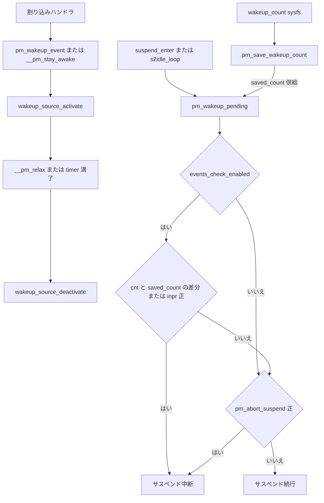

# 第11章 wakeup source と wake IRQ

> **本章で読むソース**
>
> - [`include/linux/pm_wakeup.h` L43-L64](https://github.com/gregkh/linux/blob/v6.18.38/include/linux/pm_wakeup.h#L43-L64)
> - [`include/linux/pm_wakeup.h` L82-L85](https://github.com/gregkh/linux/blob/v6.18.38/include/linux/pm_wakeup.h#L82-L85)
> - [`drivers/base/power/wakeup.c` L45-L54](https://github.com/gregkh/linux/blob/v6.18.38/drivers/base/power/wakeup.c#L45-L54)
> - [`drivers/base/power/wakeup.c` L161-L203](https://github.com/gregkh/linux/blob/v6.18.38/drivers/base/power/wakeup.c#L161-L203)
> - [`drivers/base/power/wakeup.c` L392-L422](https://github.com/gregkh/linux/blob/v6.18.38/drivers/base/power/wakeup.c#L392-L422)
> - [`drivers/base/power/wakeup.c` L491-L504](https://github.com/gregkh/linux/blob/v6.18.38/drivers/base/power/wakeup.c#L491-L504)
> - [`drivers/base/power/wakeup.c` L519-L545](https://github.com/gregkh/linux/blob/v6.18.38/drivers/base/power/wakeup.c#L519-L545)
> - [`drivers/base/power/wakeup.c` L555-L573](https://github.com/gregkh/linux/blob/v6.18.38/drivers/base/power/wakeup.c#L555-L573)
> - [`drivers/base/power/wakeup.c` L594-L639](https://github.com/gregkh/linux/blob/v6.18.38/drivers/base/power/wakeup.c#L594-L639)
> - [`drivers/base/power/wakeup.c` L660-L748](https://github.com/gregkh/linux/blob/v6.18.38/drivers/base/power/wakeup.c#L660-L748)
> - [`drivers/base/power/wakeup.c` L787-L837](https://github.com/gregkh/linux/blob/v6.18.38/drivers/base/power/wakeup.c#L787-L837)
> - [`drivers/base/power/wakeup.c` L865-L895](https://github.com/gregkh/linux/blob/v6.18.38/drivers/base/power/wakeup.c#L865-L895)
> - [`drivers/base/power/wakeup.c` L952-L1012](https://github.com/gregkh/linux/blob/v6.18.38/drivers/base/power/wakeup.c#L952-L1012)
> - [`drivers/base/power/power.h` L26-L39](https://github.com/gregkh/linux/blob/v6.18.38/drivers/base/power/power.h#L26-L39)
> - [`drivers/base/power/wakeirq.c` L40-L71](https://github.com/gregkh/linux/blob/v6.18.38/drivers/base/power/wakeirq.c#L40-L71)
> - [`drivers/base/power/wakeirq.c` L135-L224](https://github.com/gregkh/linux/blob/v6.18.38/drivers/base/power/wakeirq.c#L135-L224)
> - [`drivers/base/power/wakeirq.c` L265-L391](https://github.com/gregkh/linux/blob/v6.18.38/drivers/base/power/wakeirq.c#L265-L391)
> - [`drivers/base/power/main.c` L1573-L1583](https://github.com/gregkh/linux/blob/v6.18.38/drivers/base/power/main.c#L1573-L1583)
> - [`drivers/base/power/main.c` L863-L870](https://github.com/gregkh/linux/blob/v6.18.38/drivers/base/power/main.c#L863-L870)

## 共通規約

コード引用は [`gregkh/linux` の `v6.18.38`](https://github.com/gregkh/linux/tree/v6.18.38) に固定する。
行番号はローカル展開ソースと照合して確認し、成果物にはローカル絶対パスを書かない。
7.x 系の注釈のみ [`v7.1.3`](https://github.com/gregkh/linux/tree/v7.1.3) を使う。

## この章の狙い

サスペンド中に「起こしてよいイベントが来ていないか」をカーネルがどう判定するかを読む。
**wakeup source** の active 状態と `pm_wakeup_pending` の関係、および `/sys/power/wakeup_count` を介した userspace との競合回避を追う。
後半では **wake IRQ** の dedicated 経路が runtime PM とどう連動して個別デバイスを起こすかを扱う。

## 前提

- [第4章 Suspend to RAM と s2idle](../part01-system-pm/04-suspend-s2idle.md) の `suspend_enter` 内 `pm_wakeup_pending` と `s2idle_loop` の待ち合わせ。
- [第9章 DPM callback 順序](09-dpm-callback-order.md) の `dpm_suspend_noirq` と `dpm_resume_noirq` が wake IRQ を arm/disarm する呼び出し元。
- [第10章 runtime PM 状態機械](10-runtime-pm-state-machine.md) の `rpm_suspend`/`rpm_resume` が `dev_pm_enable_wake_irq_check` 等を呼ぶ経路。

## wakeup_source の構造と登録

`struct wakeup_source` はイベント統計と現在の active 状態を保持する。

[`include/linux/pm_wakeup.h` L43-L64](https://github.com/gregkh/linux/blob/v6.18.38/include/linux/pm_wakeup.h#L43-L64)

```c
struct wakeup_source {
	const char 		*name;
	int			id;
	struct list_head	entry;
	spinlock_t		lock;
	struct wake_irq		*wakeirq;
	struct timer_list	timer;
	// ... (中略) ...
	unsigned long		event_count;
	unsigned long		active_count;
	unsigned long		relax_count;
	// ... (中略) ...
	unsigned long		wakeup_count;
	struct device		*dev;
	bool			active:1;
	bool			autosleep_enabled:1;
};
```

| フィールド | 意味 |
|---|---|
| `event_count` | イベント検出回数 |
| `active_count` | inactive→active 遷移の累積回数（統計） |
| `relax_count` | deactivate 回数（統計） |
| `wakeup_count` | `events_check_enabled` 期間中に report されたイベントの概算（統計） |
| `active` | この source が現在 active か |

per-source カウンタは統計であり、`pm_wakeup_pending` の判定に直接使われるのはこれらではない。
`pm_wakeup_pending` が読むのはグローバル `combined_event_count` から取り出した registered 数 `cnt`、処理中数 `inpr`、および `saved_count` との比較である。

`wakeup_sources` リストの保護は二層である。
reader 側の走査と lifetime は SRCU（`wakeup_srcu`）が担う。
リスト自体の追加と削除は `events_lock` 下で `list_add_rcu`/`list_del_rcu` を行う。
削除は `list_del_rcu` のあと `synchronize_srcu` で全 reader の退出を待つ。

[`drivers/base/power/wakeup.c` L161-L203](https://github.com/gregkh/linux/blob/v6.18.38/drivers/base/power/wakeup.c#L161-L203)

```c
static void wakeup_source_add(struct wakeup_source *ws)
{
	// ... (中略) ...
	raw_spin_lock_irqsave(&events_lock, flags);
	list_add_rcu(&ws->entry, &wakeup_sources);
	raw_spin_unlock_irqrestore(&events_lock, flags);
}

static void wakeup_source_remove(struct wakeup_source *ws)
{
	// ... (中略) ...
	raw_spin_lock_irqsave(&events_lock, flags);
	list_del_rcu(&ws->entry);
	raw_spin_unlock_irqrestore(&events_lock, flags);
	synchronize_srcu(&wakeup_srcu);

	timer_delete_sync(&ws->timer);
	ws->timer.function = NULL;
}
```

## デバイス側の wakeup 有効化

`device_may_wakeup` はハードウェア能力 `can_wakeup` と、wakeup source が attach 済みか `dev->power.wakeup` の両方を要求する。

[`include/linux/pm_wakeup.h` L82-L85](https://github.com/gregkh/linux/blob/v6.18.38/include/linux/pm_wakeup.h#L82-L85)

```c
static inline bool device_may_wakeup(struct device *dev)
{
	return dev->power.can_wakeup && !!dev->power.wakeup;
}
```

有効化は userspace の sysfs だけでなく、`device_init_wakeup` や `device_set_wakeup_enable` からも行える。

[`drivers/base/power/wakeup.c` L491-L504](https://github.com/gregkh/linux/blob/v6.18.38/drivers/base/power/wakeup.c#L491-L504)

```c
int device_set_wakeup_enable(struct device *dev, bool enable)
{
	if (enable)
		return device_wakeup_enable(dev);

	device_wakeup_disable(dev);
	return 0;
}
```

## イベント通知の2系統

wakeup イベントの終了時刻が分かるかどうかで API が2系統に分かれる。

[`drivers/base/power/wakeup.c` L519-L545](https://github.com/gregkh/linux/blob/v6.18.38/drivers/base/power/wakeup.c#L519-L545)

```c
/*
 * First, a wakeup event may be detected by the same functional unit that will
 * carry out the entire processing of it and possibly will pass it to user space
 * for further processing.  In that case the functional unit that has detected
 * the event may later "close" the "no suspend" period associated with it
 * directly as soon as it has been dealt with.  The pair of pm_stay_awake() and
 * pm_relax(), balanced with each other, is supposed to be used in such
 * situations.
 *
 * Second, a wakeup event may be detected by one functional unit and processed
 * by another one.  In that case the unit that has detected it cannot really
 * "close" the "no suspend" period associated with it, unless it knows in
 * advance what's going to happen to the event during processing.  This
 * knowledge, however, may not be available to it, so it can simply specify time
 * to wait before the system can be suspended and pass it as the second
 * argument of pm_wakeup_event().
 */
```

`__pm_stay_awake` は `wakeup_source_report_event` から `wakeup_source_activate` へ進む。
`ws->active = true` と `combined_event_count` の in-progress 加算がここで行われる。

[`drivers/base/power/wakeup.c` L555-L573](https://github.com/gregkh/linux/blob/v6.18.38/drivers/base/power/wakeup.c#L555-L573)

```c
static void wakeup_source_activate(struct wakeup_source *ws)
{
	unsigned int cec;
	// ... (中略) ...
	ws->active = true;
	ws->active_count++;
	// ... (中略) ...
	cec = atomic_inc_return(&combined_event_count);

	trace_wakeup_source_activate(ws->name, cec);
}
```

[`drivers/base/power/wakeup.c` L594-L639](https://github.com/gregkh/linux/blob/v6.18.38/drivers/base/power/wakeup.c#L594-L639)

```c
void __pm_stay_awake(struct wakeup_source *ws)
{
	unsigned long flags;

	if (!ws)
		return;

	spin_lock_irqsave(&ws->lock, flags);

	wakeup_source_report_event(ws, false);
	timer_delete(&ws->timer);
	ws->timer_expires = 0;

	spin_unlock_irqrestore(&ws->lock, flags);
}

void pm_stay_awake(struct device *dev)
{
	// ... (中略) ...
	spin_lock_irqsave(&dev->power.lock, flags);
	__pm_stay_awake(dev->power.wakeup);
	spin_unlock_irqrestore(&dev->power.lock, flags);
}
```

`__pm_relax` は `wakeup_source_deactivate` で in-progress を減算し registered を増やす。
`waitqueue_active(&wakeup_count_wait_queue)` があれば起こす。

[`drivers/base/power/wakeup.c` L660-L748](https://github.com/gregkh/linux/blob/v6.18.38/drivers/base/power/wakeup.c#L660-L748)

```c
static void wakeup_source_deactivate(struct wakeup_source *ws)
{
	// ... (中略) ...
	cec = atomic_add_return(MAX_IN_PROGRESS, &combined_event_count);
	trace_wakeup_source_deactivate(ws->name, cec);

	split_counters(&cnt, &inpr);
	if (!inpr && waitqueue_active(&wakeup_count_wait_queue))
		wake_up(&wakeup_count_wait_queue);
}

void __pm_relax(struct wakeup_source *ws)
{
	unsigned long flags;

	if (!ws)
		return;

	spin_lock_irqsave(&ws->lock, flags);
	if (ws->active)
		wakeup_source_deactivate(ws);
	spin_unlock_irqrestore(&ws->lock, flags);
}
```

`pm_wakeup_ws_event` は `msec == 0` なら即 deactivate、非0なら `mod_timer` で遅延終了を予約する。

[`drivers/base/power/wakeup.c` L787-L837](https://github.com/gregkh/linux/blob/v6.18.38/drivers/base/power/wakeup.c#L787-L837)

```c
void pm_wakeup_ws_event(struct wakeup_source *ws, unsigned int msec, bool hard)
{
	// ... (中略) ...
	wakeup_source_report_event(ws, hard);

	if (!msec) {
		wakeup_source_deactivate(ws);
		goto unlock;
	}
	// ... (中略) ...
		mod_timer(&ws->timer, expires);
		ws->timer_expires = expires;
 unlock:
	spin_unlock_irqrestore(&ws->lock, flags);
}

void pm_wakeup_dev_event(struct device *dev, unsigned int msec, bool hard)
{
	// ... (中略) ...
	pm_wakeup_ws_event(dev->power.wakeup, msec, hard);
}
```

`pm_wakeup_event` は `hard=false` である。
`pm_abort_suspend` を直接立てる hard 経路は `pm_wakeup_hard_event` や `pm_system_irq_wakeup` が担う。

## pm_wakeup_pending によるサスペンド中断

`events_check_enabled` が立っているときだけ `split_counters` で `cnt`/`inpr` を取り出し判定する。
pending を検出したときだけ `events_check_enabled` を false に落とし、差分も処理中も無ければ `ret` は false のまま関数末尾に進む。
関数末尾の戻り値は `ret || atomic_read(&pm_abort_suspend) > 0` であり、`events_check_enabled` が偽で `ret` が立たない経路でも `pm_abort_suspend` が正なら中断は成立する。
`pm_abort_suspend` は前節の hard 経路（`pm_wakeup_hard_event` や `pm_system_irq_wakeup`）が `pm_system_wakeup` 経由で立てるカウンタであり、`events_check_enabled` によるソフトな差分検査とは独立に効く。

[`drivers/base/power/wakeup.c` L865-L895](https://github.com/gregkh/linux/blob/v6.18.38/drivers/base/power/wakeup.c#L865-L895)

```c
bool pm_wakeup_pending(void)
{
	unsigned long flags;
	bool ret = false;

	raw_spin_lock_irqsave(&events_lock, flags);
	if (events_check_enabled) {
		unsigned int cnt, inpr;

		split_counters(&cnt, &inpr);
		ret = (cnt != saved_count || inpr > 0);
		events_check_enabled = !ret;
	}
	raw_spin_unlock_irqrestore(&events_lock, flags);

	if (ret) {
		pm_pr_dbg("Wakeup pending, aborting suspend\n");
		pm_print_active_wakeup_sources();
	}

	return ret || atomic_read(&pm_abort_suspend) > 0;
}
```

[第9章](09-dpm-callback-order.md) の `device_suspend` と `device_suspend_late` も `pm_wakeup_pending` を見て `async_error = -EBUSY` にする。
DPM 本体の深入りは第9章に委ね、本章では wakeup 側から見たエッジとして位置づける。

## wakeup_count sysfs と userspace との競合回避

`/sys/power/wakeup_count` の read/write は `pm_get_wakeup_count` と `pm_save_wakeup_count` を呼ぶ。
userspace は read で count を取得し、write で同じ値を保存する。
保存は「読み取った count が今の値と一致し、かつ処理中イベントが0」のときだけ成功し `events_check_enabled = true` になる。

[`drivers/base/power/wakeup.c` L952-L1012](https://github.com/gregkh/linux/blob/v6.18.38/drivers/base/power/wakeup.c#L952-L1012)

```c
bool pm_get_wakeup_count(unsigned int *count, bool block)
{
	unsigned int cnt, inpr;
	// ... (中略) ...
	split_counters(&cnt, &inpr);
	*count = cnt;
	return !inpr;
}

bool pm_save_wakeup_count(unsigned int count)
{
	unsigned int cnt, inpr;
	unsigned long flags;

	events_check_enabled = false;
	raw_spin_lock_irqsave(&events_lock, flags);
	split_counters(&cnt, &inpr);
	if (cnt == count && inpr == 0) {
		saved_count = count;
		events_check_enabled = true;
	}
	raw_spin_unlock_irqrestore(&events_lock, flags);
	return events_check_enabled;
}
```

read から write までのあいだに新規イベントが来ると保存が失敗し、userspace はサスペンドを諦められる。

## combined_event_count のビット分割

`combined_event_count` は1つの `atomic_t` に registered 数（上位ビット）と処理中数（下位16ビット）を詰め込む。
1回の atomic RMW で両方を同時に更新し、`pm_wakeup_pending` が読む `cnt`/`inpr` の整合した snapshot を作る。

[`drivers/base/power/wakeup.c` L45-L54](https://github.com/gregkh/linux/blob/v6.18.38/drivers/base/power/wakeup.c#L45-L54)

```c
#define IN_PROGRESS_BITS	(sizeof(int) * 4)
#define MAX_IN_PROGRESS		((1 << IN_PROGRESS_BITS) - 1)

static void split_counters(unsigned int *cnt, unsigned int *inpr)
{
	unsigned int comb = atomic_read(&combined_event_count);

	*cnt = (comb >> IN_PROGRESS_BITS);
	*inpr = comb & MAX_IN_PROGRESS;
}
```

明示的なグローバルロックを使わずに更新する一方、`wakeup_source_activate`/`wakeup_source_deactivate` は `ws->lock` で source 単位に保護される。

## dedicated wake IRQ

`struct wake_irq` はデバイスごとの wake IRQ 状態を表す。

[`drivers/base/power/power.h` L26-L39](https://github.com/gregkh/linux/blob/v6.18.38/drivers/base/power/power.h#L26-L39)

```c
#define WAKE_IRQ_DEDICATED_ALLOCATED	BIT(0)
#define WAKE_IRQ_DEDICATED_MANAGED	BIT(1)
#define WAKE_IRQ_DEDICATED_REVERSE	BIT(2)
// ... (中略) ...
#define WAKE_IRQ_DEDICATED_ENABLED	BIT(3)

struct wake_irq {
	struct device *dev;
	unsigned int status;
	int irq;
	const char *name;
};
```

`dev_pm_set_wake_irq` はデバイスの IO 割り込みを wake IRQ として流用する。
専用ハンドラは無く `dev_pm_attach_wake_irq` で接続するだけである。

[`drivers/base/power/wakeirq.c` L40-L71](https://github.com/gregkh/linux/blob/v6.18.38/drivers/base/power/wakeirq.c#L40-L71)

```c
int dev_pm_set_wake_irq(struct device *dev, int irq)
{
	struct wake_irq *wirq;
	int err;
	// ... (中略) ...
	wirq->dev = dev;
	wirq->irq = irq;

	err = dev_pm_attach_wake_irq(dev, wirq);
	// ... (中略) ...
}
```

`dev_pm_set_dedicated_wake_irq` は threaded IRQ を request する。
`IRQF_NO_AUTOEN` が request 時の自動 enable を止め、確保直後は disabled になる。
`IRQ_DISABLE_UNLAZY` は以後の `disable_irq_nosync` が遅延せずマスクするよう設定し、deferred spurious wake を防ぐ。

[`drivers/base/power/wakeirq.c` L135-L224](https://github.com/gregkh/linux/blob/v6.18.38/drivers/base/power/wakeirq.c#L135-L224)

```c
static irqreturn_t handle_threaded_wake_irq(int irq, void *_wirq)
{
	struct wake_irq *wirq = _wirq;
	int res;

	if (irqd_is_wakeup_set(irq_get_irq_data(irq))) {
		pm_wakeup_event(wirq->dev, 0);

		return IRQ_HANDLED;
	}

	res = pm_runtime_resume(wirq->dev);
	// ... (中略) ...

	return IRQ_HANDLED;
}

static int __dev_pm_set_dedicated_wake_irq(struct device *dev, int irq, unsigned int flag)
{
	// ... (中略) ...
	irq_set_status_flags(irq, IRQ_DISABLE_UNLAZY);

	err = request_threaded_irq(irq, NULL, handle_threaded_wake_irq,
				   IRQF_ONESHOT | IRQF_NO_AUTOEN,
				   wirq->name, wirq);
	// ... (中略) ...
}
```

IRQ が system wake 用に armed されているときは `pm_wakeup_event` でサスペンド中断を報告する。
そうでない runtime wake のときは同期 `pm_runtime_resume` でデバイスを起こす。

runtime PM 連動の enable/disable は `dev_pm_enable_wake_irq_check` 等が担う。
初回 `rpm_suspend` で `WAKE_IRQ_DEDICATED_MANAGED` を立て、`WAKE_IRQ_DEDICATED_REVERSE` のときは suspend callback 後に `dev_pm_enable_wake_irq_complete` で enable する。

[`drivers/base/power/wakeirq.c` L265-L391](https://github.com/gregkh/linux/blob/v6.18.38/drivers/base/power/wakeirq.c#L265-L391)

```c
void dev_pm_enable_wake_irq_check(struct device *dev,
				  bool can_change_status)
{
	// ... (中略) ...
	if (likely(wirq->status & WAKE_IRQ_DEDICATED_MANAGED)) {
		goto enable;
	} else if (can_change_status) {
		wirq->status |= WAKE_IRQ_DEDICATED_MANAGED;
		goto enable;
	}
	// ... (中略) ...
enable:
	if (!can_change_status || !(wirq->status & WAKE_IRQ_DEDICATED_REVERSE)) {
		enable_irq(wirq->irq);
		wirq->status |= WAKE_IRQ_DEDICATED_ENABLED;
	}
}

void dev_pm_arm_wake_irq(struct wake_irq *wirq)
{
	if (!wirq)
		return;

	if (device_may_wakeup(wirq->dev)) {
		if (wirq->status & WAKE_IRQ_DEDICATED_ALLOCATED &&
		    !(wirq->status & WAKE_IRQ_DEDICATED_ENABLED))
			enable_irq(wirq->irq);

		enable_irq_wake(wirq->irq);
	}
}
```

system sleep では `device_wakeup_arm_wake_irqs` が全 wakeup source の `wakeirq` を走査し `dev_pm_arm_wake_irq` を呼ぶ。

[`drivers/base/power/wakeup.c` L392-L422](https://github.com/gregkh/linux/blob/v6.18.38/drivers/base/power/wakeup.c#L392-L422)

```c
void device_wakeup_arm_wake_irqs(void)
{
	struct wakeup_source *ws;
	int srcuidx;

	srcuidx = srcu_read_lock(&wakeup_srcu);
	list_for_each_entry_rcu_locked(ws, &wakeup_sources, entry)
		dev_pm_arm_wake_irq(ws->wakeirq);
	srcu_read_unlock(&wakeup_srcu, srcuidx);
}

void device_wakeup_disarm_wake_irqs(void)
{
	// ... (中略) ...
	list_for_each_entry_rcu_locked(ws, &wakeup_sources, entry)
		dev_pm_disarm_wake_irq(ws->wakeirq);
	// ... (中略) ...
}
```

[第9章](09-dpm-callback-order.md) の `dpm_suspend_noirq` は `suspend_device_irqs` の前に arm、`dpm_resume_noirq` は `resume_device_irqs` の後に disarm する。

[`drivers/base/power/main.c` L1573-L1583](https://github.com/gregkh/linux/blob/v6.18.38/drivers/base/power/main.c#L1573-L1583)

```c
int dpm_suspend_noirq(pm_message_t state)
{
	int ret;

	device_wakeup_arm_wake_irqs();
	suspend_device_irqs();

	ret = dpm_noirq_suspend_devices(state);
	if (ret)
		dpm_resume_noirq(resume_event(state));

	return ret;
}
```

[`drivers/base/power/main.c` L863-L870](https://github.com/gregkh/linux/blob/v6.18.38/drivers/base/power/main.c#L863-L870)

```c
void dpm_resume_noirq(pm_message_t state)
{
	dpm_noirq_resume_devices(state);

	resume_device_irqs();
	device_wakeup_disarm_wake_irqs();
}
```

## wakeup event とサスペンド中断のフロー




## 7.x 系での変化

> **7.x 系での変化**
> [`wakeup_source_not_registered`](https://github.com/gregkh/linux/blob/v6.18.38/drivers/base/power/wakeup.c#L506-L517) は v7.1.3 で [`wakeup_source_not_usable`](https://github.com/gregkh/linux/blob/v7.1.3/drivers/base/power/wakeup.c#L506-L516) に改名され、「初期化済みかつ消滅中でないか」を検査する意図がコメントに明記された。
> [`wakeup_source_remove`](https://github.com/gregkh/linux/blob/v7.1.3/drivers/base/power/wakeup.c#L185-L202) では `timer_delete_sync` が `timer_shutdown_sync` に変わり、削除後に `wakeup_source_activate` が渡されたら warn する流れが厳格化された。
> `kzalloc(sizeof(*ws))` 等は `kzalloc_obj` への置き換えであり、機構的な変更ではない。

## まとめ

wakeup source は per-source 統計とグローバル `combined_event_count` を分け、`pm_wakeup_pending` は後者と `saved_count` でサスペンド可否を判定する。
`pm_stay_awake`/`pm_relax` と `pm_wakeup_event` はイベント終了の見積もり方が異なる2系統である。
`/sys/power/wakeup_count` は userspace とカーネルの競合を検出する。
dedicated wake IRQ は runtime PM と system sleep の両方で、armed 状態に応じて `pm_wakeup_event` か `pm_runtime_resume` に分岐する。

## 関連する章

- 前提: [第4章 Suspend to RAM と s2idle](../part01-system-pm/04-suspend-s2idle.md)
- 関連: [第9章 DPM callback 順序](09-dpm-callback-order.md)
- 関連: [第10章 runtime PM 状態機械](10-runtime-pm-state-machine.md)
- 次章候補: 第12章 generic power domain
