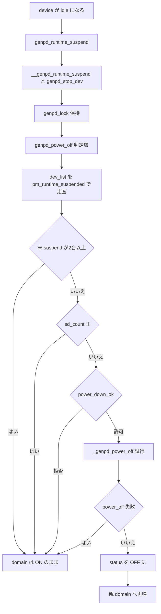

# 第12章 generic power domain

> **本章で読むソース**
>
> - [`include/linux/pm_domain.h` L155-L158](https://github.com/gregkh/linux/blob/v6.18.38/include/linux/pm_domain.h#L155-L158)
> - [`include/linux/pm_domain.h` L193-L252](https://github.com/gregkh/linux/blob/v6.18.38/include/linux/pm_domain.h#L193-L252)
> - [`drivers/pmdomain/core.c` L355-L398](https://github.com/gregkh/linux/blob/v6.18.38/drivers/pmdomain/core.c#L355-L398)
> - [`drivers/pmdomain/core.c` L512-L598](https://github.com/gregkh/linux/blob/v6.18.38/drivers/pmdomain/core.c#L512-L598)
> - [`drivers/pmdomain/core.c` L882-L930](https://github.com/gregkh/linux/blob/v6.18.38/drivers/pmdomain/core.c#L882-L930)
> - [`drivers/pmdomain/core.c` L956-L1095](https://github.com/gregkh/linux/blob/v6.18.38/drivers/pmdomain/core.c#L956-L1095)
> - [`drivers/pmdomain/core.c` L1164-L1279](https://github.com/gregkh/linux/blob/v6.18.38/drivers/pmdomain/core.c#L1164-L1279)
> - [`drivers/pmdomain/core.c` L1290-L1358](https://github.com/gregkh/linux/blob/v6.18.38/drivers/pmdomain/core.c#L1290-L1358)
> - [`drivers/pmdomain/core.c` L1409-L1449](https://github.com/gregkh/linux/blob/v6.18.38/drivers/pmdomain/core.c#L1409-L1449)
> - [`drivers/pmdomain/core.c` L1495-L1565](https://github.com/gregkh/linux/blob/v6.18.38/drivers/pmdomain/core.c#L1495-L1565)
> - [`drivers/pmdomain/core.c` L1575-L1632](https://github.com/gregkh/linux/blob/v6.18.38/drivers/pmdomain/core.c#L1575-L1632)
> - [`drivers/pmdomain/core.c` L1915-L1976](https://github.com/gregkh/linux/blob/v6.18.38/drivers/pmdomain/core.c#L1915-L1976)
> - [`drivers/pmdomain/core.c` L2135-L2206](https://github.com/gregkh/linux/blob/v6.18.38/drivers/pmdomain/core.c#L2135-L2206)
> - [`drivers/pmdomain/core.c` L2386-L2454](https://github.com/gregkh/linux/blob/v6.18.38/drivers/pmdomain/core.c#L2386-L2454)
> - [`drivers/pmdomain/core.c` L3180-L3280](https://github.com/gregkh/linux/blob/v6.18.38/drivers/pmdomain/core.c#L3180-L3280)
> - [`drivers/pmdomain/core.c` L3299-L3345](https://github.com/gregkh/linux/blob/v6.18.38/drivers/pmdomain/core.c#L3299-L3345)

## 共通規約

コード引用は [`gregkh/linux` の `v6.18.38`](https://github.com/gregkh/linux/tree/v6.18.38) に固定する。
7.x 系の注釈のみ [`v7.1.3`](https://github.com/gregkh/linux/tree/v7.1.3) を使う。
行番号はローカル展開ソースと照合して確認し、成果物にはローカル絶対パスを書かない。

## この章の狙い

**generic power domain**（genpd）は、複数 device が共有する電源ドメインの抽象化である。
[第10章 runtime PM 状態機械](10-runtime-pm-state-machine.md) の上に構築され、`struct dev_pm_domain` 経由で runtime PM と system sleep の両方に割り込む。
本章では `drivers/pmdomain/core.c` のコア実装を読む（SoC 別 pmdomain ドライバは対象外）。

## 前提

- [第10章 runtime PM 状態機械](10-runtime-pm-state-machine.md) の `pm_runtime_suspended`、`rpm_suspend`/`rpm_resume`。
- [第8章 Energy Model と性能ドメイン](../part01-system-pm/08-energy-model.md) の OPP（performance state と OPP の対応は同章に委譲）。
- [第9章 DPM callback 順序](09-dpm-callback-order.md) の system sleep フェーズ。

## struct generic_pm_domain

genpd の中核は `struct generic_pm_domain` である。
実装は v6.18.38 以降 `drivers/pmdomain/core.c` にあり、`drivers/base/power/domain.c` は存在しない。

[`include/linux/pm_domain.h` L193-L252](https://github.com/gregkh/linux/blob/v6.18.38/include/linux/pm_domain.h#L193-L252)

```c
struct generic_pm_domain {
	struct device dev;
	struct dev_pm_domain domain;	/* PM domain operations */
	struct list_head gpd_list_node;	/* Node in the global PM domains list */
	struct list_head parent_links;	/* Links with PM domain as a parent */
	struct list_head child_links;	/* Links with PM domain as a child */
	struct list_head dev_list;	/* List of devices */
	struct dev_power_governor *gov;
	struct genpd_governor_data *gd;	/* Data used by a genpd governor. */
	struct work_struct power_off_work;
	struct fwnode_handle *provider;	/* Identity of the domain provider */
	bool has_provider;
	const char *name;
	atomic_t sd_count;	/* Number of subdomains with power "on" */
	enum gpd_status status;	/* Current state of the domain */
	unsigned int device_count;	/* Number of devices */
	unsigned int device_id;		/* unique device id */
	unsigned int suspended_count;	/* System suspend device counter */
	unsigned int prepared_count;	/* Suspend counter of prepared devices */
	unsigned int performance_state;	/* Aggregated max performance state */
	cpumask_var_t cpus;		/* A cpumask of the attached CPUs */
	bool synced_poweroff;		/* A consumer needs a synced poweroff */
	bool stay_on;			/* Stay powered-on during boot. */
	enum genpd_sync_state sync_state; /* How sync_state is managed. */
	int (*power_off)(struct generic_pm_domain *domain);
	int (*power_on)(struct generic_pm_domain *domain);
	struct raw_notifier_head power_notifiers; /* Power on/off notifiers */
	struct opp_table *opp_table;	/* OPP table of the genpd */
	int (*set_performance_state)(struct generic_pm_domain *genpd,
				     unsigned int state);
	struct gpd_dev_ops dev_ops;
	// ... (中略) ...
	unsigned int state_count; /* number of states */
	unsigned int state_idx; /* state that genpd will go to when off */
	u64 on_time;
	u64 accounting_time;
	const struct genpd_lock_ops *lock_ops;
	union {
		struct mutex mlock;
		struct {
			spinlock_t slock;
			unsigned long lock_flags;
		};
		struct {
			raw_spinlock_t raw_slock;
			unsigned long raw_lock_flags;
		};
	};
};
```

| カウンタ/フィールド | 役割 |
|---|---|
| `device_count` | domain に属する device の総数 |
| `suspended_count` | **system sleep** 経路で `genpd_finish_suspend` が増やし `genpd_finish_resume` が減らす |
| `prepared_count` | `genpd_prepare`〜`genpd_complete` 中に runtime PM 経由の power-off を抑止 |
| `sd_count` | 電源が on の subdomain 数 |
| `status` | `GENPD_STATE_ON`/`GENPD_STATE_OFF` |

runtime PM 経路の `genpd_power_off` は `suspended_count` の代わりに `dev_list` を走査して `pm_runtime_suspended` を数える。
一方で `prepared_count` と `sd_count` は `genpd_power_off` の早期 return 条件としてそのまま使う。
3カウンタを一律「使わない」と一括りにしない。

governor は `power_down_ok` と `suspend_ok` を持つ。

[`include/linux/pm_domain.h` L155-L158](https://github.com/gregkh/linux/blob/v6.18.38/include/linux/pm_domain.h#L155-L158)

```c
struct dev_power_governor {
	bool (*power_down_ok)(struct dev_pm_domain *domain);
	bool (*suspend_ok)(struct device *dev);
};
```

## 初期化と device 登録

`pm_genpd_init` は `domain.ops` に genpd 版 callback を差し込む。

[`drivers/pmdomain/core.c` L2386-L2422](https://github.com/gregkh/linux/blob/v6.18.38/drivers/pmdomain/core.c#L2386-L2422)

```c
int pm_genpd_init(struct generic_pm_domain *genpd,
		  struct dev_power_governor *gov, bool is_off)
{
	// ... (中略) ...
	genpd->domain.ops.runtime_suspend = genpd_runtime_suspend;
	genpd->domain.ops.runtime_resume = genpd_runtime_resume;
	genpd->domain.ops.prepare = genpd_prepare;
	genpd->domain.ops.suspend_noirq = genpd_suspend_noirq;
	genpd->domain.ops.resume_noirq = genpd_resume_noirq;
	// ... (中略) ...
	genpd->domain.ops.complete = genpd_complete;
	genpd->domain.set_performance_state = genpd_dev_pm_set_performance_state;
	// ... (中略) ...
}
```

`pm_genpd_add_device` は device を `dev_list` に追加し `dev_pm_domain_set` で `pm_domain` を向ける。

[`drivers/pmdomain/core.c` L1915-L1976](https://github.com/gregkh/linux/blob/v6.18.38/drivers/pmdomain/core.c#L1915-L1976)

```c
static int genpd_add_device(struct generic_pm_domain *genpd, struct device *dev,
			    struct device *base_dev)
{
	// ... (中略) ...
	genpd->device_count++;
	list_add_tail(&gpd_data->base.list_node, &genpd->dev_list);
	genpd_unlock(genpd);
	dev_pm_domain_set(dev, &genpd->domain);
	// ... (中略) ...
}

int pm_genpd_add_device(struct generic_pm_domain *genpd, struct device *dev)
{
	// ... (中略) ...
	ret = genpd_add_device(genpd, dev, dev);
	// ... (中略) ...
}
EXPORT_SYMBOL_GPL(pm_genpd_add_device);
```

## runtime PM 経路での集約

### 個別 callback の代理実行

`__genpd_runtime_suspend` は domain ハードウェア専用 callback ではない。
`type`→`class`→`bus` の順で最初に存在する中間層 ops の `runtime_suspend` を選び、無ければ driver へ fallback する。

[`drivers/pmdomain/core.c` L1164-L1204](https://github.com/gregkh/linux/blob/v6.18.38/drivers/pmdomain/core.c#L1164-L1204)

```c
static int __genpd_runtime_suspend(struct device *dev)
{
	int (*cb)(struct device *__dev);

	if (dev->type && dev->type->pm)
		cb = dev->type->pm->runtime_suspend;
	else if (dev->class && dev->class->pm)
		cb = dev->class->pm->runtime_suspend;
	else if (dev->bus && dev->bus->pm)
		cb = dev->bus->pm->runtime_suspend;
	else
		cb = NULL;

	if (!cb && dev->driver && dev->driver->pm)
		cb = dev->driver->pm->runtime_suspend;

	return cb ? cb(dev) : 0;
}
```

### genpd_runtime_suspend の順序

`genpd_runtime_suspend` は `__genpd_runtime_suspend` → `genpd_stop_dev` の順で呼ぶ。
`genpd_stop_dev` 失敗時は `__genpd_runtime_resume` で巻き戻す。
成功時のみ `genpd_lock` 下で `genpd_power_off(genpd, true, 0)` と `genpd_drop_performance_state` を実行する。

[`drivers/pmdomain/core.c` L1214-L1279](https://github.com/gregkh/linux/blob/v6.18.38/drivers/pmdomain/core.c#L1214-L1279)

```c
static int genpd_runtime_suspend(struct device *dev)
{
	// ... (中略) ...
	ret = __genpd_runtime_suspend(dev);
	if (ret)
		return ret;

	ret = genpd_stop_dev(genpd, dev);
	if (ret) {
		__genpd_runtime_resume(dev);
		return ret;
	}
	// ... (中略) ...
	genpd_lock(genpd);
	genpd_power_off(genpd, true, 0);
	gpd_data->rpm_pstate = genpd_drop_performance_state(dev);
	genpd_unlock(genpd);

	return 0;
}
```

resume 側は `genpd_power_on` → `genpd_start_dev` → `__genpd_runtime_resume` の順である。
巻き戻しは失敗点ごとに異なる。
`genpd_power_on` 失敗時は `if (ret) return ret;` で即 return し、`genpd_stop_dev` も `genpd_power_off` も呼ばない。
`genpd_start_dev` 失敗時は `goto err_poweroff` で `err_stop` を飛ばすため `genpd_stop_dev` を呼ばず、`err_poweroff` の条件付き `genpd_power_off` と `genpd_drop_performance_state` だけを実行する。
`__genpd_runtime_resume` 失敗時は `goto err_stop` でこの経路でのみ `genpd_stop_dev` を実行し、そのまま `err_poweroff` へ落ちて条件付き `genpd_power_off` と `genpd_drop_performance_state` を実行する。
`err_poweroff` の条件は `!pm_runtime_is_irq_safe(dev) || genpd_is_irq_safe(genpd)` であり、IRQ safe な device が non-IRQ-safe domain に属する場合は domain 電源の巻き戻しを行わない。
そのような device は forward 側の `genpd_power_on` でも同じ条件でスキップされているため、domain 電源の対称性が保たれる。

[`drivers/pmdomain/core.c` L1290-L1358](https://github.com/gregkh/linux/blob/v6.18.38/drivers/pmdomain/core.c#L1290-L1358)

```c
static int genpd_runtime_resume(struct device *dev)
{
	// ... (中略) ...
	if (irq_safe_dev_in_sleep_domain(dev, genpd))
		goto out;

	genpd_lock(genpd);
	genpd_restore_performance_state(dev, gpd_data->rpm_pstate);
	ret = genpd_power_on(genpd, 0);
	genpd_unlock(genpd);
	// ... (中略) ...
 out:
	// ... (中略) ...
	ret = genpd_start_dev(genpd, dev);
	if (ret)
		goto err_poweroff;

	ret = __genpd_runtime_resume(dev);
	if (ret)
		goto err_stop;
	// ... (中略) ...
err_stop:
	genpd_stop_dev(genpd, dev);
err_poweroff:
	if (!pm_runtime_is_irq_safe(dev) || genpd_is_irq_safe(genpd)) {
		genpd_lock(genpd);
		genpd_power_off(genpd, true, 0);
		gpd_data->rpm_pstate = genpd_drop_performance_state(dev);
		genpd_unlock(genpd);
	}

	return ret;
}
```

### genpd_power_off と _genpd_power_off の分離

`genpd_power_off` は判定層で戻り値 void である。
条件を満たせば `_genpd_power_off` でハードウェア電源オフを**試行**する。
governor が拒否した場合はそのまま return するだけで、domain は on のまま `rejected` は増えない。
`rejected` が増えるのは `_genpd_power_off` が notifier chain または `power_off` callback の失敗で非0を返したときだけである。
device 側の runtime suspend はすでに成功として完了している。

[`drivers/pmdomain/core.c` L956-L1033](https://github.com/gregkh/linux/blob/v6.18.38/drivers/pmdomain/core.c#L956-L1033)

```c
static void genpd_power_off(struct generic_pm_domain *genpd, bool one_dev_on,
			    unsigned int depth)
{
	// ... (中略) ...
	if (!genpd_status_on(genpd) || genpd->prepared_count > 0 ||
	    genpd_is_always_on(genpd) || genpd_is_rpm_always_on(genpd) ||
	    genpd->stay_on || atomic_read(&genpd->sd_count) > 0)
		return;
	// ... (中略) ...
	list_for_each_entry(pdd, &genpd->dev_list, list_node) {
		if (!pm_runtime_suspended(pdd->dev) ||
			irq_safe_dev_in_sleep_domain(pdd->dev, genpd))
			not_suspended++;
		// ... (中略) ...
	}

	if (not_suspended > 1 || (not_suspended == 1 && !one_dev_on))
		return;

	if (genpd->gov && genpd->gov->power_down_ok) {
		if (!genpd->gov->power_down_ok(&genpd->domain))
			return;
	}
	// ... (中略) ...
	if (_genpd_power_off(genpd, true)) {
		genpd->states[genpd->state_idx].rejected++;
		return;
	}

	genpd->status = GENPD_STATE_OFF;
	// ... (中略) ...
	list_for_each_entry(link, &genpd->child_links, child_node) {
		genpd_sd_counter_dec(link->parent);
		genpd_lock_nested(link->parent, depth + 1);
		genpd_power_off(link->parent, false, depth + 1);
		genpd_unlock(link->parent);
	}
}
```

`one_dev_on` は `dev_list` 走査での会計ズレを補正する引数である。
callback 実行中の対象 device がまだ `RPM_SUSPENDED` と数えられない1台分を許容する。
呼び出し元本人かどうかを照合する実装ではない。
判定条件は `not_suspended > 1 || (not_suspended == 1 && !one_dev_on)` であり、未 suspend が2台以上なら `one_dev_on` の値によらず domain は on のまま維持される。
`genpd_runtime_suspend`/`genpd_runtime_resume` が対象 device の domain へ直接呼ぶときは `one_dev_on=true` で、その domain では未 suspend 1台までを許容して判定が先へ進む。
一方、電源オフ成功後に親 domain へ再帰する `genpd_power_off(link->parent, false, depth + 1)` は `one_dev_on=false` を渡すため、親 domain では未 suspend 0台のときだけ先へ進む。

`_genpd_power_off` は notifier と `genpd->power_off()` を呼ぶ実行層である。

[`drivers/pmdomain/core.c` L882-L930](https://github.com/gregkh/linux/blob/v6.18.38/drivers/pmdomain/core.c#L882-L930)

```c
static int _genpd_power_off(struct generic_pm_domain *genpd, bool timed)
{
	// ... (中略) ...
	ret = raw_notifier_call_chain_robust(&genpd->power_notifiers,
					     GENPD_NOTIFY_PRE_OFF,
					     GENPD_NOTIFY_ON, NULL);
	// ... (中略) ...
	if (!timed) {
		ret = genpd->power_off(genpd);
		if (ret)
			goto busy;
		goto out;
	}
	// ... (中略) ...
busy:
	raw_notifier_call_chain(&genpd->power_notifiers, GENPD_NOTIFY_ON, NULL);
	return ret;
}
```

### runtime PM 集約フロー



## subdomain

`pm_genpd_add_subdomain` は `gpd_link` で親子を張り、子が on の間は `sd_count` で親の off を抑止する。
親が IRQ safe でないと IRQ safe な子を持てない。

[`drivers/pmdomain/core.c` L2135-L2206](https://github.com/gregkh/linux/blob/v6.18.38/drivers/pmdomain/core.c#L2135-L2206)

```c
static int genpd_add_subdomain(struct generic_pm_domain *genpd,
			       struct generic_pm_domain *subdomain)
{
	// ... (中略) ...
	if (!genpd_is_irq_safe(genpd) && genpd_is_irq_safe(subdomain)) {
		WARN(1, "Parent %s of subdomain %s must be IRQ safe\n",
		     dev_name(&genpd->dev), subdomain->name);
		return -EINVAL;
	}
	// ... (中略) ...
	link->parent = genpd;
	list_add_tail(&link->parent_node, &genpd->parent_links);
	link->child = subdomain;
	list_add_tail(&link->child_node, &subdomain->child_links);
	if (genpd_status_on(subdomain))
		genpd_sd_counter_inc(genpd);
	// ... (中略) ...
}
EXPORT_SYMBOL_GPL(pm_genpd_add_subdomain);
```

## performance state の集約

`_genpd_reeval_performance_state` は同一 domain 内の全 device と全 subdomain の要求の最大値を取る。

[`drivers/pmdomain/core.c` L355-L398](https://github.com/gregkh/linux/blob/v6.18.38/drivers/pmdomain/core.c#L355-L398)

```c
static int _genpd_reeval_performance_state(struct generic_pm_domain *genpd,
					   unsigned int state)
{
	// ... (中略) ...
	list_for_each_entry(pdd, &genpd->dev_list, list_node) {
		pd_data = to_gpd_data(pdd);

		if (pd_data->performance_state > state)
			state = pd_data->performance_state;
	}
	// ... (中略) ...
	list_for_each_entry(link, &genpd->parent_links, parent_node) {
		if (link->performance_state > state)
			state = link->performance_state;
	}

	return state;
}
```

device が runtime-suspended のときは即時反映せず `rpm_pstate` に保留する。

[`drivers/pmdomain/core.c` L550-L598](https://github.com/gregkh/linux/blob/v6.18.38/drivers/pmdomain/core.c#L550-L598)

```c
static int genpd_dev_pm_set_performance_state(struct device *dev,
					      unsigned int state)
{
	// ... (中略) ...
	genpd_lock(genpd);
	if (pm_runtime_suspended(dev)) {
		dev_gpd_data(dev)->rpm_pstate = state;
	} else {
		ret = genpd_set_performance_state(dev, state);
		if (!ret)
			dev_gpd_data(dev)->rpm_pstate = 0;
	}
	genpd_unlock(genpd);
	// ... (中略) ...
}

int dev_pm_genpd_set_performance_state(struct device *dev, unsigned int state)
{
	// ... (中略) ...
	return genpd_dev_pm_set_performance_state(dev, state);
}
EXPORT_SYMBOL_GPL(dev_pm_genpd_set_performance_state);
```

保留値は resume 前の `genpd_restore_performance_state` で復元され、suspend 後は `genpd_drop_performance_state` で落とされる。

## system sleep 経路

`genpd_prepare` は `prepared_count` を増やし runtime PM 経由の power-off を止める。
`pm_generic_prepare` の正値は 0 に変換して返す。
genpd は direct-complete に対応しない。

[`drivers/pmdomain/core.c` L1495-L1521](https://github.com/gregkh/linux/blob/v6.18.38/drivers/pmdomain/core.c#L1495-L1521)

```c
static int genpd_prepare(struct device *dev)
{
	// ... (中略) ...
	genpd_lock(genpd);
	genpd->prepared_count++;
	genpd_unlock(genpd);

	ret = pm_generic_prepare(dev);
	// ... (中略) ...
	return ret >= 0 ? 0 : ret;
}
```

`genpd_sync_power_off` は `suspended_count == device_count` を判定に使う。
runtime PM の `genpd_power_off` とは別関数である。

[`drivers/pmdomain/core.c` L1409-L1449](https://github.com/gregkh/linux/blob/v6.18.38/drivers/pmdomain/core.c#L1409-L1449)

```c
static void genpd_sync_power_off(struct generic_pm_domain *genpd, bool use_lock,
				 unsigned int depth)
{
	// ... (中略) ...
	if (genpd->suspended_count != genpd->device_count
	    || atomic_read(&genpd->sd_count) > 0)
		return;
	// ... (中略) ...
	genpd->state_idx = genpd->state_count - 1;
	if (_genpd_power_off(genpd, false)) {
		genpd->states[genpd->state_idx].rejected++;
		return;
	}
	// ... (中略) ...
	genpd->status = GENPD_STATE_OFF;
	// ... (中略) ...
}
```

`genpd_finish_suspend` は wakeup 経路上の device を持つ active wakeup domain では `suspended_count` を増やさず power-off しない。

[`drivers/pmdomain/core.c` L1533-L1565](https://github.com/gregkh/linux/blob/v6.18.38/drivers/pmdomain/core.c#L1533-L1565)

```c
static int genpd_finish_suspend(struct device *dev,
				int (*suspend_noirq)(struct device *dev),
				int (*resume_noirq)(struct device *dev))
{
	// ... (中略) ...
	if (device_awake_path(dev) && genpd_is_active_wakeup(genpd))
		return 0;
	// ... (中略) ...
	genpd_lock(genpd);
	genpd->suspended_count++;
	genpd_sync_power_off(genpd, true, 0);
	genpd_unlock(genpd);

	return 0;
}
```

noirq 段階の入口は次のとおりである。

[`drivers/pmdomain/core.c` L1575-L1632](https://github.com/gregkh/linux/blob/v6.18.38/drivers/pmdomain/core.c#L1575-L1632)

```c
static int genpd_suspend_noirq(struct device *dev)
{
	return genpd_finish_suspend(dev,
				    pm_generic_suspend_noirq,
				    pm_generic_resume_noirq);
}

static int genpd_resume_noirq(struct device *dev)
{
	return genpd_finish_resume(dev, pm_generic_resume_noirq);
}
```

## Device Tree からの結合

`genpd_dev_pm_attach` は `power-domains` の phandle が1個のときだけ `__genpd_dev_pm_attach` を呼ぶ。

[`drivers/pmdomain/core.c` L3180-L3280](https://github.com/gregkh/linux/blob/v6.18.38/drivers/pmdomain/core.c#L3180-L3280)

```c
static int __genpd_dev_pm_attach(struct device *dev, struct device *base_dev,
				 unsigned int index, unsigned int num_domains,
				 bool power_on)
{
	// ... (中略) ...
	ret = of_parse_phandle_with_args(dev->of_node, "power-domains",
				"#power-domain-cells", index, &pd_args);
	// ... (中略) ...
	ret = genpd_add_device(pd, dev, base_dev);
	// ... (中略) ...
}

int genpd_dev_pm_attach(struct device *dev)
{
	// ... (中略) ...
	if (of_count_phandle_with_args(dev->of_node, "power-domains",
				       "#power-domain-cells") != 1)
		return 0;

	return __genpd_dev_pm_attach(dev, dev, 0, 1, true);
}
```

複数 power-domains を持つ device は1つの `pm_domain` を直接持てない。
`genpd_dev_pm_attach_by_id` は genpd bus 上に仮想 device を作り、domain ごとに attach する。

[`drivers/pmdomain/core.c` L3299-L3345](https://github.com/gregkh/linux/blob/v6.18.38/drivers/pmdomain/core.c#L3299-L3345)

```c
struct device *genpd_dev_pm_attach_by_id(struct device *dev,
					 unsigned int index)
{
	// ... (中略) ...
	dev_set_name(virt_dev, "genpd:%u:%s", index, dev_name(dev));
	virt_dev->bus = &genpd_bus_type;
	// ... (中略) ...
	ret = __genpd_dev_pm_attach(virt_dev, dev, index, num_domains, false);
	// ... (中略) ...
	pm_runtime_enable(virt_dev);
	genpd_queue_power_off_work(dev_to_genpd(virt_dev));

	return virt_dev;
}
```

## 高速化と最適化の工夫

`combined_event_count` 相当の集約は genpd では `performance_state` と governor の判定に現れるが、本章の中核は runtime 経路の **`genpd_power_off` と `_genpd_power_off` の分離**である。
判定層で subdomain、governor、device の suspend 状態をまとめて見てから実行層で `power_off` を1回だけ呼ぶため、ハードウェア操作とポリシー判断が疎結合になる。
`one_dev_on` はロック保持下の会計補正であり、最後の device が suspend しても governor や callback 失敗で domain は on のまま残りうる。
device の runtime suspend 成功と domain 電源オフの成否は独立している。

## 7.x 系での変化

> **7.x 系での変化（system sleep の電源オフ判定）**
> v6.18.38 の [`genpd_sync_power_off`](https://github.com/gregkh/linux/blob/v6.18.38/drivers/pmdomain/core.c#L1428-L1429) は無条件に最深状態 `state_idx = state_count - 1` を選ぶ。
> v7.1.3 では governor の [`system_power_down_ok`](https://github.com/gregkh/linux/blob/v7.1.3/drivers/pmdomain/core.c#L1428-L1434) が存在すれば s2idle 向けの判断を優先し、なければ従来どおり最深状態を選ぶ。
> `usage_s2idle` カウンタで s2idle 由来の電源オフを別集計する。
>
> **7.x 系での変化（active wakeup 例外）**
> v7.1.3 の [`genpd_finish_suspend`](https://github.com/gregkh/linux/blob/v7.1.3/drivers/pmdomain/core.c#L1561-L1563) では `device_out_band_wakeup` が真の device を「domain を落とさない」例外から除外する条件が加わった。

## まとめ

genpd は `drivers/pmdomain/core.c` が `struct dev_pm_domain` 経由で runtime PM と system sleep の両方に入る電源ドメイン抽象化である。
runtime PM 経路では全 device が suspend 済みかつ全条件を満たせば `genpd_power_off` が domain 電源オフを試行するが、必ず切れるわけではない。
system sleep 経路は `suspended_count` と `genpd_sync_power_off` を使い、判定条件が異なる。
performance state は active device のみ即時集約し、suspend 中は `rpm_pstate` に退避する。
複数 power-domains は仮想 device 経由で個別に runtime PM を制御する。

## 関連する章

- 前提: [第10章 runtime PM 状態機械](10-runtime-pm-state-machine.md)
- 関連: [第8章 Energy Model と性能ドメイン](../part01-system-pm/08-energy-model.md)
- 関連: [第9章 DPM callback 順序](09-dpm-callback-order.md)
- 前章: [第11章 wakeup source と wake IRQ](11-wakeup-source-wake-irq.md)
