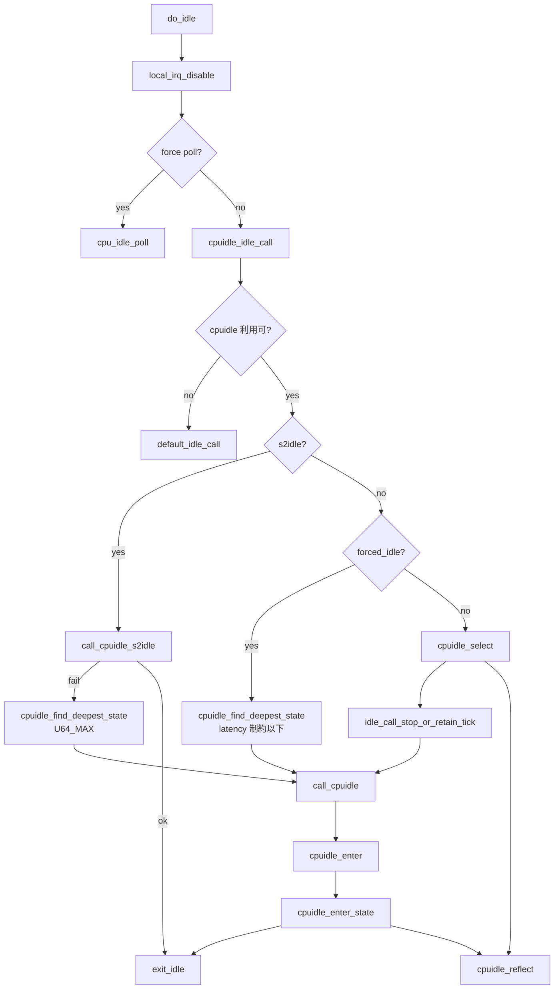

# 第15章 sched idle 入口と cpuidle 連携

> **本章で読むソース**
>
> - [`kernel/sched/idle.c` L276-L354](https://github.com/gregkh/linux/blob/v6.18.38/kernel/sched/idle.c#L276-L354)
> - [`kernel/sched/idle.c` L142-L160](https://github.com/gregkh/linux/blob/v6.18.38/kernel/sched/idle.c#L142-L160)
> - [`kernel/sched/idle.c` L180-L259](https://github.com/gregkh/linux/blob/v6.18.38/kernel/sched/idle.c#L180-L259)
> - [`drivers/cpuidle/cpuidle.c` L357-L361](https://github.com/gregkh/linux/blob/v6.18.38/drivers/cpuidle/cpuidle.c#L357-L361)
> - [`drivers/cpuidle/cpuidle.c` L373-L393](https://github.com/gregkh/linux/blob/v6.18.38/drivers/cpuidle/cpuidle.c#L373-L393)
> - [`kernel/sched/idle.c` L261-L268](https://github.com/gregkh/linux/blob/v6.18.38/kernel/sched/idle.c#L261-L268)
> - [`drivers/cpuidle/cpuidle.c` L84-L106](https://github.com/gregkh/linux/blob/v6.18.38/drivers/cpuidle/cpuidle.c#L84-L106)
> - [`drivers/cpuidle/cpuidle.c` L191-L205](https://github.com/gregkh/linux/blob/v6.18.38/drivers/cpuidle/cpuidle.c#L191-L205)
> - [`drivers/cpuidle/cpuidle.c` L268-L271](https://github.com/gregkh/linux/blob/v6.18.38/drivers/cpuidle/cpuidle.c#L268-L271)
> - [`drivers/cpuidle/cpuidle.c` L289-L290](https://github.com/gregkh/linux/blob/v6.18.38/drivers/cpuidle/cpuidle.c#L289-L290)

## この章の狙い

スケジューラの generic idle ループから `cpuidle_idle_call` へ入り、`cpuidle_select` / `cpuidle_enter` までの経路を追う。
`do_idle` の全体と polling 分岐は [プロセスとスケジューラ](../../sched/README.md) に委譲し、cpuidle フレームワークへの入口に焦点を当てる。

## 前提

- [第13章 cpuidle フレームワークとドライバ登録](13-cpuidle-framework-driver.md) の `cpuidle_register`
- [第14章 cpuidle ガバナと状態選択](14-cpuidle-governors.md) の `menu_select` / `teo_select`

## do_idle から cpuidle_idle_call へ

`do_idle` は `need_resched` が立つまでループし、poll 強制時以外は `cpuidle_idle_call` を呼ぶ。

[`kernel/sched/idle.c` L276-L354](https://github.com/gregkh/linux/blob/v6.18.38/kernel/sched/idle.c#L276-L354)

```c
static void do_idle(void)
{
	int cpu = smp_processor_id();
	bool got_tick = false;

	nohz_run_idle_balance(cpu);

	__current_set_polling();
	tick_nohz_idle_enter();

	while (!need_resched()) {

		local_irq_disable();

		if (cpu_is_offline(cpu)) {
			cpuhp_report_idle_dead();
			arch_cpu_idle_dead();
		}

		arch_cpu_idle_enter();
		rcu_nocb_flush_deferred_wakeup();

		if (cpu_idle_force_poll || tick_check_broadcast_expired()) {
			tick_nohz_idle_restart_tick();
			cpu_idle_poll();
		} else {
			cpuidle_idle_call(got_tick);
		}
		got_tick = tick_nohz_idle_got_tick();
		arch_cpu_idle_exit();
	}
```

idle タスクの rq ロックや migration の詳細は sched 分冊で扱う。

## cpuidle_idle_call

cpuidle が利用可能ならガバナに状態選択を委ね、選ばれた index で `call_cpuidle` する。

[`kernel/sched/idle.c` L180-L259](https://github.com/gregkh/linux/blob/v6.18.38/kernel/sched/idle.c#L180-L259)

```c
static void cpuidle_idle_call(bool stop_tick)
{
	struct cpuidle_device *dev = cpuidle_get_device();
	struct cpuidle_driver *drv = cpuidle_get_cpu_driver(dev);
	int next_state, entered_state;

	if (need_resched()) {
		local_irq_enable();
		return;
	}

	if (cpuidle_not_available(drv, dev)) {
		idle_call_stop_or_retain_tick(stop_tick);

		default_idle_call();
		goto exit_idle;
	}

	if (idle_should_enter_s2idle() || dev->forced_idle_latency_limit_ns) {
		u64 max_latency_ns;

		if (idle_should_enter_s2idle()) {

			entered_state = call_cpuidle_s2idle(drv, dev);
			if (entered_state > 0)
				goto exit_idle;

			max_latency_ns = U64_MAX;
		} else {
			max_latency_ns = dev->forced_idle_latency_limit_ns;
		}

		tick_nohz_idle_stop_tick();

		next_state = cpuidle_find_deepest_state(drv, dev, max_latency_ns);
		call_cpuidle(drv, dev, next_state);
	} else if (drv->state_count > 1) {
		stop_tick = true;

		next_state = cpuidle_select(drv, dev, &stop_tick);

		idle_call_stop_or_retain_tick(stop_tick);

		entered_state = call_cpuidle(drv, dev, next_state);
		cpuidle_reflect(dev, entered_state);
	} else {
		idle_call_stop_or_retain_tick(stop_tick);

		call_cpuidle(drv, dev, 0);
	}
```

ガバナ迂回経路は s2idle と forced idle の二系統に分かれる。
**最適化の工夫**：通常経路では `stop_tick` を true で渡し、ガバナが tick 期間より長い `target_residency` を持つ状態を選べるようにする。

## s2idle 経路

`idle_should_enter_s2idle()` が真なら `call_cpuidle_s2idle` が `cpuidle_enter_s2idle` を呼ぶ。
`enter_s2idle` コールバックを持つ最深状態へ入り、成功すれば `exit_idle` へ直行する。
s2idle 失敗時だけ `max_latency_ns = U64_MAX` にして最深状態へフォールバックする。

[`drivers/cpuidle/cpuidle.c` L191-L205](https://github.com/gregkh/linux/blob/v6.18.38/drivers/cpuidle/cpuidle.c#L191-L205)

```c
int cpuidle_enter_s2idle(struct cpuidle_driver *drv, struct cpuidle_device *dev)
{
	int index;

	index = find_deepest_state(drv, dev, U64_MAX, 0, true);
	if (index > 0) {
		enter_s2idle_proper(drv, dev, index);
		local_irq_enable();
	}
	return index;
}
```

## forced idle 経路

`dev->forced_idle_latency_limit_ns` が非ゼロならガバナを使わず `cpuidle_find_deepest_state` を呼ぶ。
`max_latency_ns` は制約値そのものであり、制約を無視した最深状態ではない。

[`drivers/cpuidle/cpuidle.c` L84-L106](https://github.com/gregkh/linux/blob/v6.18.38/drivers/cpuidle/cpuidle.c#L84-L106)

```c
static int find_deepest_state(struct cpuidle_driver *drv,
			      struct cpuidle_device *dev,
			      u64 max_latency_ns,
			      unsigned int forbidden_flags,
			      bool s2idle)
{
	u64 latency_req = 0;
	int i, ret = 0;

	for (i = 1; i < drv->state_count; i++) {
		struct cpuidle_state *s = &drv->states[i];

		if (dev->states_usage[i].disable ||
		    s->exit_latency_ns <= latency_req ||
		    s->exit_latency_ns > max_latency_ns ||
		    (s->flags & forbidden_flags) ||
		    (s2idle && !s->enter_s2idle))
			continue;

		latency_req = s->exit_latency_ns;
		ret = i;
	}
	return ret;
}
```

## call_cpuidle

ガバナが返した index は `cpuidle_enter` へ渡される。
`enter` コールバックは IRQ 無効のまま戻ることが要求され、再有効化は `exit_idle` 側で保証される。

[`kernel/sched/idle.c` L142-L160](https://github.com/gregkh/linux/blob/v6.18.38/kernel/sched/idle.c#L142-L160)

```c
static int call_cpuidle(struct cpuidle_driver *drv, struct cpuidle_device *dev,
		      int next_state)
{
	if (current_clr_polling_and_test()) {
		dev->last_residency_ns = 0;
		local_irq_enable();
		return -EBUSY;
	}

	return cpuidle_enter(drv, dev, next_state);
}
```

polling ビットがクリアされ再スケジュールが必要なら idle 進入を打ち切る。

## cpuidle_select

フレームワークは現行ガバナの `select` をそのまま呼ぶ。

[`drivers/cpuidle/cpuidle.c` L357-L361](https://github.com/gregkh/linux/blob/v6.18.38/drivers/cpuidle/cpuidle.c#L357-L361)

```c
int cpuidle_select(struct cpuidle_driver *drv, struct cpuidle_device *dev,
		   bool *stop_tick)
{
	return cpuidle_curr_governor->select(drv, dev, stop_tick);
}
```

## cpuidle_enter と cpuidle_enter_state

`cpuidle_enter` は coupled か否かで分岐し、単体 CPU では `cpuidle_enter_state` が `enter` コールバックを呼ぶ。

[`drivers/cpuidle/cpuidle.c` L373-L393](https://github.com/gregkh/linux/blob/v6.18.38/drivers/cpuidle/cpuidle.c#L373-L393)

```c
int cpuidle_enter(struct cpuidle_driver *drv, struct cpuidle_device *dev,
		  int index)
{
	int ret = 0;

	WRITE_ONCE(dev->next_hrtimer, tick_nohz_get_next_hrtimer());

	if (cpuidle_state_is_coupled(drv, index))
		ret = cpuidle_enter_state_coupled(dev, drv, index);
	else
		ret = cpuidle_enter_state(dev, drv, index);

	WRITE_ONCE(dev->next_hrtimer, 0);
	return ret;
}
```

[`drivers/cpuidle/cpuidle.c` L215-L252](https://github.com/gregkh/linux/blob/v6.18.38/drivers/cpuidle/cpuidle.c#L215-L252)

```c
noinstr int cpuidle_enter_state(struct cpuidle_device *dev,
				 struct cpuidle_driver *drv,
				 int index)
{
	int entered_state;

	struct cpuidle_state *target_state = &drv->states[index];
	bool broadcast = !!(target_state->flags & CPUIDLE_FLAG_TIMER_STOP);
	ktime_t time_start, time_end;

	if (broadcast && tick_broadcast_enter()) {
		index = find_deepest_state(drv, dev, target_state->exit_latency_ns,
					   CPUIDLE_FLAG_TIMER_STOP, false);

		target_state = &drv->states[index];
		broadcast = false;
	}

	if (target_state->flags & CPUIDLE_FLAG_TLB_FLUSHED)
		leave_mm();

	sched_idle_set_state(target_state);

	trace_cpu_idle(index, dev->cpu);
	time_start = ns_to_ktime(local_clock_noinstr());

	stop_critical_timings();
```

`CPUIDLE_FLAG_TIMER_STOP` 状態では broadcast timer へ切替えてから `enter` する。
`enter` が IRQ を有効化して戻った場合は `WARN_ONCE` して再無効化する。
coupled でない経路では `cpuidle_enter_state` 末尾で `local_irq_enable` するが、最終保証は `exit_idle` が担う。

[`drivers/cpuidle/cpuidle.c` L268-L271](https://github.com/gregkh/linux/blob/v6.18.38/drivers/cpuidle/cpuidle.c#L268-L271)

```c
	entered_state = target_state->enter(dev, drv, index);

	if (WARN_ONCE(!irqs_disabled(), "%ps leaked IRQ state", target_state->enter))
		raw_local_irq_disable();
```

[`drivers/cpuidle/cpuidle.c` L289-L290](https://github.com/gregkh/linux/blob/v6.18.38/drivers/cpuidle/cpuidle.c#L289-L290)

```c
	if (!cpuidle_state_is_coupled(drv, index))
		local_irq_enable();
```

[`kernel/sched/idle.c` L261-L268](https://github.com/gregkh/linux/blob/v6.18.38/kernel/sched/idle.c#L261-L268)

```c
exit_idle:
	__current_set_polling();

	/*
	 * It is up to the idle functions to re-enable local interrupts
	 */
	if (WARN_ON_ONCE(irqs_disabled()))
		local_irq_enable();
```

## idle ループと cpuidle の接続



## まとめ

スケジューラの `do_idle` は cpuidle 利用可能時に `cpuidle_idle_call` へ制御を渡す。
s2idle は `cpuidle_enter_s2idle`、forced idle は `cpuidle_find_deepest_state` で latency 制約以下の最深を選ぶ。
`cpuidle_select` がガバナ選択、`call_cpuidle` が `cpuidle_enter` 経由でハードウェア idle へ入る。
`enter` は IRQ 無効のまま戻り、`exit_idle` が割込み再有効化を保証する。

## 関連する章

- 前章：[cpuidle ガバナと状態選択](14-cpuidle-governors.md)
- 次章：[CPU hotplug 状態機械](../part04-hotplug/16-cpuhp-state-machine.md)
- [プロセスとスケジューラ](../../sched/README.md) の idle タスクと `do_idle`
- [割り込みと時間の NO_HZ](../../irq-time/part03-tick/18-no-hz.md)
