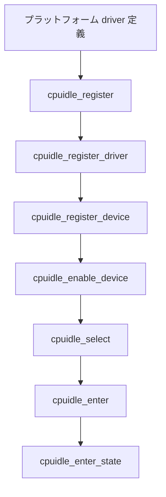

# 第17章 cpuidle フレームワークとドライバ登録

> **本章で読むソース**
>
> - [`include/linux/cpuidle.h` L49-L77](https://github.com/gregkh/linux/blob/v6.18.38/include/linux/cpuidle.h#L49-L77)
> - [`include/linux/cpuidle.h` L152-L168](https://github.com/gregkh/linux/blob/v6.18.38/include/linux/cpuidle.h#L152-L168)
> - [`drivers/cpuidle/driver.c` L155-L196](https://github.com/gregkh/linux/blob/v6.18.38/drivers/cpuidle/driver.c#L155-L196)
> - [`drivers/cpuidle/driver.c` L212-L237](https://github.com/gregkh/linux/blob/v6.18.38/drivers/cpuidle/driver.c#L212-L237)
> - [`drivers/cpuidle/cpuidle.c` L771-L806](https://github.com/gregkh/linux/blob/v6.18.38/drivers/cpuidle/cpuidle.c#L771-L806)
> - [`drivers/cpuidle/cpuidle.c` L635-L666](https://github.com/gregkh/linux/blob/v6.18.38/drivers/cpuidle/cpuidle.c#L635-L666)
> - [`drivers/cpuidle/cpuidle.c` L357-L393](https://github.com/gregkh/linux/blob/v6.18.38/drivers/cpuidle/cpuidle.c#L357-L393)

## この章の狙い

`drivers/cpuidle/cpuidle.c` と `driver.c` が束ねる **cpuidle フレームワーク**と、プラットフォームドライバの登録経路を追う。
`cpuidle_state` の定義から `cpuidle_register` による driver と per-CPU device の公開までを押さえる。

## 前提

- [第4章 Suspend to RAM と s2idle](../part01-system-pm/04-suspend-s2idle.md) の s2idle と CPU idle の関係
- [第7章 PM QoS と制約の集約](../part01-system-pm/07-pm-qos.md) の latency 制約

## struct cpuidle_state

各 idle 状態は名前、レイテンシ、滞在時間目標、`enter` コールバックを持つ。

[`include/linux/cpuidle.h` L49-L77](https://github.com/gregkh/linux/blob/v6.18.38/include/linux/cpuidle.h#L49-L77)

```c
struct cpuidle_state {
	char		name[CPUIDLE_NAME_LEN];
	char		desc[CPUIDLE_DESC_LEN];

	s64		exit_latency_ns;
	s64		target_residency_ns;
	unsigned int	flags;
	unsigned int	exit_latency; /* in US */
	int		power_usage; /* in mW */
	unsigned int	target_residency; /* in US */

	int (*enter)	(struct cpuidle_device *dev,
			struct cpuidle_driver *drv,
			int index);

	void (*enter_dead) (struct cpuidle_device *dev, int index);

	int (*enter_s2idle)(struct cpuidle_device *dev,
			    struct cpuidle_driver *drv,
			    int index);
};
```

`exit_latency_ns` は復帰コスト、`target_residency_ns` はその状態に留まるべき最小時間の目安である。
`CPUIDLE_FLAG_POLLING` は busy-wait、`CPUIDLE_FLAG_TIMER_STOP` はローカル tick 停止を伴う。

## struct cpuidle_driver

ドライバは状態配列を消費電力の降順に並べ、`cpumask` で管理 CPU を指定する。

[`include/linux/cpuidle.h` L152-L168](https://github.com/gregkh/linux/blob/v6.18.38/include/linux/cpuidle.h#L152-L168)

```c
struct cpuidle_driver {
	const char		*name;
	struct module 		*owner;

        /* used by the cpuidle framework to setup the broadcast timer */
	unsigned int            bctimer:1;
	/* states array must be ordered in decreasing power consumption */
	struct cpuidle_state	states[CPUIDLE_STATE_MAX];
	int			state_count;
	int			safe_state_index;

	/* the driver handles the cpus in cpumask */
	struct cpumask		*cpumask;

	/* preferred governor to switch at register time */
	const char		*governor;
};
```

個別 SoC 向けドライバの列挙は行わず、登録 API と状態テーブルの契約に焦点を当てる。

## cpuidle_register_driver

ドライバ登録は検証、`__cpuidle_driver_init`、グローバル driver への割当てを行う。

[`drivers/cpuidle/driver.c` L212-L237](https://github.com/gregkh/linux/blob/v6.18.38/drivers/cpuidle/driver.c#L212-L237)

```c
static int __cpuidle_register_driver(struct cpuidle_driver *drv)
{
	int ret;

	if (!drv || !drv->state_count)
		return -EINVAL;

	ret = cpuidle_coupled_state_verify(drv);
	if (ret)
		return ret;

	if (cpuidle_disabled())
		return -ENODEV;

	__cpuidle_driver_init(drv);

	ret = __cpuidle_set_driver(drv);
	if (ret)
		return ret;

	if (drv->bctimer)
		on_each_cpu_mask(drv->cpumask, cpuidle_setup_broadcast_timer,
				 (void *)1, 1);

	return 0;
}
```

`bctimer` が立つ状態があると broadcast timer セットアップが走る。

## __cpuidle_driver_init

登録前に `__cpuidle_driver_init` が新旧 driver API の時間単位を正規化する。
コアと menu/teo は主に `exit_latency_ns` / `target_residency_ns` を比較する。

[`drivers/cpuidle/driver.c` L155-L196](https://github.com/gregkh/linux/blob/v6.18.38/drivers/cpuidle/driver.c#L155-L196)

```c
static void __cpuidle_driver_init(struct cpuidle_driver *drv)
{
	int i;

	if (!drv->cpumask)
		drv->cpumask = (struct cpumask *)cpu_possible_mask;

	for (i = 0; i < drv->state_count; i++) {
		struct cpuidle_state *s = &drv->states[i];

		if (s->flags & CPUIDLE_FLAG_TIMER_STOP)
			drv->bctimer = 1;

		/*
		 * The core will use the target residency and exit latency
		 * values in nanoseconds, but allow drivers to provide them in
		 * microseconds too.
		 */
		if (s->target_residency > 0)
			s->target_residency_ns = s->target_residency * NSEC_PER_USEC;
		else if (s->target_residency_ns < 0)
			s->target_residency_ns = 0;
		else
			s->target_residency = div_u64(s->target_residency_ns, NSEC_PER_USEC);

		if (s->exit_latency > 0)
			s->exit_latency_ns = mul_u32_u32(s->exit_latency, NSEC_PER_USEC);
		else if (s->exit_latency_ns < 0)
			s->exit_latency_ns =  0;
		else
			s->exit_latency = div_u64(s->exit_latency_ns, NSEC_PER_USEC);
	}
}
```

**最適化の工夫**：マイクロ秒指定ならナノ秒へ変換し、ナノ秒だけのドライバには互換用マイクロ秒を逆算する。
比較を軽くするためではなく、新旧 API の単位を揃える互換処理である。

## cpuidle_register

アーキテクチャドライバの共通パターンは `cpuidle_register` で driver と per-CPU device を一括登録する。

[`drivers/cpuidle/cpuidle.c` L771-L806](https://github.com/gregkh/linux/blob/v6.18.38/drivers/cpuidle/cpuidle.c#L771-L806)

```c
int cpuidle_register(struct cpuidle_driver *drv,
		     const struct cpumask *const coupled_cpus)
{
	int ret, cpu;
	struct cpuidle_device *device;

	ret = cpuidle_register_driver(drv);
	if (ret) {
		pr_err("failed to register cpuidle driver\n");
		return ret;
	}

	for_each_cpu(cpu, drv->cpumask) {
		device = &per_cpu(cpuidle_dev, cpu);
		device->cpu = cpu;

		ret = cpuidle_register_device(device);
		if (!ret)
			continue;

		pr_err("Failed to register cpuidle device for cpu%d\n", cpu);

		cpuidle_unregister(drv);
		break;
	}

	return ret;
}
```

途中で device 登録に失敗した CPU があれば `cpuidle_unregister` で巻き戻す。

## cpuidle_register_device

per-CPU `cpuidle_device` は `per_cpu(cpuidle_devices)` へ公開され、sysfs と enable が続く。

[`drivers/cpuidle/cpuidle.c` L635-L666](https://github.com/gregkh/linux/blob/v6.18.38/drivers/cpuidle/cpuidle.c#L635-L666)

```c
static int __cpuidle_register_device(struct cpuidle_device *dev)
{
	struct cpuidle_driver *drv = cpuidle_get_cpu_driver(dev);
	unsigned int cpu = dev->cpu;
	int i, ret;

	if (per_cpu(cpuidle_devices, cpu)) {
		pr_info("CPU%d: cpuidle device already registered\n", cpu);
		return -EEXIST;
	}

	if (!try_module_get(drv->owner))
		return -EINVAL;

	for (i = 0; i < drv->state_count; i++) {
		if (drv->states[i].flags & CPUIDLE_FLAG_UNUSABLE)
			dev->states_usage[i].disable |= CPUIDLE_STATE_DISABLED_BY_DRIVER;

		if (drv->states[i].flags & CPUIDLE_FLAG_OFF)
			dev->states_usage[i].disable |= CPUIDLE_STATE_DISABLED_BY_USER;
	}

	per_cpu(cpuidle_devices, cpu) = dev;
	list_add(&dev->device_list, &cpuidle_detected_devices);

	ret = cpuidle_coupled_register_device(dev);
	if (ret)
		__cpuidle_unregister_device(dev);
	else
		dev->registered = 1;

	return ret;
}
```

## cpuidle_select と cpuidle_enter

ガバナが選んだ index は `cpuidle_enter` が `cpuidle_enter_state` または coupled 経路へ渡す。

[`drivers/cpuidle/cpuidle.c` L357-L393](https://github.com/gregkh/linux/blob/v6.18.38/drivers/cpuidle/cpuidle.c#L357-L393)

```c
int cpuidle_select(struct cpuidle_driver *drv, struct cpuidle_device *dev,
		   bool *stop_tick)
{
	return cpuidle_curr_governor->select(drv, dev, stop_tick);
}

int cpuidle_enter(struct cpuidle_driver *drv, struct cpuidle_device *dev,
		  int index)
{
	int ret = 0;

	WRITE_ONCE(dev->next_hrtimer, tick_nohz_get_next_hrtimer());

	if (cpuidle_state_is_coupled(drv, index))
		ret = cpuidle_enter_state_coupled(dev, drv, index);
	else
		ret = cpuidle_enter_state(dev, drv, index);

	WRITE_ONCE(dev->next_hrtimer, 0);
	return ret;
}
```

`enter` 前に `next_hrtimer` を記録し、wake 後にクリアする。

## 登録から idle 状態進入まで



## まとめ

cpuidle フレームワークは `cpuidle_state` 配列と per-CPU `cpuidle_device` を束ねる。
`cpuidle_register` が driver と device の登録を一括化し、失敗時は unregister で巻き戻す。
ガバナは `cpuidle_select` で index を選び、`cpuidle_enter` がハードウェア `enter` へ届ける。

## 関連する章

- 前章：[ondemand と conservative ガバナ](../part03-cpufreq/16-ondemand-conservative.md)
- 次章：[cpuidle ガバナと状態選択](18-cpuidle-governors.md)
- [第19章 sched idle 入口と cpuidle 連携](19-sched-idle-cpuidle.md) の `cpuidle_idle_call`
