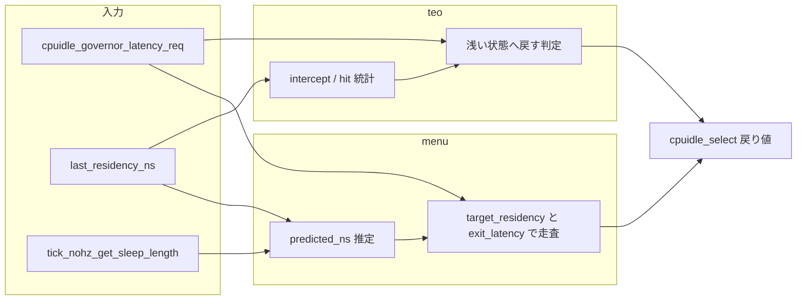

# 第18章 cpuidle ガバナと状態選択

> **本章で読むソース**
>
> - [`drivers/cpuidle/governor.c` L79-L102](https://github.com/gregkh/linux/blob/v6.18.38/drivers/cpuidle/governor.c#L79-L102)
> - [`drivers/cpuidle/governors/menu.c` L218-L295](https://github.com/gregkh/linux/blob/v6.18.38/drivers/cpuidle/governors/menu.c#L218-L295)
> - [`drivers/cpuidle/governors/menu.c` L284-L295](https://github.com/gregkh/linux/blob/v6.18.38/drivers/cpuidle/governors/menu.c#L284-L295)
> - [`drivers/cpuidle/governors/menu.c` L301-L332](https://github.com/gregkh/linux/blob/v6.18.38/drivers/cpuidle/governors/menu.c#L301-L332)
> - [`drivers/cpuidle/governors/menu.c` L525-L531](https://github.com/gregkh/linux/blob/v6.18.38/drivers/cpuidle/governors/menu.c#L525-L531)
> - [`drivers/cpuidle/governors/teo.c` L268-L334](https://github.com/gregkh/linux/blob/v6.18.38/drivers/cpuidle/governors/teo.c#L268-L334)
> - [`drivers/cpuidle/governors/teo.c` L358-L421](https://github.com/gregkh/linux/blob/v6.18.38/drivers/cpuidle/governors/teo.c#L358-L421)
> - [`drivers/cpuidle/governors/teo.c` L535-L541](https://github.com/gregkh/linux/blob/v6.18.38/drivers/cpuidle/governors/teo.c#L535-L541)

## この章の狙い

cpuidle ガバナが `->select` で idle 状態を選ぶ仕組みを、**menu** と **teo** を代表例に追う。
`exit_latency` と `target_residency`、PM QoS 由来の latency 制約が選択にどう効くかを押さえる。

## 前提

- [第17章 cpuidle フレームワークとドライバ登録](17-cpuidle-framework-driver.md) の `cpuidle_state` と `cpuidle_select`
- [第7章 PM QoS と制約の集約](../part01-system-pm/07-pm-qos.md) の CPU latency QoS

## cpuidle_register_governor

ガバナは `cpuidle_governor` の `select` を実装し、登録時に rating と boot パラメータで切替候補になる。

[`drivers/cpuidle/governor.c` L79-L102](https://github.com/gregkh/linux/blob/v6.18.38/drivers/cpuidle/governor.c#L79-L102)

```c
int cpuidle_register_governor(struct cpuidle_governor *gov)
{
	int ret = -EEXIST;

	if (!gov || !gov->select)
		return -EINVAL;

	if (cpuidle_disabled())
		return -ENODEV;

	mutex_lock(&cpuidle_lock);
	if (cpuidle_find_governor(gov->name) == NULL) {
		ret = 0;
		list_add_tail(&gov->governor_list, &cpuidle_governors);
		if (!cpuidle_curr_governor ||
		    !strncasecmp(param_governor, gov->name, CPUIDLE_NAME_LEN) ||
		    (cpuidle_curr_governor->rating < gov->rating &&
		     strncasecmp(param_governor, cpuidle_curr_governor->name,
				 CPUIDLE_NAME_LEN)))
			cpuidle_switch_governor(gov);
	}
	mutex_unlock(&cpuidle_lock);

	return ret;
}
```

menu と teo は `postcore_initcall` で登録され、teo の rating は menu より低い。

## menu ガバナの登録

[`drivers/cpuidle/governors/menu.c` L525-L531](https://github.com/gregkh/linux/blob/v6.18.38/drivers/cpuidle/governors/menu.c#L525-L531)

```c
static struct cpuidle_governor menu_governor = {
	.name =		"menu",
	.rating =	20,
	.enable =	menu_enable_device,
	.select =	menu_select,
	.reflect =	menu_reflect,
};
```

`reflect` は直前の滞在時間を次回選択の予測に反映する。

## menu_select

menu は過去の idle 区間と次タイマまでの時間から予測滞在時間を求め、状態を選ぶ。

[`drivers/cpuidle/governors/menu.c` L218-L295](https://github.com/gregkh/linux/blob/v6.18.38/drivers/cpuidle/governors/menu.c#L218-L295)

```c
static int menu_select(struct cpuidle_driver *drv, struct cpuidle_device *dev,
		       bool *stop_tick)
{
	struct menu_device *data = this_cpu_ptr(&menu_devices);
	s64 latency_req = cpuidle_governor_latency_req(dev->cpu);
	u64 predicted_ns;
	ktime_t delta, delta_tick;
	int i, idx;

	if (data->needs_update) {
		menu_update(drv, dev);
		data->needs_update = 0;
	} else if (!dev->last_residency_ns) {
		menu_update_intervals(data, UINT_MAX);
	}

	/* Find the shortest expected idle interval. */
	predicted_ns = get_typical_interval(data) * NSEC_PER_USEC;
	if (predicted_ns > RESIDENCY_THRESHOLD_NS || tick_nohz_tick_stopped()) {
		unsigned int timer_us;

		delta = tick_nohz_get_sleep_length(&delta_tick);
		if (unlikely(delta < 0)) {
			delta = 0;
			delta_tick = 0;
		}

		data->next_timer_ns = delta;
		data->bucket = which_bucket(data->next_timer_ns);

		timer_us = div_u64((RESOLUTION * DECAY * NSEC_PER_USEC) / 2 +
					data->next_timer_ns *
						data->correction_factor[data->bucket],
				   RESOLUTION * DECAY * NSEC_PER_USEC);
		predicted_ns = min((u64)timer_us * NSEC_PER_USEC, predicted_ns);
```

latency 制約が厳しいときは最初の有効状態（通常 state 0）へ制限する。
state 0 が polling とは限らない。

[`drivers/cpuidle/governors/menu.c` L284-L295](https://github.com/gregkh/linux/blob/v6.18.38/drivers/cpuidle/governors/menu.c#L284-L295)

```c
	if (unlikely(drv->state_count <= 1 || latency_req == 0) ||
	    ((data->next_timer_ns < drv->states[1].target_residency_ns ||
	      latency_req < drv->states[1].exit_latency_ns) &&
	     !dev->states_usage[0].disable)) {
		/*
		 * In this case state[0] will be used no matter what, so return
		 * it right away and keep the tick running if state[0] is a
		 * polling one.
		 */
		*stop_tick = !(drv->states[0].flags & CPUIDLE_FLAG_POLLING);
		return 0;
	}
```

`CPUIDLE_FLAG_POLLING` は `stop_tick` の決定に使われ、戻り index が polling であることの定義ではない。

## menu の residency と exit_latency 判定

深い状態は `target_residency_ns <= predicted_ns` かつ `exit_latency_ns <= latency_req` を満たすものから選ぶ。
常に `target_residency_ns <= predicted_ns` だけを満たす状態を選ぶわけではない。

[`drivers/cpuidle/governors/menu.c` L301-L332](https://github.com/gregkh/linux/blob/v6.18.38/drivers/cpuidle/governors/menu.c#L301-L332)

```c
	idx = -1;
	for (i = 0; i < drv->state_count; i++) {
		struct cpuidle_state *s = &drv->states[i];

		if (dev->states_usage[i].disable)
			continue;

		if (idx == -1)
			idx = i; /* first enabled state */

		if (s->exit_latency_ns > latency_req)
			break;

		if (s->target_residency_ns <= predicted_ns) {
			idx = i;
			continue;
		}

		/*
		 * Use a physical idle state instead of busy polling so long as
		 * its target residency is below the residency threshold, its
		 * exit latency is not greater than the predicted idle duration,
		 * and the next timer doesn't expire soon.
		 */
		if ((drv->states[idx].flags & CPUIDLE_FLAG_POLLING) &&
		    s->target_residency_ns < RESIDENCY_THRESHOLD_NS &&
		    s->target_residency_ns <= data->next_timer_ns &&
		    s->exit_latency_ns <= predicted_ns) {
			predicted_ns = s->target_residency_ns;
			idx = i;
			break;
		}
```

**最適化の工夫**：`correction_factor` とバケットで予測誤差を補正する。
候補が polling のときは条件を満たす物理 idle 状態へ切り替える特例がある。

## teo ガバナ

teo は timer 以外の早期 wake（intercept）と滞在時間内 wake（hit）の統計で浅い状態を選び直す。

[`drivers/cpuidle/governors/teo.c` L535-L541](https://github.com/gregkh/linux/blob/v6.18.38/drivers/cpuidle/governors/teo.c#L535-L541)

```c
static struct cpuidle_governor teo_governor = {
	.name =		"teo",
	.rating =	19,
	.enable =	teo_enable_device,
	.select =	teo_select,
	.reflect =	teo_reflect,
};
```

## teo_select

[`drivers/cpuidle/governors/teo.c` L268-L334](https://github.com/gregkh/linux/blob/v6.18.38/drivers/cpuidle/governors/teo.c#L268-L334)

```c
static int teo_select(struct cpuidle_driver *drv, struct cpuidle_device *dev,
		      bool *stop_tick)
{
	struct teo_cpu *cpu_data = per_cpu_ptr(&teo_cpus, dev->cpu);
	s64 latency_req = cpuidle_governor_latency_req(dev->cpu);
	ktime_t delta_tick = TICK_NSEC / 2;
	unsigned int idx_intercept_sum = 0;
	unsigned int intercept_sum = 0;
	unsigned int idx_hit_sum = 0;
	unsigned int hit_sum = 0;
	int constraint_idx = 0;
	int idx0 = 0, idx = -1;
	s64 duration_ns;
	int i;

	if (dev->last_state_idx >= 0) {
		teo_update(drv, dev);
		dev->last_state_idx = -1;
	}

	cpu_data->sleep_length_ns = KTIME_MAX;

	if (drv->state_count < 2) {
		idx = 0;
		goto out_tick;
	}

	if (!dev->states_usage[0].disable)
		idx = 0;

	for (i = 1; i < drv->state_count; i++) {
		struct teo_bin *prev_bin = &cpu_data->state_bins[i-1];
		struct cpuidle_state *s = &drv->states[i];

		intercept_sum += prev_bin->intercepts;
		hit_sum += prev_bin->hits;

		if (dev->states_usage[i].disable)
			continue;

		if (idx < 0)
			idx0 = i; /* first enabled state */

		idx = i;

		if (s->exit_latency_ns <= latency_req)
			constraint_idx = i;

		idx_intercept_sum = intercept_sum;
		idx_hit_sum = hit_sum;
	}
```

## teo の intercept 判定

浅い状態の intercept 合計が深い候補の hit より大きいとき、より浅い状態へ戻す。

[`drivers/cpuidle/governors/teo.c` L358-L421](https://github.com/gregkh/linux/blob/v6.18.38/drivers/cpuidle/governors/teo.c#L358-L421)

```c
	if (2 * idx_intercept_sum > cpu_data->total - idx_hit_sum) {
		int first_suitable_idx = idx;

		intercept_sum = 0;

		for (i = idx - 1; i >= 0; i--) {
			struct teo_bin *bin = &cpu_data->state_bins[i];

			intercept_sum += bin->intercepts;

			if (2 * intercept_sum > idx_intercept_sum) {
				if (teo_state_ok(i, drv) &&
				    !dev->states_usage[i].disable) {
					idx = i;
					break;
				}
				idx = first_suitable_idx;
				break;
			}

			if (dev->states_usage[i].disable)
				continue;

			if (teo_state_ok(i, drv)) {
				first_suitable_idx = i;
				continue;
			}

			if (first_suitable_idx == idx)
				break;
		}
	}

	if (idx > constraint_idx)
		idx = constraint_idx;
```

latency 制約を超える深い状態は `constraint_idx` で浅く切り詰める。

## menu と teo の選択比較



## まとめ

cpuidle ガバナは `select` で index を返し、`stop_tick` で tick 停止可否も指示する。
menu は予測滞在時間と `target_residency_ns` / `exit_latency_ns` で状態を走査する。
latency 制約時は最初の有効状態へ制限し、polling から物理 idle への切替特例を持つ。
teo は wake パターン統計で深すぎる選択を浅く修正し、latency QoS で上限を守る。

## 関連する章

- 前章：[cpuidle フレームワークとドライバ登録](17-cpuidle-framework-driver.md)
- 次章：[sched idle 入口と cpuidle 連携](19-sched-idle-cpuidle.md)
- [割り込みと時間の NO_HZ](../../irq-time/part03-tick/18-no-hz.md) の tick 停止詳細
