# 第20章 CPU hotplug 状態機械

> **本章で読むソース**
>
> - [`kernel/cpu.c` L126-L143](https://github.com/gregkh/linux/blob/v6.18.38/kernel/cpu.c#L126-L143)
> - [`kernel/cpu.c` L170-L249](https://github.com/gregkh/linux/blob/v6.18.38/kernel/cpu.c#L170-L249)
> - [`kernel/cpu.c` L1017-L1034](https://github.com/gregkh/linux/blob/v6.18.38/kernel/cpu.c#L1017-L1034)
> - [`kernel/cpu.c` L1627-L1690](https://github.com/gregkh/linux/blob/v6.18.38/kernel/cpu.c#L1627-L1690)
> - [`kernel/cpu.c` L1398-L1457](https://github.com/gregkh/linux/blob/v6.18.38/kernel/cpu.c#L1398-L1457)
> - [`kernel/cpu.c` L1271-L1291](https://github.com/gregkh/linux/blob/v6.18.38/kernel/cpu.c#L1271-L1291)
> - [`kernel/cpu.c` L1298-L1312](https://github.com/gregkh/linux/blob/v6.18.38/kernel/cpu.c#L1298-L1312)
> - [`kernel/cpu.c` L2135-L2140](https://github.com/gregkh/linux/blob/v6.18.38/kernel/cpu.c#L2135-L2140)
> - [`kernel/cpu.c` L2182-L2194](https://github.com/gregkh/linux/blob/v6.18.38/kernel/cpu.c#L2182-L2194)

## この章の狙い

`kernel/cpu.c` の **cpuhp** 状態機械が CPU online/offline をどう段階実行するかを追う。
`cpuhp_step`、BP（制御 CPU）と AP（対象 CPU）の分担、`cpuhp_invoke_callback` と失敗時 rollback を押さえる。

## 前提

- [第13章 cpufreq コアと policy](../part03-cpufreq/13-cpufreq-framework-policy.md) の `cpufreq_online`
- [第17章 cpuidle フレームワーク](../part04-cpuidle/17-cpuidle-framework-driver.md) の per-CPU device 登録

## struct cpuhp_step

各 hotplug 状態は名前と startup/teardown コールバックを持つ。

[`kernel/cpu.c` L126-L143](https://github.com/gregkh/linux/blob/v6.18.38/kernel/cpu.c#L126-L143)

```c
struct cpuhp_step {
	const char		*name;
	union {
		int		(*single)(unsigned int cpu);
		int		(*multi)(unsigned int cpu,
					 struct hlist_node *node);
	} startup;
	union {
		int		(*single)(unsigned int cpu);
		int		(*multi)(unsigned int cpu,
					 struct hlist_node *node);
	} teardown;
	/* private: */
	struct hlist_head	list;
	/* public: */
	bool			cant_stop;
	bool			multi_instance;
};
```

`multi_instance` が真の状態はサブシステムが複数インスタンスを後から追加する。

## cpuhp_invoke_callback

状態遷移のたびに startup または teardown が呼ばれる。

[`kernel/cpu.c` L170-L249](https://github.com/gregkh/linux/blob/v6.18.38/kernel/cpu.c#L170-L249)

```c
static int cpuhp_invoke_callback(unsigned int cpu, enum cpuhp_state state,
				 bool bringup, struct hlist_node *node,
				 struct hlist_node **lastp)
{
	struct cpuhp_cpu_state *st = per_cpu_ptr(&cpuhp_state, cpu);
	struct cpuhp_step *step = cpuhp_get_step(state);
	int (*cbm)(unsigned int cpu, struct hlist_node *node);
	int (*cb)(unsigned int cpu);
	int ret, cnt;

	if (st->fail == state) {
		st->fail = CPUHP_INVALID;
		return -EAGAIN;
	}

	if (cpuhp_step_empty(bringup, step)) {
		WARN_ON_ONCE(1);
		return 0;
	}

	if (!step->multi_instance) {
		WARN_ON_ONCE(lastp && *lastp);
		cb = bringup ? step->startup.single : step->teardown.single;

		trace_cpuhp_enter(cpu, st->target, state, cb);
		ret = cb(cpu);
		trace_cpuhp_exit(cpu, st->state, state, ret);
		return ret;
	}
	cbm = bringup ? step->startup.multi : step->teardown.multi;

	/* Single invocation for instance add/remove */
	if (node) {
		WARN_ON_ONCE(lastp && *lastp);
		trace_cpuhp_multi_enter(cpu, st->target, state, cbm, node);
		ret = cbm(cpu, node);
		trace_cpuhp_exit(cpu, st->state, state, ret);
		return ret;
	}

	/* State transition. Invoke on all instances */
	cnt = 0;
	hlist_for_each(node, &step->list) {
		if (lastp && node == *lastp)
			break;

		trace_cpuhp_multi_enter(cpu, st->target, state, cbm, node);
		ret = cbm(cpu, node);
		trace_cpuhp_exit(cpu, st->state, state, ret);
		if (ret) {
			if (!lastp)
				goto err;

			*lastp = node;
			return ret;
		}
		cnt++;
	}
	if (lastp)
		*lastp = NULL;
	return 0;
err:
	/* Rollback the instances if one failed */
	cbm = !bringup ? step->startup.multi : step->teardown.multi;
	if (!cbm)
		return ret;

	hlist_for_each(node, &step->list) {
		if (!cnt--)
			break;

		trace_cpuhp_multi_enter(cpu, st->target, state, cbm, node);
		ret = cbm(cpu, node);
		trace_cpuhp_exit(cpu, st->state, state, ret);
		/*
		 * Rollback must not fail,
		 */
		WARN_ON_ONCE(ret);
	}
	return ret;
}
```

失敗時は multi_instance 状態で成功済み `cnt` 個に反対方向 callback を適用して巻き戻す。
走査は同じ `hlist_for_each` の先頭からであり、リスト逆順ではない。
`lastp` は反対方向再実行時に失敗 node より先へ進まないための到達位置である。

## cpuhp_up_callbacks と rollback

online 方向は `cpuhp_invoke_callback_range` で状態を順に進め、失敗時は逆方向へ戻す。

[`kernel/cpu.c` L1017-L1034](https://github.com/gregkh/linux/blob/v6.18.38/kernel/cpu.c#L1017-L1034)

```c
static int cpuhp_up_callbacks(unsigned int cpu, struct cpuhp_cpu_state *st,
			      enum cpuhp_state target)
{
	enum cpuhp_state prev_state = st->state;
	int ret = 0;

	ret = cpuhp_invoke_callback_range(true, cpu, st, target);
	if (ret) {
		pr_debug("CPU UP failed (%d) CPU %u state %s (%d)\n",
			 ret, cpu, cpuhp_get_step(st->state)->name,
			 st->state);

		cpuhp_reset_state(cpu, st, prev_state);
		if (can_rollback_cpu(st))
			WARN_ON(cpuhp_invoke_callback_range(false, cpu, st,
							    prev_state));
	}
	return ret;
}
```

**最適化の工夫**：`cpuhp_next_state` がコールバック未登録の状態を飛ばし、空 step への無駄な呼び出しを避ける。

## _cpu_up

制御 CPU は `cpus_write_lock` 下で target まで BP 側コールバックを実行し、以降は AP hotplug スレッドへ委譲する。

[`kernel/cpu.c` L1627-L1690](https://github.com/gregkh/linux/blob/v6.18.38/kernel/cpu.c#L1627-L1690)

```c
static int _cpu_up(unsigned int cpu, int tasks_frozen, enum cpuhp_state target)
{
	struct cpuhp_cpu_state *st = per_cpu_ptr(&cpuhp_state, cpu);
	struct task_struct *idle;
	int ret = 0;

	cpus_write_lock();

	if (!cpu_present(cpu)) {
		ret = -EINVAL;
		goto out;
	}

	/*
	 * The caller of cpu_up() might have raced with another
	 * caller. Nothing to do.
	 */
	if (st->state >= target)
		goto out;

	if (st->state == CPUHP_OFFLINE) {
		/* Let it fail before we try to bring the cpu up */
		idle = idle_thread_get(cpu);
		if (IS_ERR(idle)) {
			ret = PTR_ERR(idle);
			goto out;
		}

		/*
		 * Reset stale stack state from the last time this CPU was online.
		 */
		scs_task_reset(idle);
		kasan_unpoison_task_stack(idle);
	}

	cpuhp_tasks_frozen = tasks_frozen;

	cpuhp_set_state(cpu, st, target);
	/*
	 * If the current CPU state is in the range of the AP hotplug thread,
	 * then we need to kick the thread once more.
	 */
	if (st->state > CPUHP_BRINGUP_CPU) {
		ret = cpuhp_kick_ap_work(cpu);
		/*
		 * The AP side has done the error rollback already. Just
		 * return the error code..
		 */
		if (ret)
			goto out;
	}

	/*
	 * Try to reach the target state. We max out on the BP at
	 * CPUHP_BRINGUP_CPU. After that the AP hotplug thread is
	 * responsible for bringing it up to the target state.
	 */
	target = min((int)target, CPUHP_BRINGUP_CPU);
	ret = cpuhp_up_callbacks(cpu, st, target);
out:
	cpus_write_unlock();
	arch_smt_update();
	return ret;
}
```

`CPUHP_BRINGUP_CPU` 以降は AP 側 hotplug スレッドが `notify_cpu_starting` から ONLINE へ進める。

## _cpu_down

offline は次の順で進む。

1. 制御 CPU の `_cpu_down` が AP hotplug thread を起動する。
2. AP thread が ONLINE 区間を teardown し `CPUHP_TEARDOWN_CPU` まで状態を下げる。
3. BP が `cpuhp_down_callbacks` を開始する。
4. `CPUHP_TEARDOWN_CPU` の teardown として BP 上で `takedown_cpu` が呼ばれる。
5. `takedown_cpu` が `stop_machine_cpuslocked` で対象 AP 上の `take_cpu_down` を実行する。
6. `take_cpu_down` が DYING 区間の callback を実行する。
7. BP に戻り、残りの DEAD/PREPARE 区間を `cpuhp_down_callbacks` が続行する。

[`kernel/cpu.c` L1398-L1457](https://github.com/gregkh/linux/blob/v6.18.38/kernel/cpu.c#L1398-L1457)

```c
static int __ref _cpu_down(unsigned int cpu, int tasks_frozen,
			   enum cpuhp_state target)
{
	struct cpuhp_cpu_state *st = per_cpu_ptr(&cpuhp_state, cpu);
	int prev_state, ret = 0;

	if (num_online_cpus() == 1)
		return -EBUSY;

	if (!cpu_present(cpu))
		return -EINVAL;

	cpus_write_lock();

	cpuhp_tasks_frozen = tasks_frozen;

	prev_state = cpuhp_set_state(cpu, st, target);
	/*
	 * If the current CPU state is in the range of the AP hotplug thread,
	 * then we need to kick the thread.
	 */
	if (st->state > CPUHP_TEARDOWN_CPU) {
		st->target = max((int)target, CPUHP_TEARDOWN_CPU);
		ret = cpuhp_kick_ap_work(cpu);
		/*
		 * The AP side has done the error rollback already. Just
		 * return the error code..
		 */
		if (ret)
			goto out;

		/*
		 * We might have stopped still in the range of the AP hotplug
		 * thread. Nothing to do anymore.
		 */
		if (st->state > CPUHP_TEARDOWN_CPU)
			goto out;

		st->target = target;
	}
	/*
	 * The AP brought itself down to CPUHP_TEARDOWN_CPU. So we need
	 * to do the further cleanups.
	 */
	ret = cpuhp_down_callbacks(cpu, st, target);
	if (ret && st->state < prev_state) {
		if (st->state == CPUHP_TEARDOWN_CPU) {
			cpuhp_reset_state(cpu, st, prev_state);
			__cpuhp_kick_ap(st);
		} else {
			WARN(1, "DEAD callback error for CPU%d", cpu);
		}
	}

out:
	cpus_write_unlock();
	arch_smt_update();
	return ret;
}
```

## takedown_cpu と take_cpu_down

`cpuhp_down_callbacks` が `CPUHP_TEARDOWN_CPU` に到達すると、teardown コールバック `takedown_cpu` が BP 上で走る。
`take_cpu_down` はその中から `stop_machine_cpuslocked` 経由で対象 AP 上に送られる。

[`kernel/cpu.c` L1298-L1312](https://github.com/gregkh/linux/blob/v6.18.38/kernel/cpu.c#L1298-L1312)

```c
static int takedown_cpu(unsigned int cpu)
{
	struct cpuhp_cpu_state *st = per_cpu_ptr(&cpuhp_state, cpu);
	int err;

	/* Park the smpboot threads */
	kthread_park(st->thread);

	/*
	 * Prevent irq alloc/free while the dying cpu reorganizes the
	 * interrupt affinities.
	 */
	irq_lock_sparse();

	err = stop_machine_cpuslocked(take_cpu_down, NULL, cpumask_of(cpu));
```

[`kernel/cpu.c` L1271-L1291](https://github.com/gregkh/linux/blob/v6.18.38/kernel/cpu.c#L1271-L1291)

```c
static int take_cpu_down(void *_param)
{
	struct cpuhp_cpu_state *st = this_cpu_ptr(&cpuhp_state);
	enum cpuhp_state target = max((int)st->target, CPUHP_AP_OFFLINE);
	int err, cpu = smp_processor_id();

	/* Ensure this CPU doesn't handle any more interrupts. */
	err = __cpu_disable();
	if (err < 0)
		return err;

	/*
	 * Must be called from CPUHP_TEARDOWN_CPU, which means, as we are going
	 * down, that the current state is CPUHP_TEARDOWN_CPU - 1.
	 */
	WARN_ON(st->state != (CPUHP_TEARDOWN_CPU - 1));

	/*
	 * Invoke the former CPU_DYING callbacks. DYING must not fail!
	 */
	cpuhp_invoke_callback_range_nofail(false, cpu, st, target);
```

`takedown_cpu` が AP 側の DYING 処理を終えて BP に戻ると、`cpuhp_down_callbacks` が DEAD/PREPARE 区間を続行する。

## BP と AP の代表状態

x86-64 既定では `CPUHP_BRINGUP_CPU` は all-in-one の `bringup_cpu` を使う。

[`kernel/cpu.c` L2135-L2140](https://github.com/gregkh/linux/blob/v6.18.38/kernel/cpu.c#L2135-L2140)

```c
	[CPUHP_BRINGUP_CPU] = {
		.name			= "cpu:bringup",
		.startup.single		= bringup_cpu,
		.teardown.single	= finish_cpu,
		.cant_stop		= true,
	},
```

AP 側の同期点と teardown 入口は次のとおりである。

[`kernel/cpu.c` L2182-L2194](https://github.com/gregkh/linux/blob/v6.18.38/kernel/cpu.c#L2182-L2194)

```c
	[CPUHP_AP_ONLINE] = {
		.name			= "ap:online",
	},
	[CPUHP_TEARDOWN_CPU] = {
		.name			= "cpu:teardown",
		.startup.single		= NULL,
		.teardown.single	= takedown_cpu,
		.cant_stop		= true,
	},
```

## online/offline の状態遷移

```mermaid
flowchart TB
    subgraph online [online]
        UP[_cpu_up BP]
        BR[CPUHP_BRINGUP_CPU]
        START[notify_cpu_starting AP]
        IDLE[CPUHP_AP_ONLINE_IDLE]
        ON[ONLINE 区間]
        UP --> BR --> START --> IDLE --> ON
    end
    subgraph offline [offline]
        S1["1. _cpu_down: AP thread 起動"]
        S2["2. AP: ONLINE teardown"]
        S3["3. cpuhp_down_callbacks 開始"]
        S4["4. takedown_cpu teardown"]
        S5["5. stop_machine → take_cpu_down"]
        S6["6. take_cpu_down: DYING callbacks"]
        S7["7. DEAD/PREPARE 続行"]
        S1 --> S2 --> S3 --> S4 --> S5 --> S6 --> S7
    end
```



## まとめ

cpuhp は `cpuhp_hp_states[]` の startup/teardown 列を順に実行して CPU を online/offline する。
online は BP が `CPUHP_BRINGUP_CPU` まで進め、AP が `notify_cpu_starting` 以降を担当する。
offline は `_cpu_down` が AP を起動し ONLINE teardown のあと `cpuhp_down_callbacks` が走る。
`CPUHP_TEARDOWN_CPU` では `takedown_cpu` が `stop_machine` 経由で `take_cpu_down` を AP へ送り、DYING 後 BP が DEAD/PREPARE を続行する。
コールバック失敗時は `cpuhp_up_callbacks` / `cpuhp_down_callbacks` が逆方向 rollback を試みる。

## 関連する章

- 前章：[sched idle 入口と cpuidle 連携](../part04-cpuidle/19-sched-idle-cpuidle.md)
- 次章：[cpu maps と hotplug ロック](21-cpu-maps-hotplug-integration.md)
- [第13章 cpufreq コアと policy](../part03-cpufreq/13-cpufreq-framework-policy.md) の `cpufreq_online`
