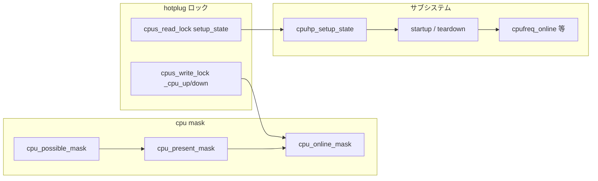

# 第21章 cpu maps と hotplug サブシステム連携

> **本章で読むソース**
>
> - [`include/linux/cpumask.h` L78-L126](https://github.com/gregkh/linux/blob/v6.18.38/include/linux/cpumask.h#L78-L126)
> - [`include/linux/cpuhplock.h` L17-L24](https://github.com/gregkh/linux/blob/v6.18.38/include/linux/cpuhplock.h#L17-L24)
> - [`include/linux/cpuhotplug.h` L26-L62](https://github.com/gregkh/linux/blob/v6.18.38/include/linux/cpuhotplug.h#L26-L62)
> - [`include/linux/cpuhotplug.h` L191-L195](https://github.com/gregkh/linux/blob/v6.18.38/include/linux/cpuhotplug.h#L191-L195)
> - [`kernel/cpu.c` L2479-L2551](https://github.com/gregkh/linux/blob/v6.18.38/kernel/cpu.c#L2479-L2551)
> - [`drivers/cpufreq/cpufreq.c` L2874-L2883](https://github.com/gregkh/linux/blob/v6.18.38/drivers/cpufreq/cpufreq.c#L2874-L2883)
> - [`drivers/cpufreq/cpufreq.c` L2965-L2968](https://github.com/gregkh/linux/blob/v6.18.38/drivers/cpufreq/cpufreq.c#L2965-L2968)

## この章の狙い

CPU hotplug 時に参照される **cpu mask** と **cpus_read_lock / cpus_write_lock**、サブシステムが `cpuhp_setup_state` でコールバックを登録する経路を追う。
タスク migration や load balance は [プロセスとスケジューラ](../../sched/README.md) に委譲する。

## 前提

- [第20章 CPU hotplug 状態機械](20-cpuhp-state-machine.md) の `_cpu_up` と `cpuhp_invoke_callback`
- [第13章 cpufreq コアと policy](../part03-cpufreq/13-cpufreq-framework-policy.md) の policy online

## cpu_possible / present / online

[`include/linux/cpumask.h` L78-L126](https://github.com/gregkh/linux/blob/v6.18.38/include/linux/cpumask.h#L78-L126)

```c
 *     cpu_possible_mask- has bit 'cpu' set iff cpu is populatable
 *     cpu_present_mask - has bit 'cpu' set iff cpu is populated
 *     cpu_enabled_mask - has bit 'cpu' set iff cpu can be brought online
 *     cpu_online_mask  - has bit 'cpu' set iff cpu available to scheduler
 *     cpu_active_mask  - has bit 'cpu' set iff cpu available to migration
 *
 *  If !CONFIG_HOTPLUG_CPU, present == possible, and active == online.
 *
 *  The cpu_possible_mask is fixed at boot time, as the set of CPU IDs
 *  that it is possible might ever be plugged in at anytime during the
 *  life of that system boot.  The cpu_present_mask is dynamic(*),
 *  representing which CPUs are currently plugged in.  And
 *  cpu_online_mask is the dynamic subset of cpu_present_mask,
 *  indicating those CPUs available for scheduling.
extern struct cpumask __cpu_possible_mask;
extern struct cpumask __cpu_online_mask;
extern struct cpumask __cpu_enabled_mask;
extern struct cpumask __cpu_present_mask;
extern struct cpumask __cpu_active_mask;
extern struct cpumask __cpu_dying_mask;
#define cpu_possible_mask ((const struct cpumask *)&__cpu_possible_mask)
#define cpu_online_mask   ((const struct cpumask *)&__cpu_online_mask)
#define cpu_enabled_mask   ((const struct cpumask *)&__cpu_enabled_mask)
#define cpu_present_mask  ((const struct cpumask *)&__cpu_present_mask)
#define cpu_active_mask   ((const struct cpumask *)&__cpu_active_mask)
#define cpu_dying_mask    ((const struct cpumask *)&__cpu_dying_mask)
```

hotplug では `cpu_present` が増減し、`cpu_online` はスケジューラが使える CPU 集合を表す。

## cpus_read_lock と cpus_write_lock

online/offline の制御経路は `cpus_write_lock`、サブシステム登録は `cpus_read_lock` で hotplug と競合しない。

[`include/linux/cpuhplock.h` L17-L24](https://github.com/gregkh/linux/blob/v6.18.38/include/linux/cpuhplock.h#L17-L24)

```c
#ifdef CONFIG_HOTPLUG_CPU
void cpus_write_lock(void);
void cpus_write_unlock(void);
void cpus_read_lock(void);
void cpus_read_unlock(void);
int  cpus_read_trylock(void);
void lockdep_assert_cpus_held(void);
```

`_cpu_up` / `_cpu_down` は write ロック、ドライバの `cpuhp_setup_state` は read ロック配下で登録する。

## enum cpuhp_state の区間

状態番号は PREPARE、STARTING、ONLINE の三区間に分かれる。

[`include/linux/cpuhotplug.h` L26-L62](https://github.com/gregkh/linux/blob/v6.18.38/include/linux/cpuhotplug.h#L26-L62)

```c
 * CPU hotplug states. The state machine invokes the installed state
 * startup callbacks sequentially from CPUHP_OFFLINE + 1 to CPUHP_ONLINE
 * during a CPU online operation. During a CPU offline operation the
 * installed teardown callbacks are invoked in the reverse order from
 * CPUHP_ONLINE - 1 down to CPUHP_OFFLINE.
 *
 * The state space has three sections: PREPARE, STARTING and ONLINE.
 *
 * PREPARE: The callbacks are invoked on a control CPU before the
 * hotplugged CPU is started up or after the hotplugged CPU has died.
 *
 * STARTING: The callbacks are invoked on the hotplugged CPU from the low level
 * hotplug startup/teardown code with interrupts disabled.
 *
 * ONLINE: The callbacks are invoked on the hotplugged CPU from the per CPU
 * hotplug thread with interrupts and preemption enabled.
 */
enum cpuhp_state {
	CPUHP_INVALID = -1,

	/* PREPARE section invoked on a control CPU */
	CPUHP_OFFLINE = 0,
	CPUHP_CREATE_THREADS,
```

固定 enum に入れないサブシステムは `CPUHP_AP_ONLINE_DYN` など動的状態を使う。

## AP 区間の代表状態

[`include/linux/cpuhotplug.h` L191-L195](https://github.com/gregkh/linux/blob/v6.18.38/include/linux/cpuhotplug.h#L191-L195)

```c
	CPUHP_AP_ONLINE,
	CPUHP_TEARDOWN_CPU,

	/* Online section invoked on the hotplugged CPU from the hotplug thread */
	CPUHP_AP_ONLINE_IDLE,
```

`CPUHP_AP_ONLINE` は AP 側の入口、`CPUHP_AP_ONLINE_IDLE` 以降が per-CPU hotplug スレッド上の ONLINE 区間である。

## __cpuhp_setup_state

サブシステムは startup/teardown を登録し、既に online の CPU には遡及 invoke する。

[`kernel/cpu.c` L2479-L2551](https://github.com/gregkh/linux/blob/v6.18.38/kernel/cpu.c#L2479-L2551)

```c
int __cpuhp_setup_state_cpuslocked(enum cpuhp_state state,
				   const char *name, bool invoke,
				   int (*startup)(unsigned int cpu),
				   int (*teardown)(unsigned int cpu),
				   bool multi_instance)
{
	int cpu, ret = 0;
	bool dynstate;

	lockdep_assert_cpus_held();

	if (cpuhp_cb_check(state) || !name)
		return -EINVAL;

	mutex_lock(&cpuhp_state_mutex);

	ret = cpuhp_store_callbacks(state, name, startup, teardown,
				    multi_instance);

	dynstate = state == CPUHP_AP_ONLINE_DYN || state == CPUHP_BP_PREPARE_DYN;
	if (ret > 0 && dynstate) {
		state = ret;
		ret = 0;
	}

	if (ret || !invoke || !startup)
		goto out;

	for_each_present_cpu(cpu) {
		struct cpuhp_cpu_state *st = per_cpu_ptr(&cpuhp_state, cpu);
		int cpustate = st->state;

		if (cpustate < state)
			continue;

		ret = cpuhp_issue_call(cpu, state, true, NULL);
		if (ret) {
			if (teardown)
				cpuhp_rollback_install(cpu, state, NULL);
			cpuhp_store_callbacks(state, NULL, NULL, NULL, false);
			goto out;
		}
	}
out:
	mutex_unlock(&cpuhp_state_mutex);
	if (!ret && dynstate)
		return state;
	return ret;
}

int __cpuhp_setup_state(enum cpuhp_state state,
			const char *name, bool invoke,
			int (*startup)(unsigned int cpu),
			int (*teardown)(unsigned int cpu),
			bool multi_instance)
{
	int ret;

	cpus_read_lock();
	ret = __cpuhp_setup_state_cpuslocked(state, name, invoke, startup,
					     teardown, multi_instance);
	cpus_read_unlock();
	return ret;
}
```

**最適化の工夫**：動的状態は空きスロットを再利用し、サブシステムごとに固定 enum を増やさない。

## cpufreq の hotplug 連携

cpufreq はドライバ登録時に `CPUHP_AP_ONLINE_DYN` へ online/offline コールバックを載せる。

[`drivers/cpufreq/cpufreq.c` L2874-L2883](https://github.com/gregkh/linux/blob/v6.18.38/drivers/cpufreq/cpufreq.c#L2874-L2883)

```c
static int cpuhp_cpufreq_online(unsigned int cpu)
{
	cpufreq_online(cpu);

	return 0;
}

static int cpuhp_cpufreq_offline(unsigned int cpu)
{
	cpufreq_offline(cpu);

	return 0;
}
```

[`drivers/cpufreq/cpufreq.c` L2965-L2968](https://github.com/gregkh/linux/blob/v6.18.38/drivers/cpufreq/cpufreq.c#L2965-L2968)

```c
	ret = cpuhp_setup_state_nocalls_cpuslocked(CPUHP_AP_ONLINE_DYN,
						   "cpufreq:online",
						   cpuhp_cpufreq_online,
						   cpuhp_cpufreq_offline);
```

CPU online 時に policy 構築、offline 時にガバナ停止と policy 縮小が走る。

## mask とロックと登録の関係



## まとめ

`cpu_possible_mask` は boot 時固定、`cpu_present_mask` と `cpu_online_mask` は hotplug で変化する。
hotplug 本体は `cpus_write_lock`、サブシステム登録は `cpus_read_lock` で保護される。
cpufreq などは `CPUHP_AP_ONLINE_DYN` にコールバックを登録し、CPU 増減へ追従する。

## 関連する章

- 前章：[CPU hotplug 状態機械](20-cpuhp-state-machine.md)
- [第13章 cpufreq コアと policy](../part03-cpufreq/13-cpufreq-framework-policy.md)
- [プロセスとスケジューラ](../../sched/README.md) の migration と load balance
