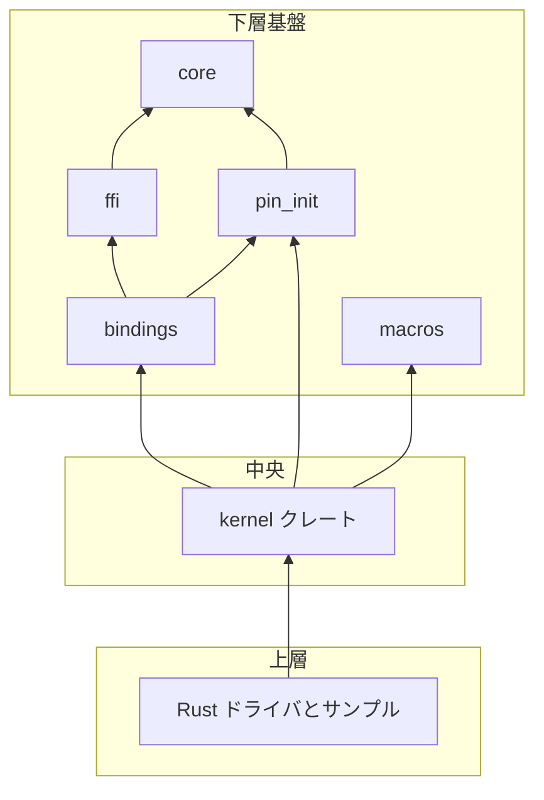

# 第1章 Rust for Linux の全体像と kernel クレート

> 本章で読むソース
>
> - [`rust/kernel/lib.rs`](https://github.com/gregkh/linux/blob/v6.18.38/rust/kernel/lib.rs)
> - [`rust/kernel/prelude.rs`](https://github.com/gregkh/linux/blob/v6.18.38/rust/kernel/prelude.rs)

## この章の狙い

Rust for Linux がカーネル内でどのクレート階層を形成し、`kernel` クレートが何を担うかを把握する。
本分冊の主題は、safe な Rust 抽象が `unsafe` な C カーネル API を安全境界で包む仕組みである。
本章はその地図として、依存関係、`no_std` 環境、モジュール一覧を示す。

## 前提

Rust の所有権、借用、トレイトの基礎を知っていること。
C カーネルのモジュール初期化やデバイスモデルの概観は、[デバイスモデルとドライバ基盤](../../driver-model/README.md) を参照する。

## Rust をカーネルに持ち込む理由

カーネルは長寿命の共有状態と並行アクセスが前提である。
C ではポインタの有効性やロックの保持を規約で守るが、コンパイラはそれを検証しない。
Rust は型と所有権で不変条件を表現でき、違反はコンパイル時か `unsafe` ブロックの契約として明示される。

Rust for Linux はこの型システムをカーネルに持ち込み、C API との境界で安全性不変条件を固定する。
ドライバ作者は `kernel` クレートの safe ラッパーを通じて C 関数を呼び、生の FFI を直接使わない設計が推奨される。

## クレート階層と依存関係

`kernel` クレートは Rust ドライバが直接依存する API 層である。
ただしビルド上の土台は `kernel` だけではない。
`core`、`compiler_builtins`、`ffi`、`pin_init`、`macros`、`bindings`、`uapi` が先にまたは並行して構築され、`kernel.o` はそれらに依存する。

`macros` は手続きマクロ用の proc macro クレートであり、`kernel` クレートに依存する構図ではない。
依存の向きは下層クレートが上層から参照される形であり、Rust ドライバは最終的に `kernel` 経由で下層を間接利用する。

[`rust/kernel/lib.rs` L3-L12](https://github.com/gregkh/linux/blob/v6.18.38/rust/kernel/lib.rs#L3-L12)

```rust
//! The `kernel` crate.
//!
//! This crate contains the kernel APIs that have been ported or wrapped for
//! usage by Rust code in the kernel and is shared by all of them.
//!
//! In other words, all the rest of the Rust code in the kernel (e.g. kernel
//! modules written in Rust) depends on [`core`] and this crate.
//!
//! If you need a kernel C API that is not ported or wrapped yet here, then
//! do so first instead of bypassing this crate.
```

[`rust/kernel/lib.rs` L56-L62](https://github.com/gregkh/linux/blob/v6.18.38/rust/kernel/lib.rs#L56-L62)

```rust
#[cfg(not(CONFIG_RUST))]
compile_error!("Missing kernel configuration for conditional compilation");

// Allow proc-macros to refer to `::kernel` inside the `kernel` crate (this crate).
extern crate self as kernel;

pub use ffi;
```

### クレート依存の処理フロー



## no_std 環境

カーネル Rust はユーザ空間の標準ライブラリを使わない。
`kernel` クレートは `#![no_std]` を宣言し、`core` クレートのみを前提とする。

[`rust/kernel/lib.rs` L14](https://github.com/gregkh/linux/blob/v6.18.38/rust/kernel/lib.rs#L14)

```rust
#![no_std]
```

`no_std` はヒープ確保や panic 処理を自動で安全にするわけではない。
panic 時はカーネル向けハンドラが `BUG()` を呼び出す（第4章の `module!` で詳述する）。
確保失敗を `Result` で返すのは `no_std` 自体ではなく、`kernel` の alloc ラッパーが担う（第8章、第9章）。

## kernel クレートのモジュール一覧

`pub mod` 宣言が本分冊の章立てと対応する。
主要サブシステムを俯瞰し、以降の部で個別に追う。

[`rust/kernel/lib.rs` L64-L99](https://github.com/gregkh/linux/blob/v6.18.38/rust/kernel/lib.rs#L64-L99)

```rust
pub mod acpi;
pub mod alloc;
#[cfg(CONFIG_AUXILIARY_BUS)]
pub mod auxiliary;
pub mod bitmap;
pub mod bits;
#[cfg(CONFIG_BLOCK)]
pub mod block;
pub mod bug;
#[doc(hidden)]
pub mod build_assert;
pub mod clk;
#[cfg(CONFIG_CONFIGFS_FS)]
pub mod configfs;
pub mod cpu;
#[cfg(CONFIG_CPU_FREQ)]
pub mod cpufreq;
pub mod cpumask;
pub mod cred;
pub mod debugfs;
pub mod device;
pub mod device_id;
pub mod devres;
pub mod dma;
pub mod driver;
#[cfg(CONFIG_DRM = "y")]
pub mod drm;
pub mod error;
pub mod faux;
#[cfg(CONFIG_RUST_FW_LOADER_ABSTRACTIONS)]
pub mod firmware;
pub mod fmt;
pub mod fs;
pub mod id_pool;
pub mod init;
```

[`rust/kernel/lib.rs` L100-L143](https://github.com/gregkh/linux/blob/v6.18.38/rust/kernel/lib.rs#L100-L143)

```rust
pub mod io;
pub mod ioctl;
pub mod iov;
pub mod irq;
pub mod jump_label;
#[cfg(CONFIG_KUNIT)]
pub mod kunit;
pub mod list;
pub mod maple_tree;
pub mod miscdevice;
pub mod mm;
#[cfg(CONFIG_NET)]
pub mod net;
pub mod of;
#[cfg(CONFIG_PM_OPP)]
pub mod opp;
pub mod page;
#[cfg(CONFIG_PCI)]
pub mod pci;
pub mod pid_namespace;
pub mod platform;
pub mod prelude;
pub mod print;
pub mod processor;
pub mod ptr;
pub mod rbtree;
pub mod regulator;
pub mod revocable;
pub mod scatterlist;
pub mod security;
pub mod seq_file;
pub mod sizes;
mod static_assert;
#[doc(hidden)]
pub mod std_vendor;
pub mod str;
pub mod sync;
pub mod task;
pub mod time;
pub mod tracepoint;
pub mod transmute;
pub mod types;
pub mod uaccess;
pub mod workqueue;
pub mod xarray;
```

v6.18.38 では `pub mod` が67個ある。
`sync` は第3部、`alloc` と `device` は第2部と第7部、`io` と `dma` は第5部、`pci` と `platform` は第8部で扱う。

## prelude の役割

頻出型とマクロを一括 import するためのモジュールである。
各 Rust ドライバは `use kernel::prelude::*;` から始めるのが慣例である。

[`rust/kernel/prelude.rs` L3-L12](https://github.com/gregkh/linux/blob/v6.18.38/rust/kernel/prelude.rs#L3-L12)

```rust
//! The `kernel` prelude.
//!
//! These are the most common items used by Rust code in the kernel,
//! intended to be imported by all Rust code, for convenience.
//!
//! # Examples
//!
//! ```
//! use kernel::prelude::*;
//! ```
```

[`rust/kernel/prelude.rs` L14-L30](https://github.com/gregkh/linux/blob/v6.18.38/rust/kernel/prelude.rs#L14-L30)

```rust
#[doc(no_inline)]
pub use core::{
    mem::{align_of, align_of_val, size_of, size_of_val},
    pin::Pin,
};

pub use ::ffi::{
    c_char, c_int, c_long, c_longlong, c_schar, c_short, c_uchar, c_uint, c_ulong, c_ulonglong,
    c_ushort, c_void,
};

pub use crate::alloc::{flags::*, Box, KBox, KVBox, KVVec, KVec, VBox, VVec, Vec};

#[doc(no_inline)]
pub use macros::{export, kunit_tests, module, vtable};
```

`ffi` 型、`KBox` 系、`module!` マクロ、`PinInit` が prelude に集約される。
C の `THIS_MODULE` に相当する `ThisModule` もここから利用できる。

## モジュール初期化の入口

Rust ドライバは `Module` トレイトまたは `InPlaceModule` トレイトで初期化を宣言する。
`module!` マクロが C 側の `module_init` 相当の登録を生成する（第4章）。

[`rust/kernel/lib.rs` L153-L164](https://github.com/gregkh/linux/blob/v6.18.38/rust/kernel/lib.rs#L153-L164)

```rust
/// The top level entrypoint to implementing a kernel module.
///
/// For any teardown or cleanup operations, your type may implement [`Drop`].
pub trait Module: Sized + Sync + Send {
    /// Called at module initialization time.
    ///
    /// Use this method to perform whatever setup or registration your module
    /// should do.
    ///
    /// Equivalent to the `module_init` macro in the C API.
    fn init(module: &'static ThisModule) -> error::Result<Self>;
}
```

`init` が `Result` を返す点が、C の errno 返却と対応する契約である。

## ゼロコスト抽象と fallible 確保の分離

`no_std` と「確保失敗を `Result` で返す」は別機構である。
`no_std` は標準ライブラリを外すだけで、ヒープ確保の失敗を型で表現しない。

`kernel::alloc` の `KBox` や `KVec` は GFP フラグ付き確保をラップし、失敗時に `Result` を返す。
この設計により、カーネル文脈で OOM を panic に落とさず呼び出し元へ伝播できる。
ゼロコストの根拠は、確保を担う `Allocator` トレイトが型引数として単相化され、`dyn Allocator` のような trait object 経由の動的ディスパッチを要しない点にある。
ただし `KVec` は容量の確認や要素の再配置といった管理ロジックも持つため、`KBox`／`KVec` 全体を単一の `kmalloc` 呼び出しと同等のコストと言うことはできない。

## 7.1.3 との対比

`rust/` 配下の `.rs` ファイル数は v6.18.38 で159、v7.1.3 で254である。
増分95のうち、proc macro 支援クレート `syn` 55、`quote` 7、`proc-macro2` 13で計75は新規同梱分である。
159から254は `.rs` 総数に限定した尺度であり、支援クレート同梱を含む。

API 拡大の尺度としては `kernel/lib.rs` の `pub mod` 数が67から78へ増えている。
v7.1.3 で新たに公開されたモジュールには `gpu`、`iommu`、`i2c`、`pwm`、`soc`、`usb`、`module_param`、`safety`、`interop`、`num`、`impl_flags` がある。

比較版 v7.1.3 の新規 `pub mod` 宣言を示す。

[`rust/kernel/lib.rs` L75-L87](https://github.com/gregkh/linux/blob/v7.1.3/rust/kernel/lib.rs#L75-L87)

```rust
#[cfg(CONFIG_GPU_BUDDY = "y")]
pub mod gpu;
#[cfg(CONFIG_I2C = "y")]
pub mod i2c;
pub mod id_pool;
#[doc(hidden)]
pub mod impl_flags;
pub mod init;
pub mod interop;
pub mod io;
pub mod ioctl;
pub mod iommu;
```

第8部第30章はバス／登録抽象1系統と gpu／DRM 基盤1系統を代表系統として深掘りし、`iommu` を含む残りは索引表で扱う。
`module_param` は第4章、`safety` と `ptr`／projection は第6章に固定する。

6.18.38 から 7.1.3 へ `kernel` クレートの根幹契約、すなわち `no_std`、`Module` トレイト、`prelude` の役割は変わっていない。
拡大は主に新規サブシステム抽象の追加と、手続きマクロ基盤の同梱である。

## まとめ

Rust for Linux は下層の `core`/`ffi`/`bindings`/`pin_init`/`macros` と中央の `kernel` クレート、上層の Rust ドライバという三層で構成される。
`kernel` クレートは ported または wrapped された C カーネル API 層であり、safe な抽象だけでなく `unsafe` な API や低水準部品も含む。
生の FFI を直接使わず、必要な C API はこの層へ抽象を追加するのが公式方針である。
`no_std` は標準ライブラリ排除であり、fallible 確保は alloc ラッパーが担う。
v7.1.3 では `pub mod` が11個増え、バスや GPU 関連の抽象が追加された。

## 関連する章

- [第2章 ビルド統合とツールチェイン](02-build-integration-toolchain.md)
- [第3章 FFI とバインディング生成と helper](03-ffi-bindings-helpers.md)
- [第4章 module! マクロとモジュール登録](../part01-language-foundation/04-module-macro.md)
- [第8章 アロケータと GFP フラグ](../part02-memory-ownership/08-allocator-gfp.md)
