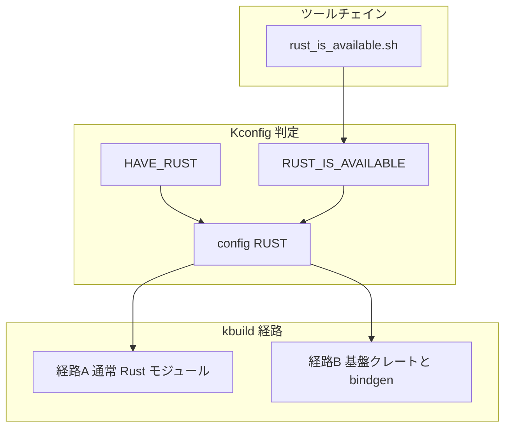

# 第2章 ビルド統合とツールチェイン

> 本章で読むソース
>
> - [`init/Kconfig`](https://github.com/gregkh/linux/blob/v6.18.38/init/Kconfig)
> - [`arch/Kconfig`](https://github.com/gregkh/linux/blob/v6.18.38/arch/Kconfig)
> - [`arch/riscv/Kconfig`](https://github.com/gregkh/linux/blob/v6.18.38/arch/riscv/Kconfig)
> - [`scripts/rust_is_available.sh`](https://github.com/gregkh/linux/blob/v6.18.38/scripts/rust_is_available.sh)
> - [`scripts/min-tool-version.sh`](https://github.com/gregkh/linux/blob/v6.18.38/scripts/min-tool-version.sh)
> - [`rust/Makefile`](https://github.com/gregkh/linux/blob/v6.18.38/rust/Makefile)
> - [`rust/bindgen_parameters`](https://github.com/gregkh/linux/blob/v6.18.38/rust/bindgen_parameters)
> - [`scripts/Makefile.build`](https://github.com/gregkh/linux/blob/v6.18.38/scripts/Makefile.build)
> - [`scripts/Makefile.lib`](https://github.com/gregkh/linux/blob/v6.18.38/scripts/Makefile.lib)

## この章の狙い

Rust サポートを有効化する Kconfig の三者関係と、ツールチェイン検査の主経路を把握する。
kbuild が cargo を使わず `rustc` を直接呼ぶ二系統のビルド経路を区別する。

## 前提

Linux カーネルの `make menuconfig` と kbuild の基本を知っていること。
第1章で `kernel` クレートの位置づけを読んでいること。

## Kconfig の三者

Rust 関連の設定は三つの独立したシンボルに分かれる。
混同すると「ツールチェインは揃っているのにビルドできない」原因の切り分けができない。

**`RUST_IS_AVAILABLE`** はホスト上の Rust ツールチェインが要件を満たすかを示す。
`rust_is_available.sh` の成功結果を `def_bool` で取り込む。

[`init/Kconfig` L70-L79](https://github.com/gregkh/linux/blob/v6.18.38/init/Kconfig#L70-L79)

```text
config RUST_IS_AVAILABLE
	def_bool $(success,$(srctree)/scripts/rust_is_available.sh)
	help
	  This shows whether a suitable Rust toolchain is available (found).

	  Please see Documentation/rust/quick-start.rst for instructions on how
	  to satisfy the build requirements of Rust support.

	  In particular, the Makefile target 'rustavailable' is useful to check
	  why the Rust toolchain is not being detected.
```

**`HAVE_RUST`** はアーキテクチャが Rust サポートを持つかを示す能力フラグである。
各 `arch/*/Kconfig` が `select HAVE_RUST` する。
`RUST_IS_AVAILABLE` がアーキ条件を内包するわけではない。

[`arch/Kconfig` L431-L435](https://github.com/gregkh/linux/blob/v6.18.38/arch/Kconfig#L431-L435)

```text
config HAVE_RUST
	bool
	help
	  This symbol should be selected by an architecture if it
	  supports Rust.
```

RISC-V では Clang と rustc の RISC-V サポートが揃ったときだけ `HAVE_RUST` が有効になる。

[`arch/riscv/Kconfig` L196](https://github.com/gregkh/linux/blob/v6.18.38/arch/riscv/Kconfig#L196)

```text
	select HAVE_RUST if RUSTC_SUPPORTS_RISCV && CC_IS_CLANG
```

**`config RUST`** はユーザーが Rust サポートを有効にするスイッチである。
`HAVE_RUST` と `RUST_IS_AVAILABLE` の両方に個別に `depends on` する。

[`init/Kconfig` L2087-L2105](https://github.com/gregkh/linux/blob/v6.18.38/init/Kconfig#L2087-L2105)

```text
config RUST
	bool "Rust support"
	depends on HAVE_RUST
	depends on RUST_IS_AVAILABLE
	select EXTENDED_MODVERSIONS if MODVERSIONS
	depends on !MODVERSIONS || GENDWARFKSYMS
	depends on !GCC_PLUGIN_RANDSTRUCT
	depends on !RANDSTRUCT
	depends on !DEBUG_INFO_BTF || (PAHOLE_HAS_LANG_EXCLUDE && !LTO)
	depends on !CFI || HAVE_CFI_ICALL_NORMALIZE_INTEGERS_RUSTC
	select CFI_ICALL_NORMALIZE_INTEGERS if CFI
	depends on !CALL_PADDING || RUSTC_VERSION >= 108100
	depends on !KASAN_SW_TAGS
	depends on !(MITIGATION_RETHUNK && KASAN) || RUSTC_VERSION >= 108300
	help
	  Enables Rust support in the kernel.

	  This allows other Rust-related options, like drivers written in Rust,
	  to be selected.
```

`RUST` には CFI や KASAN との共存条件も載る。
rustc のバージョン番号 `RUSTC_VERSION` は `108100` 形式の整数である。

### Kconfig からビルドへの処理フロー



## ツールチェイン検査

`rust_is_available.sh` が rustc、bindgen、libclang の整合を検査する主経路である。
Kbuild から `RUSTC`、`BINDGEN`、`CC` 環境変数が渡される前提で動く。

rustc の最低バージョンは `scripts/min-tool-version.sh` が `1.78.0` を返す。

[`scripts/rust_is_available.sh` L81-L118](https://github.com/gregkh/linux/blob/v6.18.38/scripts/rust_is_available.sh#L81-L118)

```sh
# Check that the Rust compiler version is suitable.
#
# Non-stable and distributions' versions may have a version suffix, e.g. `-dev`.
rust_compiler_output=$( \
	LC_ALL=C "$RUSTC" --version 2>/dev/null
) || rust_compiler_code=$?
# ... (中略) ...
rust_compiler_min_version=$($min_tool_version rustc)
rust_compiler_cversion=$(get_canonical_version $rust_compiler_version)
rust_compiler_min_cversion=$(get_canonical_version $rust_compiler_min_version)
if [ "$rust_compiler_cversion" -lt "$rust_compiler_min_cversion" ]; then
	echo >&2 "***"
	echo >&2 "*** Rust compiler '$RUSTC' is too old."
	echo >&2 "***   Your version:    $rust_compiler_version"
	echo >&2 "***   Minimum version: $rust_compiler_min_version"
	echo >&2 "***"
	exit 1
fi
```

bindgen の検査に続き、bindgen が見つけた libclang のバージョンも最低 LLVM バージョンと照合する。
`scripts/min-tool-version.sh` は非 LoongArch では 15.0.0 を、`SRCARCH` が LoongArch のときは 18.0.0 を返す。

[`scripts/min-tool-version.sh` L26-L32](https://github.com/gregkh/linux/blob/v6.18.38/scripts/min-tool-version.sh#L26-L32)

```sh
llvm)
	if [ "$SRCARCH" = loongarch ]; then
		echo 18.0.0
	else
		echo 15.0.0
	fi
	;;
```

[`scripts/rust_is_available.sh` L180-L224](https://github.com/gregkh/linux/blob/v6.18.38/scripts/rust_is_available.sh#L180-L224)

```sh
# Check that the `libclang` used by the Rust bindings generator is suitable.
#
# ... (中略) ...
bindgen_libclang_min_version=$($min_tool_version llvm)
bindgen_libclang_cversion=$(get_canonical_version $bindgen_libclang_version)
bindgen_libclang_min_cversion=$(get_canonical_version $bindgen_libclang_min_version)
if [ "$bindgen_libclang_cversion" -lt "$bindgen_libclang_min_cversion" ]; then
	echo >&2 "***"
	echo >&2 "*** libclang (used by the Rust bindings generator '$BINDGEN') is too old."
	echo >&2 "***   Your version:    $bindgen_libclang_version"
```

cargo は使わない。
kbuild が `$(RUSTC)` を直接呼び、カーネル全体の依存グラフに Rust を組み込む。

## ビルド経路の二系統

### 経路A: 通常の Rust モジュール

ドライバの `.rs` ファイルは `scripts/Makefile.build` の `rustc_o_rs` 規則で `.o` に変換される。
他の C オブジェクトと同様にモジュールの `Makefile` から組み込まれる。

[`scripts/Makefile.build` L345-L354](https://github.com/gregkh/linux/blob/v6.18.38/scripts/Makefile.build#L345-L354)

```makefile
quiet_cmd_rustc_o_rs = $(RUSTC_OR_CLIPPY_QUIET) $(quiet_modtag) $@
      cmd_rustc_o_rs = $(rust_common_cmd) --emit=obj=$@ $< $(cmd_objtool)

define rule_rustc_o_rs
	$(call cmd_and_fixdep,rustc_o_rs)
	$(call cmd,gen_objtooldep)
endef

$(obj)/%.o: $(obj)/%.rs FORCE
	+$(call if_changed_rule,rustc_o_rs)
```

### 経路B: 基盤クレートと bindgen

`core`、`ffi`、`bindings`、`kernel` などは `rust/Makefile` の `rustc_library` で構築される。
bindgen は `bindings_helper.h` から `bindings_generated.rs` を生成し、objtree 配下に置く。

[`rust/Makefile` L359-L373](https://github.com/gregkh/linux/blob/v6.18.38/rust/Makefile#L359-L373)

```makefile
quiet_cmd_bindgen = BINDGEN $@
      cmd_bindgen = \
	$(BINDGEN) $< $(bindgen_target_flags) --rust-target 1.68 \
		--use-core --with-derive-default --ctypes-prefix ffi --no-layout-tests \
		--no-debug '.*' --enable-function-attribute-detection \
		-o $@ -- $(bindgen_c_flags_final) -DMODULE \
		$(bindgen_target_cflags) $(bindgen_target_extra)

$(obj)/bindings/bindings_generated.rs: private bindgen_target_flags = \
    $(shell grep -Ev '^#|^$$' $(src)/bindgen_parameters)
$(obj)/bindings/bindings_generated.rs: $(src)/bindings/bindings_helper.h \
    $(src)/bindgen_parameters FORCE
	$(call if_changed_dep,bindgen)
```

`bindgen_parameters` は型の blocklist や `MaybeZeroable` 付与など、生成コードの調整を宣言する。

[`rust/bindgen_parameters` L3-L6](https://github.com/gregkh/linux/blob/v6.18.38/rust/bindgen_parameters#L3-L6)

```text
# We want to map these types to `isize`/`usize` manually, instead of
# define them as `int`/`long` depending on platform bitwidth.
--blocklist-type __kernel_s?size_t
--blocklist-type __kernel_ptrdiff_t
```

基盤クレートの rustc 呼び出しは `--sysroot=/dev/null` でホスト sysroot を使わず、カーネル用 `core` をリンクする。

[`rust/Makefile` L442-L454](https://github.com/gregkh/linux/blob/v6.18.38/rust/Makefile#L442-L454)

```makefile
quiet_cmd_rustc_library = $(if $(skip_clippy),RUSTC,$(RUSTC_OR_CLIPPY_QUIET)) L $@
      cmd_rustc_library = \
	OBJTREE=$(abspath $(objtree)) \
	$(if $(skip_clippy),$(RUSTC),$(RUSTC_OR_CLIPPY)) \
		$(filter-out $(skip_flags),$(rust_flags)) $(rustc_target_flags) \
		--emit=dep-info=$(depfile) --emit=obj=$@ \
		--emit=metadata=$(dir $@)$(patsubst %.o,lib%.rmeta,$(notdir $@)) \
		--crate-type rlib -L$(objtree)/$(obj) \
		--crate-name $(patsubst %.o,%,$(notdir $@)) $< \
		--sysroot=/dev/null \
		-Zunstable-options \
```

`kernel.o` の依存は明示的に列挙され、ビルド順序が固定される。

[`rust/Makefile` L565-L569](https://github.com/gregkh/linux/blob/v6.18.38/rust/Makefile#L565-L569)

```makefile
$(obj)/kernel.o: private rustc_target_flags = --extern ffi --extern pin_init \
    --extern build_error --extern macros --extern bindings --extern uapi
$(obj)/kernel.o: $(src)/kernel/lib.rs $(obj)/build_error.o $(obj)/pin_init.o \
    $(obj)/$(libmacros_name) $(obj)/bindings.o $(obj)/uapi.o FORCE
	+$(call if_changed_rule,rustc_library)
```

## cargo を使わない設計の機構

カーネルビルドは既存の kbuild 依存追跡と設定伝播に統合されている。
cargo の独自解決を挟むと、`.config` の `CONFIG_*` や LTO、CFI フラグの同期が二重管理になる。

`rustc_library` は `--emit=metadata` で rmeta を生成し、クレート間リンクを kbuild が制御する。
`#![feature(...)]` は各クレートのソース自身に書かれており、ビルド設定側から渡されるわけではない（例えば `rust/kernel/lib.rs` の冒頭）。
`include/generated/rustc_cfg` は `rust_flags` に response file として連結される別の仕組みで、Kconfig が確定した `CONFIG_RUST` などの設定値を `--cfg=CONFIG_X` 形式で rustc へ渡し、`#[cfg(CONFIG_X)]` の条件コンパイルを `.config` と同期させる。

[`scripts/Makefile.lib` L162](https://github.com/gregkh/linux/blob/v6.18.38/scripts/Makefile.lib#L162)

```makefile
rust_flags     = $(_rust_flags) $(modkern_rustflags) @$(objtree)/include/generated/rustc_cfg
```

## 7.1.3 との対比

v7.1.3 では最低 rustc が `1.85.0`、最低 bindgen が `0.71.1` に引き上げられている。
比較版の `min-tool-version.sh` を示す。

[`scripts/min-tool-version.sh` L33-L37](https://github.com/gregkh/linux/blob/v7.1.3/scripts/min-tool-version.sh#L33-L37)

```sh
rustc)
	echo 1.85.0
	;;
bindgen)
	echo 0.71.1
```

bindgen の `--rust-target` も `1.68` から `1.85` へ更新されている。

比較版 v7.1.3 の bindgen 呼び出し。

[`rust/Makefile` L447-L453](https://github.com/gregkh/linux/blob/v7.1.3/rust/Makefile#L447-L453)

```makefile
quiet_cmd_bindgen = BINDGEN $@
      cmd_bindgen = \
	$(BINDGEN) $< $(bindgen_target_flags) --rust-target 1.85 \
		--use-core --with-derive-default --ctypes-prefix ffi --no-layout-tests \
		--no-debug '.*' --enable-function-attribute-detection \
		-o $@ -- $(bindgen_c_flags_final) -DMODULE \
		$(bindgen_target_cflags) $(bindgen_target_extra)
```

`bindgen_parameters` には CFI 向けの `--newtype-enum` や VM フラグの blocklist が追加されている。
Kconfig 三者の分離と二系統ビルドの骨格は 6.18.38 から変わっていない。

## まとめ

`RUST_IS_AVAILABLE`、`HAVE_RUST`、`config RUST` は独立した条件であり、すべて満たして初めて Rust ビルドが走る。
ツールチェイン検査は `rust_is_available.sh` が担い、cargo は介在しない。
通常モジュールは `Makefile.build`、基盤クレートと bindgen は `rust/Makefile` が担当する。
v7.1.3 では rustc と bindgen の最低版、および bindgen 生成パラメータが更新された。

## 関連する章

- [第1章 Rust for Linux の全体像と kernel クレート](01-overview-kernel-crate.md)
- [第3章 FFI とバインディング生成と helper](03-ffi-bindings-helpers.md)
- [第4章 module! マクロとモジュール登録](../part01-language-foundation/04-module-macro.md)
