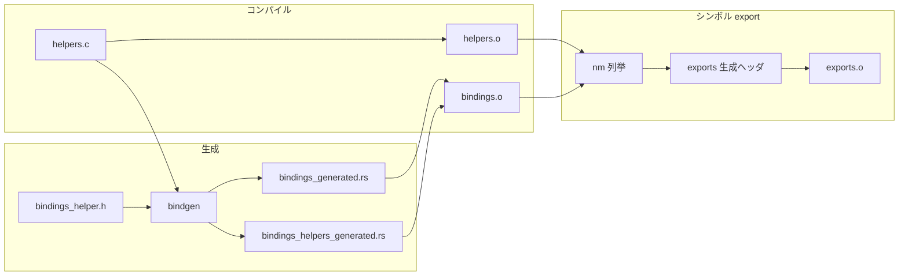

# 第3章 FFI とバインディング生成と helper

> 本章で読むソース
>
> - [`rust/bindings/lib.rs`](https://github.com/gregkh/linux/blob/v6.18.38/rust/bindings/lib.rs)
> - [`rust/bindings/bindings_helper.h`](https://github.com/gregkh/linux/blob/v6.18.38/rust/bindings/bindings_helper.h)
> - [`rust/helpers/helpers.c`](https://github.com/gregkh/linux/blob/v6.18.38/rust/helpers/helpers.c)
> - [`rust/helpers/atomic.c`](https://github.com/gregkh/linux/blob/v6.18.38/rust/helpers/atomic.c)
> - [`rust/exports.c`](https://github.com/gregkh/linux/blob/v6.18.38/rust/exports.c)
> - [`rust/ffi.rs`](https://github.com/gregkh/linux/blob/v6.18.38/rust/ffi.rs)
> - [`rust/compiler_builtins.rs`](https://github.com/gregkh/linux/blob/v6.18.38/rust/compiler_builtins.rs)
> - [`rust/Makefile`](https://github.com/gregkh/linux/blob/v6.18.38/rust/Makefile)
> - [`rust/macros/module.rs`](https://github.com/gregkh/linux/blob/v6.18.38/rust/macros/module.rs)
> - [`rust/pin-init/internal/src/lib.rs`](https://github.com/gregkh/linux/blob/v6.18.38/rust/pin-init/internal/src/lib.rs)

## この章の狙い

C カーネル API と Rust コードの境界層を、bindgen 生成物、helper、型エイリアス、シンボル export の四経路に分けて追う。
生バインディングが安全性契約を提供しない点と、各抽象がどこで safe ラッパーへ昇格するかの入口を示す。

## 前提

第1章のクレート階層と第2章の bindgen ビルド経路を読んでいること。
FFI（Foreign Function Interface）の基本、すなわち C と Rust の呼び出し規約の違いを知っていること。

## ffi クレートの C 型エイリアス

`ffi` クレートは C プリミティブ型を Rust 型へ写像する。
カーネルは `-funsigned-char` を使うため、`c_char` は `core::ffi` のデフォルトと異なる。

[`rust/ffi.rs` L3-L9](https://github.com/gregkh/linux/blob/v6.18.38/rust/ffi.rs#L3-L9)

```rust
//! Foreign function interface (FFI) types.
//!
//! This crate provides mapping from C primitive types to Rust ones.
//!
//! The Rust [`core`] crate provides [`core::ffi`], which maps integer types to the platform default
//! C ABI. The kernel does not use [`core::ffi`], so it can customise the mapping that deviates from
//! the platform default.
```

[`rust/ffi.rs` L25-L46](https://github.com/gregkh/linux/blob/v6.18.38/rust/ffi.rs#L25-L46)

```rust
alias! {
    // `core::ffi::c_char` is either `i8` or `u8` depending on architecture. In the kernel, we use
    // `-funsigned-char` so it's always mapped to `u8`.
    c_char = u8;

    c_schar = i8;
    c_uchar = u8;

    c_short = i16;
    c_ushort = u16;

    c_int = i32;
    c_uint = u32;

    // In the kernel, `intptr_t` is defined to be `long` in all platforms, so we can map the type to
    // `isize`.
    c_long = isize;
    c_ulong = usize;

    c_longlong = i64;
    c_ulonglong = u64;
}
```

各エイリアス定義の直後には `core::ffi` とのサイズ一致を `const` 断言で検証する。
型の不一致はコンパイル時に検出される。

## bindgen への入力と bindings クレートの合成

`bindings_helper.h` は bindgen に渡す C ヘッダの集約である。
カーネル設定やアーキテクチャで型が変わる `enum` については、先に正しいヘッダを include して型を固定する。

[`rust/bindings/bindings_helper.h` L1-L8](https://github.com/gregkh/linux/blob/v6.18.38/rust/bindings/bindings_helper.h#L1-L8)

```c
/* SPDX-License-Identifier: GPL-2.0 */
/*
 * Header that contains the code (mostly headers) for which Rust bindings
 * will be automatically generated by `bindgen`.
 *
 * Sorted alphabetically.
 */
```

生成された `bindings_generated.rs` と helper 宣言は `bindings/lib.rs` で合成される。
`bindings_raw` が生バインディングを include し、`bindings_helper` の glob import を重ねる。

[`rust/bindings/lib.rs` L33-L54](https://github.com/gregkh/linux/blob/v6.18.38/rust/bindings/lib.rs#L33-L54)

```rust
mod bindings_raw {
    use pin_init::{MaybeZeroable, Zeroable};

    // Manual definition for blocklisted types.
    type __kernel_size_t = usize;
    type __kernel_ssize_t = isize;
    type __kernel_ptrdiff_t = isize;

    // ... (中略) ...

    // Use glob import here to expose all helpers.
    // Symbols defined within the module will take precedence to the glob import.
    pub use super::bindings_helper::*;
    include!(concat!(
        env!("OBJTREE"),
        "/rust/bindings/bindings_generated.rs"
    ));
}
```

直接 binding と helper が同名なら、モジュール内の直接 binding が優先される。
helper は dead code になり得るが、意図した優先規則である。

[`rust/bindings/lib.rs` L56-L69](https://github.com/gregkh/linux/blob/v6.18.38/rust/bindings/lib.rs#L56-L69)

```rust
// When both a directly exposed symbol and a helper exists for the same function,
// the directly exposed symbol is preferred and the helper becomes dead code, so
// ignore the warning here.
#[allow(dead_code)]
mod bindings_helper {
    // Import the generated bindings for types.
    use super::bindings_raw::*;
    include!(concat!(
        env!("OBJTREE"),
        "/rust/bindings/bindings_helpers_generated.rs"
    ));
}

pub use bindings_raw::*;
```

### FFI 層の処理フロー



## helper の二面性

C の非自明なマクロや `static inline` 関数は Rust から直接呼べない。
`rust/helpers/` 配下の `.c` ファイルが通常の C 関数としてラップし、Rust から呼び出せるシンボルを提供する。

[`rust/helpers/helpers.c` L1-L8](https://github.com/gregkh/linux/blob/v6.18.38/rust/helpers/helpers.c#L1-L8)

```c
// SPDX-License-Identifier: GPL-2.0
/*
 * Non-trivial C macros cannot be used in Rust. Similarly, inlined C functions
 * cannot be called either. This file explicitly creates functions ("helpers")
 * that wrap those so that they can be called from Rust.
 *
 * Sorted alphabetically.
 */
```

`helpers.c` は個別 helper ファイルを include して束ねる。
同じ `helpers.c` が bindgen の入力にもなり、`bindings_helpers_generated.rs` に `rust_helper_*` 宣言が生成される。

[`rust/Makefile` L385-L393](https://github.com/gregkh/linux/blob/v6.18.38/rust/Makefile#L385-L393)

```makefile
$(obj)/bindings/bindings_helpers_generated.rs: private bindgen_target_flags = \
    --blocklist-type '.*' --allowlist-var '' \
    --allowlist-function 'rust_helper_.*'
$(obj)/bindings/bindings_helpers_generated.rs: private bindgen_target_cflags = \
    -I$(objtree)/$(obj) -Wno-missing-prototypes -Wno-missing-declarations
$(obj)/bindings/bindings_helpers_generated.rs: private bindgen_target_extra = ; \
    sed -Ei 's/pub fn rust_helper_([a-zA-Z0-9_]*)/#[link_name="rust_helper_\1"]\n    pub fn \1/g' $@
$(obj)/bindings/bindings_helpers_generated.rs: $(src)/helpers/helpers.c FORCE
	$(call if_changed_dep,bindgen)
```

同時に `helpers.c` 自体が `helpers.o` としてコンパイルされ、実体シンボルがカーネルにリンクされる。

[`rust/Makefile` L504-L507](https://github.com/gregkh/linux/blob/v6.18.38/rust/Makefile#L504-L507)

```makefile
# helpers.o uses the same export mechanism as Rust libraries, so ensure symbol
# versions are calculated for the helpers too.
$(obj)/helpers/helpers.o: $(src)/helpers/helpers.c $(recordmcount_source) FORCE
	+$(call if_changed_rule,rust_cc_library)
```

`atomic.c` の例では `atomic_read` などが `rust_helper_atomic_read` として再公開される。

[`rust/helpers/atomic.c` L19-L35](https://github.com/gregkh/linux/blob/v6.18.38/rust/helpers/atomic.c#L19-L35)

```c
__rust_helper int
rust_helper_atomic_read(const atomic_t *v)
{
	return atomic_read(v);
}

__rust_helper int
rust_helper_atomic_read_acquire(const atomic_t *v)
{
	return atomic_read_acquire(v);
}

__rust_helper void
rust_helper_atomic_set(atomic_t *v, int i)
{
	atomic_set(v, i);
}
```

## unsafe 境界の位置

生バインディングの「すべてが unsafe」という言い方は広すぎる。
定数や型定義も含まれ、それらに `unsafe` は不要である。
外部関数呼び出しと raw pointer 操作が `unsafe` を要し、生 binding 自体は安全性不変条件を提供しない。

`kernel` クレートの各モジュールがこの生 FFI をラップし、`Safety` コメントと型で不変条件を固定する。
第6章以降で個別抽象ごとに境界の置き方を追う。

## exports.c とシンボル export

`exports.c` は Rust から C への callback 橋ではない。
`nm` で列挙した定義シンボルを `EXPORT_SYMBOL_GPL` に登録し、ロード可能モジュールが Rust 基盤クレートのシンボルを解決できるようにする。

[`rust/exports.c` L1-L21](https://github.com/gregkh/linux/blob/v6.18.38/rust/exports.c#L1-L21)

```c
// SPDX-License-Identifier: GPL-2.0
/*
 * A hack to export Rust symbols for loadable modules without having to redo
 * the entire `include/linux/export.h` logic in Rust.
 *
 * This requires Rust's new/future `v0` mangling scheme because the default one
 * ("legacy") uses invalid characters for C identifiers (thus we cannot use the
 * `EXPORT_SYMBOL_*` macros).
 *
 * All symbols are exported as GPL-only to guarantee no GPL-only feature is
 * accidentally exposed.
 */

#include <linux/export.h>

#define EXPORT_SYMBOL_RUST_GPL(sym) extern int sym; EXPORT_SYMBOL_GPL(sym)

#include "exports_core_generated.h"
#include "exports_helpers_generated.h"
#include "exports_bindings_generated.h"
#include "exports_kernel_generated.h"
```

生成ヘッダは各 `.o` から `nm` で抽出する。

[`rust/Makefile` L395-L420](https://github.com/gregkh/linux/blob/v6.18.38/rust/Makefile#L395-L420)

```makefile
rust_exports = $(NM) -p --defined-only $(1) | awk '$$2~/(T|R|D|B)/ && $$3!~/__(pfx|cfi|odr_asan)/ { printf $(2),$$3 }'

quiet_cmd_exports = EXPORTS $@
      cmd_exports = \
	$(call rust_exports,$<,"EXPORT_SYMBOL_RUST_GPL(%s);\n") > $@

$(obj)/exports_core_generated.h: $(obj)/core.o FORCE
	$(call if_changed,exports)

# ... (中略) ...

$(obj)/exports_helpers_generated.h: $(obj)/helpers/helpers.o FORCE
	$(call if_changed,exports)

$(obj)/exports_bindings_generated.h: $(obj)/bindings.o FORCE
	$(call if_changed,exports)

$(obj)/exports_kernel_generated.h: $(obj)/kernel.o FORCE
	$(call if_changed,exports)
```

C から Rust の callback へ入る経路は、各抽象が定義する `extern "C"` 関数であり、`exports.c` とは別である。

## compiler_builtins の弱い stub

`compiler_builtins.rs` は LLVM `compiler-rt` の代替実装ではない。
`core` が参照し得る不要な浮動小数点や 128bit 演算に対し、誤使用を検出する panic stub を置く。

[`rust/compiler_builtins.rs` L3-L14](https://github.com/gregkh/linux/blob/v6.18.38/rust/compiler_builtins.rs#L3-L14)

```rust
//! Our own `compiler_builtins`.
//!
//! Rust provides [`compiler_builtins`] as a port of LLVM's [`compiler-rt`].
//! Since we do not need the vast majority of them, we avoid the dependency
//! by providing this file.
//!
//! At the moment, some builtins are required that should not be. For instance,
//! [`core`] has 128-bit integers functionality which we should not be compiling
//! in. We will work with upstream [`core`] to provide feature flags to disable
//! the parts we do not need. For the moment, we define them to [`panic!`] at
//! runtime for simplicity to catch mistakes, instead of performing surgery
//! on `core.o`.
```

[`rust/compiler_builtins.rs` L28-L38](https://github.com/gregkh/linux/blob/v6.18.38/rust/compiler_builtins.rs#L28-L38)

```rust
macro_rules! define_panicking_intrinsics(
    ($reason: tt, { $($ident: ident, )* }) => {
        $(
            #[doc(hidden)]
            #[export_name = concat!("__rust", stringify!($ident))]
            pub extern "C" fn $ident() {
                panic!($reason);
            }
        )*
    }
);
```

`rust/Makefile` は rename と weak 化を二段階に分けて行う。
(a) `core.o` の生成では、`redirect-intrinsics` に列挙された `__addsf3` などの未解決参照を、`objcopy --redefine-sym $(sym)=__rust$(sym)` で `__rust__addsf3` のような `__rust` 接頭辞シンボルへ rename する。
(b) `compiler_builtins.rs` 側は上記の `export_name` 属性により、そもそも `__rust` 接頭辞を持つ stub 関数として定義される。
`compiler_builtins.o` に対しては `objcopy -w -W '__*'` を適用し、この `__rust` 接頭辞のシンボルを weak 化する。

[`rust/Makefile` L463-L467](https://github.com/gregkh/linux/blob/v6.18.38/rust/Makefile#L463-L467)

```makefile
redirect-intrinsics = \
	__addsf3 __eqsf2 __extendsfdf2 __gesf2 __lesf2 __ltsf2 __mulsf3 __nesf2 __truncdfsf2 __unordsf2 \
	__adddf3 __eqdf2 __ledf2 __ltdf2 __muldf3 __unorddf2 \
	__muloti4 __multi3 \
	__udivmodti4 __udivti3 __umodti3
```

[`rust/Makefile` L515](https://github.com/gregkh/linux/blob/v6.18.38/rust/Makefile#L515)

```makefile
$(obj)/core.o: private rustc_objcopy = $(foreach sym,$(redirect-intrinsics),--redefine-sym $(sym)=__rust$(sym))
```

[`rust/Makefile` L525-L528](https://github.com/gregkh/linux/blob/v6.18.38/rust/Makefile#L525-L528)

```makefile
$(obj)/compiler_builtins.o: private skip_gendwarfksyms = 1
$(obj)/compiler_builtins.o: private rustc_objcopy = -w -W '__*'
$(obj)/compiler_builtins.o: $(src)/compiler_builtins.rs $(obj)/core.o FORCE
	+$(call if_changed_rule,rustc_library)
```

## CONFIG_RUST_INLINE_HELPERS と 7.1.3 の helper 統合

v6.18.38 では helper は常に `helpers.o` としてコンパイルされ、`exports_helpers_generated.h` 経由で export される。

v7.1.3 では `CONFIG_RUST_INLINE_HELPERS` が追加された。
有効時は `helpers.bc` と Rust 側 LLVM bitcode を `llvm-link` で結合し、internalize 後に再コンパイルする。
C helper を Rust コードへインライン展開できるため、呼び出し境界のオーバーヘッドを削れる。

比較版 v7.1.3 の Kconfig 定義。

[`lib/Kconfig.debug` L3611-L3626](https://github.com/gregkh/linux/blob/v7.1.3/lib/Kconfig.debug#L3611-L3626)

```text
config RUST_INLINE_HELPERS
	bool "Inline C helpers into Rust code (EXPERIMENTAL)"
	depends on RUST && RUSTC_CLANG_LLVM_COMPATIBLE
	depends on EXPERT
	depends on ARM64 || X86_64
	depends on !UML
	help
	  Inlines C helpers into Rust code using Link Time Optimization.

	  If this option is enabled, C helper functions declared in
	  rust/helpers/ are inlined into Rust code, which is helpful for
	  performance of Rust code. This requires a matching LLVM version for
	  Clang and rustc.

	  If you are sure that you're using Clang and rustc with matching LLVM
	  versions, say Y. Otherwise say N.
```

比較版の `rust/Makefile` では `CONFIG_RUST_INLINE_HELPERS` 有効時に `helpers.bc` を生成し、無効時は従来どおり `helpers.o` と export する。

[`rust/Makefile` L9-L14](https://github.com/gregkh/linux/blob/v7.1.3/rust/Makefile#L9-L14)

```makefile
ifdef CONFIG_RUST_INLINE_HELPERS
always-$(CONFIG_RUST) += helpers/helpers.bc helpers/helpers_module.bc
else
obj-$(CONFIG_RUST) += helpers/helpers.o
always-$(CONFIG_RUST) += exports_helpers_generated.h
endif
```

`exports.c` も inline helper 有効時は `exports_helpers_generated.h` を include しない。
helper シンボルは bitcode リンク経路で解決されるためである。

比較版 v7.1.3。

[`rust/exports.c` L18-L24](https://github.com/gregkh/linux/blob/v7.1.3/rust/exports.c#L18-L24)

```c
#include "exports_core_generated.h"
#include "exports_bindings_generated.h"
#include "exports_kernel_generated.h"

#ifndef CONFIG_RUST_INLINE_HELPERS
#include "exports_helpers_generated.h"
#endif
```

通常 Rust モジュールの `.rs` から `.o` への変換も、比較版では bitcode 経路が選べる。

比較版 v7.1.3 の `scripts/Makefile.build`。

[`scripts/Makefile.build` L345-L350](https://github.com/gregkh/linux/blob/v7.1.3/scripts/Makefile.build#L345-L350)

```makefile
      cmd_rustc_o_rs = $(rust_common_cmd) --emit=$(if $(CONFIG_RUST_INLINE_HELPERS),llvm-bc=$(patsubst %.o,%.bc,$@),obj=$@) $< \
	$(if $(CONFIG_RUST_INLINE_HELPERS),;$(LLVM_LINK) --internalize --suppress-warnings $(patsubst %.o,%.bc,$@) \
		$(objtree)/rust/helpers/helpers$(if $(part-of-module),_module).bc -o $(patsubst %.o,%.m.bc,$@); \
		$(CC) $(CLANG_FLAGS) $(KBUILD_CFLAGS) -Wno-override-module -c $(patsubst %.o,%.m.bc,$@) -o $@ \
		$(cmd_ld_single)) \
	$(cmd_objtool)
```

## proc macro 支援の変化

v6.18.38 の `macros/module.rs` は `proc_macro::TokenStream` を生の `TokenTree` 単位で手書き parse する。

[`rust/macros/module.rs` L1-L5](https://github.com/gregkh/linux/blob/v6.18.38/rust/macros/module.rs#L1-L5)

```rust
// SPDX-License-Identifier: GPL-2.0

use crate::helpers::*;
use proc_macro::{token_stream, Delimiter, Literal, TokenStream, TokenTree};
use std::fmt::Write;
```

`pin-init` の internal proc macro クレートも、`cfg(kernel)` では外部 crate の `quote` に依存せず、`rust/macros/quote.rs` を `path` 指定で取り込む内部実装を使う。

[`rust/pin-init/internal/src/lib.rs` L22-L26](https://github.com/gregkh/linux/blob/v6.18.38/rust/pin-init/internal/src/lib.rs#L22-L26)

```rust
#[cfg(kernel)]
#[path = "../../../macros/quote.rs"]
#[macro_use]
#[cfg_attr(not(kernel), rustfmt::skip)]
mod quote;
```

v7.1.3 の `macros/module.rs` は同じ役割を `syn`/`quote`/`proc-macro2` の構造化 parser と quote マクロで置き換える。

[`rust/macros/module.rs` L1-L13](https://github.com/gregkh/linux/blob/v7.1.3/rust/macros/module.rs#L1-L13)

```rust
// SPDX-License-Identifier: GPL-2.0

use std::ffi::CString;

use proc_macro2::{
    Literal,
    TokenStream, //
};
use quote::{
    format_ident,
    quote, //
};
use syn::{
```

差は「外部依存の有無」ではなく、手書き `TokenStream` 処理と内部 `quote`（`macros/quote.rs`）から、同梱された汎用 crate による構造化 parser/quote 利用への置き換えである。

## 第0部 6.18.38 から 7.1.3 差分表

| 領域 | v6.18.38 | v7.1.3 | 安全性契約への影響 |
|---|---|---|---|
| `rust/` 配下 `.rs` 総数 | 159 | 254 | 支援クレート同梱75を含む増分 |
| `kernel/lib.rs` の `pub mod` | 67 | 78 | `gpu`/`iommu`/`i2c` 等の新規抽象 |
| 最低 rustc | 1.78.0 | 1.85.0 | unstable feature 前提の更新 |
| 最低 bindgen | 0.65.1 | 0.71.1 | CFI 向け enum 属性生成が追加 |
| bindgen `--rust-target` | 1.68 | 1.85 | 生成コードと rustc の整合 |
| helper ビルド | 常に `helpers.o` + export | `CONFIG_RUST_INLINE_HELPERS` で bitcode リンク | inline 跨ぎの最適化、export 経路の分岐 |
| proc macro 支援 | 手書き `TokenStream` 処理 + 内部 `quote` | `syn`/`quote`/`proc-macro2` 同梱 | 構造化 parser/quote 利用への移行 |

## まとめ

FFI 層は `ffi` 型、`bindings` 生バインディング、helper 実体、export の四層で構成される。
helper は bindgen 宣言生成と `helpers.o` コンパイルの二面を持つ。
生バインディングは安全性契約を持たず、`kernel` 抽象が safe 境界を提供する。
v7.1.3 の主要差分は `CONFIG_RUST_INLINE_HELPERS` による LLVM bitcode リンクである。

## 関連する章

- [第1章 Rust for Linux の全体像と kernel クレート](01-overview-kernel-crate.md)
- [第2章 ビルド統合とツールチェイン](02-build-integration-toolchain.md)
- [第6章 型の基盤 Opaque と ARef と ForeignOwnable](../part01-language-foundation/06-types-opaque-aref.md)
- [第13章 RCU とアトミックとメモリオーダリング](../part03-synchronization/13-rcu-atomic.md)
