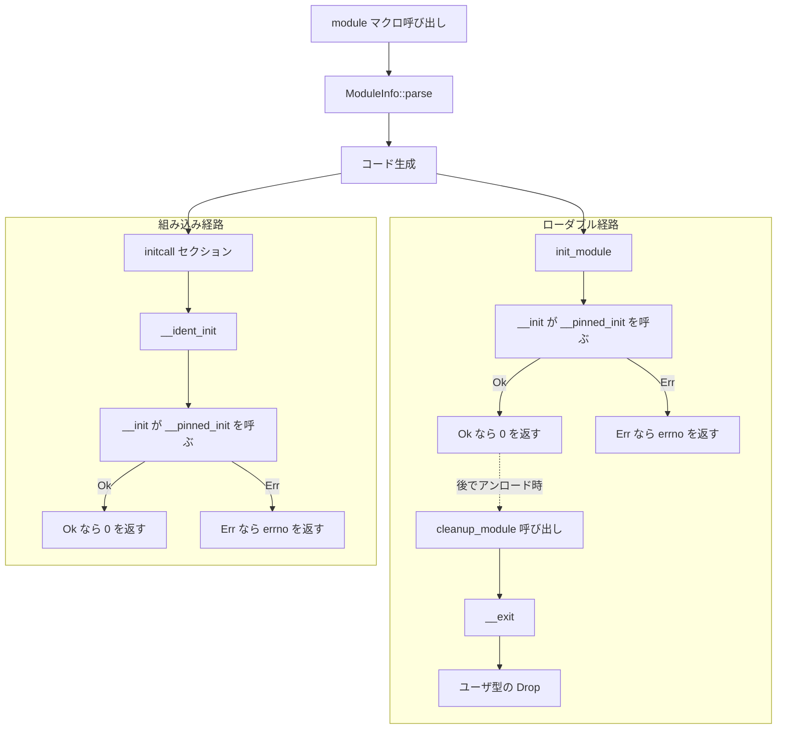

# 第4章 module! マクロとモジュール登録

> 本章で読むソース
>
> - [`rust/macros/lib.rs`](https://github.com/gregkh/linux/blob/v6.18.38/rust/macros/lib.rs)
> - [`rust/macros/module.rs`](https://github.com/gregkh/linux/blob/v6.18.38/rust/macros/module.rs)
> - [`rust/kernel/lib.rs`](https://github.com/gregkh/linux/blob/v6.18.38/rust/kernel/lib.rs)
> - [`rust/kernel/prelude.rs`](https://github.com/gregkh/linux/blob/v6.18.38/rust/kernel/prelude.rs)

## この章の狙い

`module!` マクロがコンパイル時にどの検証とコード生成を行い、Rust ドライバを C のモジュールローダへ接続するかを追う。
ローダブルモジュールと組み込みモジュールの分岐、および `Module` と `InPlaceModule` の関係を機構レベルで示す。

## 前提

[第1章](../part00-overview-build/01-overview-kernel-crate.md) で `kernel` クレートの位置づけを読んでいること。
C 側の `module_init` と `THIS_MODULE` の役割は [デバイスモデルとドライバ基盤](../../driver-model/README.md) を参照する。

## module! の宣言的シンタックス

`module!` は手続きマクロであり、`rust/macros/lib.rs` の `#[proc_macro]` 関数が `module::module` へ委譲する。

[`rust/macros/lib.rs` L101-L104](https://github.com/gregkh/linux/blob/v6.18.38/rust/macros/lib.rs#L101-L104)

```rust
#[proc_macro]
pub fn module(ts: TokenStream) -> TokenStream {
    module::module(ts)
}
```

ドライバ作者は `type`、`name`、`license` などのキーを並べて宣言する。
`prelude` から `module!` と `ThisModule` が re-export される。

[`rust/kernel/prelude.rs` L28](https://github.com/gregkh/linux/blob/v6.18.38/rust/kernel/prelude.rs#L28)

```rust
pub use macros::{export, kunit_tests, module, vtable};
```

[`rust/kernel/prelude.rs` L47](https://github.com/gregkh/linux/blob/v6.18.38/rust/kernel/prelude.rs#L47)

```rust
pub use super::{str::CStr, ThisModule};
```

使用例はマクロの doc コメントに載る。
`type` に `Module` トレイト実装型、`name` と `license` が必須である。

[`rust/macros/lib.rs` L40-L47](https://github.com/gregkh/linux/blob/v6.18.38/rust/macros/lib.rs#L40-L47)

```rust
/// module!{
///     type: MyModule,
///     name: "my_kernel_module",
///     authors: ["Rust for Linux Contributors"],
///     description: "My very own kernel module!",
///     license: "GPL",
///     alias: ["alternate_module_name"],
/// }
```

## ModuleInfo::parse によるコンパイル時検証

`module::module` はトークン列を `ModuleInfo::parse` で走査する。
必須キーは `type`、`name`、`license` である。
キーは `EXPECTED_KEYS` の順序どおりに並べなければならず、違反時は proc macro が `panic!` する。

[`rust/macros/module.rs` L107-L116](https://github.com/gregkh/linux/blob/v6.18.38/rust/macros/module.rs#L107-L116)

```rust
        const EXPECTED_KEYS: &[&str] = &[
            "type",
            "name",
            "authors",
            "description",
            "license",
            "alias",
            "firmware",
        ];
        const REQUIRED_KEYS: &[&str] = &["type", "name", "license"];
```

[`rust/macros/module.rs` L150-L165](https://github.com/gregkh/linux/blob/v6.18.38/rust/macros/module.rs#L150-L165)

```rust
        for key in REQUIRED_KEYS {
            if !seen_keys.iter().any(|e| e == key) {
                panic!("Missing required key \"{key}\".");
            }
        }

        let mut ordered_keys: Vec<&str> = Vec::new();
        for key in EXPECTED_KEYS {
            if seen_keys.iter().any(|e| e == key) {
                ordered_keys.push(key);
            }
        }

        if seen_keys != ordered_keys {
            panic!("Keys are not ordered as expected. Order them like: {ordered_keys:?}.");
        }
```

`name` と `license` は ASCII 文字列である必要がある。
この段階でメタデータの誤りはコンパイル時に検出される。

## 生成コードの中心構造

`module::module` は `format!` テンプレートで Rust ソースを文字列生成し、トークン列へ parse し直す。
生成物の要点は `THIS_MODULE`、`modinfo` セクション、二重ネストした `__module_init` モジュールである。

### THIS_MODULE の扱い

ローダブルモジュールでは C 側の `__this_module` を `extern "C"` で参照し、`ThisModule::from_ptr` で一度だけ包む。
組み込みモジュールでは `ptr::null_mut()` を包む。

[`rust/macros/module.rs` L211-L224](https://github.com/gregkh/linux/blob/v6.18.38/rust/macros/module.rs#L211-L224)

```rust
            // SAFETY: `__this_module` is constructed by the kernel at load time and will not be
            // freed until the module is unloaded.
            #[cfg(MODULE)]
            static THIS_MODULE: ::kernel::ThisModule = unsafe {{
                extern \"C\" {{
                    static __this_module: ::kernel::types::Opaque<::kernel::bindings::module>;
                }}

                ::kernel::ThisModule::from_ptr(__this_module.get())
            }};
            #[cfg(not(MODULE))]
            static THIS_MODULE: ::kernel::ThisModule = unsafe {{
                ::kernel::ThisModule::from_ptr(::core::ptr::null_mut())
            }};
```

`ThisModule` は「常に有効な module 参照」の safe ラッパーではない。
組み込み時は null を保持し、`as_ptr` は safe だが非 null 性や参照有効性の保証は利用側に残る。

[`rust/kernel/lib.rs` L198-L218](https://github.com/gregkh/linux/blob/v6.18.38/rust/kernel/lib.rs#L198-L218)

```rust
pub struct ThisModule(*mut bindings::module);

// SAFETY: `THIS_MODULE` may be used from all threads within a module.
unsafe impl Sync for ThisModule {}

impl ThisModule {
    /// Creates a [`ThisModule`] given the `THIS_MODULE` pointer.
    ///
    /// # Safety
    ///
    /// The pointer must be equal to the right `THIS_MODULE`.
    pub const unsafe fn from_ptr(ptr: *mut bindings::module) -> ThisModule {
        ThisModule(ptr)
    }

    /// Access the raw pointer for this module.
    ///
    /// It is up to the user to use it correctly.
    pub const fn as_ptr(&self) -> *mut bindings::module {
        self.0
    }
}
```

### 二重ネストモジュールと静的保存領域

生成コードは `mod __module_init { mod __module_init { ... } }` と二重にネストする。
外側から内部の `init_module` や `__init` へ直接到達できないようにするためである。

[`rust/macros/module.rs` L234-L250](https://github.com/gregkh/linux/blob/v6.18.38/rust/macros/module.rs#L234-L250)

```rust
            // Double nested modules, since then nobody can access the public items inside.
            mod __module_init {{
                mod __module_init {{
                    use super::super::{type_};
                    use pin_init::PinInit;

                    // ... (中略) ...

                    static mut __MOD: ::core::mem::MaybeUninit<{type_}> =
                        ::core::mem::MaybeUninit::uninit();
```

モジュール実体は `static mut __MOD: MaybeUninit<T>` に一度だけ書き込まれる。
`__init` と `__exit` だけがこの領域にアクセスし、各一回限りという契約に基づく無同期アクセスが SAFETY コメントの根拠となる。

[`rust/macros/module.rs` L340-L365](https://github.com/gregkh/linux/blob/v6.18.38/rust/macros/module.rs#L340-L365)

```rust
                    unsafe fn __init() -> ::kernel::ffi::c_int {{
                        let initer =
                            <{type_} as ::kernel::InPlaceModule>::init(&super::super::THIS_MODULE);
                        // SAFETY: No data race, since `__MOD` can only be accessed by this module
                        // and there only `__init` and `__exit` access it. These functions are only
                        // called once and `__exit` cannot be called before or during `__init`.
                        match unsafe {{ initer.__pinned_init(__MOD.as_mut_ptr()) }} {{
                            Ok(m) => 0,
                            Err(e) => e.to_errno(),
                        }}
                    }}

                    // ... (中略) ...

                    unsafe fn __exit() {{
                        // SAFETY: No data race, since `__MOD` can only be accessed by this module
                        // and there only `__init` and `__exit` access it. These functions are only
                        // called once and `__init` was already called.
                        unsafe {{
                            // Invokes `drop()` on `__MOD`, which should be used for cleanup.
                            __MOD.assume_init_drop();
                        }}
                    }}
```

## Module と InPlaceModule の関係

`Module::init` は `Result<Self>` を返す通常の初期化である。
`module!` 側は `InPlaceModule::init` が返す `PinInit` を `__pinned_init` で静的領域へ書き込む。

[`rust/kernel/lib.rs` L156-L187](https://github.com/gregkh/linux/blob/v6.18.38/rust/kernel/lib.rs#L156-L187)

```rust
pub trait Module: Sized + Sync + Send {
    /// Called at module initialization time.
    ///
    /// Use this method to perform whatever setup or registration your module
    /// should do.
    ///
    /// Equivalent to the `module_init` macro in the C API.
    fn init(module: &'static ThisModule) -> error::Result<Self>;
}

/// A module that is pinned and initialised in-place.
pub trait InPlaceModule: Sync + Send {
    /// Creates an initialiser for the module.
    ///
    /// It is called when the module is loaded.
    fn init(module: &'static ThisModule) -> impl pin_init::PinInit<Self, error::Error>;
}

impl<T: Module> InPlaceModule for T {
    fn init(module: &'static ThisModule) -> impl pin_init::PinInit<Self, error::Error> {
        let initer = move |slot: *mut Self| {
            let m = <Self as Module>::init(module)?;

            // SAFETY: `slot` is valid for write per the contract with `pin_init_from_closure`.
            unsafe { slot.write(m) };
            Ok(())
        };

        // SAFETY: On success, `initer` always fully initialises an instance of `Self`.
        unsafe { pin_init::pin_init_from_closure(initer) }
    }
}
```

`Module` を実装すればブランケット実装により `InPlaceModule` も自動的に得られる。
非 pin 型でも `pin_init_from_closure` で `PinInit` へ変換される。

## ローダブルと組み込みの分岐

`#[cfg(MODULE)]` でローダブル向け `init_module` と `cleanup_module` が生成される。
組み込み向けは `.initcall6.init` セクションへ `__{ident}_init` が登録される。

[`rust/macros/module.rs` L257-L266](https://github.com/gregkh/linux/blob/v6.18.38/rust/macros/module.rs#L257-L266)

```rust
                    #[cfg(MODULE)]
                    #[doc(hidden)]
                    #[no_mangle]
                    #[link_section = \".init.text\"]
                    pub unsafe extern \"C\" fn init_module() -> ::kernel::ffi::c_int {{
                        // SAFETY: This function is inaccessible to the outside due to the double
                        // module wrapping it. It is called exactly once by the C side via its
                        // unique name.
                        unsafe {{ __init() }}
                    }}
```

[`rust/macros/module.rs` L274-L286](https://github.com/gregkh/linux/blob/v6.18.38/rust/macros/module.rs#L274-L286)

```rust
                    #[cfg(MODULE)]
                    #[doc(hidden)]
                    #[no_mangle]
                    #[link_section = \".exit.text\"]
                    pub extern \"C\" fn cleanup_module() {{
                        // SAFETY:
                        // - This function is inaccessible to the outside due to the double
                        //   module wrapping it. It is called exactly once by the C side via its
                        //   unique name,
                        // - furthermore it is only called after `init_module` has returned `0`
                        //   (which delegates to `__init`).
                        unsafe {{ __exit() }}
                    }}
```

[`rust/macros/module.rs` L296-L322](https://github.com/gregkh/linux/blob/v6.18.38/rust/macros/module.rs#L296-L322)

```rust
                    #[cfg(not(MODULE))]
                    #[cfg(not(CONFIG_HAVE_ARCH_PREL32_RELOCATIONS))]
                    #[doc(hidden)]
                    #[link_section = \"{initcall_section}\"]
                    #[used(compiler)]
                    pub static __{ident}_initcall: extern \"C\" fn() ->
                        ::kernel::ffi::c_int = __{ident}_init;

                    // ... (中略) ...

                    #[cfg(not(MODULE))]
                    #[doc(hidden)]
                    #[no_mangle]
                    pub extern \"C\" fn __{ident}_init() -> ::kernel::ffi::c_int {{
                        // SAFETY: This function is inaccessible to the outside due to the double
                        // module wrapping it. It is called exactly once by the C side via its
                        // placement above in the initcall section.
                        unsafe {{ __init() }}
                    }}
```

`__{ident}_exit` は生成されるが、initcall や exitcall への登録コードは存在しない。
組み込みモジュールは通常アンロードされないため、`__exit` や `Drop` へ進む実行経路は用意されない。

`__init` は `__pinned_init` が `Ok(m)` を返した場合だけ初期化成功とみなして `0` を返し、`Err(e)` の場合は `e.to_errno()` を返す。
`Err` を返す前に initializer 自身が `slot` を後片付け済みであるという契約は `PinInit` 側にあり、詳細は第7章で扱う。
`cleanup_module` は `init_module` が `0` を返した後にのみ C 側から呼ばれ、`__exit` を経由して `assume_init_drop` に到達する。
`init_module` が errno を返した場合、`cleanup_module` は呼ばれず `__exit` も `Drop` も実行されない。
組み込み経路も同様に、`__ident_init` は `__init` の `Ok`/`Err` をそのまま `0`/errno として返すのみで、`Ok` と `Err` のどちらでも exit 側の登録コード自体が存在しない。

### module! 展開から C ローダへの処理フロー



## modinfo の生成

`ModInfoBuilder` は `.modinfo` リンクセクションへ `author=` や `license=` 文字列を静的配列として埋め込む。
組み込みとローダブルでプレフィックスが異なる。

[`rust/macros/module.rs` L40-L52](https://github.com/gregkh/linux/blob/v6.18.38/rust/macros/module.rs#L40-L52)

```rust
    fn emit_base(&mut self, field: &str, content: &str, builtin: bool) {
        let string = if builtin {
            // Built-in modules prefix their modinfo strings by `module.`.
            format!(
                "{module}.{field}={content}\0",
                module = self.module,
                field = field,
                content = content
            )
        } else {
            // Loadable modules' modinfo strings go as-is.
            format!("{field}={content}\0")
        };
```

## 7.1.3 との対比

v6.18.38 にはモジュールパラメータの Rust 抽象がない。
v7.1.3 で `rust/kernel/module_param.rs` が新規追加され、`module!` に `params` フィールドが加わった。

比較版の `ModuleParam` トレイトと整数型向け実装。

[`rust/kernel/module_param.rs` L30-L33](https://github.com/gregkh/linux/blob/v7.1.3/rust/kernel/module_param.rs#L30-L33)

```rust
pub trait ModuleParam: Sized + Copy {
    /// Parse a parameter argument into the parameter value.
    fn try_from_param_arg(arg: &BStr) -> Result<Self>;
}
```

[`rust/kernel/module_param.rs` L98-L107](https://github.com/gregkh/linux/blob/v7.1.3/rust/kernel/module_param.rs#L98-L107)

```rust
impl_int_module_param!(i8);
impl_int_module_param!(u8);
impl_int_module_param!(i16);
impl_int_module_param!(u16);
impl_int_module_param!(i32);
impl_int_module_param!(u32);
impl_int_module_param!(i64);
impl_int_module_param!(u64);
impl_int_module_param!(isize);
impl_int_module_param!(usize);
```

`set_param` は C 側 `kernel_param_ops.set` として呼ばれ、一度きりの設定である。
二回目の `populate` は `EEXIST` を返す。

[`rust/kernel/module_param.rs` L53-L55](https://github.com/gregkh/linux/blob/v7.1.3/rust/kernel/module_param.rs#L53-L55)

```rust
/// - Currently, we only support read-only parameters that are not readable from `sysfs`. Thus, this
///   function is only called at kernel initialization time, or at module load time, and we have
///   exclusive access to the parameter for the duration of the function.
```

生成される `kernel_param_ops` は `set` のみ有効で `get` と `free` は `None` である。
`module!` が生成する `kernel_param` の `perm` は 0 で sysfs には現れない。

比較版の `module!` doc 例に `params` フィールドがある。

[`rust/macros/lib.rs` L75-L80](https://github.com/gregkh/linux/blob/v7.1.3/rust/macros/lib.rs#L75-L80)

```rust
///     params: {
///         my_parameter: i64 {
///             default: 1,
///             description: "This parameter has a default of 1",
///         },
///     },
```

v7.1.3 の `module.rs` は `proc-macro2`/`syn`/`quote` ベースの構造化生成へ書き換わっている。

[`rust/macros/module.rs` L3-L12](https://github.com/gregkh/linux/blob/v7.1.3/rust/macros/module.rs#L3-L12)

```rust
use std::ffi::CString;

use proc_macro2::{
    Literal,
    TokenStream, //
};
use quote::{
    format_ident,
    quote, //
};
```

6.18.38 時点ではモジュールパラメータの Rust 抽象がなく、7.1.3 で `module_param.rs` と `module!` の `params` フィールドが揃って初めて宣言的なパラメータ定義ができるようになった。
現状は整数10型の read-only パラメータに限定され、モジュールパラメータ一般の完全な抽象化ではない。

## まとめ

`module!` は `ModuleInfo::parse` でキー順序と必須項目を検証し、C ローダ向けの初期化と終了シンボルと modinfo を生成する。
`Module` 実装はブランケット実装で `InPlaceModule` に接続され、単一の `__MOD` 静的領域へ pin 初期化される。
ローダブルは `cleanup_module` 経由で `Drop` が起動するが、組み込みには終了登録がない。
v7.1.3 では `params` フィールドと `module_param.rs` が追加された。

## 関連する章

- [第1章 Rust for Linux の全体像と kernel クレート](../part00-overview-build/01-overview-kernel-crate.md)
- [第5章 エラー処理と Result と errno](05-error-result.md)
- [第7章 pin-init によるピン留め初期化](07-pin-init.md)
