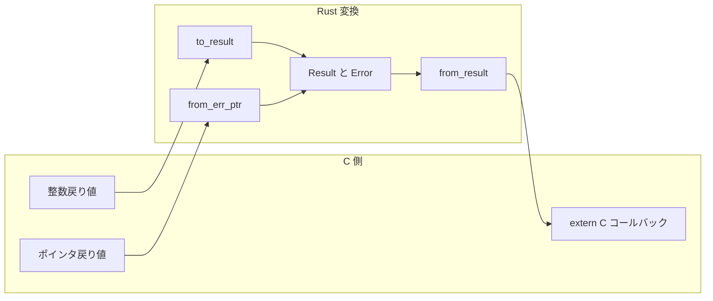

# 第5章 エラー処理と Result と errno

> 本章で読むソース
>
> - [`rust/kernel/error.rs`](https://github.com/gregkh/linux/blob/v6.18.38/rust/kernel/error.rs)

## この章の狙い

C カーネルの「負の errno を返す」規約と Rust の `Result<T, Error>` の対応を、`Error(NonZeroI32)` newtype を中心に追う。
`to_result`、`from_err_ptr`、`from_result` が担う異なる FFI 境界パターンと、値の保持や畳み込みの非対称性を示す。

## 前提

[第4章](04-module-macro.md) で `Module::init` が `error::Result<Self>` を返すことを読んでいること。
C 側の errno 定数は `include/linux/errno.h` 系ヘッダに定義される。

## errno 定数と declare_err マクロ

`error::code` モジュールは C ヘッダと対応する errno 定数を Rust 側へ持ち込む。
`declare_err!` マクロは各定数を `const` コンテキストで構築する。

[`rust/kernel/error.rs` L3-L7](https://github.com/gregkh/linux/blob/v6.18.38/rust/kernel/error.rs#L3-L7)

```rust
//! Kernel errors.
//!
//! C header: [`include/uapi/asm-generic/errno-base.h`](srctree/include/uapi/asm-generic/errno-base.h)\
//! C header: [`include/uapi/asm-generic/errno.h`](srctree/include/uapi/asm-generic/errno.h)\
//! C header: [`include/linux/errno.h`](srctree/include/linux/errno.h)
```

[`rust/kernel/error.rs` L22-L33](https://github.com/gregkh/linux/blob/v6.18.38/rust/kernel/error.rs#L22-L33)

```rust
    macro_rules! declare_err {
        ($err:tt $(,)? $($doc:expr),+) => {
            $(
            #[doc = $doc]
            )*
            pub const $err: super::Error =
                match super::Error::try_from_errno(-(crate::bindings::$err as i32)) {
                    Some(err) => err,
                    None => panic!("Invalid errno in `declare_err!`"),
                };
        };
    }
```

v6.18.38 では `EPERM` から `ENOGRACE` まで55個の定数が宣言される。
無効な errno を `declare_err!` に渡すとコンパイル時に `panic!` し、実行時ではなくビルド時に不正定義を弾く。

[`rust/kernel/error.rs` L35-L57](https://github.com/gregkh/linux/blob/v6.18.38/rust/kernel/error.rs#L35-L57)

```rust
    declare_err!(EPERM, "Operation not permitted.");
    declare_err!(ENOENT, "No such file or directory.");
    declare_err!(ESRCH, "No such process.");
    declare_err!(EINTR, "Interrupted system call.");
    declare_err!(EIO, "I/O error.");
    declare_err!(ENXIO, "No such device or address.");
    declare_err!(E2BIG, "Argument list too long.");
    declare_err!(ENOEXEC, "Exec format error.");
    declare_err!(EBADF, "Bad file number.");
    declare_err!(ECHILD, "No child processes.");
    declare_err!(EAGAIN, "Try again.");
    declare_err!(ENOMEM, "Out of memory.");
    declare_err!(EACCES, "Permission denied.");
    declare_err!(EFAULT, "Bad address.");
    declare_err!(ENOTBLK, "Block device required.");
    declare_err!(EBUSY, "Device or resource busy.");
    declare_err!(EEXIST, "File exists.");
    declare_err!(EXDEV, "Cross-device link.");
    declare_err!(ENODEV, "No such device.");
    declare_err!(ENOTDIR, "Not a directory.");
    declare_err!(EISDIR, "Is a directory.");
    declare_err!(EINVAL, "Invalid argument.");
```

## Error と NonZeroI32 の不変条件

`Error` は `NonZeroI32` を内包する newtype である。
値は有効な errno、すなわち `>= -MAX_ERRNO && < 0` の範囲に収まる。

[`rust/kernel/error.rs` L92-L101](https://github.com/gregkh/linux/blob/v6.18.38/rust/kernel/error.rs#L92-L101)

```rust
/// Generic integer kernel error.
///
/// The kernel defines a set of integer generic error codes based on C and
/// POSIX ones. These codes may have a more specific meaning in some contexts.
///
/// # Invariants
///
/// The value is a valid `errno` (i.e. `>= -MAX_ERRNO && < 0`).
#[derive(Clone, Copy, PartialEq, Eq)]
pub struct Error(NonZeroI32);
```

`NonZeroI32` は 0 を値として取らない。
コンパイラは 0 を `Option` の niche に使えるため、`Option<Error>` は `Error` と同じサイズを保てる。
x86-64 では `Error` も `Option<Error>` も 4 バイト相当である。

## 公開境界と内部階層

利用者が触れる公開 API は `from_errno` である。
範囲外の errno は `pr_warn!` を出して `EINVAL` にフォールバックし、panic させない。

[`rust/kernel/error.rs` L123-L134](https://github.com/gregkh/linux/blob/v6.18.38/rust/kernel/error.rs#L123-L134)

```rust
    pub fn from_errno(errno: crate::ffi::c_int) -> Error {
        if let Some(error) = Self::try_from_errno(errno) {
            error
        } else {
            // TODO: Make it a `WARN_ONCE` once available.
            crate::pr_warn!(
                "attempted to create `Error` with out of range `errno`: {}\n",
                errno
            );
            code::EINVAL
        }
    }
```

`try_from_errno` は非 pub の内部関数であり、範囲外なら `None` を返す。
合格時のみ `unsafe` な `from_errno_unchecked` で不変条件を確立する。

[`rust/kernel/error.rs` L139-L158](https://github.com/gregkh/linux/blob/v6.18.38/rust/kernel/error.rs#L139-L158)

```rust
    const fn try_from_errno(errno: crate::ffi::c_int) -> Option<Error> {
        if errno < -(bindings::MAX_ERRNO as i32) || errno >= 0 {
            return None;
        }

        // SAFETY: `errno` is checked above to be in a valid range.
        Some(unsafe { Error::from_errno_unchecked(errno) })
    }

    /// Creates an [`Error`] from a kernel error code.
    ///
    /// # Safety
    ///
    /// `errno` must be within error code range (i.e. `>= -MAX_ERRNO && < 0`).
    const unsafe fn from_errno_unchecked(errno: crate::ffi::c_int) -> Error {
        // INVARIANT: The contract ensures the type invariant
        // will hold.
        // SAFETY: The caller guarantees `errno` is non-zero.
        Error(unsafe { NonZeroI32::new_unchecked(errno) })
    }
```

これは利用者が選べる三段 API ではなく、公開境界の内側で型不変条件を組み立てる構造である。

## C 整数戻り値とエラーポインタ

### to_result

C 関数が `c_int` を返すとき、負値なら `Err`、非負なら `Ok(())` に畳む。
成功時の具体的な戻り値は保持しない。

[`rust/kernel/error.rs` L432-L437](https://github.com/gregkh/linux/blob/v6.18.38/rust/kernel/error.rs#L432-L437)

```rust
pub fn to_result(err: crate::ffi::c_int) -> Result {
    if err < 0 {
        Err(Error::from_errno(err))
    } else {
        Ok(())
    }
}
```

### from_err_ptr

ポインタ戻り値がエラーポインタかどうかを `IS_ERR` で判定し、`PTR_ERR` で errno を取り出す。
`ERR_PTR` 規約の逆方向である。

[`rust/kernel/error.rs` L461-L481](https://github.com/gregkh/linux/blob/v6.18.38/rust/kernel/error.rs#L461-L481)

```rust
pub fn from_err_ptr<T>(ptr: *mut T) -> Result<*mut T> {
    // CAST: Casting a pointer to `*const crate::ffi::c_void` is always valid.
    let const_ptr: *const crate::ffi::c_void = ptr.cast();
    // SAFETY: The FFI function does not deref the pointer.
    if unsafe { bindings::IS_ERR(const_ptr) } {
        // SAFETY: The FFI function does not deref the pointer.
        let err = unsafe { bindings::PTR_ERR(const_ptr) };

        #[allow(clippy::unnecessary_cast)]
        // ... (中略) ...
        return Err(unsafe { Error::from_errno_unchecked(err as crate::ffi::c_int) });
    }
    Ok(ptr)
}
```

`Error::to_ptr` は Rust 側からエラーをポインタへ埋め込む方向である。

[`rust/kernel/error.rs` L172-L175](https://github.com/gregkh/linux/blob/v6.18.38/rust/kernel/error.rs#L172-L175)

```rust
    pub fn to_ptr<T>(self) -> *mut T {
        // SAFETY: `self.0` is a valid error due to its invariant.
        unsafe { bindings::ERR_PTR(self.0.get() as crate::ffi::c_long).cast() }
    }
```

### from_result

`extern "C"` コールバックから Rust の `Result` を返すとき、`Err` だけを `i16` 経由で C 整数へ変換する。
`Ok(v)` の `v` はそのまま返し、成功値が非負かの検査はしない。

[`rust/kernel/error.rs` L507-L518](https://github.com/gregkh/linux/blob/v6.18.38/rust/kernel/error.rs#L507-L518)

```rust
pub fn from_result<T, F>(f: F) -> T
where
    T: From<i16>,
    F: FnOnce() -> Result<T>,
{
    match f() {
        Ok(v) => v,
        // NO-OVERFLOW: negative `errno`s are no smaller than `-bindings::MAX_ERRNO`,
        // `-bindings::MAX_ERRNO` fits in an `i16` as per invariant above,
        // therefore a negative `errno` always fits in an `i16` and will not overflow.
        Err(e) => T::from(e.to_errno() as i16),
    }
}
```

`T: From<i16>` は generic 契約であり、`c_int` を返す `extern "C"` コールバックが典型例である。

### FFI 境界でのエラー変換フロー



往路では `to_result` が非負整数を値なしの `Ok` に畳み、復路では `from_result` が `Ok` の値をそのまま返す。
完全な相互逆変換ではない。

## Result 型と ? 演算子

`kernel::error::Result` は `core::result::Result<T, Error>` の別名である。

[`rust/kernel/error.rs` L393](https://github.com/gregkh/linux/blob/v6.18.38/rust/kernel/error.rs#L393)

```rust
pub type Result<T = (), E = Error> = core::result::Result<T, E>;
```

`AllocError` や `Utf8Error` など複数のエラー型は `From` 実装で `Error` に収束する。
`?` 演算子一発で伝播できる。

[`rust/kernel/error.rs` L216-L244](https://github.com/gregkh/linux/blob/v6.18.38/rust/kernel/error.rs#L216-L244)

```rust
impl From<AllocError> for Error {
    fn from(_: AllocError) -> Error {
        code::ENOMEM
    }
}

impl From<TryFromIntError> for Error {
    fn from(_: TryFromIntError) -> Error {
        code::EINVAL
    }
}

impl From<Utf8Error> for Error {
    fn from(_: Utf8Error) -> Error {
        code::EINVAL
    }
}

impl From<LayoutError> for Error {
    fn from(_: LayoutError) -> Error {
        code::ENOMEM
    }
}

impl From<fmt::Error> for Error {
    fn from(_: fmt::Error) -> Error {
        code::EINVAL
    }
}
```

`Error::name` は `bindings::errname` で人間可読名を得、`Debug` 表示に使われる。

[`rust/kernel/error.rs` L179-L188](https://github.com/gregkh/linux/blob/v6.18.38/rust/kernel/error.rs#L179-L188)

```rust
    pub fn name(&self) -> Option<&'static CStr> {
        // SAFETY: Just an FFI call, there are no extra safety requirements.
        let ptr = unsafe { bindings::errname(-self.0.get()) };
        if ptr.is_null() {
            None
        } else {
            // SAFETY: The string returned by `errname` is static and `NUL`-terminated.
            Some(unsafe { CStr::from_char_ptr(ptr) })
        }
    }
```

`VTABLE_DEFAULT_ERROR` は `#[vtable]` の未実装メソッド呼び出し時のビルドエラーメッセージである（第4章参照）。

[`rust/kernel/error.rs` L522-L523](https://github.com/gregkh/linux/blob/v6.18.38/rust/kernel/error.rs#L522-L523)

```rust
pub const VTABLE_DEFAULT_ERROR: &str =
    "This function must not be called, see the #[vtable] documentation.";
```

## 7.1.3 との対比

`error.rs` は v6.18.38 で523行、v7.1.3 で563行である。
errno の意味論や `Error(NonZeroI32)` モデル自体は変わっていない。

`code` モジュールに `EMSGSIZE` が追加された。

比較版 v7.1.3。

[`rust/kernel/error.rs` L70](https://github.com/gregkh/linux/blob/v7.1.3/rust/kernel/error.rs#L70)

```rust
    declare_err!(EMSGSIZE, "Message too long.");
```

6 個の `From` 実装に `#[inline]` が付与された。
`?` 経由のエラー変換がインライン化されやすくなる。

比較版 v7.1.3。

[`rust/kernel/error.rs` L219-L223](https://github.com/gregkh/linux/blob/v7.1.3/rust/kernel/error.rs#L219-L223)

```rust
impl From<AllocError> for Error {
    #[inline]
    fn from(_: AllocError) -> Error {
        code::ENOMEM
    }
}
```

`Error::name` では `CStrExt` トレイト経由の呼び出しに変わった。

比較版 v7.1.3。

[`rust/kernel/error.rs` L186-L189](https://github.com/gregkh/linux/blob/v7.1.3/rust/kernel/error.rs#L186-L189)

```rust
            use crate::str::CStrExt as _;

            // SAFETY: The string returned by `errname` is static and `NUL`-terminated.
            Some(unsafe { CStr::from_char_ptr(ptr) })
```

`from_err_ptr` の doc に `NULL` ポインタはエラーとみなさない旨が追記された。
`IS_ERR`/`PTR_ERR` を使う判定ロジック自体は不変である。

比較版 v7.1.3。

[`rust/kernel/error.rs` L456-L457](https://github.com/gregkh/linux/blob/v7.1.3/rust/kernel/error.rs#L456-L457)

```rust
/// Note that a `NULL` pointer is not considered an error pointer, and is returned
/// as-is, wrapped in [`Ok`].
```

6.18.38 から 7.1.3 への変更は、`EMSGSIZE` 追加、6 個の `From` 実装への `#[inline]` 付与、`CStrExt` 利用、`from_err_ptr` の NULL 許容仕様の文書化という漸進的な拡充にとどまる。

## まとめ

`Error(NonZeroI32)` が C の errno 規約と Rust の型安全性を仲立ちする。
公開境界は `from_errno` であり、内部の `try_from_errno` と `from_errno_unchecked` が不変条件を構築する。
`to_result`、`from_err_ptr`、`from_result` は整数戻り値、ポインタ戻り値、`extern "C"` コールバックという異なる FFI パターンに対応する。
v7.1.3 では errno モデルは維持され、周辺の最適化と文書化が進んだ。

## 関連する章

- [第4章 module! マクロとモジュール登録](04-module-macro.md)
- [第6章 型の基盤 Opaque と ARef と ForeignOwnable](06-types-opaque-aref.md)
- [第8章 アロケータと GFP フラグ](../part02-memory-ownership/08-allocator-gfp.md)
