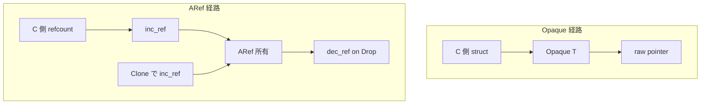

# 第6章 型の基盤 Opaque と ARef と ForeignOwnable

> 本章で読むソース
>
> - [`rust/kernel/types.rs`](https://github.com/gregkh/linux/blob/v6.18.38/rust/kernel/types.rs)
> - [`rust/kernel/sync/aref.rs`](https://github.com/gregkh/linux/blob/v6.18.38/rust/kernel/sync/aref.rs)
> - [`rust/kernel/device.rs`](https://github.com/gregkh/linux/blob/v6.18.38/rust/kernel/device.rs)
> - [`rust/kernel/alloc/kbox.rs`](https://github.com/gregkh/linux/blob/v6.18.38/rust/kernel/alloc/kbox.rs)
> - [`rust/kernel/sync/arc.rs`](https://github.com/gregkh/linux/blob/v6.18.38/rust/kernel/sync/arc.rs)

## この章の狙い

C 側が管理する値を Rust の型規則から意図的に外す `Opaque<T>`、C 側の既存 refcount を橋渡しする `ARef<T>`、C オブジェクトへ所有権を渡す `ForeignOwnable` の三機構を追う。
`types.rs` と `sync/aref.rs` のモジュール境界も含め、定義の所在を正確に示す。

## 前提

[第5章](05-error-result.md) で `Result` と errno の対応を読んでいること。
[第4章](04-module-macro.md) で `Module` 初期化の流れを把握していること。

## types.rs と aref.rs のモジュール境界

`kernel::types` は `ARef` と `AlwaysRefCounted` を re-export するだけで、定義本体は `sync/aref.rs` にある。
`types.rs` を開いて `ARef` の実装を探しても見つからないのは、この構造による。

[`rust/kernel/types.rs` L14](https://github.com/gregkh/linux/blob/v6.18.38/rust/kernel/types.rs#L14)

```rust
pub use crate::sync::aref::{ARef, AlwaysRefCounted};
```

実務コードは定義元から直接 import する慣習がある。
`device.rs` は `sync::aref::ARef` を import し、`types::ARef` 経由ではない。

[`rust/kernel/device.rs` L7-L10](https://github.com/gregkh/linux/blob/v6.18.38/rust/kernel/device.rs#L7-L10)

```rust
use crate::{
    bindings, fmt,
    sync::aref::ARef,
    types::{ForeignOwnable, Opaque},
```

re-export は `kernel::types::ARef` という別の公開 import path を提供する利便または互換用のものであり、定義の所在とは別である。

## Opaque の三要素

`Opaque<T>` は C 側の FFI オブジェクトを包み、Rust の通常の前提を捨てる。

[`rust/kernel/types.rs` L269-L281](https://github.com/gregkh/linux/blob/v6.18.38/rust/kernel/types.rs#L269-L281)

```rust
/// [`Opaque<T>`] is meant to be used with FFI objects that are never interpreted by Rust code.
///
/// It is used to wrap structs from the C side, like for example `Opaque<bindings::mutex>`.
/// It gets rid of all the usual assumptions that Rust has for a value:
///
/// * The value is allowed to be uninitialized (for example have invalid bit patterns: `3` for a
///   [`bool`]).
/// * The value is allowed to be mutated, when a `&Opaque<T>` exists on the Rust side.
/// * No uniqueness for mutable references: it is fine to have multiple `&mut Opaque<T>` point to
///   the same value.
/// * The value is not allowed to be shared with other threads (i.e. it is `!Sync`).
```

内部表現は三要素からなる。

[`rust/kernel/types.rs` L323-L327](https://github.com/gregkh/linux/blob/v6.18.38/rust/kernel/types.rs#L323-L327)

```rust
#[repr(transparent)]
pub struct Opaque<T> {
    value: UnsafeCell<MaybeUninit<T>>,
    _pin: PhantomPinned,
}
```

`UnsafeCell` は `&Opaque<T>` が存在する間も内部値の変更を許す内部可変性を与える。
`MaybeUninit` は未初期化状態と任意ビットパターンを許す。
`PhantomPinned` は型に `!Unpin` を与えるが、配置固定そのものを強制するわけではない。
`PinInit` 等で pin された後に移動してはいけないという契約が成立する（第7章）。

複数の `&mut Opaque<T>` が同じ値を指してよい性質は `PhantomPinned` の効果ではない。
raw pointer と unsafe 側の契約で扱われる。

`Opaque<T>` は任意ビットパターンを許すため、`Zeroable` を無条件に実装できる。

[`rust/kernel/types.rs` L329-L330](https://github.com/gregkh/linux/blob/v6.18.38/rust/kernel/types.rs#L329-L330)

```rust
// SAFETY: `Opaque<T>` allows the inner value to be any bit pattern, including all zeros.
unsafe impl<T> Zeroable for Opaque<T> {}
```

内部が `MaybeUninit` であるため、全ゼロビット列も有効な表現として扱える。
これにより `zeroed` や `init_zeroed` 経路で追加の値検査なしにゼロ初期化できる。

### Opaque 経由の C ポインタ接続

[`rust/kernel/types.rs` L394-L410](https://github.com/gregkh/linux/blob/v6.18.38/rust/kernel/types.rs#L394-L410)

```rust
    /// Returns a raw pointer to the opaque data.
    pub const fn get(&self) -> *mut T {
        UnsafeCell::get(&self.value).cast::<T>()
    }

    /// Gets the value behind `this`.
    ///
    /// This function is useful to get access to the value without creating intermediate
    /// references.
    pub const fn cast_into(this: *const Self) -> *mut T {
        UnsafeCell::raw_get(this.cast::<UnsafeCell<MaybeUninit<T>>>()).cast::<T>()
    }

    /// The opposite operation of [`Opaque::cast_into`].
    pub const fn cast_from(this: *const T) -> *const Self {
        this.cast()
    }
```

`get` と `cast_into` は unsafe な C API 呼び出しへの入口である。
`Wrapper<T>` 実装により `Opaque<T>` は `pin_init` のピン留め初期化とも接続する（第7章）。

[`rust/kernel/types.rs` L413-L423](https://github.com/gregkh/linux/blob/v6.18.38/rust/kernel/types.rs#L413-L423)

```rust
impl<T> Wrapper<T> for Opaque<T> {
    /// Create an opaque pin-initializer from the given pin-initializer.
    fn pin_init<E>(slot: impl PinInit<T, E>) -> impl PinInit<Self, E> {
        Self::try_ffi_init(|ptr: *mut T| {
            // SAFETY:
            //   - `ptr` is a valid pointer to uninitialized memory,
            //   - `slot` is not accessed on error,
            //   - `slot` is pinned in memory.
            unsafe { PinInit::<T, E>::__pinned_init(slot, ptr) }
        })
    }
}
```

## AlwaysRefCounted と ARef

`sync/aref.rs` のモジュールドキュメントが設計意図を述べる。
C 型はすでに内部 refcount を持つことが多く、Rust 側で `Arc` を重ねるのではなく既存の get/put パターンを使う。

[`rust/kernel/sync/aref.rs` L3-L16](https://github.com/gregkh/linux/blob/v6.18.38/rust/kernel/sync/aref.rs#L3-L16)

```rust
//! Internal reference counting support.
//!
//! Many C types already have their own reference counting mechanism (e.g. by storing a
//! `refcount_t`). This module provides support for directly using their internal reference count
//! from Rust; instead of making users have to use an additional Rust-reference count in the form of
//! [`Arc`].
//!
//! The smart pointer [`ARef<T>`] acts similarly to [`Arc<T>`] in that it holds a refcount on the
//! underlying object, but this refcount is internal to the object. It essentially is a Rust
//! implementation of the `get_` and `put_` pattern used in C for reference counting.
//!
//! To make use of [`ARef<MyType>`], `MyType` needs to implement [`AlwaysRefCounted`]. It is a trait
//! for accessing the internal reference count of an object of the `MyType` type.
```

`Arc<T>` は Rust 側で新たに refcount ブロックを確保するのに対し、`ARef<T>` はオブジェクト内蔵の refcount を操作する。

[`rust/kernel/sync/aref.rs` L40-L56](https://github.com/gregkh/linux/blob/v6.18.38/rust/kernel/sync/aref.rs#L40-L56)

```rust
pub unsafe trait AlwaysRefCounted {
    /// Increments the reference count on the object.
    fn inc_ref(&self);

    /// Decrements the reference count on the object.
    ///
    /// Frees the object when the count reaches zero.
    ///
    /// # Safety
    ///
    /// Callers must ensure that there was a previous matching increment to the reference count,
    /// and that the object is no longer used after its reference count is decremented (as it may
    /// result in the object being freed), unless the caller owns another increment on the refcount
    /// (e.g., it calls [`AlwaysRefCounted::inc_ref`] twice, then calls
    /// [`AlwaysRefCounted::dec_ref`] once).
    unsafe fn dec_ref(obj: NonNull<Self>);
}
```

`dec_ref` は `unsafe fn` であるが、`Drop` からしか呼べることを型で強制するわけではない。
`ARef` の safe API 面が `Clone`、`From<&T>`、`Drop` に refcount 操作を集約し、利用側が生の `inc_ref`/`dec_ref` を直接触らずに済むよう設計されている。

[`rust/kernel/sync/aref.rs` L64-L71](https://github.com/gregkh/linux/blob/v6.18.38/rust/kernel/sync/aref.rs#L64-L71)

```rust
/// # Invariants
///
/// The pointer stored in `ptr` is non-null and valid for the lifetime of the [`ARef`] instance. In
/// particular, the [`ARef`] instance owns an increment on the underlying object's reference count.
pub struct ARef<T: AlwaysRefCounted> {
    ptr: NonNull<T>,
    _p: PhantomData<T>,
}
```

### ARef のライフサイクル

`from_raw` は参照を増やさず、既に取得済みの1つの increment の所有権を引き取る。

[`rust/kernel/sync/aref.rs` L86-L104](https://github.com/gregkh/linux/blob/v6.18.38/rust/kernel/sync/aref.rs#L86-L104)

```rust
impl<T: AlwaysRefCounted> ARef<T> {
    /// Creates a new instance of [`ARef`].
    ///
    /// It takes over an increment of the reference count on the underlying object.
    ///
    /// # Safety
    ///
    /// Callers must ensure that the reference count was incremented at least once, and that they
    /// are properly relinquishing one increment. That is, if there is only one increment, callers
    /// must not use the underlying object anymore -- it is only safe to do so via the newly
    /// created [`ARef`].
    pub unsafe fn from_raw(ptr: NonNull<T>) -> Self {
        // INVARIANT: The safety requirements guarantee that the new instance now owns the
        // increment on the refcount.
        Self {
            ptr,
            _p: PhantomData,
        }
    }
```

増分は `Clone` と `From<&T>` で起き、減分は `Drop` で起きる。

[`rust/kernel/sync/aref.rs` L138-L169](https://github.com/gregkh/linux/blob/v6.18.38/rust/kernel/sync/aref.rs#L138-L169)

```rust
impl<T: AlwaysRefCounted> Clone for ARef<T> {
    fn clone(&self) -> Self {
        self.inc_ref();
        // SAFETY: We just incremented the refcount above.
        unsafe { Self::from_raw(self.ptr) }
    }
}

// ... (中略) ...

impl<T: AlwaysRefCounted> From<&T> for ARef<T> {
    fn from(b: &T) -> Self {
        b.inc_ref();
        // SAFETY: We just incremented the refcount above.
        unsafe { Self::from_raw(NonNull::from(b)) }
    }
}

impl<T: AlwaysRefCounted> Drop for ARef<T> {
    fn drop(&mut self) {
        // SAFETY: The type invariants guarantee that the `ARef` owns the reference we're about to
        // decrement.
        unsafe { T::dec_ref(self.ptr) };
    }
}
```

### Device への適用例

[`rust/kernel/device.rs` L409-L419](https://github.com/gregkh/linux/blob/v6.18.38/rust/kernel/device.rs#L409-L419)

```rust
// SAFETY: Instances of `Device` are always reference-counted.
unsafe impl crate::sync::aref::AlwaysRefCounted for Device {
    fn inc_ref(&self) {
        // SAFETY: The existence of a shared reference guarantees that the refcount is non-zero.
        unsafe { bindings::get_device(self.as_raw()) };
    }

    unsafe fn dec_ref(obj: ptr::NonNull<Self>) {
        // SAFETY: The safety requirements guarantee that the refcount is non-zero.
        unsafe { bindings::put_device(obj.cast().as_ptr()) }
    }
}
```

C 側 `struct device` の kobject refcount をそのまま使う具体例である。

### Opaque と ARef の関係図



## ForeignOwnable と C 側への所有権移譲

`ForeignOwnable` は Rust オブジェクトを C オブジェクトに格納し、後で Rust に戻すためのトレイトである。

[`rust/kernel/types.rs` L37-L53](https://github.com/gregkh/linux/blob/v6.18.38/rust/kernel/types.rs#L37-L53)

```rust
    /// Converts a Rust-owned object to a foreign-owned one.
    ///
    /// The foreign representation is a pointer to void. Aside from the guarantees listed below,
    /// there are no other guarantees for this pointer. For example, it might be invalid, dangling
    /// or pointing to uninitialized memory. Using it in any way except for [`from_foreign`],
    /// [`try_from_foreign`], [`borrow`], or [`borrow_mut`] can result in undefined behavior.
    ///
    /// # Guarantees
    ///
    /// - Minimum alignment of returned pointer is [`Self::FOREIGN_ALIGN`].
    /// - The returned pointer is not null.
    ///
    /// [`from_foreign`]: Self::from_foreign
    /// [`try_from_foreign`]: Self::try_from_foreign
    /// [`borrow`]: Self::borrow
    /// [`borrow_mut`]: Self::borrow_mut
    fn into_foreign(self) -> *mut c_void;
```

保証されるのは `FOREIGN_ALIGN` 以上のアラインメントと非 null までである。
有効に参照可能なポインタではない。
round-trip の `from_foreign` と `borrow` 系 API を通してのみアクセスする。

`KBox` の `Box<T, A>` 実装は driver の `drvdata` 等で典型例となる。

[`rust/kernel/alloc/kbox.rs` L483-L517](https://github.com/gregkh/linux/blob/v6.18.38/rust/kernel/alloc/kbox.rs#L483-L517)

```rust
unsafe impl<T: 'static, A> ForeignOwnable for Box<T, A>
where
    A: Allocator,
{
    const FOREIGN_ALIGN: usize = if core::mem::align_of::<T>() < A::MIN_ALIGN {
        A::MIN_ALIGN
    } else {
        core::mem::align_of::<T>()
    };

    type Borrowed<'a> = &'a T;
    type BorrowedMut<'a> = &'a mut T;

    fn into_foreign(self) -> *mut c_void {
        Box::into_raw(self).cast()
    }

    unsafe fn from_foreign(ptr: *mut c_void) -> Self {
        // SAFETY: The safety requirements of this function ensure that `ptr` comes from a previous
        // call to `Self::into_foreign`.
        unsafe { Box::from_raw(ptr.cast()) }
    }

    // ... (中略) ...
}
```

`Arc<T>` は内部ブロックへのポインタを `into_foreign` で渡す。

[`rust/kernel/sync/arc.rs` L372-L391](https://github.com/gregkh/linux/blob/v6.18.38/rust/kernel/sync/arc.rs#L372-L391)

```rust
unsafe impl<T: 'static> ForeignOwnable for Arc<T> {
    const FOREIGN_ALIGN: usize = <KBox<ArcInner<T>> as ForeignOwnable>::FOREIGN_ALIGN;

    type Borrowed<'a> = ArcBorrow<'a, T>;
    type BorrowedMut<'a> = Self::Borrowed<'a>;

    fn into_foreign(self) -> *mut c_void {
        ManuallyDrop::new(self).ptr.as_ptr().cast()
    }

    unsafe fn from_foreign(ptr: *mut c_void) -> Self {
        // SAFETY: The safety requirements of this function ensure that `ptr` comes from a previous
        // call to `Self::into_foreign`.
        let inner = unsafe { NonNull::new_unchecked(ptr.cast::<ArcInner<T>>()) };

        // SAFETY: By the safety requirement of this function, we know that `ptr` came from
        // a previous call to `Arc::into_foreign`, which guarantees that `ptr` is valid and
        // holds a reference count increment that is transferrable to us.
        unsafe { Self::from_inner(inner) }
    }
```

## 7.1.3 との対比

v6.18.38 の `types.rs` L14 にあった `ARef`/`AlwaysRefCounted` の re-export は v7.1.3 では削除された。
`kernel::sync::aref::ARef` を直接 import する経路のみが残る。

型の基盤層は補助機構へ広がっている。
`safety.rs` は実行時の debug assertion である。

比較版 v7.1.3。

[`rust/kernel/safety.rs` L5-L8](https://github.com/gregkh/linux/blob/v7.1.3/rust/kernel/safety.rs#L5-L8)

```rust
/// Checks that a precondition of an unsafe function is followed.
///
/// The check is enabled at runtime if debug assertions (`CONFIG_RUST_DEBUG_ASSERTIONS`)
/// are enabled. Otherwise, this macro is a no-op.
```

`unsafe_precondition_assert!` は静的な safety 注釈機構ではない。
`CONFIG_RUST_DEBUG_ASSERTIONS` 有効時だけ実行時検査し、それ以外は no-op である。

`ptr.rs` はディレクトリ化して消えたのではなく、submodule として `projection` が追加された。

比較版 v7.1.3。

[`rust/kernel/ptr.rs` L3-L6](https://github.com/gregkh/linux/blob/v7.1.3/rust/kernel/ptr.rs#L3-L6)

```rust
//! Types and functions to work with pointers and addresses.

pub mod projection;
pub use crate::project_pointer as project;
```

`ARef` には v7.1.3 で `Unpin` 実装と `PartialEq`/`Eq` が追加された。

比較版 v7.1.3。

[`rust/kernel/sync/aref.rs` L86-L87](https://github.com/gregkh/linux/blob/v7.1.3/rust/kernel/sync/aref.rs#L86-L87)

```rust
// Even if `T` is pinned, pointers to `T` can still move.
impl<T: AlwaysRefCounted> Unpin for ARef<T> {}
```

[`rust/kernel/sync/aref.rs` L174-L184](https://github.com/gregkh/linux/blob/v7.1.3/rust/kernel/sync/aref.rs#L174-L184)

```rust
impl<T, U> PartialEq<ARef<U>> for ARef<T>
where
    T: AlwaysRefCounted + PartialEq<U>,
    U: AlwaysRefCounted,
{
    #[inline]
    fn eq(&self, other: &ARef<U>) -> bool {
        T::eq(&**self, &**other)
    }
}
impl<T: AlwaysRefCounted + Eq> Eq for ARef<T> {}
```

`Opaque<T>` と `ForeignOwnable` の契約自体は 6.18.38 から変わっていない。

## まとめ

`Opaque<T>` は `UnsafeCell`、`MaybeUninit`、`PhantomPinned` の三要素で C 側の値を Rust 規則から切り離す。
`ARef<T>` は C 内蔵 refcount を `AlwaysRefCounted` 経由で橋渡しし、`Arc` とは別系統である。
`ForeignOwnable` は `into_foreign` が返すポインタを round-trip API 以外で使わない設計制約を課す。
v7.1.3 では re-export 削除、`safety.rs` と `ptr/projection` 追加、`ARef` の trait 実装拡充が進んだ。

## 関連する章

- [第5章 エラー処理と Result と errno](05-error-result.md)
- [第7章 pin-init によるピン留め初期化](07-pin-init.md)
- [第10章 Arc とアトミック参照カウント](../part03-synchronization/10-arc-refcount.md)
- [第24章 Device と参照カウントと状態型](../part07-device-model-irq/24-device-refcount.md)
