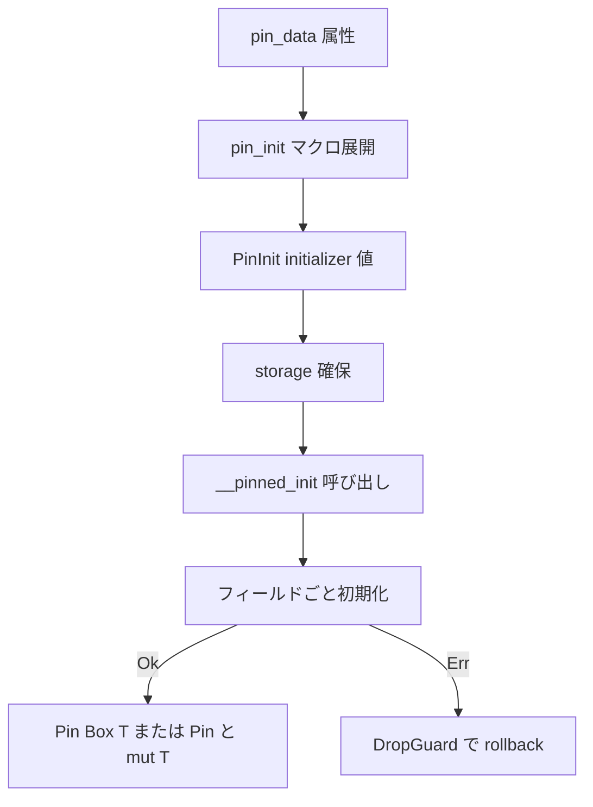

# 第7章 pin-init によるピン留め初期化

> 本章で読むソース
>
> - [`rust/pin-init/src/lib.rs`](https://github.com/gregkh/linux/blob/v6.18.38/rust/pin-init/src/lib.rs)
> - [`rust/pin-init/src/macros.rs`](https://github.com/gregkh/linux/blob/v6.18.38/rust/pin-init/src/macros.rs)
> - [`rust/pin-init/src/__internal.rs`](https://github.com/gregkh/linux/blob/v6.18.38/rust/pin-init/src/__internal.rs)
> - [`rust/pin-init/internal/src/lib.rs`](https://github.com/gregkh/linux/blob/v6.18.38/rust/pin-init/internal/src/lib.rs)
> - [`rust/kernel/init.rs`](https://github.com/gregkh/linux/blob/v6.18.38/rust/kernel/init.rs)
> - [`rust/kernel/sync/lock/mutex.rs`](https://github.com/gregkh/linux/blob/v6.18.38/rust/kernel/sync/lock/mutex.rs)

## この章の狙い

自己参照構造体を move せずその場で初期化する `pin-init` クレートの契約を追う。
`pin_init!` が生成する initializer 値と、storage への適用を分けて理解する。

## 前提

[第6章](06-types-opaque-aref.md) で `Opaque<T>` と `PhantomPinned` の役割を読んでいていること。
C 側の `struct mutex` 等が自己参照を持つことは [同期と RCU](../../locking/README.md) を参照する。

## 自己参照と PinInit の必要性

カーネル内の多くの C 構造体は、初期化後にアドレスが変わると不変条件が壊れる。
Rust の `Pin<P>` は値のメモリ位置を固定し、自己参照フィールドの有効性を保つ。
`pin-init` は未初期化メモリ上で pin 留め初期化を行う initializer 抽象を提供する。

## PinInit と Init の契約

`PinInit<T, E>` は `__pinned_init` で `slot` へ書き込む unsafe トレイトである。

[`rust/pin-init/src/lib.rs` L1038-L1066](https://github.com/gregkh/linux/blob/v6.18.38/rust/pin-init/src/lib.rs#L1038-L1066)

```rust
/// The [`PinInit::__pinned_init`] function:
/// - returns `Ok(())` if it initialized every field of `slot`,
/// - returns `Err(err)` if it encountered an error and then cleaned `slot`, this means:
///     - `slot` can be deallocated without UB occurring,
///     - `slot` does not need to be dropped,
///     - `slot` is not partially initialized.
/// - while constructing the `T` at `slot` it upholds the pinning invariants of `T`.
///
// ... (中略) ...
pub unsafe trait PinInit<T: ?Sized, E = Infallible>: Sized {
    /// Initializes `slot`.
    ///
    /// # Safety
    ///
    /// - `slot` is a valid pointer to uninitialized memory.
    /// - the caller does not touch `slot` when `Err` is returned, they are only permitted to
    ///   deallocate.
    /// - `slot` will not move until it is dropped, i.e. it will be pinned.
    unsafe fn __pinned_init(self, slot: *mut T) -> Result<(), E>;
```

initializer は初期化の過程で `slot` に途中まで書き込んでよい。
Err を返す前に自分で rollback し、部分初期化のまま放置しない責務を負う。
その結果 caller は Err 受け取り後に slot をデアロケートのみ許されると仮定できる。

`Init<T, E>` は `PinInit` のサブトレイトで、初期化後に move してよい型向けである。

[`rust/pin-init/src/lib.rs` L1156-L1164](https://github.com/gregkh/linux/blob/v6.18.38/rust/pin-init/src/lib.rs#L1156-L1164)

```rust
pub unsafe trait Init<T: ?Sized, E = Infallible>: PinInit<T, E> {
    /// Initializes `slot`.
    ///
    /// # Safety
    ///
    /// - `slot` is a valid pointer to uninitialized memory.
    /// - the caller does not touch `slot` when `Err` is returned, they are only permitted to
    ///   deallocate.
    unsafe fn __init(self, slot: *mut T) -> Result<(), E>;
```

`Init` を実装すれば `PinInit` も安全に導出できる。
移動可能な初期化のほうが強い保証である。

## pin_init マクロと二段階の初期化

`pin_init!` は `PinInit<T, E>` を実装する匿名 initializer 値を作るだけである。
`Pin<&mut T>` や `Pin<Box<T>>` を直接生成しない。

[`rust/pin-init/src/lib.rs` L782-L789](https://github.com/gregkh/linux/blob/v6.18.38/rust/pin-init/src/lib.rs#L782-L789)

```rust
macro_rules! pin_init {
    ($(&$this:ident in)? $t:ident $(::<$($generics:ty),* $(,)?>)? {
        $($fields:tt)*
    }) => {
        $crate::try_pin_init!($(&$this in)? $t $(::<$($generics),*>)? {
            $($fields)*
        }? ::core::convert::Infallible)
    };
}
```

`try_pin_init!` は内部で `__init_internal!` へ委譲する。

[`rust/pin-init/src/lib.rs` L833-L842](https://github.com/gregkh/linux/blob/v6.18.38/rust/pin-init/src/lib.rs#L833-L842)

```rust
macro_rules! try_pin_init {
    ($(&$this:ident in)? $t:ident $(::<$($generics:ty),* $(,)?>)? {
        $($fields:tt)*
    }? $err:ty) => {
        $crate::__init_internal!(
            @this($($this)?),
            @typ($t $(::<$($generics),*>)? ),
            @fields($($fields)*),
            @error($err),
            @data(PinData, use_data),
```

storage への適用は `InPlaceInit::pin_init` や `stack_pin_init!` が担う。
`KBox::pin_init` がヒープ確保と `__pinned_init` 呼び出しを一体化する。

[`rust/kernel/init.rs` L143-L164](https://github.com/gregkh/linux/blob/v6.18.38/rust/kernel/init.rs#L143-L164)

```rust
    /// Use the given pin-initializer to pin-initialize a `T` inside of a new smart pointer of this
    /// type.
    ///
    /// If `T: !Unpin` it will not be able to move afterwards.
    fn try_pin_init<E>(init: impl PinInit<T, E>, flags: Flags) -> Result<Self::PinnedSelf, E>
    where
        E: From<AllocError>;

    /// Use the given pin-initializer to pin-initialize a `T` inside of a new smart pointer of this
    /// type.
    ///
    /// If `T: !Unpin` it will not be able to move afterwards.
    fn pin_init<E>(init: impl PinInit<T, E>, flags: Flags) -> error::Result<Self::PinnedSelf>
    where
        Error: From<E>,
    {
        // SAFETY: We delegate to `init` and only change the error type.
        let init = unsafe {
            pin_init_from_closure(|slot| init.__pinned_init(slot).map_err(|e| Error::from(e)))
        };
        Self::try_pin_init(init, flags)
    }
```

`kernel::try_pin_init!` はエラー型を `kernel::error::Error` に固定した薄いラッパである。

[`rust/kernel/init.rs` L282-L288](https://github.com/gregkh/linux/blob/v6.18.38/rust/kernel/init.rs#L282-L288)

```rust
macro_rules! try_pin_init {
    ($(&$this:ident in)? $t:ident $(::<$($generics:ty),* $(,)?>)? {
        $($fields:tt)*
    }) => {
        ::pin_init::try_pin_init!($(&$this in)? $t $(::<$($generics),*>)? {
            $($fields)*
        }? $crate::error::Error)
    };
```

## pin_data と補助トレイト

`#[pin_data]` は proc macro 本体を `pin-init/internal` から re-export する。
`pin-init/src` には定義がなく、re-export のみである。

[`rust/pin-init/src/lib.rs` L362](https://github.com/gregkh/linux/blob/v6.18.38/rust/pin-init/src/lib.rs#L362)

```rust
pub use ::pin_init_internal::pin_data;
```

v6.18.38 の internal クレートが公開する proc macro は4つである。

[`rust/pin-init/internal/src/lib.rs` L36-L54](https://github.com/gregkh/linux/blob/v6.18.38/rust/pin-init/internal/src/lib.rs#L36-L54)

```rust
#[proc_macro_attribute]
pub fn pin_data(inner: TokenStream, item: TokenStream) -> TokenStream {
    pin_data::pin_data(inner.into(), item.into()).into()
}

#[proc_macro_attribute]
pub fn pinned_drop(args: TokenStream, input: TokenStream) -> TokenStream {
    pinned_drop::pinned_drop(args.into(), input.into()).into()
}

#[proc_macro_derive(Zeroable)]
pub fn derive_zeroable(input: TokenStream) -> TokenStream {
    zeroable::derive(input.into()).into()
}

#[proc_macro_derive(MaybeZeroable)]
pub fn maybe_derive_zeroable(input: TokenStream) -> TokenStream {
    zeroable::maybe_derive(input.into()).into()
}
```

`#[pin_data]` は `HasPinData` 等の補助トレイトを生成し、`pin_init!` 展開がフィールドごとの pin 投影を行う。

[`rust/pin-init/src/__internal.rs` L55-L60](https://github.com/gregkh/linux/blob/v6.18.38/rust/pin-init/src/__internal.rs#L55-L60)

```rust
pub unsafe trait HasPinData {
    type PinData: PinData;

    #[expect(clippy::missing_safety_doc)]
    unsafe fn __pin_data() -> Self::PinData;
}
```

6.18.38 では kernel が `syn` を持たないため、初期化子展開は `macros.rs` の手書き `macro_rules!` が担う。

[`rust/pin-init/src/macros.rs` L11-L15](https://github.com/gregkh/linux/blob/v6.18.38/rust/pin-init/src/macros.rs#L11-L15)

```rust
//! This architecture has been chosen because the kernel does not yet have access to `syn` which
//! would make matters a lot easier for implementing these as proc-macros.
//!
//! Since this library and the kernel implementation should diverge as little as possible, the same
//! approach has been taken here.
```

## Opaque と pin_init の組み合わせ

`kernel/init.rs` のドキュメントは `Opaque<T>` と `pin_init!` を組み合わせる `RawFoo` 例を載せる。

[`rust/kernel/init.rs` L83-L118](https://github.com/gregkh/linux/blob/v6.18.38/rust/kernel/init.rs#L83-L118)

```rust
//! #[pin_data(PinnedDrop)]
//! pub struct RawFoo {
//!     #[pin]
//!     foo: Opaque<bindings::foo>,
//!     #[pin]
//!     _p: PhantomPinned,
//! }
//!
//! impl RawFoo {
//!     pub fn new(flags: u32) -> impl PinInit<Self, Error> {
//!         // SAFETY:
//!         // - when the closure returns `Ok(())`, then it has successfully initialized and
//!         //   enabled `foo`,
//!         // - when it returns `Err(e)`, then it has cleaned up before
//!         unsafe {
//!             pin_init::pin_init_from_closure(move |slot: *mut Self| {
//!                 // `slot` contains uninit memory, avoid creating a reference.
//!                 let foo = addr_of_mut!((*slot).foo);
//!
//!                 // Initialize the `foo`
//!                 bindings::init_foo(Opaque::cast_into(foo));
//!
//!                 // Try to enable it.
//!                 let err = bindings::enable_foo(Opaque::cast_into(foo), flags);
//!                 if err != 0 {
//!                     // Enabling has failed, first clean up the foo and then return the error.
//!                     bindings::destroy_foo(Opaque::cast_into(foo));
//!                     return Err(Error::from_errno(err));
//!                 }
//!
//!                 // All fields of `RawFoo` have been initialized, since `_p` is a ZST.
//!                 Ok(())
//!             })
//!         }
//!     }
//! }
```

失敗時は C 側 `destroy_foo` で rollback してから `Err` を返す。
initializer の責務がコードに明示されている。

## Mutex 初期化の実例

`mutex.rs` のモジュールドキュメントが `pin_init!` の典型的な使い方を示す。

[`rust/kernel/sync/lock/mutex.rs` L44-L58](https://github.com/gregkh/linux/blob/v6.18.38/rust/kernel/sync/lock/mutex.rs#L44-L58)

```rust
/// #[pin_data]
/// struct Example {
///     c: u32,
///     #[pin]
///     d: Mutex<Inner>,
/// }
///
/// impl Example {
///     fn new() -> impl PinInit<Self> {
///         pin_init!(Self {
///             c: 10,
///             d <- new_mutex!(Inner { a: 20, b: 30 }),
///         })
///     }
/// }
```

`d <-` 構文は pin 必須フィールドへの sub-initializer 適用である。
`KBox::pin_init(Example::new(), GFP_KERNEL)` でヒープ上に pin 留め確保する。

## Zeroable と impl_zeroable

全ゼロビット列が有効な型だけが `Zeroable` を実装できる。

[`rust/pin-init/src/lib.rs` L1490-L1500](https://github.com/gregkh/linux/blob/v6.18.38/rust/pin-init/src/lib.rs#L1490-L1500)

```rust
/// Marker trait for types that can be initialized by writing just zeroes.
///
/// # Safety
///
/// The bit pattern consisting of only zeroes is a valid bit pattern for this type. In other words,
/// this is not UB:
///
/// ```rust,ignore
/// let val: Self = unsafe { core::mem::zeroed() };
/// ```
pub unsafe trait Zeroable {
```

`impl_zeroable!` はプリミティブ、`PhantomData`、`MaybeUninit`、生ポインタ等に一括実装する。
任意の構造体には自動適用できない。

[`rust/pin-init/src/lib.rs` L1608-L1627](https://github.com/gregkh/linux/blob/v6.18.38/rust/pin-init/src/lib.rs#L1608-L1627)

```rust
impl_zeroable! {
    // SAFETY: All primitives that are allowed to be zero.
    bool,
    char,
    u8, u16, u32, u64, u128, usize,
    i8, i16, i32, i64, i128, isize,
    f32, f64,

    // ... (中略) ...

    // SAFETY: These are inhabited ZSTs; there is nothing to zero and a valid value exists.
    {<T: ?Sized>} PhantomData<T>, core::marker::PhantomPinned, (),

    // SAFETY: Type is allowed to take any value, including all zeros.
    {<T>} MaybeUninit<T>,
```

## 失敗時の DropGuard

初期化途中のフィールドは `DropGuard` でロールバックされる。

[`rust/pin-init/src/__internal.rs` L226-L258](https://github.com/gregkh/linux/blob/v6.18.38/rust/pin-init/src/__internal.rs#L226-L258)

```rust
pub struct DropGuard<T: ?Sized> {
    ptr: *mut T,
}

impl<T: ?Sized> Drop for DropGuard<T> {
    #[inline]
    fn drop(&mut self) {
        // SAFETY: `self.ptr` is valid, properly aligned and `*self.ptr` is owned by this guard.
        unsafe { ptr::drop_in_place(self.ptr) }
    }
}
```

`try_pin_init!` 内の `?` 伝播時、完了したフィールドだけが drop される。

### pin 留め初期化の処理フロー



## 安全 API と unsafe 実装の分離

`PinInit::__pinned_init` が unsafe fn であるのは、「slot は pin されている」前提を型システムではなく契約として運ぶためである。
安全な利用側は `pin_init!` や `#[pin_data]` などの macro、あるいは `InPlaceInit` 等の safe initializer combinator を通じて initializer を組み立てる。
この契約を直接満たす trusted な unsafe 実装境界は macro 展開だけに閉じない。
`pin_init!`/`#[pin_data]` の proc macro や `macro_rules!` 展開に加え、公開 unsafe 関数 `pin_init_from_closure` の呼び出し側、そして `unsafe trait PinInit` を独自に実装するコードも境界に含まれる。
後者には任意の `T` へ `Ok` を書き込むだけの blanket 実装もある。

[`rust/pin-init/src/lib.rs` L1404-L1412](https://github.com/gregkh/linux/blob/v6.18.38/rust/pin-init/src/lib.rs#L1404-L1412)

```rust
// SAFETY: the `__pinned_init` function always returns `Ok(())` and initializes every field of
// `slot`. Additionally, all pinning invariants of `T` are upheld.
unsafe impl<T> PinInit<T> for T {
    unsafe fn __pinned_init(self, slot: *mut T) -> Result<(), Infallible> {
        // SAFETY: `slot` is valid for writes by the safety requirements of this function.
        unsafe { slot.write(self) };
        Ok(())
    }
}
```

利用側は safe な initializer 値を組み立て、storage 適用は `InPlaceInit` 等の safe 入口に委ねる。

## 7.1.3 との対比

v6.18.38 の `pin-init/src` は `lib.rs` 1733行、`macros.rs` 1708行、`__internal.rs` 303行の4ファイル構成である。
v7.1.3 では `macros.rs` が消え、`lib.rs` 1741行と `__internal.rs` 323行の3ファイルになった。

v7.1.3 の internal クレートは `init` と `pin_init` を function-like proc macro として新設した。

比較版 v7.1.3。

[`rust/pin-init/internal/src/lib.rs` L49-L59](https://github.com/gregkh/linux/blob/v7.1.3/rust/pin-init/internal/src/lib.rs#L49-L59)

```rust
#[proc_macro]
pub fn init(input: TokenStream) -> TokenStream {
    let input = parse_macro_input!(input);
    DiagCtxt::with(|dcx| init::expand(input, Some("::core::convert::Infallible"), false, dcx))
        .into()
}

#[proc_macro]
pub fn pin_init(input: TokenStream) -> TokenStream {
    let input = parse_macro_input!(input);
    DiagCtxt::with(|dcx| init::expand(input, Some("::core::convert::Infallible"), true, dcx)).into()
}
```

`init.rs` は `syn` と `quote` で `Initializer` 構造体をパースする。

比較版 v7.1.3。

[`rust/pin-init/internal/src/init.rs` L3-L12](https://github.com/gregkh/linux/blob/v7.1.3/rust/pin-init/internal/src/init.rs#L3-L12)

```rust
use proc_macro2::{Span, TokenStream};
use quote::{format_ident, quote, quote_spanned};
use syn::{
    braced,
    parse::{End, Parse},
    parse_quote,
    punctuated::Punctuated,
    spanned::Spanned,
    token, Attribute, Block, Expr, ExprCall, ExprPath, Ident, Path, Token, Type,
};
```

6.18.38 で `macro_rules!` と `__init_internal!` が担っていた約1700行の手書き展開が、v7.1.3 では `syn`/`quote` ベースの proc macro へ移設された。
カーネルツリーには `rust/syn`、`rust/proc-macro2`、`rust/quote` が新規同梱される。
`PinInit` と `__pinned_init` の実行時契約自体は変わっていない。

## まとめ

`pin_init!` は `PinInit` を実装する initializer 値を作り、storage 適用は `InPlaceInit` 等が担う二段構造である。
`PinInit::__pinned_init` の Err 契約は initializer 側の rollback 責務に基づく。
`#[pin_data]`、`Zeroable`、`DropGuard` がフィールド単位の pin と失敗回復を支える。
v7.1.3 では `macros.rs` 消滅と internal への `init`/`pin_init` proc macro 新設が対になっている。

## 関連する章

- [第4章 module! マクロとモジュール登録](04-module-macro.md)
- [第6章 型の基盤 Opaque と ARef と ForeignOwnable](06-types-opaque-aref.md)
- [第8章 アロケータと GFP フラグ](../part02-memory-ownership/08-allocator-gfp.md)
- [第11章 Lock 抽象と Mutex と SpinLock と locked_by](../part03-synchronization/11-lock-mutex-spinlock.md)
