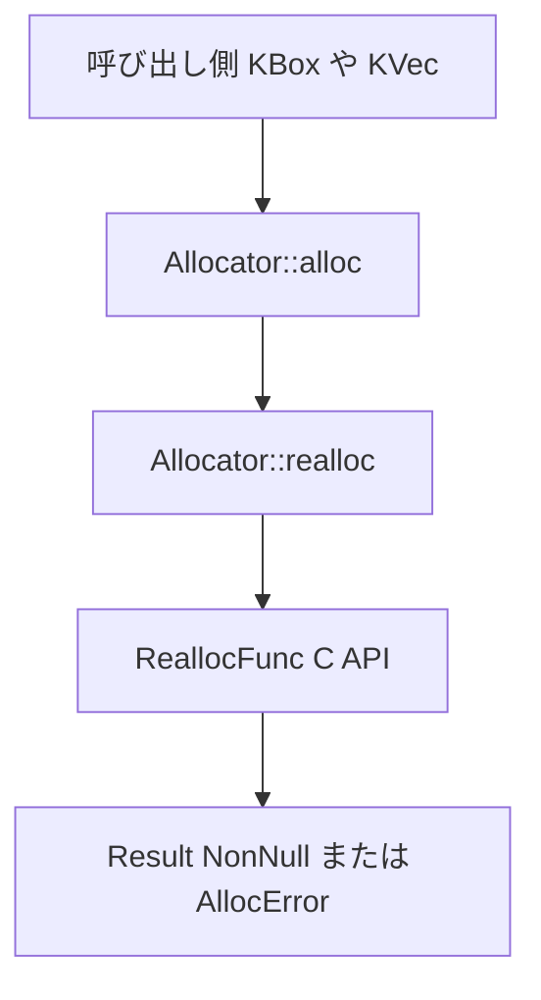

# 第8章 アロケータと GFP フラグ

> 本章で読むソース
>
> - [`rust/kernel/alloc.rs`](https://github.com/gregkh/linux/blob/v6.18.38/rust/kernel/alloc.rs)
> - [`rust/kernel/alloc/allocator.rs`](https://github.com/gregkh/linux/blob/v6.18.38/rust/kernel/alloc/allocator.rs)
> - [`rust/kernel/alloc/layout.rs`](https://github.com/gregkh/linux/blob/v6.18.38/rust/kernel/alloc/layout.rs)

## この章の狙い

カーネル Rust の `Allocator` トレイト、`Flags` による GFP フラグ、`Kmalloc`/`Vmalloc`/`KVmalloc` の三実装がどう C の `krealloc` 系 API に接続するかを追う。
確保失敗が `AllocError` として `Result` に載る契約を機構レベルで示す。

## 前提

[第5章](../part01-language-foundation/05-error-result.md) で `Result` と `From<AllocError>` を読んでいていること。
C 側の slab と vmalloc の概観は [メモリ管理](../../mm/README.md) を参照する。

## Allocator トレイトの ZST 設計

`Allocator` は実装型を ZST として設計することを求める trait であり、trait 自体が ZST なのではない。
関数は `self` パラメータを持たず、`#[derive(CoercePointee)]` 対応のため実装型のインスタンス化を要求しない設計である。
実際に ZST として実装されるのは、この章で見る `Kmalloc`、`Vmalloc`、`KVmalloc` である。

[`rust/kernel/alloc.rs` L138-L166](https://github.com/gregkh/linux/blob/v6.18.38/rust/kernel/alloc.rs#L138-L166)

```rust
/// The kernel's [`Allocator`] trait.
///
/// An implementation of [`Allocator`] can allocate, re-allocate and free memory buffers described
/// via [`Layout`].
///
/// [`Allocator`] is designed to be implemented as a ZST; [`Allocator`] functions do not operate on
/// an object instance.
///
/// In order to be able to support `#[derive(CoercePointee)]` later on, we need to avoid a design
/// that requires an `Allocator` to be instantiated, hence its functions must not contain any kind
/// of `self` parameter.
///
/// # Safety
///
/// - A memory allocation returned from an allocator must remain valid until it is explicitly freed.
///
/// - Any pointer to a valid memory allocation must be valid to be passed to any other [`Allocator`]
///   function of the same type.
///
/// - Implementers must ensure that all trait functions abide by the guarantees documented in the
///   `# Guarantees` sections.
pub unsafe trait Allocator {
    /// The minimum alignment satisfied by all allocations from this allocator.
    ///
    /// # Guarantees
    ///
    /// Any pointer allocated by this allocator is guaranteed to be aligned to `MIN_ALIGN` even if
    /// the requested layout has a smaller alignment.
    const MIN_ALIGN: usize;
```

`alloc` は `realloc(None, ...)` への委譲であり、新規確保と再確保が一本化される。

[`rust/kernel/alloc.rs` L168-L188](https://github.com/gregkh/linux/blob/v6.18.38/rust/kernel/alloc.rs#L168-L188)

```rust
    /// Allocate memory based on `layout`, `flags` and `nid`.
    ///
    /// On success, returns a buffer represented as `NonNull<[u8]>` that satisfies the layout
    /// constraints (i.e. minimum size and alignment as specified by `layout`).
    ///
    /// This function is equivalent to `realloc` when called with `None`.
    ///
    /// # Guarantees
    ///
    /// When the return value is `Ok(ptr)`, then `ptr` is
    /// - valid for reads and writes for `layout.size()` bytes, until it is passed to
    ///   [`Allocator::free`] or [`Allocator::realloc`],
    /// - aligned to `layout.align()`,
    ///
    /// Additionally, `Flags` are honored as documented in
    /// <https://docs.kernel.org/core-api/mm-api.html#mm-api-gfp-flags>.
    fn alloc(layout: Layout, flags: Flags, nid: NumaNode) -> Result<NonNull<[u8]>, AllocError> {
        // SAFETY: Passing `None` to `realloc` is valid by its safety requirements and asks for a
        // new memory allocation.
        unsafe { Self::realloc(None, layout, Layout::new::<()>(), flags, nid) }
    }
```

失敗時は panic ではなく `Err(AllocError)` が返る。
[第1章](../part00-overview-build/01-overview-kernel-crate.md) で述べた「`no_std` と fallible 確保は別機構」のうち、ここが alloc 層の担当である。

## Flags と GFP フラグ

`Flags` は `u32` の newtype で、ビット演算子で組み合わせる。

[`rust/kernel/alloc.rs` L28-L46](https://github.com/gregkh/linux/blob/v6.18.38/rust/kernel/alloc.rs#L28-L46)

```rust
/// Flags to be used when allocating memory.
///
/// They can be combined with the operators `|`, `&`, and `!`.
///
/// Values can be used from the [`flags`] module.
#[derive(Clone, Copy, PartialEq)]
pub struct Flags(u32);

impl Flags {
    /// Get the raw representation of this flag.
    pub(crate) fn as_raw(self) -> u32 {
        self.0
    }

    /// Check whether `flags` is contained in `self`.
    pub fn contains(self, flags: Flags) -> bool {
        (self & flags) == flags
    }
}
```

`flags` モジュールは C 側の GFP 定数をラップする。

[`rust/kernel/alloc.rs` L88-L110](https://github.com/gregkh/linux/blob/v6.18.38/rust/kernel/alloc.rs#L88-L110)

```rust
    /// Users can not sleep and need the allocation to succeed.
    ///
    /// A lower watermark is applied to allow access to "atomic reserves". The current
    /// implementation doesn't support NMI and few other strict non-preemptive contexts (e.g.
    /// `raw_spin_lock`). The same applies to [`GFP_NOWAIT`].
    pub const GFP_ATOMIC: Flags = Flags(bindings::GFP_ATOMIC);

    /// Typical for kernel-internal allocations. The caller requires `ZONE_NORMAL` or a lower zone
    /// for direct access but can direct reclaim.
    pub const GFP_KERNEL: Flags = Flags(bindings::GFP_KERNEL);

    /// The same as [`GFP_KERNEL`], except the allocation is accounted to kmemcg.
    pub const GFP_KERNEL_ACCOUNT: Flags = Flags(bindings::GFP_KERNEL_ACCOUNT);

    /// For kernel allocations that should not stall for direct reclaim, start physical IO or
    /// use any filesystem callback.  It is very likely to fail to allocate memory, even for very
    /// small allocations.
    pub const GFP_NOWAIT: Flags = Flags(bindings::GFP_NOWAIT);

    /// Suppresses allocation failure reports.
    ///
    /// This is normally or'd with other flags.
    pub const __GFP_NOWARN: Flags = Flags(bindings::__GFP_NOWARN);
```

`GFP_KERNEL` は通常のカーネル内確保、`GFP_ATOMIC` はスリープ不可文脈向けである。
呼び出し側が文脈に合ったフラグを毎回明示する。

## 三つのアロケータ実装

`allocator.rs` は `Kmalloc`、`Vmalloc`、`KVmalloc` の三 ZST を定義する。

[`rust/kernel/alloc/allocator.rs` L25-L49](https://github.com/gregkh/linux/blob/v6.18.38/rust/kernel/alloc/allocator.rs#L25-L49)

```rust
/// The contiguous kernel allocator.
///
/// `Kmalloc` is typically used for physically contiguous allocations up to page size, but also
/// supports larger allocations up to `bindings::KMALLOC_MAX_SIZE`, which is hardware specific.
///
/// For more details see [self].
pub struct Kmalloc;

/// The virtually contiguous kernel allocator.
///
/// `Vmalloc` allocates pages from the page level allocator and maps them into the contiguous kernel
/// virtual space. It is typically used for large allocations. The memory allocated with this
/// allocator is not physically contiguous.
///
/// For more details see [self].
pub struct Vmalloc;

/// The kvmalloc kernel allocator.
///
/// `KVmalloc` attempts to allocate memory with `Kmalloc` first, but falls back to `Vmalloc` upon
/// failure. This allocator is typically used when the size for the requested allocation is not
/// known and may exceed the capabilities of `Kmalloc`.
///
/// For more details see [self].
pub struct KVmalloc;
```

`Kmalloc` はページサイズに限定されず、hardware-dependent な `KMALLOC_MAX_SIZE` まで確保できる。
この上限を超える確保は `Kmalloc` 単体では失敗し、[第9章](09-kbox-kvec.md) で見る `KVmalloc` の vmalloc フォールバックがこれを補う。

実体は `ReallocFunc` が C の `krealloc_node_align` 系関数を呼ぶ。

[`rust/kernel/alloc/allocator.rs` L51-L72](https://github.com/gregkh/linux/blob/v6.18.38/rust/kernel/alloc/allocator.rs#L51-L72)

```rust
/// # Invariants
///
/// One of the following: `krealloc_node_align`, `vrealloc_node_align`, `kvrealloc_node_align`.
struct ReallocFunc(
    unsafe extern "C" fn(
        *const crate::ffi::c_void,
        usize,
        crate::ffi::c_ulong,
        u32,
        crate::ffi::c_int,
    ) -> *mut crate::ffi::c_void,
);

impl ReallocFunc {
    // INVARIANT: `krealloc_node_align` satisfies the type invariants.
    const KREALLOC: Self = Self(bindings::krealloc_node_align);

    // INVARIANT: `vrealloc_node_align` satisfies the type invariants.
    const VREALLOC: Self = Self(bindings::vrealloc_node_align);

    // INVARIANT: `kvrealloc_node_align` satisfies the type invariants.
    const KVREALLOC: Self = Self(bindings::kvrealloc_node_align);
```

### 実装型の ZST と Layout::size() == 0 の確保は別機構

`Allocator` の実装型が ZST であることと、要求する `Layout` のサイズが 0 であることは別の機構である。
前者はコンパイル時の型設計であり、実装型が状態を持たないことを意味する。
後者は実行時に「0 バイトの確保」という呼び出しが起きることを意味し、`ReallocFunc::call` がこれを扱う。

[`rust/kernel/alloc/allocator.rs` L84-L124](https://github.com/gregkh/linux/blob/v6.18.38/rust/kernel/alloc/allocator.rs#L84-L124)

```rust
    unsafe fn call(
        &self,
        ptr: Option<NonNull<u8>>,
        layout: Layout,
        old_layout: Layout,
        flags: Flags,
        nid: NumaNode,
    ) -> Result<NonNull<[u8]>, AllocError> {
        let size = layout.size();
        let ptr = match ptr {
            Some(ptr) => {
                if old_layout.size() == 0 {
                    ptr::null()
                } else {
                    ptr.as_ptr()
                }
            }
            None => ptr::null(),
        };

        // SAFETY:
        // - `self.0` is one of `krealloc`, `vrealloc`, `kvrealloc` and thus only requires that
        //   `ptr` is NULL or valid.
        // - `ptr` is either NULL or valid by the safety requirements of this function.
        //
        // GUARANTEE:
        // - `self.0` is one of `krealloc`, `vrealloc`, `kvrealloc`.
        // - Those functions provide the guarantees of this function.
        let raw_ptr = unsafe {
            // If `size == 0` and `ptr != NULL` the memory behind the pointer is freed.
            self.0(ptr.cast(), size, layout.align(), flags.0, nid.0).cast()
        };

        let ptr = if size == 0 {
            crate::alloc::dangling_from_layout(layout)
        } else {
            NonNull::new(raw_ptr).ok_or(AllocError)?
        };

        Ok(NonNull::slice_from_raw_parts(ptr, size))
    }
```

`old_layout.size() == 0` のとき、渡された `ptr` が `Some` であっても C 側へは `NULL` として渡す。
ゼロサイズレイアウトの確保では実際にはメモリが確保されていないため、そのポインタを本物の確保として C 側に渡せないからである。
新しく要求する `size`（`layout.size()`）が 0 のときは、C 呼び出しの結果である `raw_ptr` を使わず、`layout` のアラインメントに由来する dangling pointer を返す。
このとき C 呼び出し自体は行われるため、`ptr` が非 NULL であれば既存の確保はその場で解放される。
`AllocError` になるのは、要求する `size` が非ゼロであるにもかかわらず `raw_ptr` が NULL だった場合だけである。

`Kmalloc::aligned_layout` は slab のアラインメント要件を満たす `Layout` へ調整する。

[`rust/kernel/alloc/allocator.rs` L127-L135](https://github.com/gregkh/linux/blob/v6.18.38/rust/kernel/alloc/allocator.rs#L127-L135)

```rust
impl Kmalloc {
    /// Returns a [`Layout`] that makes [`Kmalloc`] fulfill the requested size and alignment of
    /// `layout`.
    pub fn aligned_layout(layout: Layout) -> Layout {
        // Note that `layout.size()` (after padding) is guaranteed to be a multiple of
        // `layout.align()` which together with the slab guarantees means that `Kmalloc` will return
        // a properly aligned object (see comments in `kmalloc()` for more information).
        layout.pad_to_align()
    }
}
```

### 確保要求の処理フロー



## ArrayLayout とサイズ検査

`layout.rs` の `ArrayLayout<T>` は配列長から `Layout` へ変換する前にオーバーフローと `isize::MAX` 制限を検査する。

[`rust/kernel/alloc/layout.rs` L12-L20](https://github.com/gregkh/linux/blob/v6.18.38/rust/kernel/alloc/layout.rs#L12-L20)

```rust
/// A layout for an array `[T; n]`.
///
/// # Invariants
///
/// - `len * size_of::<T>() <= isize::MAX`.
pub struct ArrayLayout<T> {
    len: usize,
    _phantom: PhantomData<fn() -> T>,
}
```

[`rust/kernel/alloc/layout.rs` L65-L76](https://github.com/gregkh/linux/blob/v6.18.38/rust/kernel/alloc/layout.rs#L65-L76)

```rust
    pub const fn new(len: usize) -> Result<Self, LayoutError> {
        match len.checked_mul(core::mem::size_of::<T>()) {
            Some(size) if size <= ISIZE_MAX => {
                // INVARIANT: We checked above that `len * size_of::<T>() <= isize::MAX`.
                Ok(Self {
                    len,
                    _phantom: PhantomData,
                })
            }
            _ => Err(LayoutError),
        }
    }
```

`KVec` の `reserve` はこの `ArrayLayout` 経由で再確保サイズを計算する（第9章）。

## AllocError と errno への収束

`AllocError` は単一のマーカー型であり、OOM 時に `ENOMEM` へ変換される。

[`rust/kernel/alloc.rs` L21-L23](https://github.com/gregkh/linux/blob/v6.18.38/rust/kernel/alloc.rs#L21-L23)

```rust
/// Indicates an allocation error.
#[derive(Copy, Clone, PartialEq, Eq, Debug)]
pub struct AllocError;
```

[第5章](../part01-language-foundation/05-error-result.md) の `impl From<AllocError> for Error` により、`?` で `ENOMEM` に収束する。
ZST の `Allocator` と fallible 戻り値の組み合わせにより、確保失敗を型で伝播できる。

## 7.1.3 との対比

`alloc.rs`、`allocator.rs`、`layout.rs` の三ファイルは v6.18.38 と v7.1.3 で内容が同一である。
`diff` 照合で差分ゼロを確認した。

`Allocator` トレイトの Safety 契約、`Flags` の GFP 定数、`ReallocFunc` による C API 委譲、`ArrayLayout` の不変条件は 6.18 から 7.1 で変わっていない。
本章の API 契約は両バージョンで不変である。

比較版 v7.1.3 でも `GFP_KERNEL` の定義は同じ行にある。

[`rust/kernel/alloc.rs` L95-L97](https://github.com/gregkh/linux/blob/v7.1.3/rust/kernel/alloc.rs#L95-L97)

```rust
    /// Typical for kernel-internal allocations. The caller requires `ZONE_NORMAL` or a lower zone
    /// for direct access but can direct reclaim.
    pub const GFP_KERNEL: Flags = Flags(bindings::GFP_KERNEL);
```

## まとめ

`Allocator` は実装型を ZST として設計する trait であり、`alloc`/`realloc`/`free` を提供し GFP フラグを `Flags` で受け取る。
実際に ZST として実装されるのは `Kmalloc`、`Vmalloc`、`KVmalloc` であり、それぞれ異なる C の realloc 関数へ接続する。
確保失敗は `AllocError` として返り、`Result` と `?` で伝播する。
v7.1.3 でも alloc 層三ファイルの契約は不変である。

## 関連する章

- [第5章 エラー処理と Result と errno](../part01-language-foundation/05-error-result.md)
- [第7章 pin-init によるピン留め初期化](../part01-language-foundation/07-pin-init.md)
- [第9章 KBox と KVec と確保失敗の伝播](09-kbox-kvec.md)
