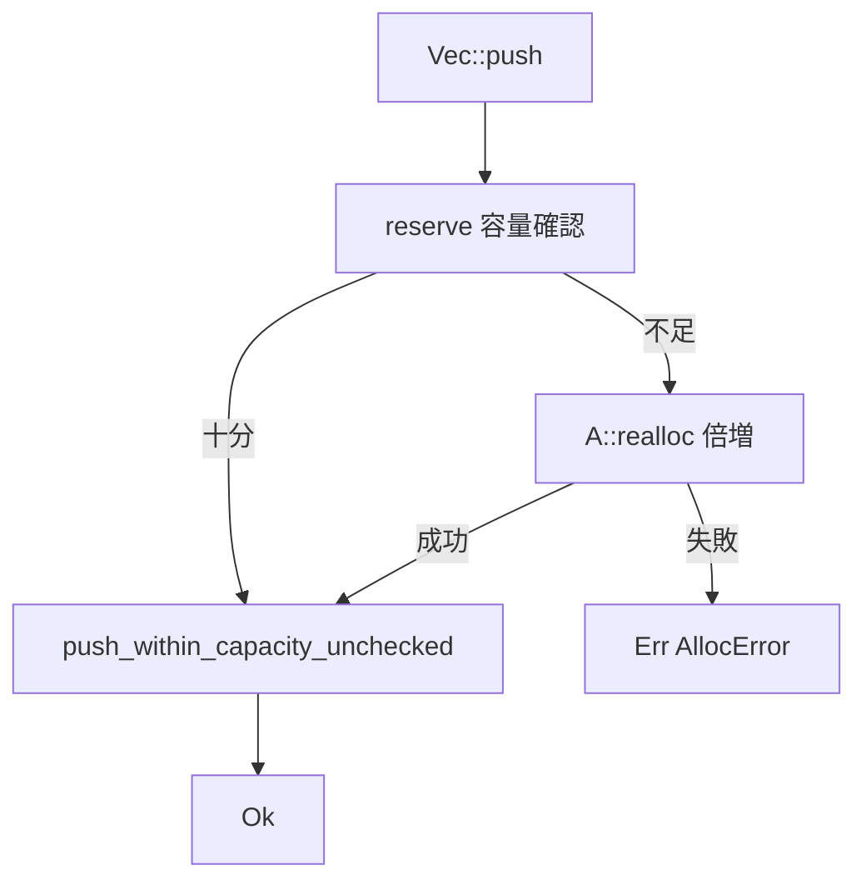

# 第9章 KBox と KVec と確保失敗の伝播

> 本章で読むソース
>
> - [`rust/kernel/alloc/kbox.rs`](https://github.com/gregkh/linux/blob/v6.18.38/rust/kernel/alloc/kbox.rs)
> - [`rust/kernel/alloc/kvec.rs`](https://github.com/gregkh/linux/blob/v6.18.38/rust/kernel/alloc/kvec.rs)
> - [`rust/kernel/alloc/kvec/errors.rs`](https://github.com/gregkh/linux/blob/v6.18.38/rust/kernel/alloc/kvec/errors.rs)

## この章の狙い

`KBox` と `KVec` が第8章の `Allocator` をどう使い、確保失敗を `Result` で呼び出し元へ返すかを追う。
`InPlaceInit` との統合、動的配列の成長、`push_within_capacity` のエラー型分離を機構レベルで示す。

## 前提

[第8章](08-allocator-gfp.md) で `Allocator`、`Flags`、`AllocError` を読んでいること。
[第7章](../part01-language-foundation/07-pin-init.md) で `InPlaceInit::pin_init` を把握していること。

## KBox の fallible 確保

カーネル `Box` は std と異なり、`Allocator` 型パラメータ `A` を必ず持つ。
`A` は `Box<T, A>` の型パラメータ、または `KBox`/`VBox`/`KVBox` エイリアスとしてコンパイル時に選ばれ、`new`/`new_uninit` が実引数として受け取るのは `Flags` だけである。
`new` は内部で `new_uninit` を呼び、失敗時は `Err(AllocError)` を返す。

[`rust/kernel/alloc/kbox.rs` L25-L31](https://github.com/gregkh/linux/blob/v6.18.38/rust/kernel/alloc/kbox.rs#L25-L31)

```rust
/// The kernel's [`Box`] type -- a heap allocation for a single value of type `T`.
///
/// This is the kernel's version of the Rust stdlib's `Box`. There are several differences,
/// for example no `noalias` attribute is emitted and partially moving out of a `Box` is not
/// supported. There are also several API differences, e.g. `Box` always requires an [`Allocator`]
/// implementation to be passed as generic, page [`Flags`] when allocating memory and all functions
/// that may allocate memory are fallible.
```

[`rust/kernel/alloc/kbox.rs` L256-L282](https://github.com/gregkh/linux/blob/v6.18.38/rust/kernel/alloc/kbox.rs#L256-L282)

```rust
    pub fn new(x: T, flags: Flags) -> Result<Self, AllocError> {
        let b = Self::new_uninit(flags)?;
        Ok(Box::write(b, x))
    }

    /// Creates a new `Box<T, A>` with uninitialized contents.
    ///
    /// New memory is allocated with `A`. The allocation may fail, in which case an error is
    /// returned. For ZSTs no memory is allocated.
    ///
    /// # Examples
    ///
    /// ```
    /// let b = KBox::<u64>::new_uninit(GFP_KERNEL)?;
    /// let b = KBox::write(b, 24);
    ///
    /// assert_eq!(*b, 24_u64);
    /// # Ok::<(), Error>(())
    /// ```
    pub fn new_uninit(flags: Flags) -> Result<Box<MaybeUninit<T>, A>, AllocError> {
        let layout = Layout::new::<MaybeUninit<T>>();
        let ptr = A::alloc(layout, flags, NumaNode::NO_NODE)?;

        // INVARIANT: `ptr` is either a dangling pointer or points to memory allocated with `A`,
        // which is sufficient in size and alignment for storing a `T`.
        Ok(Box(ptr.cast(), PhantomData))
    }
```

`KBox`、`VBox`、`KVBox` は `Allocator` 型パラメータの別名である。

[`rust/kernel/alloc/kbox.rs` L108-L118](https://github.com/gregkh/linux/blob/v6.18.38/rust/kernel/alloc/kbox.rs#L108-L118)

```rust
/// Type alias for [`Box`] with a [`Kmalloc`] allocator.
///
/// # Examples
///
/// ```
/// let b = KBox::new(24_u64, GFP_KERNEL)?;
///
/// assert_eq!(*b, 24_u64);
/// # Ok::<(), Error>(())
/// ```
pub type KBox<T> = Box<T, super::allocator::Kmalloc>;
```

大きな確保は `Kmalloc` が失敗し `KVmalloc` が成功する、という使い分けが doc 例に示される。

## KBox の解放経路

`Box<T, A>` の `Drop` は `T` を `drop_in_place` してから `A::free` を呼ぶ。
確保時にコンパイル時で選ばれた `A` が、解放時にも同じ型として使われる。

[`rust/kernel/alloc/kbox.rs` L667-L682](https://github.com/gregkh/linux/blob/v6.18.38/rust/kernel/alloc/kbox.rs#L667-L682)

```rust
impl<T, A> Drop for Box<T, A>
where
    T: ?Sized,
    A: Allocator,
{
    fn drop(&mut self) {
        let layout = Layout::for_value::<T>(self);

        // SAFETY: The pointer in `self.0` is guaranteed to be valid by the type invariant.
        unsafe { core::ptr::drop_in_place::<T>(self.deref_mut()) };

        // SAFETY:
        // - `self.0` was previously allocated with `A`.
        // - `layout` is equal to the `Layout´ `self.0` was allocated with.
        unsafe { A::free(self.0.cast(), layout) };
    }
}
```

`layout` は `Layout::for_value` により実行時に値から再構築され、確保時に使った `Layout` と一致する。
`T` が ZST であれば `layout.size()` は 0 になるが、[第8章](08-allocator-gfp.md) で見たとおり `Allocator::free` はゼロサイズの `layout` も受け付ける契約になっている。

## CoercePointee と DST への強制

v6.18.38 では `CONFIG_RUSTC_HAS_COERCE_POINTEE` により `CoercePointee` derive か手動 `CoerceUnsized` 実装を切り替える。

[`rust/kernel/alloc/kbox.rs` L79-L94](https://github.com/gregkh/linux/blob/v6.18.38/rust/kernel/alloc/kbox.rs#L79-L94)

```rust
#[repr(transparent)]
#[cfg_attr(CONFIG_RUSTC_HAS_COERCE_POINTEE, derive(core::marker::CoercePointee))]
pub struct Box<#[cfg_attr(CONFIG_RUSTC_HAS_COERCE_POINTEE, pointee)] T: ?Sized, A: Allocator>(
    NonNull<T>,
    PhantomData<A>,
);

// This is to allow coercion from `Box<T, A>` to `Box<U, A>` if `T` can be converted to the
// dynamically-sized type (DST) `U`.
#[cfg(not(CONFIG_RUSTC_HAS_COERCE_POINTEE))]
impl<T, U, A> core::ops::CoerceUnsized<Box<U, A>> for Box<T, A>
where
    T: ?Sized + core::marker::Unsize<U>,
    U: ?Sized,
    A: Allocator,
{
}
```

トレイトオブジェクト格納は `KBox::new(x, GFP_KERNEL)? as KBox<dyn Trait>` のように行う。

## InPlaceInit との統合

`Box` は `InPlaceInit` を実装し、確保と pin 初期化を一体化する。

[`rust/kernel/alloc/kbox.rs` L458-L478](https://github.com/gregkh/linux/blob/v6.18.38/rust/kernel/alloc/kbox.rs#L458-L478)

```rust
impl<T, A> InPlaceInit<T> for Box<T, A>
where
    A: Allocator + 'static,
{
    type PinnedSelf = Pin<Self>;

    #[inline]
    fn try_pin_init<E>(init: impl PinInit<T, E>, flags: Flags) -> Result<Pin<Self>, E>
    where
        E: From<AllocError>,
    {
        Box::<_, A>::new_uninit(flags)?.write_pin_init(init)
    }

    #[inline]
    fn try_init<E>(init: impl Init<T, E>, flags: Flags) -> Result<Self, E>
    where
        E: From<AllocError>,
    {
        Box::<_, A>::new_uninit(flags)?.write_init(init)
    }
```

`KBox::pin_init(Example::new(), GFP_KERNEL)?` は未初期化確保の失敗と初期化子の失敗の両方を `?` で伝播する。
確保失敗は `AllocError`、初期化失敗は `Error` へそれぞれ変換される。

## KVec の構造と成長

`Vec<T, A>` は pointer、`ArrayLayout`、`len`、Allocator 型パラメータで構成される。

[`rust/kernel/alloc/kvec.rs` L89-L113](https://github.com/gregkh/linux/blob/v6.18.38/rust/kernel/alloc/kvec.rs#L89-L113)

```rust
/// - `self.ptr` is always properly aligned and either points to memory allocated with `A` or, for
///   zero-sized types, is a dangling, well aligned pointer.
///
/// - `self.len` always represents the exact number of elements stored in the vector.
///
/// - `self.layout` represents the absolute number of elements that can be stored within the vector
///   without re-allocation. For ZSTs `self.layout`'s capacity is zero. However, it is legal for
///   the backing buffer to be larger than `layout`.
///
/// - `self.len()` is always less than or equal to `self.capacity()`.
///
/// - The `Allocator` type `A` of the vector is the exact same `Allocator` type the backing buffer
///   was allocated with (and must be freed with).
pub struct Vec<T, A: Allocator> {
    ptr: NonNull<T>,
    /// Represents the actual buffer size as `cap` times `size_of::<T>` bytes.
    ///
    /// Note: This isn't quite the same as `Self::capacity`, which in contrast returns the number of
    /// elements we can still store without reallocating.
    layout: ArrayLayout<T>,
    len: usize,
    _p: PhantomData<A>,
}
```

## KVec の解放経路

`Vec<T, A>` の `Drop` はまず `len` 個の要素からなる slice を `drop_in_place` し、そのあとで `A::free` を呼ぶ。

[`rust/kernel/alloc/kvec.rs` L831-L848](https://github.com/gregkh/linux/blob/v6.18.38/rust/kernel/alloc/kvec.rs#L831-L848)

```rust
impl<T, A> Drop for Vec<T, A>
where
    A: Allocator,
{
    fn drop(&mut self) {
        // SAFETY: `self.as_mut_ptr` is guaranteed to be valid by the type invariant.
        unsafe {
            ptr::drop_in_place(core::ptr::slice_from_raw_parts_mut(
                self.as_mut_ptr(),
                self.len,
            ))
        };

        // SAFETY:
        // - `self.ptr` was previously allocated with `A`.
        // - `self.layout` matches the `ArrayLayout` of the preceding allocation.
        unsafe { A::free(self.ptr.cast(), self.layout.into()) };
    }
}
```

`self.layout` は確保時の `ArrayLayout<T>` であり、要素数ではなくバイト単位の `Layout` に変換されて `A::free` に渡される。
KBox の解放と同じく、この `layout` が ZST 由来のゼロサイズであっても `Allocator::free` の契約により解放経路は成立する。

`push` は `reserve` で容量を確保してから要素を書き込む。

[`rust/kernel/alloc/kvec.rs` L325-L331](https://github.com/gregkh/linux/blob/v6.18.38/rust/kernel/alloc/kvec.rs#L325-L331)

```rust
    pub fn push(&mut self, v: T, flags: Flags) -> Result<(), AllocError> {
        self.reserve(1, flags)?;
        // SAFETY: The call to `reserve` was successful, so the capacity is at least one greater
        // than the length.
        unsafe { self.push_within_capacity_unchecked(v) };
        Ok(())
    }
```

`reserve` は容量不足時に倍増戦略で `A::realloc` を呼ぶ。

[`rust/kernel/alloc/kvec.rs` L622-L658](https://github.com/gregkh/linux/blob/v6.18.38/rust/kernel/alloc/kvec.rs#L622-L658)

```rust
    pub fn reserve(&mut self, additional: usize, flags: Flags) -> Result<(), AllocError> {
        let len = self.len();
        let cap = self.capacity();

        if cap - len >= additional {
            return Ok(());
        }

        if Self::is_zst() {
            // The capacity is already `usize::MAX` for ZSTs, we can't go higher.
            return Err(AllocError);
        }

        // We know that `cap <= isize::MAX` because of the type invariants of `Self`. So the
        // multiplication by two won't overflow.
        let new_cap = core::cmp::max(cap * 2, len.checked_add(additional).ok_or(AllocError)?);
        let layout = ArrayLayout::new(new_cap).map_err(|_| AllocError)?;

        // SAFETY:
        // - `ptr` is valid because it's either `None` or comes from a previous call to
        //   `A::realloc`.
        // - `self.layout` matches the `ArrayLayout` of the preceding allocation.
        let ptr = unsafe {
            A::realloc(
                Some(self.ptr.cast()),
                layout.into(),
                self.layout.into(),
                flags,
                NumaNode::NO_NODE,
            )?
        };

        // INVARIANT:
        // - `layout` is some `ArrayLayout::<T>`,
        // - `ptr` has been created by `A::realloc` from `layout`.
        self.ptr = ptr.cast();
        self.layout = layout;

        Ok(())
    }
```

### push の処理フロー



## push_within_capacity とエラー型の分離

再確保を避けたい文脈では `push_within_capacity` を使う。
容量不足時は要素を返す `PushError` となり、システム OOM とは区別される。

[`rust/kernel/alloc/kvec.rs` L348-L356](https://github.com/gregkh/linux/blob/v6.18.38/rust/kernel/alloc/kvec.rs#L348-L356)

```rust
    pub fn push_within_capacity(&mut self, v: T) -> Result<(), PushError<T>> {
        if self.len() < self.capacity() {
            // SAFETY: The length is less than the capacity.
            unsafe { self.push_within_capacity_unchecked(v) };
            Ok(())
        } else {
            Err(PushError(v))
        }
    }
```

[`rust/kernel/alloc/kvec/errors.rs` L8-L22](https://github.com/gregkh/linux/blob/v6.18.38/rust/kernel/alloc/kvec/errors.rs#L8-L22)

```rust
/// Error type for [`Vec::push_within_capacity`].
pub struct PushError<T>(pub T);

impl<T> Debug for PushError<T> {
    fn fmt(&self, f: &mut Formatter<'_>) -> fmt::Result {
        write!(f, "Not enough capacity")
    }
}

impl<T> From<PushError<T>> for Error {
    fn from(_: PushError<T>) -> Error {
        // Returning ENOMEM isn't appropriate because the system is not out of memory. The vector
        // is just full and we are refusing to resize it.
        EINVAL
    }
}
```

`PushError` は `EINVAL` に変換され、`ENOMEM` ではない点が意図的である。

## kvec マクロ

`kvec!` は `GFP_KERNEL` 固定で `KVec` を構築する糖衣である。

[`rust/kernel/alloc/kvec.rs` L52-L65](https://github.com/gregkh/linux/blob/v6.18.38/rust/kernel/alloc/kvec.rs#L52-L65)

```rust
#[macro_export]
macro_rules! kvec {
    () => (
        $crate::alloc::KVec::new()
    );
    ($elem:expr; $n:expr) => (
        $crate::alloc::KVec::from_elem($elem, $n, GFP_KERNEL)
    );
    ($($x:expr),+ $(,)?) => (
        match $crate::alloc::KBox::new_uninit(GFP_KERNEL) {
            Ok(b) => Ok($crate::alloc::KVec::from($crate::alloc::KBox::write(b, [$($x),+]))),
            Err(e) => Err(e),
        }
    );
}
```

リテラル形式は `KBox::new_uninit` の失敗をそのまま `Err` で返す。

## 7.1.3 との対比

### KBox の CoercePointee 簡素化

v6.18.38 では rustc の機能フラグに応じて `CoercePointee` derive と手動 `CoerceUnsized` を切り替えていた。
v7.1.3 では最低 rustc が `CoercePointee` をサポートするため、常に derive する。

比較版 v7.1.3。

[`rust/kernel/alloc/kbox.rs` L79-L81](https://github.com/gregkh/linux/blob/v7.1.3/rust/kernel/alloc/kbox.rs#L79-L81)

```rust
#[repr(transparent)]
#[derive(core::marker::CoercePointee)]
pub struct Box<#[pointee] T: ?Sized, A: Allocator>(NonNull<T>, PhantomData<A>);
```

`cfg(not(CONFIG_RUSTC_HAS_COERCE_POINTEE))` ブロックの手動実装は削除された。
DST への強制の意味論は変わらない。

### KVec の shrink_to 追加

v6.18.38 の `KVec` には `shrink_to` がない。
v7.1.3 では `KVVec` 向けに `shrink_to` が追加された。

比較版 v7.1.3。

[`rust/kernel/alloc/kvec.rs` L743-L766](https://github.com/gregkh/linux/blob/v7.1.3/rust/kernel/alloc/kvec.rs#L743-L766)

```rust
impl<T> Vec<T, KVmalloc> {
    /// Shrinks the capacity of the vector with a lower bound.
    ///
    /// The capacity will remain at least as large as both the length and the supplied value.
    /// If the current capacity is less than the lower limit, this is a no-op.
    ///
    /// For `kmalloc` allocations, this delegates to `realloc()`, which decides whether
    /// shrinking is worthwhile. For `vmalloc` allocations, shrinking only occurs if the
    /// operation would free at least one page of memory, and performs a deep copy since
    /// `vrealloc` does not yet support in-place shrinking.
    ///
    /// # Examples
    ///
    /// ```
    /// // Allocate enough capacity to span multiple pages.
    /// let elements_per_page = kernel::page::PAGE_SIZE / core::mem::size_of::<u32>();
    /// let mut v = KVVec::with_capacity(elements_per_page * 4, GFP_KERNEL)?;
    /// v.push(1, GFP_KERNEL)?;
    /// v.push(2, GFP_KERNEL)?;
    ///
    /// v.shrink_to(0, GFP_KERNEL)?;
    /// # Ok::<(), Error>(())
    /// ```
    pub fn shrink_to(&mut self, min_capacity: usize, flags: Flags) -> Result<(), AllocError> {
```

本体は以下のとおりである。

[`rust/kernel/alloc/kvec.rs` L767-L847](https://github.com/gregkh/linux/blob/v7.1.3/rust/kernel/alloc/kvec.rs#L767-L847)

```rust
        let target_cap = core::cmp::max(self.len(), min_capacity);

        if self.capacity() <= target_cap {
            return Ok(());
        }

        if Self::is_zst() {
            return Ok(());
        }

        // For kmalloc allocations, delegate to realloc() and let the allocator decide
        // whether shrinking is worthwhile.
        //
        // SAFETY: `self.ptr` points to a valid `KVmalloc` allocation.
        if !unsafe { bindings::is_vmalloc_addr(self.ptr.as_ptr().cast()) } {
            let new_layout = ArrayLayout::<T>::new(target_cap).map_err(|_| AllocError)?;

            // SAFETY:
            // - `self.ptr` is valid and was previously allocated with `KVmalloc`.
            // - `self.layout` matches the `ArrayLayout` of the preceding allocation.
            let ptr = unsafe {
                KVmalloc::realloc(
                    Some(self.ptr.cast()),
                    new_layout.into(),
                    self.layout.into(),
                    flags,
                    NumaNode::NO_NODE,
                )?
            };

            self.ptr = ptr.cast();
            self.layout = new_layout;
            return Ok(());
        }

        // Only shrink if we would free at least one page.
        let current_size = self.capacity() * core::mem::size_of::<T>();
        let target_size = target_cap * core::mem::size_of::<T>();
        let current_pages = current_size.div_ceil(PAGE_SIZE);
        let target_pages = target_size.div_ceil(PAGE_SIZE);

        if current_pages <= target_pages {
            return Ok(());
        }

        if target_cap == 0 {
            if !self.layout.is_empty() {
                // SAFETY:
                // - `self.ptr` was previously allocated with `KVmalloc`.
                // - `self.layout` matches the `ArrayLayout` of the preceding allocation.
                unsafe { KVmalloc::free(self.ptr.cast(), self.layout.into()) };
            }
            self.ptr = NonNull::dangling();
            self.layout = ArrayLayout::empty();
            return Ok(());
        }

        // SAFETY: `target_cap <= self.capacity()` and original capacity was valid.
        let new_layout = unsafe { ArrayLayout::<T>::new_unchecked(target_cap) };

        let new_ptr = KVmalloc::alloc(new_layout.into(), flags, NumaNode::NO_NODE)?;

        // SAFETY:
        // - `self.as_ptr()` is valid for reads of `self.len()` elements of `T`.
        // - `new_ptr` is valid for writes of at least `target_cap >= self.len()` elements.
        // - The two allocations do not overlap since `new_ptr` is freshly allocated.
        // - Both pointers are properly aligned for `T`.
        unsafe {
            ptr::copy_nonoverlapping(self.as_ptr(), new_ptr.as_ptr().cast::<T>(), self.len())
        };

        // SAFETY:
        // - `self.ptr` was previously allocated with `KVmalloc`.
        // - `self.layout` matches the `ArrayLayout` of the preceding allocation.
        unsafe { KVmalloc::free(self.ptr.cast(), self.layout.into()) };

        self.ptr = new_ptr.cast::<T>();
        self.layout = new_layout;

        Ok(())
    }
```

`self.ptr` が `is_vmalloc_addr` でなければ kmalloc backend と判断し、`KVmalloc::realloc` に委譲して縮小の要否を C 側の判断に任せる。
vmalloc backend では、縮小後のページ数が実際に減る場合だけ処理を続ける。
`target_cap` が 0 のときは `KVmalloc::free` で即座に解放し、`self.ptr` をダングリングポインタへ、`self.layout` を空の `ArrayLayout` へリセットする。
非ゼロの `target_cap` では新しい `Layout` で `KVmalloc::alloc` に成功したあと `copy_nonoverlapping` で要素をコピーし、続けて旧確保を `KVmalloc::free` で解放する。
新規確保が `?` で失敗した場合、`self.ptr` と `self.layout` はまだ更新されていないため旧バッファがそのまま保たれる。
現状は `KVmalloc` 専用であり、汎用 `Vec<T, A>` への拡張は TODO として残る。

## まとめ

`KBox` と `KVec` はすべての確保経路で `Result` を返し、panic に落とさない。
`InPlaceInit` により確保と pin 初期化が一連の fallible 操作となる。
`push` と `push_within_capacity` は再確保の要否と errno の意味を分離する。
v7.1.3 では `KBox` の CoercePointee が簡素化され、`KVVec` に `shrink_to` が追加された。

## 関連する章

- [第8章 アロケータと GFP フラグ](08-allocator-gfp.md)
- [第7章 pin-init によるピン留め初期化](../part01-language-foundation/07-pin-init.md)
- [第11章 Lock 抽象と Mutex と SpinLock と locked_by](../part03-synchronization/11-lock-mutex-spinlock.md)
- [第14章 侵入型リストと ListArc](../part04-data-structures/14-intrusive-list.md)
