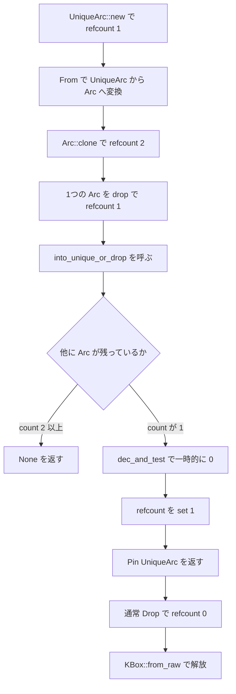

# 第10章 Arc とアトミック参照カウント

> 本章で読むソース
>
> - [`rust/kernel/sync/arc.rs`](https://github.com/gregkh/linux/blob/v6.18.38/rust/kernel/sync/arc.rs)
> - [`rust/kernel/sync/arc/std_vendor.rs`](https://github.com/gregkh/linux/blob/v6.18.38/rust/kernel/sync/arc/std_vendor.rs)
> - [`rust/kernel/sync/refcount.rs`](https://github.com/gregkh/linux/blob/v6.18.38/rust/kernel/sync/refcount.rs)

## この章の狙い

カーネル Rust の `Arc<T>` が `Refcount` と `KBox` を使って共同 allocation を行う経路を追う。
[第6章](../part01-language-foundation/06-types-opaque-aref.md) の `ARef<T>` が既存オブジェクトの refcount を借りる設計であるのに対し、`Arc<T>` が割り当てと refcount の両方を所有する設計である点を対比する。

## 前提

[第6章](../part01-language-foundation/06-types-opaque-aref.md) で `ARef<T>`、`AlwaysRefCounted`、`ForeignOwnable` を読んでいること。
[第8章](../part02-memory-ownership/08-allocator-gfp.md) と [第9章](../part02-memory-ownership/09-kbox-kvec.md) で `KBox::new`、`KBox::leak`、`Flags` を読んでいること。

## std の Arc との五つの相違

`arc.rs` のモジュールドキュメントは、標準ライブラリの `Arc` との相違を五つ列挙している。

[`rust/kernel/sync/arc.rs` L3-L16](https://github.com/gregkh/linux/blob/v6.18.38/rust/kernel/sync/arc.rs#L3-L16)

```rust
//! A reference-counted pointer.
//!
//! This module implements a way for users to create reference-counted objects and pointers to
//! them. Such a pointer automatically increments and decrements the count, and drops the
//! underlying object when it reaches zero. It is also safe to use concurrently from multiple
//! threads.
//!
//! It is different from the standard library's [`Arc`] in a few ways:
//! 1. It is backed by the kernel's [`Refcount`] type.
//! 2. It does not support weak references, which allows it to be half the size.
//! 3. It saturates the reference count instead of aborting when it goes over a threshold.
//! 4. It does not provide a `get_mut` method, so the ref counted object is pinned.
//! 5. The object in [`Arc`] is pinned implicitly.
//!
//! [`Arc`]: https://doc.rust-lang.org/std/sync/struct.Arc.html
```

バックエンドが C の `refcount_t` である点、weak 参照がない点、飽和セマンティクスである点、`get_mut` がなく値が常に pin 済みである点が、本章の読み方の前提になる。

## ARef との対比

`ARef<T>` は allocation も refcount の格納場所も自ら所有しない。
既存オブジェクトが実装する `AlwaysRefCounted` の `inc_ref`/`dec_ref` に寿命管理を委ねる。

対して `Arc<T>` は `ArcInner<T>` を `KBox` で確保し、`refcount` と `data` を一つの割り当てにまとめる。
「借りる」か「作って所有する」かが、両者の本質的な差である。

[`rust/kernel/sync/arc.rs` L130-L150](https://github.com/gregkh/linux/blob/v6.18.38/rust/kernel/sync/arc.rs#L130-L150)

```rust
#[repr(transparent)]
#[cfg_attr(CONFIG_RUSTC_HAS_COERCE_POINTEE, derive(core::marker::CoercePointee))]
pub struct Arc<T: ?Sized> {
    ptr: NonNull<ArcInner<T>>,
    // NB: this informs dropck that objects of type `ArcInner<T>` may be used in `<Arc<T> as
    // Drop>::drop`. Note that dropck already assumes that objects of type `T` may be used in
    // `<Arc<T> as Drop>::drop` and the distinction between `T` and `ArcInner<T>` is not presently
    // meaningful with respect to dropck - but this may change in the future so this is left here
    // out of an abundance of caution.
    //
    // See <https://doc.rust-lang.org/nomicon/phantom-data.html#generic-parameters-and-drop-checking>
    // for more detail on the semantics of dropck in the presence of `PhantomData`.
    _p: PhantomData<ArcInner<T>>,
}

#[pin_data]
#[repr(C)]
struct ArcInner<T: ?Sized> {
    refcount: Refcount,
    data: T,
}
```

`Arc<T>` は `ptr: NonNull<ArcInner<T>>` と ZST の `_p: PhantomData<ArcInner<T>>` の二フィールドを持つ。
非 ZST のフィールドは `ptr` の一つだけなので、`Arc<T>` は単一の非 ZST フィールドを持つ pointer サイズの `#[repr(transparent)]` ラッパとして扱える。
`ArcInner` は `#[repr(C)]` で `refcount` が先、`data` が後ろに並ぶ。

## Arc::new と共同 allocation

`Arc::new` は `ArcInner { refcount: Refcount::new(1), data: contents }` を `KBox::new` で確保し、`KBox::leak` で生ポインタへ変換する。

[`rust/kernel/sync/arc.rs` L227-L243](https://github.com/gregkh/linux/blob/v6.18.38/rust/kernel/sync/arc.rs#L227-L243)

```rust
impl<T> Arc<T> {
    /// Constructs a new reference counted instance of `T`.
    pub fn new(contents: T, flags: Flags) -> Result<Self, AllocError> {
        // INVARIANT: The refcount is initialised to a non-zero value.
        let value = ArcInner {
            refcount: Refcount::new(1),
            data: contents,
        };

        let inner = KBox::new(value, flags)?;
        let inner = KBox::leak(inner).into();

        // SAFETY: We just created `inner` with a reference count of 1, which is owned by the new
        // `Arc` object.
        Ok(unsafe { Self::from_inner(inner) })
    }
}
```

確保失敗は `AllocError` として `Result` に載る。
[第8章](../part02-memory-ownership/08-allocator-gfp.md) の `Flags` がそのまま `KBox` へ渡る。

## Refcount と C の refcount_t

`Refcount` は C の `refcount_t` を `Opaque` で包んだ型である。

[`rust/kernel/sync/refcount.rs` L11-L20](https://github.com/gregkh/linux/blob/v6.18.38/rust/kernel/sync/refcount.rs#L11-L20)

```rust
/// Atomic reference counter.
///
/// This type is conceptually an atomic integer, but provides saturation semantics compared to
/// normal atomic integers. Values in the negative range when viewed as a signed integer are
/// saturation (bad) values. For details about the saturation semantics, please refer to top of
/// [`include/linux/refcount.h`](srctree/include/linux/refcount.h).
///
/// Wraps the kernel's C `refcount_t`.
#[repr(transparent)]
pub struct Refcount(Opaque<bindings::refcount_t>);
```

`new` は `build_assert!` で非負の初期値を検査し、`REFCOUNT_INIT` で初期化する。

## Clone と Drop の参照カウント契約

`Clone` は `refcount.inc()` のみで新しい `Arc` を作る。
`Drop` は `dec_and_test()` が真のときだけ `KBox::from_raw` で解放する。

[`rust/kernel/sync/arc.rs` L451-L476](https://github.com/gregkh/linux/blob/v6.18.38/rust/kernel/sync/arc.rs#L451-L476)

```rust
impl<T: ?Sized> Clone for Arc<T> {
    fn clone(&self) -> Self {
        // INVARIANT: `Refcount` saturates the refcount, so it cannot overflow to zero.
        // SAFETY: By the type invariant, there is necessarily a reference to the object, so it is
        // safe to increment the refcount.
        unsafe { self.ptr.as_ref() }.refcount.inc();

        // SAFETY: We just incremented the refcount. This increment is now owned by the new `Arc`.
        unsafe { Self::from_inner(self.ptr) }
    }
}

impl<T: ?Sized> Drop for Arc<T> {
    fn drop(&mut self) {
        // INVARIANT: If the refcount reaches zero, there are no other instances of `Arc`, and
        // this instance is being dropped, so the broken invariant is not observable.
        // SAFETY: By the type invariant, there is necessarily a reference to the object.
        let is_zero = unsafe { self.ptr.as_ref() }.refcount.dec_and_test();
        if is_zero {
            // The count reached zero, we must free the memory.
            //
            // SAFETY: The pointer was initialised from the result of `KBox::leak`.
            unsafe { drop(KBox::from_raw(self.ptr.as_ptr())) };
        }
    }
}
```

### 高速化と最適化の工夫

`dec_and_test` のドキュメントは、release 順序で先行する読み書きを確定させ、0 に到達した場合のみ acquire 順序でメモリ解放が後続することを明記する。

[`rust/kernel/sync/refcount.rs` L85-L107](https://github.com/gregkh/linux/blob/v6.18.38/rust/kernel/sync/refcount.rs#L85-L107)

```rust
    /// Decrement a refcount and test if it is 0.
    ///
    /// It will `WARN` on underflow and fail to decrement when saturated.
    ///
    /// Provides release memory ordering, such that prior loads and stores are done
    /// before, and provides an acquire ordering on success such that memory deallocation
    /// must come after.
    ///
    /// Returns true if the resulting refcount is 0, false otherwise.
    ///
    /// # Notes
    ///
    /// A common pattern of using `Refcount` is to free memory when the reference count reaches
    /// zero. This means that the reference to `Refcount` could become invalid after calling this
    /// function. This is fine as long as the reference to `Refcount` is no longer used when this
    /// function returns `false`. It is not necessary to use raw pointers in this scenario, see
    /// <https://github.com/rust-lang/rust/issues/55005>.
    #[inline]
    #[must_use = "use `dec` instead if you do not need to test if it is 0"]
    pub fn dec_and_test(&self) -> bool {
        // SAFETY: `self.as_ptr()` is valid.
        unsafe { bindings::refcount_dec_and_test(self.as_ptr()) }
    }
```

`Arc::drop` は refcount が非ゼロで返るとき、他スレッドが確保した書き込みを毎回フルフェンスで見る必要がない。
0 に到達したときだけ、解放が他スレッドの `dec` に対して安全に順序付けられる。
実装は C 側の `refcount_dec_and_test` に委譲されている。

## into_raw と ForeignOwnable

`into_raw` は `Arc` を生ポインタへ変換し、所有していた refcount を呼び出し側へ渡す。
`ForeignOwnable` 実装は C コールバックへ `Arc` を渡す経路を提供する。

[`rust/kernel/sync/arc.rs` L372-L391](https://github.com/gregkh/linux/blob/v6.18.38/rust/kernel/sync/arc.rs#L372-L391)

```rust
unsafe impl<T: 'static> ForeignOwnable for Arc<T> {
    const FOREIGN_ALIGN: usize = <KBox<ArcInner<T>> as ForeignOwnable>::FOREIGN_ALIGN;

    type Borrowed<'a> = ArcBorrow<'a, T>;
    type BorrowedMut<'a> = Self::Borrowed<'a>;

    fn into_foreign(self) -> *mut c_void {
        ManuallyDrop::new(self).ptr.as_ptr().cast()
    }

    unsafe fn from_foreign(ptr: *mut c_void) -> Self {
        // SAFETY: The safety requirements of this function ensure that `ptr` comes from a previous
        // call to `Self::into_foreign`.
        let inner = unsafe { NonNull::new_unchecked(ptr.cast::<ArcInner<T>>()) };

        // SAFETY: By the safety requirement of this function, we know that `ptr` came from
        // a previous call to `Arc::into_foreign`, which guarantees that `ptr` is valid and
        // holds a reference count increment that is transferrable to us.
        unsafe { Self::from_inner(inner) }
    }
```

`into_foreign` は `ArcInner` へのポインタをそのまま C 側へ渡す。
`from_foreign` はそのポインタから `Arc` を再構築する。

## ArcBorrow と二重間接の回避

`ArcBorrow<'a, T>` は `&Arc<T>` の二重間接を避け、refcount を増やす必要があるときに使う。

[`rust/kernel/sync/arc.rs` L607-L616](https://github.com/gregkh/linux/blob/v6.18.38/rust/kernel/sync/arc.rs#L607-L616)

```rust
impl<T: ?Sized> From<ArcBorrow<'_, T>> for Arc<T> {
    fn from(b: ArcBorrow<'_, T>) -> Self {
        // SAFETY: The existence of `b` guarantees that the refcount is non-zero. `ManuallyDrop`
        // guarantees that `drop` isn't called, so it's ok that the temporary `Arc` doesn't own the
        // increment.
        ManuallyDrop::new(unsafe { Arc::from_inner(b.inner) })
            .deref()
            .clone()
    }
}
```

一時的な `Arc` を `ManuallyDrop` で包み、`clone()` で実際の `inc` は1回だけ行う。

## UniqueArc と into_unique_or_drop

`UniqueArc<T>` は refcount が 1 であることが保証された可変な `Arc` である。
`into_unique_or_drop` は所有する1 ref を `dec_and_test` し、共有されていなければ `UniqueArc` に戻す。

[`rust/kernel/sync/arc.rs` L346-L367](https://github.com/gregkh/linux/blob/v6.18.38/rust/kernel/sync/arc.rs#L346-L367)

```rust
    pub fn into_unique_or_drop(this: Self) -> Option<Pin<UniqueArc<T>>> {
        // We will manually manage the refcount in this method, so we disable the destructor.
        let this = ManuallyDrop::new(this);
        // SAFETY: We own a refcount, so the pointer is still valid.
        let refcount = unsafe { &this.ptr.as_ref().refcount };

        // If the refcount reaches a non-zero value, then we have destroyed this `Arc` and will
        // return without further touching the `Arc`. If the refcount reaches zero, then there are
        // no other arcs, and we can create a `UniqueArc`.
        if refcount.dec_and_test() {
            refcount.set(1);

            // INVARIANT: We own the only refcount to this arc, so we may create a `UniqueArc`. We
            // must pin the `UniqueArc` because the values was previously in an `Arc`, and they pin
            // their values.
            Some(Pin::from(UniqueArc {
                inner: ManuallyDrop::into_inner(this),
            }))
        } else {
            None
        }
    }
```

入力時 count が1のとき、一時的に0へ到達した直後に `set(1)` して `Pin<UniqueArc>` を返す。
count が2以上のときはその `Arc` の1 ref だけ手放し `None` を返す。
通常の `Drop` で count が0に達した `ArcInner` は `KBox::from_raw` で解放済みであり、`UniqueArc` へは戻せない。

`UniqueArc<T>` は `Arc::clone` を持たない。
共有可能な `Arc` へ戻すには `From<UniqueArc<T>>` または `From<Pin<UniqueArc<T>>>` で所有権を移してから `clone` を呼ぶ。

[`rust/kernel/sync/arc.rs` L478-L489](https://github.com/gregkh/linux/blob/v6.18.38/rust/kernel/sync/arc.rs#L478-L489)

```rust
impl<T: ?Sized> From<UniqueArc<T>> for Arc<T> {
    fn from(item: UniqueArc<T>) -> Self {
        item.inner
    }
}

impl<T: ?Sized> From<Pin<UniqueArc<T>>> for Arc<T> {
    fn from(item: Pin<UniqueArc<T>>) -> Self {
        // SAFETY: The type invariants of `Arc` guarantee that the data is pinned.
        unsafe { Pin::into_inner_unchecked(item).inner }
    }
}
```

`From` は refcount を変更せず、`UniqueArc` が保持していた `Arc` をそのまま取り出す。
共有を増やすにはその後で `Arc::clone` を呼ぶ。

### Arc と UniqueArc のライフサイクル



## downcast

`std_vendor.rs` は標準ライブラリ由来の `downcast` を提供する。

[`rust/kernel/sync/arc/std_vendor.rs` L13-L29](https://github.com/gregkh/linux/blob/v6.18.38/rust/kernel/sync/arc/std_vendor.rs#L13-L29)

```rust
impl Arc<dyn Any + Send + Sync> {
    /// Attempt to downcast the `Arc<dyn Any + Send + Sync>` to a concrete type.
    pub fn downcast<T>(self) -> core::result::Result<Arc<T>, Self>
    where
        T: Any + Send + Sync,
    {
        if (*self).is::<T>() {
            // SAFETY: We have just checked that the type is correct, so we can cast the pointer.
            unsafe {
                let ptr = self.ptr.cast::<ArcInner<T>>();
                core::mem::forget(self);
                Ok(Arc::from_inner(ptr))
            }
        } else {
            Err(self)
        }
    }
}
```

型検査に成功したときだけ `ArcInner<T>` へキャストし、元の `Arc` は `forget` する。

## 7.1.3 との対比

`refcount.rs` と `arc/std_vendor.rs` は v6.18.38 と v7.1.3 で内容が同一である。
`diff` 照合で差分ゼロを確認した。

`arc.rs` には差分がある。
`Arc<T>` と `ArcBorrow` の `CoercePointee` derive が無条件化され、非対応ツールチェイン向けの `CoerceUnsized`/`DispatchFromDyn` フォールバックが削除された。
[第9章](../part02-memory-ownership/09-kbox-kvec.md) の `KBox` と同型の整理である。

比較版 v7.1.3。

[`rust/kernel/sync/arc.rs` L130-L131](https://github.com/gregkh/linux/blob/v7.1.3/rust/kernel/sync/arc.rs#L130-L131)

```rust
#[repr(transparent)]
#[derive(core::marker::CoercePointee)]
```

v7.1.3 では `Arc<T>` に `DATA_OFFSET` 定数が追加された。
`T: Sized` の場合、コンパイル時に `data` フィールドのオフセットを取得できる。

[`rust/kernel/sync/arc.rs` L235-L236](https://github.com/gregkh/linux/blob/v7.1.3/rust/kernel/sync/arc.rs#L235-L236)

```rust
    /// The offset that the value is stored at.
    pub const DATA_OFFSET: usize = core::mem::offset_of!(ArcInner<T>, data);
```

v6.18.38 では `ArcInner::container_of` が `Layout::extend` で実行時にオフセットを計算していた。
`?Sized` 対応が必要な `container_of` 自体は両バージョンで存続する。

## まとめ

`Arc<T>` は `ArcInner` を `KBox` で共同 allocation し、参照カウントと割り当ての両方を所有する。
`ARef<T>` が既存オブジェクトの refcount を借りる設計であるのに対し、`Arc` は Rust 側で allocation から構築する。
`dec_and_test` の release/acquire 契約により、非ゼロの `drop` は軽量に、ゼロ到達時の解放だけが厳密に順序付けられる。
v7.1.3 では `CoercePointee` の簡素化と `DATA_OFFSET` 定数の追加が主な差分である。

## 関連する章

- [第6章 型の基盤 Opaque と ARef と ForeignOwnable](../part01-language-foundation/06-types-opaque-aref.md)
- [第8章 アロケータと GFP フラグ](../part02-memory-ownership/08-allocator-gfp.md)
- [第9章 KBox と KVec と確保失敗の伝播](../part02-memory-ownership/09-kbox-kvec.md)
- [第11章 Lock 抽象と Mutex と SpinLock と locked_by](11-lock-mutex-spinlock.md)
