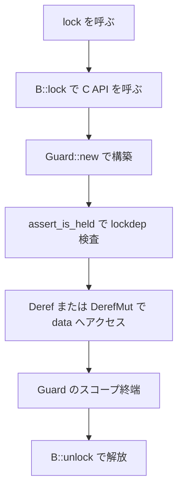
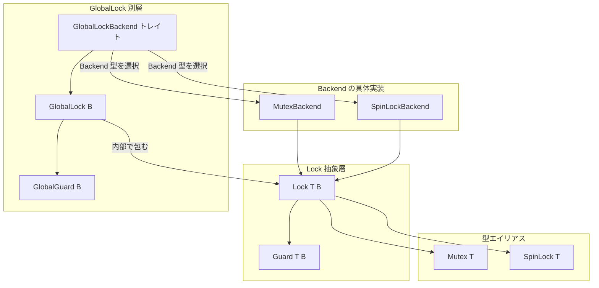

# 第11章 Lock 抽象と Mutex と SpinLock と locked_by

> 本章で読むソース
>
> - [`rust/kernel/sync/lock.rs`](https://github.com/gregkh/linux/blob/v6.18.38/rust/kernel/sync/lock.rs)
> - [`rust/kernel/sync/lock/mutex.rs`](https://github.com/gregkh/linux/blob/v6.18.38/rust/kernel/sync/lock/mutex.rs)
> - [`rust/kernel/sync/lock/spinlock.rs`](https://github.com/gregkh/linux/blob/v6.18.38/rust/kernel/sync/lock/spinlock.rs)
> - [`rust/kernel/sync/lock/global.rs`](https://github.com/gregkh/linux/blob/v6.18.38/rust/kernel/sync/lock/global.rs)
> - [`rust/kernel/sync/locked_by.rs`](https://github.com/gregkh/linux/blob/v6.18.38/rust/kernel/sync/locked_by.rs)

## この章の狙い

`Backend` トレイトによるロック抽象が、`Mutex<T>` と `SpinLock<T>` をどう単相化するかを追う。
`GlobalLock` が `Backend` の実装ではなく別層である点、`LockedBy` がロック外のデータを保護する型である点を機構レベルで示す。

## 前提

[第6章](../part01-language-foundation/06-types-opaque-aref.md) で `Opaque<T>` を読んでいること。
[第7章](../part01-language-foundation/07-pin-init.md) で `pin_init!` と `#[pin_data]` を読んでいること。
本章では `pin_init!` の文法そのものは再解説せず、`Lock::new` が `Backend::init` をどう呼ぶかに絞る。

## Backend トレイトの安全性契約

`Backend` は `unsafe trait` である。
実装者は lock されている間は1スレッドのみがアクセスできることと、`relock` が元の lock と同じ方式を使うことを保証しなければならない。

[`rust/kernel/sync/lock.rs` L27-L36](https://github.com/gregkh/linux/blob/v6.18.38/rust/kernel/sync/lock.rs#L27-L36)

```rust
/// # Safety
///
/// - Implementers must ensure that only one thread/CPU may access the protected data once the lock
///   is owned, that is, between calls to [`lock`] and [`unlock`].
/// - Implementers must also ensure that [`relock`] uses the same locking method as the original
///   lock operation.
///
/// [`lock`]: Backend::lock
/// [`unlock`]: Backend::unlock
/// [`relock`]: Backend::relock
```

関連型 `State` と `GuardState`、メソッド `init`/`lock`/`try_lock`/`unlock`/`relock`/`assert_is_held` を持つ。

[`rust/kernel/sync/lock.rs` L37-L98](https://github.com/gregkh/linux/blob/v6.18.38/rust/kernel/sync/lock.rs#L37-L98)

```rust
pub unsafe trait Backend {
    /// The state required by the lock.
    type State;

    /// The state required to be kept between [`lock`] and [`unlock`].
    ///
    /// [`lock`]: Backend::lock
    /// [`unlock`]: Backend::unlock
    type GuardState;

    /// Initialises the lock.
    ///
    /// # Safety
    ///
    /// `ptr` must be valid for write for the duration of the call, while `name` and `key` must
    /// remain valid for read indefinitely.
    unsafe fn init(
        ptr: *mut Self::State,
        name: *const crate::ffi::c_char,
        key: *mut bindings::lock_class_key,
    );

    /// Acquires the lock, making the caller its owner.
    ///
    /// # Safety
    ///
    /// Callers must ensure that [`Backend::init`] has been previously called.
    #[must_use]
    unsafe fn lock(ptr: *mut Self::State) -> Self::GuardState;

    /// Tries to acquire the lock.
    ///
    /// # Safety
    ///
    /// Callers must ensure that [`Backend::init`] has been previously called.
    unsafe fn try_lock(ptr: *mut Self::State) -> Option<Self::GuardState>;

    /// Releases the lock, giving up its ownership.
    ///
    /// # Safety
    ///
    /// It must only be called by the current owner of the lock.
    unsafe fn unlock(ptr: *mut Self::State, guard_state: &Self::GuardState);

    /// Reacquires the lock, making the caller its owner.
    ///
    /// # Safety
    ///
    /// Callers must ensure that `guard_state` comes from a previous call to [`Backend::lock`] (or
    /// variant) that has been unlocked with [`Backend::unlock`] and will be relocked now.
    unsafe fn relock(ptr: *mut Self::State, guard_state: &mut Self::GuardState) {
        // SAFETY: The safety requirements ensure that the lock is initialised.
        *guard_state = unsafe { Self::lock(ptr) };
    }

    /// Asserts that the lock is held using lockdep.
    ///
    /// # Safety
    ///
    /// Callers must ensure that [`Backend::init`] has been previously called.
    unsafe fn assert_is_held(ptr: *mut Self::State);
}
```

型システムでは「lock 中は1スレッドのみ」という契約を検査できない。
`Lock` と `Guard` の safe API は、この unsafe 契約を前提に安全性を組み立てている。

### 高速化と最適化の工夫

`Mutex<T>` と `SpinLock<T>` はいずれも `Lock<T, B>` の型エイリアスに過ぎない。
`B::lock`/`B::unlock` はジェネリクスの単相化によりコンパイル時に具体的な FFI 呼び出しへ解決される。
vtable も動的ディスパッチも介さないゼロコスト抽象である。

## Lock の構造と ABI の担い手

`Lock<T, B>` は三フィールドを持つ。
C の `struct mutex`/`spinlock_t` と layout を直接担うのは先頭の `Opaque<B::State>` だけである。

[`rust/kernel/sync/lock.rs` L104-L119](https://github.com/gregkh/linux/blob/v6.18.38/rust/kernel/sync/lock.rs#L104-L119)

```rust
#[repr(C)]
#[pin_data]
pub struct Lock<T: ?Sized, B: Backend> {
    /// The kernel lock object.
    #[pin]
    state: Opaque<B::State>,

    /// Some locks are known to be self-referential (e.g., mutexes), while others are architecture
    /// or config defined (e.g., spinlocks). So we conservatively require them to be pinned in case
    /// some architecture uses self-references now or in the future.
    #[pin]
    _pin: PhantomPinned,

    /// The data protected by the lock.
    pub(crate) data: UnsafeCell<T>,
}
```

`Lock<T, B>` 全体が C ロックと ABI 互換なのではない。
`#[repr(C)]` と `T = ()` の `from_raw` だけが、C 側で初期化済みのロックと layout equivalent とみなせる特殊経路である。

[`rust/kernel/sync/lock.rs` L148-L163](https://github.com/gregkh/linux/blob/v6.18.38/rust/kernel/sync/lock.rs#L148-L163)

```rust
    pub unsafe fn from_raw<'a>(ptr: *mut B::State) -> &'a Self {
        // SAFETY:
        // - By the safety contract `ptr` must point to a valid initialised instance of `B::State`
        // - Since the lock data type is `()` which is a ZST, `state` is the only non-ZST member of
        //   the struct
        // - Combined with `#[repr(C)]`, this guarantees `Self` has an equivalent data layout to
        //   `B::State`.
        unsafe { &*ptr.cast() }
    }
```

`#[pin_data]` は ABI のためではなく、structural pinning と pin 初期化のために付いている。

## Lock::new と pin_init

`Lock::new` は `pin_init!` で `data`/`_pin`/`state` を初期化し、`Opaque::ffi_init` の中で `B::init` へ委譲する。

[`rust/kernel/sync/lock.rs` L128-L141](https://github.com/gregkh/linux/blob/v6.18.38/rust/kernel/sync/lock.rs#L128-L141)

```rust
impl<T, B: Backend> Lock<T, B> {
    /// Constructs a new lock initialiser.
    pub fn new(t: T, name: &'static CStr, key: Pin<&'static LockClassKey>) -> impl PinInit<Self> {
        pin_init!(Self {
            data: UnsafeCell::new(t),
            _pin: PhantomPinned,
            // SAFETY: `slot` is valid while the closure is called and both `name` and `key` have
            // static lifetimes so they live indefinitely.
            state <- Opaque::ffi_init(|slot| unsafe {
                B::init(slot, name.as_char_ptr(), key.as_ptr())
            }),
        })
    }
}
```

`Backend::init` という unsafe FFI 呼び出しを `pin_init!` のクロージャに閉じ込めている。

## lock と Guard の RAII

`lock()` は `B::lock` を呼び、返った `GuardState` を `Guard::new` に渡すだけの薄いラッパである。

[`rust/kernel/sync/lock.rs` L165-L184](https://github.com/gregkh/linux/blob/v6.18.38/rust/kernel/sync/lock.rs#L165-L184)

```rust
impl<T: ?Sized, B: Backend> Lock<T, B> {
    /// Acquires the lock and gives the caller access to the data protected by it.
    pub fn lock(&self) -> Guard<'_, T, B> {
        // SAFETY: The constructor of the type calls `init`, so the existence of the object proves
        // that `init` was called.
        let state = unsafe { B::lock(self.state.get()) };
        // SAFETY: The lock was just acquired.
        unsafe { Guard::new(self, state) }
    }

    /// Tries to acquire the lock.
    ///
    /// Returns a guard that can be used to access the data protected by the lock if successful.
    // `Option<T>` is not `#[must_use]` even if `T` is, thus the attribute is needed here.
    #[must_use = "if unused, the lock will be immediately unlocked"]
    pub fn try_lock(&self) -> Option<Guard<'_, T, B>> {
        // SAFETY: The constructor of the type calls `init`, so the existence of the object proves
        // that `init` was called.
        unsafe { B::try_lock(self.state.get()).map(|state| Guard::new(self, state)) }
    }
}
```

`Guard` は `_not_send: NotThreadSafe` で `!Send` となり、取得したスレッド以外へ渡せない。
`Drop` で `B::unlock` を呼び、スコープを抜けるときに自動で unlock する。

[`rust/kernel/sync/lock.rs` L245-L266](https://github.com/gregkh/linux/blob/v6.18.38/rust/kernel/sync/lock.rs#L245-L266)

```rust
impl<T: ?Sized, B: Backend> core::ops::Deref for Guard<'_, T, B> {
    type Target = T;

    fn deref(&self) -> &Self::Target {
        // SAFETY: The caller owns the lock, so it is safe to deref the protected data.
        unsafe { &*self.lock.data.get() }
    }
}

impl<T: ?Sized, B: Backend> core::ops::DerefMut for Guard<'_, T, B> {
    fn deref_mut(&mut self) -> &mut Self::Target {
        // SAFETY: The caller owns the lock, so it is safe to deref the protected data.
        unsafe { &mut *self.lock.data.get() }
    }
}

impl<T: ?Sized, B: Backend> Drop for Guard<'_, T, B> {
    fn drop(&mut self) {
        // SAFETY: The caller owns the lock, so it is safe to unlock it.
        unsafe { B::unlock(self.lock.state.get(), &self.state) };
    }
}
```

`do_unlocked` は `ScopeGuard` で一時的に unlock し、コールバックの返り方に依存せず `_relock` の `Drop` 時に必ず relock する。

[`rust/kernel/sync/lock.rs` L233-L243](https://github.com/gregkh/linux/blob/v6.18.38/rust/kernel/sync/lock.rs#L233-L243)

```rust
    pub(crate) fn do_unlocked<U>(&mut self, cb: impl FnOnce() -> U) -> U {
        // SAFETY: The caller owns the lock, so it is safe to unlock it.
        unsafe { B::unlock(self.lock.state.get(), &self.state) };

        let _relock = ScopeGuard::new(||
                // SAFETY: The lock was just unlocked above and is being relocked now.
                unsafe { B::relock(self.lock.state.get(), &mut self.state) });

        cb()
    }
```

### ロック取得から解放までのフロー



## MutexBackend と SpinLockBackend

`MutexBackend` と `SpinLockBackend` は `Backend` の二つの具体実装である。
`GlobalLockBackend` は `Backend` の実装ではない。

[`rust/kernel/sync/lock/mutex.rs` L87-L125](https://github.com/gregkh/linux/blob/v6.18.38/rust/kernel/sync/lock/mutex.rs#L87-L125)

```rust
pub type Mutex<T> = super::Lock<T, MutexBackend>;

/// A [`Guard`] acquired from locking a [`Mutex`].
///
/// This is simply a type alias for a [`Guard`] returned from locking a [`Mutex`]. It will unlock
/// the [`Mutex`] upon being dropped.
///
/// [`Guard`]: super::Guard
pub type MutexGuard<'a, T> = super::Guard<'a, T, MutexBackend>;

/// A kernel `struct mutex` lock backend.
pub struct MutexBackend;

// SAFETY: The underlying kernel `struct mutex` object ensures mutual exclusion.
unsafe impl super::Backend for MutexBackend {
    type State = bindings::mutex;
    type GuardState = ();

    unsafe fn init(
        ptr: *mut Self::State,
        name: *const crate::ffi::c_char,
        key: *mut bindings::lock_class_key,
    ) {
        // SAFETY: The safety requirements ensure that `ptr` is valid for writes, and `name` and
        // `key` are valid for read indefinitely.
        unsafe { bindings::__mutex_init(ptr, name, key) }
    }

    unsafe fn lock(ptr: *mut Self::State) -> Self::GuardState {
        // SAFETY: The safety requirements of this function ensure that `ptr` points to valid
        // memory, and that it has been initialised before.
        unsafe { bindings::mutex_lock(ptr) };
    }

    unsafe fn unlock(ptr: *mut Self::State, _guard_state: &Self::GuardState) {
        // SAFETY: The safety requirements of this function ensure that `ptr` is valid and that the
        // caller is the owner of the mutex.
        unsafe { bindings::mutex_unlock(ptr) };
    }
```

[`rust/kernel/sync/lock/spinlock.rs` L85-L118](https://github.com/gregkh/linux/blob/v6.18.38/rust/kernel/sync/lock/spinlock.rs#L85-L118)

```rust
pub type SpinLock<T> = super::Lock<T, SpinLockBackend>;

/// A kernel `spinlock_t` lock backend.
pub struct SpinLockBackend;

/// A [`Guard`] acquired from locking a [`SpinLock`].
///
/// This is simply a type alias for a [`Guard`] returned from locking a [`SpinLock`]. It will unlock
/// the [`SpinLock`] upon being dropped.
///
/// [`Guard`]: super::Guard
pub type SpinLockGuard<'a, T> = super::Guard<'a, T, SpinLockBackend>;

// SAFETY: The underlying kernel `spinlock_t` object ensures mutual exclusion. `relock` uses the
// default implementation that always calls the same locking method.
unsafe impl super::Backend for SpinLockBackend {
    type State = bindings::spinlock_t;
    type GuardState = ();

    unsafe fn init(
        ptr: *mut Self::State,
        name: *const crate::ffi::c_char,
        key: *mut bindings::lock_class_key,
    ) {
        // SAFETY: The safety requirements ensure that `ptr` is valid for writes, and `name` and
        // `key` are valid for read indefinitely.
        unsafe { bindings::__spin_lock_init(ptr, name, key) }
    }

    unsafe fn lock(ptr: *mut Self::State) -> Self::GuardState {
        // SAFETY: The safety requirements of this function ensure that `ptr` points to valid
        // memory, and that it has been initialised before.
        unsafe { bindings::spin_lock(ptr) }
    }
```

C 側呼び出しはそれぞれ1行の FFI に過ぎない。
`new_mutex!`/`new_spinlock!` は lock class を自動生成する糖衣構文である。

### Backend 単相化と GlobalLock の別層



`global_lock!` が生成するマーカー型は `GlobalLockBackend` を実装し、関連型 `Backend` に `MutexBackend` または `SpinLockBackend` を指定する。
`GlobalLock<B>` は内部で `Lock<B::Item, B::Backend>` を包む。

## GlobalLock と二段階初期化

`GlobalLock::new` は `const unsafe fn` で `Opaque::uninit()` を置き、後から `init` で `Backend::init` を呼ぶ。

[`rust/kernel/sync/lock/global.rs` L36-L77](https://github.com/gregkh/linux/blob/v6.18.38/rust/kernel/sync/lock/global.rs#L36-L77)

```rust
pub struct GlobalLock<B: GlobalLockBackend> {
    inner: Lock<B::Item, B::Backend>,
}

impl<B: GlobalLockBackend> GlobalLock<B> {
    /// Creates a global lock.
    ///
    /// # Safety
    ///
    /// * Before any other method on this lock is called, [`Self::init`] must be called.
    /// * The type `B` must not be used with any other lock.
    pub const unsafe fn new(data: B::Item) -> Self {
        Self {
            inner: Lock {
                state: Opaque::uninit(),
                data: UnsafeCell::new(data),
                _pin: PhantomPinned,
            },
        }
    }

    /// Initializes a global lock.
    ///
    /// # Safety
    ///
    /// Must not be called more than once on a given lock.
    pub unsafe fn init(&'static self) {
        // SAFETY: The pointer to `state` is valid for the duration of this call, and both `name`
        // and `key` are valid indefinitely. The `state` is pinned since we have a `'static`
        // reference to `self`.
        //
        // We have exclusive access to the `state` since the caller of `new` promised to call
        // `init` before using any other methods. As `init` can only be called once, all other
        // uses of this lock must happen after this call.
        unsafe {
            B::Backend::init(
                self.inner.state.get(),
                B::NAME.as_char_ptr(),
                B::get_lock_class().as_ptr(),
            )
        }
    }
```

`static` 変数はコンパイル時に確保されるが、lock class の登録は実行時初期化子が必要である。

`GlobalLockedBy` は `GlobalGuard` の存在だけを証拠としてデータへアクセスする。

[`rust/kernel/sync/lock/global.rs` L153-L168](https://github.com/gregkh/linux/blob/v6.18.38/rust/kernel/sync/lock/global.rs#L153-L168)

```rust
impl<T: ?Sized, B: GlobalLockBackend> GlobalLockedBy<T, B> {
    /// Access the value immutably.
    ///
    /// The caller must prove shared access to the lock.
    pub fn as_ref<'a>(&'a self, _guard: &'a GlobalGuard<B>) -> &'a T {
        // SAFETY: The lock is globally unique, so there can only be one guard.
        unsafe { &*self.value.get() }
    }

    /// Access the value mutably.
    ///
    /// The caller must prove shared exclusive to the lock.
    pub fn as_mut<'a>(&'a self, _guard: &'a mut GlobalGuard<B>) -> &'a mut T {
        // SAFETY: The lock is globally unique, so there can only be one guard.
        unsafe { &mut *self.value.get() }
    }
```

## LockedBy と外部ロックの証拠

`LockedBy<T, U>` は、別のデータ構造が持つ既存の `Lock` を、そのデータ構造とは別のフィールドの保護にも使い回す型である。

[`rust/kernel/sync/locked_by.rs` L78-L111](https://github.com/gregkh/linux/blob/v6.18.38/rust/kernel/sync/locked_by.rs#L78-L111)

```rust
pub struct LockedBy<T: ?Sized, U: ?Sized> {
    owner: *const U,
    data: UnsafeCell<T>,
}

// SAFETY: `LockedBy` can be transferred across thread boundaries iff the data it protects can.
unsafe impl<T: ?Sized + Send, U: ?Sized> Send for LockedBy<T, U> {}

// SAFETY: If `T` is not `Sync`, then parallel shared access to this `LockedBy` allows you to use
// `access_mut` to hand out `&mut T` on one thread at the time. The requirement that `T: Send` is
// sufficient to allow that.
//
// If `T` is `Sync`, then the `access` method also becomes available, which allows you to obtain
// several `&T` from several threads at once. However, this is okay as `T` is `Sync`.
unsafe impl<T: ?Sized + Send, U: ?Sized> Sync for LockedBy<T, U> {}

impl<T, U> LockedBy<T, U> {
    /// Constructs a new instance of [`LockedBy`].
    ///
    /// It stores a raw pointer to the owner that is never dereferenced. It is only used to ensure
    /// that the right owner is being used to access the protected data. If the owner is freed, the
    /// data becomes inaccessible; if another instance of the owner is allocated *on the same
    /// memory location*, the data becomes accessible again: none of this affects memory safety
    /// because in any case at most one thread (or CPU) can access the protected data at a time.
    pub fn new<B: Backend>(owner: &Lock<U, B>, data: T) -> Self {
        build_assert!(
            size_of::<Lock<U, B>>() > 0,
            "The lock type cannot be a ZST because it may be impossible to distinguish instances"
        );
        Self {
            owner: owner.data.get(),
            data: UnsafeCell::new(data),
        }
    }
}
```

`new` は `owner.data.get()` の生ポインタを保存するだけで、実際の排他制御はしない。
ZST ロックは `build_assert!` で禁止している。

`access`/`access_mut` は呼び出し元が正しい `owner` への参照を提示することを `ptr::eq` で検証する。

[`rust/kernel/sync/locked_by.rs` L125-L168](https://github.com/gregkh/linux/blob/v6.18.38/rust/kernel/sync/locked_by.rs#L125-L168)

```rust
    pub fn access<'a>(&'a self, owner: &'a U) -> &'a T
    where
        T: Sync,
    {
        build_assert!(
            size_of::<U>() > 0,
            "`U` cannot be a ZST because `owner` wouldn't be unique"
        );
        if !ptr::eq(owner, self.owner) {
            panic!("mismatched owners");
        }

        // SAFETY: `owner` is evidence that there are only shared references to the owner for the
        // duration of 'a, so it's not possible to use `Self::access_mut` to obtain a mutable
        // reference to the inner value that aliases with this shared reference. The type is `Sync`
        // so there are no other requirements.
        unsafe { &*self.data.get() }
    }

    /// Returns a mutable reference to the protected data when the caller provides evidence (via a
    /// mutable owner) that the owner is locked mutably.
    ///
    /// `U` cannot be a zero-sized type (ZST) because there are ways to get an `&mut U` that
    /// matches the data protected by the lock without actually holding it.
    ///
    /// Showing a mutable reference to the owner is sufficient because we know no other references
    /// can exist to it.
    ///
    /// # Panics
    ///
    /// Panics if `owner` is different from the data protected by the lock used in
    /// [`new`](LockedBy::new).
    pub fn access_mut<'a>(&'a self, owner: &'a mut U) -> &'a mut T {
        build_assert!(
            size_of::<U>() > 0,
            "`U` cannot be a ZST because `owner` wouldn't be unique"
        );
        if !ptr::eq(owner, self.owner) {
            panic!("mismatched owners");
        }

        // SAFETY: `owner` is evidence that there is only one reference to the owner.
        unsafe { &mut *self.data.get() }
    }
```

`access` は `T: Sync` を要求し `&T` を複数スレッドから同時に得られる。
`access_mut` は `&mut U` を要求するため排他性が保証される。

## 7.1.3 との対比

`locked_by.rs` は v6.18.38 と v7.1.3 で内容が同一である。
`diff` 照合で差分ゼロを確認した。

`mutex.rs`/`spinlock.rs` の関数シグネチャに変化はなく、各メソッドに `#[inline]` が追加された。
契約と振る舞いは不変で、クレート境界を跨ぐインライン化のヒントが一括で付与された変更である。
性能改善の実測値はソース中にない。

比較版 v7.1.3。

[`rust/kernel/sync/lock/mutex.rs` L105-L117](https://github.com/gregkh/linux/blob/v7.1.3/rust/kernel/sync/lock/mutex.rs#L105-L117)

```rust
    #[inline]
    unsafe fn init(
        ptr: *mut Self::State,
        name: *const crate::ffi::c_char,
        key: *mut bindings::lock_class_key,
    ) {
        // SAFETY: The safety requirements ensure that `ptr` is valid for writes, and `name` and
        // `key` are valid for read indefinitely.
        unsafe { bindings::__mutex_init(ptr, name, key) }
    }

    #[inline]
    unsafe fn lock(ptr: *mut Self::State) -> Self::GuardState {
```

`lock.rs` には構造的な変更がある。
`data: UnsafeCell<T>` に `#[pin]` が付与され、`Lock::new` の引数が `impl PinInit<T>` に変わった。

比較版 v7.1.3。

[`rust/kernel/sync/lock.rs` L117-L145](https://github.com/gregkh/linux/blob/v7.1.3/rust/kernel/sync/lock.rs#L117-L145)

```rust
    /// The data protected by the lock.
    #[pin]
    pub(crate) data: UnsafeCell<T>,
}

// SAFETY: `Lock` can be transferred across thread boundaries iff the data it protects can.
unsafe impl<T: ?Sized + Send, B: Backend> Send for Lock<T, B> {}

// SAFETY: `Lock` serialises the interior mutability it provides, so it is `Sync` as long as the
// data it protects is `Send`.
unsafe impl<T: ?Sized + Send, B: Backend> Sync for Lock<T, B> {}

impl<T, B: Backend> Lock<T, B> {
    /// Constructs a new lock initialiser.
    pub fn new(
        t: impl PinInit<T>,
        name: &'static CStr,
        key: Pin<&'static LockClassKey>,
    ) -> impl PinInit<Self> {
        pin_init!(Self {
            data <- UnsafeCell::pin_init(t),
            _pin: PhantomPinned,
            // SAFETY: `slot` is valid while the closure is called and both `name` and `key` have
            // static lifetimes so they live indefinitely.
            state <- Opaque::ffi_init(|slot| unsafe {
                B::init(slot, name.as_char_ptr(), key.as_ptr())
            }),
        })
    }
}
```

lock が保護するデータ自体をピン留めしたまま初期化できるようになった。
`Guard::as_mut` が新設され、`DerefMut` には `where T: Unpin` 制約が追加された。

[`rust/kernel/sync/lock.rs` L252-L275](https://github.com/gregkh/linux/blob/v7.1.3/rust/kernel/sync/lock.rs#L252-L275)

```rust
    /// Returns a pinned mutable reference to the protected data.
    ///
    /// The guard implements [`DerefMut`] when `T: Unpin`, so for [`Unpin`]
    /// types [`DerefMut`] should be used instead of this function.
    ///
    /// [`DerefMut`]: core::ops::DerefMut
    /// [`Unpin`]: core::marker::Unpin
    ///
    /// # Examples
    ///
    /// ```
    /// # use kernel::sync::{Mutex, MutexGuard};
    /// # use core::{pin::Pin, marker::PhantomPinned};
    /// struct Data(PhantomPinned);
    ///
    /// fn example(mutex: &Mutex<Data>) {
    ///     let mut data: MutexGuard<'_, Data> = mutex.lock();
    ///     let mut data: Pin<&mut Data> = data.as_mut();
    /// }
    /// ```
    pub fn as_mut(&mut self) -> Pin<&mut T> {
        // SAFETY: `self.lock.data` is structurally pinned.
        unsafe { Pin::new_unchecked(&mut *self.lock.data.get()) }
    }
```

v6.18.38 では `T` が何であっても `DerefMut` で `&mut T` を得られた。
v7.1.3 では `T` が `Unpin` でない場合は `as_mut()` で `Pin<&mut T>` を得る必要がある。

この `as_mut()` は通常の `Guard<T, B>` に限る。
`GlobalGuard<B>` の `DerefMut` にも同じ `where B::Item: Unpin` 制約が追加されたが、`GlobalGuard` 自体には `Guard::as_mut` に相当するメソッドがない。

比較版 v7.1.3。

[`rust/kernel/sync/lock/global.rs` L111-L118](https://github.com/gregkh/linux/blob/v7.1.3/rust/kernel/sync/lock/global.rs#L111-L118)

```rust
impl<B: GlobalLockBackend> core::ops::DerefMut for GlobalGuard<B>
where
    B::Item: Unpin,
{
    fn deref_mut(&mut self) -> &mut Self::Target {
        &mut self.inner
    }
}
```

`B::Item` が `Unpin` でない `GlobalLock` は、`GlobalGuard` 経由では `Pin<&mut B::Item>` を得る経路が存在しない。
`GlobalLockedBy::as_mut` は `&mut GlobalGuard<B>` を証拠として `GlobalLockedBy<T, B>` 側のデータへアクセスするための機構であり、`B::Item` 自身への可変アクセスとは別物である。

## まとめ

`Backend` トレイトが `Mutex<T>` と `SpinLock<T>` を `Lock<T, B>` へ単相化する。
`GlobalLock` は `GlobalLockBackend` という別層で、`Backend` の実装そのものではない。
`LockedBy` はロック外のデータを、正しい `owner` への参照を証拠として保護する。
v7.1.3 では pin 初期化対応と `Guard::as_mut` 追加が主な差分である。

## 関連する章

- [第6章 型の基盤 Opaque と ARef と ForeignOwnable](../part01-language-foundation/06-types-opaque-aref.md)
- [第7章 pin-init によるピン留め初期化](../part01-language-foundation/07-pin-init.md)
- [第10章 Arc とアトミック参照カウント](10-arc-refcount.md)
- [第12章 CondVar と Completion と待機](12-condvar-completion.md)
- [第14章 侵入型リストと ListArc](../part04-data-structures/14-intrusive-list.md)
