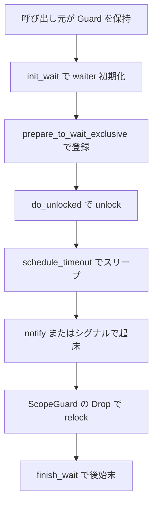

# 第12章 CondVar と Completion と待機

> 本章で読むソース
>
> - [`rust/kernel/sync/condvar.rs`](https://github.com/gregkh/linux/blob/v6.18.38/rust/kernel/sync/condvar.rs)
> - [`rust/kernel/sync/completion.rs`](https://github.com/gregkh/linux/blob/v6.18.38/rust/kernel/sync/completion.rs)
> - [`rust/kernel/sync/lock.rs`](https://github.com/gregkh/linux/blob/v6.18.38/rust/kernel/sync/lock.rs)

## この章の狙い

C の `struct wait_queue_head` を `CondVar` としてラップし、ロックを保持したまま「解放して眠り、起床時に再取得する」操作を型で表現する経路を追う。
`Completion` が一度きりの完了ラッチとして CondVar とどう意味論が異なるかも対比する。

## 前提

[第11章](11-lock-mutex-spinlock.md) で `Guard`、`Backend`、`do_unlocked` を読んでいること。
[第7章](../part01-language-foundation/07-pin-init.md) で `#[pin_data]`、`pin_init!`、`Opaque::ffi_init` を読んでいること。
本章では pin 初期化の文法そのものは再解説せず、CondVar と Completion への応用に絞る。

## CondVar の構造と pin 初期化

`CondVar` は `Opaque<bindings::wait_queue_head>` を先頭に持つ `#[pin_data]` 構造体である。
wait queue の `list_head` は自己参照的なため、初期化後は移動できない。

[`rust/kernel/sync/condvar.rs` L81-L92](https://github.com/gregkh/linux/blob/v6.18.38/rust/kernel/sync/condvar.rs#L81-L92)

```rust
#[pin_data]
pub struct CondVar {
    #[pin]
    pub(crate) wait_queue_head: Opaque<bindings::wait_queue_head>,

    /// A condvar needs to be pinned because it contains a [`struct list_head`] that is
    /// self-referential, so it cannot be safely moved once it is initialised.
    ///
    /// [`struct list_head`]: srctree/include/linux/types.h
    #[pin]
    _pin: PhantomPinned,
}
```

`CondVar::new` は [第7章](../part01-language-foundation/07-pin-init.md) と同型の `pin_init!` + `Opaque::ffi_init` で `__init_waitqueue_head` を呼ぶ。

[`rust/kernel/sync/condvar.rs` L102-L112](https://github.com/gregkh/linux/blob/v6.18.38/rust/kernel/sync/condvar.rs#L102-L112)

```rust
impl CondVar {
    /// Constructs a new condvar initialiser.
    pub fn new(name: &'static CStr, key: Pin<&'static LockClassKey>) -> impl PinInit<Self> {
        pin_init!(Self {
            _pin: PhantomPinned,
            // SAFETY: `slot` is valid while the closure is called and both `name` and `key` have
            // static lifetimes so they live indefinitely.
            wait_queue_head <- Opaque::ffi_init(|slot| unsafe {
                bindings::__init_waitqueue_head(slot, name.as_char_ptr(), key.as_ptr())
            }),
        })
    }
```

## wait_internal と lost wakeup 回避

lost wakeup を避ける核心は、`do_unlocked` だけでなく `wait_internal` 内の登録先行の順序にある。
`init_wait` と `prepare_to_wait_exclusive` で waiter を wait queue に登録した後で、`do_unlocked` により guard を unlock する。

[`rust/kernel/sync/condvar.rs` L114-L137](https://github.com/gregkh/linux/blob/v6.18.38/rust/kernel/sync/condvar.rs#L114-L137)

```rust
    fn wait_internal<T: ?Sized, B: Backend>(
        &self,
        wait_state: c_int,
        guard: &mut Guard<'_, T, B>,
        timeout_in_jiffies: c_long,
    ) -> c_long {
        let wait = Opaque::<bindings::wait_queue_entry>::uninit();

        // SAFETY: `wait` points to valid memory.
        unsafe { bindings::init_wait(wait.get()) };

        // SAFETY: Both `wait` and `wait_queue_head` point to valid memory.
        unsafe {
            bindings::prepare_to_wait_exclusive(self.wait_queue_head.get(), wait.get(), wait_state)
        };

        // SAFETY: Switches to another thread. The timeout can be any number.
        let ret = guard.do_unlocked(|| unsafe { bindings::schedule_timeout(timeout_in_jiffies) });

        // SAFETY: Both `wait` and `wait_queue_head` point to valid memory.
        unsafe { bindings::finish_wait(self.wait_queue_head.get(), wait.get()) };

        ret
    }
```

unlock 直後に notifier が走っても、既に登録済みの waiter に wakeup が届く。
起床後は `ScopeGuard` による relock のあと `finish_wait` で後始末する。

ただしこの窓が閉じるのは、待機側が predicate を Guard の lock 下で確認し、通知側も同じ predicate の変更を同じ lock で直列化するという、標準的な CondVar の利用契約を呼び出し側が守っている場合に限る。
`CondVar` と `Guard` の型は predicate や notifier がどの lock と対応するかを型で結び付けないため、この直列化は呼び出し側の責務である。

`do_unlocked` は [第11章](11-lock-mutex-spinlock.md) で説明した `Backend::unlock` → `ScopeGuard` で `relock` を予約 → コールバック実行の順である。

[`rust/kernel/sync/lock.rs` L233-L243](https://github.com/gregkh/linux/blob/v6.18.38/rust/kernel/sync/lock.rs#L233-L243)

```rust
    pub(crate) fn do_unlocked<U>(&mut self, cb: impl FnOnce() -> U) -> U {
        // SAFETY: The caller owns the lock, so it is safe to unlock it.
        unsafe { B::unlock(self.lock.state.get(), &self.state) };

        let _relock = ScopeGuard::new(||
                // SAFETY: The lock was just unlocked above and is being relocked now.
                unsafe { B::relock(self.lock.state.get(), &mut self.state) });

        cb()
    }
```

### 高速化と最適化の工夫

C 実装では unlock と relock の対称性はレビューと規約で守るしかない。
Rust 側では `ScopeGuard` の `Drop` が relock を実行するため、コールバック内の早期 return を含む通常の scope exit でも対称性が保たれる。
kernel の panic-abort 経路から復帰してロック状態を保つ保証ではない点に注意する。

## wait 系 API の共通化

`wait`、`wait_interruptible`、`wait_interruptible_freezable`、`wait_interruptible_timeout` は `wait_state` とタイムアウト有無だけが異なる。
共通処理は private の `wait_internal` に集約されている。

[`rust/kernel/sync/condvar.rs` L145-L147](https://github.com/gregkh/linux/blob/v6.18.38/rust/kernel/sync/condvar.rs#L145-L147)

```rust
    pub fn wait<T: ?Sized, B: Backend>(&self, guard: &mut Guard<'_, T, B>) {
        self.wait_internal(TASK_UNINTERRUPTIBLE, guard, MAX_SCHEDULE_TIMEOUT);
    }
```

`wait_interruptible` は `#[must_use]` 属性付きで、シグナル pending の見落としを防ぐ。

[`rust/kernel/sync/condvar.rs` L155-L159](https://github.com/gregkh/linux/blob/v6.18.38/rust/kernel/sync/condvar.rs#L155-L159)

```rust
    #[must_use = "wait_interruptible returns if a signal is pending, so the caller must check the return value"]
    pub fn wait_interruptible<T: ?Sized, B: Backend>(&self, guard: &mut Guard<'_, T, B>) -> bool {
        self.wait_internal(TASK_INTERRUPTIBLE, guard, MAX_SCHEDULE_TIMEOUT);
        crate::current!().signal_pending()
    }
```

## spurious wakeup と呼び出し側の責務

`CondVar` は `notify_one`/`notify_all` 以外でも起床しうる spurious wakeup がある。
呼び出し側は条件をループでチェックする責務を負う。

[`rust/kernel/sync/condvar.rs` L57-L63](https://github.com/gregkh/linux/blob/v6.18.38/rust/kernel/sync/condvar.rs#L57-L63)

```rust
/// /// Waits for `e.value` to become `v`.
/// fn wait_for_value(e: &Example, v: u32) {
///     let mut guard = e.value.lock();
///     while *guard != v {
///         e.value_changed.wait(&mut guard);
///     }
/// }
```

`notify_one` は sticky ではない。
待機者がいなければ通知は失われる。

[`rust/kernel/sync/condvar.rs` L225-L232](https://github.com/gregkh/linux/blob/v6.18.38/rust/kernel/sync/condvar.rs#L225-L232)

```rust
    /// Wakes a single waiter up, if any.
    ///
    /// This is not 'sticky' in the sense that if no thread is waiting, the notification is lost
    /// completely (as opposed to automatically waking up the next waiter).
    #[inline]
    pub fn notify_one(&self) {
        self.notify(1);
    }
```

### CondVar::wait のシーケンス



登録先行は prepare_node から unlock_node の順である。
relock は ScopeGuard による scope exit 時に実行される。

## Completion と CondVar の対比

`Completion` は「一度完了したら永続的に完了状態」となるラッチである。
CondVar の繰り返し notify/wait とは意味論が異なる。

[`rust/kernel/sync/completion.rs` L93-L100](https://github.com/gregkh/linux/blob/v6.18.38/rust/kernel/sync/completion.rs#L93-L100)

```rust
    /// Signal all tasks waiting on this completion.
    ///
    /// This method wakes up all tasks waiting on this completion; after this operation the
    /// completion is permanently done, i.e. signals all current and future waiters.
    pub fn complete_all(&self) {
        // SAFETY: `self.as_raw()` is a pointer to a valid `struct completion`.
        unsafe { bindings::complete_all(self.as_raw()) };
    }
```

`wait_for_completion` は non-interruptible で timeout もない。

[`rust/kernel/sync/completion.rs` L102-L111](https://github.com/gregkh/linux/blob/v6.18.38/rust/kernel/sync/completion.rs#L102-L111)

```rust
    /// Wait for completion of a task.
    ///
    /// This method waits for the completion of a task; it is not interruptible and there is no
    /// timeout.
    ///
    /// See also [`Completion::complete_all`].
    pub fn wait_for_completion(&self) {
        // SAFETY: `self.as_raw()` is a pointer to a valid `struct completion`.
        unsafe { bindings::wait_for_completion(self.as_raw()) };
    }
```

`Completion::new` も CondVar と同型の `pin_init!` + `Opaque::ffi_init` パターンである。

## 7.1.3 との対比

`completion.rs` は v6.18.38 と v7.1.3 で内容が同一である。
`diff` 照合で差分ゼロを確認した。

`condvar.rs` は import 文のみ変化した。
`str::CStr` 単体から `str::{CStr, CStrExt as _}` へ切り替わり、`as_char_ptr` が `CStrExt` トレイトのメソッドへ移った。
呼び出しコードと API は不変である。

比較版 v7.1.3。

[`rust/kernel/sync/condvar.rs` L9-L11](https://github.com/gregkh/linux/blob/v7.1.3/rust/kernel/sync/condvar.rs#L9-L11)

```rust
use crate::{
    ffi::{c_int, c_long},
    str::{CStr, CStrExt as _},
```

CondVar と Completion に関しては 7.x で機能拡張はない。
[第13章](13-rcu-atomic.md) の atomic 層とは対照的である。

## まとめ

`CondVar` は `prepare_to_wait_exclusive` の登録先行により、呼び出し側が predicate を同じ lock で直列化する契約を守る前提で lost wakeup を避ける。
`do_unlocked` の `ScopeGuard` が unlock と relock の対称性を RAII で保つ。
`Completion` は永続的な完了ラッチであり、CondVar の繰り返し待機とは意味論が異なる。
v7.1.3 でも CondVar と Completion の契約は不変である。

## 関連する章

- [第7章 pin-init によるピン留め初期化](../part01-language-foundation/07-pin-init.md)
- [第11章 Lock 抽象と Mutex と SpinLock と locked_by](11-lock-mutex-spinlock.md)
- [第13章 RCU とアトミックとメモリオーダリング](13-rcu-atomic.md)
