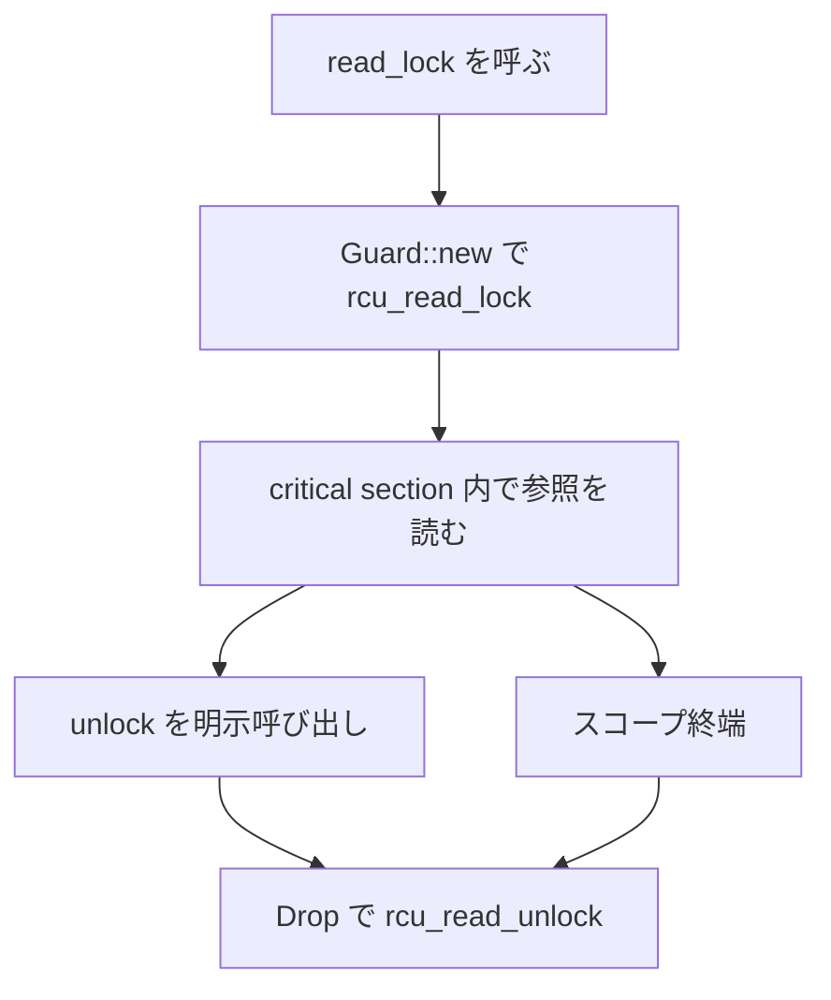
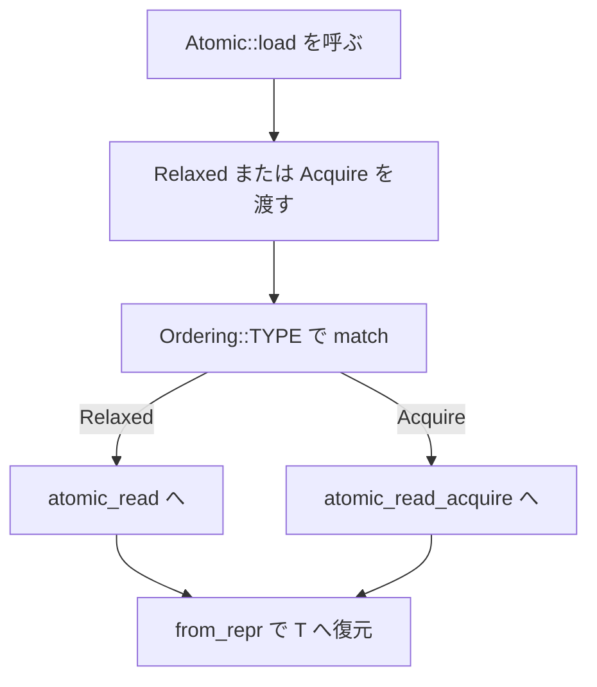

# 第13章 RCU とアトミックとメモリオーダリング

> 本章で読むソース
>
> - [`rust/kernel/sync/rcu.rs`](https://github.com/gregkh/linux/blob/v6.18.38/rust/kernel/sync/rcu.rs)
> - [`rust/kernel/sync/atomic.rs`](https://github.com/gregkh/linux/blob/v6.18.38/rust/kernel/sync/atomic.rs)
> - [`rust/kernel/sync/atomic/ordering.rs`](https://github.com/gregkh/linux/blob/v6.18.38/rust/kernel/sync/atomic/ordering.rs)
> - [`rust/kernel/sync/atomic/internal.rs`](https://github.com/gregkh/linux/blob/v6.18.38/rust/kernel/sync/atomic/internal.rs)
> - [`rust/kernel/sync/atomic/predefine.rs`](https://github.com/gregkh/linux/blob/v6.18.38/rust/kernel/sync/atomic/predefine.rs)
> - [`rust/kernel/sync/barrier.rs`](https://github.com/gregkh/linux/blob/v6.18.38/rust/kernel/sync/barrier.rs)

## この章の狙い

RCU read-side critical section を `Guard` 型で表現する設計と、LKMM 準拠の `Atomic<T>` が C 側 atomic API へどう接続するかを追う。
メモリオーダリングを型で制限する二段構えと、7.x での atomic 層の大幅拡張を対比する。

## 前提

[第6章](../part01-language-foundation/06-types-opaque-aref.md) で `Opaque<T>` と `NotThreadSafe` を読んでいること。
[第12章](12-condvar-completion.md) でスレッド待機の抽象を読んでいること。

## RCU Guard による証拠型

`rcu::Guard` は RCU read-side lock が保持されている証拠を表す。
`Send` を実装せず、read lock が per-CPU/per-thread の状態であり別スレッドへ持ち出せないことを型で強制する。

[`rust/kernel/sync/rcu.rs` L9-L16](https://github.com/gregkh/linux/blob/v6.18.38/rust/kernel/sync/rcu.rs#L9-L16)

```rust
/// Evidence that the RCU read side lock is held on the current thread/CPU.
///
/// The type is explicitly not `Send` because this property is per-thread/CPU.
///
/// # Invariants
///
/// The RCU read side lock is actually held while instances of this guard exist.
pub struct Guard(NotThreadSafe);
```

`Guard::new` は `rcu_read_lock` を呼び、`unlock` は空実装である。
呼び出すことで `self` の所有権を消費し、`Drop` が `rcu_read_unlock` を実行する。

[`rust/kernel/sync/rcu.rs` L18-L30](https://github.com/gregkh/linux/blob/v6.18.38/rust/kernel/sync/rcu.rs#L18-L30)

```rust
impl Guard {
    /// Acquires the RCU read side lock and returns a guard.
    #[inline]
    pub fn new() -> Self {
        // SAFETY: An FFI call with no additional requirements.
        unsafe { bindings::rcu_read_lock() };
        // INVARIANT: The RCU read side lock was just acquired above.
        Self(NotThreadSafe)
    }

    /// Explicitly releases the RCU read side lock.
    #[inline]
    pub fn unlock(self) {}
}
```

[`rust/kernel/sync/rcu.rs` L40-L46](https://github.com/gregkh/linux/blob/v6.18.38/rust/kernel/sync/rcu.rs#L40-L46)

```rust
impl Drop for Guard {
    #[inline]
    fn drop(&mut self) {
        // SAFETY: By the type invariants, the RCU read side is locked, so it is ok to unlock it.
        unsafe { bindings::rcu_read_unlock() };
    }
}
```

v6.18.38 の `rcu.rs` には `synchronize_rcu` は存在しない。
Rust 側にあるのは read-side critical section の型表現のみである。

### RCU read-side のライフサイクル



`unlock` の空実装は、ムーブによる早期解放を `Drop` に委ねる設計である。
[第12章](12-condvar-completion.md) の CondVar が明示的な待機 API を持つのとは対照的である。

## Atomic と LKMM

`Atomic<T>` は Rust 標準の `core::sync::atomic` を使わない。
カーネル内で唯一のメモリモデルは LKMM である。

[`rust/kernel/sync/atomic.rs` L3-L7](https://github.com/gregkh/linux/blob/v6.18.38/rust/kernel/sync/atomic.rs#L3-L7)

```rust
//! These primitives have the same semantics as their C counterparts: and the precise definitions of
//! semantics can be found at [`LKMM`]. Note that Linux Kernel Memory (Consistency) Model is the
//! only model for Rust code in kernel, and Rust's own atomics should be avoided.
```

[`rust/kernel/sync/atomic.rs` L49-L53](https://github.com/gregkh/linux/blob/v6.18.38/rust/kernel/sync/atomic.rs#L49-L53)

```rust
#[repr(transparent)]
pub struct Atomic<T: AtomicType>(AtomicRepr<T::Repr>);

// SAFETY: `Atomic<T>` is safe to share among execution contexts because all accesses are atomic.
unsafe impl<T: AtomicType> Sync for Atomic<T> {}
```

`AtomicType` は size/align 一致とラウンドトリップ transmute 可能性を safety 契約とする。

[`rust/kernel/sync/atomic.rs` L109-L112](https://github.com/gregkh/linux/blob/v6.18.38/rust/kernel/sync/atomic.rs#L109-L112)

```rust
pub unsafe trait AtomicType: Sized + Send + Copy {
    /// The backing atomic implementation type.
    type Repr: AtomicImpl;
}
```

## メモリオーダリングの型による制限

オーダリングは実行時引数ではなく、`Relaxed`/`Acquire`/`Release`/`Full` という空 struct 型として渡される。
`load` は `AcquireOrRelaxed`、`store` は `ReleaseOrRelaxed` で許される順序を型境界で制限する。

[`rust/kernel/sync/atomic/ordering.rs` L94-L104](https://github.com/gregkh/linux/blob/v6.18.38/rust/kernel/sync/atomic/ordering.rs#L94-L104)

```rust
/// The trait bound for operations that only support acquire or relaxed ordering.
pub trait AcquireOrRelaxed: Ordering {}

impl AcquireOrRelaxed for Acquire {}
impl AcquireOrRelaxed for Relaxed {}

/// The trait bound for operations that only support release or relaxed ordering.
pub trait ReleaseOrRelaxed: Ordering {}

impl ReleaseOrRelaxed for Release {}
impl ReleaseOrRelaxed for Relaxed {}
```

`load(Release)` のような無効な組み合わせはコンパイル時に弾かれる。

`load` は `Ordering::TYPE` の match で C 側 `atomic_read` または `atomic_read_acquire` へ振り分ける。

[`rust/kernel/sync/atomic.rs` L264-L275](https://github.com/gregkh/linux/blob/v6.18.38/rust/kernel/sync/atomic.rs#L264-L275)

```rust
    pub fn load<Ordering: ordering::AcquireOrRelaxed>(&self, _: Ordering) -> T {
        let v = {
            match Ordering::TYPE {
                OrderingType::Relaxed => T::Repr::atomic_read(&self.0),
                OrderingType::Acquire => T::Repr::atomic_read_acquire(&self.0),
                _ => build_error!("Wrong ordering"),
            }
        };

        // SAFETY: `v` comes from reading `self.0`, which is a valid `T` per the type invariants.
        unsafe { from_repr(v) }
    }
```

### Atomic::load のディスパッチ経路



### 高速化と最適化の工夫

C 側の `atomic_read`/`atomic_read_acquire`/`atomic64_read` 等の組み合わせ爆発を、`internal.rs` のマクロ群が宣言的に生成する。
`declare_atomic_method!` と `impl_atomic_method!` が型と操作とオーダリングの組み合わせを1:1 で C 関数へ接続する。

[`rust/kernel/sync/atomic/internal.rs` L20-L43](https://github.com/gregkh/linux/blob/v6.18.38/rust/kernel/sync/atomic/internal.rs#L20-L43)

```rust
/// A marker trait for types that implement atomic operations with C side primitives.
///
/// This trait is sealed, and only types that have directly mapping to the C side atomics should
/// impl this:
///
/// - `i32` maps to `atomic_t`.
/// - `i64` maps to `atomic64_t`.
pub trait AtomicImpl: Sized + Send + Copy + private::Sealed {
    /// The type of the delta in arithmetic or logical operations.
    ///
    /// For example, in `atomic_add(ptr, v)`, it's the type of `v`. Usually it's the same type of
    /// [`Self`], but it may be different for the atomic pointer type.
    type Delta;
}

// `atomic_t` implements atomic operations on `i32`.
impl AtomicImpl for i32 {
    type Delta = Self;
}

// `atomic64_t` implements atomic operations on `i64`.
impl AtomicImpl for i64 {
    type Delta = Self;
}
```

v6.18.38 では `AtomicImpl` は `i32` と `i64` の2種類のみである。

## 定義済み型と barrier

`predefine.rs` は `i32`/`i64`/`isize`/`usize`/`u32`/`u64` への `AtomicType` 実装を提供する。

[`rust/kernel/sync/atomic/predefine.rs` L8-L19](https://github.com/gregkh/linux/blob/v6.18.38/rust/kernel/sync/atomic/predefine.rs#L8-L19)

```rust
// SAFETY: `i32` has the same size and alignment with itself, and is round-trip transmutable to
// itself.
unsafe impl super::AtomicType for i32 {
    type Repr = i32;
}

// SAFETY: The wrapping add result of two `i32`s is a valid `i32`.
unsafe impl super::AtomicAdd<i32> for i32 {
    fn rhs_into_delta(rhs: i32) -> i32 {
        rhs
    }
}
```

`barrier.rs` は `Atomic<T>` の RMW 系とは独立した明示的バリアを提供する。
`CONFIG_SMP` 無効時はコンパイラバリアへ縮退する。

[`rust/kernel/sync/barrier.rs` L26-L33](https://github.com/gregkh/linux/blob/v6.18.38/rust/kernel/sync/barrier.rs#L26-L33)

```rust
pub fn smp_mb() {
    if cfg!(CONFIG_SMP) {
        // SAFETY: `smp_mb()` is safe to call.
        unsafe { bindings::smp_mb() };
    } else {
        barrier();
    }
}
```

## 7.1.3 との対比

`rcu.rs`、`ordering.rs`、`barrier.rs` は v6.18.38 と v7.1.3 で内容が同一である。
`diff` 照合で差分ゼロを確認した。

atomic 層は大幅に拡張された。
`atomic.rs` は 548行から850行、`internal.rs` は 265行から349行、`predefine.rs` は 180行から338行へ増加した。

### 対応型の拡大

v7.1.3 では `AtomicImpl` が `i8`/`i16`/`*const c_void` を加えた5種類へ拡張される。
`i8`/`i16`/ポインタは `{READ,WRITE}_ONCE` 相当の下位 C プリミティブで実装され、`CONFIG_ARCH_SUPPORTS_ATOMIC_RMW` を要求する。

[`rust/kernel/sync/atomic/internal.rs` L17-L53](https://github.com/gregkh/linux/blob/v7.1.3/rust/kernel/sync/atomic/internal.rs#L17-L53)

```rust
// The C side supports atomic primitives only for `i32` and `i64` (`atomic_t` and `atomic64_t`),
// while the Rust side also provides atomic support for `i8`, `i16` and `*const c_void` on top of
// lower-level C primitives.
impl private::Sealed for i8 {}
impl private::Sealed for i16 {}
impl private::Sealed for *const c_void {}
impl private::Sealed for i32 {}
impl private::Sealed for i64 {}
// ... (中略) ...
crate::static_assert!(
    cfg!(CONFIG_ARCH_SUPPORTS_ATOMIC_RMW),
    "The current implementation of atomic i8/i16/ptr relies on the architecure being \
    ARCH_SUPPORTS_ATOMIC_RMW"
);
```

`predefine.rs` には `bool`、`i8`、`i16`、生ポインタ型が追加された。

[`rust/kernel/sync/atomic/predefine.rs` L13-L50](https://github.com/gregkh/linux/blob/v7.1.3/rust/kernel/sync/atomic/predefine.rs#L13-L50)

```rust
// SAFETY: `bool` has the same size and alignment as `i8`, and Rust guarantees that `bool` has
// only two valid bit patterns: 0 (false) and 1 (true). Those are valid `i8` values, so `bool` is
// round-trip transmutable to `i8`.
unsafe impl super::AtomicType for bool {
    type Repr = i8;
}

// SAFETY: `i8` has the same size and alignment with itself, and is round-trip transmutable to
// itself.
unsafe impl super::AtomicType for i8 {
    type Repr = i8;
}

// SAFETY: `i16` has the same size and alignment with itself, and is round-trip transmutable to
// itself.
unsafe impl super::AtomicType for i16 {
    type Repr = i16;
}

// SAFETY:
//
// - `*mut T` has the same size and alignment with `*const c_void`, and is round-trip
//   transmutable to `*const c_void`.
// - `*mut T` is safe to transfer between execution contexts. See the safety requirement of
//   [`AtomicType`].
unsafe impl<T: Sized> super::AtomicType for *mut T {
    type Repr = *const c_void;
}

// SAFETY:
//
// - `*const T` has the same size and alignment with `*const c_void`, and is round-trip
//   transmutable to `*const c_void`.
// - `*const T` is safe to transfer between execution contexts. See the safety requirement of
//   [`AtomicType`].
unsafe impl<T: Sized> super::AtomicType for *const T {
    type Repr = *const c_void;
}
```

### Send 緩和と Atomic への Send 追加

v6.18.38 では `AtomicType: Sized + Send + Copy` だった。
v7.1.3 では `Sized + Copy` に緩和し、代わりに `Atomic<T>` 自体に `unsafe impl Send` が追加された。
`!Send` の生ポインタ型を `AtomicType` として扱えるようにするための設計変更である。

比較版 v7.1.3。

[`rust/kernel/sync/atomic.rs` L54-L59](https://github.com/gregkh/linux/blob/v7.1.3/rust/kernel/sync/atomic.rs#L54-L59)

```rust
// SAFETY: `Atomic<T>` is safe to transfer between execution contexts because of the safety
// requirement of `AtomicType`.
unsafe impl<T: AtomicType> Send for Atomic<T> {}

// SAFETY: `Atomic<T>` is safe to share among execution contexts because all accesses are atomic.
unsafe impl<T: AtomicType> Sync for Atomic<T> {}
```

[`rust/kernel/sync/atomic.rs` L121-L124](https://github.com/gregkh/linux/blob/v7.1.3/rust/kernel/sync/atomic.rs#L121-L124)

```rust
pub unsafe trait AtomicType: Sized + Copy {
    /// The backing atomic implementation type.
    type Repr: AtomicImpl;
}
```

### 新規 API

`fetch_sub`、`Debug` 実装、`Flag`/`AtomicFlag`、生ポインタ向け `atomic_load`/`atomic_store` 等が追加された。

[`rust/kernel/sync/atomic.rs` L600-L620](https://github.com/gregkh/linux/blob/v7.1.3/rust/kernel/sync/atomic.rs#L600-L620)

```rust
    pub fn fetch_sub<Rhs, Ordering: ordering::Ordering>(&self, v: Rhs, _: Ordering) -> T
    where
        // Types that support addition also support subtraction.
        T: AtomicAdd<Rhs>,
    {
        let v = T::rhs_into_delta(v);

        // INVARIANT: `self.0` is a valid `T` after `atomic_fetch_sub*()` due to safety requirement
        // of `AtomicAdd`.
        let ret = {
            match Ordering::TYPE {
                OrderingType::Full => T::Repr::atomic_fetch_sub(&self.0, v),
                OrderingType::Acquire => T::Repr::atomic_fetch_sub_acquire(&self.0, v),
                OrderingType::Release => T::Repr::atomic_fetch_sub_release(&self.0, v),
                OrderingType::Relaxed => T::Repr::atomic_fetch_sub_relaxed(&self.0, v),
            }
        };

        // SAFETY: `ret` comes from reading `self.0`, which is a valid `T` per type invariants.
        unsafe { from_repr(ret) }
    }
```

[`rust/kernel/sync/atomic.rs` L762-L773](https://github.com/gregkh/linux/blob/v7.1.3/rust/kernel/sync/atomic.rs#L762-L773)

```rust
pub unsafe fn atomic_load<T: AtomicType, Ordering: ordering::AcquireOrRelaxed>(
    ptr: *mut T,
    o: Ordering,
) -> T
where
    T::Repr: AtomicBasicOps,
{
    // SAFETY: Per the function safety requirement, `ptr` is valid and aligned to
    // `align_of::<T>()`, and all concurrent stores from kernel are atomic, hence no data race per
    // LKMM.
    unsafe { Atomic::from_ptr(ptr) }.load(o)
}
```

`internal.rs` のマクロは `declare_atomic_ops_trait!`/`impl_atomic_ops_for_one!` へ再設計され、任意個の型へ展開できる形に一般化された。
`AtomicBasicOps`/`AtomicExchangeOps` は5型、`AtomicArithmeticOps` は従来通り `i32`/`i64` の2型のみに適用される。

7.x の atomic 拡張は、対応型の拡大、型システム表現力の向上、C 下位プリミティブへのマクロ接続の一般化の三方向で進んでいる。

## まとめ

RCU の `Guard` は証拠型として read-side critical section を表し、`Send` を実装しない。
`Atomic<T>` は LKMM 準拠で Rust 標準 atomics を避け、オーダリングを型と sealed トレイトでコンパイル時に制限する。
v7.1.3 では atomic 層が型種別と API の両面で大幅に拡張された一方、RCU と ordering と barrier は契約不変である。

## 関連する章

- [第6章 型の基盤 Opaque と ARef と ForeignOwnable](../part01-language-foundation/06-types-opaque-aref.md)
- [第11章 Lock 抽象と Mutex と SpinLock と locked_by](11-lock-mutex-spinlock.md)
- [第12章 CondVar と Completion と待機](12-condvar-completion.md)
- [第14章 侵入型リストと ListArc](../part04-data-structures/14-intrusive-list.md)
