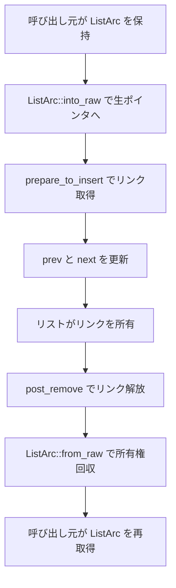

# 第14章 侵入型リストと ListArc

> 本章で読むソース
>
> - [`rust/kernel/list.rs`](https://github.com/gregkh/linux/blob/v6.18.38/rust/kernel/list.rs)
> - [`rust/kernel/list/arc.rs`](https://github.com/gregkh/linux/blob/v6.18.38/rust/kernel/list/arc.rs)
> - [`rust/kernel/list/arc_field.rs`](https://github.com/gregkh/linux/blob/v6.18.38/rust/kernel/list/arc_field.rs)
> - [`rust/kernel/list/impl_list_item_mod.rs`](https://github.com/gregkh/linux/blob/v6.18.38/rust/kernel/list/impl_list_item_mod.rs)

## この章の狙い

`List<T, ID>` がノードを別途確保せず、`ListLinks` フィールドを直接リンクとして使う侵入型リストの設計を追う。
`ListArc<T, ID>` が「同時に1つのリストにのみ属す」性質をどう保証するかを、`ListArcSafe` 契約と tracked/untracked 戦略から説明する。

## 前提

[第10章](../part03-synchronization/10-arc-refcount.md) で `Arc` と `UniqueArc` を読んでいること。
[第7章](../part01-language-foundation/07-pin-init.md) で `pin_init!` と `#[pin_data]` を読んでいること。
[第11章](../part03-synchronization/11-lock-mutex-spinlock.md) でロック抽象を読んでいること。

## 侵入型リストの設計思想

`List<T, ID>` は要素を別途確保しない。
`T` 自身に `ListLinks<ID>` フィールドを埋め込み、そのフィールドのアドレスを直接リンクとして使う。

[`rust/kernel/list.rs` L25-L37](https://github.com/gregkh/linux/blob/v6.18.38/rust/kernel/list.rs#L25-L37)

```rust
/// A linked list.
///
/// All elements in this linked list will be [`ListArc`] references to the value. Since a value can
/// only have one `ListArc` (for each pair of prev/next pointers), this ensures that the same
/// prev/next pointers are not used for several linked lists.
///
/// # Invariants
///
/// * If the list is empty, then `first` is null. Otherwise, `first` points at the `ListLinks`
///   field of the first element in the list.
/// * All prev/next pointers in `ListLinks` fields of items in the list are valid and form a cycle.
/// * For every item in the list, the list owns the associated [`ListArc`] reference and has
///   exclusive access to the `ListLinks` field.
```

`ListLinksFields` が next/prev の生表現であり、`ListLinks<ID>` はそれを `Opaque` で包む。

[`rust/kernel/list.rs` L358-L375](https://github.com/gregkh/linux/blob/v6.18.38/rust/kernel/list.rs#L358-L375)

```rust
#[repr(C)]
#[derive(Copy, Clone)]
struct ListLinksFields {
    next: *mut ListLinksFields,
    prev: *mut ListLinksFields,
}

/// The prev/next pointers for an item in a linked list.
///
/// # Invariants
///
/// The fields are null if and only if this item is not in a list.
#[repr(transparent)]
pub struct ListLinks<const ID: u64 = 0> {
    // This type is `!Unpin` for aliasing reasons as the pointers are part of an intrusive linked
    // list.
    inner: Opaque<ListLinksFields>,
}
```

`ListLinks` は aliasing のため `!Unpin` である。
intrusive ポインタがリスト内で自己参照的に共有されるため、移動を禁止する。

## ListItem トレイトの4メソッド契約

`ListItem` は `view_links`、`view_value`、`prepare_to_insert`、`post_remove` の4メソッドを定義する。
いずれも `unsafe trait` の一部であり、実装者が契約を守ることが安全性の前提になる。

[`rust/kernel/list.rs` L293-L343](https://github.com/gregkh/linux/blob/v6.18.38/rust/kernel/list.rs#L293-L343)

```rust
pub unsafe trait ListItem<const ID: u64 = 0>: ListArcSafe<ID> {
    /// Views the [`ListLinks`] for this value.
    ///
    /// # Guarantees
    ///
    /// If there is a previous call to `prepare_to_insert` and there is no call to `post_remove`
    /// since the most recent such call, then this returns the same pointer as the one returned by
    /// the most recent call to `prepare_to_insert`.
    ///
    /// Otherwise, the returned pointer points at a read-only [`ListLinks`] with two null pointers.
    ///
    /// # Safety
    ///
    /// The provided pointer must point at a valid value. (It need not be in an `Arc`.)
    unsafe fn view_links(me: *const Self) -> *mut ListLinks<ID>;

    /// View the full value given its [`ListLinks`] field.
    ///
    /// Can only be used when the value is in a list.
    ///
    /// # Guarantees
    ///
    /// * Returns the same pointer as the one passed to the most recent call to `prepare_to_insert`.
    /// * The returned pointer is valid until the next call to `post_remove`.
    ///
    /// # Safety
    ///
    /// * The provided pointer must originate from the most recent call to `prepare_to_insert`, or
    ///   from a call to `view_links` that happened after the most recent call to
    ///   `prepare_to_insert`.
    /// * Since the most recent call to `prepare_to_insert`, the `post_remove` method must not have
    ///   been called.
    unsafe fn view_value(me: *mut ListLinks<ID>) -> *const Self;

    /// This is called when an item is inserted into a [`List`].
    ///
    /// # Guarantees
    ///
    /// The caller is granted exclusive access to the returned [`ListLinks`] until `post_remove` is
    /// called.
    ///
    /// # Safety
    ///
    /// * The provided pointer must point at a valid value in an [`Arc`].
    /// * Calls to `prepare_to_insert` and `post_remove` on the same value must alternate.
    /// * The caller must own the [`ListArc`] for this value.
    /// * The caller must not give up ownership of the [`ListArc`] unless `post_remove` has been
    ///   called after this call to `prepare_to_insert`.
    ///
    /// [`Arc`]: crate::sync::Arc
    unsafe fn prepare_to_insert(me: *const Self) -> *mut ListLinks<ID>;
```

`impl_list_item!` マクロは `container_of!` で link ポインタから値全体への逆変換を機械的に実装する。

[`rust/kernel/list/impl_list_item_mod.rs` L217-L222](https://github.com/gregkh/linux/blob/v6.18.38/rust/kernel/list/impl_list_item_mod.rs#L217-L222)

```rust
            unsafe fn view_value(me: *mut $crate::list::ListLinks<$num>) -> *const Self {
                // SAFETY: `me` originates from the most recent call to `prepare_to_insert`, so it
                // points at the field `$field` in a value of type `Self`. Thus, reversing that
                // operation is still in-bounds of the allocation.
                unsafe { $crate::container_of!(me, Self, $($field).*) }
            }
```

## ListArc の一意性保証

`ListArc` は `Arc<T>` のラッパーであり、ID ごとに同時に1個しか存在しない。

[`rust/kernel/list/arc.rs` L155-L168](https://github.com/gregkh/linux/blob/v6.18.38/rust/kernel/list/arc.rs#L155-L168)

```rust
/// # Invariants
///
/// * Each reference counted object has at most one `ListArc` for each value of `ID`.
/// * The tracking inside `T` is aware that a `ListArc` reference exists.
///
/// [`List`]: crate::list::List
#[repr(transparent)]
#[cfg_attr(CONFIG_RUSTC_HAS_COERCE_POINTEE, derive(core::marker::CoercePointee))]
pub struct ListArc<T, const ID: u64 = 0>
where
    T: ListArcSafe<ID> + ?Sized,
{
    arc: Arc<T>,
}
```

`#[repr(transparent)]` はレイアウト等価のための属性にすぎない。
一意性は次の組み合わせで担保される。

1. ID ごとの `ListArcSafe<ID>` 契約（トレイト自体は unsafe ではないが、`on_create_list_arc_from_unique`/`on_drop_list_arc` の `unsafe fn` を実装者が契約どおり実装する前提であり、派生する `TryNewListArc` と `ListItem` は `unsafe trait`）
2. `ListArc` が move-only であること
3. `untracked` 戦略では `UniqueArc` 経由に限定されること
4. `tracked_by` 戦略では `AtomicTracker` が CAS で更新すること

`untracked` は常に `ListArc` が存在すると主張し、`UniqueArc` からのみ生成できる。

[`rust/kernel/list/arc.rs` L86-L90](https://github.com/gregkh/linux/blob/v6.18.38/rust/kernel/list/arc.rs#L86-L90)

```rust
        impl$(<$($generics)*>)? $crate::list::ListArcSafe<$num> for $t {
            unsafe fn on_create_list_arc_from_unique(self: ::core::pin::Pin<&mut Self>) {}
            unsafe fn on_drop_list_arc(&self) {}
        }
```

`tracked_by` の `AtomicTracker` は compare_exchange で遷移する。

[`rust/kernel/list/arc.rs` L513-L520](https://github.com/gregkh/linux/blob/v6.18.38/rust/kernel/list/arc.rs#L513-L520)

```rust
unsafe impl<const ID: u64> TryNewListArc<ID> for AtomicTracker<ID> {
    fn try_new_list_arc(&self) -> bool {
        // INVARIANT: If this method returns true, then the boolean used to be false, and is no
        // longer false, so it is okay for the caller to create a new [`ListArc`].
        self.inner
            .compare_exchange(false, true, Ordering::Acquire, Ordering::Relaxed)
            .is_ok()
    }
}
```

### 高速化と最適化の工夫

C の intrusive list は prev/next の二重挿入をバグとして踏みやすい。
Rust 側では2経路それぞれで防がれる。

同一 `ListArc` の再利用は move-only のため、`into_raw` でリストへ預けると手元から失われ二重挿入できない。
共有 `Arc` から2個目の `ListArc` を作る経路は、`tracked_by` では CAS が失敗し、`untracked` ではそもそも `Arc` から作れない。
いずれも `ListArcSafe` の unsafe メソッドの契約を実装者が正しく守ることが前提である。

## into_raw と from_raw と Arc 変換の区別

公開 API の `into_raw`/`from_raw` は `ListArc` の所有権を `*const T` に預け／取り戻す変換である。
`Arc` との変換は別 API である。

[`rust/kernel/list/arc.rs` L344-L367](https://github.com/gregkh/linux/blob/v6.18.38/rust/kernel/list/arc.rs#L344-L367)

```rust
    /// Convert ownership of this `ListArc` into a raw pointer.
    ///
    /// The returned pointer is indistinguishable from pointers returned by [`Arc::into_raw`]. The
    /// tracking inside `T` will still think that a `ListArc` exists after this call.
    #[inline]
    pub fn into_raw(self) -> *const T {
        Arc::into_raw(Self::transmute_to_arc(self))
    }

    /// Take ownership of the `ListArc` from a raw pointer.
    ///
    /// # Safety
    ///
    /// * `ptr` must satisfy the safety requirements of [`Arc::from_raw`].
    /// * The value must not already have a `ListArc` reference.
    /// * The tracking inside `T` must think that there is a `ListArc` reference.
    #[inline]
    pub unsafe fn from_raw(ptr: *const T) -> Self {
        // SAFETY: The pointer satisfies the safety requirements for `Arc::from_raw`.
        let arc = unsafe { Arc::from_raw(ptr) };
        // SAFETY: The value doesn't already have a `ListArc` reference, but the tracking thinks it
        // does.
        unsafe { Self::transmute_from_arc(arc) }
    }
```

`into_arc` は `on_drop_list_arc` を呼び、追跡を「存在しない」へ更新する。
`transmute_from_arc`/`transmute_to_arc` は追跡を更新しない内部変換である。

## push_back と remove の所有権フロー

`insert_inner` は `ListArc::into_raw` で生ポインタへ所有権を移し、`prepare_to_insert` でリンクを取得する。

[`rust/kernel/list.rs` L489-L531](https://github.com/gregkh/linux/blob/v6.18.38/rust/kernel/list.rs#L489-L531)

```rust
    unsafe fn insert_inner(
        &mut self,
        item: ListArc<T, ID>,
        next: *mut ListLinksFields,
    ) -> *mut ListLinksFields {
        let raw_item = ListArc::into_raw(item);
        // SAFETY:
        // * We just got `raw_item` from a `ListArc`, so it's in an `Arc`.
        // * Since we have ownership of the `ListArc`, `post_remove` must have been called after
        //   the most recent call to `prepare_to_insert`, if any.
        // * We own the `ListArc`.
        // * Removing items from this list is always done using `remove_internal_inner`, which
        //   calls `post_remove` before giving up ownership.
        let list_links = unsafe { T::prepare_to_insert(raw_item) };
        // SAFETY: We have not yet called `post_remove`, so `list_links` is still valid.
        let item = unsafe { ListLinks::fields(list_links) };

        // Check if the list is empty.
        if next.is_null() {
            // SAFETY: The caller just gave us ownership of these fields.
            // INVARIANT: A linked list with one item should be cyclic.
            unsafe {
                (*item).next = item;
                (*item).prev = item;
            }
            self.first = item;
        } else {
            // SAFETY: By the type invariant, this pointer is valid or null. We just checked that
            // it's not null, so it must be valid.
            let prev = unsafe { (*next).prev };
            // SAFETY: Pointers in a linked list are never dangling, and the caller just gave us
            // ownership of the fields on `item`.
            // INVARIANT: This correctly inserts `item` between `prev` and `next`.
            unsafe {
                (*item).next = next;
                (*item).prev = prev;
                (*prev).next = item;
                (*next).prev = item;
            }
        }

        item
    }
```

`remove_internal_inner` は `post_remove` のあと `ListArc::from_raw` で所有権を回収する。

[`rust/kernel/list.rs` L677-L683](https://github.com/gregkh/linux/blob/v6.18.38/rust/kernel/list.rs#L677-L683)

```rust
        // SAFETY: `item` used to be in the list, so it is dereferenceable by the type invariants
        // of `List`.
        let list_links = unsafe { ListLinks::from_fields(item) };
        // SAFETY: Any pointer in the list originates from a `prepare_to_insert` call.
        let raw_item = unsafe { T::post_remove(list_links) };
        // SAFETY: The above call to `post_remove` guarantees that we can recreate the `ListArc`.
        unsafe { ListArc::from_raw(raw_item) }
```

### push_back と pop_front の状態遷移



## ListArcField

`ListArcField` は `ListArc` が特定フィールドへの排他アクセスを持つ契約を `UnsafeCell` で表現する。

[`rust/kernel/list/arc_field.rs` L41-L64](https://github.com/gregkh/linux/blob/v6.18.38/rust/kernel/list/arc_field.rs#L41-L64)

```rust
    /// Unsafely assert that you have shared access to the `ListArc` for this field.
    ///
    /// # Safety
    ///
    /// The caller must have shared access to the `ListArc<ID>` containing the struct with this
    /// field for the duration of the returned reference.
    pub unsafe fn assert_ref(&self) -> &T {
        // SAFETY: The caller has shared access to the `ListArc`, so they also have shared access
        // to this field.
        unsafe { &*self.value.get() }
    }

    /// Unsafely assert that you have mutable access to the `ListArc` for this field.
    ///
    /// # Safety
    ///
    /// The caller must have mutable access to the `ListArc<ID>` containing the struct with this
    /// field for the duration of the returned reference.
    #[expect(clippy::mut_from_ref)]
    pub unsafe fn assert_mut(&self) -> &mut T {
        // SAFETY: The caller has exclusive access to the `ListArc`, so they also have exclusive
        // access to this field.
        unsafe { &mut *self.value.get() }
    }
```

## 7.1.3 との対比

`list.rs` 本体は re-export の書式変更と `remove` のドキュメント注記追加のみで、API と実装は不変である。

`list/arc.rs` には実質的な変更がある。
`AtomicTracker` の内部表現が `core::sync::atomic::AtomicBool` から kernel の `AtomicFlag` に置き換わった。

比較版 v7.1.3。

[`rust/kernel/list/arc.rs` L494-L499](https://github.com/gregkh/linux/blob/v7.1.3/rust/kernel/list/arc.rs#L494-L499)

```rust
unsafe impl<const ID: u64> TryNewListArc<ID> for AtomicTracker<ID> {
    fn try_new_list_arc(&self) -> bool {
        // INVARIANT: If this method returns true, then the boolean used to be false, and is no
        // longer false, so it is okay for the caller to create a new [`ListArc`].
        self.inner.cmpxchg(false, true, ordering::Acquire).is_ok()
    }
}
```

`ListArc` の `CoercePointee` derive が無条件化され、非対応ツールチェイン向けの手動 `CoerceUnsized`/`DispatchFromDyn` 実装が削除された。
[第9章](../part02-memory-ownership/09-kbox-kvec.md) や [第10章](../part03-synchronization/10-arc-refcount.md) と同型の整理である。

[`rust/kernel/list/arc.rs` L162-L164](https://github.com/gregkh/linux/blob/v7.1.3/rust/kernel/list/arc.rs#L162-L164)

```rust
#[repr(transparent)]
#[derive(core::marker::CoercePointee)]
pub struct ListArc<T, const ID: u64 = 0>
```

## まとめ

侵入型リストは `ListLinks` を値に埋め込み、push/pop からアロケータ呼び出しを除く。
`ListArc` の一意性は `ListArcSafe` 契約と tracked/untracked 戦略で担保され、`into_raw`/`from_raw` は raw pointer との変換である。
v7.1.3 では `AtomicFlag` への移行と `CoercePointee` の簡素化が主な差分である。

## 関連する章

- [第7章 pin-init によるピン留め初期化](../part01-language-foundation/07-pin-init.md)
- [第10章 Arc とアトミック参照カウント](../part03-synchronization/10-arc-refcount.md)
- [第15章 RBTree と木の所有権モデル](15-rbtree.md)
